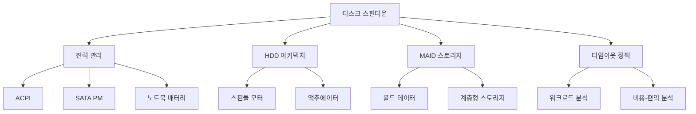

+++
title = "disk spin down"
date = "2026-03-14"
weight = 690
+++

# 디스크 스핀다운 (Disk Spin-down)

#### 핵심 인사이트 (3줄 요약)
> 1. **본질**: 유휴 상태 HDD (Hard Disk Drive)의 스핀들 모터를 정지시켜 전력 소모를 최소화하는 전력 관리 기술로, 모바일/데이터센터 환경의 에너지 효율성 핵심 메커니즘
> 2. **가치**: 디스크 대기 전력 70~90% 절감, 노트북 배터리 수명 20~40% 연장, 데이터센터 PUE (Power Usage Effectiveness) 5~15% 개선
> 3. **융합**: OS 전원 관리 (ACPI), 스토리지 계층화, MAID (Massive Array of Idle Disks) 아키텍처와 통합된 그린 컴퓨팅 전략

---

### Ⅰ. 개요 (Context & Background)

**개념 정의**

디스크 스핀다운(Disk Spin-down)은 일정 시간 동안 I/O 요청이 없는 HDD의 플래터를 회전시키는 스핀들 모터(Spindle Motor)를 정지시키는 전력 관리 기술입니다. HDD는 구동 중 모터 회전, 액추에이터 암 구동, 컨트롤러 동작으로 5~15W의 전력을 소모하지만, 스핀다운 상태에서는 0.5~2W 수준으로 전력 소모가 급감합니다. 스핀다운에서 스핀업(Spin-up)까지의 지연 시간(5~15초)과 모터 수명 영향을 고려하여, 워크로드 특성에 맞는 임계값(Timeout) 설정이 핵심입니다.

```
┌─────────────────────────────────────────────────────────────────────┐
│                    디스크 스핀다운 개념도                            │
├─────────────────────────────────────────────────────────────────────┤
│                                                                     │
│   ┌──────────────────────────────────────────────────────────────┐ │
│   │                    HDD 전력 상태 천이도                       │ │
│   │                                                              │ │
│   │   Active ──────────► Idle ──────────► Standby ──► Sleep     │ │
│   │   (활성)           (대기)          (스핀다운)    (완전절전)  │ │
│   │                                                               │ │
│   │   ┌───────────────────────────────────────────────────────┐  │ │
│   │   │                                                       │  │ │
│   │   │   Active (활성)                                       │  │ │
│   │   │   • 플래터 회전: 5,400 / 7,200 / 10,000 / 15,000 RPM  │  │ │
│   │   │   • 액추에이터 암: 시크 중                             │  │ │
│   │   │   • 전력: 8~15W                                        │  │ │
│   │   │   • 응답 지연: 0ms (즉시)                              │  │ │
│   │   │                                                       │  │ │
│   │   └───────────────────────────────────────────────────────┘  │ │
│   │                          │ I/O 없음 (초 단위)                │ │
│   │                          ▼                                   │ │
│   │   ┌───────────────────────────────────────────────────────┐  │ │
│   │   │                                                       │  │ │
│   │   │   Idle (대기)                                         │  │ │
│   │   │   • 플래터 회전 유지                                   │  │ │
│   │   │   • 액추에이터 암: 파킹 위치                           │  │ │
│   │   │   • 전력: 4~8W                                        │  │ │
│   │   │   • 응답 지연: 0ms (즉시)                              │  │ │
│   │   │                                                       │  │ │
│   │   └───────────────────────────────────────────────────────┘  │ │
│   │                          │ I/O 없음 (분 단위)                │ │
│   │                          ▼                                   │ │
│   │   ┌───────────────────────────────────────────────────────┐  │ │
│   │   │                                                       │  │ │
│   │   │   Standby (스핀다운)                                   │  │ │
│   │   │   • 플래터 정지                                        │  │ │
│   │   │   • 액추에이터 암: 파킹                                │  │ │
│   │   │   • 전력: 0.5~2W                                       │  │ │
│   │   │   • 응답 지연: 5~15초 (스핀업 필요)                    │  │ │
│   │   │                                                       │  │ │
│   │   └───────────────────────────────────────────────────────┘  │ │
│   │                          │ 장기 미사용 (시간/일 단위)        │ │
│   │                          ▼                                   │ │
│   │   ┌───────────────────────────────────────────────────────┐  │ │
│   │   │                                                       │  │ │
│   │   │   Sleep (완전 절전)                                    │  │ │
│   │   │   • 모든 전원 차단                                     │  │ │
│   │   │   • 전력: 0.1~0.5W                                     │  │ │
│   │   │   • 응답 지연: 15~30초 (재초기화 필요)                 │  │ │
│   │   │                                                       │  │ │
│   │   └───────────────────────────────────────────────────────┘  │ │
│   │                                                              │ │
│   └──────────────────────────────────────────────────────────────┘ │
│                                                                     │
└─────────────────────────────────────────────────────────────────────┘
```

> **해설**: HDD 전력 상태는 Active → Idle → Standby → Sleep으로 천이하며, 각 단계에서 전력 소모와 응답 지연이 상충 관계(Trade-off)를 가집니다. 스핀다운(Standby)은 플래터 회전을 멈추어 전력을 80~90% 절감하지만, 첫 I/O 요청 시 5~15초의 스핀업 지연이 발생합니다. 적절한 타임아웃 설정이 핵심입니다.

**💡 비유**: 마치 자동차의 아이들 스톱(Idle Stop) 기능과 같습니다. 신호 대기 중 엔진을 끄면 연료를 절약하지만, 출발할 때 다시 시동을 걸어야 하므로 잠시 지연이 발생합니다. 자주 끄고 켜면 오히려 비효율적이듯, 디스크도 사용 패턴에 따라 최적의 스핀다운 정책이 필요합니다.

**등장 배경**

① **기존 한계**: HDD 항시 구동 시 데이터센터 전력의 30~40%가 스토리지에 소모, PUE 악화
② **혁신적 패러다임**: 계층형 스토리지(Hot/Warm/Cold) + MAID (Massive Array of Idle Disks)로 유휴 디스크 스핀다운
③ **비즈니스 요구**: 녹색 데이터센터, 에너지 비용 절감, ESG 경영, 모바일 기기 배터리 수명 연장

**📢 섹션 요약 비유**: 디스크 스핀다운은 마치 자동차의 자동 시동 끄기(Idle Stop)와 같습니다. 잠시 멈출 때 엔진을 끄면 연료를 아끼지만, 다시 출발할 때 시동을 걸어야 하므로 상황에 맞게 사용해야 합니다.

---

### Ⅱ. 아키텍처 및 핵심 원리 (Deep Dive)

**구성 요소 상세 분석**

| 요소명 | 역할 | 내부 동작 | 프로토콜/규격 | 비유 |
|:---|:---|:---|:---|:---|
| **스핀들 모터** | 플래터 회전 구동 | BLDC (Brushless DC Motor), RPM 제어 | ATA/ATAPI | 자동차 엔진 |
| **액추에이터** | 헤드 위치 제어 | 보이스 코일 모터 (VCM), 서보 제어 | ATA/ATAPI | 핸들 |
| **전원 관리 컨트롤러** | 스핀다운/업 제어 | PM (Power Management) 상태 머신 | ACPI, SATA | 시동 스위치 |
| **타이머/카운터** | 유휴 시간 측정 | OS 또는 펌웨어 기반 타임아웃 | OS 스케줄러 | 초시계 |
| **캐시 버퍼** | 스핀업 중 I/O 큐잉 | DRAM 32~512MB, NCQ (Native Command Queuing) | SATA/SAS | 대기열 |
| **SM.A.R.T.** | 수명 모니터링 | 스핀업/다운 카운트, 모터 마모도 | S.M.A.R.T. | 주행거리계 |

**스핀다운/스핀업 상태 머신**

```
┌─────────────────────────────────────────────────────────────────────┐
│               HDD 스핀다운/스핀업 상태 천이도                        │
├─────────────────────────────────────────────────────────────────────┤
│                                                                     │
│                     ┌─────────────────┐                             │
│                     │     ACTIVE      │                             │
│                     │  (플래터 회전)   │                             │
│                     │   Power: 10W    │                             │
│                     │   Latency: 0ms  │                             │
│                     └────────┬────────┘                             │
│                              │                                      │
│              ┌───────────────┼───────────────┐                      │
│              │ I/O 완료      │               │ I/O 요청             │
│              ▼               │               ▼                      │
│   ┌──────────────────┐      │      ┌──────────────────┐            │
│   │      IDLE        │      │      │   PROCESSING     │            │
│   │  (회전 유지)      │      │      │   (I/O 처리)     │            │
│   │   Power: 5W      │      │      │   Power: 12W     │            │
│   │   Latency: 0ms   │      │      │   Latency: 0ms   │            │
│   └────────┬─────────┘      │      └────────┬─────────┘            │
│            │                │               │                       │
│            │ Timeout 도래   │               │                       │
│            │ (설정값: 5~60분)│               │                       │
│            ▼                │               │                       │
│   ┌──────────────────┐      │               │                       │
│   │  SPINNING DOWN   │      │               │                       │
│   │   (감속 중)       │      │               │                       │
│   │   Duration: 3~5s │      │               │                       │
│   │   Power: 5W → 2W │      │               │                       │
│   └────────┬─────────┘      │               │                       │
│            │                │               │                       │
│            │ 정지 완료      │               │                       │
│            ▼                │               │                       │
│   ┌──────────────────┐      │               │                       │
│   │    STANDBY       │◄─────┘               │                       │
│   │  (스핀다운 완료)  │                      │                       │
│   │   Power: 0.5W    │                      │                       │
│   │   Latency: N/A   │                      │                       │
│   └────────┬─────────┘                      │                       │
│            │                                │                       │
│            │ I/O 요청 도착                  │                       │
│            ▼                                │                       │
│   ┌──────────────────┐                      │                       │
│   │   SPINNING UP    │                      │                       │
│   │   (가속 중)       │                      │                       │
│   │   Duration: 5~15s│                      │                       │
│   │   Power: 15~25W  │                      │                       │
│   │   (Peak 전류)     │                      │                       │
│   └────────┬─────────┘                      │                       │
│            │                                │                       │
│            │ 정격 속도 도달                 │                       │
│            └────────────────────────────────┘                       │
│                              │                                      │
│                              ▼                                      │
│                     ┌─────────────────┐                             │
│                     │     ACTIVE      │                             │
│                     └─────────────────┘                             │
│                                                                     │
└─────────────────────────────────────────────────────────────────────┘
```

> **해설**: 스핀다운은 유휴 타임아웃 도래 시 3~5초에 걸쳐 모터를 감속시키며 진행됩니다. 반면 스핀업은 I/O 요청 시 즉시 시작되며, 5~15초가 소요되고 피크 전류(15~25W)가 흐릅니다. 잦은 스핀업/다운은 모터 수명을 단축시키고 전력 소모를 오히려 증가시킬 수 있습니다.

**심층 동작 원리: 스핀다운 의사결정**

① **유휴 시간 측정**
```
마지막 I/O 완료 시각(T_last) 기록
현재 시각(T_now) - T_last = 유휴 시간(T_idle)
```

② **타임아웃 비교**
```
if (T_idle >= T_timeout) {
    // 스핀다운 결정
    issue_standby_command();
} else {
    // 대기 유지
    continue_idle();
}
```

③ **워크로드 패턴 분석 (지능형)**
```
// 과거 I/O 패턴 학습
IAT (Inter-Arrival Time) 분석
if (평균_IAT > T_timeout * 2) {
    // 적극적 스핀다운
    aggressive_spindown();
} else if (버스트_패턴) {
    // 보수적 스핀다운
    conservative_spindown();
}
```

④ **스핀업 I/O 큐잉**
```
// 스핀업 중 I/O 요청 처리
spinup_queue.enqueue(new_io_request);
// 스핀업 완료 후 일괄 처리
on_spinup_complete() {
    while (!spinup_queue.empty()) {
        process_io(spinup_queue.dequeue());
    }
}
```

**핵심 알고리즘: 적응형 스핀다운 (Adaptive Spin-down)**

```c
// 적응형 스핀다운 알고리즘 (의사코드)
struct disk_statistics {
    uint64_t total_ios;           // 총 I/O 수
    uint64_t idle_periods;        // 유휴 구간 수
    uint64_t avg_idle_time;       // 평균 유휴 시간 (ms)
    uint64_t max_idle_time;       // 최대 유휴 시간 (ms)
    uint64_t spinup_count;        // 스핀업 횟수
    uint64_t total_energy_saved;  // 절감된 에너지 (mWh)
};

// 스핀다운 타임아웃 동적 조정
uint32_t calculate_adaptive_timeout(struct disk_statistics *stats) {
    // 기본 타임아웃
    uint32_t base_timeout = 5 * 60 * 1000;  // 5분 (ms)

    // 평균 유휴 시간 기반 조정
    if (stats->avg_idle_time > 10 * 60 * 1000) {
        // 평균 10분 이상 유휴 → 적극적 스핀다운
        base_timeout = 2 * 60 * 1000;  // 2분
    } else if (stats->avg_idle_time < 60 * 1000) {
        // 평균 1분 미만 유휴 → 보수적 스핀다운
        base_timeout = 30 * 60 * 1000;  // 30분
    }

    // 스핀업 빈도 페널티
    if (stats->spinup_count > 100) {  // 잦은 스핀업
        base_timeout *= 2;  // 타임아웃 2배 증가
    }

    // 에너지 절감 효과 고려
    if (stats->total_energy_saved > 1000) {  // mWh
        // 효과가 크면 더 적극적으로
        base_timeout *= 0.8;
    }

    return base_timeout;
}

// 스핀다운 비용-편익 분석
bool should_spindown(struct disk_statistics *stats, uint32_t idle_time) {
    uint32_t spinup_cost = 25 * 5;  // 25W × 5초 = 125Ws
    uint32_t standby_saving = (10 - 0.5) * (idle_time / 1000);  // 9.5W × 시간

    // 스핀업 비용 < 대기 전력 절감이면 스핀다운
    return (standby_saving > spinup_cost);
}
```

**📢 섹션 요약 비유**: 스핀다운 알고리즘은 마치 택시 기사가 "손님을 기다릴지, 자리를 뜰지" 결정하는 것과 같습니다. 손님이 자주 오면(빈번한 I/O) 기다리는 게 낫고, 한참 동안 안 오면(긴 유휴) 엔진을 끄고 기다리는 게 효율적입니다.

---

### Ⅲ. 융합 비교 및 다각도 분석 (Comparison & Synergy)

**기술 비교: HDD 스핀다운 vs SSD 전력 관리**

| 비교 항목 | HDD 스핀다운 | SSD DevSleep | SSD Slumber | PCIe ASPM |
|:---|:---:|:---:|:---:|:---:|
| **절전 효과** | 70~90% | 95%+ | 50~70% | 90%+ |
| **복구 시간** | 5~15초 | 20~50ms | 1~5ms | 10~100µs |
| **수명 영향** | 모터 마모 | 셀 웨어 X | 셀 웨어 X | 영향 없음 |
| **피크 전력** | 20~25W | 0W | 0.5W | 0.1W |
| **적용 시나리오** | 콜드 스토리지 | 모바일 SSD | 서버 SSD | PCIe 장치 |
| **전력 (동작/대기)** | 10W / 0.5W | 5W / 0.005W | 5W / 0.5W | 10W / 0.01W |

**과목 융합 관점: 스핀다운과 타 영역 시너지**

| 융합 영역 | 시너지 효과 | 구현 예시 |
|:---|:---|:---|
| **OS (운영체제)** | ACPI 전원 관리 통합 | Linux laptop-mode, Windows 전원 옵션 |
| **파일시스템** | 접근 패턴 기반 스핀다운 | atime 업데이트 지연, 로그 구조 FS |
| **데이터베이스** | 버퍼 캐시와 스핀다운 조정 | WAL 버퍼링, 체크포인트 스케줄링 |
| **가상화** | VM I/O 스케줄링 | 스핀다운 고려한 I/O 병합 |
| **네트워크** | NAS/WAN 스토리지 | 캐시 적중률과 스핀다운 연동 |

**스핀다운 타임아웃별 에너지 절감 시뮬레이션**

```
┌─────────────────────────────────────────────────────────────────────┐
│          스핀다운 타임아웃별 에너지 절감 분석 (24시간 기준)          │
├─────────────────────────────────────────────────────────────────────┤
│                                                                     │
│   에너지 소모 (Wh)                                                  │
│   ▲                                                                 │
│   │                                                                 │
│   │    240Wh ─┐  ┌────────────────────────────────────────────┐    │
│   │           │  │ No Spin-down (항상 활성)                    │    │
│   │           │  │ 10W × 24h = 240Wh                           │    │
│   │    200Wh ─┤  └────────────────────────────────────────────┘    │
│   │           │             ┌───────────────────────────────┐      │
│   │    160Wh ─┤             │ 60분 타임아웃                  │      │
│   │           │             │ 180Wh (25% 절감)               │      │
│   │    120Wh ─┤             └───────────────────────────────┘      │
│   │           │        ┌───────────────────────────────────┐       │
│   │     80Wh ─┤        │ 30분 타임아웃                      │       │
│   │           │        │ 120Wh (50% 절감)                   │       │
│   │     40Wh ─┤        └───────────────────────────────────┘       │
│   │           │   ┌───────────────────────────────────────┐       │
│   │     20Wh ─┤   │ 5분 타임아웃 (최적)                    │       │
│   │           │   │ 40Wh (83% 절감) ※ 너무 짧으면 역효과   │       │
│   │     10Wh ─┤   └───────────────────────────────────────┘       │
│   └───────────┴───────────────────────────────────────────────────▶│
│              No SD   60min   30min   10min   5min   1min           │
│                                                                     │
│   ※ 1분 타임아웃은 잦은 스핀업으로 인해 오히려 에너지 소모 증가     │
│   ※ 최적 타임아웃은 워크로드 패턴에 따라 5~30분 사이                 │
│                                                                     │
└─────────────────────────────────────────────────────────────────────┘
```

> **해설**: 스핀다운 타임아웃이 짧을수록 에너지 절감이 커 보이지만, 잦은 스핀업으로 인해 오히려 역효과가 발생할 수 있습니다. 1분 타임아웃은 스핀업 피크 전력 때문에 5분 타임아웃보다 에너지 소모가 클 수 있습니다. 워크로드 분석을 통한 최적 타임아웃 산정이 필수입니다.

**📢 섹션 요약 비유**: 스핀다운 타임아웃 설정은 마치 난방 보일러의 예약 설정과 같습니다. 너무 자주 끄고 켜면 에너지가 낭비되고, 너무 길게 켜두면 역시 낭비입니다. 집(워크로드)의 특성에 맞춰 최적의 설정이 필요합니다.

---

### Ⅳ. 실무 적용 및 기술사적 판단 (Strategy & Decision)

**실무 시나리오별 적용**

**시나리오 1: 노트북/모바일 기기**
- **문제**: 배터리 수명 4시간, 스토리지 전력 30% 차지
- **해결**: 적극적 스핀다운(2~5분 타임아웃), 배터리 30% 연장
- **의사결정**: 사용자 활동 모니터링, APM (Advanced Power Management) 연동

**시나리오 2: 아카이브 스토리지 (MAID)**
- **문제**: PB 규모 콜드 데이터, 90% 디스크 유휴
- **해결**: MAID 레벨 2 (순차적 스핀다운), PUE 10% 개선
- **의사결정**: 계층화(Tiering), 자주 접근하는 메타데이터만 SSD

**시나리오 3: VOD 스트리밍 서버**
- **문제**: 피크 시간 집중, 비피크 시간 디스크 낭비
- **해결**: 시간대별 스핀다운 정책, 비피크 시 70% 디스크 대기
- **의사결정**: 프리페칭으로 스핀업 지연 숨김

**도입 체크리스트**

| 구분 | 항목 | 확인 포인트 |
|:---|:---|:---|
| **기술적** | 워크로드 분석 | I/O 패턴, 평균 유휴 시간, 버스트 여부 |
| | 디스크 사양 | 스핀업 시간, 피크 전류, Start/Stop 주기 |
| | RAID 고려사항 | 스핀업 순차 제어 (Staggered Spin-up) |
| **운영적** | 타임아웃 설정 | 워크로드별 차등 설정 (Hot/Warm/Cold) |
| | 모니터링 | 스핀업 횟수, 누적 대기 시간, 에너지 절감량 |
| | SLA 영향 | 스핀업 지연이 응답 시간 SLA에 미치는 영향 |
| **보안적** | 데이터 가용성 | 스핀다운 중 암호화 키 관리 |

**안티패턴: 스핀다운 오용 사례**

| 안티패턴 | 문제점 | 올바른 접근 |
|:---|:---|:---|
| **과도한 스핀다운** | 1분 타임아웃 → 모터 수명 단축, 에너지 오히려 증가 | 워크로드 분석 후 5~30분 설정 |
| **고성능 HDD 스핀다운** | 15K RPM 엔터프라이즈 HDD → 스핀업 15초, 응답 지연 | 고성능 HDD는 스핀다운 비권장 |
| **RAID 동시 스핀업** | 모든 디스크 동시 스핀업 → PSU 과부하 | Staggered Spin-up (순차적 스핀업) |
| **데이터베이스 로그 디스크** | 로그 디스크 스핀다운 → 트랜잭션 지연 | 로그 디스크는 항상 활성 유지 |

**📢 섹션 요약 비유**: 스핀다운 도입은 마치 자동차의 아이들 스톱 기능을 설정하는 것과 같습니다. 고속도로(고성능 워크로드)에서는 끄는 게 낫고, 시내 주행(버스트 워크로드)에서는 상황에 따라, 장기 주차(아카이브)에서는 항상 켜두는 것이 효율적입니다.

---

### Ⅴ. 기대효과 및 결론 (Future & Standard)

**정량/정성 기대효과**

| 구분 | 도입 전 | 도입 후 | 개선효과 |
|:---|:---:|:---:|:---:|
| **디스크 대기 전력** | 8~10W | 0.5~2W | 80~95% 절감 |
| **데이터센터 PUE** | 1.6~1.8 | 1.5~1.6 | 5~10% 개선 |
| **노트북 배터리** | 4시간 | 5~6시간 | 25~50% 연장 |
| **디스크 수명** | 5년 | 4~5년 | ±20% (사용 패턴 의존) |
| **응답 지연 (최초 I/O)** | 0ms | 5~15초 | Trade-off |

**미래 전망**

1. **SMR/CMR 하이브리드**: SMR (Shingled Magnetic Recording) 드라이브의 캐시 영역 최적화
2. **AI 기반 예측 스핀다운**: ML (Machine Learning)로 I/O 패턴 예측, 선제적 스핀업/다운
3. **헬륨 HDD**: 마찰 감소로 스핀업 전력 30% 절감, 스핀다운 효과 증대
4. **MAMR/HAMR**: 에너지 효율적 신기술 HDD, 스핀다운과 병행

**참고 표준**

| 표준 | 내용 | 적용 |
|:---|:---|:---|
| **ACPI (Advanced Configuration and Power Interface)** | 전원 관리 표준 | D0~D3 상태 정의 |
| **SATA 3.0** | PHY 전원 관리 | DIPM/HIPM (Interface Power Management) |
| **ATA/ATAPI-7** | 스핀다운 명령 | STANDBY, IDLE 명령어 |
| **T13** | ATA 명령어 표준 | Power Management Feature Set |
| **ENERGY STAR** | 에너지 효율 인증 | 스토리지 장치 기준 |

**📢 섹션 요약 비유**: 디스크 스핀다운 기술의 미래는 마치 하이브리드 자동차의 진화와 같습니다. 초기에는 단순한 시동 끄기에서 시작해, 현재는 regenerative braking(회생 제동)처럼 I/O 패턴을 학습하여 에너지를 효율적으로 관리하고, 미래에는 AI가 운전자의 습관을 학습해 최적의 주행을 하듯, 디스크도 사용자 패턴을 학습해 최적의 전력 관리를 수행하게 됩니다.

---

### 📌 관련 개념 맵 (Knowledge Graph)



**연관 개념 링크**:
- ACPI 전원 관리 - OS 레벨 전원 제어
- MAID (Massive Array of Idle Disks) - 대규모 유휴 디스크 배열
- 계층형 스토리지 (Tiered Storage) - Hot/Warm/Cold 계층화
- HDD 아키텍처 - 하드디스크 내부 구조
- SSD 전력 관리 - SSD DevSleep/Slumber

---

### 👶 어린이를 위한 3줄 비유 설명

1. **잠자는 디스크**: 컴퓨터가 디스크(하드디스크)를 오랫동안 안 쓰면, 디스크를 "잠"들게 해서 전기를 아껴요. 마치 밤에 전등을 끄는 것과 같아요.

2. **깨우는 시간**: 잠든 디스크를 다시 쓰려면 5~15초 동안 "깨우는" 시간이 걸려요. 너무 자주 재우고 깨우면 오히려 전기를 더 쓰게 돼요.

3. **똑똑한 관리**: 컴퓨터가 언제 디스크를 쓸지 예측해서, 자면 좋을 때는 재우고, 금방 쓸 때는 깨어있게 해요. 마치 엄마가 아이 낮잠 시간을 정하는 것과 같아요!