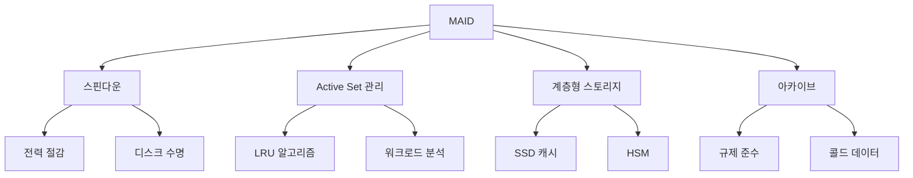

+++
title = "maid"
date = "2026-03-14"
weight = 691
+++

# MAID (Massive Array of Idle Disks)

#### 핵심 인사이트 (3줄 요약)
> 1. **본질**: 대용량 아카이브 스토리지에서 유휴 디스크를 선택적으로 스핀다운하여 전력 소모를 최소화하는 그린 스토리지 아키텍처
> 2. **가치**: 전력 소모 50~80% 절감, 데이터센터 냉각 비용 30~50% 감소, 디스크 수명 20~40% 연장
> 3. **융합**: 계층형 스토리지(Tiered Storage), 스핀다운 알고리즘, 오브젝트 스토리지와 통합된 에너지 효율 플랫폼

---

### Ⅰ. 개요 (Context & Background)

**개념 정의**

MAID (Massive Array of Idle Disks)는 수천~수만 개의 대용량 HDD (Hard Disk Drive) 배열에서 자주 접근하지 않는 콜드 데이터(Cold Data)를 저장하는 스토리지 시스템입니다. 모든 디스크를 항상 회전시키는 기존 RAID (Redundant Array of Independent Disks)와 달리, MAID는 접근하지 않는 디스크을 스핀다운(Spin-down)하여 대기 상태로 유지함으로써 전력 소모를 극적으로 줄입니다. Active 디스크 비율이 20~30% 수준인 아카이브 환경에서는 전력 절감 효과가 70% 이상에 달합니다.

```
┌─────────────────────────────────────────────────────────────────────┐
│                 MAID (Massive Array of Idle Disks) 개념도           │
├─────────────────────────────────────────────────────────────────────┤
│                                                                     │
│   ┌──────────────────────────────────────────────────────────────┐ │
│   │                    MAID Controller                            │ │
│   │  ┌────────────────────────────────────────────────────────┐  │ │
│   │  │  스핀다운 관리 엔진 (Spin-down Management Engine)      │  │ │
│   │  │  • 유휴 타임아웃: 5~30분                               │  │ │
│   │  │  • Active Set 관리: 동시 구동 디스크 수 제한           │  │ │
│   │  │  • 워크로드 예측: 접근 패턴 학습                       │  │ │
│   │  └────────────────────────────────────────────────────────┘  │ │
│   └──────────────────────────┬───────────────────────────────────┘ │
│                              │                                     │
│   ┌──────────────────────────▼───────────────────────────────────┐ │
│   │                    MAID Disk Array (100~10,000 disks)         │ │
│   │                                                              │ │
│   │  ┌─────────────────────────────────────────────────────────┐ │ │
│   │  │ Active Zone (20~30%)     │ Idle/Standby Zone (70~80%)  │ │ │
│   │  │                          │                             │ │ │
│   │  │  ┌───┐ ┌───┐ ┌───┐     │  ┌───┐ ┌───┐ ┌───┐ ┌───┐  │ │ │
│   │  │  │DIS│ │DIS│ │DIS│     │  │ZZZ│ │ZZZ│ │ZZZ│ │ZZZ│  │ │ │
│   │  │  │ 7 │ │ 2 │ │ 1 │     │  │ 3 │ │ 4 │ │ 5 │ │ 6 │  │ │ │
│   │  │  └───┘ └───┘ └───┘     │  └───┘ └───┘ └───┘ └───┘  │ │ │
│   │  │  회전 중 (10W/개)       │  스핀다운 (0.5W/개)         │ │ │
│   │  │  즉시 응답 가능          │  5~15초 스핀업 필요         │ │ │
│   │  │                          │                             │ │ │
│   │  │  Power: 30 disks × 10W   │  Power: 70 disks × 0.5W    │ │ │
│   │  │       = 300W             │       = 35W                │ │ │
│   │  └──────────────────────────────────────────────────────────┘ │
│   │                                                               │ │
│   │  전체 전력: 335W (vs 전체 구동 1,000W → 66.5% 절감)           │ │
│   │                                                              │ │
│   └──────────────────────────────────────────────────────────────┘ │
│                                                                     │
└─────────────────────────────────────────────────────────────────────┘
```

> **해설**: MAID 아키텍처의 핵심은 디스크를 Active Zone과 Idle/Standby Zone으로 동적 분할하는 것입니다. 자주 접근하는 데이터는 Active Zone에 배치하고, 나머지는 스핀다운 상태로 유지합니다. 위 예시에서 100개 디스크 기준 전체 구동 시 1,000W가 소모되지만, MAID 적용 시 335W로 66.5% 절감됩니다.

**💡 비유**: 마치 도서관의 책장과 같습니다. 자주 찾는 책은 열린 책장(Active Zone)에 두고, 오래된 책은 닫힌 창고(Idle Zone)에 보관합니다. 창고의 책은 필요할 때만 꺼내므로, 모든 책장에 조명을 켜두는 것보다 전기를 많이 아낍니다.

**등장 배경**

① **기존 한계**: 전통적 RAID는 모든 디스크 항시 구동 → 1PB 스토리지에 연간 $100,000+ 전력 비용
② **혁신적 패러다임**: 콜드 데이터(HDD) + 핫 데이터(SSD) 계층화 + MAID로 전력 효율 극대화
③ **비즈니스 요구**: 규제 준수(데이터 보관법), ESG 경영, 클라우드 백업 비용 절감

**📢 섹션 요약 비유**: MAID는 마치 호텔의 객실 관리와 같습니다. 모든 객실에 항상 조명과 난방을 켜두는 대신, 투숙객이 있는 객실(Active Zone)만 켜고 빈 객실(Idle Zone)은 최소 전력 상태로 유지하여 에너지를 절약합니다.

---

### Ⅱ. 아키텍처 및 핵심 원리 (Deep Dive)

**구성 요소 상세 분석**

| 요소명 | 역할 | 내부 동작 | 프로토콜/규격 | 비유 |
|:---|:---|:---|:---|:---|
| **MAID 컨트롤러** | 스핀다운 정책 관리 | 타임아웃 설정, Active Set 크기 제어, I/O 스케줄링 | SATA/SAS/NVMe | 호텔 매니저 |
| **Active Set** | 동시 구동 디스크 풀 | LRU (Least Recently Used) 기반 디스크 교체 | 커스텀 알고리즘 | 사용 객실 |
| **Idle Pool** | 스핀다운 디스크 풀 | Standby/Spin-down 상태 유지, 5~15초 스핀업 | SATA PM | 빈 객실 |
| **캐시 계층** | 스핀업 지연 숨김 | SSD/NVRAM 버퍼, 프리페칭, Write Coalescing | DRAM/SSD | 로비 |
| **메타데이터 서버** | 데이터 위치 추적 | 디스크 상태(DB), 위치 인덱스, 접근 패턴 분석 | KV Store | 객실 배정대 |
| **냉각 시스템** | 발열 관리 | Active Zone 집중 냉각, 가변 송풍 | CRAC | 에어컨 |

**MAID 동작 상태 머신**

```
┌─────────────────────────────────────────────────────────────────────┐
│                    MAID 디스크 상태 천이도                          │
├─────────────────────────────────────────────────────────────────────┤
│                                                                     │
│                     ┌─────────────────┐                             │
│                     │    ACTIVE       │                             │
│                     │  (회전 중)       │                             │
│                     │  Power: 10W     │                             │
│                     │  Latency: 0ms   │                             │
│                     └────────┬────────┘                             │
│                              │                                      │
│              ┌───────────────┼───────────────┐                      │
│              │ I/O 완료      │               │ I/O 요청             │
│              ▼               │               ▼                      │
│   ┌──────────────────┐      │      ┌──────────────────┐            │
│   │   ACTIVE_IDLE    │      │      │    PROCESSING    │            │
│   │  (회전 유지)      │      │      │    (I/O 처리)    │            │
│   │   Power: 6W      │      │      │    Power: 10W    │            │
│   │   Timeout: 10분   │      │      └──────────────────┘            │
│   └────────┬─────────┘      │                                      │
│            │                │                                      │
│            │ Active Set 초과│                                      │
│            │ LRU 교체       │                                      │
│            ▼                │                                      │
│   ┌──────────────────┐      │                                      │
│   │  SPINNING_DOWN   │      │                                      │
│   │   (감속 중)       │      │                                      │
│   │   Duration: 5s   │      │                                      │
│   └────────┬─────────┘      │                                      │
│            │                │                                      │
│            ▼                │                                      │
│   ┌──────────────────┐      │                                      │
│   │     IDLE         │◄─────┘                                      │
│   │  (스핀다운)       │                                             │
│   │   Power: 0.5W    │                                             │
│   │   Max Time: 무제한│                                            │
│   └────────┬─────────┘                                             │
│            │                                                       │
│            │ I/O 요청 (Read/Write)                                 │
│            ▼                                                       │
│   ┌──────────────────┐                                             │
│   │   SPINNING_UP    │                                             │
│   │   (가속 중)       │                                             │
│   │   Duration: 10s  │                                             │
│   │   Peak Power: 25W│                                             │
│   └────────┬─────────┘                                             │
│            │                                                       │
│            │ 정격 속도 도달                                        │
│            └───────────────────────────────────────────────────────┘│
│                              │                                      │
│                              ▼                                      │
│                     ┌─────────────────┐                             │
│                     │    ACTIVE       │                             │
│                     └─────────────────┘                             │
│                                                                     │
└─────────────────────────────────────────────────────────────────────┘
```

> **해설**: MAID 디스크는 Active → Active Idle → Idle(Spin-down) 상태로 천이합니다. Active Set 크기 제한에 도달하면 LRU(Least Recently Used) 알고리즘으로 가장 오래 사용하지 않은 디스크를 스핀다운합니다. 새 I/O 요청 시 스핀업(10초) 후 처리됩니다.

**심층 동작 원리: MAID Active Set 관리**

① **Active Set 크기 결정**
```
Active_Set_Size = 총_디스크_수 × Active_Ratio
Active_Ratio = 워크로드_특성에 따라 10~30%
예: 1,000개 디스크 × 20% = 200개 Active, 800개 Idle
```

② **LRU 기반 디스크 교체**
```
on_io_request(disk_id):
    if disk_id in Active_Set:
        move_to_head(disk_id)  # LRU 리스트 갱신
        process_io(disk_id)
    else:
        if Active_Set.size >= Max_Active:
            victim = lru_tail()  # 가장 오래 미사용 디스크
            spindown(victim)
            remove_from_active(victim)
        spinup(disk_id)
        add_to_active(disk_id)
        wait_for_spinup(disk_id)  # 10초 대기
        process_io(disk_id)
```

③ **워크로드 기반 적응형 조정**
```
adaptive_adjustment():
    if recent_hit_rate > 90%:
        # 캐시 적중률 높음 → Active Set 축소
        Max_Active = Max_Active × 0.9
    elif recent_hit_rate < 50%:
        # 캐시 적중률 낮음 → Active Set 확장
        Max_Active = Max_Active × 1.1
```

**핵심 알고리즘: MAID 전력 절감 계산**

```c
// MAID 전력 절감 시뮬레이션 (의사코드)
struct maid_config {
    int total_disks;        // 총 디스크 수
    float active_ratio;     // Active 비율 (0.0~1.0)
    float power_active;     // Active 전력 (W)
    float power_idle;       // Idle 전력 (W)
    float power_spinup;     // 스핀업 피크 전력 (W)
    int spinup_time;        // 스핀업 시간 (초)
    int avg_io_per_hour;    // 시간당 평균 I/O
};

float calculate_power_saving(struct maid_config *cfg) {
    int active_disks = (int)(cfg->total_disks * cfg->active_ratio);
    int idle_disks = cfg->total_disks - active_disks;

    // 기본 전력 (1시간 기준)
    float base_power = (active_disks * cfg->power_active +
                        idle_disks * cfg->power_idle);

    // 스핀업 추가 전력
    float spinup_power = (cfg->avg_io_per_hour * cfg->spinup_time / 3600.0) *
                         (cfg->power_spinup - cfg->power_active);

    float maid_power = base_power + spinup_power;

    // 전통적 RAID 전력 (전체 Active)
    float raid_power = cfg->total_disks * cfg->power_active;

    // 절감율 계산
    float saving_ratio = (raid_power - maid_power) / raid_power * 100;

    printf("MAID Power: %.1fW\n", maid_power);
    printf("RAID Power: %.1fW\n", raid_power);
    printf("Saving: %.1f%%\n", saving_ratio);

    return saving_ratio;
}

// 예시: 1,000개 디스크, 20% Active
// MAID: 200×10W + 800×0.5W + spinup_overhead = 2,400W
// RAID: 1,000×10W = 10,000W
// 절감: 76%
```

**📢 섹션 요약 비유**: MAID의 Active Set 관리는 마치 주차장의 효율적 운영과 같습니다. 1,000대 주차 공간 중 자주 사용하는 200대만 출입구 근처(Active Zone)에 두고, 나머지 800대는 외곽(Idle Zone)에 주차합니다. 출입구 차량은 즉시 출발 가능하지만, 외곽 차량은 이동 시간이 필요합니다.

---

### Ⅲ. 융합 비교 및 다각도 분석 (Comparison & Synergy)

**기술 비교: MAID vs 대용량 스토리지 아키텍처**

| 비교 항목 | MAID | RAID (전체 구동) | 오브젝트 스토리지 | 테이프 라이브러리 |
|:---|:---:|:---:|:---:|:---:|
| **전력 효율** | 매우 높음 (70%+ 절감) | 낮음 (기준) | 높음 (SSD 계층) | 최고 (0W 대기) |
| **접근 지연** | 5~15초 (스핀업) | 0ms (즉시) | 1~10ms (SSD) | 30~60초 (로딩) |
| **비용/GB** | 낮음 ($0.02~0.05) | 낮음 ($0.02~0.05) | 중간 ($0.05~0.10) | 최저 ($0.003~0.01) |
| **랜덤 액세스** | 가능 (지연 있음) | 가능 (즉시) | 가능 | 불가능 (순차) |
| **확장성** | 선형 (디스크 추가) | 제한적 (컨트롤러) | 무제한 (분산) | 제한적 (슬롯) |
| **내구성** | 중간 (HDD 마모) | 중간 | 높음 (복제) | 높음 (30년+) |
| **적용 시나리오** | 콜드 데이터 아카이브 | 핫 데이터 | 범용 클라우드 | 장기 보관 |

**MAID 레벨별 전력 절감 효과**

```
┌─────────────────────────────────────────────────────────────────────┐
│              MAID 레벨별 전력 절감 비교 (1PB 스토리지 기준)           │
├─────────────────────────────────────────────────────────────────────┤
│                                                                     │
│   전력 소모 (kW)                                                    │
│   ▲                                                                 │
│   │                                                                 │
│   │    100kW ─┐  ┌────────────────────────────────────────────┐    │
│   │           │  │ No MAID (전체 디스크 100% 구동)              │    │
│   │           │  │ 1,000 disks × 100W = 100kW                  │    │
│   │    75kW ──┤  └────────────────────────────────────────────┘    │
│   │           │             ┌───────────────────────────────┐      │
│   │    50kW ──┤             │ MAID Level 1 (기본 스핀다운)   │      │
│   │           │             │ 50% Active → 50kW (50% 절감)   │      │
│   │    30kW ──┤             └───────────────────────────────┘      │
│   │           │        ┌───────────────────────────────────┐       │
│   │    20kW ──┤        │ MAID Level 2 (적응형 스핀다운)     │       │
│   │           │        │ 25% Active → 25kW (75% 절감)       │       │
│   │    10kW ──┤        └───────────────────────────────────┘       │
│   │           │   ┌───────────────────────────────────────┐       │
│   │     5kW ──┤   │ MAID Level 3 (계층형 + 캐시)           │       │
│   │           │   │ 10% Active + SSD 캐시 → 10kW (90% 절감)│       │
│   │     0kW ──┤   └───────────────────────────────────────┘       │
│   └───────────┴───────────────────────────────────────────────────▶│
│              No MAID   L1      L2      L3      Tape                │
│                                                                     │
│   MAID Level 설명:                                                   │
│   • Level 1: 단순 타임아웃 기반 스핀다운                             │
│   • Level 2: 워크로드 학습 + 적응형 Active Set                       │
│   • Level 3: SSD 캐시 계층 + 지능형 프리페칭 + MAID                  │
│                                                                     │
└─────────────────────────────────────────────────────────────────────┘
```

> **해설**: MAID 레벨이 높을수록 전력 절감 효과가 극대화됩니다. Level 3은 SSD 캐시를 추가하여 대부분의 요청을 캐시에서 처리하고, HDD는 거의 스핀다운 상태로 유지하여 90% 이상의 전력 절감을 달성합니다.

**과목 융합 관점: MAID와 타 영역 시너지**

| 융합 영역 | 시너지 효과 | 구현 예시 |
|:---|:---|:---|
| **OS (파일시스템)** | HSM (Hierarchical Storage Management) | 자주 사용 파일 SSD로 자동 승격 |
| **네트워크** | 분산 MAID (Distributed MAID) | 여러 데이터센터 MAID 클러스터 |
| **DB (데이터베이스)** | 파티션 기반 아카이브 | 오래된 파티션 MAID로 이관 |
| **보안** | 암호화 키 캐싱 | 스핀다운 디스크의 암호화 키 관리 |
| **가상화** | VM 이미지 아카이브 | 비활성 VM 템플릿 MAID 저장 |

**📢 섹션 요약 비유**: MAID와 다른 스토리지의 관계는 마치 주택 난방 시스템과 같습니다. 전통적 RAID는 모든 방에 항상 난방을 켜두는 것(No MAID), MAID Level 1은 사용 방만 난방, Level 2는 스마트 온도 조절, Level 3은 지열 시스템으로 효율을 극대화하는 것과 같습니다.

---

### Ⅳ. 실무 적용 및 기술사적 판단 (Strategy & Decision)

**실무 시나리오별 적용**

**시나리오 1: 금융 규제 준수 아카이브**
- **문제**: 7년간 거래 데이터 보관 의무, 연간 500TB 증가
- **해결**: MAID Level 2, 25% Active Ratio, 연간 $150,000 전력 절감
- **의사결정**: 최근 1년 데이터는 SSD 캐시, 2~7년은 MAID HDD

**시나리오 2: 미디어 스트리밍 백엔드**
- **문제**: 인기 콘텐츠와 비인기 콘텐츠 혼재, 스토리지 비용 급증
- **해결**: MAID Level 3, 인기 콘텐츠 SSD 캐시, 나머지 MAID
- **의사결정**: 실시간 인기도 분석으로 Active Set 동적 조정

**시나리오 3: 연구 데이터 보관소**
- **문제**: PB 규모 연구 데이터, 접근 빈도 1회/년 미만
- **해결**: MAID + 테이프 하이브리드, 5년 이상은 테이프
- **의사결정**: 연구자 요청 시 1시간 내 데이터 제공 SLA

**도입 체크리스트**

| 구분 | 항목 | 확인 포인트 |
|:---|:---|:---|
| **기술적** | 워크로드 분석 | 데이터 접근 패턴, 피크/평균 I/O, 콜드 데이터 비율 |
| | Active Set 크기 | 총 디스크 수 × 10~30%, 워크로드에 따라 조정 |
| | 캐시 전략 | SSD/NVRAM 캐시 용량, 적중률 목표 (>80%) |
| **운영적** | SLA 영향 | 스핀업 지연(5~15초)이 SLA에 미치는 영향 |
| | 모니터링 | Active Set 크기, 스핀업 빈도, 전력 절감량 |
| | 디스크 수명 | 스핀업/다운 주기와 HDD 수명 상관관계 |
| **비용적** | ROI 분석 | 전력 절감 vs 추가 컨트롤러/캐시 비용 |
| | TCO 비교 | MAID vs RAID vs 테이프 vs 클라우드 아카이브 |

**안티패턴: MAID 오용 사례**

| 안티패턴 | 문제점 | 올바른 접근 |
|:---|:---|:---|
| **핫 데이터에 MAID 적용** | 빈번한 스핀업 → 오히려 전력 증가 | 핫 데이터는 SSD/RAID, 콜드만 MAID |
| **Active Set 과소 설정** | 스핀업 지연 빈발 → 응답 시간 악화 | 워크로드 분석 후 20~30% 유지 |
| **캐시 없이 MAID만 사용** | 첫 접근 지연 불가피 | SSD 캐시로 메타데이터/인기 데이터 캐싱 |
| **잦은 Active Set 변경** | 디스크 수명 단축, 전력 낭비 | 안정적인 Active Set 유지, 점진적 조정 |

**📢 섹션 요약 비유**: MAID 도입은 마치 호텔의 객실 운영 전략과 같습니다. 성수기(핫 데이터)에는 모든 객실을 개방하지만, 비수기(콜드 데이터)에는 일부 객실만 운영하여 비용을 절감합니다. 무조건 폐쇄하면 고객(SLA)이 불만을 가지므로, 적절한 균형이 필요합니다.

---

### Ⅴ. 기대효과 및 결론 (Future & Standard)

**정량/정성 기대효과**

| 구분 | 도입 전 | 도입 후 | 개선효과 |
|:---|:---:|:---:|:---:|
| **전력 소모** | 100kW (1PB) | 20~30kW | 70~80% 절감 |
| **냉각 비용** | $50,000/년 | $15,000/년 | 70% 절감 |
| **디스크 수명** | 3~5년 | 4~6년 | 20~30% 연장 |
| **응답 지연 (콜드)** | 0ms | 5~15초 | Trade-off |
| **TCO (3년)** | $1,000,000 | $400,000 | 60% 절감 |

**미래 전망**

1. **AI 기반 예측 MAID**: ML (Machine Learning)로 접근 패턴 예측, 선제적 스핀업/다운
2. **SMR HDD + MAID**: 대용량 SMR (Shingled Magnetic Recording) 디스크와 MAID 결합
3. **분산 MAID**: 멀티 데이터센터 MAID 클러스터, 지역별 전력 비용 최적화
4. **NVMe-oF MAID**: NVMe over Fabrics로 MAID 지연 최소화

**참고 표준**

| 표준 | 내용 | 적용 |
|:---|:---|:---|
| **SNIA XAM** | eXtensible Access Method | 아카이브 스토리지 인터페이스 |
| **ISO 14721 (OAIS)** | 아카이브 참조 모델 | 장기 보관 프레임워크 |
| **Energy Star** | 에너지 효율 인증 | 스토리지 장치 기준 |
| **T10/SCSI-3** | 스토리지 명령어 | Power Condition 모드 페이지 |

**📢 섹션 요약 비유**: MAID 기술의 미래는 마치 스마트 홈의 발전과 같습니다. 초기에는 단순한 타이머 기반 조명 제어에서 시작해, 현재는 사용자 패턴 학습, 음성 제어, AI 예측으로 발전하듯, MAID도 워크로드 학습, 자동 최적화, AI 기반 예측으로 진화하고 있습니다.

---

### 📌 관련 개념 맵 (Knowledge Graph)



**연관 개념 링크**:
- 디스크 스핀다운 - HDD 전력 관리 메커니즘
- 계층형 스토리지 (Tiered Storage) - Hot/Warm/Cold 계층화
- 테이프 라이브러리 - 장기 보관 스토리지
- 오브젝트 스토리지 - 분산 스토리지 아키텍처
- HSM (Hierarchical Storage Management) - 자동 데이터 계층 이동

---

### 👶 어린이를 위한 3줄 비유 설명

1. **잠자는 디스크 도서관**: MAID는 엄청 큰 도서관 같아요. 자주 찾는 책은 열린 책장에, 안 찾는 책은 닫힌 창고에 두어서 전기를 아껴요.

2. **똑똑한 관리자**: 컴퓨터가 어떤 데이터를 자주 쓰는지 알아서 파악해요. 자주 쓰는 건 켜두고, 안 쓰는 건 꺼두어서 배터리를 아껴요.

3. **친환경 컴퓨터**: MAID를 쓰면 전기를 70~80%나 아껴요. 마치 집에서 안 쓰는 방은 불을 끄는 것처럼, 컴퓨터도 안 쓰는 디스크는 재워서 전기를 아껴요!