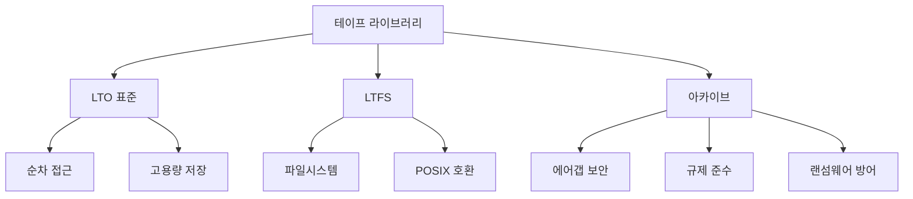

# 테이프 라이브러리 (Tape Library)

#### 핵심 인사이트 (3줄 요약)
> 1. **본질**: 대용량 순차 접근 스토리지 매체인 테이프 카트리지를 자동으로 로딩/언로딩하는 기계적 아카이브 시스템으로, 비용/GB 기준 최저의 장기 보관 솔루션
> 2. **가치**: $0.003~0.01/GB (HDD 대비 1/10~1/20), 30년+ 데이터 보존, 에어갭(Air-Gap) 보안으로 랜섬웨어 방어
> 3. **융합**: LTFS (Linear Tape File System), LTO (Linear Tape-Open) 표준, 클라우드 아카이브 계층과 통합된 하이브리드 스토리지

---

### Ⅰ. 개요 (Context & Background)

**개념 정의**

테이프 라이브러리(Tape Library)는 다수의 테이프 카트리지와 테이프 드라이브를 포함하고, 로봇 팔(Robot Arm)을 통해 자동으로 테이프를 탑재(Mount) 및 교체하는 대용량 아카이브 스토리지 시스템입니다. LTO (Linear Tape-Open) 9세대 기준 단일 카트리지에 18TB(압축 시 45TB)를 저장할 수 있으며, 수천 개의 카트리지를 관리하는 대형 라이브러리는 EB(Exabyte)급 저장 용량을 제공합니다. 순차 접근(Sequential Access) 특성으로 인해 랜덤 I/O에는 부적합하지만, 대용량 순차 백업과 장기 보관에 있어서는 HDD나 SSD 대비 압도적인 비용 효율성을 자랑합니다.

```
┌─────────────────────────────────────────────────────────────────────┐
│                    테이프 라이브러리 구조도                          │
├─────────────────────────────────────────────────────────────────────┤
│                                                                     │
│   ┌──────────────────────────────────────────────────────────────┐ │
│   │                    라이브러리 컨트롤러                        │ │
│   │  • 카트리지 인벤토리 관리                                     │ │
│   │  • 로봇 팔 제어 (Robot Control)                              │ │
│   │  • 드라이브 할당 스케줄링                                    │ │
│   └──────────────────────────┬───────────────────────────────────┘ │
│                              │                                     │
│   ┌──────────────────────────▼───────────────────────────────────┐ │
│   │                      슬롯 매거진 (Slot Magazine)              │ │
│   │  ┌───┬───┬───┬───┬───┬───┬───┬───┬───┬───┬───┬───┬───┬───┐  │ │
│   │  │S01│S02│S03│S04│S05│S06│S07│S08│S09│S10│...│S99│...│SN │  │ │
│   │  │ ○ │ ○ │   │ ○ │   │ ○ │ ○ │   │ ○ │   │   │ ○ │   │   │  │ │
│   │  └───┴───┴───┴───┴───┴───┴───┴───┴───┴───┴───┴───┴───┴───┘  │ │
│   │   (○ = 카트리지 있음, 공백 = 빈 슬롯)                          │ │
│   │   수천~수만 개 슬롯, 총 용량: 수백 TB ~ 수 EB                  │ │
│   └──────────────────────────┬───────────────────────────────────┘ │
│                              │                                     │
│   ┌──────────────────────────▼───────────────────────────────────┐ │
│   │                      로봇 팔 (Robot Arm)                      │ │
│   │                     ┌─────────────┐                          │ │
│   │                     │  ┌───────┐  │                          │ │
│   │                     │  │Gripper│  │ ← 카트리지 그립           │ │
│   │                     │  └───┬───┘  │                          │ │
│   │                     │      │      │                          │ │
│   │                     │  ┌───▼───┐  │                          │ │
│   │                     │  │   ↑   │  │ ← Z축 이동                │ │
│   │                     │  │       │  │                          │ │
│   │                     │  └───────┘  │                          │ │
│   │                     │ ← X축 이동  │                          │ │
│   │                     └─────────────┘                          │ │
│   │   이동 속도: 200~400 카트리지/시간                             │ │
│   │   정확도: ±1mm                                                 │ │
│   └──────────────────────────┬───────────────────────────────────┘ │
│                              │                                     │
│   ┌──────────────────────────▼───────────────────────────────────┐ │
│   │                    테이프 드라이브 (Tape Drives)               │ │
│   │  ┌──────────┐  ┌──────────┐  ┌──────────┐  ┌──────────┐     │ │
│   │  │  Drive 1 │  │  Drive 2 │  │  Drive 3 │  │  Drive 4 │     │ │
│   │  │  LTO-9   │  │  LTO-9   │  │  LTO-9   │  │  LTO-9   │     │ │
│   │  │ 18TB/45TB│  │ 18TB/45TB│  │ 18TB/45TB│  │ 18TB/45TB│     │ │
│   │  │ 400MB/s  │  │ 400MB/s  │  │ 400MB/s  │  │ 400MB/s  │     │ │
│   │  └──────────┘  └──────────┘  └──────────┘  └──────────┘     │ │
│   │   (압축 시 1,000MB/s)                                         │ │
│   │   드라이브 수: 4~100+                                         │ │
│   └──────────────────────────────────────────────────────────────┘ │
│                                                                     │
└─────────────────────────────────────────────────────────────────────┘
```

> **해설**: 테이브 라이브러리는 슬롯 매거진(카트리지 저장소), 로봇 팔(자동 카트리지 이동), 테이프 드라이브(실제 읽기/쓰기)로 구성됩니다. 로봇 팔은 요청된 카트리지를 슬롯에서 꺼내 드라이브에 탑재하며, 이 과정에 10~30초가 소요됩니다. LTO-9 드라이브는 400MB/s의 순차 전송 속도를 제공합니다.

**💡 비유**: 마치 자동화된 창고 물류 시스템과 같습니다. 수만 개의 상자(테이프 카트리지)가 선반(슬롯)에 정리되어 있고, 로봇 팔이 필요한 상자를 꺼내 작업대(드라이브)로 운반합니다. 상자를 찾는 데 시간이 걸리지만(10~30초), 한번 열면 빠르게 내용물을 처리할 수 있습니다.

**등장 배경**

① **기존 한계**: HDD 아카이브는 비용($0.05/GB)과 전력 소모 문제, 데이터센터 공간 부족
② **혁신적 패러다임**: 테이프의 순차 접근 특성을 아카이브에 최적화, $0.003/GB 달성
③ **비즈니스 요구**: 규제 데이터 보관(7~30년), 랜섬웨어 대응(에어갭), 비용 효율적 백업

**📢 섹션 요약 비유**: 테이프 라이브러리는 마치 자동화된 물류 창고와 같습니다. 수만 개의 상자를 로봇이 관리하고, 필요할 때만 꺼내어 작업합니다. 창고에 보관하는 동안 유지비가 거의 들지 않아, 장기 보관에 최적화되어 있습니다.

---

### Ⅱ. 아키텍처 및 핵심 원리 (Deep Dive)

**구성 요소 상세 분석**

| 요소명 | 역할 | 내부 동작 | 프로토콜/규격 | 비유 |
|:---|:---|:---|:---|:---|
| **테이프 카트리지** | 데이터 저장 매체 | 자기 테이프 릴, 18TB(LTO-9 원시), 45TB(압축) | LTO, IBM 3592 | 서류 상자 |
| **테이프 드라이브** | 읽기/쓰기 장치 | 헤드 위치 제어, SER (Soft Error Rate) 관리 | LTO-9, 400MB/s | 스캐너 |
| **로봇 팔** | 카트리지 이송 | XY-Z축 그리퍼, 바코드 스캐너, 매거진 이동 | ACSLS, REST API | 지게차 |
| **슬롯 매거진** | 카트리지 보관 | 수평/수직 배열, 온도/습도 제어 챔버 | 커스텀 | 선반 |
| **라이브러리 컨트롤러** | 전체 제어 | 인벤토리 DB, 드라이브 할당, 마이그레이션 | SCSI, SMI-S | 관리자 |
| **I/O 스테이션** | 수동 입출력 | 카트리지 투입/배출 포트, 보안 잠금 | 물리적 인터페이스 | 출입구 |

**LTO (Linear Tape-Open) 세대별 진화**

```
┌─────────────────────────────────────────────────────────────────────┐
│                   LTO 세대별 용량 및 성능 진화                       │
├─────────────────────────────────────────────────────────────────────┤
│                                                                     │
│   용량 (Native)                                                     │
│   ▲                                                                 │
│   │                                        ┌─────────────────┐     │
│   │    18TB ───────────────────────────────│ LTO-9 (2021)    │     │
│   │                               ┌────────┴─────────────────┘     │
│   │    12TB ──────────────────────│ LTO-8 (2017)                  │
│   │                      ┌────────┴───────────────────────────┐    │
│   │     6TB ─────────────│ LTO-7 (2015)                       │    │
│   │             ┌────────┴────────────────────────────────────┘    │
│   │   2.5TB ────│ LTO-6 (2012)                                   │
│   │      ┌──────┴─────────────────────────────────────────────┐   │
│   │  1.5TB ────│ LTO-5 (2010)                                   │   │
│   │     ┌──────┴──────────────────────────────────────────────┘   │
│   │  800GB ────│ LTO-4 (2007)                                    │   │
│   │     ┌──────┴─────────────────────────────────────────────┐    │
│   │  400GB ────│ LTO-3 (2004)                                   │    │
│   │     ┌──────┴──────────────────────────────────────────────┘   │
│   │  200GB ────│ LTO-2 (2003)                                    │   │
│   │     ┌──────┴─────────────────────────────────────────────┐    │
│   │  100GB ────│ LTO-1 (2000)                                   │    │
│   └────────────┴──────────────────────────────────────────────────▶│
│              2000  2003  2004  2007  2010  2012  2015  2017  2021  │
│                                                                     │
│   전송 속도 (Native):                                                │
│   • LTO-1: 15 MB/s   • LTO-5: 140 MB/s  • LTO-9: 400 MB/s         │
│   • LTO-3: 40 MB/s   • LTO-7: 300 MB/s                             │
│                                                                     │
│   ※ 압축 시(2.5:1) 용량 2.5배, 속도 2.5배 증가                       │
│   ※ LTO-9 기준: 18TB Native / 45TB Compressed                      │
│                                                                     │
└─────────────────────────────────────────────────────────────────────┘
```

> **해설**: LTO 표준은 약 2~3년마다 새 세대가 발표되며, 용량은 2배씩 증가하고 전송 속도도 향상됩니다. LTO 드라이브는 2세대 전까지 하위 호환성을 제공하여(LTO-9 드라이브는 LTO-7, LTO-8 카트리지 읽기/쓰기 가능), 기존 투자를 보호합니다.

**심층 동작 원리: 테이프 라이브러리 I/O 플로우**

① **마운트 요청 (Mount Request)**
```
애플리케이션 → 라이브러리 컨트롤러: "카트리지 #S42 마운트 요청"
컨트롤러: 인벤토리 DB 조회 → 카트리지 위치 확인 (슬롯 #42)
```

② **로봇 팔 동작 (Robot Operation)**
```
로봇 팔 이동: 슬롯 #42 → 그리퍼로 카트리지 파지
이송: 슬롯 #42 → 드라이브 #2 (이동 시간: 5~15초)
탑재: 드라이브 #2에 카트리지 삽입
```

③ **테이프 로딩 (Tape Loading)**
```
드라이브: 카트리지 문 열림 → 테이프 스레딩(Threading)
헤드 위치 초기화: BOT (Beginning of Tape)로 이동
준비 완료: "Ready" 상태 알림
총 소요 시간: 10~30초
```

④ **데이터 전송 (Data Transfer)**
```
순차 읽기/쓰기: 400 MB/s (LTO-9 Native)
랜덤 접근 불가: 파일 위치까지 빨리감기 필요 (초~분 단위)
```

⑤ **언마운트 (Unmount)**
```
드라이브: 테이프 되감기 → 카트리지 배출
로봇 팔: 드라이브 → 슬롯 반납
```

**핵심 알고리즘: LTFS (Linear Tape File System) 파일 배치**

```c
// LTFS 파일 배치 최적화 (의사코드)
struct tape_layout {
    char partition;        // 'A' = Index, 'B' = Data
    uint64_t offset;       // 테이프 내 오프셋
    uint64_t file_id;
};

// 파일 순차 배치 (랜덤 쓰기 방지)
void ltfs_write_file(struct tape_drive *drive, struct file *f) {
    // 1. 데이터 파티션(B)에 파일 데이터 기록
    seek_to_end(drive, PARTITION_B);
    uint64_t data_offset = get_current_offset(drive);
    sequential_write(drive, f->data, f->size);

    // 2. 인덱스 파티션(A)에 메타데이터 기록
    seek_to_end(drive, PARTITION_A);
    struct file_metadata meta = {
        .file_id = f->id,
        .name = f->name,
        .size = f->size,
        .data_offset = data_offset,
        .timestamp = get_current_time()
    };
    write_metadata(drive, &meta);

    // 3. 인덱스 캐시 갱신
    update_index_cache(f->id, data_offset);
}

// 파일 검색 (인덱스 우선 조회)
struct file_metadata* ltfs_find_file(uint64_t file_id) {
    // 캐시된 인덱스에서 검색
    struct file_metadata *meta = index_cache_lookup(file_id);
    if (meta) return meta;

    // 테이프 인덱스 파티션에서 검색 (느림)
    rewind_to_partition(drive, PARTITION_A);
    meta = scan_index_partition(drive, file_id);
    return meta;
}
```

**📢 섹션 요약 비유**: 테이프 라이브러리의 동작은 마치 자동차 수리점의 부품 창고와 같습니다. 정비사(애플리케이션)가 부품을 요청하면, 창고관리자(컨트롤러)가 로봇 팔에게 지시하고, 로봇은 선반에서 부품을 꺼내 작업대로 운반합니다. 찾는 데 시간이 걸리지만(10~30초), 일단 가져오면 바로 작업할 수 있습니다.

---

### Ⅲ. 융합 비교 및 다각도 분석 (Comparison & Synergy)

**기술 비교: 테이프 vs 디스크 vs 클라우드 아카이브**

| 비교 항목 | 테이프 라이브러리 | HDD 아카이브 | SSD 아카이브 | 클라우드 아카이브 |
|:---|:---:|:---:|:---:|:---:|
| **비용/GB** | $0.003~0.01 | $0.02~0.05 | $0.05~0.10 | $0.001~0.01 |
| **접근 지연** | 30~60초 | 5~15초 | 0ms | 1~12시간 |
| **전력 소모** | ~0W (대기) | 5~10W/디스크 | 0.5~2W/SSD | N/A |
| **데이터 내구성** | 30년+ | 3~5년 | 5~10년 | 99.999999999% |
| **랜덤 액세스** | 불가능 | 가능 (느림) | 가능 | 가능 |
| **보안 (에어갭)** | 완벽 | 제한적 | 제한적 | 제한적 |
| **확장성** | 선형 (슬롯 추가) | 제한적 | 제한적 | 무제한 |
| **TCO (5년)** | 최저 | 중간 | 높음 | 낮음~중간 |

**과목 융합 관점: 테이프 라이브러리와 타 영역 시너지**

| 융합 영역 | 시너지 효과 | 구현 예시 |
|:---|:---|:---|
| **OS (파일시스템)** | LTFS 마운트, POSIX 호환 | Linux/Windows에서 테이프를 파일시스템으로 마운트 |
| **네트워크** | 원격 테이프 액세스 | NDMP (Network Data Management Protocol) |
| **DB (데이터베이스)** | 파티션 아카이브 | 오래된 파티션을 테이프로 이관 |
| **보안** | 에어갭 랜섬웨어 방어 | 오프라인 백업으로 복구 보장 |
| **가상화** | VM 이미지 아카이브 | 비활성 VM을 테이프에 보관 |

**비용 비교: 1PB 아카이브 5년 TCO**

```
┌─────────────────────────────────────────────────────────────────────┐
│               1PB 아카이브 5년 TCO 비교 (비용 단위: $)               │
├─────────────────────────────────────────────────────────────────────┤
│                                                                     │
│   비용 ($)                                                         │
│   ▲                                                                 │
│   │                                                                 │
│   │    $800,000 ─┐  ┌──────────────────────────────────────────┐   │
│   │              │  │ SSD 아카이브                              │   │
│   │    $600,000 ─┤  │ 미디어: $500K + 전력/냉각: $300K         │   │
│   │              │  └──────────────────────────────────────────┘   │
│   │              │           ┌──────────────────────────────────┐  │
│   │    $400,000 ─┤           │ HDD 아카이브 (MAID)              │  │
│   │              │           │ 미디어: $100K + 전력/냉각: $200K │  │
│   │    $200,000 ─┤           └──────────────────────────────────┘  │
│   │              │      ┌───────────────────────────────────┐     │
│   │    $100,000 ─┤      │ 클라우드 아카이브 (S3 Glacier)    │     │
│   │              │      │ 저장: $60K + 검색: $40K           │     │
│   │     $50,000 ─┤      └───────────────────────────────────┘     │
│   │              │  ┌───────────────────────────────────────┐     │
│   │     $30,000 ─┤  │ 테이프 라이브러리                      │     │
│   │              │  │ 미디어: $10K + 장비: $20K + 전력: $0   │     │
│   │              │  └───────────────────────────────────────┘     │
│   └──────────────┴─────────────────────────────────────────────────▶│
│                 SSD    HDD    Cloud   Tape                         │
│                                                                     │
│   ※ 테이프는 5년 TCO 기준 압도적 비용 우위                          │
│   ※ 단, 빈번한 액세스 시 검색 비용으로 클라우드가 유리할 수 있음      │
│                                                                     │
└─────────────────────────────────────────────────────────────────────┘
```

> **해설**: 테이프 라이브러리는 5년 TCO 기준으로 SSD 대비 1/26, HDD 대비 1/13의 비용을 보입니다. 주요 이유는 낮은 미디어 비용($0.003/GB)과 대기 시 0W 전력 소모 때문입니다. 단, 빈번한 랜덤 액세스가 필요한 경우 검색 비용이 급증하므로, 워크로드 특성에 맞는 선택이 필요합니다.

**📢 섹션 요약 비유**: 테이프와 다른 스토리지의 관계는 마치 부동산과 같습니다. SSD는 도심 펜트하우스(빠르고 비쌈), HDD는 교외 주택(균형), 테이프는 지방 창고(느리지만 압도적 비용 효율)로, 용도에 맞는 선택이 필요합니다.

---

### Ⅳ. 실무 적용 및 기술사적 판단 (Strategy & Decision)

**실무 시나리오별 적용**

**시나리오 1: 금융 규제 준수 (7년 보관)**
- **문제**: 연간 200TB 증가, 7년 보관 의무, 감사 시 즉시 제공 필요
- **해결**: 테이프 라이브러리 + LTFS, 월 1회 전체 백업, 연간 $15,000
- **의사결정**: 핫 백업(30일)은 디스크, 콜드 아카이브는 테이프

**시나리오 2: 랜섬웨어 대응 (에어갭 백업)**
- **문제**: 랜섬웨어 공격 시 복구 불가, 3-2-1 백업 원칙
- **해결**: 테이프 오프사이트 보관, 분기별 오프라인 백업
- **의사결정**: 복구 시 24시간 SLA 허용, 테이프만으로 복구 가능

**시나리오 3: 과학 연구 데이터 아카이브**
- **문제**: PB 규모 실험 데이터, 1회 분석 후 장기 보관
- **해결**: LTO-9 라이브러리, 연구자 요청 시 1시간 내 마운트
- **의사결정**: 분석 완료 데이터 즉시 테이프 이관

**도입 체크리스트**

| 구분 | 항목 | 확인 포인트 |
|:---|:---|:---|
| **기술적** | 워크로드 분석 | 순차 vs 랜덤, 액세스 빈도, 복구 시간 요구 |
| | 드라이브/슬롯 비율 | 1:50~1:100 (드라이브 1개당 슬롯 수) |
| | LTFS 지원 | 파일시스템 인터페이스 필요 여부 |
| **운영적** | 보관 정책 | 보관 기간, 폐기 주기, 규제 요구사항 |
| | 오프사이트 | 재해 복구를 위한 원격 복제/이송 |
| | SLA 영향 | 마운트 시간(30초)이 SLA에 미치는 영향 |
| **비용적** | TCO 분석 | 미디어 + 장비 + 전력 + 운영 인력 |
| | 확장 계획 | 향후 3~5년 데이터 증가 예측 |

**안티패턴: 테이프 라이브러리 오용 사례**

| 안티패턴 | 문제점 | 올바른 접근 |
|:---|:---|:---|
| **랜덤 액세스에 테이프 사용** | 빈번한 탐색 → 성능 붕괴 | 순차 접근 워크로드만 테이프 |
| **드라이브 과소 투자** | 동시 마운트 대기 시간 증가 | 워크로드에 맞는 드라이브 수 확보 |
| **LTFS 미사용** | 애플리케이션 통합 복잡 | LTFS로 POSIX 호환성 확보 |
| **오프사이트 미이관** | 재해 시 전체 손실 | 지리적 분산 또는 원격 복제 |

**📢 섹션 요약 비유**: 테이프 라이브러리 도입은 마치 창고 임대와 같습니다. 자주 쓰는 물건은 집(HDD/SSD)에 두고, 자주 안 쓰는 물건은 창고(테이프)에 보관합니다. 창고 비용이 싸지만, 물건 찾는 데 시간이 걸리므로 용도에 맞게 사용해야 합니다.

---

### Ⅴ. 기대효과 및 결론 (Future & Standard)

**정량/정성 기대효과**

| 구분 | 도입 전 (HDD) | 도입 후 (테이프) | 개선효과 |
|:---|:---:|:---:|:---:|
| **비용/GB** | $0.05 | $0.003 | 94% 절감 |
| **전력 소모** | 10kW | 0.1kW | 99% 절감 |
| **데이터 내구성** | 5년 | 30년+ | 6배+ 향상 |
| **접근 지연** | 5~15초 | 30~60초 | Trade-off |
| **랜섬웨어 보호** | 제한적 | 완벽 (에어갭) | 근본적 해결 |

**미래 전망**

1. **LTO-10/11/12**: 36TB → 72TB → 144TB(원시) 용량 진화, 2025~2030년
2. **클라우드 하이브리드**: AWS Storage Gateway + 테이프 아카이브 통합
3. **DNA 저장**: 차세대 초고밀도 저장 매체, 테이브의 미래 대안
4. **AI 기반 티어링**: 액세스 패턴 학습, 자동 테이프/HDD/SSD 티어링

**참고 표준**

| 표준 | 내용 | 적용 |
|:---|:---|:---|
| **LTO (Linear Tape-Open)** | 테이프 규격 표준 | IBM, HP, Quantum 컨소시엄 |
| **LTFS** | 테이프 파일시스템 | IBM 개발, ISO/IEC 20919 |
| **NDMP** | 네트워크 백업 프로토콜 | 테이프 라이브러리 원격 제어 |
| **ISO 14721 (OAIS)** | 아카이브 참조 모델 | 장기 보관 프레임워크 |

**📢 섹션 요약 비유**: 테이프 기술의 미래는 마치 종이 책의 진화와 같습니다. 디지털 시대에도 도서관은 종이 책을 보관하듯, SSD/클라우드 시대에도 테이브는 장기 보관의 최적 솔루션으로 계속 진화할 것입니다.

---

### 📌 관련 개념 맵 (Knowledge Graph)



**연관 개념 링크**:
- [MAID (Massive Array of Idle Disks)](./691_maid.md) - HDD 기반 아카이브
- [WORM 스토리지](./693_worm_storage.md) - Write Once Read Many
- [계층형 스토리지](./tiered_storage.md) - Hot/Warm/Cold 계층화
- [백업 및 복구](./backup_recovery.md) - 3-2-1 백업 원칙
- [오브젝트 스토리지](./object_storage.md) - 클라우드 아카이브

---

### 👶 어린이를 위한 3줄 비유 설명

1. **자동 창고**: 테이프 라이브러리는 엄청 큰 자동 창고예요. 로봇 팔이 수만 개의 상자(테이프)를 알아서 찾아서 가져다줘요.

2. **오래 보관**: 테이프는 30년 이상 보관할 수 있어요. 전기도 거의 안 쓰고, 비용도 딱딱이보다 20배나 싸요!

3. **비상금고**: 인터넷에 연결 안 되어 있어서 나쁜 사람들이 훔치거나 망가뜨릴 수 없어요. 아주 중요한 데이터를 안전하게 보관하는 비상금고예요!
