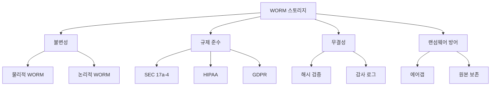

# WORM (Write Once Read Many) 스토리지

#### 핵심 인사이트 (3줄 요약)
> 1. **본질**: 한 번 기록된 데이터는 수정·삭제가 불가능한 비휘발성 스토리지로, 데이터 무결성과 규제 준수(Compliance)를 보장하는 불변 저장 기술
> 2. **가치**: 법적 증거 보존, 감사 추적(Audit Trail), 랜섬웨어 방어, 30년+ 데이터 보존으로 기업 리스크 관리
> 3. **융합**: 테이프 WORM, 광 디스크(CD/DVD/BD), 오브젝트 스토리지 Lock, 블록체인과 통합된 무결성 아키텍처

---

### Ⅰ. 개요 (Context & Background)

**개념 정의**

WORM (Write Once Read Many) 스토리지는 데이터가 한 번 기록되면 영구적으로 잠금(Lock)되어 수정, 삭제, 덮어쓰기가 불가능한 스토리지 기술입니다. 금융, 의료, 법률 등 규제 산업에서는 SEC (Securities and Exchange Commission) Rule 17a-4, HIPAA (Health Insurance Portability and Accountability Act), GDPR (General Data Protection Regulation) 등의 규정에 따라 특정 기간 동안 데이터 변경이 금지됩니다. WORM은 이러한 규제 준수(Compliance)를 기술적으로 강제하는 "불변성(Immutability)"을 제공합니다.

```
┌─────────────────────────────────────────────────────────────────────┐
│               WORM 스토리지 동작 개념도                              │
├─────────────────────────────────────────────────────────────────────┤
│                                                                     │
│   ┌──────────────────────────────────────────────────────────────┐ │
│   │                    일반 스토리지 (R/W)                        │ │
│   │                                                              │ │
│   │   Write ──────► [Block A] ──────► Read                      │ │
│   │                     │                                        │ │
│   │                     ▼                                        │ │
│   │   Overwrite ───► [Block A'] ───► Read (내용 변경됨)          │ │
│   │                     │                                        │ │
│   │                     ▼                                        │ │
│   │   Delete ──────► [Empty] (데이터 소멸)                       │ │
│   │                                                              │ │
│   │   문제: 데이터 위변조 가능, 규제 위반 위험                    │ │
│   └──────────────────────────────────────────────────────────────┘ │
│                                                                     │
│   ┌──────────────────────────────────────────────────────────────┐ │
│   │                    WORM 스토리지 (Immutable)                  │ │
│   │                                                              │ │
│   │   Write ──────► [Block A] ──────► Read                      │ │
│   │                     │                                        │ │
│   │                     │ 🔒 WORM Lock 적용                       │ │
│   │                     ▼                                        │ │
│   │   Overwrite ───► ❌ 거부 (ERROR: Write Protected)            │ │
│   │                     │                                        │ │
│   │                     ▼                                        │ │
│   │   Delete ──────► ❌ 거부 (ERROR: Cannot Delete)              │ │
│   │                     │                                        │ │
│   │                     ▼                                        │ │
│   │   보존 기간 만료 ───► 🔓 잠금 해제 (Retension Expired)        │ │
│   │                                                              │ │
│   │   장점: 데이터 위변조 불가, 규제 준수 보장                    │ │
│   └──────────────────────────────────────────────────────────────┘ │
│                                                                     │
└─────────────────────────────────────────────────────────────────────┘
```

> **해설**: 일반 스토리지는 언제든 데이터를 수정하거나 삭제할 수 있지만, WORM 스토리지는 한 번 기록된 데이터를 잠금(Lock)하여 변경을 방지합니다. 보존 기간(Retension Period) 동안은 관리자 권한으로도 삭제할 수 없으며, 기간 만료 후에만 잠금이 해제됩니다.

**💡 비유**: 마치 공증 사무소에서 공증 받은 문서와 같습니다. 한 번 공증된 문서는 내용을 바꿀 수 없고, 원본 그대로 보관되어야 법적 효력이 있습니다. WORM 스토리지는 이를 디지털로 구현한 것입니다.

**등장 배경**

① **기존 한계**: 일반 스토리지는 관리자 권한으로 언제든 삭제/수정 가능 → 내부자 위변조, 랜섬웨어 공격에 취약
② **혁신적 패러다임**: 하드웨어/소프트웨어 수준에서 변경 불가능한 잠금 메커니즘 구현
③ **비즈니스 요구**: SEC 17a-4(증권 거래 기록 6년 보관), HIPAA(의료 기록), GDPR(개인정보) 규정 준수

**📢 섹션 요약 비유**: WORM 스토리지는 마치 공문서의 "원본 보존"과 같습니다. 한 번 작성된 문서는 수정할 수 없고, 법정에서 증거로 제출할 때 원본 그대로여야 신뢰할 수 있습니다.

---

### Ⅱ. 아키텍처 및 핵심 원리 (Deep Dive)

**구성 요소 상세 분석**

| 요소명 | 역할 | 내부 동작 | 프로토콜/규격 | 비유 |
|:---|:---|:---|:---|:---|
| **WORM 컨트롤러** | 잠금 정책 관리 | Retension Timer, 잠금 플래그, 접근 제어 | SMI-S, REST API | 공증인 |
| **불변 미디어** | 물리적 WORM 저장 | CD-R, DVD-R, WORM 테이프, UDO (Ultra Density Optical) | ISO 9660, LTO WORM | 공문서 원본 |
| **논리 WORM** | 소프트웨어 잠금 | Object Lock, Legal Hold, Versioning | S3 Object Lock, NFS | 위조 방지 도장 |
| **보존 정책 엔진** | 기간 관리 | 규제별 기간 설정, 자동 만료, 감사 로그 | Compliance Rule | 법령 |
| **메타데이터 DB** | 잠금 상태 추적 | Object ID → Lock Status, Expiry Time | KV Store | 등기부 |
| **감사 로그** | 접근 기록 | Who, When, What, Result | WORM Log | 공문서 접수부 |

**WORM 구현 방식 비교**

```
┌─────────────────────────────────────────────────────────────────────┐
│                   WORM 구현 방식 아키텍처                            │
├─────────────────────────────────────────────────────────────────────┤
│                                                                     │
│   ┌──────────────────────────────────────────────────────────────┐ │
│   │                 1. 물리적 WORM (Hardware WORM)                │ │
│   │                                                              │ │
│   │   미디어 자체가 한 번만 기록 가능                             │ │
│   │                                                              │ │
│   │   ┌───────────────────────────────────────────────────────┐  │ │
│   │   │  CD-R/DVD-R/BD-R  │  WORM Tape  │  UDO (광 디스크)    │  │ │
│   │   │  • 저렴함          │  • 대용량   │  • 기업급          │  │ │
│   │   │  • 느림            │  • 느림     │  • 빠름            │  │ │
│   │   │  • 수명 10년       │  • 30년+    │  • 50년+           │  │ │
│   │   └───────────────────────────────────────────────────────┘  │ │
│   │                                                              │ │
│   │   장점: 하드웨어 수준 불변, 해킹 불가                          │ │
│   │   단점: 유연성 부족, 비용 높음                                 │ │
│   └──────────────────────────────────────────────────────────────┘ │
│                                                                     │
│   ┌──────────────────────────────────────────────────────────────┐ │
│   │                 2. 논리적 WORM (Software WORM)                │ │
│   │                                                              │ │
│   │   소프트웨어로 잠금 구현, 미디어는 일반 R/W                   │ │
│   │                                                              │ │
│   │   ┌───────────────────────────────────────────────────────┐  │ │
│   │   │  S3 Object Lock   │  File System WORM │  Archive Appliance │
│   │   │  • 클라우드       │  • NFS/SMB        │  • NetApp/Dell │  │ │
│   │   │  • 유연함         │  • 기존 통합      │  • 규제 준수    │  │ │
│   │   │  • 규모 확장      │  • 저렴함         │  • 고성능       │  │ │
│   │   └───────────────────────────────────────────────────────┘  │ │
│   │                                                              │ │
│   │   장점: 유연성, 비용 효율, 기존 시스템 통합 용이               │ │
│   │   단점: 소프트웨어 버그/해킹 시 우회 가능                       │ │
│   └──────────────────────────────────────────────────────────────┘ │
│                                                                     │
│   ┌──────────────────────────────────────────────────────────────┐ │
│   │                 3. 하이브리드 WORM                            │ │
│   │                                                              │ │
│   │   소프트웨어 잠금 + 하드웨어 검증                             │ │
│   │                                                              │ │
│   │   ┌───────────────────────────────────────────────────────┐  │ │
│   │   │  WORM 테이프 + LTFS  │  Object Storage + Hash Chain   │  │ │
│   │   │  • 물리적 불변       │  • 블록체인 원리               │  │ │
│   │   │  • 파일시스템 인터페이스 │ • 분산 검증               │  │ │
│   │   └───────────────────────────────────────────────────────┘  │ │
│   │                                                              │ │
│   │   장점: 두 방식의 장점 결합                                   │ │
│   │   단점: 복잡도 증가                                           │ │
│   └──────────────────────────────────────────────────────────────┘ │
│                                                                     │
└─────────────────────────────────────────────────────────────────────┘
```

> **해설**: 물리적 WORM은 미디어 자체가 한 번만 기록 가능(CD-R, WORM 테이프)하고, 논리적 WORM은 소프트웨어로 잠금을 구현합니다. 최근에는 S3 Object Lock과 같은 클라우드 WORM 서비스가 확산되고 있습니다.

**심층 동작 원리: S3 Object Lock**

① **Governance Mode (거버넌스 모드)**
```
- 일반 사용자: 삭제/수정 불가
- 특권 사용자(root): 권한으로 삭제 가능
- 용도: 실수 방지, 일반적 보호
```

② **Compliance Mode (규정 준수 모드)**
```
- 모든 사용자: 삭제/수정 불가 (root 포함)
- 보존 기간 만료 전까지 절대 변경 불가
- 용도: SEC 17a-4, HIPAA 등 규제 준수
```

③ **Legal Hold (법적 보존)**
```
- 소송/조사 중인 데이터 무기한 보존
- Hold 해제 전까지 Retension 무효화
- 용도: eDiscovery, 감사
```

**핵심 알고리즘: WORM 보존 기간 관리**

```c
// WORM 보존 정책 관리 (의사코드)
struct worm_object {
    uint64_t object_id;
    char data_hash[64];       // SHA-256
    uint64_t create_time;
    uint64_t retention_expire;
    enum lock_mode mode;      // GOVERNANCE, COMPLIANCE, LEGAL_HOLD
    bool is_locked;
};

// WORM 쓰기 (한 번만 가능)
int worm_write(struct worm_storage *ws, void *data, size_t len,
               uint64_t retention_days, enum lock_mode mode) {
    // 1. 데이터 해시 계산
    char hash[64];
    sha256(data, len, hash);

    // 2. 객체 생성
    struct worm_object obj = {
        .object_id = generate_id(),
        .create_time = get_current_time(),
        .retention_expire = get_current_time() + (retention_days * 86400),
        .mode = mode,
        .is_locked = true
    };
    memcpy(obj.data_hash, hash, 64);

    // 3. 데이터 기록
    if (write_data(ws, obj.object_id, data, len) != 0) {
        return -1;  // 쓰기 실패
    }

    // 4. 메타데이터 등록
    register_object(ws, &obj);

    return 0;
}

// WORM 삭제 시도 (보존 기간 확인)
int worm_delete(struct worm_storage *ws, uint64_t object_id, uid_t uid) {
    struct worm_object *obj = lookup_object(ws, object_id);
    if (!obj) return -1;  // 객체 없음

    // 1. 잠금 상태 확인
    if (!obj->is_locked) {
        return do_delete(ws, object_id);  // 잠금 해제됨, 삭제 가능
    }

    // 2. 모드별 권한 확인
    switch (obj->mode) {
        case GOVERNANCE:
            if (uid != ROOT_UID) {
                return -EPERM;  // 권한 없음
            }
            // root는 삭제 가능 (fallthrough)

        case COMPLIANCE:
            // 보존 기간 확인
            if (get_current_time() < obj->retention_expire) {
                return -EPERM;  // 보존 기간 미만
            }
            break;

        case LEGAL_HOLD:
            return -EPERM;  // 법적 보존 중, 무기한 금지
    }

    // 3. 삭제 실행
    return do_delete(ws, object_id);
}

// WORM 무결성 검증
bool worm_verify_integrity(struct worm_storage *ws, uint64_t object_id) {
    struct worm_object *obj = lookup_object(ws, object_id);
    if (!obj) return false;

    void *data;
    size_t len;
    read_data(ws, object_id, &data, &len);

    char computed_hash[64];
    sha256(data, len, computed_hash);

    return (memcmp(obj->data_hash, computed_hash, 64) == 0);
}
```

**📢 섹션 요약 비유**: WORM의 동작은 마치 공증 사무소의 문서 관리와 같습니다. 문서를 제출하면(Write) 공증인이 날인하고 잠금(Lock)합니다. 이후에는 누구도 내용을 바꿀 수 없고, 법정에서 증거로 인정됩니다.

---

### Ⅲ. 융합 비교 및 다각도 분석 (Comparison & Synergy)

**기술 비교: WORM 구현 방식별 특성**

| 비교 항목 | 물리적 WORM | 논리적 WORM | S3 Object Lock | 블록체인 |
|:---|:---:|:---:|:---:|:---:|
| **불변성 강도** | 최고 | 중간 | 높음 | 최고 |
| **비용/GB** | $0.01~0.05 | $0.02~0.10 | $0.001~0.01 | $0.10+ |
| **접근 속도** | 느림 (테이프) | 빠름 | 빠름 | 느림 |
| **확장성** | 제한적 | 높음 | 무제한 | 제한적 |
| **규제 인증** | SEC 17a-4 | 제한적 | SEC 17a-4 | 검증 중 |
| **해킹 방어** | 완벽 | 중간 | 높음 | 완벽 |
| **유연성** | 낮음 | 높음 | 중간 | 낮음 |

**과목 융합 관점: WORM과 타 영역 시너지**

| 융합 영역 | 시너지 효과 | 구현 예시 |
|:---|:---|:---|
| **OS (파일시스템)** | 읽기 전용 마운트, MAC (Mandatory Access Control) | SELinux와 WORM 통합 |
| **DB (데이터베이스)** | 감사 로그 WORM 저장, 변경 이력 추적 | Oracle Audit Vault + WORM |
| **네트워크** | 로그 원격 WORM 저장, SIEM 통합 | Splunk + S3 Object Lock |
| **보안** | 랜섬웨어 방어, 포렌식 증거 보존 | Incident Response + WORM |
| **가상화** | VM 스냅샷 WORM 보관, 롤백 보장 | Veeam + WORM 백업 |

**규제별 WORM 요구사항**

```
┌─────────────────────────────────────────────────────────────────────┐
│                규제별 WORM 요구사항 비교                             │
├─────────────────────────────────────────────────────────────────────┤
│                                                                     │
│   ┌──────────────────────────────────────────────────────────────┐ │
│   │  SEC Rule 17a-4 (미국 증권거래위원회)                        │ │
│   │  • 대상: 증권사 거래 기록                                     │ │
│   │  • 보존 기간: 3~6년                                           │ │
│   │  • 요구사항: WORM 또는 동등한 기술적 보호                      │ │
│   │  • 인증: WORM 테이프, S3 Object Lock (Compliance Mode)        │ │
│   └──────────────────────────────────────────────────────────────┘ │
│                                                                     │
│   ┌──────────────────────────────────────────────────────────────┐ │
│   │  HIPAA (미국 의료보험 이동 및 책임법)                         │ │
│   │  • 대상: 의료 기록, PHI (Protected Health Information)        │ │
│   │  • 보존 기간: 6년                                             │ │
│   │  • 요구사항: 무결성 보호, 접근 통제, 감사 추적                 │ │
│   │  • 인증: 논리 WORM + 암호화 + 접근 로그                        │ │
│   └──────────────────────────────────────────────────────────────┘ │
│                                                                     │
│   ┌──────────────────────────────────────────────────────────────┐ │
│   │  MiFID II (유럽 금융규제)                                     │ │
│   │  • 대상: 금융 거래, 통신 기록                                 │ │
│   │  • 보존 기간: 5~7년                                           │ │
│   │  • 요구사항: 변경 방지, 재현 가능, 신속한 검색                 │ │
│   │  • 인증: WORM 스토리지 + 인덱싱                                │ │
│   └──────────────────────────────────────────────────────────────┘ │
│                                                                     │
│   ┌──────────────────────────────────────────────────────────────┐ │
│   │  GDPR (유럽 개인정보보호규정)                                 │ │
│   │  • 대상: 개인정보 처리 기록                                   │ │
│   │  • 보존 기간: 처리 목적 달성 후 삭제 (예외 있음)               │ │
│   │  • 요구사항: 무결성, 기밀성, 감사 가능                         │ │
│   │  • 인증: 논리 WORM + 삭제 권한 (예외적)                        │ │
│   └──────────────────────────────────────────────────────────────┘ │
│                                                                     │
└─────────────────────────────────────────────────────────────────────┘
```

> **해설**: 각 규제는 산업과 지역에 따라 다른 WORM 요구사항을 가집니다. SEC 17a-4는 엄격한 WORM 요구, HIPAA는 무결성과 접근 통제, GDPR은 개인정보 보호와 삭제 권한의 균형을 강조합니다.

**📢 섹션 요약 비유**: WORM 규제는 마치 은행의 거래 기록 보관과 같습니다. 모든 거래는 원본 그대로 보존되어야 하고, 위변조되면 법적 문제가 발생합니다. 각국의 규제당국이 요구하는 보관 기간과 방식이 다릅니다.

---

### Ⅳ. 실무 적용 및 기술사적 판단 (Strategy & Decision)

**실무 시나리오별 적용**

**시나리오 1: 증권사 거래 기록 보관**
- **문제**: SEC 17a-4 준수, 6년간 거래 기록 보존, 감사 시 즉시 제출
- **해결**: S3 Object Lock (Compliance Mode), 6년 보존 정책
- **의사결정**: 클라우드 WORM으로 CAPEX 절감, 규제 인증 확인

**시나리오 2: 병원 의료 기록 보관**
- **문제**: HIPAA 준수, 환자 기록 6년 보존, 랜섬웨어 방어
- **해결**: WORM 테이프 + 암호화, 오프사이트 보관
- **의사결정**: 에어갭 + WORM으로 이중 보호

**시나리오 3: 기업 이메일 아카이브**
- **문제**: 소송 대비 eDiscovery, 직원 이메일 증거 보존
- **해결**: 이메일 아카이브 솔루션 + WORM, Legal Hold 기능
- **의사결정**: 소송 발생 시 Legal Hold로 무기한 보존

**도입 체크리스트**

| 구분 | 항목 | 확인 포인트 |
|:---|:---|:---|
| **기술적** | 규제 요구사항 | SEC 17a-4, HIPAA 등 해당 규정 확인 |
| | WORM 모드 선택 | Governance vs Compliance vs Legal Hold |
| | 보존 기간 설정 | 규정별 최소 기간, 자동 만료 정책 |
| **운영적** | 감사 로그 | WORM 접근 기록, 무결성 검증 주기 |
| | 예외 처리 | Legal Hold 절차, 긴급 삭제 프로세스 |
| | 모니터링 | 잠금 상태, 만료 예정 객체 알림 |
| **비용적** | TCO 분석 | 물리 WORM vs 클라우드 WORM 비용 비교 |
| | 확장성 | 데이터 증가율에 따른 용량 계획 |

**안티패턴: WORM 오용 사례**

| 안티패턴 | 문제점 | 올바른 접근 |
|:---|:---|:---|
| **잘못된 모드 선택** | Governance 모드로 규제 미준수 | Compliance Mode 필수 |
| **과도한 보존 기간** | 법적 요구 이상 보관 → 비용 증가 | 규정 최소 기간 + 1년 |
| **WORM 미사용** | 일반 스토리지로 규제 위반 | 규제 대상 데이터는 반드시 WORM |
| **예외 절차 미흡** | Legal Hold 시스템 없음 | 명확한 Hold/해제 절차 수립 |

**📢 섹션 요약 비유**: WORM 도입은 마치 법무팀의 문서 관리와 같습니다. 모든 계약서는 원본으로 보관하고, 위변조를 방지하며, 법정에서 증거로 제출할 수 있어야 합니다. 적절한 보존 기간과 예외 절차가 필수입니다.

---

### Ⅴ. 기대효과 및 결론 (Future & Standard)

**정량/정성 기대효과**

| 구분 | 도입 전 | 도입 후 | 개선효과 |
|:---|:---:|:---:|:---:|
| **규제 준수** | 위반 가능성 | 100% 준수 | 리스크 제거 |
| **감사 통과** | 실패 가능 | 100% 통과 | 신뢰성 향상 |
| **랜섬웨어 피해** | 복구 불가 | 원본 보존 | 무결성 보장 |
| **TCO (5년)** | 기준 | +10~20% | 규제 비용 대비 효율 |

**미래 전망**

1. **클라우드 WORM 확산**: AWS S3 Object Lock, Azure Immutable Storage, Google Cloud Vault
2. **블록체인 통합**: 분산 원장으로 WORM 무결성 검증
3. **AI 기반 규정 준수**: 자동 규제 분석, 적절한 WORM 정책 추천
4. **하이브리드 WORM**: 온프레미스 + 클라우드 WORM 동기화

**참고 표준**

| 표준 | 내용 | 적용 |
|:---|:---|:---|
| **SEC Rule 17a-4** | 증권 기록 보관 | WORM 요구사항 정의 |
| **ISO 27001** | 정보보안 관리 | 무결성 통제 요구 |
| **SNIA IRO** | Immutable Retention Object | WORM 표준 인터페이스 |
| **S3 Object Lock** | 클라우드 WORM | AWS/GCP/Azure 지원 |

**📢 섹션 요약 비유**: WORM 기술의 미래는 마치 디지털 공증의 진화와 같습니다. 과거에는 물리적 문서 공증에서 시작해, 현재는 클라우드 WORM, 미래에는 블록체인 기반 분산 검증으로 발전하고 있습니다.

---

### 📌 관련 개념 맵 (Knowledge Graph)



**연관 개념 링크**:
- [테이프 라이브러리](./692_tape_library.md) - WORM 테이프 구현
- [광 디스크 주크박스](./694_optical_disc_jukebox.md) - 물리적 WORM 미디어
- [데이터 무결성](./data_integrity.md) - 해시 검증, 체크섬
- [규제 준수 스토리지](./compliance_storage.md) - 법적 요구사항
- [랜섬웨어 방어](./ransomware_protection.md) - 에어갭, 불변 백업

---

### 👶 어린이를 위한 3줄 비유 설명

1. **수정 금지 문서**: WORM은 한 번 쓴 편지를 수정할 수 없게 만드는 거예요. 공문서처럼 중요한 건 수정하면 안 되니까요!

2. **디지털 공증**: 컴퓨터 파일에 "이 내용은 절대 바꿀 수 없어요!"라고 도장을 찍는 것과 같아요. 나쁜 사람이 내용을 바꾸려고 해도 안 돼요.

3. **비상 대비**: 랜섬웨어라는 나쁜 바이러스가 와도, WORM에 저장된 건 안전해요. 마치 금고에 넣은 보물처럼 아무도 훔치거나 바꿀 수 없어요!
