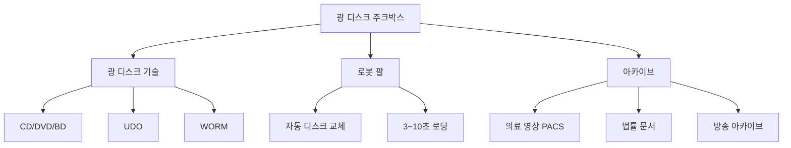

# 광 디스크 주크박스 (Optical Disc Jukebox)

#### 핵심 인사이트 (3줄 요약)
> 1. **본질**: 다수의 광 디스크(CD/DVD/BD/UDO)를 자동으로 로딩하는 기계식 아카이브 시스템으로, WORM (Write Once Read Many) 특성의 물리적 불변 저장 장치
> 2. **가치**: 50~100년 데이터 보존, 전력 소모 0W(대기), 규제 준수(SEC 17a-4), 랜섬웨어 완전 방어
> 3. **융합**: UDO (Ultra Density Optical), 블루레이 아카이브, WORM 규정 준수, 콜드 스토리지 계층과 통합된 장기 보관 플랫폼

---

### Ⅰ. 개요 (Context & Background)

**개념 정의**

광 디스크 주크박스(Optical Disc Jukebox)는 수백~수천 장의 광 디스크(CD, DVD, Blu-ray Disc, UDO)를 자동으로 저장·검색·재생하는 아카이브 스토리지 시스템입니다. 로봇 팔(Robotic Arm)이 디스크를 슬롯에서 꺼내 드라이브에 탑재하는 방식으로, 테이프 라이브러리와 유사한 메커니즘을 가집니다. 광 디스크는 레이저로 데이터를 기록하는 비자성 매체로, 자기장 영향을 받지 않고 50~100년의 장기 보존이 가능합니다. 특히 WORM (Write Once Read Many) 방식의 광 디스크는 한 번 기록된 데이터를 수정·삭제할 수 없어, 규제 준수와 랜섬웨어 방어에 최적화되어 있습니다.

```
┌─────────────────────────────────────────────────────────────────────┐
│               광 디스크 주크박스 (Optical Disc Jukebox) 구조도      │
├─────────────────────────────────────────────────────────────────────┤
│                                                                     │
│   ┌──────────────────────────────────────────────────────────────┐ │
│   │                    주크박스 컨트롤러                          │ │
│   │  • 디스크 인벤토리 관리 (바코드 스캔)                         │ │
│   │  • 로봇 팔 제어 (Pick & Place)                               │ │
│   │  • 드라이브 할당 스케줄링                                    │ │
│   └──────────────────────────┬───────────────────────────────────┘ │
│                              │                                     │
│   ┌──────────────────────────▼───────────────────────────────────┐ │
│   │                    디스크 매거진 (Disc Magazine)              │ │
│   │  ┌─────┬─────┬─────┬─────┬─────┬─────┬─────┬─────┬─────┐    │ │
│   │  │Slot1│Slot2│Slot3│Slot4│Slot5│Slot6│Slot7│Slot8 │ ... │    │ │
│   │  │ ◉  │     │ ◉  │ ◉  │     │ ◉  │     │ ◉  │     │    │ │
│   │  │BD-R │     │UDO  │BD-R │     │UDO  │     │BD-R │     │    │ │
│   │  └─────┴─────┴─────┴─────┴─────┴─────┴─────┴─────┴─────┘    │ │
│   │   (◉ = 디스크 있음)                                           │ │
│   │   수백~수천 장 슬롯, 총 용량: 수 TB ~ 수 PB                    │ │
│   └──────────────────────────┬───────────────────────────────────┘ │
│                              │                                     │
│   ┌──────────────────────────▼───────────────────────────────────┐ │
│   │                      로봇 팔 (Robotic Arm)                    │ │
│   │                     ┌─────────────┐                          │ │
│   │                     │  ┌───────┐  │                          │ │
│   │                     │  │Gripper│  │ ← 디스크 그립             │ │
│   │                     │  └───┬───┘  │                          │ │
│   │                     │      │      │                          │ │
│   │                     │  ┌───▼───┐  │                          │ │
│   │                     │  │   ↑   │  │ ← 수직 이동               │ │
│   │                     │  │       │  │                          │ │
│   │                     │  └───────┘  │                          │ │
│   │                     │ ← 수평 이동 │                          │ │
│   │                     └─────────────┘                          │ │
│   │   이동 속도: 200~400 디스크/시간                               │ │
│   │   로딩 시간: 3~10초                                            │ │
│   └──────────────────────────┬───────────────────────────────────┘ │
│                              │                                     │
│   ┌──────────────────────────▼───────────────────────────────────┐ │
│   │                    광 디스크 드라이브 (Optical Drives)         │ │
│   │  ┌──────────┐  ┌──────────┐  ┌──────────┐  ┌──────────┐     │ │
│   │  │ Drive 1  │  │ Drive 2  │  │ Drive 3  │  │ Drive 4  │     │ │
│   │  │ BD-XL    │  │ UDO      │  │ BD-XL    │  │ UDO      │     │ │
│   │  │ 128GB    │  │ 60GB     │  │ 128GB    │  │ 60GB     │     │ │
│   │  │ 72MB/s   │  │ 40MB/s   │  │ 72MB/s   │  │ 40MB/s   │     │ │
│   │  └──────────┘  └──────────┘  └──────────┘  └──────────┘     │ │
│   │   드라이브 수: 1~12                                          │ │
│   └──────────────────────────────────────────────────────────────┘ │
│                                                                     │
└─────────────────────────────────────────────────────────────────────┘
```

> **해설**: 광 디스크 주크박스는 디스크 매거진(저장소), 로봇 팔(자동 이송), 광 디스크 드라이브(읽기/쓰기)로 구성됩니다. 테이프 라이브러리와 유사하지만, 광 디스크는 랜덤 액세스가 가능하고 로딩 시간이 3~10초로 더 빠릅니다. 단, 전송 속도는 40~72MB/s로 테이프보다 느립니다.

**💡 비유**: 마치 자동 판매기(vending machine)와 같습니다. 음료수(광 디스크)가 진열대(슬롯)에 있고, 버튼을 누르면 로봇 팔이 음료수를 꺼내 배출구(드라이브)로 가져옵니다. 음료수를 찾는 데 3~10초가 걸리지만, 일단 나오면 바로 마실 수 있습니다.

**등장 배경**

① **기존 한계**: HDD는 3~5년 수명, 테이프는 30년 but 순차 접근만 가능
② **혁신적 패러다임**: 광 디스크의 랜덤 액세스 + 50~100년 보존 + WORM 불변성
③ **비즈니스 요구**: 의료 영상, 법적 문서, 금융 기록의 장기 보관 + 규제 준수

**📢 섹션 요약 비유**: 광 디스크 주크박스는 마치 자동화된 도서관 마이크로필름 보관실과 같습니다. 수천 장의 필름(광 디스크)이 보관되어 있고, 필요한 것을 로봇이 찾아 독취기(드라이브)에 넣어줍니다. 필름은 100년 이상 보존되고 내용을 바꿀 수 없습니다.

---

### Ⅱ. 아키텍처 및 핵심 원리 (Deep Dive)

**구성 요소 상세 분석**

| 요소명 | 역할 | 내부 동작 | 프로토콜/규격 | 비유 |
|:---|:---|:---|:---|:---|
| **광 디스크** | 데이터 저장 매체 | CD-R(700MB), DVD-R(4.7GB), BD-R(25GB), BD-XL(128GB), UDO(60GB) | ISO 9660, UDF | 마이크로필름 |
| **광 디스크 드라이브** | 레이저 읽기/쓰기 | 405nm(Blu-ray), 650nm(DVD), 780nm(CD) 레이저 | SATA, USB | 독취기 |
| **로봇 팔** | 디스크 이송 | XY-Z축 그리퍼, 바코드 스캐너 | RS-232, REST API | 이송 기계 |
| **디스크 매거진** | 디스크 보관 | 수평/수직 슬롯 배열, 먼지 방지 챔버 | 커스텀 | 서가 |
| **주크박스 컨트롤러** | 전체 제어 | 인벤토리 DB, 드라이브 할당, 마이그레이션 | SCSI, NFS/SMB | 사서 |
| **캐시 버퍼** | 디스크 로딩 지연 숨김 | HDD/SSD 캐시, 프리페칭 | DRAM/SSD | 대기실 |

**광 디스크 종류 및 용량 진화**

```
┌─────────────────────────────────────────────────────────────────────┐
│                  광 디스크 종류별 용량 및 특성                       │
├─────────────────────────────────────────────────────────────────────┤
│                                                                     │
│   용량 (GB)                                                        │
│   ▲                                                                 │
│   │                                        ┌─────────────────┐     │
│   │    128GB ──────────────────────────────│ BD-XL (2010)    │     │
│   │                               ┌────────┴─────────────────┘     │
│   │   60GB ───────────────────────│ UDO-2 (2007)                  │
│   │                      ┌────────┴───────────────────────────┐    │
│   │   25GB ──────────────│ Blu-ray (2006)                     │    │
│   │             ┌────────┴────────────────────────────────────┘    │
│   │   9.4GB ────│ DVD-DL (Dual Layer)                            │
│   │      ┌──────┴─────────────────────────────────────────────┐   │
│   │  4.7GB ────│ DVD (1997)                                    │   │
│   │     ┌──────┴──────────────────────────────────────────────┘   │
│   │  700MB ────│ CD-R (1990)                                    │   │
│   └────────────┴──────────────────────────────────────────────────▶│
│              CD     DVD    DVD-DL  BD    UDO   BD-XL               │
│                                                                     │
│   전송 속도:                                                        │
│   • CD: 1.2 MB/s    • DVD: 11 MB/s    • BD: 72 MB/s               │
│   • UDO: 40 MB/s    • BD-XL: 72 MB/s                              │
│                                                                     │
│   수명:                                                             │
│   • CD-R/DVD-R: 10~30년    • BD-R: 30~50년    • UDO: 50~100년     │
│                                                                     │
│   ※ UDO (Ultra Density Optical): 기업급 광 디스크, 플라스틱 케이스 │
│   ※ BD-XL: 3층/4층 블루레이, 100~128GB                            │
│                                                                     │
└─────────────────────────────────────────────────────────────────────┘
```

> **해설**: 광 디스크 기술은 CD에서 BD-XL까지 용량이 180배 증가했습니다. UDO는 기업용으로 설계되어 50~100년 보존 수명과 내구성을 제공합니다. 전송 속도는 HDD나 테이프보다 느리지만, 랜덤 액세스가 가능합니다.

**심층 동작 원리: 광 디스크 주크박스 I/O 플로우**

① **마운트 요청 (Mount Request)**
```
애플리케이션 → 주크박스 컨트롤러: "파일 XYZ 조회"
컨트롤러: 파일 시스템 메타데이터 조회 → 디스크 ID: D0042 확인
```

② **로봇 팔 동작 (Robotic Operation)**
```
로봇 팔 이동: 슬롯 #42 → 그리퍼로 디스크 파지
이송: 슬롯 #42 → 드라이브 #2 (이동 시간: 3~5초)
탑재: 드라이브 #2에 디스크 삽입
```

③ **디스크 로딩 (Disc Loading)**
```
드라이브: 디스크 회전 시작 (200~500 RPM)
레이저 헤드: TOC (Table of Contents) 읽기
준비 완료: "Ready" 상태 알림
총 소요 시간: 3~10초
```

④ **데이터 전송 (Data Transfer)**
```
랜덤 액세스: 헤드 이동 10~100ms
순차 전송: 40~72 MB/s
```

⑤ **언마운트 (Unmount)**
```
드라이브: 디스크 정지 → 배출
로봇 팔: 드라이브 → 슬롯 반납
```

**핵심 알고리즘: 광 디스크 파일 배치 (캐시 최적화)**

```c
// 광 디스크 주크박스 캐시 관리 (의사코드)
struct optical_jukebox {
    struct disc_slot *slots;      // 디스크 슬롯 배열
    struct optical_drive *drives; // 드라이브 배열
    struct cache_buffer *cache;   // HDD/SSD 캐시
    struct robot_arm *robot;      // 로봇 팔
};

// 파일 읽기 (캐시 우선)
int jb_read_file(struct optical_jukebox *jb, char *filename,
                 void *buffer, size_t len) {
    // 1. 캐시 확인
    if (cache_lookup(jb->cache, filename, buffer, len)) {
        return len;  // 캐시 적중
    }

    // 2. 파일 메타데이터 조회
    struct file_metadata *meta = lookup_file_index(filename);
    if (!meta) return -1;  // 파일 없음

    // 3. 디스크 마운트 필요
    if (!is_disc_mounted(jb, meta->disc_id)) {
        // 현재 마운트된 디스크 중 LRU 교체
        int victim = find_lru_drive(jb);
        unmount_disc(jb, victim);

        // 로봇 팔로 새 디스크 마운트
        mount_disc(jb, meta->disc_id, victim);
    }

    // 4. 디스크에서 읽기
    int drive = find_disc_drive(jb, meta->disc_id);
    seek_to_sector(drive, meta->sector);
    read_data(drive, buffer, len);

    // 5. 캐시에 저장 (선택적)
    if (is_hot_file(filename)) {
        cache_store(jb->cache, filename, buffer, len);
    }

    return len;
}

// 자주 접근하는 디스크 예측 (프리페칭)
void jb_predict_and_prefetch(struct optical_jukebox *jb) {
    // 접근 패턴 분석
    int next_disc = predict_next_access(jb->access_history);
    if (next_disc >= 0 && !is_disc_mounted(jb, next_disc)) {
        // 유휴 드라이브에 프리마운트
        int idle_drive = find_idle_drive(jb);
        if (idle_drive >= 0) {
            prefetch_mount(jb, next_disc, idle_drive);
        }
    }
}
```

**📢 섹션 요약 비유**: 광 디스크 주크박스의 동작은 마치 주크박스(음악 자동판매기)와 같습니다. 노래를 선택하면 로봇 팔이 해당 레코드를 찾아 턴테이블에 올립니다. 찾는 데 몇 초 걸리지만, 일단 재생되면 바로 들을 수 있습니다.

---

### Ⅲ. 융합 비교 및 다각도 분석 (Comparison & Synergy)

**기술 비교: 광 디스크 vs 테이프 vs HDD 아카이브**

| 비교 항목 | 광 디스크 주크박스 | 테이프 라이브러리 | HDD 아카이브 (MAID) | 클라우드 아카이브 |
|:---|:---:|:---:|:---:|:---:|
| **비용/GB** | $0.05~0.15 | $0.003~0.01 | $0.02~0.05 | $0.001~0.01 |
| **접근 지연** | 3~10초 | 30~60초 | 5~15초 | 1~12시간 |
| **랜덤 액세스** | 가능 (10~100ms) | 불가능 | 가능 | 가능 |
| **전송 속도** | 40~72 MB/s | 400 MB/s | 100~200 MB/s | 가변 |
| **전력 (대기)** | ~0W | ~0W | 0.5~2W/디스크 | N/A |
| **보존 수명** | 50~100년 | 30년+ | 3~5년 | 무제한 (복제) |
| **WORM 지원** | 물리적 | 물리적 | 논리적 | 논리적 |
| **적용 시나리오** | 의료 영상, 법률 | 백업, 규제 | 콜드 데이터 | 범용 |

**과목 융합 관점: 광 디스크 주크박스와 타 영역 시너지**

| 융합 영역 | 시너지 효과 | 구현 예시 |
|:---|:---|:---|
| **OS (파일시스템)** | UDF/ISO 9660, HSM (Hierarchical Storage Management) | 자동 계층 이동 |
| **네트워크** | PACS (Picture Archiving and Communication System) | 의료 영상 아카이브 |
| **DB (데이터베이스)** | BLOB 아카이브, 장기 보관 | Oracle SecureFiles |
| **보안** | 물리적 WORM, 랜섬웨어 방어 | 에어갭 + 광 디스크 |
| **의료** | DICOM 영상 보관, HIPAA 준수 | 병원 PACS 시스템 |

**비용 비교: 100TB 아카이브 10년 TCO**

```
┌─────────────────────────────────────────────────────────────────────┐
│               100TB 아카이브 10년 TCO 비교 (비용 단위: $)            │
├─────────────────────────────────────────────────────────────────────┤
│                                                                     │
│   비용 ($)                                                         │
│   ▲                                                                 │
│   │                                                                 │
│   │    $150,000 ─┐  ┌──────────────────────────────────────────┐   │
│   │              │  │ HDD 아카이브 (MAID)                       │   │
│   │    $100,000 ─┤  │ 미디어: $30K + 전력/교체: $120K          │   │
│   │              │  └──────────────────────────────────────────┘   │
│   │              │           ┌──────────────────────────────────┐  │
│   │     $80,000 ─┤           │ 광 디스크 주크박스               │  │
│   │              │           │ 미디어: $50K + 장비: $30K        │  │
│   │     $50,000 ─┤           └──────────────────────────────────┘  │
│   │              │      ┌───────────────────────────────────┐     │
│   │     $30,000 ─┤      │ 테이프 라이브러리                  │     │
│   │              │      │ 미디어: $5K + 장비: $25K           │     │
│   │     $15,000 ─┤      └───────────────────────────────────┘     │
│   │              │  ┌───────────────────────────────────────┐     │
│   │     $10,000 ─┤  │ 클라우드 아카이브 (S3 Glacier)         │     │
│   │              │  │ 저장: $10K + 검색: 최소                │     │
│   └──────────────┴─────────────────────────────────────────────────▶│
│                 HDD     Optical   Tape    Cloud                    │
│                                                                     │
│   ※ 광 디스크는 중간 비용, but 랜덤 액세스 + 장기 보존 + WORM 장점  │
│   ※ 의료/법률 규제 산업에서 광 디스크 선호                          │
│                                                                     │
└─────────────────────────────────────────────────────────────────────┘
```

> **해설**: 광 디스크 주크박스는 비용 면에서 중간 위치에 있지만, 랜덤 액세스, 장기 보존(50~100년), 물리적 WORM이라는 독특한 장점을 제공합니다. 특히 의료 영상(PACS), 법률 문서 등에서 규제 준수를 위해 선호됩니다.

**📢 섹션 요약 비유**: 광 디스크 주크박스와 다른 스토리지의 관계는 마치 자동차 연료와 같습니다. HDD는 휘발유(빠르고 범용), 테이프는 디젤(저비용 장거리), 광 디스크는 전기(친환경 장수명)로, 용도에 맞는 선택이 필요합니다.

---

### Ⅳ. 실무 적용 및 기술사적 판단 (Strategy & Decision)

**실무 시나리오별 적용**

**시나리오 1: 병원 PACS (의료 영상 아카이브)**
- **문제**: CT/MRI 영상 연간 50TB 증가, HIPAA 6년 보관, 잦은 조회
- **해결**: BD-XL 주크박스, SSD 캐시, 50년 보존
- **의사결정**: 최근 1년은 SSD, 1~6년은 광 디스크, 6년+는 테이프

**시나리오 2: 법률 사무소 문서 보관**
- **문제**: 소송 문서 30년 보관, 원본 무결성, 법정 증거 제출
- **해결**: UDO WORM 주크박스, 100년 보존, 물리적 불변
- **의사결정**: WORM으로 위변조 방지, 법적 효력 보장

**시나리오 3: 방송국 아카이브**
- **문제**: 방송 영상 수만 시간, 드문 조회 but 보존 의무
- **해결**: BD-XL 주크박스, LTO 테이프 하이브리드
- **의사결정**: 마스터는 테이프, 프록시는 광 디스크

**도입 체크리스트**

| 구분 | 항목 | 확인 포인트 |
|:---|:---|:---|
| **기술적** | 워크로드 분석 | 랜덤 액세스 빈도, 파일 크기, 조회 패턴 |
| | 디스크 타입 선택 | BD-XL vs UDO, WORM 여부 |
| | 캐시 전략 | SSD/HDD 캐시 용량, 적중률 목표 |
| **운영적** | 보존 기간 | 규제 요구사항, 폐기 주기 |
| | 모니터링 | 디스크 상태, 로봇 팔 마모, 드라이브 수명 |
| | SLA 영향 | 로딩 시간(3~10초)이 SLA에 미치는 영향 |
| **비용적** | TCO 분석 | 미디어 + 장비 + 전력 + 유지보수 |
| | 확장성 | 데이터 증가율, 슬롯 확장 계획 |

**안티패턴: 광 디스크 주크박스 오용 사례**

| 안티패턴 | 문제점 | 올바른 접근 |
|:---|:---|:---|
| **고빈도 액세스에 사용** | 잦은 로딩 → 성능 저하 | 핫 데이터는 SSD, 콜드만 광 디스크 |
| **캐시 없이 사용** | 첫 접근 3~10초 지연 | SSD 캐시로 메타데이터/인기 파일 캐싱 |
| **과도한 WORM 신뢰** | 디스크 물리적 손상 | 다중 복사, 정기 무결성 검증 |
| **단일 드라이브만 사용** | 병목 발생 | 워크로드에 맞는 드라이브 수 확보 |

**📢 섹션 요약 비유**: 광 디스크 주크박스 도입은 마치 박물관의 유물 보관과 같습니다. 자주 전시하는 유물(핫 데이터)은 전시실(SSD)에, 나머지는 창고(광 디스크)에 보관합니다. 창고에서 꺼내는 데 시간이 걸리지만, 100년 이상 보존할 수 있습니다.

---

### Ⅴ. 기대효과 및 결론 (Future & Standard)

**정량/정성 기대효과**

| 구분 | 도입 전 (HDD) | 도입 후 (광 디스크) | 개선효과 |
|:---|:---:|:---:|:---:|
| **보존 수명** | 3~5년 | 50~100년 | 10~20배 연장 |
| **전력 소모** | 5~10W/디스크 | ~0W (대기) | 95%+ 절감 |
| **WORM 보장** | 논리적 | 물리적 | 규제 준수 |
| **랜덤 액세스** | 가능 | 가능 (10~100ms) | 테이프 대비 우위 |
| **TCO (10년)** | 기준 | +20~30% | 수명 연장 고려 시 효율적 |

**미래 전망**

1. **아카이브 블루레이**: 1TB+ 용량 Blu-ray 개발 중 (Sony/松下)
2. **홀로그래픽 저장**: 3D 광 저장, 1TB/디스크 목표
3. **DNA 저장**: 광 디스크의 궁극적 대안, 215PB/g
4. **하이브리드 아카이브**: SSD + 광 디스크 + 테이프 + 클라우드 통합

**참고 표준**

| 표준 | 내용 | 적용 |
|:---|:---|:---|
| **ISO 9660** | CD 파일시스템 | 광 디스크 호환성 |
| **UDF (Universal Disk Format)** | DVD/BD 파일시스템 | 대용량 광 디스크 |
| **DICOM** | 의료 영상 표준 | PACS 아카이브 |
| **SEC 17a-4** | 증권 기록 보관 | WORM 요구사항 |

**📢 섹션 요약 비유**: 광 디스크 기술의 미래는 마치 사진 보관의 진화와 같습니다. 과거에는 종이 사진(수명 제한)에서, 현재는 디지털 광 디스크(50~100년), 미래에는 DNA 저장(무한 보존)으로 발전하고 있습니다.

---

### 📌 관련 개념 맵 (Knowledge Graph)



**연관 개념 링크**:
- [WORM 스토리지](./693_worm_storage.md) - 불변성 메커니즘
- [테이프 라이브러리](./692_tape_library.md) - 순차 접근 아카이브
- [MAID](./691_maid.md) - HDD 기반 아카이브
- [계층형 스토리지 (HSM)](./hsm.md) - 자동 데이터 계층 이동
- [PACS (Picture Archiving)](./pacs.md) - 의료 영상 아카이브

---

### 👶 어린이를 위한 3줄 비유 설명

1. **자동 판매기**: 광 디스크 주크박스는 엄청 큰 음료수 자동판매기 같아요. 버튼을 누르면 로봇 팔이 디스크를 찾아서 가져다줘요.

2. **100년 보관**: 디스크는 100년까지 보관할 수 있어요! 마치 타임캡슐처럼 아주 오랫동안 소중한 데이터를 안전하게 지켜줘요.

3. **수정 금지**: 한 번 쓴 디스크는 내용을 바꿀 수 없어요. 나쁜 사람이 와도 중요한 파일을 엉망으로 만들 수 없어서 안전해요!
