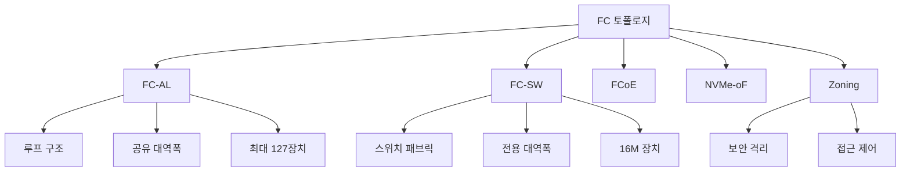

+++
title = "storage network topology"
date = "2026-03-14"
weight = 695
+++

# 스토리지 네트워크 토폴로지 (FC-AL, FC-SW)

#### 핵심 인사이트 (3줄 요약)
> 1. **본질**: SAN (Storage Area Network) 구축을 위한 파이버 채널(Fibre Channel) 연결 방식으로, FC-AL (Arbitrated Loop)은 저비용 루프 구조, FC-SW (Switched Fabric)는 고성능 스위치 기반 메시 구조
> 2. **가치**: FC-SW는 대역폭 128Gbps/port, 16M 디바이스 지원, 무단장치(Failover) 50ms 이내, 엔터프라이즈 스토리지 핵심 인프라
> 3. **융합**: FCoE (Fibre Channel over Ethernet), NVMe-oF (NVMe over Fabrics), 소프트웨어 정의 스토리지와 통합된 차세대 SAN 아키텍처

---

### Ⅰ. 개요 (Context & Background)

**개념 정의**

스토리지 네트워크 토폴로지(Storage Network Topology)는 SAN (Storage Area Network)에서 서버(Host)와 스토리지 장치(Storage Array, Tape Library) 간의 연결 구조를 정의합니다. 파이버 채널(Fibre Channel, FC) 기반 토폴로지는 크게 두 가지로 구분됩니다:

- **FC-AL (Fibre Channel Arbitrated Loop)**: 최대 127개 장치가 단일 루프로 연결되는 저비용 구조
- **FC-SW (Fibre Channel Switched Fabric)**: FC 스위치를 통한 고성능 메시(Mesh) 구조

FC-SW는 현재 엔터프라이즈 SAN의 표준으로, 128Gbps 포트 속도, 16백만 개 디바이스 지원, 다중 경로(Multipath) I/O를 제공합니다.

```
┌─────────────────────────────────────────────────────────────────────┐
│           FC-AL (Arbitrated Loop) vs FC-SW (Switched Fabric)        │
├─────────────────────────────────────────────────────────────────────┤
│                                                                     │
│   ┌──────────────────────────────────────────────────────────────┐ │
│   │                    FC-AL (Arbitrated Loop)                   │ │
│   │                                                              │ │
│   │        ┌────────┐                                            │ │
│   │        │  HBA   │──────────────────────────┐                │ │
│   │        │ Host 1 │                          │                │ │
│   │        └────────┘                          │                │ │
│   │            ▲                               ▼                │ │
│   │            │         ┌────────┐       ┌────────┐           │ │
│   │            │         │Storage │       │  HBA   │           │ │
│   │            │         │ Array  │       │ Host 2 │           │ │
│   │            │         └────────┘       └────────┘           │ │
│   │            ▲                               ▼                │ │
│   │            │         ┌────────┐       ┌────────┐           │ │
│   │            │         │  Tape  │       │ JBOD   │           │ │
│   │            │         │Library │       │ Array  │           │ │
│   │            │         └────────┘       └────────┘           │ │
│   │            └───────────────────────────────┘                │ │
│   │                     (단일 루프)                              │ │
│   │                                                              │ │
│   │   특징:                                                      │ │
│   │   • 최대 127 장치 (실제 126개 권장)                          │ │
│   │   • 공유 대역폭 (128Gbps ÷ 장치 수)                          │ │
│   │   • 하나의 장치 고장 → 전체 루프 중단 (Hub로 완화)            │ │
│   │   • 비용: 낮음 (스위치 불필요)                               │ │
│   └──────────────────────────────────────────────────────────────┘ │
│                                                                     │
│   ┌──────────────────────────────────────────────────────────────┐ │
│   │                    FC-SW (Switched Fabric)                   │ │
│   │                                                              │ │
│   │                    ┌─────────────────┐                      │ │
│   │                    │   FC Switch     │                      │ │
│   │                    │   (Fabric)      │                      │ │
│   │                    │  ┌───────────┐  │                      │ │
│   │                    │  │ Port 1-48 │  │                      │ │
│   │                    │  └───────────┘  │                      │ │
│   │                    └────────┬────────┘                      │ │
│   │            ┌────────────────┼────────────────┐              │ │
│   │            │                │                │              │ │
│   │            ▼                ▼                ▼              │ │
│   │     ┌──────────┐     ┌──────────┐     ┌──────────┐         │ │
│   │     │   HBA    │     │  FC HBA  │     │   HBA    │         │ │
│   │     │  Host 1  │     │  Host 2  │     │  Host 3  │         │ │
│   │     └──────────┘     └──────────┘     └──────────┘         │ │
│   │                                                              │ │
│   │            ┌────────────────┼────────────────┐              │ │
│   │            │                │                │              │ │
│   │            ▼                ▼                ▼              │ │
│   │     ┌──────────┐     ┌──────────┐     ┌──────────┐         │ │
│   │     │ Storage  │     │ Storage  │     │  Tape    │         │ │
│   │     │ Array A  │     │ Array B  │     │ Library  │         │ │
│   │     └──────────┘     └──────────┘     └──────────┘         │ │
│   │                                                              │ │
│   │   특징:                                                      │ │
│   │   • 최대 16M 장치 (Fabric 주소 공간)                         │ │
│   │   • 전용 대역폭 (각 포트 128Gbps)                            │ │
│   │   • 장애 격리 (스위치가 우회 경로 제공)                       │ │
│   │   • 비용: 높음 (FC 스위치 필요)                              │ │
│   └──────────────────────────────────────────────────────────────┘ │
│                                                                     │
└─────────────────────────────────────────────────────────────────────┘
```

> **해설**: FC-AL은 모든 장치가 단일 루프로 연결되어 대역폭을 공유합니다. 하나의 장치 고장 시 전체 루프가 중단될 수 있어 Hub를 사용해 이를 완화합니다. FC-SW는 FC 스위치(Fabric)를 통해 각 장치에 전용 대역폭을 제공하고, 장애를 격리합니다. 엔터프라이즈 환경에서는 FC-SW가 표준입니다.

**💡 비유**: FC-AL은 마치 단일 차선 원형 도로와 같습니다. 모든 차량(장치)이 같은 도로를 공유하며, 한 차량이 고장 나면 전체 도로가 막힙니다. FC-SW는 교차로가 많은 복잡한 고속도로망과 같아, 한 경로가 막혀도 우회할 수 있습니다.

**등장 배경**

① **기존 한계**: DAS (Direct Attached Storage)는 서버-스토리지 1:1 연결, 확장성 부족, 스토리지 실로(Silo)화
② **혁신적 패러다임**: SAN으로 스토리지 네트워크화, 다중 서버 공유, 중앙 집중 관리
③ **비즈니스 요구**: 가상화, 데이터베이스 클러스터, HA (High Availability), 재해 복구

**📢 섹션 요약 비유**: FC-AL은 마치 소규모 회의실에서 모두가 하나의 마이크를 돌려 쓰는 것과 같습니다(공유 대역폭). FC-SW는 각자 헤드셋을 쓰고 동시에 대화하는 것과 같습니다(전용 대역폭).

---

### Ⅱ. 아키텍처 및 핵심 원리 (Deep Dive)

**구성 요소 상세 분석**

| 요소명 | 역할 | 내부 동작 | 프로토콜/규격 | 비유 |
|:---|:---|:---|:---|:---|
| **FC HBA** | 호스트 버스 어댑터 | PCIe → FC 변환, FCP (Fibre Channel Protocol) | FC-LS, FC-FS | 전화기 |
| **FC Switch** | 패브릭 스위칭 | FSPF (Fabric Shortest Path First) 라우팅 | FC-SW, FC-GS | 교환국 |
| **FC Hub (AL)** | 루프 허브 | 포트 바이패스, 루프 유지 | FC-AL-2 | 허브 |
| **SFP/SFP+** | 광 트랜시버 | 850nm/1310nm/1550nm 레이저 | SFF-8472 | 잭 |
| **광케이블** | 물리적 연결 | OM3/OM4 멀티모드, OS2 싱글모드 | TIA-568 | 전화선 |
| **Fabric Service** | 스위치 펌웨어 | Name Server, Zoning, FLOGI | FC-GS-5 | 교환국 서비스 |

**파이버 채널 속도 진화**

```
┌─────────────────────────────────────────────────────────────────────┐
│                  파이버 채널 세대별 속도 진화                        │
├─────────────────────────────────────────────────────────────────────┤
│                                                                     │
│   속도 (Gbps)                                                      │
│   ▲                                                                 │
│   │                                        ┌─────────────────┐     │
│   │    128G ───────────────────────────────│ Gen 7 (2022)    │     │
│   │                               ┌────────┴─────────────────┘     │
│   │     64G ──────────────────────│ Gen 6 (2016)                  │
│   │                      ┌────────┴───────────────────────────┐    │
│   │     32G ─────────────│ Gen 5 (2011)                       │    │
│   │             ┌────────┴────────────────────────────────────┘    │
│   │     16G ────│ Gen 4 (2008)                                   │    │
│   │      ┌──────┴─────────────────────────────────────────────┐   │
│   │     8G ────│ Gen 3 (2004)                                   │   │
│   │     ┌──────┴──────────────────────────────────────────────┘   │
│   │     4G ────│ Gen 2 (2001)                                    │   │
│   │     ┌──────┴─────────────────────────────────────────────┐    │
│   │     2G ────│ Gen 1 (1997)                                   │    │
│   │     ┌──────┴──────────────────────────────────────────────┐   │
│   │     1G ────│ 초기 (1994)                                    │   │
│   └────────────┴──────────────────────────────────────────────────▶│
│              1994  1997  2001  2004  2008  2011  2016  2022        │
│                                                                     │
│   전송 거리:                                                        │
│   • 멀티모드 (OM4): 100m @ 32G, 30m @ 64G, 10m @ 128G             │
│   • 싱글모드 (OS2): 10km @ 32G, 5km @ 64G, 2km @ 128G             │
│   • Active Copper: 5m @ 64G, 3m @ 128G                            │
│                                                                     │
└─────────────────────────────────────────────────────────────────────┘
```

> **해설**: FC 속도는 약 3년마다 2배씩 증가해 왔습니다. Gen 7(128G)은 2022년 표준화되어 현재 최신 세대입니다. 전송 거리는 모드(멀티모드/싱글모드)에 따라 다르며, 데이터센터 내부는 멀티모드, 데이터센터 간은 싱글모드를 사용합니다.

**심층 동작 원리: FC-SW 패브릭 서비스**

① **FLOGI (Fabric Login)**
```
HBA → Switch: "FLOGI 요청 (WWPN: 50:01:43:80:00:00:00:01)"
Switch: "Fabric 이름: 10:00:00:05:1e:xx:xx:xx"
Switch → HBA: "FLOGI ACC (Accepted)"
       - 할당된 Fabric ID: 0x010001
```

② **PLOGI (Port Login)**
```
HBA → Storage Port: "PLOGI 요청 (Node WWN, Port WWN)"
Storage → HBA: "PLOGI ACC (Accepted)"
         - 서비스 파라미터 교환
         - Class of Service 협상 (Class 3: Connectionless)
```

③ **Name Server 조회**
```
HBA → Name Server: "GID_FT (Get IDs by FC-4 Type)"
       - 요청: FCP (SCSI over FC) 디바이스
Name Server → HBA: "디바이스 목록 반환"
       - Storage Array Port 1: 0x010100
       - Storage Array Port 2: 0x010200
```

④ **Zoning 적용**
```
Switch Config:
  Zone "Prod_Servers": HBA1, HBA2, Storage_Port_A
  Zone "Backup": HBA3, Tape_Library
  Zoneset "Active": Prod_Servers, Backup
```

**핵심 알고리즘: FC-AL 어비트레이션 (Arbitration)**

```c
// FC-AL 루프 어비트레이션 (의사코드)
#define AL_PA_NULL 0x00   // 무효 AL_PA
#define MAX_LOOP_DEVICES 126

struct fc_al_device {
    uint8_t al_pa;         // Arbitrated Loop Physical Address
    bool is_master;        // 루프 마스터 여부
    bool has_data;         // 전송할 데이터 있음
};

// 루프 어비트레이션 (전송 권한 획득)
int fc_al_arbitrate(struct fc_al_device *dev) {
    // 1. ARB (Arbitrate) 프리미티브 전송
    send_arb_primitive(dev->al_pa);

    // 2. 모든 장치의 ARB 수신 대기
    uint8_t winning_al_pa = AL_PA_NULL;
    while (receiving_arb()) {
        uint8_t rx_al_pa = receive_arb();
        // 가장 낮은 AL_PA가 승리 (우선순위)
        if (winning_al_pa == AL_PA_NULL || rx_al_pa < winning_al_pa) {
            winning_al_pa = rx_al_pa;
        }
    }

    // 3. 자신이 승리했는지 확인
    if (winning_al_pa == dev->al_pa) {
        // 4. OPN (Open) 프리미티브로 대상 포트 오픈
        send_opn_primitive(target_al_pa);
        return 0;  // 전송 권한 획득
    }

    return -1;  // 다른 장치가 전송 중
}

// FC-AL 포트 바이패스 (장애 격리)
void fc_al_bypass_port(uint8_t failed_al_pa) {
    // Hub가 실패한 포트를 바이패스
    // 루프가 끊어지지 않도록 우회
    hub_bypass_circuit(failed_al_pa);

    // 나머지 장치들이 루프 재구성
    loop_reinitialization();
}
```

**FC-SW 라우팅: FSPF (Fabric Shortest Path First)**

```
┌─────────────────────────────────────────────────────────────────────┐
│                FSPF 라우팅 예시 (다중 스위치 패브릭)                 │
├─────────────────────────────────────────────────────────────────────┤
│                                                                     │
│                     ┌─────────────────────────┐                    │
│                     │     Switch A (Domain 1) │                    │
│                     │    FSPF Cost: 기준점    │                    │
│                     └───────────┬─────────────┘                    │
│                        Port 1    │    Port 2                        │
│                     Cost: 1000   │   Cost: 1000                     │
│                                 │                                  │
│          ┌──────────────────────┼──────────────────────┐           │
│          │                      │                      │           │
│          ▼                      │                      ▼           │
│   ┌────────────────┐            │            ┌────────────────┐   │
│   │ Switch B       │            │            │ Switch C       │   │
│   │ (Domain 2)     │◄───────────┼───────────►│ (Domain 3)     │   │
│   │ Cost from A:   │  ISL Cost  │  ISL Cost  │ Cost from A:   │   │
│   │ 1000           │   1000     │   1000     │ 1000           │   │
│   └───────┬────────┘            │            └───────┬────────┘   │
│           │                     │                    │             │
│           ▼                     │                    ▼             │
│   ┌────────────────┐            │            ┌────────────────┐   │
│   │ Host 1         │            │            │ Storage Array  │   │
│   │ Domain 2       │            │            │ Domain 3       │   │
│   └────────────────┘            │            └────────────────┘   │
│                                 │                                  │
│   Host 1 → Storage Array 최단 경로:                               │
│   Switch A → Switch C → Storage (Cost: 2000)                      │
│   Switch A → Switch B → Switch C → Storage (Cost: 3000) ← 비권장  │
│                                                                     │
│   ※ FSPF는 링크 상태(Link State) 기반, Dijkstra 알고리즘 사용      │
│   ※ ISL (Inter-Switch Link) 비용은 대역폭에 반비례                 │
│                                                                     │
└─────────────────────────────────────────────────────────────────────┘
```

**📢 섹션 요약 비유**: FC-SW의 FSPF 라우팅은 마치 자동차 내비게이션과 같습니다. 여러 경로 중 가장 빠른 경로를 선택하고, 도로(링크) 상태에 따라 우회합니다. FC-AL은 단일 차선 도로라 앞차가 느리면 기다려야 합니다.

---

### Ⅲ. 융합 비교 및 다각도 분석 (Comparison & Synergy)

**기술 비교: FC-AL vs FC-SW vs 이더넷 iSCSI**

| 비교 항목 | FC-AL | FC-SW | iSCSI (Ethernet) | FCoE |
|:---|:---:|:---:|:---:|:---:|
| **최대 장치 수** | 127 | 16M | 무제한 | 무제한 |
| **대역폭/포트** | 공유 | 128Gbps | 100Gbps | 100Gbps |
| **지연 시간** | 가변 | 1~2µs | 10~50µs | 2~5µs |
| **장애 격리** | Hub 필요 | 스위치 | 스위치 | 스위치 |
| **비용/포트** | 낮음 | 높음 ($500~2000) | 낮음 ($100~500) | 중간 |
| **거리** | 10km | 100km | 무제한 (IP) | 데이터센터 내 |
| **관리 복잡도** | 낮음 | 높음 | 중간 | 높음 |
| **적용 시나리오** | 소규모 | 엔터프라이즈 | SMB/클라우드 | 컨버지드 |

**과목 융합 관점: FC 토폴로지와 타 영역 시너지**

| 융합 영역 | 시너지 효과 | 구현 예시 |
|:---|:---|:---|
| **OS (디바이스 드라이버)** | HBA 드라이버, 다중 경로 I/O | Linux DM-Multipath, Windows MPIO |
| **네트워크** | FCoE, IP over FC | 데이터센터 브리징 (DCB) |
| **DB (데이터베이스)** | ASM (Automatic Storage Management) | Oracle RAC + FC-SW |
| **가상화** | vSphere VMFS, RDM | VMware NPIV (N_Port ID Virtualization) |
| **보안** | Zoning, LUN Masking | Fabric 기반 접근 제어 |

**FC-SW vs FC-AL 성능 비교**

```
┌─────────────────────────────────────────────────────────────────────┐
│             FC-SW vs FC-AL 처리량 비교 (32Gbps 환경)                │
├─────────────────────────────────────────────────────────────────────┤
│                                                                     │
│   처리량 (GB/s)                                                    │
│   ▲                                                                 │
│   │                                        ┌─────────────────┐     │
│   │    12GB/s ─────────────────────────────│ FC-SW           │     │
│   │                               ┌────────┴─────────────────┘     │
│   │                               │ (각 포트 전용 대역폭)          │
│   │                               │                               │
│   │     6GB/s ────────────────────┼───────────────────────────┐   │
│   │                      ┌────────┴───────────────────────┐   │   │
│   │     3GB/s ───────────│ FC-AL (20 장치 공유)           │   │   │
│   │             ┌────────┴────────────────────────────────┘   │   │
│   │     1.5GB/s ────────│ FC-AL (50 장치 공유)                │   │
│   │      ┌──────────────┴─────────────────────────────────────┘  │
│   │ 0.8GB/s ──────────│ FC-AL (100 장치 공유)                   │
│   │      ┌────────────┴─────────────────────────────────────────┐│
│   └────────┴─────────────────────────────────────────────────────▶│
│            FC-SW   AL-20   AL-50   AL-100                         │
│                                                                     │
│   ※ FC-SW는 장치 수와 무관하게 각 포트 전용 대역폭 유지             │
│   ※ FC-AL은 장치 수 증가 시 공유 대역폭 감소                        │
│   ※ 실제 환경에서 FC-AL은 30개 장치 이하 권장                       │
│                                                                     │
└─────────────────────────────────────────────────────────────────────┘
```

> **해설**: FC-SW는 장치 수와 무관하게 각 포트가 전용 대역폭(32Gbps ≈ 12GB/s)을 유지합니다. 반면 FC-AL은 장치 수가 증가할수록 공유 대역폭이 감소합니다. 100개 장치 연결 시 FC-AL은 0.8GB/s로 FC-SW 대비 1/15 성능을 보입니다.

**📢 섹션 요약 비유**: FC-SW와 FC-AL의 차이는 마시 자동차 도로와 대중교통의 차이와 같습니다. FC-SW는 각자 차를 타고 목적지까지 바로 가는 것(전용 대역폭), FC-AL은 버스를 타고 여러 정거장을 거치는 것(공유 대역폭)입니다.

---

### Ⅳ. 실무 적용 및 기술사적 판단 (Strategy & Decision)

**실무 시나리오별 적용**

**시나리오 1: 엔터프라이즈 데이터베이스 SAN**
- **문제**: Oracle RAC 클러스터, 10TB DB, IOPS 50,000+
- **해결**: FC-SW 64Gbps, 이중 패브릭, MPIO Active-Active
- **의사결정**: FC-AL은 대역폭 부족, iSCSI는 지연으로 부적합

**시나리오 2: 중소기업 파일 서버**
- **문제**: 5대 서버, 50TB 스토리지, 비용 제약
- **해결**: FC-AL Hub, 16Gbps, 20장치 연결
- **의사결정**: FC-SW 대비 50% 비용 절감

**시나리오 3: 재해 복구 사이트**
- **문제**: 100km 거리, 실시간 복제, FC 연결
- **해결**: FC-SW + DWDM (Dense Wavelength Division Multiplexing)
- **의사결정**: 싱글모드 광케이블, 100km 전송

**도입 체크리스트**

| 구분 | 항목 | 확인 포인트 |
|:---|:---|:---|
| **기술적** | 워크로드 분석 | IOPS, 대역폭 요구, 지연 허용치 |
| | 장치 수 | FC-AL: <30, FC-SW: 무제한 |
| | 거리 요구사항 | 멀티모드: <100m, 싱글모드: >100m |
| **운영적** | HA 구성 | 이중 패브릭, 다중 경로 |
| | 보안 | Zoning, LUN Masking 정책 |
| | 모니터링 | 포트 상태, 에러율, 대역폭 활용률 |
| **비용적** | TCO 분석 | FC-SW 스위치 비용 vs 이더넷 iSCSI |
| | 확장성 | 향후 장치 증가 계획 |

**안티패턴: FC 토폴로지 오용 사례**

| 안티패턴 | 문제점 | 올바른 접근 |
|:---|:---|:---|
| **FC-AL 과다 연결** | 100개+ 장치 → 성능 붕괴 | 30개 이하, 또는 FC-SW |
| **단일 패브릭** | 스위치 고장 → 전체 장애 | 이중 패브릭 필수 |
| **Zoning 미설정** | 모든 장치 간 통신 가능 → 보안 위험 | 최소 권한 Zoning |
| **구형 FC 세대** | 4Gbps/8Gbps 장비 → 병목 | 32Gbps/64Gbps 업그레이드 |

**📢 섹션 요약 비유**: FC 토폴로지 선택은 마치 도로 계획과 같습니다. 소규모 주거 단지는 단일 진입로(FC-AL)로 충분하지만, 대형 산업단지는 복잡한 도로망(FC-SW)이 필요합니다. 단일 도로(단일 패브릭)는 공사(장애) 시 전체 마비되므로, 대체 도로(이중 패브릭)를 만들어야 합니다.

---

### Ⅴ. 기대효과 및 결론 (Future & Standard)

**정량/정성 기대효과**

| 구분 | FC-AL | FC-SW | 개선효과 (FC-SW) |
|:---|:---:|:---:|:---:|
| **장치 수** | 127 | 16M | 125,000배 확장 |
| **대역폭/장치** | 공유 | 128Gbps 전용 | 일관된 성능 |
| **장애 격리** | Hub 필요 | 자동 | 즉시 복구 |
| **지연 시간** | 가변 | 1~2µs | 예측 가능 |
| **TCO (5년)** | 낮음 | 높음 | 비용/성능 균형 |

**미래 전망**

1. **NVMe-oF (NVMe over Fabrics)**: FC-SW + NVMe, 지연 50% 단축
2. **FC-NVMe**: 네이티브 NVMe over Fibre Channel, Gen 7 (128Gbps)
3. **FCoE 컨버지드**: 이더넷과 FC 통합, 비용 절감
4. **소프트웨어 정의 SAN**: SDN (Software Defined Networking) 기반 FC 관리

**참고 표준**

| 표준 | 내용 | 적용 |
|:---|:---|:---|
| **FC-FS-5** | FC-2, FC-3 계층 | 프레이밍, 흐름 제어 |
| **FC-LS-3** | FC-2e (Link Services) | FLOGI, PLOGI, RSCN |
| **FC-SW-6** | 스위치 패브릭 | FSPF, Zoning, Name Server |
| **FC-AL-2** | 어비트레이션 루프 | AL_PA, ARB, OPN |
| **FC-NVMe** | NVMe over FC | NVMe 명령 캡슐화 |

**📢 섹션 요약 비유**: FC 기술의 미래는 마치 통신망의 진화와 같습니다. 초기 전화 교환(FC-AL)에서 디지털 교환국(FC-SW), 그리고 현재는 인터넷 프로토콜(NVMe-oF, FCoE)로 통합되어 가고 있습니다.

---

### 📌 관련 개념 맵 (Knowledge Graph)



**연관 개념 링크**:
- 파이버 채널 (Fibre Channel) - FC 프로토콜 상세
- SAN (Storage Area Network) - 스토리지 네트워크 개요
- 멀티패스 I/O - 다중 경로 이중화
- LUN 마스킹 - 스토리지 접근 제어
- iSCSI - IP 기반 스토리지 프로토콜
- NVMe-oF - 차세대 스토리지 전송

---

### 👶 어린이를 위한 3줄 비유 설명

1. **원형 도로 vs 교차로**: FC-AL은 모든 차가 하나의 원형 도로를 도는 것 같아요. 한 차가 고장 나면 다 막혀요. FC-SW는 복잡한 고속도로망이라 우회할 수 있어요.

2. **전용 차선**: FC-SW에서는 각 컴퓨터가 자기만의 전용 차선을 가질 수 있어요. 다른 차를 기다릴 필요 없이 빠르게 데이터를 보낼 수 있어요.

3. **교환국 역할**: FC 스위치는 전화 교환국 같아요. 누가 누구에게 연결될지 정해주고, 잘못된 연결은 차단해요. 마치 보안 검색대 같아요!