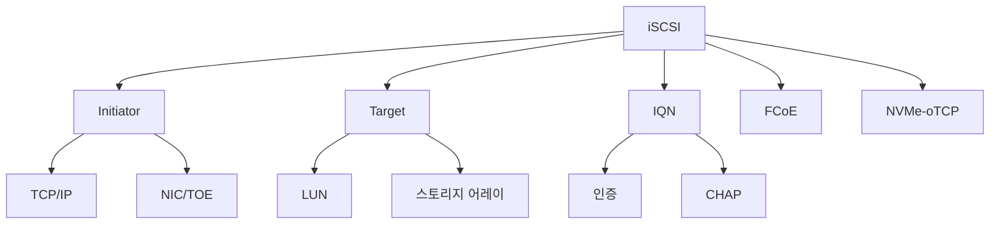

+++
title = "iscsi"
date = "2026-03-14"
weight = 698
+++

# iSCSI (Internet Small Computer System Interface)

#### 핵심 인사이트 (3줄 요약)
> 1. **본질**: SCSI 프로토콜을 TCP/IP로 캡슐화하여 이더넷 네트워크에서 스토리지 블록 액세스를 제공하는 IP 스토리지 표준
> 2. **가치**: FC SAN의 1/10 비용, 기존 이더넷 인프라 활용, 장거리 복제, 클라우드 스토리지 연동
> 3. **융합**: TCP/IP, SCSI, 이더넷 스위치, 스토리지 어레이, 하이퍼바이저와 통합된 IP 스토리지 생태계

---

### Ⅰ. 개요 (Context & Background)

**개념 정의**

iSCSI (Internet Small Computer System Interface)는 SCSI(Small Computer System Interface) 명령을 TCP/IP 패킷으로 캡슐화하여 IP 네트워크를 통해 블록 스토리지에 접근하는 프로토콜입니다. FC(Fibre Channel)와 달리 기존 이더넷 인프라를 그대로 사용하여 SAN(Storage Area Network)을 구축할 수 있습니다.

```
┌─────────────────────────────────────────────────────────────────────┐
│                    iSCSI vs Fibre Channel 아키텍처                    │
├─────────────────────────────────────────────────────────────────────┤
│                                                                     │
│   ┌──────────────────────────────────────────────────────────────┐ │
│   │                    Fibre Channel (FC)                         │ │
│   │                                                              │ │
│   │  ┌────────────┐   ┌────────────┐   ┌────────────┐           │ │
│   │  │ Server     │ → │ FC Switch  │ → │ FC Storage │           │ │
│   │  │ + HBA      │   │            │   │ Array      │           │ │
│   │  └────────────┘   └────────────┘   └────────────┘           │ │
│   │       │                │                │                     │ │
│   │  전용 광케이블    전용 스위치      고가 장비                  │ │
│   │  32Gbps          $10,000+         $50,000+                   │ │
│   └──────────────────────────────────────────────────────────────┘ │
│                                                                     │
│   ┌──────────────────────────────────────────────────────────────┐ │
│   │                    iSCSI (IP Storage)                         │ │
│   │                                                              │ │
│   │  ┌────────────┐   ┌────────────┐   ┌────────────┐           │ │
│   │  │ Server     │ → │ Ethernet   │ → │ iSCSI      │           │ │
│   │  │ + NIC/TOE  │   │ Switch     │   │ Target     │           │ │
│   │  └────────────┘   └────────────┘   └────────────┘           │ │
│   │       │                │                │                     │ │
│   │  표준 이더넷      기존 스위치      일반 서버/스토리지         │ │
│   │  10/25/100GbE    $1,000~         $5,000+                    │ │
│   └──────────────────────────────────────────────────────────────┘ │
│                                                                     │
└─────────────────────────────────────────────────────────────────────┘
```

> **해설**: FC는 전용 광케이블과 스위치가 필요하여 비용이 높지만, iSCSI는 기존 이더넷 인프라를 그대로 사용하여 비용을 1/10 수준으로 절감합니다.

**💡 비유**: FC는 전용 고속철도와 같고, iSCSI는 일반 도로를 사용하는 택배 서비스와 같습니다. 전용 철도는 빠르지만 비싸고, 택배는 느릴 수 있지만 저렴하고 어디든 갈 수 있습니다.

**등장 배경**

① **기존 한계**: FC SAN은 고가의 전용 장비 필요 → 중소기업 도입 어려움
② **혁신적 패러다임**: iSCSI로 기존 이더넷 인프라 활용 → 비용 절감
③ **비즈니스 요구**: IP 네트워크 친숙성, 장거리 복제, 클라우드 연동

**📢 섹션 요약 비유**: iSCSI는 전용 고속철도(FC) 대신 일반 도로(이더넷)로 화물(SCSI)을 나르는 것과 같습니다. 더 느릴 수 있지만 훨씬 저렴합니다.

---

### Ⅱ. 아키텍처 및 핵심 원리 (Deep Dive)

**구성 요소 상세 분석**

| 요소명 | 역할 | 내부 동작 | 프로토콜/규격 | 비유 |
|:---|:---|:---|:---|:---|
| **iSCSI Initiator** | 클라이언트 | SCSI 명령 생성, TCP 연결 | RFC 5048 | 발신자 |
| **iSCSI Target** | 서버/스토리지 | SCSI 명령 처리, LUN 노출 | RFC 5048 | 수신자 |
| **IQN** | 식별자 | iSCSI Qualified Name | RFC 5048 | 주소 |
| **LUN** | 논리 유닛 | Logical Unit Number | SCSI | 우편번호 |
| **PDU** | 프로토콜 데이터 유닛 | iSCSI 패킷 캡슐화 | RFC 5048 | 택배 박스 |
| **TOE/NIC** | 하드웨어 가속 | TCP 오프로드 | TCP/IP | 특급 배송 |

**iSCSI 프로토콜 스택**

```
┌─────────────────────────────────────────────────────────────────────┐
│                    iSCSI 프로토콜 스택                               │
├─────────────────────────────────────────────────────────────────────┤
│                                                                     │
│   ┌──────────────────────────────────────────────────────────────┐ │
│   │                    송신 측 (Initiator)                        │ │
│   │                                                              │ │
│   │   ┌────────────┐                                             │ │
│   │   │ SCSI       │  ← 응용계층 (파일 시스템, DB)               │ │
│   │   │ Command    │                                             │ │
│   │   └────────────┘                                             │ │
│   │         │                                                     │ │
│   │         ▼                                                     │ │
│   │   ┌────────────┐                                             │ │
│   │   │ iSCSI      │  ← 캡슐화 (SCSI → iSCSI PDU)                │ │
│   │   │ Protocol   │                                             │ │
│   │   └────────────┘                                             │ │
│   │         │                                                     │ │
│   │         ▼                                                     │ │
│   │   ┌────────────┐                                             │ │
│   │   │ TCP        │  ← 전송계층 (신뢰성 보장)                    │ │
│   │   │ (Port 3260)│                                             │ │
│   │   └────────────┘                                             │ │
│   │         │                                                     │ │
│   │         ▼                                                     │ │
│   │   ┌────────────┐                                             │ │
│   │   │ IP         │  ← 네트워크계층 (라우팅)                     │ │
│   │   │            │                                             │ │
│   │   └────────────┘                                             │ │
│   │         │                                                     │ │
│   │         ▼                                                     │ │
│   │   ┌────────────┐                                             │ │
│   │   │ Ethernet   │  ← 데이터링크계층 (MAC 주소)                 │ │
│   │   │            │                                             │ │
│   │   └────────────┘                                             │ │
│   └──────────────────────────────────────────────────────────────┘ │
│                                                                     │
│                         네트워크 전송                               │
│                                                                     │
│   ┌──────────────────────────────────────────────────────────────┐ │
│   │                    수신 측 (Target)                           │ │
│   │                                                              │ │
│   │   Ethernet → IP → TCP → iSCSI → SCSI → Disk I/O             │ │
│   │                                                              │ │
│   └──────────────────────────────────────────────────────────────┘ │
│                                                                     │
└─────────────────────────────────────────────────────────────────────┘
```

> **해설**: iSCSI는 SCSI 명령을 iSCSI PDU로 캡슐화하고, 이를 TCP/IP로 전송합니다. 수신 측에서는 역순으로 디캡슐화하여 SCSI 명령을 실행합니다.

**핵심 알고리즘: iSCSI PDU 구조**

```c
// iSCSI PDU 구조 (의사코드)
struct iSCSI_PDU {
    // Basic Header Segment (BHS) - 48 bytes
    struct {
        uint8_t  opcode;        // 명령 유형 (SCSI_CMD=0x01, SCSI_RSP=0x21)
        uint8_t  flags;         // 플래그 (F=Final, A=Ack)
        uint16_t reserved1;
        uint32_t total_data_length;  // 전체 데이터 길이
        uint32_t lun;           // Logical Unit Number
        uint32_t itt;           // Initiator Task Tag (요청 ID)
        uint32_t ttt;           // Target Transfer Tag (응답 ID)
        uint32_t status;        // 상태 (0x00=Good, 0x02=Check Condition)
        uint8_t  data[16];      // 명령별 데이터
    } bhs;

    // Additional Header Segments (AHS) - optional
    struct {
        uint8_t  length;
        uint8_t  type;
        uint8_t  data[];
    } *ahs;

    // Header Digest (CRC32C) - optional
    uint32_t header_digest;

    // Data Segment - 가변 길이
    uint8_t  data[];

    // Data Digest (CRC32C) - optional
    uint32_t data_digest;
};

// IQN (iSCSI Qualified Name) 예시
// Format: iqn.yyyy-mm.reverse-domain-name:identifier
// Example: iqn.2023-03.com.example:storage.disk1

// iSCSI 세션 연결 과정
iSCSI_STATUS iSCSI_Connect(
    char *target_ip,
    int target_port,     // 기본 3260
    char *iqn
) {
    // 1. TCP 연결
    socket = TCP_Connect(target_ip, target_port);

    // 2. iSCSI 로그인 (Login Stage)
    SendLoginPDU(socket, iqn, auth_method);
    response = ReceiveLoginResponse(socket);

    if (response.status != SUCCESS) {
        return ERROR;
    }

    // 3. Full Feature Phase (명령 수행)
    while (active) {
        SendSCSICommand(socket, lun, command, data);
        response = ReceiveSCSIResponse(socket);
    }

    // 4. 로그아웃
    SendLogoutPDU(socket);

    return SUCCESS;
}
```

**📢 섹션 요약 비유**: iSCSI PDU는 택배 박스와 같습니다. SCSI 명령(물건)을 iSCSI 박스에 담고, TCP/IP(배송 라벨)를 붙여서 전송합니다.

---

### Ⅲ. 융합 비교 및 다각도 분석 (Comparison & Synergy)

**기술 비교: iSCSI vs Fibre Channel vs FCoE**

| 비교 항목 | iSCSI | Fibre Channel | FCoE |
|:---|:---:|:---:|:---:|
| **전송 계층** | TCP/IP | FC-2 | Ethernet |
| **네트워크** | IP 라우팅 | FC 패브릭 | Converged |
| **속도** | 10~100GbE | 32~128Gbps | 10~100GbE |
| **거리** | 무제한 (IP) | ~100km | ~100km |
| **비용** | 낮음 | 높음 | 중간 |
| **지연** | ~1ms | ~0.1ms | ~0.5ms |
| **복잡도** | 낮음 | 높음 | 중간 |
| **라우팅** | 가능 | 불가능 | 불가능 |

**과목 융합 관점: iSCSI와 타 영역 시너지**

| 융합 영역 | 시너지 효과 | 구현 예시 |
|:---|:---|:---|
| **OS (운영체제)** | iSCSI Initiator 드라이버 | Linux open-iscsi, Windows iSCSI |
| **네트워크** | TCP/IP, VLAN, QoS | 10GbE, Jumbo Frame |
| **가상화** | VM 직접 iSCSI 연결 | vSphere iSCSI, Hyper-V |
| **클라우드** | 클라우드 블록 스토리지 | AWS EBS, Azure Disk |
| **보안** | CHAP, IPsec | 인증, 암호화 |

**📢 섹션 요약 비유**: iSCSI는 FC의 고속철도와 달리 일반 도로를 사용하므로 느리지만, 어디든 갈 수 있고(IP 라우팅) 저렴합니다. FCoE는 고속도로와 일반 도로를 합친 것과 같습니다.

---

### Ⅳ. 실무 적용 및 기술사적 판단 (Strategy & Decision)

**실무 시나리오별 적용**

**시나리오 1: 중소기업 스토리지 통합**
- **문제**: FC SAN 비용 과다, 스토리지 분산
- **해결**: iSCSI SAN으로 기존 이더넷 활용
- **의사결정**: 비용 1/10, 관리 용이성

**시나리오 2: 재해 복구 (DR)**
- **문제**: FC는 거리 제한 (~100km)
- **해결**: iSCSI로 원격 복제 (WAN)
- **의사결정**: IP 네트워크로 무제한 거리

**시나리오 3: 클라우드 스토리지**
- **문제**: 온프레미스-클라우드 연결
- **해결**: iSCSI 게이트웨이
- **의사결정**: 하이브리드 클라우드

**도입 체크리스트**

| 구분 | 항목 | 확인 포인트 |
|:---|:---|:---|
| **기술적** | 네트워크 | 10GbE+ 권장, Jumbo Frame |
| | 보안 | CHAP, IPsec, VLAN 격리 |
| | 성능 | TOE/NIC, TCP 오프로드 |
| **운영적** | IQN 관리 | 명명 규칙 수립 |
| | 모니터링 | 지연, 대역폭, 에러 |
| | 장애 조치 | Multipath I/O (MPIO) |

**안티패턴: iSCSI 오용 사례**

| 안티패턴 | 문제점 | 올바른 접근 |
|:---|:---|:---|
| **공용 네트워크 사용** | 성능 저하, 보안 취약 | 전용 VLAN/IoV |
| **Jumbo Frame 미사용** | 오버헤드 증가 | MTU 9000 설정 |
| **CHAP 미사용** | 무단 접근 위험 | 양방향 CHAP |
| **단일 경로** | SPOF | MPIO 다중 경로 |

**📢 섹션 요약 비유**: iSCSI 도입은 고속철도(FC) 대신 고속도로(이더넷)를 선택하는 것과 같습니다. 더 느릴 수 있지만 더 저렴하고 더 멀리 갈 수 있습니다.

---

### Ⅴ. 기대효과 및 결론 (Future & Standard)

**정량/정성 기대효과**

| 구분 | FC SAN | iSCSI SAN | 개선효과 |
|:---|:---:|:---:|:---:|
| **비용** | $100,000+ | $10,000+ | 90% 절감 |
| **거리** | ~100km | 무제한 | DR 용이 |
| **관리** | 전문가 필요 | IP 친숙 | 운영 단순 |
| **확장** | FC 패브릭 | 이더넷 | 유연성 |

**미래 전망**

1. **NVMe over TCP**: iSCSI 대체, 더 낮은 지연
2. **25/100GbE**: 대역폭 증가로 FC 수준 성능
3. **클라우드 iSCSI**: 클라우드 게이트웨이 확대
4. **AI 스토리지**: AI 워크로드 최적화

**참고 표준**

| 표준 | 내용 | 적용 |
|:---|:---|:---|
| **RFC 3720** | iSCSI 기본 규격 | 2004년 |
| **RFC 5048** | iSCSI 개정 | 2007년 |
| **RFC 7143** | iSCSI 최신 | 2014년 |
| **RFC 8174** | iSCSI 보안 | 2017년 |

**📢 섹션 요약 비유**: iSCSI의 미래는 고속도로가 더 넓어지는 것과 같습니다. 100GbE로 확장되면 고속철도(FC)와 비슷한 성능을 더 저렴하게 제공합니다.

---

### 📌 관련 개념 맵 (Knowledge Graph)



**연관 개념 링크**:
- Fibre Channel Protocol - FC 프로토콜 스택
- FCoE - Fibre Channel over Ethernet
- NVMe over Fabrics - NVMe 네트워크 프로토콜
- Storage Network Topology - SAN 토폴로지

---

### 👶 어린이를 위한 3줄 비유 설명

1. **택배 배송**: iSCSI는 택배 회사 같아요! 컴퓨터가 보낸 요청을 인터넷 도로를 통해 스토리지 창고로 배달해요.

2. **주소 표시**: IQN은 택배 주소 같아요! "2023년 서울의 스토리지 1번"처럼 정확한 주소를 써서 보내요.

3. **전용 도로**: iSCSI는 일반 도로를 쓰지만, 고속도로(10GbE)와 큰 트럭(Jumbo Frame)을 쓰면 빠르게 배달해요!