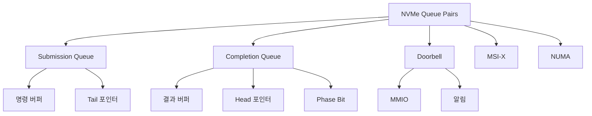

+++
title = "nvme queue pairs"
date = "2026-03-14"
weight = 699
+++

# NVMe 큐 쌍 (Queue Pairs)

#### 핵심 인사이트 (3줄 요약)
> 1. **본질**: NVMe의 핵심 병렬성 메커니즘으로, 다수의 독립적인 SQ(Submission Queue)와 CQ(Completion Queue) 쌍으로 I/O 명령을 동시에 처리
> 2. **가치**: 단일 큐(ATA/SATA) 대비 수천 배 병렬성, CPU 코어별 큐 할당, NUMA 최적화, 지연 최소화
> 3. **융합**: MSI-X 인터럽트, Doorbell 레지스터, PRP/SGL, PCIe 트랜잭션과 통합된 고성능 I/O 파이프라인

---

### Ⅰ. 개요 (Context & Background)

**개념 정의**

NVMe Queue Pairs는 NVMe(Non-Volatile Memory Express) 컨트롤러의 핵심 아키텍처로, Submission Queue(SQ)와 Completion Queue(CQ)로 구성된 명령 처리 채널입니다. 각 큐 쌍은 독립적으로 작동하며, 최대 65,536개의 큐 쌍(각 큐당 최대 65,536 엔트리)을 지원합니다.

```
┌─────────────────────────────────────────────────────────────────────┐
│                    NVMe 큐 쌍 vs SATA 큐 비교                        │
├─────────────────────────────────────────────────────────────────────┤
│                                                                     │
│   ┌──────────────────────────────────────────────────────────────┐ │
│   │                    SATA/AHCI (Legacy)                         │ │
│   │                                                              │ │
│   │   ┌────────────────────────────────────────────────────────┐ │ │
│   │   │                    단일 큐                              │ │ │
│   │   │   ┌───┬───┬───┬───┬───┬───┬───┬───┬───┬───┬───┐      │ │ │
│   │   │   │ 0 │ 1 │ 2 │ 3 │ 4 │ 5 │ 6 │ 7 │ 8 │ 9 │...│      │ │ │
│   │   │   └───┴───┴───┴───┴───┴───┴───┴───┴───┴───┴───┘      │ │ │
│   │   │                     ↓                                   │ │ │
│   │   │              1개 명령만 처리                             │ │ │
│   │   │            (32 commands max)                            │ │ │
│   │   └────────────────────────────────────────────────────────┘ │ │
│   │                                                              │ │
│   │   문제점: 순차 처리, 락 경합, 낮은 병렬성                      │ │
│   └──────────────────────────────────────────────────────────────┘ │
│                                                                     │
│   ┌──────────────────────────────────────────────────────────────┐ │
│   │                    NVMe (Modern)                              │ │
│   │                                                              │ │
│   │   ┌─────────────┐ ┌─────────────┐ ┌─────────────┐           │ │
│   │   │   SQ/CQ 0   │ │   SQ/CQ 1   │ │   SQ/CQ 2   │  ...      │ │
│   │   │ ┌─┬─┬─┬─┬─┐ │ │ ┌─┬─┬─┬─┬─┐ │ │ ┌─┬─┬─┬─┬─┐ │           │ │
│   │   │ │0│1│2│3│4│ │ │ │0│1│2│3│4│ │ │ │0│1│2│3│4│ │           │ │
│   │   │ └─┴─┴─┴─┴─┘ │ │ └─┴─┴─┴─┴─┘ │ │ └─┴─┴─┴─┴─┘ │           │ │
│   │   │   Admin     │ │   I/O       │ │   I/O       │           │ │
│   │   └─────────────┘ └─────────────┘ └─────────────┘           │ │
│   │         ↓               ↓               ↓                    │ │
│   │    Admin 명령       CPU Core 0       CPU Core 1             │ │
│   │                    (65535 entries)   (65535 entries)         │ │
│   │                                                              │ │
│   │   장점: 병렬 처리, 락 없음, 높은 병렬성                        │ │
│   └──────────────────────────────────────────────────────────────┘ │
│                                                                     │
└─────────────────────────────────────────────────────────────────────┘
```

> **해설**: SATA/AHCI는 단일 큐에 최대 32개 명령만 가능하지만, NVMe는 최대 65,536개 큐에 각각 65,536개 명령을 지원합니다. 이는 40억 개 이상의 동시 명령 처리가 가능함을 의미합니다.

**💡 비유**: SATA는 1차선 도로에서 한 대씩만 통과하는 톨게이트와 같고, NVMe는 65,536개 차선이 있어 동시에 수만 대가 통과하는 초대형 톨게이트와 같습니다.

**등장 배경**

① **기존 한계**: SATA/AHCI는 단일 큐, 32 명령 제한 → SSD 병렬성 활용 불가
② **혁신적 패러다임**: NVMe로 다중 큐 쌍, 65K 명령 지원 → 병렬성 극대화
③ **비즈니스 요구**: 고성능 SSD, 낮은 지연, 높은 IOPS, 멀티코어 활용

**📢 섹션 요약 비유**: NVMe 큐 쌍은 1차선 도로(SATA)에서 65,536차선 고속도로로 확장하는 것과 같습니다. 동시에 수만 개의 차량(명령)이 달릴 수 있습니다.

---

### Ⅱ. 아키텍처 및 핵심 원리 (Deep Dive)

**구성 요소 상세 분석**

| 요소명 | 역할 | 내부 동작 | 프로토콜/규격 | 비유 |
|:---|:---|:---|:---|:---|
| **SQ (Submission Queue)** | 명령 제출 | 호스트→컨트롤러 명령 버퍼 | NVMe 2.0 | 발신함 |
| **CQ (Completion Queue)** | 완료 통지 | 컨트롤러→호스트 결과 버퍼 | NVMe 2.0 | 수신함 |
| **Doorbell 레지스터** | 큐 갱신 | SQ/CQ Tail 포인터 갱신 | NVMe 2.0 | 알림 버튼 |
| **Admin Queue** | 관리 명령 | 생성/삭제, 펌웨어 업데이트 | NVMe 2.0 | 관리실 |
| **I/O Queue** | 데이터 명령 | Read/Write, Flush | NVMe 2.0 | 작업장 |
| **MSI-X** | 인터럽트 | 큐별 독립 인터럽트 | PCIe | 호출벨 |

**NVMe 큐 쌍 동작 시퀀스**

```
┌─────────────────────────────────────────────────────────────────────┐
│                    NVMe 큐 쌍 동작 시퀀스                            │
├─────────────────────────────────────────────────────────────────────┤
│                                                                     │
│   Host (CPU)                        NVMe Controller                 │
│   ┌─────────────────┐               ┌─────────────────┐            │
│   │                 │               │                 │            │
│   │  1. 명령 생성    │               │                 │            │
│   │  ┌────────────┐ │               │                 │            │
│   │  │ NVMe Cmd   │ │               │                 │            │
│   │  │ (Read/Write)│ │               │                 │            │
│   │  └────────────┘ │               │                 │            │
│   │         │        │               │                 │            │
│   │         ▼        │               │                 │            │
│   │  2. SQ에 작성    │               │                 │            │
│   │  SQ[Tail++] = Cmd│               │                 │            │
│   │         │        │               │                 │            │
│   │         │        │  3. Doorbell  │                 │            │
│   │         ├────────┼──────────────►│ SQ.Tail 갱신   │            │
│   │         │        │    Ring       │                 │            │
│   │         │        │               │         │       │            │
│   │         │        │               │         ▼       │            │
│   │         │        │               │  4. 명령 처리   │            │
│   │         │        │               │  (NAND Flash)  │            │
│   │         │        │               │         │       │            │
│   │         │        │               │         ▼       │            │
│   │         │        │  5. CQ에 결과 │                 │            │
│   │         │        │◄──────────────┤ CQ[Head++] = Res│            │
│   │         │        │    작성       │                 │            │
│   │         │        │               │                 │            │
│   │         │        │  6. MSI-X     │                 │            │
│   │         │◄───────┼───────────────│    인터럽트     │            │
│   │         │        │    Interrupt  │                 │            │
│   │         ▼        │               │                 │            │
│   │  7. CQ 확인      │               │                 │            │
│   │  결과 처리       │               │                 │            │
│   │         │        │               │                 │            │
│   │         │        │  8. Doorbell  │                 │            │
│   │         ├────────┼──────────────►│ CQ.Head 갱신   │            │
│   │         │        │    Ring       │                 │            │
│   │         ▼        │               │                 │            │
│   │  완료!           │               │                 │            │
│   │                 │               │                 │            │
│   └─────────────────┘               └─────────────────┘            │
│                                                                     │
└─────────────────────────────────────────────────────────────────────┘
```

> **해설**: 호스트는 SQ에 명령을 작성하고 Doorbell을 눌러 컨트롤러에 알립니다. 컨트롤러는 명령을 처리하고 CQ에 결과를 작성한 후 MSI-X 인터럽트로 호스트에 알립니다.

**핵심 알고리즘: NVMe 큐 쌍 관리**

```c
// NVMe 큐 구조 (의사코드)
struct NVMe_Queue_Pair {
    // Submission Queue (SQ)
    struct {
        void    *buffer;        // 명령 버퍼 (메모리)
        uint32_t size;          // 큐 크기 (엔트리 수)
        uint32_t head;          // 컨트롤러가 처리할 위치
        uint32_t tail;          // 호스트가 작성할 위치
        uint32_t doorbell;      // Doorbell 레지스터 주소
    } sq;

    // Completion Queue (CQ)
    struct {
        void    *buffer;        // 결과 버퍼 (메모리)
        uint32_t size;          // 큐 크기 (엔트리 수)
        uint32_t head;          // 호스트가 처리할 위치
        uint32_t tail;          // 컨트롤러가 작성할 위치
        uint32_t doorbell;      // Doorbell 레지스터 주소
        uint32_t phase;         // Phase bit (토글)
    } cq;

    uint16_t qid;               // Queue ID (0 = Admin, 1+ = I/O)
    uint16_t vector;            // MSI-X 벡터
};

// NVMe 명령 제출
NVME_STATUS NVMe_SubmitCommand(
    NVMe_Queue_Pair *qp,
    NVMe_Command *cmd
) {
    // 1. SQ에 명령 작성
    uint32_t tail = qp->sq.tail;
    NVMe_Command *slot = (NVMe_Command *)qp->sq.buffer + tail;

    *slot = *cmd;               // 명령 복사
    slot->cid = tail;           // Command ID = 큐 인덱스

    // 2. Tail 포인터 증가 (원형 큐)
    qp->sq.tail = (tail + 1) % qp->sq.size;

    // 3. Doorbell 레지스터 갱신 (MMIO)
    mmio_write32(qp->sq.doorbell, qp->sq.tail);

    return NVME_SUCCESS;
}

// NVMe 완료 처리
NVME_CQE NVMe_ProcessCompletion(
    NVMe_Queue_Pair *qp
) {
    // 1. CQ에서 결과 확인
    NVMe_CQE *cqe = (NVMe_CQE *)qp->cq.buffer + qp->cq.head;

    // 2. Phase bit 확인 (새 항목 여부)
    if ((cqe->status & 0x01) != qp->cq.phase) {
        return NULL;            // 새 항목 없음
    }

    // 3. 결과 읽기
    NVME_CQE result = *cqe;

    // 4. Head 포인터 증가
    qp->cq.head = (qp->cq.head + 1) % qp->cq.size;

    // 5. Phase 토글 (크기 도달 시)
    if (qp->cq.head == 0) {
        qp->cq.phase ^= 1;
    }

    // 6. Doorbell 레지스터 갱신
    mmio_write32(qp->cq.doorbell, qp->cq.head);

    return result;
}

// 다중 큐 활용 (CPU 코어별 할당)
void NVMe_SetupPerCoreQueues(int num_cores) {
    for (int i = 0; i < num_cores; i++) {
        // 각 CPU 코어에 전용 I/O 큐 쌍 할당
        NVMe_Queue_Pair *qp = NVMe_CreateIOQueue(i + 1);

        // NUMA 노드에 맞는 메모리 할당
        qp->sq.buffer = numa_alloc_onnode(SQ_SIZE, cpu_to_node(i));
        qp->cq.buffer = numa_alloc_onnode(CQ_SIZE, cpu_to_node(i));

        // 코어별 MSI-X 벡터 할당
        qp->vector = MSIx_AllocVector(i);

        per_core_qp[i] = qp;
    }
}
```

**📢 섹션 요약 비유**: NVMe 큐 쌍은 발신함(SQ)과 수신함(CQ)가 짝을 이룬 것과 같습니다. 발신함에 편지(명령)를 넣고 벨(Doorbell)을 누르면, 답장(완료)이 수신함에 도착하고 호출벨(MSI-X)이 울립니다.

---

### Ⅲ. 융합 비교 및 다각도 분석 (Comparison & Synergy)

**기술 비교: NVMe vs SATA/AHCI 큐**

| 비교 항목 | SATA/AHCI | NVMe |
|:---|:---:|:---:|
| **큐 수** | 1 (단일) | 65,536 (다중) |
| **큐 당 명령** | 32 | 65,536 |
| **최대 동시 명령** | 32 | 4,294,836,225 |
| **인터럽트** | 단일 | MSI-X (다중) |
| **락 필요** | 있음 | 없음 (독립) |
| **NUMA 최적화** | 불가능 | 가능 |
| **지연** | ~100μs | ~10μs |

**과목 융합 관점: NVMe 큐 쌍과 타 영역 시너지**

| 융합 영역 | 시너지 효과 | 구현 예시 |
|:---|:---|:---|
| **OS (운영체제)** | blk-mq 다중 큐 | Linux blk-mq, Windows |
| **네트워크** | NVMe-oF 큐 매핑 | RDMA, TCP |
| **가상화** | vNVMe 큐 가상화 | SR-IOV, vSphere |
| **데이터베이스** | 커넥션별 큐 할당 | MySQL, PostgreSQL |
| **임베디드** | RTOS 큐 최적화 | Zephyr, FreeRTOS |

**📢 섹션 요약 비유**: NVMe 큐 쌍은 1개의 톨게이트(SATA)에서 65,536개의 톨게이트(NVMe)로 확장하는 것과 같습니다. 각 차선(코어)이 독립적으로 처리됩니다.

---

### Ⅳ. 실무 적용 및 기술사적 판단 (Strategy & Decision)

**실무 시나리오별 적용**

**시나리오 1: 고성능 데이터베이스**
- **문제**: 단일 큐로 병목 발생
- **해결**: CPU 코어별 I/O 큐 할당
- **의사결정**: NUMA 노드별 큐 최적화

**시나리오 2: 컨테이너 환경**
- **문제**: 컨테이너 간 I/O 격리
- **해결**: 컨테이너별 큐 쌍 할당
- **의사결정**: SR-IOV 활용

**시나리오 3: NVMe-oF 원격 스토리지**
- **문제**: 네트워크 지연과 로컬 큐 매핑
- **해결**: 네트워크 QP와 NVMe QP 매핑
- **의사결정**: RDMA 큐 쌍 활용

**도입 체크리스트**

| 구분 | 항목 | 확인 포인트 |
|:---|:---|:---|
| **기술적** | 큐 수 | 워크로드에 맞는 큐 수 결정 |
| | 큐 크기 | 명령 버스트 대응 |
| | NUMA | 로컬 메모리 사용 |
| **운영적** | 모니터링 | 큐별 대기열, 지연 |
| | 튜닝 | 큐 깊이 조정 |
| | 장애 | 큐 복구 전략 |

**안티패턴: NVMe 큐 쌍 오용 사례**

| 안티패턴 | 문제점 | 올바른 접근 |
|:---|:---|:---|
| **단일 I/O 큐만 사용** | 병렬성 미활용 | 코어별 큐 할당 |
| **과도한 큐 생성** | 메모리 낭비 | 워크로드에 맞게 |
| **NUMA 무시** | 원격 메모리 지연 | 로컬 NUMA 할당 |
| **큐 깊이 부족** | 대기열 증가 | 충분한 큐 크기 |

**📢 섹션 요약 비유**: NVMe 큐 쌍 최적화는 톨게이트 차선을 늘리는 것과 같습니다. 교통량(워크로드)에 맞게 차선 수를 결정해야 합니다.

---

### Ⅴ. 기대효과 및 결론 (Future & Standard)

**정량/정성 기대효과**

| 구분 | SATA/AHCI | NVMe Queue Pairs | 개선효과 |
|:---|:---:|:---:|:---:|
| **동시 명령** | 32 | 40억+ | 1억 배 |
| **지연** | ~100μs | ~10μs | 10배 |
| **IOPS** | ~100K | ~1M+ | 10배 |
| **CPU 효율** | 락 경합 | 락 없음 | 개선 |

**미래 전망**

1. **NVMe 2.0+:** 더 많은 큐, 더 큰 큐 크기
2. **ZNS 큐:** 존별 독립 큐
3. **AI 워크로드:** AI 전용 큐 스케줄링
4. **Persistent Memory:** PMEM 전용 큐

**참고 표준**

| 표준 | 내용 | 적용 |
|:---|:---|:---|
| **NVMe 1.4** | 큐 쌍 기본 규격 | 2019년 |
| **NVMe 2.0** | 확장 큐 기능 | 2021년 |
| **PCIe 5.0** | 대역폭 확장 | 2019년 |
| **MSI-X** | 인터럽트 벡터 | PCIe |

**📢 섹션 요약 비유**: NVMe 큐 쌍의 미래는 무한 차선 고속도로와 같습니다. 더 많은 차량(명령)이 동시에 빠르게 이동할 수 있습니다.

---

### 📌 관련 개념 맵 (Knowledge Graph)



**연관 개념 링크**:
- NVMe Namespaces - 논리 스토리지 분할
- NVMe Subsystem - NVMe 서브시스템
- NVMe Multistream Write - 다중 스트림
- ZNS SSD - Zoned Namespace SSD

---

### 👶 어린이를 위한 3줄 비유 설명

1. **발신함과 수신함**: NVMe 큐 쌍은 발신함(SQ)과 수신함(CQ)가 짝을 이룬 것 같아요! 명령을 보내고 답장을 받아요.

2. **65,536개의 편지함**: SATA는 편지함 1개만 있지만, NVMe는 65,536개의 편지함이 있어요! 동시에 엄청 많은 편지를 처리할 수 있어요.

3. **각자 전용 편지함**: CPU 코어마다 자기 전용 편지함이 있어요! 다른 코어를 기다릴 필요 없이 바로 보낼 수 있어요!