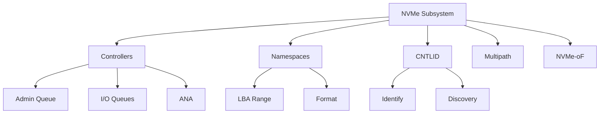

# NVMe 서브시스템 (NVMe Subsystem)

#### 핵심 인사이트 (3줄 요약)
> 1. **본질**: NVMe 컨트롤러, 네임스페이스, PCI 기능, ID(CNTLID)로 구성된 논리적 스토리지 엔티티로, 다중 경로와 다중 컨트롤러 아키텍처 지원
> 2. **가치**: 고가용성(Multipath), 로드 밸런싱, 페일오버, 컨트롤러 간 네임스페이스 공유, NVMe-oF 확장
> 3. **융합**: PCIe, NVMe-oF, Multipath I/O, 컨테이너/VM 스토리지, 분산 스토리지와 통합된 엔터프라이즈 아키텍처

---

### Ⅰ. 개요 (Context & Background)

**개념 정의**

NVMe Subsystem은 하나 이상의 NVMe 컨트롤러, 네임스페이스, PCI 기능(Functions)으로 구성된 논리적 스토리지 시스템입니다. 단일 SSD 내에 여러 컨트롤러를 포함하여 다중 경로(Multipath)와 고가용성을 제공합니다.

```
┌─────────────────────────────────────────────────────────────────────┐
│                    NVMe 서브시스템 아키텍처                           │
├─────────────────────────────────────────────────────────────────────┤
│                                                                     │
│   ┌──────────────────────────────────────────────────────────────┐ │
│   │                    NVMe Subsystem                             │ │
│   │                     (CNTLID = 1)                              │ │
│   │                                                              │ │
│   │   ┌─────────────────────────────────────────────────────┐    │ │
│   │   │                 Shared Namespaces                    │    │ │
│   │   │   ┌─────┐ ┌─────┐ ┌─────┐ ┌─────┐ ┌─────┐          │    │ │
│   │   │   │ NS1 │ │ NS2 │ │ NS3 │ │ NS4 │ │ ... │          │    │ │
│   │   │   └─────┘ └─────┘ └─────┘ └─────┘ └─────┘          │    │ │
│   │   │         ↑_______________↑_______________↑           │    │ │
│   │   └─────────┼───────────────┼───────────────┼───────────┘    │ │
│   │             │               │               │                │ │
│   │   ┌─────────┴─────┐ ┌──────┴─────┐ ┌──────┴─────┐           │ │
│   │   │ Controller 0   │ │Controller 1│ │Controller 2│           │ │
│   │   │ (Primary)      │ │(Secondary) │ │(Secondary) │           │ │
│   │   │                │ │            │ │            │           │ │
│   │   │ ┌────────────┐ │ │┌──────────┐│ │┌──────────┐│           │ │
│   │   │ │ Admin Queue│ │ ││Admin Q   ││ ││Admin Q   ││           │ │
│   │   │ │ I/O Queues │ │ ││I/O Qs    ││ ││I/O Qs    ││           │ │
│   │   │ └────────────┘ │ │└──────────┘│ │└──────────┘│           │ │
│   │   └────────────────┘ └────────────┘ └────────────┘           │ │
│   │             │               │               │                │ │
│   │             ▼               ▼               ▼                │ │
│   │   ┌─────────────────────────────────────────────────────┐    │ │
│   │   │              NVM Express Media (NAND Flash)         │    │ │
│   │   │   ┌────────────────────────────────────────────┐    │    │ │
│   │   │   │  Die 0 │ Die 1 │ Die 2 │ ... │ Die N       │    │    │ │
│   │   │   └────────────────────────────────────────────┘    │    │ │
│   │   └─────────────────────────────────────────────────────┘    │ │
│   │                                                              │ │
│   └──────────────────────────────────────────────────────────────┘ │
│                                                                     │
│   ┌──────────────────────────────────────────────────────────────┐ │
│   │                    PCIe Bus (SR-IOV 지원)                     │ │
│   │   PF0 ─────────── PF1 ─────────── VF0, VF1, ...              │ │
│   └──────────────────────────────────────────────────────────────┘ │
│                                                                     │
└─────────────────────────────────────────────────────────────────────┘
```

> **해설**: NVMe 서브시스템은 여러 컨트롤러가 공유 네임스페이스에 접근할 수 있습니다. 이를 통해 다중 경로, 로드 밸런싱, 페일오버가 가능합니다.

**💡 비유**: NVMe 서브시스템은 하나의 회사와 같습니다. 여러 팀(컨트롤러)이 공유 자료실(네임스페이스)을 사용하며, 한 팀이 문제가 생겨도 다른 팀이 업무를 계속할 수 있습니다.

**등장 배경**

① **기존 한계**: 단일 컨트롤러는 SPOF(Single Point of Failure) → 고가용성 부족
② **혁신적 패러다임**: 다중 컨트롤러 서브시스템으로 페일오버, 로드 밸런싱
③ **비즈니스 요구**: 엔터프라이즈 고가용성, NVMe-oF 다중 경로, VM/컨테이너 격리

**📢 섹션 요약 비유**: NVMe 서브시스템은 하나의 회사 같아요. 여러 팀(컨트롤러)이 협력해서 자료(데이터)를 관리해요.

---

### Ⅱ. 아키텍처 및 핵심 원리 (Deep Dive)

**구성 요소 상세 분석**

| 요소명 | 역할 | 내부 동작 | 프로토콜/규격 | 비유 |
|:---|:---|:---|:---|:---|
| **Controller** | I/O 처리 | 명령 실행, 큐 관리 | NVMe 2.0 | 팀 |
| **Namespace** | 논리 볼륨 | LBA 범위, 포맷 | NVMe 2.0 | 자료실 |
| **CNTLID** | 컨트롤러 ID | 16-bit 고유 식별자 | NVMe 2.0 | 사원증 |
| **PCI Function** | PCIe 인터페이스 | PF/VF 구분 | PCIe SR-IOV | 사무실 |
| **NVM Set** | 미디어 그룹 | 성능 격리 | NVMe 2.0 | 부서 |
| **Domain** | 격리 영역 | 보안/성능 격리 | NVMe 2.0 | 본관/별관 |

**다중 컨트롤러 서브시스템 동작**

```
┌─────────────────────────────────────────────────────────────────────┐
│                    다중 컨트롤러 Multipath I/O                        │
├─────────────────────────────────────────────────────────────────────┤
│                                                                     │
│   Host (서버)                                                       │
│   ┌──────────────────────────────────────────────────────────────┐ │
│   │                                                              │ │
│   │   ┌─────────────────────────────────────────────────────┐    │ │
│   │   │              NVMe Multipath Driver                   │    │ │
│   │   │                                                     │    │ │
│   │   │   Path 1 (Active) ──────────────┐                   │    │ │
│   │   │   Path 2 (Standby) ───────────┐ │                   │    │ │
│   │   │   Path 3 (Active) ──────────┐ │ │                   │    │ │
│   │   │                             │ │ │                   │    │ │
│   │   └─────────────────────────────┼─┼─┼───────────────────┘    │ │
│   │                                 │ │ │                        │ │
│   └─────────────────────────────────┼─┼─┼────────────────────────┘ │
│                                     │ │ │                          │
│   PCIe / NVMe-oF                    │ │ │                          │
│   ┌─────────────────────────────────┼─┼─┼────────────────────────┐ │
│   │                                 │ │ │                        │ │
│   │   ┌──────────────┐  ┌──────────┴─┐│  ┌──────────────┐       │ │
│   │   │ Controller 0  │  │Controller 1││  │Controller 2  │       │ │
│   │   │ (Active)      │  │(Standby)   ││  │(Active)      │       │ │
│   │   │               │  │            ││  │              │       │ │
│   │   │ I/O: 500K IOPS│  │I/O: 0      ││  │I/O: 500K IOPS│       │ │
│   │   └──────────────┘  └────────────┘│  └──────────────┘       │ │
│   │         │                 │       │         │                │ │
│   │         └────────┬────────┴───────┴────┬────┘                │ │
│   │                  │                    │                      │ │
│   │   ┌──────────────┴────────────────────┴──────────────────┐   │ │
│   │   │              Shared Namespace (NS1)                   │   │ │
│   │   │                                                       │   │ │
│   │   │   LBA: 0 ────────────────────────────────────── Max   │   │ │
│   │   │                                                       │   │ │
│   │   │   ANA (Asymmetric Namespace Access):                  │   │ │
│   │   │   - Controller 0: Optimized (Active)                  │   │ │
│   │   │   - Controller 1: Non-Optimized (Standby)             │   │ │
│   │   │   - Controller 2: Optimized (Active)                  │   │ │
│   │   └───────────────────────────────────────────────────────┘   │ │
│   │                                                              │ │
│   │                    NVMe Subsystem                            │ │
│   └──────────────────────────────────────────────────────────────┘ │
│                                                                     │
└─────────────────────────────────────────────────────────────────────┘
```

> **해설**: 다중 경로 드라이버는 여러 컨트롤러를 통해 동일 네임스페이스에 접근합니다. Active-Active 또는 Active-Standby 구성으로 로드 밸런싱과 페일오버를 제공합니다.

**핵심 알고리즘: NVMe 서브시스템 탐색**

```c
// NVMe 서브시스템 탐색 (의사코드)
struct NVMe_Subsystem {
    uint16_t cntlid;            // Controller ID
    uint16_t vid;               // Vendor ID
    uint16_t ssvid;             // Subsystem Vendor ID
    char     serial[20];        // Serial Number
    char     model[40];         // Model Number
    char     firmware[8];       // Firmware Revision
    uint32_t nn;                // Number of Namespaces
    NVMe_Controller *controllers[MAX_CTRL];
    NVMe_Namespace  *namespaces[MAX_NS];
};

// 서브시스템 내 컨트롤러 탐색
NVME_STATUS NVMe_DiscoverSubsystem(
    NVMe_Controller *ctrl
) {
    // 1. Identify Controller 명령으로 서브시스템 정보 획득
    NVMe_IdentifyController id_ctrl;
    NVMe_Identify(ctrl, CNS_CONTROLLER, 0, &id_ctrl);

    // 2. 서브시스템 정보 출력
    printf("Subsystem Vendor ID: 0x%04x\n", id_ctrl.vid);
    printf("Serial Number: %s\n", id_ctrl.sn);
    printf("Model Number: %s\n", id_ctrl.mn);
    printf("Firmware: %s\n", id_ctrl.fr);
    printf("Number of Namespaces: %d\n", id_ctrl.nn);

    // 3. 다중 컨트롤러 지원 여부 확인
    if (id_ctrl.cmic & 0x01) {
        printf("Multi-Controller Subsystem detected!\n");

        // 4. 다른 컨트롤러 탐색 (PCIe SR-IOV 또는 NVMe-oF)
        DiscoverOtherControllers(ctrl);
    }

    // 5. 네임스페이스 목록 획득
    for (int i = 1; i <= id_ctrl.nn; i++) {
        NVMe_Namespace *ns = NVMe_IdentifyNamespace(ctrl, i);
        printf("NS%d: Capacity = %llu GB\n", i, ns->nsze * LBA_SIZE / GB);
    }

    return NVME_SUCCESS;
}

// ANA (Asymmetric Namespace Access) 상태 확인
ANA_STATE NVMe_CheckANAState(
    NVMe_Controller *ctrl,
    uint32_t nsid
) {
    // ANA 그룹 정보 획득
    NVMe_ANA_Group *ana = GetANAGroup(ctrl, nsid);

    switch (ana->state) {
        case ANA_OPTIMIZED:
            // 최적 경로 - I/O 수행
            return ANA_STATE_OPTIMIZED;

        case ANA_NON_OPTIMIZED:
            // 비최적 경로 - I/O 가능하지만 지연
            return ANA_STATE_NON_OPTIMIZED;

        case ANA_INACCESSIBLE:
            // 접근 불가 - 다른 경로 사용
            return ANA_STATE_INACCESSIBLE;

        case ANA_PERSISTENT_LOSS:
            // 영구 손실 - 경로 제거
            return ANA_STATE_PERSISTENT_LOSS;

        default:
            return ANA_STATE_UNKNOWN;
    }
}

// Multipath I/O 경로 선택
NVMe_Controller* NVMe_SelectPath(
    NVMe_Subsystem *subsys,
    uint32_t nsid,
    NVMe_IO_Command *cmd
) {
    NVMe_Controller *best = NULL;
    uint32_t best_score = 0;

    for (int i = 0; i < subsys->num_controllers; i++) {
        NVMe_Controller *ctrl = subsys->controllers[i];
        ANA_STATE state = NVMe_CheckANAState(ctrl, nsid);

        // 점수 계산
        uint32_t score = 0;
        if (state == ANA_OPTIMIZED) {
            score = 100;
        } else if (state == ANA_NON_OPTIMIZED) {
            score = 50;
        }

        // 로드 밸런싱 고려
        score -= ctrl->queue_depth * 10;

        if (score > best_score) {
            best = ctrl;
            best_score = score;
        }
    }

    return best;
}
```

**📢 섹션 요약 비유**: NVMe 서브시스템 탐색은 회사의 조직도를 파악하는 것과 같습니다. 어떤 팀(컨트롤러)이 있고, 어떤 자료실(네임스페이스)을 담당하는지 확인합니다.

---

### Ⅲ. 융합 비교 및 다각도 분석 (Comparison & Synergy)

**기술 비교: 단일 컨트롤러 vs 다중 컨트롤러 서브시스템**

| 비교 항목 | 단일 컨트롤러 | 다중 컨트롤러 서브시스템 |
|:---|:---:|:---:|
| **고가용성** | 없음 (SPOF) | 있음 (페일오버) |
| **로드 밸런싱** | 불가능 | 가능 |
| **성능** | 단일 경로 | 다중 경로 집계 |
| **비용** | 낮음 | 높음 (이중화) |
| **복잡도** | 낮음 | 높음 |
| **IOPS** | ~1M | ~2M+ (Active-Active) |

**과목 융합 관점: NVMe 서브시스템과 타 영역 시너지**

| 융합 영역 | 시너지 효과 | 구현 예시 |
|:---|:---|:---|
| **OS (운영체제)** | nvme-cli, multipath | Linux nvme-cli, dm-multipath |
| **네트워크** | NVMe-oF 다중 경로 | RDMA, FC-NVMe |
| **가상화** | vNVMe 서브시스템 | SR-IOV, VFIO |
| **클라우드** | 분산 스토리지 | Ceph NVMe-oF |
| **보안** | 네임스페이스 격리 | 테넌트별 NS 할당 |

**📢 섹션 요약 비유**: 다중 컨트롤러 서브시스템은 회사에 여러 팀이 있는 것과 같습니다. 한 팀이 문제가 생겨도 다른 팀이 일을 계속할 수 있습니다.

---

### Ⅳ. 실무 적용 및 기술사적 판단 (Strategy & Decision)

**실무 시나리오별 적용**

**시나리오 1: 엔터프라이즈 고가용성**
- **문제**: 단일 컨트롤러 장애 시 서비스 중단
- **해결**: 다중 컨트롤러 Active-Active
- **의사결정**: 비용 vs 가용성 트레이드오프

**시나리오 2: NVMe-oF 분산 스토리지**
- **문제**: 원격 스토리지 다중 경로
- **해결**: NVMe-oF ANA 지원
- **의사결정**: 랙 간 고가용성

**시나리오 3: 컨테이너 스토리지 격리**
- **문제**: 컨테이너 간 스토리지 격리
- **해결**: 네임스페이스별 컨트롤러 할당
- **의사결정**: SR-IOV 활용

**도입 체크리스트**

| 구분 | 항목 | 확인 포인트 |
|:---|:---|:---|
| **기술적** | 컨트롤러 수 | HA 요구사항에 맞게 |
| | ANA 지원 | Multipath 드라이버 |
| | SR-IOV | VF 할당 계획 |
| **운영적** | 모니터링 | 컨트롤러 상태 |
| | 페일오버 테스트 | 정기적 장애 테스트 |
| | 펌웨어 동기화 | 컨트롤러 간 일치 |

**안티패턴: NVMe 서브시스템 오용 사례**

| 안티패턴 | 문제점 | 올바른 접근 |
|:---|:---|:---|
| **Multipath 미사용** | SPOF 위험 | dm-multipath 구성 |
| **단일 경로만 사용** | 성능 미활용 | Active-Active |
| **ANA 미확인** | 비최적 경로 사용 | ANA 상태 모니터링 |
| **컨트롤러 간 펌웨어 불일치** | 호환성 문제 | 동기화 필수 |

**📢 섹션 요약 비유**: NVMe 서브시스템 도입은 회사에 이중화 시스템을 구축하는 것과 같습니다. 비용이 들지만 안정성이 크게 향상됩니다.

---

### Ⅴ. 기대효과 및 결론 (Future & Standard)

**정량/정성 기대효과**

| 구분 | 단일 컨트롤러 | 다중 컨트롤러 | 개선효과 |
|:---|:---:|:---:|:---:|
| **가용성** | 99.9% | 99.999% | 100배 |
| **IOPS** | ~1M | ~2M+ | 2배 |
| **지연** | ~10μs | ~10μs (동일) | - |
| **비용** | $1,000 | $2,000+ | 2배 |

**미래 전망**

1. **NVMe 2.0+:** 더 많은 컨트롤러 지원
2. **ZNS 다중 컨트롤러:** 존별 접근 제어
3. **클라우드 네이티브:** 컨테이너 네이티브 NVMe
4. **AI 스토리지:** AI 워크로드 최적화 서브시스템

**참고 표준**

| 표준 | 내용 | 적용 |
|:---|:---|:---|
| **NVMe 1.4** | 서브시스템 기본 | 2019년 |
| **NVMe 2.0** | ANA, NVM Set | 2021년 |
| **NVMe-oF 2.0** | 네트워크 서브시스템 | 2021년 |
| **PCIe SR-IOV** | 가상 기능 | PCIe |

**📢 섹션 요약 비유**: NVMe 서브시스템의 미래는 더 큰 회사로 성장하는 것과 같습니다. 더 많은 팀(컨트롤러)이 더 많은 자료(데이터)를 더 안전하게 관리합니다.

---

### 📌 관련 개념 맵 (Knowledge Graph)



**연관 개념 링크**:
- [NVMe Namespaces](./700_nvme_namespaces.md) - 논리 스토리지 분할
- [NVMe Queue Pairs](./699_nvme_queue_pairs.md) - 명령 큐
- [NVMe over Fabrics](./nvme_of.md) - 네트워크 NVMe
- [FCoE](./697_fcoe.md) - Fibre Channel over Ethernet

---

### 👶 어린이를 위한 3줄 비유 설명

1. **회사 조직**: NVMe 서브시스템은 하나의 회사 같아요! 여러 팀(컨트롤러)이 함께 일해요.

2. **자료실 공유**: 회사에는 공용 자료실(네임스페이스)이 있어요. 모든 팀이 같은 자료를 볼 수 있어요.

3. **백업 팀**: 한 팀이 아파도 다른 팀이 일을 계속해요! 회사는 멈추지 않아요.
