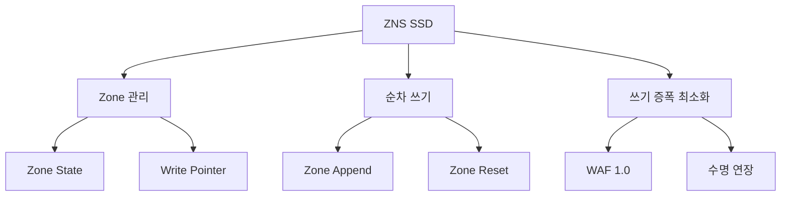

+++
title = "zns ssd"
date = "2026-03-14"
weight = 703
+++

# ZNS (Zoned Namespace) SSD

#### 핵심 인사이트 (3줄 요약)
> 1. **본질**: SSD 내부 공간을 Zone(영역) 단위로 분할하여 순차 쓰기만 허용하는 NVMe 명령어 집합으로, GC(Garbage Collection) 오버헤드 제거 및 쓰기 증폭 최소화
> 2. **가치**: 쓰기 증폭 3~10배 감소, SSD 수명 2~5배 연장, 예측 가능한 성능, WAF(Write Amplification Factor) 1.0에 근접
> 3. **융합**: NVMe-oF, 다중 스트림 쓰기, ZBD(Zoned Block Device)와 통합된 차세대 스토리지 아키텍처

---

### Ⅰ. 개요 (Context & Background)

**개념 정의**

ZNS (Zoned Namespace) SSD는 NVMe 표준의 확장 기능으로, SSD의 저장 공간을 여러 개의 Zone(영역)으로 분할하고 각 Zone 내에서는 순차 쓰기(Sequential Write)만 허용하는 방식입니다. 기존 SSD는 랜덤 쓰기(Random Write)를 지원하지만, 이로 인해 GC(Garbage Collection)와 쓰기 증폭(Write Amplification)이 발생합니다. ZNS는 순차 쓰기만 허용함으로써 GC를 제거하고 쓰기 증폭을 최소화하여 SSD 수명과 성능을 크게 향상시킵니다.

```
┌─────────────────────────────────────────────────────────────────────┐
│                    ZNS SSD 구조 개념도                              │
├─────────────────────────────────────────────────────────────────────┤
│                                                                     │
│   ┌──────────────────────────────────────────────────────────────┐ │
│   │                 ZNS SSD (4TB)                                 │ │
│   │  ┌────────────────────────────────────────────────────────┐  │ │
│   │  │  Zone 0       │  Zone 1       │  Zone 2    │...│Zone N │  │ │
│   │  │  (256MB)      │  (256MB)      │  (256MB)   │   │(256MB)│  │ │
│   │  │               │               │            │   │       │  │ │
│   │  │  Write Ptr ↑  │  Write Ptr ↑  │  Full      │   │ Empty │  │ │
│   │  │  (순차 쓰기)   │  (순차 쓰기)   │  (100%)    │   │  (0%) │  │ │
│   │  └───────────────┴───────────────┴────────────┴───┴───────┘  │ │
│   │                                                              │ │
│   │  Zone 상태: Empty → Open → Full → Reset                      │ │
│   │                                                              │ │
│   │  특징:                                                        │ │
│   │  • Zone당 순차 쓰기만 허용                                     │ │
│   │  • Random 쓰기 금지 (에러 발생)                                │ │
│   │  • Zone Reset으로 공간 재활용                                  │ │
│   │  • GC 불필요 (Host 관리)                                       │ │
│   └──────────────────────────────────────────────────────────────┘ │
│                                                                     │
└─────────────────────────────────────────────────────────────────────┘
```

> **해설**: ZNS SSD는 전체 공간을 Zone(일반적으로 256MB) 단위로 분할합니다. 각 Zone은 Empty(비어있음) → Open(쓰기 중) → Full(꽉참) → Reset(초기화) 상태로 순환합니다. Host는 각 Zone에 순차적으로만 쓸 수 있으며, Zone이 가득 차면 Reset 명령으로 전체 Zone을 한 번에 초기화합니다.

**💡 비유**: ZNS는 마치 녹음 테이프와 같습니다. 테이프는 앞에서 뒤로만 녹음할 수 있고(순차 쓰기), 중간에 건너뛰어 녹음할 수 없습니다. 다 녹음하면 테이프를 감아 처음부터 다시 녹음합니다(Zone Reset).

**등장 배경**

① **기존 한계**: 기존 SSD는 랜덤 쓰기 허용 → GC 오버헤드, 쓰기 증폭 3~10배, 성능 저하
② **혁신적 패러다임**: 순차 쓰기 강제 → GC 제거, 쓰기 증폭 1.0~1.1, 예측 가능한 성능
③ **비즈니스 요구**: 대규모 로그, 객체 스토리지, 데이터베이스 WAL의 저비용 고성능 저장

**📢 섹션 요약 비유**: ZNS SSD는 마치 주차장에서 구역별로 순차적으로 주차하는 것과 같습니다. 한 구역(Zone)이 다 채워지면 다음 구역으로 이동하고, 비울 때는 구역 전체를 한 번에 비웁니다.

---

### Ⅱ. 아키텍처 및 핵심 원리 (Deep Dive)

**구성 요소 상세 분석**

| 요소명 | 역할 | 내부 동작 | 프로토콜/규격 | 비유 |
|:---|:---|:---|:---|:---|
| **Zone** | 쓰기 단위 영역 | 256MB(일반), 순차 쓰기만 허용 | NVMe TP 4053 | 주차 구역 |
| **Write Pointer** | 다음 쓰기 위치 | Zone 내 현재 쓰기 오프셋 | NVMe Spec | 주차 위치 |
| **Zone State** | Zone 상태 관리 | Empty → Open → Full → ReadOnly → Offline | NVMe ZNS | 구역 상태 |
| **Zone Reset** | Zone 초기화 | 전체 Zone Erase, WP=0 | NVMe Command | 청소 |
| **Zone Append** | 원자적 쓰기 | Host 지정 WP 없이 쓰기 | NVMe Command | 자동 주차 |
| **Active Zone** | 동시 Open Zone | 최대 Active Zone 수 제한 | NVMe Spec | 동시 사용 구역 |

**Zone 상태 천이도**

```
┌─────────────────────────────────────────────────────────────────────┐
│                    ZNS Zone 상태 천이도                             │
├─────────────────────────────────────────────────────────────────────┤
│                                                                     │
│                     ┌─────────────────┐                             │
│                     │     EMPTY       │                             │
│                     │   (비어있음)     │                             │
│                     │   WP = 0        │                             │
│                     └────────┬────────┘                             │
│                              │ Open (첫 쓰기)                       │
│                              ▼                                       │
│   ┌──────────────────────────────────────────────────────────────┐ │
│   │                       OPEN (Active)                          │ │
│   │  ┌─────────────────┐  ┌─────────────────┐                   │ │
│   │  │   Open-Empty    │  │   Open-Full     │                   │ │
│   │  │  (쓰기 중)       │  │  (거의 참)      │                   │ │
│   │  │  WP < Capacity  │  │  WP = Capacity  │                   │ │
│   │  └────────┬────────┘  └────────┬────────┘                   │ │
│   │           │                    │                             │ │
│   │           │ 계속 쓰기          │ Finish                      │ │
│   │           └────────────────────┘                             │ │
│   └──────────────────────────────────────────────────────────────┘ │
│                              │                                      │
│                              ▼                                      │
│                     ┌─────────────────┐                             │
│                     │     FULL        │                             │
│                     │   (꽉참)        │                             │
│                     │   읽기만 가능    │                             │
│                     └────────┬────────┘                             │
│                              │ Reset (Zone 초기화)                  │
│                              ▼                                      │
│                     ┌─────────────────┐                             │
│                     │  READ ONLY      │ (선택적 상태)                │
│                     │  (읽기 전용)     │                             │
│                     └─────────────────┘                             │
│                                                                     │
│   특수 상태:                                                        │
│   • OFFLINE: 사용 불가 Zone (오류 등)                               │
│   • READ ONLY: 쓰기 불가, 읽기만 가능                               │
│                                                                     │
└─────────────────────────────────────────────────────────────────────┘
```

> **해설**: Zone은 Empty → Open → Full → Reset 순환합니다. Open 상태에서 순차 쓰기가 가능하며, Full이 되면 더 이상 쓸 수 없습니다. Zone Reset 명령으로 Zone 전체를 Erase하면 다시 Empty 상태가 됩니다.

**심층 동작 원리: ZNS 쓰기 플로우**

① **Zone 선택 및 Open**
```
Host: "Zone 5에 쓰기" → ZNS: Zone 5 상태 확인 (Empty → Open)
```

② **순차 쓰기 (Zone Write)**
```
Host: Write(Zone 5, Offset=WP, Data)
ZNS: WP 업데이트, Data 기록
에러 조건: Offset != WP → Write Error (순차 위반)
```

③ **Zone Append (원자적 쓰기)**
```
Host: Zone Append(Zone 5, Data)
ZNS: 현재 WP 위치에 쓰기, WP 업데이트, 실제 쓰인 Offset 반환
장점: Host가 WP 추적 불필요, 원자적 보장
```

④ **Zone Finish**
```
Host: Finish Zone 5
ZNS: Zone 5 상태 → Full
```

⑤ **Zone Reset**
```
Host: Reset Zone 5
ZNS: Zone 5 Erase, WP = 0, 상태 → Empty
```

**핵심 알고리즘: ZNS 쓰기 증폭 계산**

```c
// ZNS 쓰기 증폭 계산 (이론적)
float zns_write_amplification(uint64_t user_writes, uint64_t physical_writes) {
    // ZNS: 순차 쓰기만, GC 없음
    // 이론적으로 WAF = 1.0
    // 실제: Zone Reset 오버헤드 등으로 1.0~1.1

    float waf = (float)physical_writes / user_writes;

    printf("ZNS WAF: %.2f\n", waf);
    // 일반적으로 1.0 ~ 1.1
    return waf;
}

// 기존 SSD 쓰기 증폭 비교
float conventional_ssd_waf(uint64_t user_writes, int gc_overhead) {
    // GC 오버헤드: 3~10배
    // Random Write 시 더 악화

    float waf = 1.0 + (gc_overhead / 100.0);
    printf("Conventional SSD WAF: %.2f\n", waf);
    // 일반적으로 3.0 ~ 10.0
    return waf;
}

// ZNS vs 기존 SSD 수명 비교
void compare_endurance(float zns_waf, float conv_waf) {
    // WAF가 낮을수록 수명 길어짐
    float lifetime_ratio = conv_waf / zns_waf;
    printf("ZNS 수명 향상: %.1fx\n", lifetime_ratio);
    // 예: 5.0 / 1.1 = 4.5x 수명 연장
}
```

**📢 섹션 요약 비유**: ZNS의 동작은 마치 책장에 책을 순서대로 꽂는 것과 같습니다. 책을 중간에 끼워 넣을 수 없고, 빈 공간부터 차례대로 채웁니다. 책장이 꽉 차면 책장 전체를 비우고 다시 채웁니다.

---

### Ⅲ. 융합 비교 및 다각도 분석 (Comparison & Synergy)

**기술 비교: ZNS vs 기존 SSD vs SMR HDD**

| 비교 항목 | ZNS SSD | 기존 SSD | SMR HDD |
|:---|:---:|:---:|:---:|
| **쓰기 방식** | 순차만 | 랜덤 가능 | 순차만 |
| **GC** | 없음 (Host 관리) | SSD 내부 수행 | 없음 |
| **WAF** | 1.0~1.1 | 3.0~10.0 | 1.0~1.2 |
| **수명** | 2~5배 연장 | 기준 | 1.5~2배 |
| **지연 예측성** | 높음 | 낮음 (GC spike) | 높음 |
| **소프트웨어 수정** | 필요 | 불필요 | 필요 |
| **적용 시나리오** | 로그, WAL, 오브젝트 | 범용 | 아카이브 |

**과목 융합 관점: ZNS와 타 영역 시너지**

| 융합 영역 | 시너지 효과 | 구현 예시 |
|:---|:---|:---|
| **OS (파일시스템)** | ZNS 인식 파일시스템 | F2FS, Btrfs ZNS 지원 |
| **DB (데이터베이스)** | WAL ZNS 배치 | RocksDB, Cassandra |
| **오브젝트 스토리지** | Zone당 객체 매핑 | Ceph, MinIO |
| **로그 시스템** | 순차 로그 저장 | Kafka, Elasticsearch |
| **가상화** | VM 이미지 Zone 관리 | QEMU ZNS 지원 |

**ZNS 성능 이점 시각화**

```
┌─────────────────────────────────────────────────────────────────────┐
│             ZNS vs 기존 SSD 성능 및 수명 비교                        │
├─────────────────────────────────────────────────────────────────────┤
│                                                                     │
│   쓰기 증폭 (WAF)                                                   │
│   ▲                                                                 │
│   │                                                                 │
│   │    10.0 ─┐  ┌────────────────────────────────────────────┐    │
│   │          │  │ 기존 SSD (Random Write, GC 높음)            │    │
│   │    8.0 ──┤  │ WAF: 5~10                                  │    │
│   │          │  └────────────────────────────────────────────┘    │
│   │    6.0 ──┤           ┌───────────────────────────────────┐   │
│   │          │           │ 기존 SSD (Sequential Write)       │   │
│   │    4.0 ──┤           │ WAF: 2~4                          │   │
│   │          │           └───────────────────────────────────┘   │
│   │    2.0 ──┤      ┌───────────────────────────────────────┐   │
│   │          │      │ ZNS SSD                               │   │
│   │    1.1 ──┤      │ WAF: 1.0~1.1 (이상적)                 │   │
│   │          │      └───────────────────────────────────────┘   │
│   └──────────┴───────────────────────────────────────────────────▶│
│              Random   Seq     ZNS                                  │
│                                                                     │
│   SSD 수명 (TBW 기준):                                              │
│   • 기존 SSD (Random): 1x (기준)                                    │
│   • 기존 SSD (Sequential): 2~3x                                    │
│   • ZNS SSD: 4~10x                                                 │
│                                                                     │
└─────────────────────────────────────────────────────────────────────┘
```

> **해설**: ZNS SSD는 쓰기 증폭이 1.0~1.1로 이상적입니다. 이는 기존 SSD 대비 3~10배 낮은 WAF를 의미하며, SSD 수명(TBW)이 4~10배 연장됩니다.

**📢 섹션 요약 비유**: ZNS와 기존 SSD의 차이는 마치 정리된 책장과 엉망인 책장의 차이입니다. ZNS는 책을 순서대로 꽂아 나중에 찾기 쉽지만, 기존 SSD는 아무 곳에나 꽂아 나중에 정리(GC)해야 합니다.

---

### Ⅳ. 실무 적용 및 기술사적 판단 (Strategy & Decision)

**실무 시나리오별 적용**

**시나리오 1: 대규모 로그 스토리지**
- **문제**: 기존 SSD에서 로그 쓰기로 GC 과부하, 성능 저하
- **해결**: ZNS SSD에 로그 순차 저장, WAF 1.0
- **의사결정**: RocksDB, Kafka 등 로그 시스템에 ZNS 적용

**시나리오 2: 오브젝트 스토리지 백엔드**
- **문제**: Ceph, MinIO 백엔드에서 Random Write 부하
- **해결**: 오브젝트를 Zone 단위로 매핑, 순차 쓰기
- **의사결정**: Zone당 1개 오브젝트, 삭제 시 Zone Reset

**시나리오 3: 데이터베이스 WAL**
- **문제**: WAL Random 쓰기로 SSD 수명 단축
- **해결**: WAL을 ZNS Zone에 순차 저장
- **의사결정**: Checkpoint 후 Zone Reset

**도입 체크리스트**

| 구분 | 항목 | 확인 포인트 |
|:---|:---|:---|
| **기술적** | 애플리케이션 수정 | ZNS 인식 소프트웨어 필요 |
| | Zone 크기 | 256MB(일반), 워크로드에 맞는 크기 |
| | Active Zone 제한 | 최대 동시 Open Zone 수 |
| **운영적** | Zone 관리 전략 | 할당, 회수, Reset 정책 |
| | 모니터링 | Zone 사용률, WAF, 수명 |
| | 백업 | Zone Reset 전 데이터 백업 |
| **비용적** | TCO 분석 | 수명 연장 vs 소프트웨어 수정 비용 |

**안티패턴: ZNS 오용 사례**

| 안티패턴 | 문제점 | 올바른 접근 |
|:---|:---|:---|
| **Random 쓰기 시도** | 에러 발생, 데이터 손실 | 순차 쓰기만 사용 |
| **Zone 미관리** | Active Zone 한계 도달 | 적절한 Zone Reset |
| **잦은 Zone Reset** | Erase 사이클 증가 | 데이터 삭제 후 Reset |
| **범용 워크로드** | 소프트웨어 수정 부담 | 로그/WAL 전용으로 사용 |

**📢 섹션 요약 비유**: ZNS 도입은 마치 주차장을 구역별로 예약제로 운영하는 것과 같습니다. 무작위 주차보다 관리가 까다롭지만, 공간 활용률이 높아집니다.

---

### Ⅴ. 기대효과 및 결론 (Future & Standard)

**정량/정성 기대효과**

| 구분 | 기존 SSD | ZNS SSD | 개선효과 |
|:---|:---:|:---:|:---:|
| **WAF** | 3~10 | 1.0~1.1 | 3~10배 개선 |
| **SSD 수명** | 기준 | 4~10배 연장 | 비용 절감 |
| **지연 예측성** | 낮음 (GC spike) | 높음 | SLA 개선 |
| **소프트웨어 수정** | 불필요 | 필요 | Trade-off |

**미래 전망**

1. **NVMe 2.0 ZNS**: 표준화 완료, 확산 중
2. **ZNS + FDP**: Flexible Data Placement와 결합
3. **ZNS-oF**: NVMe over Fabrics로 ZNS 확장
4. **AI 기반 Zone 관리**: 워크로드 예측 Zone 할당

**참고 표준**

| 표준 | 내용 | 적용 |
|:---|:---|:---|
| **NVMe TP 4053** | Zoned Namespaces | ZNS 명령어 집합 |
| **NVMe 2.0** | ZNS 표준화 | 공식 표준 |
| **T10 ZBC** | SMR HDD Zoned | 유사 개념 |
| **Linux ZNS** | 커널 지원 | ZNS 블록 디바이스 |

**📢 섹션 요약 비유**: ZNS 기술의 미래는 마치 스마트 주차장의 진화와 같습니다. 초기에는 예약제로 불편했지만, AI 기반 관리로 더 효율적인 주차가 가능해지듯, ZNS도 자동화된 Zone 관리로 확산될 것입니다.

---

### 📌 관련 개념 맵 (Knowledge Graph)



**연관 개념 링크**:
- 다중 스트림 쓰기 - 쓰기 최적화
- NVMe 네임스페이스 - 논리 공간 분할
- NVMe 서브시스템 - NVMe 아키텍처
- SMR HDD - 유사한 Zone 개념

---

### 👶 어린이를 위한 3줄 비유 설명

1. **순서대로 책장**: ZNS는 책을 순서대로 책장에 꽂아요. 중간에 끼워 넣을 수 없어서 정리가 잘 돼요!

2. **주차 구역**: 주차장에서 한 구역씩 순서대로 주차해요. 구역이 꽉 차면 다음 구역으로 가요.

3. **오래 쓰는 SSD**: ZNS는 SSD가 더 오래 살 수 있게 해줘요. 정리를 잘 해서 SSD가 덜 피곤해지거든요!