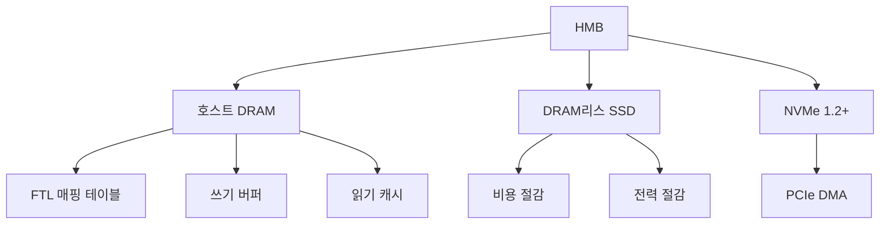

+++
title = "host memory buffer"
date = "2026-03-14"
weight = 704
+++

# 호스트 메모리 버퍼 (HMB, Host Memory Buffer)

#### 핵심 인사이트 (3줄 요약)
> 1. **본질**: DRAM이 없는 저비용 SSD가 호스트 시스템의 DRAM을借用하여 FTL(Flash Translation Layer) 메타데이터와 캐시로 사용하는 NVMe 기술
> 2. **가치**: DRAM리스 SSD 비용 30~50% 절감, 성능 2~5배 향상, PCIe 3.0+ 대역폭 활용, 소비자 SSD의 엔터프라이즈급 성능
> 3. **융합**: NVMe 1.2+, PCIe, DRAM 캐시, FTL 가속과 통합된 메모리 공유 아키텍처

---

### Ⅰ. 개요 (Context & Background)

**개념 정의**

HMB (Host Memory Buffer)는 NVMe 1.2 표준에서 도입된 기술로, DRAM이 없는 DRAM리스(DRAM-less) SSD가 호스트 시스템의 일부 DRAM을 SSD 컨트롤러의 용도로 사용할 수 있게 합니다. 일반적으로 엔터프라이즈 SSD는 대용량 DRAM을 내장하여 FTL(Flash Translation Layer) 매핑 테이블과 캐시를 관리하지만, 저비용 SSD는 DRAM을 생략하여 비용을 절감합니다. HMB는 이러한 DRAM리스 SSD가 호스트의 DRAM을借用함으로써, DRAM 내장 SSD에 근접한 성능을 제공합니다.

```
┌─────────────────────────────────────────────────────────────────────┐
│                    HMB (Host Memory Buffer) 개념도                  │
├─────────────────────────────────────────────────────────────────────┤
│                                                                     │
│   ┌──────────────────────────────────────────────────────────────┐ │
│   │                    Host System                               │ │
│   │  ┌────────────────────────────────────────────────────────┐  │ │
│   │  │                 Host DRAM (16GB+)                       │  │ │
│   │  │  ┌────────────────┐  ┌────────────────────────────────┐ │  │ │
│   │  │  │  OS Memory     │  │   HMB Region (64MB~1GB)        │ │  │ │
│   │  │  │  (사용자/커널) │  │   • FTL 매핑 테이블            │ │  │ │
│   │  │  │                │  │   • L2P (Logical to Physical)   │ │  │ │
│   │  │  │                │  │   • 쓰기 버퍼                   │ │  │ │
│   │  │  │                │  │   • 읽기 캐시                   │ │  │ │
│   │  │  └────────────────┘  └────────────────────────────────┘ │  │ │
│   │  └────────────────────────────────────────────────────────┘  │ │
│   │                              ▲                                │ │
│   │                              │ PCIe                           │ │
│   └──────────────────────────────┼───────────────────────────────┘ │
│                                  │                                 │
│   ┌──────────────────────────────▼───────────────────────────────┐ │
│   │                 DRAM-less SSD (NVMe)                          │ │
│   │  ┌────────────────────────────────────────────────────────┐  │ │
│   │  │  NVMe Controller                                        │  │ │
│   │  │  • SRAM (작은 캐시, 수 MB)                              │  │ │
│   │  │  • HMB 지원 펌웨어                                       │  │ │
│   │  │  • FTL 로직                                              │  │ │
│   │  └────────────────────────────────────────────────────────┘  │ │
│   │  ┌────────────────────────────────────────────────────────┐  │ │
│   │  │  NAND Flash (256GB~4TB)                                 │  │ │
│   │  │  • DRAM 없음 (비용 절감)                                 │  │ │
│   │  └────────────────────────────────────────────────────────┘  │ │
│   └──────────────────────────────────────────────────────────────┘ │
│                                                                     │
│   HMB 동작:                                                         │
│   1. SSD → Host: HMB 요청 (크기, 정렬 요구사항)                     │
│   2. Host: DRAM 영역 할당 → SSD에 주소 전달                         │
│   3. SSD: PCIe DMA로 Host DRAM 직접 접근                           │
│   4. SSD: FTL 메타데이터, 캐시로 HMB 활용                          │
│                                                                     │
└─────────────────────────────────────────────────────────────────────┘
```

> **해설**: HMB는 호스트 DRAM의 일부를 SSD가 직접 사용할 수 있게 합니다. SSD는 PCIe DMA를 통해 호스트 DRAM에 접근하여 FTL 매핑 테이블과 캐시를 저장합니다. 이를 통해 DRAM리스 SSD도 DRAM 내장 SSD에 근접한 성능을 달성합니다.

**💡 비유**: HMB는 마치 도서관에서 개인 책상을 빌리는 것과 같습니다. SSD는 자신의 작은 책상(SRAM)만 가지고 있지만, 호스트의 넓은 책상(HMB)을 빌려서 책(메타데이터)을 펼쳐놓고 효율적으로 작업할 수 있습니다.

**등장 배경**

① **기존 한계**: DRAM리스 SSD는 SRAM만 사용 → 성능 저하, 쓰기 증폭 증가
② **혁신적 패러다임**: 호스트 DRAM 공유 → DRAM리스 SSD의 성능 향상, 비용 절감
③ **비즈니스 요구**: 소비자/게이밍 SSD의 가성비와 성능 동시 달성

**📢 섹션 요약 비유**: HMB는 마치 작은 가게가 큰 창고를 빌려서 사용하는 것과 같습니다. 가게(SSD)는 작지만, 빌린 창고(Host DRAM)를 활용해 더 많은 물건을 효율적으로 관리할 수 있습니다.

---

### Ⅱ. 아키텍처 및 핵심 원리 (Deep Dive)

**구성 요소 상세 분석**

| 요소명 | 역할 | 내부 동작 | 프로토콜/규격 | 비유 |
|:---|:---|:---|:---|:---|
| **HMB Region** | 호스트 DRAM 할당 영역 | 64MB~1GB (NVMe 1.2: 최대 1GB) | NVMe 1.2+ | 빌린 창고 |
| **HMB Descriptor** | HMB 정보 구조체 | 주소, 크기, 정렬 단위 | NVMe Spec | 창고 계약서 |
| **FTL 매핑 테이블** | 논리→물리 주소 변환 | L2P Table, HMB에 저장 | FTL | 물건 위치 목록 |
| **쓰기 버퍼** | 쓰기 병합, 순차화 | HMB에 임시 저장 → Flush | FTL | 임시 보관함 |
| **읽기 캐시** | 자주 읽는 데이터 캐싱 | Hot Data HMB 저장 | FTL | 자주 쓰는 물건 |
| **PCIe DMA** | 호스트 DRAM 접근 | Read/Write, TLP | PCIe 3.0+ | 운송 수단 |

**HMB 설정 플로우**

```
┌─────────────────────────────────────────────────────────────────────┐
│                    HMB 설정 시퀀스                                  │
├─────────────────────────────────────────────────────────────────────┤
│                                                                     │
│   SSD                              Host                            │
│    │                                │                              │
│    │  1. Identify (HMB 지원 여부)    │                              │
│    │ ◄──────────────────────────────│                              │
│    │  HMB 지원: Yes, Max: 1GB       │                              │
│    │                                │                              │
│    │  2. HMB 요청 (크기, 정렬)       │                              │
│    │ ──────────────────────────────►│                              │
│    │                                │                              │
│    │  3. HMB 영역 할당               │                              │
│    │ ◄──────────────────────────────│                              │
│    │  HMB Descriptors (주소, 크기)   │                              │
│    │                                │                              │
│    │  4. HMB 활용 시작               │                              │
│    │  • FTL 매핑 테이블 저장         │                              │
│    │  • 쓰기 버퍼                    │                              │
│    │  • 읽기 캐시                    │                              │
│    │                                │                              │
│   ─┴─                              ─┴─                              │
│                                                                     │
│   HMB 크기:                                                         │
│   • NVMe 1.2: 최대 1GB                                              │
│   • NVMe 1.4: 최대 1GB (동일)                                       │
│   • 일반적 사용: 64MB~512MB                                         │
│                                                                     │
└─────────────────────────────────────────────────────────────────────┘
```

> **해설**: SSD는 Identify 명령으로 HMB 지원 여부를 확인합니다. Host는 HMB 영역을 할당하고 주소를 SSD에 전달합니다. SSD는 PCIe DMA를 통해 이 영역에 직접 접근하여 FTL 메타데이터와 캐시를 저장합니다.

**심층 동작 원리: HMB 활용**

① **FTL 매핑 테이블 저장**
```
LBA → Physical Page Address 매핑
HMB에 저장 → 빠른 조회 (지연: ~100ns)
```

② **쓰기 버퍼**
```
Host Write → HMB 버퍼 → NAND Flash 비동기 Flush
버퍼 병합 → 쓰기 증폭 감소
```

③ **읽기 캐시**
```
자주 읽는 데이터를 HMB에 캐싱
Cache Hit → Host DRAM에서 직접 읽기 (지연: ~100ns)
Cache Miss → NAND Flash 읽기 (지연: ~50µs)
```

**핵심 알고리즘: HMB 할당 및 관리**

```c
// HMB 할당 및 관리 (의사코드)
struct hmb_descriptor {
    uint64_t address;    // 호스트 DRAM 주소
    uint32_t size;       // 영역 크기 (바이트)
    uint32_t alignment;  // 정렬 요구사항
};

// HMB 설정
int nvme_hmb_configure(struct nvme_dev *dev, uint32_t size) {
    struct hmb_descriptor desc;

    // 1. 호스트에 메모리 할당 요청
    desc.address = dma_alloc_coherent(size, &desc.alignment);
    if (!desc.address) return -ENOMEM;

    desc.size = size;

    // 2. SSD에 HMB 정보 전송
    nvme_admin_cmd cmd = {
        .opcode = NVME_ADMIN_SET_FEATURES,
        .fid = NVME_FEAT_HOST_MEM_BUF,
        .dword11 = size / 4096,  // 4KB 단위
    };

    int ret = nvme_submit_admin_cmd(dev, &cmd);
    if (ret) {
        dma_free_coherent(desc.address);
        return ret;
    }

    // 3. HMB 활성화
    dev->hmb_base = desc.address;
    dev->hmb_size = size;

    return 0;
}

// FTL 매핑 테이블 조회 (HMB 활용)
uint64_t ftl_lookup_mapping(struct ftl *ftl, uint64_t lba) {
    uint64_t *l2p_table = (uint64_t *)ftl->hmb_l2p_base;

    // HMB에서 직접 조회 (지연: ~100ns)
    return l2p_table[lba];
}

// HMB 쓰기 버퍼
int ftl_write_buffer(struct ftl *ftl, void *data, size_t len) {
    if (ftl->hmb_write_buffer_pos + len > ftl->hmb_buffer_size) {
        // 버퍼 Full → Flush
        ftl_flush_write_buffer(ftl);
    }

    // HMB에 쓰기 버퍼링
    memcpy(ftl->hmb_write_buffer + ftl->hmb_write_buffer_pos, data, len);
    ftl->hmb_write_buffer_pos += len;

    return 0;
}
```

**📢 섹션 요약 비유**: HMB의 동작은 마치 작은 식당이 근처 큰 창고를 빌려서 재료를 보관하는 것과 같습니다. 식당(SSD)은 작지만, 창고(Host DRAM)를 활용해 재료(메타데이터)를 효율적으로 관리하고, 빠르게 요리(I/O)할 수 있습니다.

---

### Ⅲ. 융합 비교 및 다각도 분석 (Comparison & Synergy)

**기술 비교: HMB vs DRAM SSD vs DRAM리스 SSD**

| 비교 항목 | DRAM SSD | DRAM리스 (HMB X) | DRAM리스 (HMB O) |
|:---|:---:|:---:|:---:|
| **DRAM** | 512MB~8GB | 없음 (SRAM만) | 없음 (HMB 사용) |
| **비용** | 높음 ($$) | 낮음 ($) | 낮음 ($) |
| **읽기 지연** | 50~100µs | 100~200µs | 50~100µs |
| **쓰기 지연** | 50~100µs | 200~500µs | 50~100µs |
| **WAF** | 2~3 | 4~8 | 2~4 |
| **전력** | 높음 (DRAM) | 낮음 | 낮음 |
| **적용** | 엔터프라이즈 | 저가 소비자 | 게이밍/성능 |

**HMB 크기별 성능 영향**

```
┌─────────────────────────────────────────────────────────────────────┐
│                HMB 크기별 성능 비교 (1TB SSD 기준)                   │
├─────────────────────────────────────────────────────────────────────┤
│                                                                     │
│   Random Read IOPS                                                  │
│   ▲                                                                 │
│   │                                        ┌─────────────────┐     │
│   │    80K ───────────────────────────────│ DRAM SSD        │     │
│   │                               ┌────────┴─────────────────┘     │
│   │    60K ──────────────────────│ HMB 512MB                     │
│   │                      ┌────────┴───────────────────────────┐   │
│   │    40K ──────────────│ HMB 256MB                           │   │
│   │             ┌────────┴────────────────────────────────────┘   │
│   │    25K ────│ HMB 64MB                                        │
│   │      ┌──────┴─────────────────────────────────────────────┐  │
│   │    10K ────│ DRAM리스 (HMB 없음)                           │  │
│   │     ┌──────┴──────────────────────────────────────────────┘  │
│   └──────────────────────────────────────────────────────────────▶│
│          No HMB   64MB   256MB   512MB   DRAM SSD                  │
│                                                                     │
│   ※ HMB 256MB+에서 DRAM SSD 성능에 근접                             │
│   ※ HMB 크기가 클수록 FTL 매핑 테이블 커버리지 증가                  │
│                                                                     │
└─────────────────────────────────────────────────────────────────────┘
```

> **해설**: HMB 크기가 증가할수록 성능이 향상됩니다. 256MB 이상의 HMB는 DRAM 내장 SSD에 근접한 성능을 제공합니다. 이는 FTL 매핑 테이블의 더 많은 부분이 HMB에 저장되어 조회 지연이 감소하기 때문입니다.

**과목 융합 관점: HMB와 타 영역 시너지**

| 융합 영역 | 시너지 효과 | 구현 예시 |
|:---|:---|:---|
| **OS (커널)** | NVMe 드라이버 HMB 지원 | Linux NVMe 드라이버 |
| **가상화** | VM HMB 패스스루 | vSphere, KVM |
| **게이밍** | 로딩 속도 향상 | 게이밍 SSD |
| **모바일** | 전력 절감 | 노트북 SSD |

**📢 섹션 요약 비유**: HMB는 마치 작은 식당이 근처 창고를 빌려서 대형 식당만큼의 서비스를 제공하는 것과 같습니다. 비용은 적게 들지만, 성능은 대형 식당에 근접합니다.

---

### Ⅳ. 실무 적용 및 기술사적 판단 (Strategy & Decision)

**실무 시나리오별 적용**

**시나리오 1: 게이밍 PC**
- **문제**: 게임 로딩 속도 저하, 예산 제약
- **해결**: HMB 지원 DRAM리스 SSD, 256MB HMB
- **의사결정**: DRAM SSD 대비 30% 비용 절감, 성능은 90% 달성

**시나리오 2: 노트북**
- **문제**: 배터리 수명, SSD 성능
- **해결**: HMB SSD, DRAM 없이 전력 절감
- **의사결정**: DRAM SSD 대비 배터리 5~10% 향상

**시나리오 3: 소규모 서버**
- **문제**: 다중 SSD 비용, 성능 요구
- **해결**: HMB SSD로 비용 절감
- **의사결정**: 엔터프라이즈 SSD 대비 50% 비용 절감

**도입 체크리스트**

| 구분 | 항목 | 확인 포인트 |
|:---|:---|:---|
| **기술적** | NVMe 버전 | NVMe 1.2+ 지원 필요 |
| | HMB 크기 | 64MB~1GB (256MB 권장) |
| | 호스트 DRAM | 충분한 여유 DRAM 필요 |
| **운영적** | OS 지원 | Linux/Windows HMB 지원 확인 |
| | 모니터링 | HMB 사용률, 성능 |
| | 전력 | DRAM 없는 SSD의 전력 절감 |

**안티패턴: HMB 오용 사례**

| 안티패턴 | 문제점 | 올바른 접근 |
|:---|:---|:---|
| **DRAM 부족 시 HMB 사용** | 호스트 성능 저하 | 충분한 DRAM 확보 |
| **과도한 HMB 크기** | 호스트 메모리 부족 | 256MB~512MB 권장 |
| **HMB 미지원 OS** | HMB 활용 불가 | OS 업그레이드 |
| **엔터프라이즈 워크로드** | HMB 한계 | DRAM SSD 사용 |

**📢 섹션 요약 비유**: HMB 사용은 마치 식당이 창고를 빌리는 것과 같습니다. 창고가 너무 작으면 재료를 다 못 넣고, 너무 크면 돈이 낭비됩니다. 적절한 크기의 창고를 빌려야 합니다.

---

### Ⅴ. 기대효과 및 결론 (Future & Standard)

**정량/정성 기대효과**

| 구분 | DRAM리스 (HMB X) | DRAM리스 (HMB O) | 개선효과 |
|:---|:---:|:---:|:---:|
| **읽기 IOPS** | 10K~25K | 40K~60K | 2~4배 향상 |
| **쓰기 IOPS** | 10K~20K | 30K~50K | 2~3배 향상 |
| **지연** | 100~200µs | 50~100µs | 50% 단축 |
| **비용** | $ | $ | DRAM SSD 대비 30% 절감 |

**미래 전망**

1. **HMB 확대**: NVMe 2.0에서 HMB 크기 제한 완화 논의
2. **CXL HMB**: CXL 메모리를 HMB로 활용
3. **AI 가속**: HMB를 ML 모델 캐시로 활용
4. **모바일 확대**: 스마트폰 SSD에 HMB 도입

**참고 표준**

| 표준 | 내용 | 적용 |
|:---|:---|:---|
| **NVMe 1.2** | HMB 표준화 | HMB 기능 정의 |
| **NVMe 1.3/1.4** | HMB 확장 | 기능 개선 |
| **PCIe 3.0+** | 대역폭 | DMA 전송 |

**📢 섹션 요약 비유**: HMB 기술의 미래는 마치 공유 경제의 진화와 같습니다. 개인이 소유한 자원(DRAM)을 필요한 곳(SSD)에 빌려주어, 전체 시스템의 효율성을 높입니다.

---

### 📌 관련 개념 맵 (Knowledge Graph)



**연관 개념 링크**:
- NVMe 네임스페이스 - 논리 공간 분할
- 다중 스트림 쓰기 - 쓰기 최적화
- FTL (Flash Translation Layer) - 플래시 변환 계층
- SSD 캐시 - SSD 캐싱 메커니즘

---

### 👶 어린이를 위한 3줄 비유 설명

1. **빌린 책상**: SSD가 컴퓨터의 큰 책상(메모리)을 빌려서 책(데이터 위치 정보)을 펼쳐놓아요!

2. **공유 창고**: 작은 가게(SSD)가 근처 큰 창고(컴퓨터 메모리)를 빌려서 물건을 효율적으로 관리해요.

3. **똑똑한 절약**: 비싼 책상을 안 사도 빌린 책상으로 똑같이 일할 수 있어요! 돈도 아끼고 성능도 좋아요!