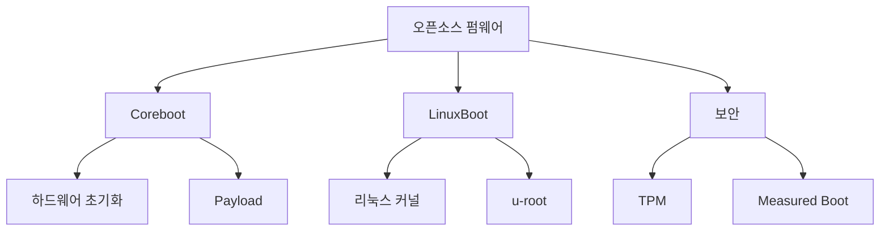

+++
title = "opensource firmware"
date = "2026-03-14"
weight = 705
+++

# 오픈소스 펌웨어 (Coreboot, LinuxBoot)

#### 핵심 인사이트 (3줄 요약)
> 1. **본질**: 클로즈드 소스 BIOS/UEFI를 대체하는 오픈소스 펌웨어로, 하드웨어 초기화부터 부트로더까지 투명하고 보안성 높은 부팅 체인 제공
> 2. **가치**: 부팅 시간 1~3초 단축, 보안 투명성(후문 없음), 커스터마이징 자유, OEM 종속성 탈피
> 3. **융합**: UEFI, TPM, Secure Boot, OS 부트로더와 통합된 신뢰형 컴퓨팅 기반

---

### Ⅰ. 개요 (Context & Background)

**개념 정의**

오픈소스 펌웨어는 메인보드의 BIOS(Basic Input/Output System) 또는 UEFI(Unified Extensible Firmware Interface)를 대체하는 오픈소스 소프트웨어입니다. 대표적으로 **Coreboot**(이전 LinuxBIOS)와 **LinuxBoot**(Heads, NERF)가 있으며, 클로즈드 소스 펌웨어의 불투명성과 보안 취약점을 해결합니다. Coreboot는 하드웨어 초기화에 집중하고, LinuxBoot는 리눅스 커널을 펌웨어로 사용하여 더 강력한 기능을 제공합니다.

```
┌─────────────────────────────────────────────────────────────────────┐
│              전통적 BIOS/UEFI vs 오픈소스 펌웨어 비교                │
├─────────────────────────────────────────────────────────────────────┤
│                                                                     │
│   ┌──────────────────────────────────────────────────────────────┐ │
│   │             전통적 BIOS/UEFI 부팅 체인                        │ │
│   │                                                              │ │
│   │  ┌──────────┐   ┌──────────┐   ┌──────────┐   ┌──────────┐  │ │
│   │  │  BIOS    │ → │  UEFI    │ → │ Bootloader│ → │   OS     │  │ │
│   │  │(16-bit)  │   │(32/64bit)│   │ (GRUB)   │   │ (Linux)  │  │ │
│   │  └──────────┘   └──────────┘   └──────────┘   └──────────┘  │ │
│   │       ▲              ▲                                        │ │
│   │       │              │                                        │ │
│   │   클로즈드 소스   클로즈드 소스                                │ │
│   │   (AMI/Phoenix)   (AMI/Insyde)                               │ │
│   │                                                              │ │
│   │   문제점: 후문 가능성, 감사 불가, 부팅 느림 (30~60초)          │ │
│   └──────────────────────────────────────────────────────────────┘ │
│                                                                     │
│   ┌──────────────────────────────────────────────────────────────┐ │
│   │             오픈소스 펌웨어 (Coreboot/LinuxBoot)              │ │
│   │                                                              │ │
│   │  ┌─────────────────────────────────────────────────────────┐ │ │
│   │  │                    Coreboot                             │ │ │
│   │  │  ┌──────────┐  ┌──────────┐  ┌──────────┐             │ │ │
│   │  │  │ Boot     │ → │ Hardware │ → │ Payload  │             │ │ │
│   │  │  │ Block    │  │ Init     │  │ (GRUB/   │             │ │ │
│   │  │  │ (ROM)    │  │ (RAM)    │  │  Linux)  │             │ │ │
│   │  │  └──────────┘  └──────────┘  └──────────┘             │ │ │
│   │  │       ▲              ▲              ▲                   │ │ │
│   │  │       │              │              │                   │ │ │
│   │  │   오픈소스       오픈소스       오픈소스/사용자 선택      │ │ │
│   │  │                                                      │ │ │
│   │  │  ┌──────────────────────────────────────────────────┐ │ │ │
│   │  │  │             LinuxBoot (Heads/NERF)               │ │ │ │
│   │  │  │  Coreboot + 리눅스 커널을 펌웨어로 사용            │ │ │ │
│   │  │  │  • 네트워크 부팅, 암호화, USB 지원                 │ │ │ │
│   │  │  │  • 부팅 시간: 1~3초                               │ │ │ │
│   │  │  └──────────────────────────────────────────────────┘ │ │ │
│   │  └─────────────────────────────────────────────────────────┘ │
│   │                                                              │ │
│   │   장점: 투명성, 보안 감사 가능, 빠른 부팅 (1~5초)              │ │
│   └──────────────────────────────────────────────────────────────┘ │
│                                                                     │
└─────────────────────────────────────────────────────────────────────┘
```

> **해설**: Coreboot는 하드웨어 초기화에 집중하는 경량 오픈소스 펌웨어입니다. Payload(GRUB, Linux, SeaBIOS)를 로드하여 OS 부팅을 수행합니다. LinuxBoot는 Coreboot 위에 리눅스 커널을 얹어 더 강력한 기능(네트워크, 암호화, 드라이버)을 제공합니다.

**💡 비유**: 오픈소스 펌웨어는 마치 자동차의 시동 스위치를 직접 만드는 것과 같습니다. 기존에는 제조사가 만든 시동 스위치(클로즈드 BIOS)를 그대로 써야 했지만, 이제는 투명한 설계도(오픈소스)로 직접 만들어 후문이 없음을 확인할 수 있습니다.

**등장 배경**

① **기존 한계**: 클로즈드 BIOS/UEFI의 후문(Backdoor) 가능성, 보안 감사 불가, 부팅 느림
② **혁신적 패러다임**: 오픈소스로 투명성 확보, 커뮤니티 감사, 부팅 시간 단축
③ **비즈니스 요구**: 보안 민감 환경(군사, 금융), 클라우드 서버의 빠른 부팅, 개인정보 보호

**📢 섹션 요약 비유**: 오픈소스 펌웨어는 마치 식당 주방을 투명하게 공개하는 것과 같습니다. 손님(사용자)은 주방(펌웨어)에서 무슨 일이 일어나는지 확인할 수 있어 신뢰할 수 있습니다.

---

### Ⅱ. 아키텍처 및 핵심 원리 (Deep Dive)

**구성 요소 상세 분석**

| 요소명 | 역할 | 내부 동작 | 프로토콜/규격 | 비유 |
|:---|:---|:---|:---|:---|
| **Boot Block** | ROM에서 첫 실행 | 16-bit 모드, 메모리 초기화 | x86 Reset Vector | 시동 키 |
| **Hardware Init** | 하드웨어 초기화 | CPU, 칩셋, RAM, PCI | 스펙 시트 | 엔진 점검 |
| **Payload** | 부팅 대상 로드 | GRUB, SeaBIOS, Linux | Multiboot | 운전자 |
| **CBFS** | Coreboot 파일시스템 | ROM 이미지 구조 | Coreboot Spec | 트렁크 |
| **FMAP** | 플래시 메모리 맵 | 영역 분할 | Coreboot Spec | 설계도 |
| **ACPI Tables** | OS 하드웨어 정보 | 전원 관리, 장치 열거 | ACPI Spec | 매뉴얼 |

**Coreboot 부팅 시퀀스**

```
┌─────────────────────────────────────────────────────────────────────┐
│                    Coreboot 부팅 시퀀스                             │
├─────────────────────────────────────────────────────────────────────┤
│                                                                     │
│   ┌──────────────────────────────────────────────────────────────┐ │
│   │  1. Boot Block (ROM, 16-bit Real Mode)                       │ │
│   │     • Reset Vector: 0xFFFFFFF0                               │ │
│   │     • 메모리 초기화 (RAM 활성화)                              │ │
│   │     • Coreboot RAM Stage 로드                                │ │
│   └──────────────────────────┬───────────────────────────────────┘ │
│                              ▼                                      │
│   ┌──────────────────────────────────────────────────────────────┐ │
│   │  2. RAM Stage (32/64-bit Protected Mode)                     │ │
│   │     • CPU, 칩셋 초기화                                        │ │
│   │     • PCI/PCIe 버스 열거                                      │ │
│   │     • ACPI 테이블 생성                                        │ │
│   │     • Payload 로드                                           │ │
│   └──────────────────────────┬───────────────────────────────────┘ │
│                              ▼                                      │
│   ┌──────────────────────────────────────────────────────────────┐ │
│   │  3. Payload 실행                                              │ │
│   │     • SeaBIOS: 레거시 BIOS 호환                               │ │
│   │     • GRUB2: 멀티부트 로더                                    │ │
│   │     • LinuxBoot: 리눅스 커널 직접 부팅                        │ │
│   │     • Tianocore: UEFI 호환                                    │ │
│   └──────────────────────────┬───────────────────────────────────┘ │
│                              ▼                                      │
│   ┌──────────────────────────────────────────────────────────────┐ │
│   │  4. OS 부팅                                                   │ │
│   │     • 커널 로드                                               │ │
│   │     • initramfs                                               │ │
│   │     • 루트 파일시스템 마운트                                  │ │
│   └──────────────────────────────────────────────────────────────┘ │
│                                                                     │
│   부팅 시간:                                                        │
│   • Coreboot: 0.5~2초                                               │
│   • Payload: 0.5~3초                                                │
│   • OS 부팅: 1~10초                                                 │
│   • 총 부팅: 2~15초 (UEFI 대비 50~80% 단축)                         │
│                                                                     │
└─────────────────────────────────────────────────────────────────────┘
```

> **해설**: Coreboot는 Boot Block → RAM Stage → Payload → OS 순서로 부팅합니다. Boot Block은 ROM에서 실행되어 RAM을 초기화하고, RAM Stage는 하드웨어를 초기화합니다. Payload는 사용자가 선택한 부트로더(GRUB, Linux)이며, 최종적으로 OS를 부팅합니다.

**LinuxBoot 아키텍처**

```c
// LinuxBoot 구성 (의사코드)
struct linuxboot_config {
    // Coreboot 기반
    void *coreboot_rom;      // Coreboot ROM 이미지

    // u-root 기반 사용자 공간
    char *initramfs;         // initramfs (u-root)

    // 리눅스 커널
    char *kernel;            // 부팅 커널

    // 부팅 설정
    char *cmdline;           // 커널 명령줄
    char *boot_entries;      // 부팅 항목
};

// LinuxBoot 부팅
void linuxboot_boot(struct linuxboot_config *config) {
    // 1. Coreboot 하드웨어 초기화
    coreboot_init();

    // 2. 리눅스 커널 로드
    load_kernel(config->kernel, config->cmdline);

    // 3. initramfs 로드 (u-root)
    load_initramfs(config->initramfs);

    // 4. 커널 실행
    jump_to_kernel();

    // 이후 u-root 사용자 공간에서:
    // - 네트워크 구성
    // - 암호화된 디스크 마운트
    // - OS 커널 로드
    // - kexec로 OS 부팅
}
```

**📢 섹션 요약 비유**: Coreboot/LinuxBoot의 동작은 마치 자동차를 시동 걸어 출발하는 것과 같습니다. Boot Block은 키를 꽂는 것, RAM Stage은 엔진 점검, Payload는 운전자가 타는 것, OS 부팅은 출발하는 것입니다.

---

### Ⅲ. 융합 비교 및 다각도 분석 (Comparison & Synergy)

**기술 비교: Coreboot vs LinuxBoot vs UEFI**

| 비교 항목 | Coreboot | LinuxBoot | UEFI |
|:---|:---:|:---:|:---:|
| **소스** | 오픈소스 | 오픈소스 | 클로즈드 |
| **부팅 시간** | 0.5~3초 | 1~3초 | 10~30초 |
| **기능** | 하드웨어 초기화 | 리눅스 기능 | 풍부한 기능 |
| **보안** | 투명, 감사 가능 | 투명, 감사 가능 | 불투명 |
| **커스터마이징** | 높음 | 매우 높음 | 제한적 |
| **지원 보드** | 제한적 | 제한적 | 광범위 |
| **복잡도** | 중간 | 높음 | 높음 |

**지원 하드웨어**

```
┌─────────────────────────────────────────────────────────────────────┐
│                   Coreboot/LinuxBoot 지원 하드웨어                  │
├─────────────────────────────────────────────────────────────────────┤
│                                                                     │
│   서버/워크스테이션:                                                │
│   ┌───────────────────────────────────────────────────────────┐    │
│   │ • Google Chromebook (다수 모델)                            │    │
│   │ • System76 (Linux 노트북/데스크톱)                         │    │
│   │ • Purism Librem (프라이버시 중심 노트북)                   │    │
│   │ • Dell Chromebook                                          │    │
│   │ • Gigabyte GA-G41M-ES2L (데스크톱)                         │    │
│   │ • ASUS KCMA-D8 (워크스테이션)                              │    │
│   └───────────────────────────────────────────────────────────┘    │
│                                                                     │
│   메인보드/칩셋:                                                    │
│   ┌───────────────────────────────────────────────────────────┐    │
│   │ • Intel: Q35, Q45, 945, GM45, Pineview, Sandy/Ivy Bridge  │    │
│   │ • AMD: Geode, Fam10h, Fam15h, Fam17h                      │    │
│   │ • ARM: Tegra, Allwinner, Rockchip                         │    │
│   │ • RISC-V: SiFive                                           │    │
│   └───────────────────────────────────────────────────────────┘    │
│                                                                     │
│   클라우드/데이터센터:                                              │
│   ┌───────────────────────────────────────────────────────────┐    │
│   │ • Facebook OpenBMC (BMC 펌웨어, Coreboot 기반)             │    │
│   │ • Open Compute Project (OCP)                               │    │
│   │ • 9elements LinuxBoot                                      │    │
│   └───────────────────────────────────────────────────────────┘    │
│                                                                     │
│   ※ 제조사 지원 없이 커뮤니티 포팅 필요                             │
│                                                                     │
└─────────────────────────────────────────────────────────────────────┘
```

**과목 융합 관점: 오픈소스 펌웨어와 타 영역 시너지**

| 융합 영역 | 시너지 효과 | 구현 예시 |
|:---|:---|:---|
| **OS (부팅)** | 빠른 부팅, 커널 통합 | LinuxBoot + kexec |
| **보안** | 투명성, 후문 없음 | TPM, Measured Boot |
| **가상화** | VM 빠른 시작 | Cloud VM 부팅 |
| **임베디드** | 커스터마이징 | IoT 장치 펌웨어 |
| **클라우드** | 서버 부팅 시간 단축 | Facebook LinuxBoot |

**📢 섹션 요약 비유**: 오픈소스 펌웨어와 UEFI의 차이는 마치 투명한 주방과 닫힌 주방의 차이입니다. 투명한 주방에서는 무슨 일이 일어나는지 볼 수 있어 신뢰할 수 있습니다.

---

### Ⅳ. 실무 적용 및 기술사적 판단 (Strategy & Decision)

**실무 시나리오별 적용**

**시나리오 1: 보안 민감 환경**
- **문제**: 클로즈드 BIOS 후문 우려, 감사 불가
- **해결**: Coreboot + Heads, 투명한 부팅 체인
- **의사결정**: TPM Measured Boot로 무결성 검증

**시나리오 2: 클라우드 서버**
- **문제**: 수천 대 서버 부팅 시간, BIOS 설정 복잡
- **해결**: LinuxBoot + 네트워크 부팅, 부팅 2초
- **의사결정**: 자동화된 프로비저닝

**시나리오 3: 개인정보 보호 노트북**
- **문제**: Intel ME/AMD PSP 후문 우려
- **해결**: Coreboot + ME Neutralize
- **의사결정**: Purism, System76 노트북 선택

**도입 체크리스트**

| 구분 | 항목 | 확인 포인트 |
|:---|:---|:---|
| **기술적** | 하드웨어 지원 | Coreboot 호환 메인보드 |
| | 펌웨어 빌드 | 툴체인, 플래시 도구 |
| | Payload 선택 | GRUB, Linux, Tianocore |
| **운영적** | 보안 | TPM, Secure Boot |
| | 복구 | 플래시 복구 방법 |
| | 업데이트 | 펌웨어 업데이트 절차 |
| **비용적** | 개발 비용 | 포팅, 검증 비용 |
| | 지원 | 커뮤니티 지원 |

**안티패턴: 오픈소스 펌웨어 오용 사례**

| 안티패턴 | 문제점 | 올바른 접근 |
|:---|:---|:---|
| **지원 않는 보드 사용** | 포팅 복잡, 불안정 | Coreboot 지원 보드 선택 |
| **백업 없이 플래시** | 벽돌(Brick) 위험 | 외부 프로그래머 준비 |
| **검증 없이 프로덕션** | 안정성 문제 | 철저한 테스트 |
| **Intel ME 무시** | 보안 취약점 | ME Neutralize 또는 Heads |

**📢 섹션 요약 비유**: 오픈소스 펌웨어 도입은 마치 식당 주방을 직접 설계하는 것과 같습니다. 기존 레시피(UEFI)를 그대로 쓰는 것보다 복잡하지만, 투명하고 안전한 주방을 만들 수 있습니다.

---

### Ⅴ. 기대효과 및 결론 (Future & Standard)

**정량/정성 기대효과**

| 구분 | UEFI | Coreboot/LinuxBoot | 개선효과 |
|:---|:---:|:---:|:---:|
| **부팅 시간** | 15~30초 | 2~5초 | 70~90% 단축 |
| **보안 투명성** | 불투명 | 투명 | 감사 가능 |
| **커스터마이징** | 제한적 | 무제한 | 자유로움 |
| **복잡도** | 낮음 | 높음 | Trade-off |

**미래 전망**

1. **RISC-V 확산**: RISC-V 메인보드에서 Coreboot 기본 채택
2. **클라우드 표준**: AWS, Google Cloud의 LinuxBoot 확대
3. **보안 강화**: TPM 2.0, Measured Boot 기본화
4. **AI 최적화**: AI 워크로드를 위한 펌웨어 최적화

**참고 표준**

| 표준 | 내용 | 적용 |
|:---|:---|:---|
| **Coreboot** | 오픈소스 펌웨어 | 하드웨어 초기화 |
| **LinuxBoot** | 리눅스 기반 펌웨어 | u-root |
| **UEFI** | 인터페이스 표준 | Tianocore Payload |
| **ACPI** | 전원 관리 | Coreboot 생성 |

**📢 섹션 요약 비유**: 오픈소스 펌웨어 기술의 미래는 마치 투명한 자동차의 진화와 같습니다. 엔진실이 투명하게 공개되어 누구나 내부를 확인할 수 있어 신뢰할 수 있습니다.

---

### 📌 관련 개념 맵 (Knowledge Graph)



**연관 개념 링크**:
- UEFI - UEFI 인터페이스
- ACPI - 전원 관리 인터페이스
- TPM (Trusted Platform Module) - 신뢰형 플랫폼 모듈
- Secure Boot - 보안 부팅

---

### 👶 어린이를 위한 3줄 비유 설명

1. **투명한 주방**: 오픈소스 펌웨어는 주방이 투명한 식당 같아요! 무슨 음식(코드)을 만드는지 다 볼 수 있어요.

2. **직접 만든 열쇠**: 자동차 열쇠를 직접 만드는 것 같아요. 남이 만든 열쇠(클로즈드 BIOS)에는 비밀 후문이 있을 수 있지만, 직접 만든 건 안전해요!

3. **빠른 시동**: 오픈소스 펌웨어는 자동차 시동이 엄청 빨라요! 불필요한 것을 다 빼서 1~3초면 켜져요.