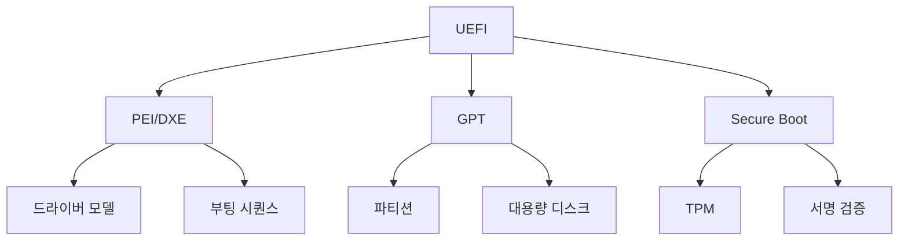

# UEFI (Unified Extensible Firmware Interface)

#### 핵심 인사이트 (3줄 요약)
> 1. **본질**: BIOS를 대체하는 현대적 펌웨어 인터페이스로, 32/64비트 보호 모드, GPT 파티셔닝, 드라이버 지원, 네트워크 부팅을 제공하는 플랫폼 초기화 표준
> 2. **가치**: 2.2TB+ 디스크 지원(GPT), 보안 부팅(Secure Boot), 그래픽 UI, 빠른 부팅, 드라이버 모델 확장성
> 3. **융합**: ACPI, TPM, Secure Boot, OS 부트로더(GRUB, Windows Boot Manager)와 통합된 신뢰형 부팅 체인

---

### Ⅰ. 개요 (Context & Background)

**개념 정의**

UEFI (Unified Extensible Firmware Interface)는 기존 BIOS(Basic Input/Output System)를 대체하기 위해 개발된 현대적 펌웨어 인터페이스 규격입니다. BIOS는 16비트 실모드에서 실행되어 1MB 주소 공간 제한, 2.2TB 디스크 제한(MBR), 제한적인 기능 등의 문제가 있었습니다. UEFI는 32/64비트 보호 모드에서 실행되어 대용량 메모리, 대용량 디스크, 네트워크, 보안 부팅 등 현대적 기능을 제공합니다.

```
┌─────────────────────────────────────────────────────────────────────┐
│                    UEFI vs BIOS 아키텍처 비교                        │
├─────────────────────────────────────────────────────────────────────┤
│                                                                     │
│   ┌──────────────────────────────────────────────────────────────┐ │
│   │                    BIOS (Legacy)                              │ │
│   │                                                              │ │
│   │  ┌────────────┐   ┌────────────┐   ┌────────────┐           │ │
│   │  │ 16-bit     │ → │ MBR        │ → │ Bootloader │ → OS       │ │
│   │  │ Real Mode  │   │ (512B)     │   │ (512B)     │           │ │
│   │  └────────────┘   └────────────┘   └────────────┘           │ │
│   │       │                │                │                     │ │
│   │  1MB 주소 공간   2.2TB 제한     텍스트 UI                  │ │
│   │  제한             (MBR)          보안 없음                  │ │
│   │  보안 취약                                                   │ │
│   └──────────────────────────────────────────────────────────────┘ │
│                                                                     │
│   ┌──────────────────────────────────────────────────────────────┐ │
│   │                    UEFI (Modern)                              │ │
│   │                                                              │ │
│   │  ┌────────────┐   ┌────────────┐   ┌────────────┐           │ │
│   │  │ 32/64-bit  │ → │ GPT        │ → │ EFI        │ → OS      │ │
│   │  │ Protected  │   │ Partition   │   │ Bootloader │           │ │
│   │  │ Mode       │   │ Table       │   │ (.efi)     │           │ │
│   │  └────────────┘   └────────────┘   └────────────┘           │ │
│   │       │                │                │                     │ │
│   │  4GB+ 주소 공간  9.4ZB 지원    그래픽 UI                  │ │
│   │  확장              (GPT)          Secure Boot               │ │
│   │  보안 강화                                                   │ │
│   └──────────────────────────────────────────────────────────────┘ │
│                                                                     │
└─────────────────────────────────────────────────────────────────────┘
```

> **해설**: BIOS는 16비트 실모드, 1MB 주소 공간, MBR(2.2TB 제한)에 제한됩니다. UEFI는 32/64비트 보호 모드, GPT(9.4ZB 지원), Secure Boot를 제공합니다.

**💡 비유**: BIOS는 마치 오래된 기차역과 같습니다. 좁은 플랫폼, 제한된 노선, 보안 없음. UEFI는 현대적인 공항처럼 넓은 공간, 다양한 노선, 보안 검색을 제공합니다.

**등장 배경**

① **기존 한계**: BIOS는 16비트, 1MB, MBR(2.2TB) 제한 → 현대 하드웨어 지원 불가
② **혁신적 패러다임**: UEFI로 32/64비트, GPT, Secure Boot, 네트워크 부팅 지원
③ **비즈니스 요구**: 대용량 디스크, 보안 부팅, 빠른 부팅, 멀티 OS

**📢 섹션 요약 비유**: UEFI는 마치 기차역에서 공항으로 업그레이드하는 것과 같습니다. 더 넓고, 더 빠르고, 더 안전합니다.

---

### Ⅱ. 아키텍처 및 핵심 원리 (Deep Dive)

**구성 요소 상세 분석**

| 요소명 | 역할 | 내부 동작 | 프로토콜/규격 | 비유 |
|:---|:---|:---|:---|:---|
| **PEI (Pre-EFI Init)** | 초기 하드웨어 초기화 | CPU, Chipset, Memory 초기화 | UEFI PI | 기착 |
| **DXE (Driver Execution)** | 드라이버 로딩 | UEFI 드라이버 실행 | UEFI PI | 출발 |
| **BDS (Boot Device Select)** | 부팅 장치 선택 | OS 부트로더 탐색 | UEFI PI | 노선 선택 |
| **TSL (Transient System Load)** | OS 로딩 | OS 전환 | UEFI PI | 비행 |
| **RT (Runtime)** | 런타임 서비스 | OS 실행 중 서비스 | UEFI Spec | 운항 |
| **GPT** | 파티션 테이블 | GUID 기반, 최대 128 파티션 | UEFI Spec | 노선도 |

**UEFI 부팅 시퀀스**

```
┌─────────────────────────────────────────────────────────────────────┐
│                    UEFI 부팅 시퀀스                                  │
├─────────────────────────────────────────────────────────────────────┤
│                                                                     │
│   ┌────────────┐   ┌────────────┐   ┌────────────┐                │
│   │    SEC     │ → │    PEI     │ → │    DXE     │                │
│   │ (Security) │   │ (Pre-EFI   │   │ (Driver    │                │
│   │            │   │  Init)     │   │  Execution)│                │
│   └────────────┘   └────────────┘   └────────────┘                │
│        │                 │                 │                       │
│   보안 검증        메모리 초기화      드라이버 로딩                │
│   리셋 벡터         CPU 초기화        장치 열거                    │
│                                                                     │
│                     ┌────────────┐   ┌────────────┐                │
│                     │    BDS     │ → │    TSL     │                │
│                     │ (Boot      │   │ (Transient │                │
│                     │  Device    │   │  System    │                │
│                     │  Select)   │   │  Load)     │                │
│                     └────────────┘   └────────────┘                │
│                           │                 │                       │
│                      부팅 장치 선택      OS 로딩                    │
│                      EFI 실행           ExitBootServices()         │
│                                                                     │
│                                         ┌────────────┐              │
│                                         │    RT      │              │
│                                         │ (Runtime)  │              │
│                                         └────────────┘              │
│                                              │                      │
│                                         OS 런타임 서비스            │
│                                         (GetTime, Reset 등)        │
│                                                                     │
└─────────────────────────────────────────────────────────────────────┘
```

> **해설**: UEFI 부팅은 SEC → PEI → DXE → BDS → TSL → RT 순서로 진행됩니다. 각 단계는 특정 초기화 작업을 수행하며, BDS에서 OS 부트로더를 선택하고, TSL에서 OS로 제어권을 넘깁니다.

**핵심 알고리즘: UEFI 드라이버 모델**

```c
// UEFI 드라이버 모델 (의사코드)
struct EFI_DRIVER_BINDING_PROTOCOL {
    EFI_SUPPORTED Supported;      // 장치 지원 여부 확인
    EFI_START Start;             // 드라이버 시작
    EFI_STOP Stop;               // 드라이버 중지
};

// 드라이버 바인딩
EFI_STATUS DriverBindingSupported(
    EFI_DRIVER_BINDING_PROTOCOL *This,
    EFI_HANDLE ControllerHandle,
    EFI_DEVICE_PATH_PROTOCOL *RemainingDevicePath
) {
    // 1. 장치가 이 드라이버를 지원하는지 확인
    if (IsSupportedDevice(ControllerHandle)) {
        return EFI_SUCCESS;
    }
    return EFI_UNSUPPORTED;
}

// 드라이버 시작
EFI_STATUS DriverBindingStart(
    EFI_DRIVER_BINDING_PROTOCOL *This,
    EFI_HANDLE ControllerHandle,
    EFI_DEVICE_PATH_PROTOCOL *RemainingDevicePath
) {
    // 1. 장치 초기화
    InitializeDevice(ControllerHandle);

    // 2. 프로토콜 설치
    InstallProtocol(ControllerHandle, &gEfiBlockIoProtocolGuid);

    return EFI_SUCCESS;
}

// EFI 부트 서비스
EFI_STATUS EFIAPI ExitBootServices(
    EFI_HANDLE ImageHandle,
    UINTN MapKey
) {
    // 1. 모든 부트 서비스 종료
    // 2. OS로 제어권 전환
    // 3. 런타임 서비스만 유지

    return EFI_SUCCESS;
}
```

**📢 섹션 요약 비유**: UEFI 부팅 과정은 마치 공항에서 비행기가 출발하는 과정과 같습니다. SEC(보안 검색) → PEI(탑승) → DXE(비행기 준비) → BDS(노선 선택) → TSL(이륙) → RT(운항).

---

### Ⅲ. 융합 비교 및 다각도 분석 (Comparison & Synergy)

**기술 비교: UEFI vs BIOS**

| 비교 항목 | BIOS | UEFI |
|:---|:---:|:---:|
| **CPU 모드** | 16-bit Real Mode | 32/64-bit Protected Mode |
| **주소 공간** | 1MB | 4GB+ |
| **디스크 한계** | 2.2TB (MBR) | 9.4ZB (GPT) |
| **UI** | 텍스트 | 그래픽 + 텍스트 |
| **보안** | 없음 | Secure Boot |
| **네트워크** | 없음 | 내장 |
| **드라이버** | 옵션 ROM | UEFI 드라이버 |
| **부팅 속도** | 느림 (30~60초) | 빠름 (10~30초) |

**과목 융합 관점: UEFI와 타 영역 시너지**

| 융합 영역 | 시너지 효과 | 구현 예시 |
|:---|:---|:---|
| **OS (운영체제)** | 부트로더 통합 | GRUB, Windows Boot Manager |
| **보안** | Secure Boot, TPM | Windows 11 Secure Boot 필수 |
| **네트워크** | PXE 부팅 | 네트워크 설치 |
| **가상화** | UEFI VM | QEMU, VirtualBox |
| **임베디드** | ARM UEFI | ARM 서버 |

**📢 섹션 요약 비유**: UEFI와 BIOS의 차이는 마치 기차와 비행기의 차이입니다. BIOS는 기차처럼 제한된 경로, 느린 속도, 보안 없음. UEFI는 비행기처럼 자유로운 경로, 빠른 속도, 엄격한 보안.

---

### Ⅳ. 실무 적용 및 기술사적 판단 (Strategy & Decision)

**실무 시나리오별 적용**

**시나리오 1: 대용량 스토리지 서버**
- **문제**: 8TB 디스크, BIOS 2.2TB 제한
- **해결**: UEFI + GPT로 전체 용량 사용
- **의사결정**: BIOS에서 UEFI로 마이그레이션

**시나리오 2: 보안 부팅 요구**
- **문제**: 악성코드 부팅 감염
- **해결**: UEFI Secure Boot로 서명된 OS만 부팅
- **의사결정**: Windows 11 필수 요구사항 충족

**시나리오 3: 원격 설치**
- **문제**: 물리적 접근 없는 서버 설치
- **해결**: UEFI PXE 부팅 + 네트워크 설치
- **의사결정**: 데이터센터 표준

**도입 체크리스트**

| 구분 | 항목 | 확인 포인트 |
|:---|:---|:---|
| **기술적** | OS 지원 | UEFI 호환 OS 확인 |
| | 디스크 포맷 | GPT 파티션 테이블 |
| | Secure Boot | OS 서명 확인 |
| **운영적** | 백업 | 기존 BIOS 설정 백업 |
| | 복구 | UEFI 복구 방법 |
| | 교육 | UEFI 메뉴 익히기 |

**안티패턴: UEFI 오용 사례**

| 안티패턴 | 문제점 | 올바른 접근 |
|:---|:---|:---|
| **Legacy BIOS 모드만 사용** | UEFI 장점 미활용 | Native UEFI 모드 |
| **Secure Boot 비활성화** | 보안 취약 | 드라이버 서명 |
| **GPT 없이 UEFI 사용** | 파티션 제한 | GPT 필수 |
| **구형 OS 강제 설치** | UEFI 미지원 | Virtual Machine |

**📢 섹션 요약 비유**: UEFI 도입은 마치 기차역에서 공항으로 전환하는 것과 같습니다. 더 복잡하지만, 더 많은 기능과 보안을 제공합니다.

---

### Ⅴ. 기대효과 및 결론 (Future & Standard)

**정량/정성 기대효과**

| 구분 | BIOS | UEFI | 개선효과 |
|:---|:---:|:---:|:---:|
| **부팅 시간** | 30~60초 | 10~30초 | 50% 단축 |
| **디스크 한계** | 2.2TB | 9.4ZB | 무제한 |
| **보안** | 없음 | Secure Boot | 강화 |
| **UI** | 텍스트 | 그래픽 | 개선 |

**미래 전망**

1. **UEFI 2.10+**: 새로운 보안 기능, ARM 확장
2. **UEFI Shell**: 고급 진단, 스크립팅
3. **Redfish 통합**: UEFI + BMC 관리
4. **AI 부팅**: AI 기반 부팅 최적화

**참고 표준**

| 표준 | 내용 | 적용 |
|:---|:---|:---|
| **UEFI Spec 2.10** | 인터페이스 규격 | 최신 표준 |
| **UEFI PI 1.8** | 플랫폼 초기화 | 구현 가이드 |
| **ACPI 6.5** | 전원 관리 | UEFI 연동 |
| **TianoCore** | 오픈소스 UEFI | 구현체 |

**📢 섹션 요약 비유**: UEFI 기술의 미래는 마치 스마트 공항의 진화와 같습니다. 기존 수하물 검색에서 얼굴 인식, AI 기반 최적화로 발전하듯, UEFI도 AI 기반 부팅 최적화로 진화할 것입니다.

---

### 📌 관련 개념 맵 (Knowledge Graph)



**연관 개념 링크**:
- [오픈소스 펌웨어](./705_opensource_firmware.md) - Coreboot/LinuxBoot
- [ACPI](./707_acpi.md) - 전원 관리 인터페이스
- [TPM](./tpm.md) - 신뢰형 플랫폼 모듈
- [Secure Boot](./secure_boot.md) - 보안 부팅

---

### 👶 어린이를 위한 3줄 비유 설명

1. **현대적 공항**: UEFI는 오래된 기차역(BIOS) 대신 현대적인 공항 같아요! 더 넓고 더 빠르고 더 안전해요.

2. **큰 짐 보관**: BIOS는 작은 가방만 가능했지만, UEFI는 큰 트렁크(대용량 디스크)도 가능해요!

3. **보안 검색**: UEFI는 공항 보안 검색처럼 나쁜 프로그램이 들어오는지 확인해요. 서명된 안전한 OS만 부팅돼요!
