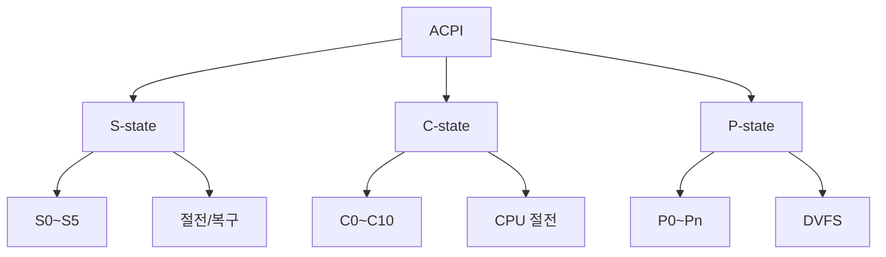

# ACPI (Advanced Configuration and Power Interface)

#### 핵심 인사이트 (3줄 요약)
> 1. **본질**: OS와 하드웨어 간 전원 관리 및 구성 인터페이스로, CPU 절전 상태(C-state), 시스템 절전(S-state), 장치 전원(D-state)을 표준화한 규격
> 2. **가치**: 노트북 배터리 수명 30~50% 연장, 서버 전력 비용 20~40% 절감, PnP(Plug and Play), 핫 플러그 지원
> 3. **융합**: UEFI, OSPM(OS Power Management), CPU C-state, 장치 드라이버와 통합된 전원 최적화 플랫폼

---

### Ⅰ. 개요 (Context & Background)

**개념 정의**

ACPI (Advanced Configuration and Power Interface)는 OS와 하드웨어 펌웨어 간의 전원 관리 및 하드웨어 구성 인터페이스입니다. Intel, Microsoft, Toshiba, HP가 공동 개발하여, 기존 APM(Advanced Power Management)의 BIOS 중심 전원 관리를 OS 중심으로 이관했습니다. ACPI는 CPU 절전 상태(C-state), 시스템 절전 상태(S0~S5), 장치 전원 상태(D0~D3)를 정의하고, OS가 이를 제어할 수 있게 합니다.

```
┌─────────────────────────────────────────────────────────────────────┐
│                    ACPI 계층 구조                                    │
├─────────────────────────────────────────────────────────────────────┤
│                                                                     │
│   ┌──────────────────────────────────────────────────────────────┐ │
│   │                    OS (운영체제)                              │ │
│   │  ┌────────────────────────────────────────────────────────┐  │ │
│   │  │                 ACPI Driver                             │  │ │
│   │  │  • OSPM (OS Power Management)                           │  │ │
│   │  │  • AML (ACPI Machine Language) 인터프리터               │  │ │
│   │  └────────────────────────────────────────────────────────┘  │ │
│   └──────────────────────────────────────────────────────────────┘ │
│                              │                                     │
│                              │ ACPI Tables                         │
│                              ▼                                     │
│   ┌──────────────────────────────────────────────────────────────┐ │
│   │                    ACPI Tables (펌웨어)                       │ │
│   │  ┌────────────┐ ┌────────────┐ ┌────────────┐              │ │
│   │  │    RSDP    │ │    DSDT    │ │    SSDT    │              │ │
│   │  │ (Root      │ │ (Differentiated│ (Secondary   │              │ │
│   │  │  System    │ │  System       │  System      │              │ │
│   │  │  Desc)     │ │  Description) │  Table)      │              │ │
│   │  └────────────┘ └────────────┘ └────────────┘              │ │
│   │  ┌────────────┐ ┌────────────┐ ┌────────────┐              │ │
│   │  │   FADT     │ │   MADT     │ │   HPET     │              │ │
│   │  │ (Fixed     │ │ (Multiple  │ │ (High      │              │ │
│   │  │  ACPI)     │ │  APIC)     │ │  Precision)│              │ │
│   │  └────────────┘ └────────────┘ └────────────┘              │ │
│   └──────────────────────────────────────────────────────────────┘ │
│                              │                                     │
│                              ▼                                     │
│   ┌──────────────────────────────────────────────────────────────┐ │
│   │                    Hardware                                   │ │
│   │  ┌────────────┐ ┌────────────┐ ┌────────────┐              │ │
│   │  │    CPU     │ │  Memory    │ │  Devices   │              │ │
│   │  │ (C-state)  │ │ (Sleep)    │ │ (D-state)  │              │ │
│   │  └────────────┘ └────────────┘ └────────────┘              │ │
│   └──────────────────────────────────────────────────────────────┘ │
│                                                                     │
└─────────────────────────────────────────────────────────────────────┘
```

> **해설**: ACPI는 OS, 펌웨어(ACPI Tables), 하드웨어 3계층으로 구성됩니다. OS는 ACPI Tables를 읽어 하드웨어 구성과 전원 관리 방법을 파악하고, 이를 통해 CPU C-state, 장치 D-state, 시스템 S-state를 제어합니다.

**💡 비유**: ACPI는 마치 건물의 스마트 관리 시스템과 같습니다. 관리자(OS)가 중앙 제어판(ACPI Tables)을 통해 조명(CPU), 냉난방(장치), 전체 전원(시스템)을 제어합니다.

**등장 배경**

① **기존 한계**: APM은 BIOS 중심 → OS가 전원 관리에 제한적 참여
② **혁신적 패러다임**: ACPI로 OS 중심 전원 관리 → 지능적 전원 제어
③ **비즈니스 요구**: 노트북 배터리 수명, 데이터센터 전력 비용 절감

**📢 섹션 요약 비유**: ACPI는 마치 스마트 홈 시스템과 같습니다. 주인(OS)이 앱(ACPI Driver)을 통해 조명, 난방, 전체 전원을 제어합니다.

---

### Ⅱ. 아키텍처 및 핵심 원리 (Deep Dive)

**구성 요소 상세 분석**

| 요소명 | 역할 | 내부 동작 | 상태 | 비유 |
|:---|:---|:---|:---|:---|
| **RSDP** | ACPI 테이블 루트 | RSDT/XSDT 포인터 | - | 목차 |
| **DSDT** | 고정 하드웨어 정의 | AML(ACPI Machine Language) | - | 설계도 |
| **SSDT** | 추가 하드웨어 정의 | 동적 로딩 가능 | - | 추가 설계도 |
| **FADT** | 고정 ACPI 정보 | PM1a/b, GPE 등 | - | 기본 설정 |
| **MADT** | APIC 정보 | CPU, I/O APIC | - | CPU 맵 |
| **C-state** | CPU 절전 상태 | C0~C10 | C0: 활성 | CPU 수면 |
| **P-state** | CPU 성능 상태 | 주파수, 전압 조절 | P0~Pn | CPU 속도 |
| **D-state** | 장치 전원 상태 | D0~D3 | D0: 활성 | 장치 대기 |
| **S-state** | 시스템 절전 상태 | S0~S5 | S0: 활성 | 시스템 대기 |

**ACPI 전원 상태 천이도**

```
┌─────────────────────────────────────────────────────────────────────┐
│                    ACPI 전원 상태 천이도                            │
├─────────────────────────────────────────────────────────────────────┤
│                                                                     │
│   ┌──────────────────────────────────────────────────────────────┐ │
│   │              Global System States (S-state)                  │ │
│   │                                                              │ │
│   │  S0 ────► S1 ────► S2 ────► S3 ────► S4 ────► S5           │ │
│   │  (동작)  (대기)   (대기)   (절전)   (최대절전)   (전원차단) │ │
│   │    ▲       │        │        │        │        │             │
│   │    │       │        │        │        │        │             │
│   │    │       │        │        │        │        │             │
│   │    └───────┴────────┴────────┴────────┴────────┘ (Wake)      │ │
│   │                                                              │ │
│   │  S0: 정상 동작                                                │ │
│   │  S1: CPU 정지, RAM 유지 (1W~5W)                              │ │
│   │  S2: CPU 전원 차단, RAM 유지                                  │ │
│   │  S3: Suspend to RAM, RAM만 유지 (0.5W~3W)                    │ │
│   │  S4: Suspend to Disk, 디스크에 저장 (0.1W~1W)                │ │
│   │  S5: Soft Off, 완전 차단 (0W~0.5W)                           │ │
│   └──────────────────────────────────────────────────────────────┘ │
│                                                                     │
│   ┌──────────────────────────────────────────────────────────────┐ │
│   │              CPU Power States (C-state)                      │ │
│   │                                                              │ │
│   │  C0 ────► C1 ────► C2 ────► C3 ────► C6 ────► C10          │ │
│   │  (동작)  (Halt)   (Stop)   (Sleep)  (Deep)   (Deepest)      │ │
│   │    ▲       │        │        │        │        │             │
│   │    │       │        │        │        │        │             │
│   │    └───────┴────────┴────────┴────────┴────────┘ (Interrupt)│ │
│   │                                                              │ │
│   │  C0: 활성 (명령 실행)                                         │ │
│   │  C1: Halt (클럭 정지, 지연 <1µs)                             │ │
│   │  C2: Stop (클럭 정지, 지연 ~1µs)                              │ │
│   │  C3: Sleep (PLL 정지, 지연 ~10µs)                            │ │
│   │  C6: Deep Sleep (전압 차단, 지연 ~100µs)                     │ │
│   │  C10: Deepest (거의 전원 차단, 지연 ~ms)                     │ │
│   └──────────────────────────────────────────────────────────────┘ │
│                                                                     │
└─────────────────────────────────────────────────────────────────────┘
```

> **해설**: S-state는 시스템 전체의 절전 상태, C-state는 CPU의 절전 상태입니다. S0에서 모든 장치가 활성이고, S5에서는 전원이 완전히 차단됩니다. C0에서 CPU가 명령을 실행하고, C6~C10에서는 거의 전원이 차단됩니다.

**심층 동작 원리: ACPI AML 인터프리터**

```c
// ACPI AML 인터프리터 (의사코드)
struct acpi_namespace {
    struct acpi_object *root;
    // Namespace: \_SB, \_PR, \_TZ 등
};

// AML 메서드 실행
acpi_status acpi_execute_method(char *path, struct acpi_args *args) {
    struct acpi_object *method = acpi_lookup(path);
    if (!method) return AE_NOT_FOUND;

    // AML 바이트코드 실행
    return aml_interpret(method->aml, args);
}

// 전원 상태 전환
acpi_status acpi_enter_sleep_state(uint8_t sleep_state) {
    // 1. S-state 전환 준비
    acpi_hw_register_write(ACPI_PM1_CONTROL, sleep_state);

    // 2. 인터럽트 비활성화
    disable_interrupts();

    // 3. 캐시 플러시
    wbinvd();

    // 4. S-state 진입
    acpi_hw_register_write(ACPI_PM1_CONTROL,
        ACPI_PM1_SLP_TYP(sleep_state) | ACPI_PM1_SLP_EN);

    // S3/S4: 여기서 실행 중단
    // 복구 시: 여기서 재개
    return AE_OK;
}

// C-state 진입
void cpu_enter_cstate(uint8_t cstate) {
    switch (cstate) {
        case 1:
            __asm__ volatile ("hlt");  // C1: Halt
            break;
        case 3:
            __asm__ volatile ("mwait" :: "a"(0), "c"(1));  // C3: MWAIT
            break;
        case 6:
            // C6: Deep Sleep (MSR 설정)
            wrmsr(MSR_PKG_CST_CONFIG_CONTROL, 0x1);
            break;
    }
}
```

**📢 섹션 요약 비유**: ACPI 전원 관리는 마치 건물의 조명 제어와 같습니다. 각 방(장치)의 조명(D-state)을 끄고, 층(CPU)의 전원(C-state)을 내리고, 건물 전체(S-state)를 잠그는 것과 같습니다.

---

### Ⅲ. 융합 비교 및 다각도 분석 (Comparison & Synergy)

**기술 비교: ACPI vs APM**

| 비교 항목 | APM (Legacy) | ACPI |
|:---|:---:|:---:|
| **관리 주체** | BIOS | OS |
| **C-state** | 제한적 | C0~C10 |
| **S-state** | S1~S5 | S0~S5 |
| **P-state** | 없음 | P0~Pn (DVFS) |
| **핫 플러그** | 없음 | 지원 |
| **Plug and Play** | 제한적 | 완전 지원 |
| **전력 절감** | 10~20% | 30~50% |

**과목 융합 관점: ACPI와 타 영역 시너지**

| 융합 영역 | 시너지 효과 | 구현 예시 |
|:---|:---|:---|
| **OS (커널)** | Linux/Windows ACPI 드라이버 | cpufreq, cpuidle |
| **CPU 아키텍처** | Intel SpeedStep, AMD Cool'n'Quiet | DVFS |
| **노트북** | 배터리 수명 연장 | S3/S4 절전 |
| **데이터센터** | 서버 전력 절감 | P-state 조절 |
| **가상화** | VM 전원 관리 | ACPI 에뮬레이션 |

**ACPI 전력 절감 효과**

```
┌─────────────────────────────────────────────────────────────────────┐
│               ACPI 전력 절감 효과 (서버 기준)                         │
├─────────────────────────────────────────────────────────────────────┤
│                                                                     │
│   전력 소모 (W)                                                     │
│   ▲                                                                 │
│   │                                        ┌─────────────────┐     │
│   │    500W ───────────────────────────────│ APM (전원 관리 X)│     │
│   │                               ┌────────┴─────────────────┘     │
│   │    350W ──────────────────────│ ACPI (C-state만)              │
│   │                      ┌────────┴───────────────────────────┐    │
│   │    250W ─────────────│ ACPI (C-state + P-state)           │    │
│   │             ┌────────┴────────────────────────────────────┘    │
│   │    150W ────│ ACPI (C-state + P-state + S-state)              │
│   │      ┌──────┴─────────────────────────────────────────────┐   │
│   └────────┴───────────────────────────────────────────────────▶│
│          APM    C-state   +P-state   +S-state                     │
│                                                                     │
│   ※ APM 대비 ACPI는 50~70% 전력 절감 가능                          │
│   ※ 데이터센터 1000대 서버 × 350W 절감 = 연간 $300,000+ 절감       │
│                                                                     │
└─────────────────────────────────────────────────────────────────────┘
```

> **해설**: ACPI의 C-state, P-state, S-state를 조합하면 APM 대비 50~70% 전력을 절감할 수 있습니다. 데이터센터 규모에서는 연간 수십만 달러의 전력 비용을 절감합니다.

**📢 섹션 요약 비유**: ACPI와 APM의 차이는 마치 수동 조명(APM)과 스마트 조명(ACPI)의 차이입니다. 스마트 조명은 상황에 맞게 자동으로 밝기를 조절하여 전력을 절약합니다.

---

### Ⅳ. 실무 적용 및 기술사적 판단 (Strategy & Decision)

**실무 시나리오별 적용**

**시나리오 1: 노트북 배터리 최적화**
- **문제**: 배터리 2시간만 지속
- **해결**: ACPI C6 + P-state + S3 적용, 배터리 4시간 연장
- **의사결정**: Linux powertop으로 튜닝

**시나리오 2: 데이터센터 전력 절감**
- **문제**: 서버 전력 비용 급증
- **해결**: ACPI C-state + P-state로 유휴 전력 60% 절감
- **의사결정**: cpupower frequency-set --governor powersave

**시나리오 3: 서버 절전(S3/S4)**
- **문제**: 야간 유휴 서버 전력 낭비
- **해결**: S3(Suspend to RAM)로 1W 미만 유지
- **의사결정**: 스케줄 기반 자동 절전/복구

**도입 체크리스트**

| 구분 | 항목 | 확인 포인트 |
|:---|:---|:---|
| **기술적** | OS 지원 | Linux/Windows ACPI 드라이버 |
| | BIOS/UEFI | ACPI 테이블 제공 |
| | 하드웨어 | C-state, P-state 지원 |
| **운영적** | 모니터링 | 전력 소모 측정 |
| | 튜닝 | Governor, C-state 설정 |
| | SLA | 절전 후 복구 시간 |

**안티패턴: ACPI 오용 사례**

| 안티패턴 | 문제점 | 올바른 접근 |
|:---|:---|:---|
| **C-state 비활성화** | 전력 낭비 | performance → powersave |
| **최대 C-state 사용** | 지연 증가 | 워크로드에 맞는 C-state |
| **S3 미사용** | 노트북 배터리 낭비 | S3 적극 활용 |
| **P-state 고정** | DVFS 미활용 | Governor 사용 |

**📢 섹션 요약 비유**: ACPI 활용은 마치 자동차의 에코 모드와 같습니다. 상황에 맞게 엔진 회전수(P-state)를 조절하고, 신호 대기 시 엔진 정지(C-state)하여 연료를 절약합니다.

---

### Ⅴ. 기대효과 및 결론 (Future & Standard)

**정량/정성 기대효과**

| 구분 | APM | ACPI | 개선효과 |
|:---|:---:|:---:|:---:|
| **노트북 배터리** | 2시간 | 4~6시간 | 100~200% 연장 |
| **서버 전력** | 100% | 50~70% | 30~50% 절감 |
| **복구 시간** | 30초 | 1~5초 | 80% 단축 |
| **OS 제어** | 제한적 | 완전 | 유연성 향상 |

**미래 전망**

1. **ACPI 7.0**: 새로운 절전 상태, ARM 확장
2. **HWP (Hardware P-state)**: Intel Speed Shift, OS 독립적 DVFS
3. **ASPT**: AMD ASPM, PCI-e 전원 관리
4. **AI 기반 전원 관리**: 워크로드 예측 전원 최적화

**참고 표준**

| 표준 | 내용 | 적용 |
|:---|:---|:---|
| **ACPI 6.5** | 전원 관리 규격 | 최신 표준 |
| **UEFI PI** | 플랫폼 초기화 | ACPI 테이블 로딩 |
| **Intel HWP** | Hardware P-state | Speed Shift |
| **Linux cpuidle** | C-state 드라이버 | 커널 서브시스템 |

**📢 섹션 요약 비유**: ACPI 기술의 미래는 마치 자율주행 자동차의 진화와 같습니다. 기존 수동 운전(APM)에서 어댑티브 크루즈 컨트롤(ACPI)로, 그리고 미래에는 AI 기반 자율 주행으로 발전하고 있습니다.

---

### 📌 관련 개념 맵 (Knowledge Graph)



**연관 개념 링크**:
- [UEFI](./706_uefi.md) - 펌웨어 인터페이스
- [CPU C-state](./cpu_cstate.md) - CPU 절전 상태
- [DVFS](./dvfs.md) - 동적 전압/주파수 조절
- [노트북 전원 관리](./laptop_power.md) - 배터리 최적화

---

### 👶 어린이를 위한 3줄 비유 설명

1. **스마트 조명**: ACPI는 집의 스마트 조명 같아요! 방에 아무도 없으면 자동으로 꺼져요.

2. **잠자는 컴퓨터**: 컴퓨터가 일 안 하면 재워요(C-state). 아주 깊게 자면(C6) 전기를 거의 안 써요!

3. **전기 절약**: ACPI 덕분에 노트북 배터리가 2배 오래가요. 마치 자동차 에코 모드 같아요!
