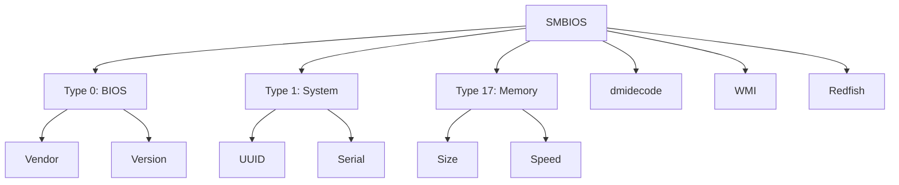

+++
title = "smbios"
date = "2026-03-14"
weight = 708
+++

# SMBIOS (System Management BIOS)

#### 핵심 인사이트 (3줄 요약)
> 1. **본질**: 시스템 하드웨어 정보(제조사, 모델, 시리얼, UUID 등)를 표준화된 구조로 제공하는 펌웨어 데이터 테이블 규격
> 2. **가치**: 자산 관리, 원격 모니터링, 드라이버 호환성 확인, 보안 인증(TPM 연동), OS 설치 자동화
> 3. **융합**: UEFI, IPMI, Redfish, DMI, WMI, SNMP와 통합된 시스템 정보 인프라

---

### Ⅰ. 개요 (Context & Background)

**개념 정의**

SMBIOS (System Management BIOS)는 시스템 하드웨어 구성 정보를 운영체제와 애플리케이션에 제공하는 표준화된 데이터 구조입니다. DMTF(Distributed Management Task Force)에서 표준화하였으며, BIOS/UEFI 펌웨어에서 제공합니다.

```
┌─────────────────────────────────────────────────────────────────────┐
│                    SMBIOS 데이터 구조 개요                           │
├─────────────────────────────────────────────────────────────────────┤
│                                                                     │
│   ┌──────────────────────────────────────────────────────────────┐ │
│   │                    SMBIOS Table 영역                          │ │
│   │                     (BIOS/UEFI 메모리)                        │ │
│   │                                                              │ │
│   │   ┌─────────────────────────────────────────────────────┐    │ │
│   │   │            Entry Point (32-bit/64-bit)              │    │ │
│   │   │   - Anchor String: "_SM_"                          │    │ │
│   │   │   - Table Length: 0x1F00                           │    │ │
│   │   │   - Table Address: 0x000E0010                      │    │ │
│   │   │   - Number of Structures: 25                       │    │ │
│   │   └─────────────────────────────────────────────────────┘    │ │
│   │                         │                                     │ │
│   │                         ▼                                     │ │
│   │   ┌─────────────────────────────────────────────────────┐    │ │
│   │   │            Structure List                            │    │ │
│   │   │                                                     │    │ │
│   │   │   ┌─────────────────────────────────────────────┐   │    │ │
│   │   │   │ Type 0: BIOS Information                    │   │    │ │
│   │   │   │   - Vendor: "American Megatrends Inc."      │   │    │ │
│   │   │   │   - Version: "1.2.3"                        │   │    │ │
│   │   │   │   - Release Date: "01/15/2024"              │   │    │ │
│   │   │   └─────────────────────────────────────────────┘   │    │ │
│   │   │                                                     │    │ │
│   │   │   ┌─────────────────────────────────────────────┐   │    │ │
│   │   │   │ Type 1: System Information                  │   │    │ │
│   │   │   │   - Manufacturer: "Dell Inc."               │   │    │ │
│   │   │   │   - Product: "PowerEdge R750"               │   │    │ │
│   │   │   │   - Serial: "ABCD1234"                      │   │    │ │
│   │   │   │   - UUID: "12345678-1234-5678-..."          │   │    │ │
│   │   │   └─────────────────────────────────────────────┘   │    │ │
│   │   │                                                     │    │ │
│   │   │   ┌─────────────────────────────────────────────┐   │    │ │
│   │   │   │ Type 2: Board Information                   │   │    │ │
│   │   │   │   - Manufacturer: "Dell Inc."               │   │    │ │
│   │   │   │   - Product: "0M5C5C"                       │   │    │ │
│   │   │   │   - Serial: "...CN12345678..."              │   │    │ │
│   │   │   └─────────────────────────────────────────────┘   │    │ │
│   │   │                                                     │    │ │
│   │   │   ... (Type 3~43) ...                               │    │ │
│   │   │                                                     │    │ │
│   │   │   ┌─────────────────────────────────────────────┐   │    │ │
│   │   │   │ Type 17: Memory Device                       │   │    │ │
│   │   │   │   - Size: 32 GB                              │   │    │ │
│   │   │   │   - Type: DDR5                               │   │    │ │
│   │   │   │   - Speed: 4800 MT/s                         │   │    │ │
│   │   │   │   - Manufacturer: "Samsung"                  │   │    │ │
│   │   │   └─────────────────────────────────────────────┘   │    │ │
│   │   │                                                     │    │ │
│   │   └─────────────────────────────────────────────────────┘    │ │
│   │                                                              │ │
│   └──────────────────────────────────────────────────────────────┘ │
│                                                                     │
│                     OS/Application Access                           │
│                    (dmidecode, WMI, sysfs)                          │
│                                                                     │
└─────────────────────────────────────────────────────────────────────┘
```

> **해설**: SMBIOS는 Entry Point에서 시작하여 다양한 Type의 구조체로 구성됩니다. Type 0은 BIOS, Type 1은 시스템, Type 2는 보드, Type 17은 메모리 정보를 제공합니다.

**💡 비유**: SMBIOS는 컴퓨터의 "신분증"과 같습니다. 이름(제조사), 생년월일(제조일), 주민번호(시리얼), 주소(UUID) 등 신원 정보가 기록되어 있습니다.

**등장 배경**

① **기존 한계**: 제조사별 비표준 정보 → 자산 관리, 드라이버 확인 어려움
② **혁신적 패러다임**: SMBIOS로 표준화된 하드웨어 정보 제공
③ **비즈니스 요구**: 자산 관리, 원격 모니터링, OS 설치 자동화

**📢 섹션 요약 비유**: SMBIOS는 컴퓨터의 신분증과 같습니다. 누가 만들었는지, 언제 만들었는지, 무엇이 들어있는지 한눈에 알 수 있어요.

---

### Ⅱ. 아키텍처 및 핵심 원리 (Deep Dive)

**구성 요소 상세 분석**

| Type | 명칭 | 주요 정보 | 비유 |
|:---|:---|:---|:---|
| **0** | BIOS Information | 제조사, 버전, 날짜 | 신분증 발급 기관 |
| **1** | System Information | 제조사, 모델, 시리얼, UUID | 신분증 기본 정보 |
| **2** | Board Information | 메인보드 제조사, 모델, 시리얼 | 거주지 정보 |
| **3** | System Enclosure | 케이스 유형, 제조사, 자산 태그 | 주소 |
| **4** | Processor Information | CPU 제조사, 모델, 코어 수, 속도 | 직업 |
| **5** | Memory Controller | 메모리 컨트롤러 정보 | 은행 |
| **6** | Memory Module | 메모리 모듈 정보 | 계좌 |
| **7** | Cache Information | 캐시 크기, 속도, 유형 | 지갑 |
| **9** | System Slots | PCIe 슬롯, M.2 슬롯 | 카드 슬롯 |
| **11** | OEM Strings | 제조사별 정보 | 메모 |
| **16** | Physical Memory Array | 총 메모리 용량, 슬롯 수 | 총 자산 |
| **17** | Memory Device | 개별 메모리 모듈 정보 | 개별 계좌 |
| **19** | Memory Array Mapped Address | 메모리 주소 매핑 | 계좌 번호 |
| **32** | System Boot Information | 부트 상태 | 출입 기록 |
| **38** | IPMI Device | IPMI 버전, 주소 | 보안 시스템 |
| **43** | TPM Device | TPM 버전, 상태 | 보안 인증 |

**SMBIOS 데이터 접근 방식**

```
┌─────────────────────────────────────────────────────────────────────┐
│                    SMBIOS 데이터 접근 방식                           │
├─────────────────────────────────────────────────────────────────────┤
│                                                                     │
│   ┌──────────────────────────────────────────────────────────────┐ │
│   │                    BIOS/UEFI 펌웨어                           │ │
│   │                                                              │ │
│   │   SMBIOS 데이터 생성 → 메모리에 Table 로드                   │ │
│   │                                                              │ │
│   └────────────────────────────┬─────────────────────────────────┘ │
│                                │                                    │
│   ┌────────────────────────────┼─────────────────────────────────┐ │
│   │                            │                                  │ │
│   │   ┌────────────────────────┼────────────────────────────┐    │ │
│   │   │                    UEFI 환경                          │    │ │
│   │   │                        │                              │    │ │
│   │   │   SMBIOS Table Protocol (gEfiSmbiosTableGuid)        │    │ │
│   │   │   - GetTable(): SMBIOS 테이블 포인터 반환             │    │ │
│   │   │                        │                              │    │ │
│   │   └────────────────────────┼────────────────────────────┘    │ │
│   │                            │                                  │ │
│   │   ┌────────────────────────┼────────────────────────────┐    │ │
│   │   │                    BIOS 환경                         │    │ │
│   │   │                        │                              │    │ │
│   │   │   메모리 스캔: 0xF0000 ~ 0xFFFFF                     │    │ │
│   │   │   Anchor String "_SM_" 검색                          │    │ │
│   │   │                        │                              │    │ │
│   │   └────────────────────────┼────────────────────────────┘    │ │
│   │                            │                                  │ │
│   └────────────────────────────┼─────────────────────────────────┘ │
│                                │                                    │
│                                ▼                                    │
│   ┌──────────────────────────────────────────────────────────────┐ │
│   │                    OS별 접근 방식                             │ │
│   │                                                              │ │
│   │   ┌─────────────────┐ ┌─────────────────┐ ┌───────────────┐ │ │
│   │   │ Linux           │ │ Windows         │ │ macOS         │ │ │
│   │   │                 │ │                 │ │               │ │ │
│   │   │ /sys/class/     │ │ WMI Query       │ │ ioreg         │ │ │
│   │   │ dmi/id/         │ │ Win32_BIOS      │ │ system_profiler│ │ │
│   │   │                 │ │ Win32_Computer  │ │               │ │ │
│   │   │ dmidecode       │ │ System          │ │               │ │ │
│   │   └─────────────────┘ └─────────────────┘ └───────────────┘ │ │
│   │                                                              │ │
│   └──────────────────────────────────────────────────────────────┘ │
│                                                                     │
└─────────────────────────────────────────────────────────────────────┘
```

> **해설**: UEFI는 SMBIOS Table Protocol로 접근하고, BIOS는 메모리 스캔으로 접근합니다. OS마다 dmidecode, WMI, ioreg 등의 도구로 정보를 읽습니다.

**핵심 알고리즘: SMBIOS 파싱**

```c
// SMBIOS 구조체 (의사코드)
struct SMBIOS_EntryPoint32 {
    char     anchor[4];          // "_SM_"
    uint8_t  checksum;
    uint8_t  length;             // Entry Point 길이
    uint8_t  major_version;      // 주 버전
    uint8_t  minor_version;      // 부 버전
    uint16_t max_structure_size;
    uint8_t  entry_point_revision;
    char     formatted_area[5];
    char     intermediate_anchor[5];  // "_DMI_"
    uint8_t  intermediate_checksum;
    uint16_t table_length;
    uint32_t table_address;
    uint16_t num_structures;
    uint8_t  bcd_revision;
};

struct SMBIOS_Structure {
    uint8_t  type;               // 구조체 유형
    uint8_t  length;             // 포맷된 영역 길이
    uint16_t handle;             // 고유 핸들
    uint8_t  data[];             // 유형별 데이터 + 문자열
};

// SMBIOS 테이블 파싱
void SMBIOS_ParseTable(uint8_t *table, size_t length) {
    uint8_t *ptr = table;
    uint8_t *end = table + length;

    while (ptr < end) {
        SMBIOS_Structure *s = (SMBIOS_Structure *)ptr;

        // Type별 처리
        switch (s->type) {
            case 0:  // BIOS Information
                printf("BIOS Vendor: %s\n",
                    SMBIOS_GetString(s, s->data[0]));
                printf("BIOS Version: %s\n",
                    SMBIOS_GetString(s, s->data[1]));
                break;

            case 1:  // System Information
                printf("Manufacturer: %s\n",
                    SMBIOS_GetString(s, s->data[0]));
                printf("Product: %s\n",
                    SMBIOS_GetString(s, s->data[1]));
                printf("Serial: %s\n",
                    SMBIOS_GetString(s, s->data[2]));
                printf("UUID: %s\n",
                    FormatUUID(&s->data[4]));
                break;

            case 17: // Memory Device
                printf("Memory Size: %d MB\n",
                    *(uint16_t*)(s->data + 8) * 1024);
                printf("Memory Type: %s\n",
                    GetMemoryTypeString(s->data[10]));
                printf("Speed: %d MT/s\n",
                    *(uint16_t*)(s->data + 11));
                break;
        }

        // 다음 구조체로 이동
        ptr += s->length;

        // 문자열 영역 건너뛰기 (NULL 2개로 종료)
        while (ptr < end) {
            if (ptr[0] == 0 && ptr[1] == 0) {
                ptr += 2;
                break;
            }
            ptr++;
        }
    }
}

// 문자열 인덱스로 문자열 가져오기
const char* SMBIOS_GetString(
    SMBIOS_Structure *s,
    uint8_t index
) {
    if (index == 0) return "";

    // 포맷된 영역 이후의 문자열 영역 탐색
    uint8_t *str_area = (uint8_t*)s + s->length;
    uint8_t current = 1;

    while (*str_area != 0) {
        if (current == index) {
            return (const char*)str_area;
        }
        str_area += strlen((char*)str_area) + 1;
        current++;
    }

    return "";
}
```

**📢 섹션 요약 비유**: SMBIOS 파싱은 신분증을 읽는 것과 같습니다. 각 필드(이름, 생년월일 등)를 순서대로 읽어서 정보를 추출합니다.

---

### Ⅲ. 융합 비교 및 다각도 분석 (Comparison & Synergy)

**기술 비교: SMBIOS vs DMI vs WMI**

| 비교 항목 | SMBIOS | DMI | WMI |
|:---|:---:|:---:|:---:|
| **정의** | 펌웨어 데이터 표준 | SMBIOS 관리 인터페이스 | Windows 관리 인터페이스 |
| **계층** | 펌웨어 (BIOS/UEFI) | OS 추상화 | OS/응용 |
| **플랫폼** | 모든 x86/x64 | Linux/Unix | Windows |
| **접근** | dmidecode | /sys/class/dmi | Win32_* 클래스 |
| **동적** | 정적 | 정적 | 동적 (이벤트) |

**과목 융합 관점: SMBIOS와 타 영역 시너지**

| 융합 영역 | 시너지 효과 | 구현 예시 |
|:---|:---|:---|
| **OS (운영체제)** | 드라이버 자동 로드 | Linux udev, Windows PnP |
| **네트워크** | 원격 자산 관리 | SNMP, Redfish |
| **보안** | 장치 식별, TPM 연동 | 장치 인증 |
| **가상화** | VM SMBIOS 설정 | QEMU -smbios |
| **클라우드** | 인스턴스 메타데이터 | AWS instance-id |

**📢 섹션 요약 비유**: SMBIOS는 신분증, DMI는 신분증 검색 시스템, WMI는 Windows용 종합 정보 시스템과 같습니다.

---

### Ⅳ. 실무 적용 및 기술사적 판단 (Strategy & Decision)

**실무 시나리오별 적용**

**시나리오 1: 자산 관리 시스템**
- **문제**: 수천 대 서버 자산 정보 수집
- **해결**: SMBIOS로 자동 수집 (제조사, 모델, 시리얼)
- **의사결정**: CMDB 연동

**시나리오 2: OS 설치 자동화**
- **문제**: 하드웨어별 드라이버 선택
- **해결**: SMBIOS로 하드웨어 식별, 드라이버 자동 설치
- **의사결정**: Puppet/Ansible 활용

**시나리오 3: 보안 인증**
- **문제**: 장치 무결성 검증
- **해결**: SMBIOS UUID + TPM 인증
- **의사결정**: Zero Trust 아키텍처

**도입 체크리스트**

| 구분 | 항목 | 확인 포인트 |
|:---|:---|:---|
| **기술적** | SMBIOS 버전 | 3.0+ 권장 |
| | 정보 정확성 | 제조사 설정 확인 |
| | 접근 권한 | root/Administrator |
| **운영적** | 자산 DB 연동 | CMDB 동기화 |
| | 정보 보호 | 시리얼/UUID 보안 |
| | 변경 이력 | 펌웨어 업데이트 시 |

**안티패턴: SMBIOS 오용 사례**

| 안티패턴 | 문제점 | 올바른 접근 |
|:---|:---|:---|
| **UUID를 유일 키로 사용** | 중복 가능성 | UUID + 시리얼 조합 |
| **SMBIOS만 신뢰** | 오래된 정보 | 실시간 데이터와 교차 검증 |
| **문자열 직접 파싱** | 버전별 차이 | 라이브러리 사용 |
| **보안 무시** | 민감 정보 노출 | 접근 제한 |

**📢 섹션 요약 비유**: SMBIOS 활용은 신분증으로 본인 확인하는 것과 같습니다. 정확하게 읽고, 보안을 지키고, 다른 정보와 교차 검증해야 합니다.

---

### Ⅴ. 기대효과 및 결론 (Future & Standard)

**정량/정성 기대효과**

| 구분 | SMBIOS 미사용 | SMBIOS 사용 | 개선효과 |
|:---|:---:|:---:|:---:|
| **자산 수집** | 수동 (시간) | 자동 (초) | 1000배 |
| **드라이버 설치** | 수동 선택 | 자동 설치 | 10배 |
| **장애 진단** | 현장 방문 | 원격 식별 | 5배 |
| **보안 인증** | 불가능 | 장치 식별 | 신규 |

**미래 전망**

1. **SMBIOS 3.5+:** 더 많은 하드웨어 유형 지원
2. **Redfish 통합:** SMBIOS → Redfish 자동 연동
3. **AI 자산 관리:** AI 기반 자산 분석
4. **보안 강화:** 서명된 SMBIOS

**참고 표준**

| 표준 | 내용 | 적용 |
|:---|:---|:---|
| **DMTF DSP0134** | SMBIOS 규격 | 3.5.0 (2022) |
| **DMTF DSP0139** | SMBIOS Control | 관리 인터페이스 |
| **UEFI 2.10** | SMBIOS Table Protocol | UEFI 통합 |
| **Redfish** | SMBIOS 연동 | 원격 관리 |

**📢 섹션 요약 비유**: SMBIOS의 미래는 디지털 신분증으로 진화하는 것과 같습니다. 더 많은 정보, 더 강력한 보안, 더 쉬운 접근이 가능해집니다.

---

### 📌 관련 개념 맵 (Knowledge Graph)



**연관 개념 링크**:
- UEFI - UEFI 펌웨어
- IPMI - 원격 관리
- Redfish - RESTful 관리 API
- TPM - 신뢰형 플랫폼 모듈

---

### 👶 어린이를 위한 3줄 비유 설명

1. **컴퓨터 신분증**: SMBIOS는 컴퓨터의 신분증 같아요! 누가 만들었는지, 모델명이 뭔지 적혀 있어요.

2. **자동 정보 수집**: 신분증을 보면 사람 정보를 알 수 있듯이, SMBIOS를 읽으면 컴퓨터 정보를 알 수 있어요.

3. **자산 관리**: 회사에 컴퓨터가 1000대 있어도 SMBIOS로 모든 컴퓨터의 정보를 자동으로 모을 수 있어요!