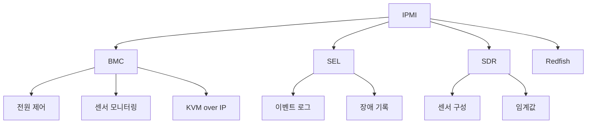

+++
title = "ipmi"
date = "2026-03-14"
weight = 709
+++

# IPMI (Intelligent Platform Management Interface)

#### 핵심 인사이트 (3줄 요약)
> 1. **본질**: 서버 하드웨어 원격 모니터링, 제어, 복구를 위한 독립적인 관리 서브시스템 표준 인터페이스
> 2. **가치**: OS 독립적 원격 제어, 전원 관리, 센서 모니터링, 이벤트 로깅, KVM over IP 기반
> 3. **융합**: BMC, 센서, FRU, SDR, SEL, LAN, Serial과 통합된 OOB(Out-of-Band) 관리 아키텍처

---

### Ⅰ. 개요 (Context & Background)

**개념 정의**

IPMI (Intelligent Platform Management Interface)는 Intel, Dell, HP, NEC가 공동 개발한 서버 관리 표준입니다. OS와 독립적으로 작동하는 BMC(Baseboard Management Controller)를 통해 전원, 센서, 로그, 원격 제어 기능을 제공합니다.

```
┌─────────────────────────────────────────────────────────────────────┐
│                    IPMI 아키텍처 개요                                 │
├─────────────────────────────────────────────────────────────────────┤
│                                                                     │
│   ┌──────────────────────────────────────────────────────────────┐ │
│   │                    서버 하드웨어                               │ │
│   │                                                              │ │
│   │   ┌─────────────────────────────────────────────────────┐    │ │
│   │   │              Main Processor (CPU)                    │    │ │
│   │   │   ┌─────────────────────────────────────────────┐    │    │ │
│   │   │   │           Operating System                  │    │    │ │
│   │   │   │   (Linux, Windows, ESXi)                   │    │    │ │
│   │   │   └─────────────────────────────────────────────┘    │    │ │
│   │   └─────────────────────────────────────────────────────┘    │ │
│   │                         │ In-Band                            │ │
│   │                         ▼                                    │ │
│   │   ┌─────────────────────────────────────────────────────┐    │ │
│   │   │              System Interface (LPC/I2C)              │    │ │
│   │   └─────────────────────────────────────────────────────┘    │ │
│   │                         │                                    │ │
│   │   ┌─────────────────────┴───────────────────────────────┐    │ │
│   │   │              BMC (Baseboard Management Controller)   │    │ │
│   │   │                                                       │    │ │
│   │   │   ┌───────────┐ ┌───────────┐ ┌───────────┐         │    │ │
│   │   │   │  Sensors  │ │   SDR     │ │   SEL     │         │    │ │
│   │   │   │ (Temp/Fan)│ │ (Records) │ │  (Events) │         │    │ │
│   │   │   └───────────┘ └───────────┘ └───────────┘         │    │ │
│   │   │                                                       │    │ │
│   │   │   ┌───────────┐ ┌───────────┐ ┌───────────┐         │    │ │
│   │   │   │   FRU     │ │   KCS     │ │   LAN     │         │    │ │
│   │   │   │ (Inventory)│ │  (IPMI)   │ │ (Network) │         │    │ │
│   │   │   └───────────┘ └───────────┘ └───────────┘         │    │ │
│   │   │                                                       │    │ │
│   │   └───────────────────────────────────────────────────────┘    │ │
│   │                         │ Out-of-Band                          │ │
│   │                         ▼                                    │ │
│   │   ┌─────────────────────────────────────────────────────┐    │ │
│   │   │            Dedicated Management Port                 │    │ │
│   │   │              (RJ-45, 1GbE)                          │    │ │
│   │   └─────────────────────────────────────────────────────┘    │ │
│   │                                                              │ │
│   └──────────────────────────────────────────────────────────────┘ │
│                                                                     │
│                     원격 관리 콘솔 (IPMItool, OpenIPMI)             │
│                                                                     │
└─────────────────────────────────────────────────────────────────────┘
```

> **해설**: IPMI는 OS와 독립된 BMC가 관리를 담당합니다. In-Band(OS 내부)와 Out-of-Band(네트워크) 두 경로로 접근 가능합니다.

**💡 비유**: IPMI는 건물의 "관리실"과 같습니다. 건물이 꺼져도(서버 다운) 관리실은 독립 전원으로 작동하며, 문을 열고 닫고(전원), 온도를 체크하고(센서), 기록을 남깁니다(로그).

**등장 배경**

① **기존 한계**: OS 종속적 관리 → OS 장애 시 원격 복구 불가
② **혁신적 패러다임**: IPMI로 OS 독립적 원격 관리
③ **비즈니스 요구**: 데이터센터 무인 운영, 원격 장애 복구, 비용 절감

**📢 섹션 요약 비유**: IPMI는 건물 관리실 같아요. 건물이 꺼져도 관리실은 계속 작동해서 문을 열고, 온도를 체크해요.

---

### Ⅱ. 아키텍처 및 핵심 원리 (Deep Dive)

**구성 요소 상세 분석**

| 요소명 | 역할 | 내부 동작 | 프로토콜/규격 | 비유 |
|:---|:---|:---|:---|:---|
| **BMC** | 관리 컨트롤러 | ARM SoC, 펌웨어 | IPMI 2.0 | 관리실 |
| **SDR** | 센서 데이터 레코드 | 센서 구성 정보 | IPMI 2.0 | 센서 명세서 |
| **SEL** | 시스템 이벤트 로그 | 이벤트 기록 | IPMI 2.0 | 일지 |
| **FRU** | 필드 교환 유닛 정보 | 자산 정보 | IPMI 2.0 | 자산 카드 |
| **KCS** | 키보드 컨트롤러 스타일 | In-Band 인터페이스 | IPMI 2.0 | 내선 전화 |
| **LAN** | 네트워크 인터페이스 | Out-of-Band 접근 | IPMI 2.0 | 외선 전화 |
| **Sensors** | 하드웨어 센서 | 온도, 전압, 팬 | IPMI 2.0 | 계측기 |

**IPMI 통신 흐름**

```
┌─────────────────────────────────────────────────────────────────────┐
│                    IPMI 통신 흐름                                    │
├─────────────────────────────────────────────────────────────────────┤
│                                                                     │
│   관리 콘솔 (Remote)                                                │
│   ┌──────────────────────────────────────────────────────────────┐ │
│   │                                                              │ │
│   │   ipmitool -H 192.168.1.100 -U admin -P password             │ │ │
│   │                                                              │ │
│   │   명령 예시:                                                 │ │
│   │   - power status         # 전원 상태 확인                    │ │
│   │   - power on             # 전원 켜기                         │ │
│   │   - sensor               # 센서 값 읽기                      │ │
│   │   - sel list             # 이벤트 로그 보기                  │ │
│   │   - chassis bootdev pxe  # PXE 부팅 설정                     │ │
│   │                                                              │ │
│   └──────────────────────────────────────────────────────────────┘ │
│                                │                                    │
│                                │ RMCP/RMCP+ (UDP 623)              │
│                                │                                    │
│                                ▼                                    │
│   ┌──────────────────────────────────────────────────────────────┐ │
│   │                    BMC (Baseboard Management Controller)      │ │
│   │                                                              │ │
│   │   ┌─────────────────────────────────────────────────────┐    │ │
│   │   │            IPMI Message Handler                      │    │ │
│   │   │                                                     │    │ │
│   │   │   1. 인증 (Authentication)                          │    │ │
│   │   │      - 사용자/패스워드 확인                          │    │ │
│   │   │      - 챌린지-리스폰스                               │    │ │
│   │   │                                                     │    │ │
│   │   │   2. 명령 처리 (Command Processing)                 │    │ │
│   │   │      - NetFn (Network Function) 분석                │    │ │
│   │   │      - Command 실행                                  │    │ │
│   │   │                                                     │    │ │
│   │   │   3. 응답 (Response)                                │    │ │
│   │   │      - 결과 반환                                     │    │ │
│   │   │      - 이벤트 로그 기록                               │    │ │
│   │   │                                                     │    │ │
│   │   └─────────────────────────────────────────────────────┘    │ │
│   │                         │                                    │ │
│   │   ┌─────────────────────┼───────────────────────────────┐    │ │
│   │   │                     │                               │    │ │
│   │   │   ┌─────────┐ ┌─────┴─────┐ ┌─────────┐            │    │ │
│   │   │   │ Sensor  │ │   Power   │ │  Reset  │            │    │ │
│   │   │   │ Control │ │  Control  │ │ Control │            │    │ │
│   │   │   └─────────┘ └───────────┘ └─────────┘            │    │ │
│   │   │         │             │             │                │    │ │
│   │   │         ▼             ▼             ▼                │    │ │
│   │   │   온도/전압/팬   전원 켜기/끄기   시스템 리셋        │    │ │
│   │   │                                                       │    │ │
│   │   └───────────────────────────────────────────────────────┘    │ │
│   │                                                              │ │
│   └──────────────────────────────────────────────────────────────┘ │
│                                                                     │
└─────────────────────────────────────────────────────────────────────┘
```

> **해설**: IPMI는 RMCP/RMCP+ 프로토콜로 UDP 623 포트를 사용합니다. BMC는 인증, 명령 처리, 응답을 수행하며 센서, 전원, 리셋을 제어합니다.

**핵심 알고리즘: IPMI 명령 구조**

```c
// IPMI 메시지 구조 (의사코드)
struct IPMI_Message {
    uint8_t netfn;      // Network Function (6-bit)
    uint8_t lun;        // Logical Unit Number (2-bit)
    uint8_t checksum1;  // 체크섬 1
    uint8_t cmd;        // Command
    uint8_t data[];     // 데이터 (가변)
    uint8_t checksum2;  // 체크섬 2
};

// NetFn 정의
enum IPMI_NetFn {
    NETFN_CHASSIS      = 0x00,  // 섀시 제어
    NETFN_BRIDGE       = 0x02,  // 브리지
    NETFN_SENSOR       = 0x04,  // 센서/이벤트
    NETFN_APP          = 0x06,  // 애플리케이션
    NETFN_FIRMWARE     = 0x08,  // 펌웨어
    NETFN_STORAGE      = 0x0A,  // 스토리지
    NETFN_TRANSPORT    = 0x0C,  // 전송
};

// 주요 IPMI 명령
// Chassis Commands (NetFn = 0x00)
IPMI_STATUS IPMI_GetChassisStatus() {
    IPMI_Message cmd = {
        .netfn = NETFN_CHASSIS << 2,
        .cmd   = 0x01,  // Get Chassis Status
    };
    return SendCommand(&cmd);
}

IPMI_STATUS IPMI_ChassisControl(uint8_t action) {
    // action: 0=off, 1=on, 2=cycle, 3=reset, 4=diag, 5=soft-off
    IPMI_Message cmd = {
        .netfn = NETFN_CHASSIS << 2,
        .cmd   = 0x02,  // Chassis Control
        .data  = {action}
    };
    return SendCommand(&cmd);
}

// Sensor Commands (NetFn = 0x04)
IPMI_STATUS IPMI_GetSensorReading(uint8_t sensor_num) {
    IPMI_Message cmd = {
        .netfn = NETFN_SENSOR << 2,
        .cmd   = 0x2D,  // Get Sensor Reading
        .data  = {sensor_num}
    };
    return SendCommand(&cmd);
}

// SEL (System Event Log) Commands (NetFn = 0x0A)
IPMI_STATUS IPMI_GetSELInfo() {
    IPMI_Message cmd = {
        .netfn = NETFN_STORAGE << 2,
        .cmd   = 0x40,  // Get SEL Info
    };
    return SendCommand(&cmd);
}

IPMI_STATUS IPMI_AddSELEntry(SEL_Entry *entry) {
    IPMI_Message cmd = {
        .netfn = NETFN_STORAGE << 2,
        .cmd   = 0x44,  // Add SEL Entry
        .data  = entry->bytes
    };
    return SendCommand(&cmd);
}

// 실제 사용 예시
int main() {
    // IPMI 연결
    IPMI_Session *session = IPMI_Connect(
        "192.168.1.100",  // BMC IP
        "admin",          // Username
        "password"        // Password
    );

    // 전원 상태 확인
    ChassisStatus status = IPMI_GetChassisStatus(session);
    printf("Power: %s\n", status.power_on ? "ON" : "OFF");

    // 온도 센서 읽기
    SensorReading temp = IPMI_GetSensorReading(session, 0x01);
    printf("Temperature: %d °C\n", temp.value);

    // 전원 끄기
    if (status.power_on) {
        IPMI_ChassisControl(session, POWER_OFF);
        printf("Power OFF sent\n");
    }

    // 이벤트 로그 읽기
    SEL_Info sel = IPMI_GetSELInfo(session);
    printf("SEL Entries: %d\n", sel.entries);

    IPMI_Disconnect(session);
    return 0;
}
```

**📢 섹션 요약 비유**: IPMI 명령은 관리실에 전화해서 요청하는 것과 같습니다. "온도 알려줘", "전원 켜줘", "로그 보여줘" 같은 요청을 보내면 처리됩니다.

---

### Ⅲ. 융합 비교 및 다각도 분석 (Comparison & Synergy)

**기술 비교: IPMI vs Redfish vs SNMP**

| 비교 항목 | IPMI | Redfish | SNMP |
|:---|:---:|:---:|:---:|
| **프로토콜** | RMCP/RMCP+ | REST/JSON | UDP |
| **포트** | 623 | 443 | 161 |
| **보안** | MD5/SHA1 | TLS 1.3 | v3 |
| **인터페이스** | CLI/텍스트 | Web/JSON | MIB |
| **기능** | 기본 관리 | 고급 관리 | 네트워크 관리 |
| **표준** | DMTF | DMTF | IETF |
| **확장성** | 제한적 | 높음 | 중간 |

**과목 융합 관점: IPMI와 타 영역 시너지**

| 융합 영역 | 시너지 효과 | 구현 예시 |
|:---|:---|:---|
| **OS (운영체제)** | 커널 IPMI 드라이버 | Linux ipmi_devintf |
| **네트워크** | 원격 관리 VLAN | 관리 네트워크 분리 |
| **보안** | IPMI 보안 강화 | IPMI 2.0 + VPN |
| **가상화** | VM 전원 제어 | vSphere IPMI |
| **클라우드** | 베어메탈 관리 | OpenStack Ironic |

**📢 섹션 요약 비유**: IPMI는 전화(RMCP), Redfish는 웹(REST), SNMP는 편지(MIB)로 비유할 수 있습니다. 각각 장단점이 있습니다.

---

### Ⅳ. 실무 적용 및 기술사적 판단 (Strategy & Decision)

**실무 시나리오별 적용**

**시나리오 1: 원격 서버 재부팅**
- **문제**: 원격 서버 응답 없음, 물리적 접근 불가
- **해결**: IPMI로 power cycle
- **의사결정**: OS 독립적 복구

**시나리오 2: 온도 모니터링**
- **문제**: 과열로 인한 서버 장애 예방
- **해결**: IPMI 센서로 온도 모니터링, 알림
- **의사결정**: 자동 셧다운 설정

**시나리오 3: 자산 관리**
- **문제**: 서버 자산 정보 수집
- **해결**: IPMI FRU로 시리얼, 모델 수집
- **의사결정**: CMDB 연동

**도입 체크리스트**

| 구분 | 항목 | 확인 포인트 |
|:---|:---|:---|
| **기술적** | BMC IP | 전용 관리 VLAN |
| | 펌웨어 | 최신 IPMI 2.0 |
| | 보안 | 강력한 패스워드 |
| **운영적** | 접근 제어 | RBAC 설정 |
| | 로그 | SEL 정기 확인 |
| | 백업 | BMC 설정 백업 |

**안티패턴: IPMI 오용 사례**

| 안티패턴 | 문제점 | 올바른 접근 |
|:---|:---|:---|
| **기본 패스워드 사용** | 무단 접근 위험 | 강력한 패스워드 |
| **공용 네트워크 연결** | 보안 위험 | 전용 VLAN |
| **암호화 미사용** | 스니핑 위험 | IPMI 2.0 암호화 |
| **SEL 미확인** | 장애 예방 실패 | 정기 확인 |

**📢 섹션 요약 비유**: IPMI 보안은 관리실 문을 잠그는 것과 같습니다. 기본 열쇠(패스워드)를 그대로 두면 위험합니다.

---

### Ⅴ. 기대효과 및 결론 (Future & Standard)

**정량/정성 기대효과**

| 구분 | IPMI 미사용 | IPMI 사용 | 개선효과 |
|:---|:---:|:---:|:---:|
| **장애 복구** | 현장 방문 (시간) | 원격 (분) | 60배 |
| **운영 비용** | 높음 | 낮음 | 50% 절감 |
| **가용성** | 99% | 99.9% | 10배 |
| **모니터링** | 제한적 | 실시간 | 신규 |

**미래 전망**

1. **Redfish로 전환:** IPMI → Redfish 마이그레이션
2. **AI 기반 관리:** 예지 보전
3. **클라우드 통합:** 베어메탈 클라우드
4. **Zero Trust:** 강화된 보안

**참고 표준**

| 표준 | 내용 | 적용 |
|:---|:---|:---|
| **IPMI 2.0** | 현재 표준 | 2004년 |
| **DCMI 1.5** | 데이터센터 관리 | IPMI 확장 |
| **Redfish 1.15** | 차세대 표준 | REST API |
| **DMTF** | 표준화 기관 | IPMI/Redfish |

**📢 섹션 요약 비유**: IPMI의 미래는 전화에서 웹(Redfish)으로 전환하는 것과 같습니다. 더 직관적이고 강력한 관리가 가능해집니다.

---

### 📌 관련 개념 맵 (Knowledge Graph)



**연관 개념 링크**:
- BMC - 베이스보드 관리 컨트롤러
- Redfish - RESTful 관리 API
- KVM over IP - 원격 콘솔
- OOB Management - 대역 외 관리

---

### 👶 어린이를 위한 3줄 비유 설명

1. **관리실**: IPMI는 건물 관리실 같아요! 컴퓨터가 꺼져도 관리실은 계속 작동해요.

2. **원격 제어**: 멀리서도 전화로 "불 좀 꺼줘", "문 좀 열어줘" 할 수 있듯이, IPMI로 컴퓨터 전원을 켜고 끌 수 있어요.

3. **건강 체크**: 관리실에서 온도계를 보듯이, IPMI로 컴퓨터의 온도와 팬 속도를 확인할 수 있어요!