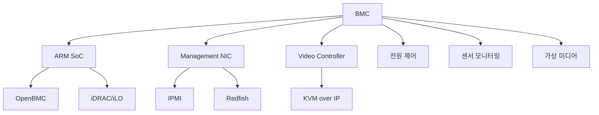

+++
title = "bmc"
date = "2026-03-14"
weight = 710
+++

# BMC (Baseboard Management Controller)

#### 핵심 인사이트 (3줄 요약)
> 1. **본질**: 서버 메인보드에 탑재된 독립적인 ARM 기반 관리 SoC로, OS와 무관하게 하드웨어 모니터링, 전원 제어, 원격 콘솔 기능 제공
> 2. **가치**: OOB(Out-of-Band) 관리, IPMI/Redfish 구현, KVM over IP, 가상 미디어, 자산 관리, 예지 보전
> 3. **융합**: IPMI, Redfish, DCMI, SNMP, PXE, UEFI와 통합된 서버 관리 핵심 컴포넌트

---

### Ⅰ. 개요 (Context & Background)

**개념 정의**

BMC (Baseboard Management Controller)는 서버 메인보드에 장착된 독립적인 관리 컨트롤러입니다. 주로 ARM 기반 SoC로 구현되며, 자체 펌웨어(Linux 기반), 네트워크 인터페이스, 센서 인터페이스를 갖추고 OS와 독립적으로 작동합니다.

```
┌─────────────────────────────────────────────────────────────────────┐
│                    BMC 하드웨어 아키텍처                              │
├─────────────────────────────────────────────────────────────────────┤
│                                                                     │
│   ┌──────────────────────────────────────────────────────────────┐ │
│   │                    메인 서버 컴포넌트                          │ │
│   │                                                              │ │
│   │   ┌────────────┐  ┌────────────┐  ┌────────────┐            │ │
│   │   │    CPU     │  │   Memory   │  │  Storage   │            │ │
│   │   │ (x86/ARM)  │  │  (DDR5)    │  │  (NVMe)    │            │ │
│   │   └────────────┘  └────────────┘  └────────────┘            │ │
│   │         │               │               │                    │ │
│   │         ▼               ▼               ▼                    │ │
│   │   ┌─────────────────────────────────────────────────────┐    │ │
│   │   │                   Main Board (PCH)                   │    │ │
│   │   │   - LPC/eSPI Bus                                     │    │ │
│   │   │   - I2C/SMBus                                        │    │ │
│   │   │   - GPIO (Power, Reset)                              │    │ │
│   │   └─────────────────────────────────────────────────────┘    │ │
│   │                         │                                    │ │
│   └─────────────────────────┼────────────────────────────────────┘ │
│                             │                                      │
│   ┌─────────────────────────┼────────────────────────────────────┐ │
│   │                         │                BMC Board            │ │
│   │   ┌─────────────────────┴───────────────────────────────┐    │ │
│   │   │                  BMC SoC (ARM Cortex-A)              │    │ │
│   │   │                                                       │    │ │
│   │   │   ┌─────────────┐  ┌─────────────┐  ┌─────────────┐  │    │ │
│   │   │   │ ARM Core    │  │   SRAM      │  │  Flash      │  │    │ │
│   │   │   │ (400MHz)    │  │  (256KB)    │  │  (16MB)     │  │    │ │
│   │   │   └─────────────┘  └─────────────┘  └─────────────┘  │    │ │
│   │   │                                                       │    │ │
│   │   │   ┌─────────────┐  ┌─────────────┐  ┌─────────────┐  │    │ │
│   │   │   │   UART      │  │   I2C       │  │   SPI       │  │    │ │
│   │   │   │ (Console)   │  │ (Sensors)   │  │ (Flash)     │  │    │ │
│   │   │   └─────────────┘  └─────────────┘  └─────────────┘  │    │ │
│   │   │                                                       │    │ │
│   │   └───────────────────────────────────────────────────────┘    │ │
│   │                         │                                    │ │
│   │   ┌─────────────────────┼───────────────────────────────┐    │ │
│   │   │                 BMC Peripherals                      │    │ │
│   │   │                                                       │    │ │
│   │   │   ┌─────────────┐  ┌─────────────┐  ┌─────────────┐  │    │ │
│   │   │   │ Management  │  │   Video     │  │  USB        │  │    │ │
│   │   │   │ NIC (1GbE)  │  │ Controller  │  │ Virtual     │  │    │ │
│   │   │   └─────────────┘  └─────────────┘  └─────────────┘  │    │ │
│   │   │                                                       │    │ │
│   │   └───────────────────────────────────────────────────────┘    │ │
│   │                                                              │ │
│   └──────────────────────────────────────────────────────────────┘ │
│                                                                     │
│                     관리 네트워크 (Dedicated Port)                   │
│                                                                     │
└─────────────────────────────────────────────────────────────────────┘
```

> **해설**: BMC는 ARM SoC, 메모리, 플래시, 관리 NIC, 비디오 컨트롤러로 구성됩니다. LPC/eSPI, I2C, GPIO로 메인 시스템과 연결됩니다.

**💡 비유**: BMC는 자동차의 "블랙박스+원격 제어기"와 같습니다. 엔진이 꺼져도 작동하며, 원격으로 문을 잠그고, 상태를 확인하고, 기록을 남깁니다.

**등장 배경**

① **기존 한계**: OS 종속 관리 → OS 장애 시 무력
② **혁신적 패러다임**: 독립 BMC로 상시 관리 가능
③ **비즈니스 요구**: 데이터센터 무인 운영, 원격 복구, 비용 절감

**📢 섹션 요약 비유**: BMC는 자동차의 블랙박스+원격 제어기 같아요. 엔진이 꺼져도 작동하고, 멀리서도 제어할 수 있어요.

---

### Ⅱ. 아키텍처 및 핵심 원리 (Deep Dive)

**구성 요소 상세 분석**

| 요소명 | 역할 | 내부 동작 | 프로토콜/규격 | 비유 |
|:---|:---|:---|:---|:---|
| **ARM Core** | 메인 프로세서 | BMC 펌웨어 실행 | ARMv7/v8 | CPU |
| **SRAM/DRAM** | 작업 메모리 | 펌웨어 실행 공간 | DDR/LPDDR | RAM |
| **Flash** | 펌웨어 저장 | OpenBMC, iDRAC 등 | SPI NOR | HDD |
| **Management NIC** | 네트워크 인터페이스 | IPMI/Redfish 접근 | 1GbE/10GbE | LAN |
| **Video Controller** | 비디오 캡처 | KVM over IP | VGA/DVI | 카메라 |
| **USB Virtual** | 가상 미디어 | ISO 마운트 | USB 2.0/3.0 | USB |
| **Sensor Interface** | 센서 연결 | 온도, 전압, 팬 | I2C/SMBus | 센서 |

**BMC 펌웨어 구조**

```
┌─────────────────────────────────────────────────────────────────────┐
│                    BMC 펌웨어 구조 (OpenBMC 예시)                     │
├─────────────────────────────────────────────────────────────────────┤
│                                                                     │
│   ┌──────────────────────────────────────────────────────────────┐ │
│   │                    Application Layer                          │ │
│   │                                                              │ │
│   │   ┌───────────┐ ┌───────────┐ ┌───────────┐ ┌───────────┐  │ │
│   │   │ Web UI    │ │ REST API  │ │ IPMI      │ │ Redfish   │  │ │
│   │   │ (bmcweb)  │ │ (bmcweb)  │ │ (ipmid)   │ │ (bmcweb)  │  │ │
│   │   └───────────┘ └───────────┘ └───────────┘ └───────────┘  │ │
│   │                                                              │ │
│   │   ┌───────────┐ ┌───────────┐ ┌───────────┐ ┌───────────┐  │ │
│   │   │ KVM       │ │ Virtual   │ │ Sensor    │ │ Health    │  │ │
│   │   │ (web-vnc) │ │ Media     │ │ Monitor   │ │ Monitor   │  │ │
│   │   └───────────┘ └───────────┘ └───────────┘ └───────────┘  │ │
│   │                                                              │ │
│   └──────────────────────────────────────────────────────────────┘ │
│                                                                     │
│   ┌──────────────────────────────────────────────────────────────┐ │
│   │                    Service Layer                              │ │
│   │                                                              │ │
│   │   ┌───────────┐ ┌───────────┐ ┌───────────┐ ┌───────────┐  │ │
│   │   │ D-Bus     │ │ systemd   │ │ phosphor- │ │ inventory │  │ │
│   │   │ (IPC)     │ │           │ │ dbus-ifaces│ │ (entity)  │  │ │
│   │   └───────────┘ └───────────┘ └───────────┘ └───────────┘  │ │
│   │                                                              │ │
│   └──────────────────────────────────────────────────────────────┘ │
│                                                                     │
│   ┌──────────────────────────────────────────────────────────────┐ │
│   │                    Driver Layer                               │ │
│   │                                                              │ │
│   │   ┌───────────┐ ┌───────────┐ ┌───────────┐ ┌───────────┐  │ │
│   │   │ GPIO      │ │ I2C       │ │ SPI       │ │ UART      │  │ │
│   │   │ (power)   │ │ (sensors) │ │ (flash)   │ │ (console) │  │ │
│   │   └───────────┘ └───────────┘ └───────────┘ └───────────┘  │ │
│   │                                                              │ │
│   │   ┌───────────┐ ┌───────────┐ ┌───────────┐                │ │
│   │   │ NIC       │ │ Video     │ │ USB       │                │ │
│   │   │ (mac)     │ │ (aspeed)  │ │ (gadget)  │                │ │
│   │   └───────────┘ └───────────┘ └───────────┘                │ │
│   │                                                              │ │
│   └──────────────────────────────────────────────────────────────┘ │
│                                                                     │
│   ┌──────────────────────────────────────────────────────────────┐ │
│   │                    Linux Kernel                               │ │
│   │   (ARM, device tree, drivers)                                 │ │
│   └──────────────────────────────────────────────────────────────┘ │
│                                                                     │
│   ┌──────────────────────────────────────────────────────────────┐ │
│   │                    BMC Hardware                               │ │
│   │   (ARM SoC, Memory, Flash, NIC, Video, Sensors)              │ │
│   └──────────────────────────────────────────────────────────────┘ │
│                                                                     │
└─────────────────────────────────────────────────────────────────────┘
```

> **해설**: OpenBMC는 Linux 기반으로 D-Bus IPC, systemd 서비스 관리, phosphor D-Bus 인터페이스로 구성됩니다. 드라이버 레이어는 GPIO, I2C, SPI, UART 등을 제어합니다.

**핵심 알고리즘: BMC 센서 모니터링**

```c
// BMC 센서 모니터링 (의사코드)
struct BMC_Sensor {
    uint8_t  sensor_id;
    char     name[32];
    uint8_t  type;          // 온도, 전압, 팬 등
    float    value;
    float    lower_critical;
    float    upper_critical;
    float    lower_warning;
    float    upper_warning;
};

// 센서 읽기
void BMC_ReadSensors() {
    for (int i = 0; i < num_sensors; i++) {
        BMC_Sensor *sensor = &sensors[i];

        // I2C/SMBus로 센서 값 읽기
        sensor->value = I2C_ReadSensor(sensor->sensor_id);

        // 임계값 확인
        if (sensor->value > sensor->upper_critical) {
            BMC_LogEvent(EVENT_CRITICAL, sensor, "Upper Critical");
            BMC_TriggerAction(ACTION_SHUTDOWN);
        } else if (sensor->value > sensor->upper_warning) {
            BMC_LogEvent(EVENT_WARNING, sensor, "Upper Warning");
            BMC_TriggerAction(ACTION_ALERT);
        }

        // D-Bus로 상태 브로드캐스트
        DBus_EmitSignal("SensorChanged", sensor);
    }
}

// 전원 제어
void BMC_PowerControl(PowerAction action) {
    switch (action) {
        case POWER_ON:
            GPIO_Write(POWER_PIN, HIGH);
            BMC_LogEvent(EVENT_INFO, "Power ON");
            break;

        case POWER_OFF:
            GPIO_Write(POWER_PIN, LOW);
            BMC_LogEvent(EVENT_INFO, "Power OFF");
            break;

        case POWER_CYCLE:
            GPIO_Write(POWER_PIN, LOW);
            sleep(5);  // 5초 대기
            GPIO_Write(POWER_PIN, HIGH);
            BMC_LogEvent(EVENT_INFO, "Power Cycle");
            break;

        case RESET:
            GPIO_Write(RESET_PIN, HIGH);
            usleep(100000);  // 100ms 펄스
            GPIO_Write(RESET_PIN, LOW);
            BMC_LogEvent(EVENT_INFO, "System Reset");
            break;
    }
}

// KVM over IP (비디오 캡처 + 입력 전달)
void BMC_KVMFrame() {
    // 1. 비디오 프레임 캡처
    uint8_t *frame = Video_CaptureFrame();

    // 2. JPEG 압축
    uint8_t *jpeg = JPEG_Compress(frame, &size);

    // 3. WebSocket으로 전송
    WebSocket_Send(jpeg, size);

    // 4. 입력 이벤트 처리 (키보드/마우스)
    InputEvent event;
    while (WebSocket_ReceiveInput(&event)) {
        if (event.type == KEYBOARD) {
            Keyboard_Send(event.code);
        } else if (event.type == MOUSE) {
            Mouse_Move(event.x, event.y);
            Mouse_Click(event.button);
        }
    }
}

// 가상 미디어 (ISO 마운트)
void BMC_VirtualMedia(char *iso_path, uint8_t usb_port) {
    // 1. ISO 파일 열기
    int fd = open(iso_path, O_RDONLY);

    // 2. USB gadget 드라이버 구성
    USB_Gadget_Setup(usb_port, fd);

    // 3. 메인보드 USB에 연결
    USB_Connect(usb_port);

    BMC_LogEvent(EVENT_INFO, "Virtual Media mounted: %s", iso_path);
}
```

**📢 섹션 요약 비유**: BMC 펌웨어는 작은 컴퓨터의 OS와 같습니다. 센서를 읽고, 전원을 제어하고, 비디오를 캡처하고, 가상 USB를 제공합니다.

---

### Ⅲ. 융합 비교 및 다각도 분석 (Comparison & Synergy)

**기술 비교: BMC 펌웨어 종류**

| 비교 항목 | OpenBMC | Dell iDRAC | HP iLO | Supermicro IPMI |
|:---|:---:|:---:|:---:|:---:|
| **오픈소스** | O | X | X | X |
| **기반** | Linux | Linux | Linux | RTOS/Linux |
| **Redfish** | O | O | O | O |
| **KVM** | O | O | O | O |
| **가상 미디어** | O | O | O | O |
| **커스텀** | 용이 | 제한 | 제한 | 제한 |

**과목 융합 관점: BMC와 타 영역 시너지**

| 융합 영역 | 시너지 효과 | 구현 예시 |
|:---|:---|:---|
| **OS (운영체제)** | IPMI 드라이버, Watchdog | Linux ipmi_watchdog |
| **네트워크** | 관리 네트워크 분리 | VLAN, Firewall |
| **보안** | BMC 보안 강화 | TLS, 2FA |
| **가상화** | VM 호스트 관리 | vSphere, Proxmox |
| **클라우드** | 베어메탈 프로비저닝 | OpenStack Ironic |

**📢 섹션 요약 비유**: BMC 펌웨어 종류는 자동차 블랙박스 브랜드와 같습니다. 오픈소스(OpenBMC)는 직접 수정 가능, 상용(Dell/HP)은 안정적이지만 수정 어렵습니다.

---

### Ⅳ. 실무 적용 및 기술사적 판단 (Strategy & Decision)

**실무 시나리오별 적용**

**시나리오 1: 원격 OS 설치**
- **문제**: 물리적 미디어 없이 원격 OS 설치
- **해결**: BMC 가상 미디어로 ISO 마운트
- **의사결정**: PXE + 가상 미디어 병행

**시나리오 2: 장애 복구**
- **문제**: OS 응답 없음, 원격 디버깅
- **해결**: BMC KVM으로 콘솔 확인
- **의사결정**: 커널 패닉 원인 파악

**시나리오 3: 예지 보전**
- **문제**: 하드웨어 장애 예방
- **해결**: BMC 센서 로그 분석
- **의사결정**: 교체 시기 예측

**도입 체크리스트**

| 구분 | 항목 | 확인 포인트 |
|:---|:---|:---|
| **기술적** | BMC IP | 전용 관리 VLAN |
| | 펌웨어 버전 | 최신 버전 |
| | 보안 | TLS, 2FA |
| **운영적** | 접근 제어 | RBAC |
| | 백업 | BMC 설정 백업 |
| | 모니터링 | 센서 알림 |

**안티패턴: BMC 오용 사례**

| 안티패턴 | 문제점 | 올바른 접근 |
|:---|:---|:---|
| **기본 펌웨어 유지** | 보안 취약 | 정기 업데이트 |
| **공용 네트워크** | 무단 접근 | 전용 VLAN |
| **KVM 미사용** | 장애 복구 느림 | KVM 활성화 |
| **로그 미확인** | 장애 예방 실패 | 정기 확인 |

**📢 섹션 요약 비유**: BMC 운영은 자동차 정기 점검과 같습니다. 펌웨어 업데이트(정비), 로그 확인(점검), 보안 설정(안전벨트)이 필요합니다.

---

### Ⅴ. 기대효과 및 결론 (Future & Standard)

**정량/정성 기대효과**

| 구분 | BMC 미사용 | BMC 사용 | 개선효과 |
|:---|:---:|:---:|:---:|
| **장애 복구** | 현장 방문 | 원격 (분) | 60배 |
| **OS 설치** | 미디어 필요 | 가상 미디어 | 10배 |
| **모니터링** | 제한 | 실시간 | 신규 |
| **운영 비용** | 높음 | 낮음 | 50% 절감 |

**미래 전망**

1. **OpenBMC 확대:** 오픈소스 표준화
2. **AI 기반 관리:** 예지 보전, 이상 탐지
3. **Redfish 전환:** IPMI → Redfish
4. **클라우드 통합:** 베어메탈 클라우드

**참고 표준**

| 표준 | 내용 | 적용 |
|:---|:---|:---|
| **IPMI 2.0** | BMC 기본 기능 | 2004년 |
| **Redfish 1.15** | RESTful 관리 | 2023년 |
| **DCMI 1.5** | 데이터센터 관리 | IPMI 확장 |
| **OpenBMC** | 오픈소스 BMC | Linux 기반 |

**📢 섹션 요약 비유**: BMC의 미래는 스마트카 관리 시스템과 같습니다. AI가 문제를 예측하고, 클라우드로 연동되며, 오픈소스로 발전합니다.

---

### 📌 관련 개념 맵 (Knowledge Graph)



**연관 개념 링크**:
- IPMI - IPMI 프로토콜
- Redfish - RESTful 관리 API
- KVM over IP - 원격 콘솔
- OOB Management - 대역 외 관리

---

### 👶 어린이를 위한 3줄 비유 설명

1. **작은 컴퓨터**: BMC는 서버 안에 있는 작은 컴퓨터 같아요! 서버가 꺼져도 BMC는 켜져 있어요.

2. **원격 리모컨**: TV 리모컨으로 채널을 바꾸듯이, BMC로 서버 전원을 켜고 끌 수 있어요.

3. **건강 검진**: BMC는 서버의 온도, 팬 속도, 전압을 계속 체크해서 문제를 미리 알려줘요!