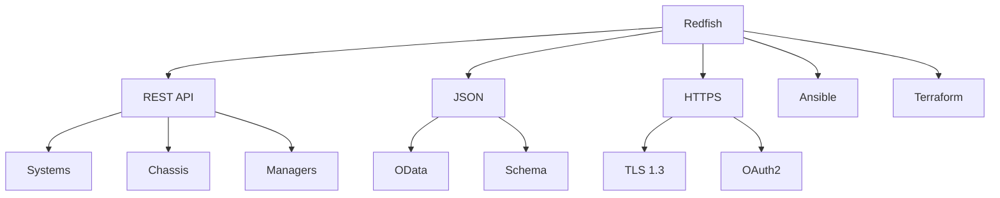

+++
title = "redfish"
date = "2026-03-14"
weight = 711
+++

# Redfish (RESTful API for Server Management)

#### 핵심 인사이트 (3줄 요약)
> 1. **본질**: DMTF 표준 RESTful API로, IPMI를 대체하여 JSON 기반 현대적 서버 관리 인터페이스 제공
> 2. **가치**: REST/JSON 표준, 웹 표준 기반, 스케일러블, OAuth2/TLS 보안, OData 쿼리
> 3. **융합**: BMC, IPMI, 웹 브라우저, CLI(curl), Ansible, Terraform, Kubernetes와 통합된 클라우드 네이티브 관리

---

### Ⅰ. 개요 (Context & Background)

**개념 정의**

Redfish는 DMTF(Distributed Management Task Force)에서 개발한 서버 관리 표준 API입니다. IPMI의 보안 문제와 확장성 한계를 극복하기 위해 RESTful API, JSON, HTTP/HTTPS, OData 기반으로 설계되었습니다.

```
┌─────────────────────────────────────────────────────────────────────┐
│                    Redfish vs IPMI 아키텍처 비교                      │
├─────────────────────────────────────────────────────────────────────┤
│                                                                     │
│   ┌──────────────────────────────────────────────────────────────┐ │
│   │                    IPMI (Legacy)                              │ │
│   │                                                              │ │
│   │   ┌────────────┐                                             │ │
│   │   │ Client     │  ipmitool CLI                              │ │
│   │   └────────────┘                                             │ │
│   │         │                                                     │ │
│   │         │ RMCP (UDP 623)                                     │ │
│   │         │ Binary Protocol                                    │ │
│   │         ▼                                                     │ │
│   │   ┌────────────┐                                             │ │
│   │   │    BMC     │  IPMI 1.5/2.0                              │ │
│   │   │ (Custom)   │  MD5/SHA1 인증                              │ │
│   │   └────────────┘                                             │ │
│   │                                                              │ │
│   │   문제점: 보안 취약, 확장 어려움, 텍스트 기반                  │ │
│   └──────────────────────────────────────────────────────────────┘ │
│                                                                     │
│   ┌──────────────────────────────────────────────────────────────┐ │
│   │                    Redfish (Modern)                          │ │
│   │                                                              │ │
│   │   ┌────────────┐ ┌────────────┐ ┌────────────┐              │ │
│   │   │ Web Browser│ │ curl/CLI   │ │ Ansible    │              │ │
│   │   └────────────┘ └────────────┘ └────────────┘              │ │
│   │         │               │               │                    │ │
│   │         │ HTTPS (443)   │ REST API      │ Playbook          │ │
│   │         │ JSON/OData    │               │                    │ │
│   │         ▼               ▼               ▼                    │ │
│   │   ┌─────────────────────────────────────────────────────┐    │ │
│   │   │                    BMC (Redfish Service)             │    │ │
│   │   │                                                     │    │ │
│   │   │   ┌─────────────────────────────────────────────┐   │    │ │
│   │   │   │            Redfish API Endpoints            │   │    │ │
│   │   │   │                                             │   │    │ │
│   │   │   │  /redfish/v1                               │   │    │ │
│   │   │   │  /redfish/v1/Systems                       │   │    │ │
│   │   │   │  /redfish/v1/Chassis                       │   │    │ │
│   │   │   │  /redfish/v1/Managers                      │   │    │ │
│   │   │   │  /redfish/v1/AccountService               │   │    │ │
│   │   │   │  ...                                        │   │    │ │
│   │   │   └─────────────────────────────────────────────┘   │    │ │
│   │   │                                                     │    │ │
│   │   └─────────────────────────────────────────────────────┘    │ │
│   │                                                              │ │
│   │   장점: RESTful, JSON, TLS 1.3, OAuth2, 확장 가능            │ │
│   └──────────────────────────────────────────────────────────────┘ │
│                                                                     │
└─────────────────────────────────────────────────────────────────────┘
```

> **해설**: IPMI는 바이너리 프로토콜로 보안이 취약하지만, Redfish는 REST/JSON으로 TLS 1.3, OAuth2를 지원합니다. 웹 브라우저, CLI, Ansible 등 다양한 클라이언트가 접근 가능합니다.

**💡 비유**: IPMI는 전용 단말기로 통화하는 것과 같고, Redfish는 스마트폰 앱으로 모든 것을 제어하는 것과 같습니다. 표준화된 웹 기술로 더 쉽고 안전합니다.

**등장 배경**

① **기존 한계**: IPMI 보안 취약(MD5/SHA1), 확장성 제한, 텍스트 파싱 복잡
② **혁신적 패러다임**: Redfish로 RESTful/JSON/HTTPS 기반 현대적 API
③ **비즈니스 요구**: 클라우드 네이티브 관리, DevOps 통합, 자동화

**📢 섹션 요약 비유**: Redfish는 스마트폰 앱으로 집을 제어하는 것 같아요. 웹브라우저, curl, Ansible 어디서든 접근할 수 있어요.

---

### Ⅱ. 아키텍처 및 핵심 원리 (Deep Dive)

**구성 요소 상세 분석**

| 요소명 | 역할 | 내부 동작 | 프로토콜/규격 | 비유 |
|:---|:---|:---|:---|:---|
| **Service Root** | API 진입점 | /redfish/v1 | Redfish 1.15 | 홈페이지 |
| **Systems** | 시스템 리소스 | CPU, 메모리, 스토리지 | Redfish Schema | 시스템 정보 |
| **Chassis** | 섀시 리소스 | 전원, 온도, 팬 | Redfish Schema | 섀시 정보 |
| **Managers** | 관리 컨트롤러 | BMC 정보 | Redfish Schema | BMC 정보 |
| **AccountService** | 사용자 관리 | 계정, 역할 | Redfish Schema | 사용자 |
| **EventService** | 이벤트 구독 | 알림, 로그 | Redfish Schema | 알림 |
| **TaskService** | 비동기 작업 | 장기 작업 | Redfish Schema | 작업 |

**Redfish API 계층 구조**

```
┌─────────────────────────────────────────────────────────────────────┐
│                    Redfish API 리소스 계층                           │
├─────────────────────────────────────────────────────────────────────┤
│                                                                     │
│   ┌──────────────────────────────────────────────────────────────┐ │
│   │                    /redfish/v1 (Service Root)                 │ │
│   │                                                              │ │
│   │   {                                                          │ │
│   │     "@odata.type": "#ServiceRoot.v1_15_0.ServiceRoot",       │ │
│   │     "Systems": { "@odata.id": "/redfish/v1/Systems" },       │ │
│   │     "Chassis": { "@odata.id": "/redfish/v1/Chassis" },       │ │
│   │     "Managers": { "@odata.id": "/redfish/v1/Managers" },     │ │
│   │     ...                                                      │ │
│   │   }                                                          │ │
│   │                                                              │ │
│   └──────────────────────────────────────────────────────────────┘ │
│                                                                     │
│   ┌──────────────────────────────────────────────────────────────┐ │
│   │                    /redfish/v1/Systems                        │ │
│   │                                                              │ │
│   │   {                                                          │ │
│   │     "Members": [                                             │ │
│   │       { "@odata.id": "/redfish/v1/Systems/1" }               │ │
│   │     ]                                                        │ │
│   │   }                                                          │ │
│   │                                                              │ │
│   │   /redfish/v1/Systems/1                                      │ │
│   │   {                                                          │ │
│   │     "PowerState": "On",                                      │ │
│   │     "ProcessorSummary": { "Count": 2, "Model": "Xeon" },     │ │
│   │     "MemorySummary": { "TotalSystemMemoryGB": 128 },         │ │
│   │     "Storage": { "@odata.id": "/redfish/v1/Systems/1/Storage" },│ │
│   │     "Actions": {                                             │ │
│   │       "#ComputerSystem.Reset": {                             │ │
│   │         "target": "/redfish/v1/Systems/1/Actions/Reset",     │ │
│   │         "ResetType@Redfish.AllowableValues": [               │ │
│   │           "On", "ForceOff", "GracefulShutdown", "Restart"    │ │
│   │         ]                                                    │ │
│   │       }                                                      │ │
│   │     }                                                        │ │
│   │   }                                                          │ │
│   │                                                              │ │
│   └──────────────────────────────────────────────────────────────┘ │
│                                                                     │
│   ┌──────────────────────────────────────────────────────────────┐ │
│   │                    /redfish/v1/Chassis/1/Thermal             │ │
│   │                                                              │ │
│   │   {                                                          │ │
│   │     "Temperatures": [                                        │ │
│   │       {                                                      │ │
│   │         "Name": "CPU1 Temp",                                 │ │
│   │         "ReadingCelsius": 45,                                │ │
│   │         "UpperThresholdCritical": 95                         │ │
│   │       }                                                      │ │
│   │     ],                                                       │ │
│   │     "Fans": [                                                │ │
│   │       {                                                      │ │
│   │         "Name": "Fan 1",                                     │ │
│   │         "Reading": 5000,                                     │ │
│   │         "ReadingUnits": "RPM"                                │ │
│   │       }                                                      │ │
│   │     ]                                                        │ │
│   │   }                                                          │ │
│   │                                                              │ │
│   └──────────────────────────────────────────────────────────────┘ │
│                                                                     │
└─────────────────────────────────────────────────────────────────────┘
```

> **해설**: Redfish는 Service Root에서 시작하여 Systems, Chassis, Managers 등의 리소스로 이동합니다. 각 리소스는 @odata.id로 링크되며, Actions로 작업을 수행합니다.

**핵심 알고리즘: Redfish API 사용 예시**

```bash
# Redfish API 호출 예시 (curl)

# 1. Service Root 조회
curl -k -u admin:password \
  https://192.168.1.100/redfish/v1

# 2. 시스템 정보 조회
curl -k -u admin:password \
  https://192.168.1.100/redfish/v1/Systems/1

# 3. 전원 상태 변경 (켜기)
curl -k -u admin:password \
  -X POST \
  -H "Content-Type: application/json" \
  -d '{"ResetType": "On"}' \
  https://192.168.1.100/redfish/v1/Systems/1/Actions/ComputerSystem.Reset

# 4. 전원 상태 변경 (끄기)
curl -k -u admin:password \
  -X POST \
  -H "Content-Type: application/json" \
  -d '{"ResetType": "ForceOff"}' \
  https://192.168.1.100/redfish/v1/Systems/1/Actions/ComputerSystem.Reset

# 5. 온도 센서 조회
curl -k -u admin:password \
  https://192.168.1.100/redfish/v1/Chassis/1/Thermal

# 6. 이벤트 구독
curl -k -u admin:password \
  -X POST \
  -H "Content-Type: application/json" \
  -d '{
    "Destination": "https://monitor.example.com/events",
    "EventTypes": ["Alert", "StatusChange"]
  }' \
  https://192.168.1.100/redfish/v1/EventService/Subscriptions
```

```python
# Python Redfish 라이브러리 예시
import redfish

# 연결
redfish_obj = redfish.redfish_client(
    base_url="https://192.168.1.100",
    username="admin",
    password="password"
)
redfish_obj.login(auth="session")

# 시스템 정보 조회
response = redfish_obj.get("/redfish/v1/Systems/1")
system = response.dict

print(f"Power State: {system['PowerState']}")
print(f"Processor Count: {system['ProcessorSummary']['Count']}")
print(f"Memory: {system['MemorySummary']['TotalSystemMemoryGB']} GB")

# 전원 켜기
redfish_obj.post(
    "/redfish/v1/Systems/1/Actions/ComputerSystem.Reset",
    body={"ResetType": "On"}
)

# 온도 센서 조회
thermal = redfish_obj.get("/redfish/v1/Chassis/1/Thermal").dict
for temp in thermal["Temperatures"]:
    print(f"{temp['Name']}: {temp['ReadingCelsius']}°C")

# 로그아웃
redfish_obj.logout()
```

```yaml
# Ansible Redfish 모듈 예시
- name: Get System Info
  community.general.redfish_info:
    category: Systems
    command: GetSystemInventory
    baseuri: 192.168.1.100
    username: admin
    password: password
  register: result

- name: Power On Server
  community.general.redfish_command:
    category: Systems
    command: PowerOn
    baseuri: 192.168.1.100
    username: admin
    password: password

- name: Set Boot Override to PXE
  community.general.redfish_config:
    category: Systems
    command: SetBiosDefaultSettings
    baseuri: 192.168.1.100
    username: admin
    password: password
    bootdevice: pxe
```

**📢 섹션 요약 비유**: Redfish API는 스마트홈 앱과 같습니다. curl로 명령을 보내거나, Python으로 자동화하거나, Ansible로 일괄 처리할 수 있습니다.

---

### Ⅲ. 융합 비교 및 다각도 분석 (Comparison & Synergy)

**기술 비교: Redfish vs IPMI vs WMI**

| 비교 항목 | Redfish | IPMI | WMI |
|:---|:---:|:---:|:---:|
| **프로토콜** | HTTPS/REST | RMCP/UDP | DCOM/RPC |
| **데이터** | JSON | Binary | WQL |
| **포트** | 443 | 623 | 135 |
| **보안** | TLS 1.3, OAuth2 | MD5/SHA1 | Kerberos |
| **표준** | DMTF | DMTF | Microsoft |
| **플랫폼** | 모든 서버 | 모든 서버 | Windows |
| **확장성** | 높음 | 낮음 | 중간 |

**과목 융합 관점: Redfish와 타 영역 시너지**

| 융합 영역 | 시너지 효과 | 구현 예시 |
|:---|:---|:---|
| **OS (운영체제)** | OS 독립 관리 | Linux/Windows/ESXi |
| **네트워크** | REST API 통합 | HTTPS, Proxy |
| **보안** | TLS, OAuth2 | Zero Trust |
| **가상화** | VM 호스트 관리 | vSphere, Proxmox |
| **클라우드** | 베어메탈 IaC | Terraform, Ansible |

**📢 섹션 요약 비유**: Redfish는 IPMI의 스마트폰 버전과 같습니다. 웹 표준으로 더 안전하고, 더 쉽고, 더 확장 가능합니다.

---

### Ⅳ. 실무 적용 및 기술사적 판단 (Strategy & Decision)

**실무 시나리오별 적용**

**시나리오 1: Terraform 베어메탈 프로비저닝**
- **문제**: 베어메탈 서버 자동화
- **해결**: Redfish Terraform Provider
- **의사결정**: IaC(Infrastructure as Code)

**시나리오 2: 대규모 서버 관리**
- **문제**: 1000대 서버 일괄 전원 제어
- **해결**: Ansible + Redfish 병렬 실행
- **의사결정**: 자동화 파이프라인

**시나리오 3: 모니터링 통합**
- **문제**: 센서 데이터 Prometheus 연동
- **해결**: Redfish Exporter
- **의사결정**: Grafana 대시보드

**도입 체크리스트**

| 구분 | 항목 | 확인 포인트 |
|:---|:---|:---|
| **기술적** | Redfish 버전 | 1.8+ 권장 |
| | TLS | 1.2+ 필수 |
| | OAuth2 | 서비스 계정 |
| **운영적** | 접근 제어 | RBAC |
| | API 문서 | Swagger/OpenAPI |
| | 모니터링 | Exporter |

**안티패턴: Redfish 오용 사례**

| 안티패턴 | 문제점 | 올바른 접근 |
|:---|:---|:---|
| **Basic Auth만 사용** | 보안 취약 | OAuth2 + 2FA |
| **동기 호출 과다** | 타임아웃 | 비동기(Task) |
| **폴링 과다** | 부하 증가 | Event Subscription |
| **SSL 검증 생략** | MITM 공격 | CA 인증서 |

**📢 섹션 요약 비유**: Redfish 도입은 전화(IPMI)에서 앱(Redfish)으로 전환하는 것과 같습니다. 더 안전하고, 더 편리하고, 더 확장 가능합니다.

---

### Ⅴ. 기대효과 및 결론 (Future & Standard)

**정량/정성 기대효과**

| 구분 | IPMI | Redfish | 개선효과 |
|:---|:---:|:---:|:---:|
| **보안** | MD5/SHA1 | TLS 1.3 | 강화 |
| **자동화** | CLI | REST API | 용이 |
| **확장성** | 제한 | 높음 | 개선 |
| **통합** | 어려움 | 용이 | 개선 |

**미래 전망**

1. **Redfish 1.16+:** 더 많은 리소스 유형
2. **AI 기반 관리:** AI 에이전트 연동
3. **Kubernetes 통합:** CRD 기반 관리
4. **Edge 컴퓨팅:** 엣지 서버 관리

**참고 표준**

| 표준 | 내용 | 적용 |
|:---|:---|:---|
| **Redfish 1.15** | 현재 표준 | 2023년 |
| **DMTF DSP0266** | Redfish Schema | 데이터 모델 |
| **OData 4.0** | 쿼리 언어 | $filter, $select |
| **OpenAPI** | API 문서 | Swagger |

**📢 섹션 요약 비유**: Redfish의 미래는 스마트홈에서 AI 홈으로 발전하는 것과 같습니다. AI가 관리하고, Kubernetes가 통합됩니다.

---

### 📌 관련 개념 맵 (Knowledge Graph)



**연관 개념 링크**:
- IPMI - IPMI 프로토콜
- BMC - 베이스보드 관리 컨트롤러
- OOB Management - 대역 외 관리
- KVM over IP - 원격 콘솔

---

### 👶 어린이를 위한 3줄 비유 설명

1. **스마트홈 앱**: Redfish는 스마트홈 앱 같아요! 스마트폰으로 조명, 온도, TV를 제어하듯이 서버를 관리해요.

2. **웹 표준**: 인터넷 뱅킹처럼 안전한 웹(HTTPS)으로 접속해요. JSON이라는 쉬운 형식으로 데이터를 주고받아요.

3. **자동화 가능**: Redfish는 로봇에게 명령하기 쉬워요. 자동으로 수천 대 서버의 전원을 켜고 끌 수 있어요!