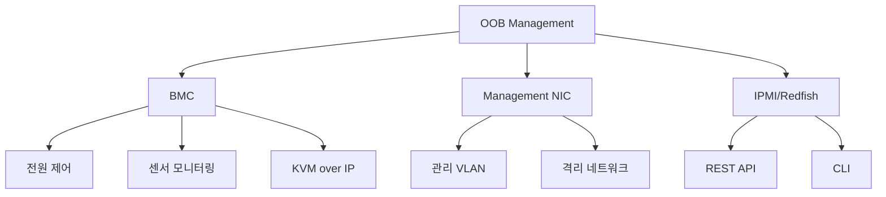

+++
title = "oob management"
date = "2026-03-14"
weight = 712
+++

# OOB Management (Out-of-Band Management)

#### 핵심 인사이트 (3줄 요약)
> 1. **본질**: 운영체제와 독립적인 전용 관리 채널로, 서버 전원, 센서, 콘솔, 미디어를 원격 제어하는 관리 아키텍처
> 2. **가치**: OS 장애 시에도 원격 복구, 무인 데이터센터, 자산 관리, 예지 보전, 운영 비용 절감
> 3. **융합**: BMC, IPMI, Redfish, KVM over IP, 가상 미디어, 관리 VLAN과 통합된 서버 관리 인프라

---

### Ⅰ. 개요 (Context & Background)

**개념 정의**

OOB Management (Out-of-Band Management)는 주 운영 체제(OS)와 네트워크 경로와 독립적인 전용 관리 채널을 통해 서버를 원격 관리하는 아키텍처입니다. BMC, IPMI, Redfish, 전용 관리 포트로 구성됩니다.

```
┌─────────────────────────────────────────────────────────────────────┐
│                    In-Band vs Out-of-Band 관리 비교                  │
├─────────────────────────────────────────────────────────────────────┤
│                                                                     │
│   ┌──────────────────────────────────────────────────────────────┐ │
│   │                    In-Band Management                         │ │
│   │                    (OS 의존적 관리)                            │ │
│   │                                                              │ │
│   │   ┌────────────┐                                             │ │
│   │   │ 관리 콘솔  │  SSH, RDP, WMI                             │ │
│   │   └────────────┘                                             │ │
│   │         │                                                     │ │
│   │         │ Production Network (공용 네트워크)                  │ │
│   │         │                                                     │ │
│   │         ▼                                                     │ │
│   │   ┌─────────────────────────────────────────────────────┐    │ │
│   │   │                    Server                           │    │ │
│   │   │   ┌─────────────────────────────────────────────┐   │    │ │
│   │   │   │           Operating System                  │   │    │ │
│   │   │   │   (반드시 실행 중이어야 함)                  │   │    │ │
│   │   │   └─────────────────────────────────────────────┘   │    │ │
│   │   └─────────────────────────────────────────────────────┘    │ │
│   │                                                              │ │
│   │   문제점: OS 장애 시 관리 불가, 보안 위험, 운영 중단          │ │
│   └──────────────────────────────────────────────────────────────┘ │
│                                                                     │
│   ┌──────────────────────────────────────────────────────────────┐ │
│   │                    Out-of-Band Management                     │ │
│   │                    (OS 독립적 관리)                            │ │
│   │                                                              │ │
│   │   ┌────────────┐                                             │ │
│   │   │ 관리 콘솔  │  IPMI, Redfish, Web UI                     │ │
│   │   └────────────┘                                             │ │
│   │         │                                                     │ │
│   │         │ Management Network (전용 네트워크)                  │ │
│   │         │ 격리된 VLAN/Subnet                                  │ │
│   │         │                                                     │ │
│   │         ▼                                                     │ │
│   │   ┌─────────────────────────────────────────────────────┐    │ │
│   │   │                    Server                           │    │ │
│   │   │   ┌─────────────────────────────────────────────┐   │    │ │
│   │   │   │              BMC (독립 전원)                │   │    │ │
│   │   │   │   - IPMI/Redfish Service                    │   │    │ │
│   │   │   │   - Sensors, Power Control                  │   │    │ │
│   │   │   │   - KVM over IP                            │   │    │ │
│   │   │   └─────────────────────────────────────────────┘   │    │ │
│   │   │         │                                             │    │ │
│   │   │         │ 제어선 (GPIO, LPC, I2C)                    │    │ │
│   │   │         ▼                                             │    │ │
│   │   │   ┌─────────────────────────────────────────────┐   │    │ │
│   │   │   │           OS (실행 중/중지 상관없음)         │   │    │ │
│   │   │   └─────────────────────────────────────────────┘   │    │ │
│   │   └─────────────────────────────────────────────────────┘    │ │
│   │                                                              │ │
│   │   장점: OS 독립, 원격 복구, 보안 격리, 무인 운영              │ │
│   └──────────────────────────────────────────────────────────────┘ │
│                                                                     │
└─────────────────────────────────────────────────────────────────────┘
```

> **해설**: In-Band은 OS를 통해 관리하므로 OS 장애 시 무력하지만, OOB는 BMC를 통해 OS와 독립적으로 관리합니다. 전용 관리 네트워크로 보안 격리도 가능합니다.

**💡 비유**: In-Band은 집 안에서 전등 스위치를 누르는 것, OOB는 집 밖에서 스마트홈 앱으로 제어하는 것과 같습니다. 집에 불이 나도(서버 장애) 앱으로는 제어할 수 있습니다.

**등장 배경**

① **기존 한계**: In-Band 관리는 OS 장애 시 무력 → 현장 방문 필요
② **혁신적 패러다임**: OOB로 OS 독립적 원격 관리
③ **비즈니스 요구**: 무인 데이터센터, 원격 복구, 운영 비용 절감

**📢 섹션 요약 비유**: OOB 관리는 집 밖에서 스마트홈 앱으로 제어하는 것 같아요. 집에 불이 나도(서버 장애) 앱으로 문을 열고 불을 끌 수 있어요.

---

### Ⅱ. 아키텍처 및 핵심 원리 (Deep Dive)

**구성 요소 상세 분석**

| 요소명 | 역할 | 내부 동작 | 프로토콜/규격 | 비유 |
|:---|:---|:---|:---|:---|
| **BMC** | 관리 컨트롤러 | IPMI/Redfish 실행 | IPMI 2.0 | 관리실 |
| **Management NIC** | 전용 네트워크 | OOB 트래픽 | 1GbE | 전용 회선 |
| **IPMI/Redfish** | 관리 프로토콜 | 명령 전달 | UDP 623/HTTPS 443 | 전화/앱 |
| **KVM over IP** | 원격 콘솔 | 비디오/키보드 | HTML5/VNC | CCTV |
| **가상 미디어** | 원격 미디어 | ISO/플래시 드라이브 | USB 2.0 | 원격 USB |
| **관리 VLAN** | 네트워크 격리 | 보안 영역 | IEEE 802.1Q | 보안 구역 |
| **Console Redirection** | 직렬 콘솔 | SOL(Serial Over LAN) | UART | 인터폰 |

**OOB 관리 네트워크 아키텍처**

```
┌─────────────────────────────────────────────────────────────────────┐
│                    OOB 관리 네트워크 아키텍처                         │
├─────────────────────────────────────────────────────────────────────┤
│                                                                     │
│   ┌──────────────────────────────────────────────────────────────┐ │
│   │                    Management Network                         │ │
│   │                    (전용 VLAN/Subnet)                         │ │
│   │                                                              │ │
│   │   ┌────────────────────────────────────────────────────┐     │ │
│   │   │              Management Switch                      │     │ │
│   │   │   VLAN 100: Management (10.0.100.0/24)             │     │ │
│   │   │   VLAN 200: Production (10.0.200.0/24)             │     │ │
│   │   └────────────────────────────────────────────────────┘     │ │
│   │             │              │              │                   │ │
│   │             │              │              │                   │ │
│   │   ┌─────────┴────┐ ┌──────┴──────┐ ┌─────┴─────┐             │ │
│   │   │   Server 1    │ │   Server 2  │ │  Server 3 │             │ │
│   │   │              │ │             │ │           │             │ │
│   │   │ ┌──────────┐ │ │ ┌─────────┐ │ │ ┌───────┐ │             │ │
│   │   │ │   BMC    │ │ │ │   BMC   │ │ │ │  BMC  │ │             │ │
│   │   │ │10.0.100.1│ │ │ │10.0.100.2│ │ │ │10.0.100.3│            │ │
│   │   │ └──────────┘ │ │ └─────────┘ │ │ └───────┘ │             │ │
│   │   │              │ │             │ │           │             │ │
│   │   │ ┌──────────┐ │ │ ┌─────────┐ │ │ ┌───────┐ │             │ │
│   │   │ │  Main OS │ │ │ │ Main OS │ │ │ │Main OS│ │             │ │
│   │   │ │10.0.200.1│ │ │ │10.0.200.2│ │ │ │10.0.200.3│            │ │
│   │   │ └──────────┘ │ │ └─────────┘ │ │ └───────┘ │             │ │
│   │   └──────────────┘ └─────────────┘ └───────────┘             │ │
│   │                                                              │ │
│   └──────────────────────────────────────────────────────────────┘ │
│                                │                                    │
│                                │                                    │
│   ┌────────────────────────────┼──────────────────────────────────┐ │
│   │                            │                                  │ │
│   │   ┌────────────────────────┴─────────────────────────────┐   │ │
│   │   │                 Management Console                    │   │ │
│   │   │                                                       │   │ │
│   │   │   ┌───────────┐ ┌───────────┐ ┌───────────┐          │   │ │
│   │   │   │ Web UI    │ │ Ansible   │ │ Terraform │          │   │ │
│   │   │   │ (Redfish) │ │ Playbooks │ │  IaC      │          │   │ │
│   │   │   └───────────┘ └───────────┘ └───────────┘          │   │ │
│   │   │                                                       │   │ │
│   │   └───────────────────────────────────────────────────────┘   │ │
│   │                                                              │ │
│   │                    관리자 워크스테이션                        │ │
│   └──────────────────────────────────────────────────────────────┘ │
│                                                                     │
└─────────────────────────────────────────────────────────────────────┘
```

> **해설**: OOB 관리는 전용 VLAN/Subnet으로 격리됩니다. BMC는 관리 네트워크(10.0.100.x), 메인 OS는 운영 네트워크(10.0.200.x)를 사용합니다. 관리 콘솔은 Web UI, Ansible, Terraform 등으로 접근합니다.

**핵심 알고리즘: OOB 관리 워크플로우**

```python
# OOB 관리 워크플로우 (의사코드)
class OOBManager:
    def __init__(self, bmc_ip, username, password):
        self.bmc = RedfishClient(bmc_ip, username, password)

    # 1. 전원 관리
    def power_on(self):
        """서버 전원 켜기"""
        response = self.bmc.post(
            "/redfish/v1/Systems/1/Actions/ComputerSystem.Reset",
            {"ResetType": "On"}
        )
        return response.status == 200

    def power_off(self, force=False):
        """서버 전원 끄기"""
        reset_type = "ForceOff" if force else "GracefulShutdown"
        response = self.bmc.post(
            "/redfish/v1/Systems/1/Actions/ComputerSystem.Reset",
            {"ResetType": reset_type}
        )
        return response.status == 200

    # 2. 상태 모니터링
    def get_health(self):
        """서버 상태 조회"""
        system = self.bmc.get("/redfish/v1/Systems/1").json()
        thermal = self.bmc.get("/redfish/v1/Chassis/1/Thermal").json()

        return {
            "power_state": system["PowerState"],
            "health": system["Status"]["Health"],
            "temperatures": [
                {"name": t["Name"], "value": t["ReadingCelsius"]}
                for t in thermal["Temperatures"]
            ],
            "fans": [
                {"name": f["Name"], "rpm": f["Reading"]}
                for f in thermal["Fans"]
            ]
        }

    # 3. 원격 콘솔 (KVM over IP)
    def start_kvm(self):
        """KVM 세션 시작"""
        kvm = self.bmc.get("/redfish/v1/Managers/1/VirtualMedia").json()
        # WebSocket/VNC URL 반환
        return kvm["KVMURL"]

    # 4. 가상 미디어 마운트
    def mount_iso(self, iso_url):
        """ISO 이미지 마운트"""
        response = self.bmc.post(
            "/redfish/v1/Managers/1/VirtualMedia/CD1/Actions/VirtualMedia.InsertMedia",
            {"Image": iso_url}
        )
        return response.status == 200

    # 5. 부팅 순서 변경
    def set_boot_pxe(self):
        """PXE 부팅 설정"""
        response = self.bmc.patch(
            "/redfish/v1/Systems/1",
            {
                "Boot": {
                    "BootSourceOverrideEnabled": "Once",
                    "BootSourceOverrideTarget": "Pxe"
                }
            }
        )
        return response.status == 200

    # 6. OS 재설치 자동화
    def reinstall_os(self, iso_url):
        """OS 재설치 자동화"""
        # 1. ISO 마운트
        if not self.mount_iso(iso_url):
            return False

        # 2. PXE/CD 부팅 설정
        if not self.set_boot_pxe():
            return False

        # 3. 서버 재시작
        if not self.power_off(force=True):
            return False

        time.sleep(5)

        if not self.power_on():
            return False

        return True

    # 7. 이벤트 구독
    def subscribe_events(self, callback_url):
        """이벤트 알림 구독"""
        response = self.bmc.post(
            "/redfish/v1/EventService/Subscriptions",
            {
                "Destination": callback_url,
                "EventTypes": ["Alert", "StatusChange", "ResourceAdded"]
            }
        )
        return response.status == 201

# 사용 예시
if __name__ == "__main__":
    manager = OOBManager("10.0.100.1", "admin", "password")

    # 상태 확인
    health = manager.get_health()
    print(f"Power: {health['power_state']}")
    print(f"Health: {health['health']}")

    # 온도 확인
    for temp in health['temperatures']:
        print(f"{temp['name']}: {temp['value']}°C")

    # OS 재설치
    manager.reinstall_os("https://server/ubuntu-22.04.iso")
```

**📢 섹션 요약 비유**: OOB 관리 워크플로우는 스마트홈 시스템과 같습니다. 전원, 상태, 콘솔, 미디어, 부팅을 자동화할 수 있습니다.

---

### Ⅲ. 융합 비교 및 다각도 분석 (Comparison & Synergy)

**기술 비교: In-Band vs Out-of-Band**

| 비교 항목 | In-Band | Out-of-Band |
|:---|:---:|:---:|
| **OS 의존성** | 필수 | 불필요 |
| **장애 복구** | 불가능 | 가능 |
| **네트워크** | 공용 | 전용 |
| **보안** | 낮음 | 높음 (격리) |
| **비용** | 낮음 | 높음 (BMC) |
| **기능** | 제한 | 풍부 |
| **자동화** | 제한 | 용이 |

**과목 융합 관점: OOB와 타 영역 시너지**

| 융합 영역 | 시너지 효과 | 구현 예시 |
|:---|:---|:---|
| **OS (운영체제)** | OS 독립 관리 | Linux/Windows/ESXi |
| **네트워크** | 관리 VLAN | 보안 격리 |
| **보안** | Zero Trust | 접근 제어 |
| **가상화** | VM 호스트 관리 | vSphere, Proxmox |
| **클라우드** | 베어메탈 IaC | Terraform, Ansible |

**📢 섹션 요약 비유**: In-Band은 집 안에서 제어, OOB는 스마트폰 앱으로 원격 제어와 같습니다. 집에 불이 나도 앱으로 제어할 수 있습니다.

---

### Ⅳ. 실무 적용 및 기술사적 판단 (Strategy & Decision)

**실무 시나리오별 적용**

**시나리오 1: 무인 데이터센터**
- **문제**: 원격 데이터센터, 현장 접근 불가
- **해결**: OOB로 원격 관리
- **의사결정**: 전용 관리 네트워크 구축

**시나리오 2: OS 장애 복구**
- **문제**: OS 부팅 불가, SSH 접속 불가
- **해결**: OOB KVM으로 콘솔 접속, 복구
- **의사결정**: 커널 패닉 원인 파악

**시나리오 3: 대규모 배포**
- **문제**: 100대 서버 OS 설치
- **해결**: OOB 가상 미디어 + PXE
- **의사결정**: Ansible 자동화

**도입 체크리스트**

| 구분 | 항목 | 확인 포인트 |
|:---|:---|:---|
| **기술적** | BMC | IPMI/Redfish 지원 |
| | 관리 NIC | 전용 포트 |
| | 네트워크 | 격리된 VLAN |
| **운영적** | 보안 | RBAC, 2FA |
| | 모니터링 | 이벤트 구독 |
| | 백업 | BMC 설정 백업 |

**안티패턴: OOB 오용 사례**

| 안티패턴 | 문제점 | 올바른 접근 |
|:---|:---|:---|
| **공용 네트워크** | 보안 위험 | 전용 VLAN |
| **기본 패스워드** | 무단 접근 | 강력한 패스워드 |
| **OOB만 사용** | 기능 제한 | In-Band 병행 |
| **로그 미확인** | 장애 예방 실패 | 정기 확인 |

**📢 섹션 요약 비유**: OOB 도입은 스마트홈 시스템 설치와 같습니다. 전용 회선(관리 VLAN), 강력한 보안, 정기 점검이 필요합니다.

---

### Ⅴ. 기대효과 및 결론 (Future & Standard)

**정량/정성 기대효과**

| 구분 | In-Band | Out-of-Band | 개선효과 |
|:---|:---:|:---:|:---:|
| **장애 복구** | 현장 방문 | 원격 (분) | 60배 |
| **운영 비용** | 높음 | 낮음 | 50% 절감 |
| **보안** | 낮음 | 높음 | 격리 |
| **자동화** | 제한 | 용이 | 개선 |

**미래 전망**

1. **AI 기반 관리:** 예지 보전, 이상 탐지
2. **Zero Trust:** 강화된 보안
3. **클라우드 통합:** 하이브리드 관리
4. **Edge 확장:** 엣지 서버 OOB

**참고 표준**

| 표준 | 내용 | 적용 |
|:---|:---|:---|
| **IPMI 2.0** | OOB 기본 | BMC |
| **Redfish 1.15** | RESTful OOB | API |
| **DCMI 1.5** | 데이터센터 OOB | 확장 |
| **IEEE 802.1Q** | VLAN 격리 | 네트워크 |

**📢 섹션 요약 비유**: OOB의 미래는 스마트홈에서 AI 홈으로 발전하는 것과 같습니다. AI가 장애를 예측하고 자동으로 복구합니다.

---

### 📌 관련 개념 맵 (Knowledge Graph)



**연관 개념 링크**:
- IPMI - IPMI 프로토콜
- BMC - 베이스보드 관리 컨트롤러
- Redfish - RESTful 관리 API
- KVM over IP - 원격 콘솔

---

### 👶 어린이를 위한 3줄 비유 설명

1. **스마트폰 앱**: OOB는 스마트홈 앱 같아요! 컴퓨터가 꺼져도 앱으로 전원을 켤 수 있어요.

2. **전용 회선**: OOB는 전용 전화선 같아요. 다른 전화가 꺼져도 OOB 전화는 연결돼요.

3. **원격 수리**: OOB가 있으면 멀리서도 컴퓨터를 고칠 수 있어요. 기사님이 오지 않아도 돼요!