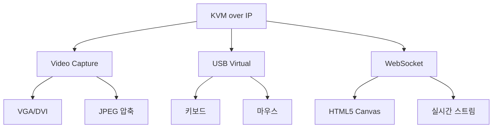

+++
title = "kvm over ip"
date = "2026-03-14"
weight = 713
+++

# KVM over IP (Keyboard Video Mouse over IP)

#### 핵심 인사이트 (3줄 요약)
> 1. **본질**: 서버의 비디오 출력을 네트워크로 전송하고, 원격 키보드/마우스 입력을 전달하여 로컬 콘솔처럼 제어하는 OOB 원격 액세스 기술
> 2. **가치**: OS 독립적 콘솔 액세스, BIOS/UEFI 설정, 장애 복구, 설치/디버깅, 물리적 접근 불필요
> 3. **융합**: BMC, 비디오 캡처, USB HID, HTML5/WebSocket, VNC, RDP와 통합된 원격 관리 인프라

---

### Ⅰ. 개요 (Context & Background)

**개념 정의**

KVM over IP (Keyboard Video Mouse over IP)는 서버의 비디오(VGA/DVI/HDMI) 출력을 네트워크로 전송하고, 원격 클라이언트의 키보드/마우스 입력을 서버로 전달하는 기술입니다. BMC에 내장된 비디오 컨트롤러와 USB 가상화 기능을 사용합니다.

```
┌─────────────────────────────────────────────────────────────────────┐
│                    KVM over IP 아키텍처                              │
├─────────────────────────────────────────────────────────────────────┤
│                                                                     │
│   원격 관리자 워크스테이션                                           │
│   ┌──────────────────────────────────────────────────────────────┐ │
│   │                                                              │ │
│   │   ┌─────────────────────────────────────────────────────┐    │ │
│   │   │              Web Browser / KVM Client               │    │ │
│   │   │                                                     │    │ │
│   │   │   ┌─────────────┐  ┌─────────────┐                 │    │ │
│   │   │   │  화면 표시   │  │ 키보드/마우스 │                 │    │ │
│   │   │   │  (HTML5/    │  │  입력       │                 │    │ │
│   │   │   │   Canvas)   │  │             │                 │    │ │
│   │   │   └─────────────┘  └─────────────┘                 │    │ │
│   │   │                                                     │    │ │
│   │   └─────────────────────────────────────────────────────┘    │ │
│   │                              │                               │ │
│   │                              │ HTTPS/WebSocket              │ │
│   │                              │ (암호화된 원격 세션)          │ │
│   │                              │                               │ │
│   └──────────────────────────────┼──────────────────────────────┘ │
│                                  │                                  │
│                                  │ IP 네트워크                      │
│                                  │                                  │
│                                  ▼                                  │
│   ┌──────────────────────────────────────────────────────────────┐ │
│   │                    Server (BMC)                               │ │
│   │                                                              │ │
│   │   ┌─────────────────────────────────────────────────────┐    │ │
│   │   │                    BMC SoC                           │    │ │
│   │   │                                                     │    │ │
│   │   │   ┌─────────────┐  ┌─────────────┐                 │    │ │
│   │   │   │   Video     │  │   USB       │                 │    │ │
│   │   │   │  Capture    │  │  Virtual    │                 │    │ │
│   │   │   │  (Aspeed)   │  │  Host       │                 │    │ │
│   │   │   └─────────────┘  └─────────────┘                 │    │ │
│   │   │         │                  │                        │    │ │
│   │   │         │                  │                        │    │ │
│   │   └─────────┼──────────────────┼────────────────────────┘    │ │
│   │             │                  │                             │ │
│   │             │                  │                             │ │
│   │   ┌─────────┴────────┐  ┌──────┴──────────┐                 │ │
│   │   │   비디오 입력     │  │   USB 입력      │                 │ │
│   │   │   (VGA/DVI)      │  │   (Keyboard/Mouse)│                │ │
│   │   └──────────────────┘  └─────────────────┘                 │ │
│   │             │                  │                             │ │
│   │             │                  │                             │ │
│   │   ┌─────────┴──────────────────┴──────────────────────────┐ │ │
│   │   │                    Main System                         │ │ │
│   │   │   ┌─────────────────────────────────────────────┐     │ │ │
│   │   │   │              BIOS/UEFI/OS                   │     │ │ │
│   │   │   │   (POST 화면, 콘솔, GUI)                    │     │ │ │
│   │   │   └─────────────────────────────────────────────┘     │ │ │
│   │   └───────────────────────────────────────────────────────┘ │ │
│   │                                                              │ │
│   └──────────────────────────────────────────────────────────────┘ │
│                                                                     │
└─────────────────────────────────────────────────────────────────────┘
```

> **해설**: BMC의 Video Capture가 서버 비디오 출력을 캡처하고, USB Virtual Host가 키보드/마우스 입력을 전달합니다. 원격 클라이언트는 웹 브라우저로 접속합니다.

**💡 비유**: KVM over IP는 원격으로 컴퓨터 화면을 보면서 키보드와 마우스를 조작하는 것과 같습니다. 집에서 회사 컴퓨터의 BIOS 설정까지 할 수 있습니다.

**등장 배경**

① **기존 한계**: 원격 SSH/RDP는 OS 실행 시에만 가능 → BIOS, 장애 복구 불가
② **혁신적 패러다임**: KVM over IP로 OS 독립적 콘솔 액세스
③ **비즈니스 요구**: 무인 데이터센터, 원격 장애 복구, 설치 자동화

**📢 섹션 요약 비유**: KVM over IP는 원격으로 컴퓨터 화면을 보면서 직접 조작하는 것 같아요. BIOS 설정, OS 설치, 장애 복구까지 가능해요.

---

### Ⅱ. 아키텍처 및 핵심 원리 (Deep Dive)

**구성 요소 상세 분석**

| 요소명 | 역할 | 내부 동작 | 프로토콜/규격 | 비유 |
|:---|:---|:---|:---|:---|
| **Video Capture** | 화면 캡처 | VGA/DVI 디지털화 | BMC ASIC | 카메라 |
| **Frame Buffer** | 프레임 저장 | 캡처된 이미지 버퍼 | DRAM | 사진 앨범 |
| **JPEG Encoder** | 압축 | JPEG/H.264 인코딩 | HW 가속 | 압축 |
| **USB Virtual** | 입력 전달 | USB HID 에뮬레이션 | USB 2.0 | 가상 키보드 |
| **WebSocket** | 실시간 전송 | 양방향 통신 | RFC 6455 | 실시간 스트림 |
| **HTML5 Canvas** | 화면 렌더링 | 브라우저 표시 | HTML5 | 화면 |

**KVM over IP 데이터 흐름**

```
┌─────────────────────────────────────────────────────────────────────┐
│                    KVM over IP 데이터 흐름                           │
├─────────────────────────────────────────────────────────────────────┤
│                                                                     │
│   서버 (Main System)                                                │
│   ┌──────────────────────────────────────────────────────────────┐ │
│   │                                                              │ │
│   │   BIOS/UEFI → VGA 출력 → "Press F2 for Setup"              │ │
│   │                                                              │ │
│   └──────────────────────────────────────────────────────────────┘ │
│                         │                                          │
│                         │ VGA 신호 (아날로그/디지털)                │
│                         ▼                                          │
│   ┌──────────────────────────────────────────────────────────────┐ │
│   │                    BMC Video Capture                         │ │
│   │                                                              │ │
│   │   1. VGA 신호 캡처 (Aspeed AST2500/AST2600)                  │ │
│   │      - 해상도: 1024x768, 60Hz                               │ │
│   │      - 색상: 24-bit                                         │ │
│   │                                                              │ │
│   │   2. 프레임 버퍼에 저장                                      │ │
│   │      - 변경된 영역만 캡처 (Delta)                            │ │
│   │      - 이전 프레임과 비교                                    │ │
│   │                                                              │ │
│   │   3. JPEG/H.264 압축                                        │ │
│   │      - 품질: 80% (조정 가능)                                 │ │
│   │      - 크기: ~50KB/frame                                    │ │
│   │                                                              │ │
│   │   4. WebSocket으로 전송                                      │ │
│   │      - wss://bmc/kvm/stream                                 │ │
│   │      - 30fps                                                │ │
│   │                                                              │ │
│   └──────────────────────────────────────────────────────────────┘ │
│                         │                                          │
│                         │ WebSocket (TLS 암호화)                   │
│                         ▼                                          │
│   ┌──────────────────────────────────────────────────────────────┐ │
│   │                    원격 클라이언트                            │ │
│   │                                                              │ │
│   │   1. WebSocket 수신                                          │ │
│   │   2. JPEG 디코딩                                            │ │
│   │   3. HTML5 Canvas에 렌더링                                   │ │
│   │   4. 사용자에게 화면 표시                                    │ │
│   │                                                              │ │
│   │   ┌─────────────────────────────────────────────────────┐    │ │
│   │   │  ┌────────────────────────────────────────────────┐ │    │ │
│   │   │  │  Press F2 for Setup,  DEL to enter BIOS      │ │    │ │
│   │   │  │  ─────────────────────────────────────────────│ │    │ │
│   │   │  │  CPU: Intel Xeon E5-2690 v4                   │ │    │ │
│   │   │  │  Memory: 128GB DDR4                          │ │    │ │
│   │   │  │  ...                                          │ │    │ │
│   │   │  └────────────────────────────────────────────────┘ │    │ │
│   │   │              [KVM Console]                          │    │ │
│   │   └─────────────────────────────────────────────────────┘    │ │
│   │                                                              │ │
│   │   키보드/마우스 입력 → WebSocket → BMC USB Virtual          │ │
│   │                                                              │ │
│   └──────────────────────────────────────────────────────────────┘ │
│                                                                     │
└─────────────────────────────────────────────────────────────────────┘
```

> **해설**: BMC는 VGA 신호를 캡처하고 JPEG로 압축하여 WebSocket으로 전송합니다. 클라이언트는 JPEG를 디코딩하여 Canvas에 표시하고, 키보드/마우스 입력을 서버로 전달합니다.

**핵심 알고리즘: KVM over IP 구현**

```javascript
// 클라이언트 JavaScript (의사코드)
class KVMClient {
    constructor(bmcUrl) {
        this.canvas = document.getElementById('kvm-canvas');
        this.ctx = this.canvas.getContext('2d');
        this.ws = null;
    }

    // 1. WebSocket 연결
    connect() {
        this.ws = new WebSocket('wss://bmc.example.com/kvm/stream');
        this.ws.binaryType = 'arraybuffer';

        this.ws.onmessage = (event) => {
            this.handleFrame(event.data);
        };

        this.ws.onopen = () => {
            console.log('KVM connected');
            this.setupInputHandlers();
        };
    }

    // 2. 프레임 처리
    handleFrame(data) {
        // JPEG 디코딩
        const blob = new Blob([data], { type: 'image/jpeg' });
        const url = URL.createObjectURL(blob);

        const img = new Image();
        img.onload = () => {
            // Canvas에 렌더링
            this.ctx.drawImage(img, 0, 0);
            URL.revokeObjectURL(url);
        };
        img.src = url;
    }

    // 3. 키보드 입력 전송
    setupInputHandlers() {
        document.addEventListener('keydown', (e) => {
            this.sendKeyEvent(e.code, true);  // key down
            e.preventDefault();
        });

        document.addEventListener('keyup', (e) => {
            this.sendKeyEvent(e.code, false);  // key up
            e.preventDefault();
        });

        // 마우스 이벤트
        this.canvas.addEventListener('mousedown', (e) => {
            this.sendMouseEvent(e.button, true, e.offsetX, e.offsetY);
        });

        this.canvas.addEventListener('mouseup', (e) => {
            this.sendMouseEvent(e.button, false, e.offsetX, e.offsetY);
        });

        this.canvas.addEventListener('mousemove', (e) => {
            this.sendMouseEvent(0, false, e.offsetX, e.offsetY);
        });
    }

    // 4. 키 이벤트 전송
    sendKeyEvent(code, down) {
        const msg = {
            type: 'keyboard',
            code: code,      // 'KeyA', 'Enter', 'F2' ...
            down: down
        };
        this.ws.send(JSON.stringify(msg));
    }

    // 5. 마우스 이벤트 전송
    sendMouseEvent(button, down, x, y) {
        const msg = {
            type: 'mouse',
            button: button,
            down: down,
            x: x,
            y: y
        };
        this.ws.send(JSON.stringify(msg));
    }
}

// BMC 서버측 (의사코드)
class KVMServer {
    // 비디오 캡처 스레드
    videoCaptureThread() {
        while (running) {
            // 1. 프레임 캡처
            FrameBuffer *fb = video_capture();

            // 2. Delta 감지 (이전 프레임과 비교)
            if (frame_has_changed(fb, prev_fb)) {
                // 3. JPEG 압축
                uint8_t *jpeg;
                size_t jpeg_size;
                jpeg_encode(fb, &jpeg, &jpeg_size, QUALITY_80);

                // 4. 모든 연결된 클라이언트에 전송
                for (client in connected_clients) {
                    websocket_send(client, jpeg, jpeg_size);
                }

                free(jpeg);
            }

            prev_fb = fb;
            usleep(33333);  // ~30fps
        }
    }

    // 입력 처리 스레드
    inputHandlerThread() {
        while (running) {
            // 클라이언트로부터 입력 수신
            InputEvent event = websocket_receive();

            if (event.type == KEYBOARD) {
                // USB HID로 키보드 입력 전달
                usb_hid_keyboard_send(event.code, event.down);
            } else if (event.type == MOUSE) {
                // USB HID로 마우스 입력 전달
                usb_hid_mouse_send(event.button, event.x, event.y);
            }
        }
    }
}
```

**📢 섹션 요약 비유**: KVM over IP는 원격으로 TV를 보면서 리모컨을 누르는 것과 같습니다. 화면이 실시간으로 전송되고, 입력이 즉시 반영됩니다.

---

### Ⅲ. 융합 비교 및 다각도 분석 (Comparison & Synergy)

**기술 비교: KVM over IP vs RDP vs VNC**

| 비교 항목 | KVM over IP | RDP | VNC |
|:---|:---:|:---:|:---:|
| **계층** | 하드웨어 (BMC) | OS (Windows) | OS (Cross) |
| **OS 의존성** | 없음 | Windows | 모든 OS |
| **BIOS 접근** | 가능 | 불가능 | 불가능 |
| **지연** | ~100ms | ~50ms | ~100ms |
| **해상도** | VGA/DVI | 고해상도 | 가변 |
| **보안** | TLS | RDP 보안 | TLS |
| **용도** | 장애 복구 | 원격 데스크톱 | 원격 관리 |

**과목 융합 관점: KVM over IP와 타 영역 시너지**

| 융합 영역 | 시너지 효과 | 구현 예시 |
|:---|:---|:---|
| **OS (운영체제)** | BIOS/부트로더 접근 | 커널 디버깅 |
| **네트워크** | WebSocket 전송 | HTML5 클라이언트 |
| **보안** | TLS 암호화 | 접근 제어 |
| **가상화** | VM 콘솔 | vSphere, Proxmox |
| **임베디드** | BMC 펌웨어 | OpenBMC |

**📢 섹션 요약 비유**: KVM over IP는 RDP/VNC의 하드웨어 버전과 같습니다. OS 없이도 BIOS부터 모든 것을 제어할 수 있습니다.

---

### Ⅳ. 실무 적용 및 기술사적 판단 (Strategy & Decision)

**실무 시나리오별 적용**

**시나리오 1: BIOS 설정**
- **문제**: 원격으로 BIOS 설정 변경
- **해결**: KVM over IP로 POST 화면 접근
- **의사결정**: F2/Del 키로 BIOS 진입

**시나리오 2: OS 장애 복구**
- **문제**: 커널 패닉, 부팅 불가
- **해결**: KVM으로 콘솔 메시지 확인
- **의사결정**: 복구 모드 진입

**시나리오 3: OS 설치**
- **문제**: 원격 OS 설치
- **해결**: KVM + 가상 미디어로 설치
- **의사결정**: 설치 마법사 조작

**도입 체크리스트**

| 구분 | 항목 | 확인 포인트 |
|:---|:---|:---|
| **기술적** | BMC KVM | 지원 여부 |
| | 브라우저 | HTML5 |
| | 네트워크 | 대역폭 (1Mbps+) |
| **운영적** | 보안 | TLS, 접근 제어 |
| | 동시 세션 | 제한 설정 |
| | 로깅 | 세션 기록 |

**안티패턴: KVM over IP 오용 사례**

| 안티패턴 | 문제점 | 올바른 접근 |
|:---|:---|:---|
| **SSH 대체** | 비효율적 | SSH 병행 |
| **일상 작업** | 지연 발생 | RDP/VNC |
| **다중 세션** | 충돌 | 세션 제한 |
| **암호화 미사용** | 도청 위험 | TLS 필수 |

**📢 섹션 요약 비유**: KVM over IP는 비상 열쇠와 같습니다. 문이 잠겨도(OS 장애) 들어갈 수 있지만, 일상적으로 쓰기엔 불편합니다.

---

### Ⅴ. 기대효과 및 결론 (Future & Standard)

**정량/정성 기대효과**

| 구분 | 물리적 접근 | KVM over IP | 개선효과 |
|:---|:---:|:---:|:---:|
| **장애 복구** | 현장 방문 | 원격 (분) | 60배 |
| **BIOS 설정** | 현장 방문 | 원격 | 신규 |
| **운영 비용** | 높음 | 낮음 | 50% 절감 |
| **접근성** | 제한 | 언제든 | 개선 |

**미래 전망**

1. **HTML5 표준:** 플러그인 없는 클라이언트
2. **고해상도:** 4K 지원
3. **모바일:** 스마트폰/태블릿 접근
4. **AI 분석:** 화면 자동 인식

**참고 표준**

| 표준 | 내용 | 적용 |
|:---|:---|:---|
| **HTML5** | Canvas, WebSocket | 클라이언트 |
| **VNC** | RFB 프로토콜 | 대체 구현 |
| **IPMI 2.0** | SOL (Serial Over LAN) | 텍스트 콘솔 |
| **Redfish** | KVM API | 프로그래밍 |

**📢 섹션 요약 비유**: KVM over IP의 미래는 4K 스트리밍과 같습니다. 더 선명하고, 더 빠르고, 더 접근하기 쉬워집니다.

---

### 📌 관련 개념 맵 (Knowledge Graph)



**연관 개념 링크**:
- BMC - 베이스보드 관리 컨트롤러
- IPMI - IPMI 프로토콜
- OOB Management - 대역 외 관리
- 가상 미디어 - 원격 미디어 마운트

---

### 👶 어린이를 위한 3줄 비유 설명

1. **원격 조종**: KVM over IP는 원격 조종기 같아요! 멀리서도 컴퓨터 화면을 보고 키보드와 마우스를 조작할 수 있어요.

2. **BIOS까지**: 컴퓨터가 켜지기 전 화면(BIOS)부터 봐요. 컴퓨터가 안 켜져도 문제를 찾을 수 있어요.

3. **비상구**: KVM은 비상구 같아요. 컴퓨터에 문제가 생겨도 원격으로 들어가서 고칠 수 있어요!