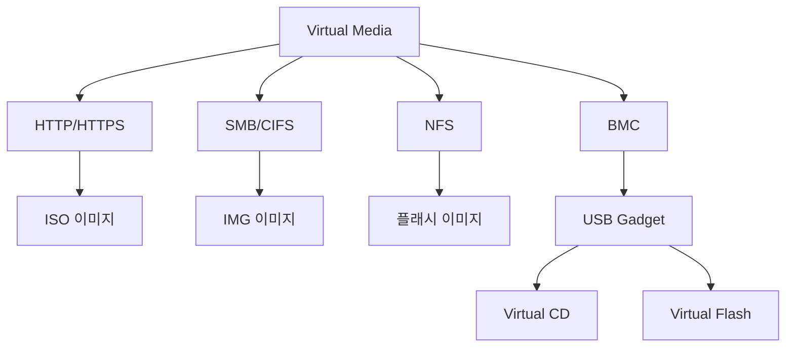

+++
title = "virtual media"
date = "2026-03-14"
weight = 714
+++

# 가상 미디어 마운트 (Virtual Media Mount)

#### 핵심 인사이트 (3줄 요약)
> 1. **본질**: 원격 ISO/IMG/플래시 드라이브 이미지를 네트워크를 통해 BMC에 마운트하여 로컬 미디어처럼 서버에 제공하는 OOB 기술
> 2. **가치**: 물리적 미디어 없이 원격 OS 설치, 펌웨어 업데이트, 데이터 전송, 응급 복구 가능
> 3. **융합**: BMC, USB 가상화, HTTP/HTTPS, CIFS/SMB, NFS, Redfish와 통합된 원격 미디어 인프라

---

### Ⅰ. 개요 (Context & Background)

**개념 정의**

가상 미디어 마운트(Virtual Media Mount)는 원격 스토리지의 ISO, IMG, 플래시 드라이브 이미지를 BMC를 통해 서버에 로컬 USB/CD/DVD처럼 인식시키는 기술입니다. 네트워크를 통해 이미지를 전송하고, BMC가 USB 대용 장치로 에뮬레이션합니다.

```
┌─────────────────────────────────────────────────────────────────────┐
│                    가상 미디어 마운트 아키텍처                         │
├─────────────────────────────────────────────────────────────────────┤
│                                                                     │
│   원격 이미지 소스                                                  │
│   ┌──────────────────────────────────────────────────────────────┐ │
│   │                                                              │ │
│   │   ┌─────────────┐ ┌─────────────┐ ┌─────────────┐           │ │
│   │   │ HTTP/HTTPS  │ │   CIFS/SMB  │ │    NFS      │           │ │
│   │   │   Server    │ │   Share     │ │   Export    │           │ │
│   │   │             │ │             │ │             │           │ │
│   │   │ ubuntu.iso  │ │ firmware.img│ │ rescue.img  │           │ │
│   │   └─────────────┘ └─────────────┘ └─────────────┘           │ │
│   │                                                              │ │
│   └──────────────────────────────────────────────────────────────┘ │
│                                │                                    │
│                                │ 네트워크 (HTTP/SMB/NFS)            │
│                                │                                    │
│                                ▼                                    │
│   ┌──────────────────────────────────────────────────────────────┐ │
│   │                    BMC (Virtual Media Service)                │ │
│   │                                                              │ │
│   │   ┌─────────────────────────────────────────────────────┐    │ │
│   │   │              Image Fetch & Cache                     │    │ │
│   │   │                                                     │    │ │
│   │   │   1. 이미지 소스 접속 (HTTP/SMB/NFS)                │    │ │
│   │   │   2. 이미지 다운로드 또는 스트리밍                   │    │ │
│   │   │   3. 로컬 캐시 (RAM/Flash)                         │    │ │
│   │   │                                                     │    │ │
│   │   └─────────────────────────────────────────────────────┘    │ │
│   │                         │                                    │ │
│   │                         ▼                                    │ │
│   │   ┌─────────────────────────────────────────────────────┐    │ │
│   │   │              USB Gadget / Mass Storage              │    │ │
│   │   │                                                     │    │ │
│   │   │   ┌───────────┐  ┌───────────┐                     │    │ │
│   │   │   │ Virtual   │  │ Virtual   │                     │    │ │
│   │   │   │ CD/DVD    │  │ Flash     │                     │    │ │
│   │   │   │ (ISO)     │  │ Drive     │                     │    │ │
│   │   │   └───────────┘  └───────────┘                     │    │ │
│   │   │         │                │                          │    │ │
│   │   │         └────────┬───────┘                          │    │ │
│   │   │                  │                                  │    │ │
│   │   └──────────────────┼──────────────────────────────────┘    │ │
│   │                      │ USB Bus                              │ │
│   │                      │                                      │ │
│   └──────────────────────┼──────────────────────────────────────┘ │
│                          │                                        │
│                          ▼                                        │
│   ┌──────────────────────────────────────────────────────────────┐ │
│   │                    Main System (Server)                       │ │
│   │                                                              │ │
│   │   ┌─────────────────────────────────────────────────────┐    │ │
│   │   │              Operating System                        │    │ │
│   │   │                                                     │    │ │
│   │   │   $ lsblk                                           │    │ │
│   │   │   sda    8:0    0  500G  0 disk  (Local Disk)       │    │ │
│   │   │   sdb    8:16   0  4.5G  0 disk  (Virtual USB)      │    │ │
│   │   │   ├─sdb1 8:17   0  4.5G  0 part                     │    │ │
│   │   │   sr0   11:0   1  4.2G  0 rom   (Virtual CD)        │    │ │
│   │   │                                                     │    │ │
│   │   │   $ mount /dev/sr0 /mnt                             │    │ │
│   │   │   $ ls /mnt                                         │    │ │
│   │   │   ubuntu-22.04.iso                                  │    │ │
│   │   │                                                     │    │ │
│   │   └─────────────────────────────────────────────────────┘    │ │
│   │                                                              │ │
│   └──────────────────────────────────────────────────────────────┘ │
│                                                                     │
└─────────────────────────────────────────────────────────────────────┘
```

> **해설**: BMC는 원격 이미지 소스(HTTP/SMB/NFS)에서 이미지를 가져와 USB Gadget으로 서버에 제공합니다. 서버는 일반 USB/CD처럼 인식합니다.

**💡 비유**: 가상 미디어는 원격에서 USB를 꽂아주는 것과 같습니다. 집에서 회사 서버에 USB를 꽂지 않아도, 네트워크로 ISO 이미지를 전송해서 CD/USB처럼 사용할 수 있습니다.

**등장 배경**

① **기존 한계**: OS 설치/복구 시 물리적 미디어 필요 → 현장 방문
② **혁신적 패러다임**: 가상 미디어로 원격 OS 설치/업데이트
③ **비즈니스 요구**: 무인 데이터센터, 자동화된 프로비저닝

**📢 섹션 요약 비유**: 가상 미디어는 원격에서 USB를 꽂아주는 것 같아요. 멀리서도 ISO 이미지를 마운트해서 OS를 설치할 수 있어요.

---

### Ⅱ. 아키텍처 및 핵심 원리 (Deep Dive)

**구성 요소 상세 분석**

| 요소명 | 역할 | 내부 동작 | 프로토콜/규격 | 비유 |
|:---|:---|:---|:---|:---|
| **Image Source** | 이미지 소스 | HTTP/SMB/NFS 서버 | HTTP/1.1/SMB3/NFS4 | 창고 |
| **BMC Fetch** | 이미지 가져오기 | 네트워크 다운로드 | HTTP/SMB/NFS | 배달 |
| **USB Gadget** | USB 에뮬레이션 | Mass Storage Class | USB 2.0/3.0 | USB 포트 |
| **Virtual CD** | CD/DVD 에뮬레이션 | ISO 마운트 | SCSI MMC | CD 드라이브 |
| **Virtual Flash** | 플래시 에뮬레이션 | IMG 마운트 | USB MSC | USB 메모리 |
| **Redfish API** | 제어 인터페이스 | 마운트/언마운트 | REST/JSON | 리모컨 |

**가상 미디어 마운트 프로세스**

```
┌─────────────────────────────────────────────────────────────────────┐
│                    가상 미디어 마운트 프로세스                         │
├─────────────────────────────────────────────────────────────────────┤
│                                                                     │
│   1. 이미지 준비                                                    │
│   ┌──────────────────────────────────────────────────────────────┐ │
│   │   관리자: ubuntu-22.04.iso를 HTTP 서버에 업로드              │ │
│   │   URL: https://images.local/ubuntu-22.04.iso                 │ │
│   └──────────────────────────────────────────────────────────────┘ │
│                                │                                    │
│                                ▼                                    │
│   2. Redfish API로 마운트 요청                                      │
│   ┌──────────────────────────────────────────────────────────────┐ │
│   │   POST /redfish/v1/Managers/1/VirtualMedia/CD1/              │ │
│   │        Actions/VirtualMedia.InsertMedia                      │ │
│   │   {                                                           │ │
│   │     "Image": "https://images.local/ubuntu-22.04.iso",        │ │
│   │     "Inserted": true,                                        │ │
│   │     "WriteProtected": true                                   │ │
│   │   }                                                           │ │
│   └──────────────────────────────────────────────────────────────┘ │
│                                │                                    │
│                                ▼                                    │
│   3. BMC 이미지 로딩                                                │
│   ┌──────────────────────────────────────────────────────────────┐ │
│   │   BMC:                                                        │ │
│   │   - HTTP로 이미지 다운로드 시작                               │ │
│   │   - Range Request로 필요한 부분만 스트리밍                    │ │
│   │   - 로컬 RAM 캐시 (또는 전체 다운로드)                        │ │
│   │   - USB Gadget 활성화                                        │ │
│   └──────────────────────────────────────────────────────────────┘ │
│                                │                                    │
│                                ▼                                    │
│   4. 서버 인식                                                      │
│   ┌──────────────────────────────────────────────────────────────┐ │
│   │   Server:                                                     │ │
│   │   - USB 장치 감지                                             │ │
│   │   - /dev/sr0 (Virtual CD) 생성                               │ │
│   │   - 자동 마운트 또는 수동 마운트                              │ │
│   └──────────────────────────────────────────────────────────────┘ │
│                                │                                    │
│                                ▼                                    │
│   5. OS 설치 / 작업                                                 │
│   ┌──────────────────────────────────────────────────────────────┐ │
│   │   $ mount /dev/sr0 /mnt                                       │ │
│   │   $ /mnt/install.sh                                           │ │
│   │   또는 BIOS에서 부팅 순서 변경 → CD 부팅                      │ │
│   └──────────────────────────────────────────────────────────────┘ │
│                                │                                    │
│                                ▼                                    │
│   6. 작업 완료 후 언마운트                                          │
│   ┌──────────────────────────────────────────────────────────────┐ │
│   │   POST /redfish/v1/Managers/1/VirtualMedia/CD1/              │ │
│   │        Actions/VirtualMedia.EjectMedia                        │ │
│   └──────────────────────────────────────────────────────────────┘ │
│                                                                     │
└─────────────────────────────────────────────────────────────────────┘
```

> **해설**: 관리자가 Redfish API로 마운트 요청 → BMC가 이미지 다운로드 → USB Gadget 활성화 → 서버가 가상 CD로 인식 → OS 설치 또는 작업 수행 → 완료 후 언마운트

**핵심 알고리즘: 가상 미디어 구현**

```python
# BMC 가상 미디어 서비스 (의사코드)
class VirtualMediaService:
    def __init__(self):
        self.mounted_media = {}
        self.usb_gadget = USBGadget()

    # 1. 이미지 마운트
    def mount_image(self, media_id, image_url, media_type="CD"):
        """
        이미지 마운트

        Args:
            media_id: 미디어 ID (CD1, USB1)
            image_url: 이미지 URL (http/https/smb/nfs)
            media_type: CD or Flash
        """
        # URL 프로토콜 확인
        if image_url.startswith("http"):
            handler = HTTPImageHandler(image_url)
        elif image_url.startswith("smb"):
            handler = SMBImageHandler(image_url)
        elif image_url.startswith("nfs"):
            handler = NFSImageHandler(image_url)
        else:
            raise ValueError("Unsupported protocol")

        # 이미지 메타데이터 가져오기
        size = handler.get_size()
        block_size = 2048 if media_type == "CD" else 512

        # USB Gadget 구성
        if media_type == "CD":
            gadget = self.usb_gadget.create_cdrom(media_id)
        else:
            gadget = self.usb_gadget.create_flash(media_id)

        # 블록 읽기 핸들러 등록
        def read_handler(lba, count):
            offset = lba * block_size
            length = count * block_size
            return handler.read(offset, length)

        gadget.set_read_handler(read_handler)
        gadget.set_size(size)

        # 활성화
        gadget.connect()

        self.mounted_media[media_id] = {
            "handler": handler,
            "gadget": gadget,
            "url": image_url,
            "size": size
        }

        return True

    # 2. 이미지 언마운트
    def unmount_image(self, media_id):
        """이미지 언마운트"""
        if media_id not in self.mounted_media:
            return False

        media = self.mounted_media[media_id]
        media["gadget"].disconnect()
        media["handler"].close()

        del self.mounted_media[media_id]
        return True

# HTTP 이미지 핸들러
class HTTPImageHandler:
    def __init__(self, url):
        self.url = url
        self.session = requests.Session()
        self.size = self._get_size()

    def _get_size(self):
        """HEAD 요청으로 파일 크기 확인"""
        response = self.session.head(self.url)
        return int(response.headers.get("Content-Length", 0))

    def read(self, offset, length):
        """Range 요청으로 부분 읽기"""
        headers = {
            "Range": f"bytes={offset}-{offset + length - 1}"
        }
        response = self.session.get(self.url, headers=headers)
        return response.content

    def get_size(self):
        return self.size

    def close(self):
        self.session.close()

# Redfish API 핸들러
@app.route('/redfish/v1/Managers/1/VirtualMedia/<media_id>/Actions/VirtualMedia.InsertMedia', methods=['POST'])
def insert_media(media_id):
    data = request.json
    image_url = data.get("Image")
    inserted = data.get("Inserted", True)
    write_protected = data.get("WriteProtected", True)

    if inserted and image_url:
        result = virtual_media.mount_image(media_id, image_url)
        if result:
            return jsonify({"success": True}), 200

    return jsonify({"error": "Failed to mount"}), 400

@app.route('/redfish/v1/Managers/1/VirtualMedia/<media_id>/Actions/VirtualMedia.EjectMedia', methods=['POST'])
def eject_media(media_id):
    result = virtual_media.unmount_image(media_id)
    if result:
        return jsonify({"success": True}), 200
    return jsonify({"error": "Failed to unmount"}), 400

# 클라이언트 사용 예시
import redfish

# 연결
redfish_obj = redfish.redfish_client(
    base_url="https://192.168.1.100",
    username="admin",
    password="password"
)

# ISO 마운트
redfish_obj.post(
    "/redfish/v1/Managers/1/VirtualMedia/CD1/Actions/VirtualMedia.InsertMedia",
    body={
        "Image": "https://images.local/ubuntu-22.04.iso",
        "Inserted": True,
        "WriteProtected": True
    }
)

# 부팅 순서 변경
redfish_obj.patch(
    "/redfish/v1/Systems/1",
    body={
        "Boot": {
            "BootSourceOverrideEnabled": "Once",
            "BootSourceOverrideTarget": "Cd"
        }
    }
)

# 재부팅
redfish_obj.post(
    "/redfish/v1/Systems/1/Actions/ComputerSystem.Reset",
    body={"ResetType": "ForceRestart"}
)
```

**📢 섹션 요약 비유**: 가상 미디어는 원격 배달 서비스와 같습니다. 주문하면(Redfish API) 이미지를 가져와서(BMC) 서버에 전달합니다(USB Gadget).

---

### Ⅲ. 융합 비교 및 다각도 분석 (Comparison & Synergy)

**기술 비교: 가상 미디어 소스 유형**

| 비교 항목 | HTTP/HTTPS | CIFS/SMB | NFS | 로컬 파일 |
|:---|:---:|:---:|:---:|:---:|
| **접근성** | 높음 | 중간 | 중간 | 낮음 |
| **보안** | TLS | SMB3 | NFS4 | 없음 |
| **인증** | Basic/OAuth | AD/Local | Kerberos | 없음 |
| **속도** | 중간 | 빠름 | 빠름 | 가장 빠름 |
| **용도** | 일반 | Windows | Unix/Linux | 긴급 |

**과목 융합 관점: 가상 미디어와 타 영역 시너지**

| 융합 영역 | 시너지 효과 | 구현 예시 |
|:---|:---|:---|
| **OS (운영체제)** | OS 설치 자동화 | PXE + 가상 미디어 |
| **네트워크** | 원격 이미지 전송 | HTTP/SMB/NFS |
| **보안** | 암호화 전송 | HTTPS, SMB3 |
| **가상화** | VM ISO 마운트 | vSphere, Proxmox |
| **클라우드** | IaC 프로비저닝 | Terraform, Ansible |

**📢 섹션 요약 비유**: 가상 미디어는 물리적 USB/CD를 네트워크로 대체하는 것과 같습니다. 더 편리하고, 더 빠르고, 자동화할 수 있습니다.

---

### Ⅳ. 실무 적용 및 기술사적 판단 (Strategy & Decision)

**실무 시나리오별 적용**

**시나리오 1: 원격 OS 설치**
- **문제**: 물리적 미디어 없이 원격 OS 설치
- **해결**: 가상 미디어로 ISO 마운트, CD 부팅
- **의사결정**: PXE 대안

**시나리오 2: 펌웨어 업데이트**
- **문제**: BIOS/UEFI 펌웨어 업데이트
- **해결**: 가상 미디어로 펌웨어 ISO 마운트
- **의사결정**: DOS/UEFI 부팅

**시나리오 3: 응급 복구**
- **문제**: OS 부팅 불가, 복구 필요
- **해결**: 가상 미디어로 복구 ISO 마운트
- **의사결정**: chroot 복구

**도입 체크리스트**

| 구분 | 항목 | 확인 포인트 |
|:---|:---|:---|
| **기술적** | BMC | 가상 미디어 지원 |
| | 이미지 서버 | HTTP/SMB/NFS |
| | 대역폭 | 100Mbps+ 권장 |
| **운영적** | 이미지 관리 | 버전 관리 |
| | 보안 | HTTPS, 인증 |
| | 로깅 | 마운트 기록 |

**안티패턴: 가상 미디어 오용 사례**

| 안티패턴 | 문제점 | 올바른 접근 |
|:---|:---|:---|
| **대용량 전체 다운로드** | 지연 | Range Request |
| **암호화 미사용** | 도청 | HTTPS/SMB3 |
| **영구 마운트** | 리소스 낭비 | 사용 후 언마운트 |
| **동시 다중 마운트** | 충돌 | 순차 마운트 |

**📢 섹션 요약 비유**: 가상 미디어 사용은 클라우드에서 파일 다운로드와 같습니다. 필요할 때만 다운로드하고, 사용 후에는 삭제해야 합니다.

---

### Ⅴ. 기대효과 및 결론 (Future & Standard)

**정량/정성 기대효과**

| 구분 | 물리적 미디어 | 가상 미디어 | 개선효과 |
|:---|:---:|:---:|:---:|
| **OS 설치** | 현장 방문 | 원격 (분) | 60배 |
| **비용** | 미디어 구매 | 없음 | 100% 절감 |
| **자동화** | 불가능 | 가능 | 신규 |
| **버전 관리** | 어려움 | 용이 | 개선 |

**미래 전망**

1. **NVMe over Fabrics:** 네트워크 NVMe 마운트
2. **클라우드 통합:** S3 이미지 직접 마운트
3. **AI 배포:** AI 기반 OS 선택
4. **컨테이너 이미지:** 컨테이너 ISO

**참고 표준**

| 표준 | 내용 | 적용 |
|:---|:---|:---|
| **Redfish 1.15** | VirtualMedia API | REST |
| **USB MSC** | Mass Storage Class | USB 2.0/3.0 |
| **HTTP/1.1** | Range Request | 부분 다운로드 |
| **SMB 3.0** | Windows 공유 | CIFS |

**📢 섹션 요약 비유**: 가상 미디어의 미래는 클라우드 스토리지와 같습니다. 어디서든, 언제든, 어떤 이미지든 마운트할 수 있습니다.

---

### 📌 관련 개념 맵 (Knowledge Graph)



**연관 개념 링크**:
- BMC - 베이스보드 관리 컨트롤러
- KVM over IP - 원격 콘솔
- OOB Management - 대역 외 관리
- Redfish - RESTful 관리 API

---

### 👶 어린이를 위한 3줄 비유 설명

1. **원격 USB**: 가상 미디어는 원격에서 USB를 꽂아주는 것 같아요! 멀리서도 CD나 USB 메모리를 꽂은 것처럼 할 수 있어요.

2. **네트워크 배달**: 인터넷으로 파일을 보내면 BMC가 받아서 서버에 전달해요. 서버는 진짜 USB가 꽂힌 줄 알아요.

3. **OS 설치**: 가상 미디어로 OS 설치 CD를 멀리서 꽂을 수 있어요. 직접 가지 않아도 돼요!