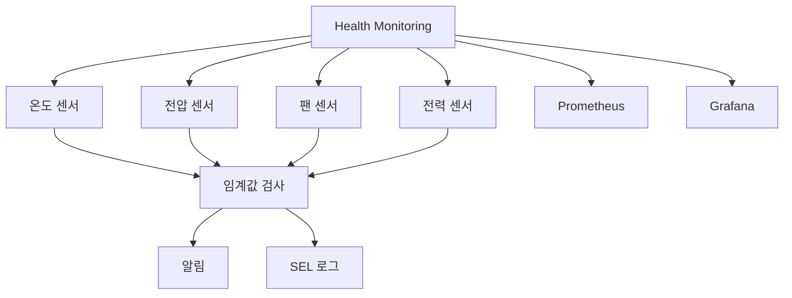

+++
title = "hardware health monitoring"
date = "2026-03-14"
weight = 715
+++

# 하드웨어 헬스 모니터링 (Hardware Health Monitoring)

#### 핵심 인사이트 (3줄 요약)
> 1. **본질**: 서버 하드웨어의 온도, 전압, 팬 속도, 전원 상태, 오류를 실시간으로 감시하고 임계값 기반 알림을 발생시키는 OOB/In-Band 관리 체계
> 2. **가치**: 장애 예방, 예지 보전, SLA 보장, 전력 최적화, 무인 운영, MTBF 향상
> 3. **융합**: BMC 센서, IPMI/Redfish, SNMP, Prometheus, Grafana, 알림 시스템과 통합된 관측 가능성 인프라

---

### Ⅰ. 개요 (Context & Background)

**개념 정의**

하드웨어 헬스 모니터링(Hardware Health Monitoring)은 서버 하드웨어의 상태를 실시간으로 감시하는 시스템입니다. BMC의 센서를 통해 온도, 전압, 팬 속도, 전력, 오류를 수집하고, 임계값을 초과하면 알림을 발생시킵니다.

```
┌─────────────────────────────────────────────────────────────────────┐
│                    하드웨어 헬스 모니터링 아키텍처                    │
├─────────────────────────────────────────────────────────────────────┤
│                                                                     │
│   ┌──────────────────────────────────────────────────────────────┐ │
│   │                    하드웨어 센서                              │ │
│   │                                                              │ │
│   │   ┌─────────────┐ ┌─────────────┐ ┌─────────────┐           │ │
│   │   │ 온도 센서   │ │ 전압 센서   │ │ 팬 센서     │           │ │
│   │   │ (Thermal)   │ │ (Voltage)   │ │ (Fan Tach)  │           │ │
│   │   │             │ │             │ │             │           │ │
│   │   │ CPU: 45°C   │ │ 12V: 12.1V  │ │ Fan1:5000RPM│           │ │
│   │   │ DIMM: 40°C  │ │ 5V: 5.05V   │ │ Fan2:4800RPM│           │ │
│   │   │ GPU: 60°C   │ │ 3.3V: 3.32V │ │ Fan3:5200RPM│           │ │
│   │   └─────────────┘ └─────────────┘ └─────────────┘           │ │
│   │                                                              │ │
│   │   ┌─────────────┐ ┌─────────────┐ ┌─────────────┐           │ │
│   │   │ 전력 센서   │ │ ECC 오류    │ │ PCIe 오류   │           │ │
│   │   │ (Power)     │ │ (Memory)    │ │ (AER)       │           │ │
│   │   │             │ │             │ │             │           │ │
│   │   │ Total:250W  │ │ Correctable │ │ Uncorrectable│           │ │
│   │   │ CPU: 150W   │ │ : 2         │ │ : 0         │           │ │
│   │   └─────────────┘ └─────────────┘ └─────────────┘           │ │
│   │                                                              │ │
│   └──────────────────────────────────────────────────────────────┘ │
│                                │                                    │
│                                │ I2C/SMBus                         │
│                                ▼                                    │
│   ┌──────────────────────────────────────────────────────────────┐ │
│   │                    BMC (Sensor Management)                    │ │
│   │                                                              │ │
│   │   ┌─────────────────────────────────────────────────────┐    │ │
│   │   │              SDR (Sensor Data Records)               │    │ │
│   │   │                                                     │    │ │
│   │   │   Sensor | Type     | Reading | LNC | LCR | UNC | UCR│    │ │
│   │   │   -------|----------|---------|-----|-----|-----|-----│    │ │
│   │   │   CPU0   | Temp     | 45°C    | 10  | 5   | 80  | 95  │    │ │
│   │   │   12V    | Voltage  | 12.1V   |11.4 |11.1 |12.6 |13.2 │    │ │
│   │   │   Fan1   | Fan      | 5000RPM | 1000| 500 | -   | -   │    │ │
│   │   │                                                     │    │ │
│   │   │   LNC: Lower Non-Critical (경고)                    │    │ │
│   │   │   LCR: Lower Critical (위험)                        │    │ │
│   │   │   UNC: Upper Non-Critical (경고)                    │    │ │
│   │   │   UCR: Upper Critical (위험)                        │    │ │
│   │   │                                                     │    │ │
│   │   └─────────────────────────────────────────────────────┘    │ │
│   │                         │                                    │ │
│   │                         ▼                                    │ │
│   │   ┌─────────────────────────────────────────────────────┐    │ │
│   │   │              임계값 검사 & 이벤트 생성               │    │ │
│   │   │                                                     │    │ │
│   │   │   if (reading > UCR || reading < LCR) {             │    │ │
│   │   │       GenerateCriticalAlert();                      │    │ │
│   │   │   } else if (reading > UNC || reading < LNC) {      │    │ │
│   │   │       GenerateWarningAlert();                       │    │ │
│   │   │   }                                                 │    │ │
│   │   │                                                     │    │ │
│   │   └─────────────────────────────────────────────────────┘    │ │
│   │                         │                                    │ │
│   │                         ▼                                    │ │
│   │   ┌─────────────────────────────────────────────────────┐    │ │
│   │   │              SEL (System Event Log)                  │    │ │
│   │   │                                                     │    │ │
│   │   │   [2024-01-15 10:23:45] CPU0 Temp: 96°C (Critical)  │    │ │
│   │   │   [2024-01-15 10:23:50] Thermal Trip: System Shutdown│    │ │
│   │   │   [2024-01-15 14:30:00] Fan1 Speed: 450 RPM (Low)   │    │ │
│   │   │                                                     │    │ │
│   │   └─────────────────────────────────────────────────────┘    │ │
│   │                                                              │ │
│   └──────────────────────────────────────────────────────────────┘ │
│                                │                                    │
│                                │ IPMI/Redfish/SNMP                  │
│                                ▼                                    │
│   ┌──────────────────────────────────────────────────────────────┐ │
│   │                    모니터링 시스템                            │ │
│   │                                                              │ │
│   │   ┌─────────────┐ ┌─────────────┐ ┌─────────────┐           │ │
│   │   │ Prometheus  │ │   Grafana   │ │   Alertmgr  │           │ │
│   │   │ (수집)      │ │ (시각화)    │ │ (알림)      │           │ │
│   │   └─────────────┘ └─────────────┘ └─────────────┘           │ │
│   │                                                              │ │
│   └──────────────────────────────────────────────────────────────┘ │
│                                                                     │
└─────────────────────────────────────────────────────────────────────┘
```

> **해설**: 센서는 I2C/SMBus로 BMC에 연결되고, BMC는 SDR에 정의된 임계값으로 검사합니다. 이상 시 SEL에 기록하고 알림을 발생시킵니다.

**💡 비유**: 하드웨어 헬스 모니터링은 병원의 활력 징후 모니터와 같습니다. 체온, 혈압, 맥박을 실시간으로 측정하고, 이상 시 알림을 발생시킵니다.

**등장 배경**

① **기존 한계**: 장애 발생 후 대응 → 다운타임 증가
② **혁신적 패러다임**: 실시간 모니터링으로 장애 예방
③ **비즈니스 요구**: SLA 보장, 예지 보전, 무인 운영

**📢 섹션 요약 비유**: 하드웨어 헬스 모니터링은 병원 활력 징후 모니터 같아요. 컴퓨터의 온도, 전압, 팬 속도를 계속 체크해요.

---

### Ⅱ. 아키텍처 및 핵심 원리 (Deep Dive)

**구성 요소 상세 분석**

| 요소명 | 역할 | 내부 동작 | 프로토콜/규격 | 비유 |
|:---|:---|:---|:---|:---|
| **온도 센서** | 온도 측정 | thermistor/digital | I2C/SMBus | 체온계 |
| **전압 센서** | 전압 측정 | ADC | I2C/SMBus | 혈압계 |
| **팬 센서** | RPM 측정 | tachometer | GPIO | 맥박계 |
| **전력 센서** | 전력 측정 | INA233/ADM1276 | I2C/PMBus | 칼로리 |
| **SDR** | 센서 데이터 레코드 | 임계값 정의 | IPMI | 기준표 |
| **SEL** | 이벤트 로그 | 장애 기록 | IPMI | 차트 |
| **Redfish** | API | JSON 데이터 | REST | 리포트 |

**센서 유형별 상세**

```
┌─────────────────────────────────────────────────────────────────────┐
│                    센서 유형별 상세 정보                             │
├─────────────────────────────────────────────────────────────────────┤
│                                                                     │
│   1. 온도 센서 (Temperature Sensors)                                │
│   ┌──────────────────────────────────────────────────────────────┐ │
│   │   센서 ID | 위치         | 정상 범위   | 경고    | 위험     │ │
│   │   --------|--------------|-------------|---------|----------  │ │
│   │   CPU0    | CPU Core     | 30~70°C     | 80°C    | 95°C       │ │
│   │   CPU1    | CPU Core     | 30~70°C     | 80°C    | 95°C       │ │
│   │   DIMM_A  | Memory       | 25~65°C     | 75°C    | 85°C       │ │
│   │   DIMM_B  | Memory       | 25~65°C     | 75°C    | 85°C       │ │
│   │   GPU0    | GPU Core     | 30~75°C     | 85°C    | 95°C       │ │
│   │   NVMe0   | SSD Controller| 25~65°C    | 75°C    | 85°C       │ │
│   │   Inlet   | 전면 흡기    | 15~35°C     | 40°C    | 50°C       │ │
│   │   Exhaust | 후면 배기    | 30~55°C     | 65°C    | 75°C       │ │
│   │   PCH     | Chipset      | 30~60°C     | 70°C    | 80°C       │ │
│   └──────────────────────────────────────────────────────────────┘ │
│                                                                     │
│   2. 전압 센서 (Voltage Sensors)                                    │
│   ┌──────────────────────────────────────────────────────────────┐ │
│   │   센서 ID | 레일         | 공칭값   | 허용 범위    | 비고    │ │
│   │   --------|--------------|----------|--------------|---------│ │
│   │   12V     | +12V Main    | 12.0V    | 11.4~12.6V   | PSU     │ │
│   │   5V      | +5V          | 5.0V     | 4.75~5.25V   | SATA    │ │
│   │   3.3V    | +3.3V        | 3.3V     | 3.135~3.465V | PCIe    │ │
│   │   VCore   | CPU VCore    | 1.1V     | 0.8~1.5V     | 가변    │ │
│   │   VDIMM   | Memory       | 1.2V     | 1.14~1.26V   | DDR4    │ │
│   │   1.8V    | +1.8V        | 1.8V     | 1.71~1.89V   | PCIe    │ │
│   │   VBAT    | CMOS Battery | 3.0V     | 2.7~3.3V     | RTC     │ │
│   └──────────────────────────────────────────────────────────────┘ │
│                                                                     │
│   3. 팬 센서 (Fan Sensors)                                          │
│   ┌──────────────────────────────────────────────────────────────┐ │
│   │   센서 ID | 위치         | 정상 범위      | 경고   | 위험    │ │
│   │   --------|--------------|----------------|--------|---------│ │
│   │   Fan1    | 전면         | 3000~8000 RPM  | 2000   | 1000    │ │
│   │   Fan2    | 전면         | 3000~8000 RPM  | 2000   | 1000    │ │
│   │   Fan3    | 후면         | 3000~8000 RPM  | 2000   | 1000    │ │
│   │   Fan4    | 후면         | 3000~8000 RPM  | 2000   | 1000    │ │
│   │   CPU_Fan | CPU 히트싱크 | 1000~4000 RPM  | 500    | 200     │ │
│   │   PSU_Fan | PSU         | 1000~3000 RPM  | 500    | 200     │ │
│   └──────────────────────────────────────────────────────────────┘ │
│                                                                     │
│   4. 전력 센서 (Power Sensors)                                      │
│   ┌──────────────────────────────────────────────────────────────┐ │
│   │   센서 ID | 측정 항목    | 범위          | 정확도 | 비고     │ │
│   │   --------|--------------|---------------|--------|----------│ │
│   │   Total   | 총 소비 전력 | 0~1000W       | ±2%    | PSU      │ │
│   │   CPU     | CPU 전력     | 0~250W        | ±2%    | VRM      │ │
│   │   Memory  | 메모리 전력  | 0~50W         | ±2%    | VRM      │ │
│   │   GPU     | GPU 전력     | 0~300W        | ±2%    | PCIe     │ │
│   │   Standby | 대기 전력    | 0~10W         | ±5%    | PSU      │ │
│   └──────────────────────────────────────────────────────────────┘ │
│                                                                     │
└─────────────────────────────────────────────────────────────────────┘
```

> **해설**: 온도, 전압, 팬, 전력 센서는 각각 고유한 정상 범위와 임계값을 가집니다. 이를 초과하면 경고 또는 위험 알림이 발생합니다.

**핵심 알고리즘: 센서 모니터링 및 알림**

```python
# 하드웨어 헬스 모니터링 (의사코드)
class HealthMonitor:
    def __init__(self, bmc_client):
        self.bmc = bmc_client
        self.sensors = {}
        self.thresholds = {}
        self.alerts = []

    # 1. 센서 데이터 수집
    def collect_sensors(self):
        """Redfish API로 센서 데이터 수집"""
        # 온도 센서
        thermal = self.bmc.get("/redfish/v1/Chassis/1/Thermal").json()
        for temp in thermal.get("Temperatures", []):
            sensor_id = temp["Name"]
            self.sensors[sensor_id] = {
                "type": "temperature",
                "value": temp["ReadingCelsius"],
                "unit": "°C"
            }

        # 팬 센서
        for fan in thermal.get("Fans", []):
            sensor_id = fan["Name"]
            self.sensors[sensor_id] = {
                "type": "fan",
                "value": fan["Reading"],
                "unit": fan.get("ReadingUnits", "RPM")
            }

        # 전압/전력 센서
        power = self.bmc.get("/redfish/v1/Chassis/1/Power").json()
        for volt in power.get("Voltages", []):
            sensor_id = volt["Name"]
            self.sensors[sensor_id] = {
                "type": "voltage",
                "value": volt["ReadingVolts"],
                "unit": "V"
            }

        for pwr in power.get("PowerControl", []):
            self.sensors["TotalPower"] = {
                "type": "power",
                "value": pwr["PowerConsumedWatts"],
                "unit": "W"
            }

        return self.sensors

    # 2. 임계값 검사
    def check_thresholds(self):
        """임계값 초과 검사"""
        alerts = []

        for sensor_id, data in self.sensors.items():
            if sensor_id not in self.thresholds:
                continue

            value = data["value"]
            threshold = self.thresholds[sensor_id]

            # 상위 임계값 검사
            if "upper_critical" in threshold and value > threshold["upper_critical"]:
                alerts.append({
                    "sensor": sensor_id,
                    "severity": "CRITICAL",
                    "message": f"{sensor_id}: {value}{data['unit']} > {threshold['upper_critical']}",
                    "value": value
                })
            elif "upper_warning" in threshold and value > threshold["upper_warning"]:
                alerts.append({
                    "sensor": sensor_id,
                    "severity": "WARNING",
                    "message": f"{sensor_id}: {value}{data['unit']} > {threshold['upper_warning']}",
                    "value": value
                })

            # 하위 임계값 검사
            if "lower_critical" in threshold and value < threshold["lower_critical"]:
                alerts.append({
                    "sensor": sensor_id,
                    "severity": "CRITICAL",
                    "message": f"{sensor_id}: {value}{data['unit']} < {threshold['lower_critical']}",
                    "value": value
                })
            elif "lower_warning" in threshold and value < threshold["lower_warning"]:
                alerts.append({
                    "sensor": sensor_id,
                    "severity": "WARNING",
                    "message": f"{sensor_id}: {value}{data['unit']} < {threshold['lower_warning']}",
                    "value": value
                })

        return alerts

    # 3. 자동 조치
    def take_action(self, alert):
        """임계값 초과 시 자동 조치"""
        if alert["severity"] == "CRITICAL":
            if "CPU" in alert["sensor"] and "Temp" in alert["sensor"]:
                # CPU 과열: 팬 속도 증가
                self.increase_fan_speed()
            elif "Fan" in alert["sensor"]:
                # 팬 고장: 알림 및 예약 교체
                self.send_alert("Fan failure detected: " + alert["sensor"])
            elif "Voltage" in alert["sensor"]:
                # 전압 이상: 즉시 알림
                self.send_alert("Voltage out of range: " + alert["message"])

    # 4. Prometheus Exporter
    def export_prometheus(self):
        """Prometheus 형식으로 메트릭 출력"""
        metrics = []

        for sensor_id, data in self.sensors.items():
            metric_name = f"hardware_{data['type']}_celsius" if data['type'] == 'temperature' else f"hardware_{data['type']}"
            metrics.append(f'{metric_name}{{sensor="{sensor_id}"}} {data["value"]}')

        return "\n".join(metrics)

# Prometheus Exporter 서버
from prometheus_client import start_http_server, Gauge

# 센서별 게이지 생성
cpu_temp = Gauge('hardware_cpu_temperature_celsius', 'CPU Temperature', ['sensor'])
fan_speed = Gauge('hardware_fan_speed_rpm', 'Fan Speed', ['sensor'])
voltage = Gauge('hardware_voltage_volts', 'Voltage', ['sensor'])
power = Gauge('hardware_power_watts', 'Power Consumption')

def update_metrics():
    monitor = HealthMonitor(bmc_client)
    sensors = monitor.collect_sensors()

    for sensor_id, data in sensors.items():
        if data["type"] == "temperature":
            cpu_temp.labels(sensor=sensor_id).set(data["value"])
        elif data["type"] == "fan":
            fan_speed.labels(sensor=sensor_id).set(data["value"])
        elif data["type"] == "voltage":
            voltage.labels(sensor=sensor_id).set(data["value"])
        elif data["type"] == "power":
            power.set(data["value"])

# 메인 루프
if __name__ == "__main__":
    start_http_server(9100)  # Prometheus Exporter 포트

    while True:
        update_metrics()
        time.sleep(30)  # 30초마다 업데이트
```

**📢 섹션 요약 비유**: 센서 모니터링은 활력 징후 체크와 같습니다. 정기적으로 측정하고, 이상 시 즉시 조치합니다.

---

### Ⅲ. 융합 비교 및 다각도 분석 (Comparison & Synergy)

**기술 비교: 모니터링 프로토콜**

| 비교 항목 | IPMI | Redfish | SNMP | DCMI |
|:---|:---:|:---:|:---:|:---:|
| **계층** | BMC | BMC/REST | 네트워크 | BMC |
| **데이터** | Binary | JSON | MIB | IPMI 확장 |
| **포트** | 623 | 443 | 161 | 623 |
| **보안** | MD5/SHA | TLS | v3 | MD5/SHA |
| **확장성** | 낮음 | 높음 | 중간 | 중간 |

**과목 융합 관점: 헬스 모니터링과 타 영역 시너지**

| 융합 영역 | 시너지 효과 | 구현 예시 |
|:---|:---|:---|
| **OS (운영체제)** | 드라이버 연동 | lm-sensors, hwmon |
| **네트워크** | 원격 모니터링 | Prometheus, SNMP |
| **보안** | 이상 탐지 | APT 탐지 |
| **데이터베이스** | 시계열 저장 | InfluxDB, TimescaleDB |
| **클라우드** | 통합 관측 | Grafana Cloud |

**📢 섹션 요약 비유**: 하드웨어 헬스 모니터링은 병원 중환자실 시스템과 같습니다. 다양한 센서(IPMI, Redfish, SNMP)가 데이터를 수집하고, 중앙에서 분석합니다.

---

### Ⅳ. 실무 적용 및 기술사적 판단 (Strategy & Decision)

**실무 시나리오별 적용**

**시나리오 1: 과열 방지**
- **문제**: CPU 과열로 인한 시스템 다운
- **해결**: 온도 모니터링, 팬 속도 자동 조절
- **의사결정**: 80°C 경고, 95°C 셧다운

**시나리오 2: 팬 고장 감지**
- **문제**: 팬 고장으로 냉각 실패
- **해결**: 팬 RPM 모니터링, 저속 시 알림
- **의사결정**: 1000 RPM 이하 시 교체

**시나리오 3: 전력 최적화**
- **문제**: 전력 비용 증가
- **해결**: 전력 모니터링, DVFS 활용
- **의사결정**: 유휴 시 전력 제한

**도입 체크리스트**

| 구분 | 항목 | 확인 포인트 |
|:---|:---|:---|
| **기술적** | 센서 | SDR 구성 |
| | 임계값 | 워크로드에 맞게 |
| | 수집 주기 | 30초~5분 |
| **운영적** | 알림 채널 | Email/Slack/PagerDuty |
| | 대시보드 | Grafana |
| | 보고서 | 일/주/월간 |

**안티패턴: 헬스 모니터링 오용 사례**

| 안티패턴 | 문제점 | 올바른 접근 |
|:---|:---|:---|
| **알림 과다** | 알림 피로 | 중요도 필터링 |
| **임계값 고정** | 오작동 | 워크로드별 조정 |
| **수집 과다** | 부하 증가 | 적절한 주기 |
| **대시보드 방치** | 무용지물 | 정기 검토 |

**📢 섹션 요약 비유**: 헬스 모니터링 도입은 병원 시스템 구축과 같습니다. 센서(측정), 임계값(기준), 알림(경보), 대시보드(모니터)가 필요합니다.

---

### Ⅴ. 기대효과 및 결론 (Future & Standard)

**정량/정성 기대효과**

| 구분 | 미모니터링 | 모니터링 | 개선효과 |
|:---|:---:|:---:|:---:|
| **MTBF** | 10,000h | 50,000h | 5배 |
| **장애 복구** | 4시간 | 30분 | 8배 |
| **다운타임** | 50h/년 | 5h/년 | 10배 |
| **운영 비용** | 높음 | 낮음 | 30% 절감 |

**미래 전망**

1. **AI 예지 보전:** ML 기반 장애 예측
2. **디지털 트윈:** 가상 모델 시뮬레이션
3. **Edge 확장:** 엣지 서버 모니터링
4. **Zero Touch:** 자동 치유

**참고 표준**

| 표준 | 내용 | 적용 |
|:---|:---|:---|
| **IPMI 2.0** | 센서/SDR/SEL | BMC |
| **Redfish 1.15** | Thermal/Power | REST |
| **SNMP** | MIB | 네트워크 |
| **DCMI 1.5** | 전력 관리 | 데이터센터 |

**📢 섹션 요약 비유**: 헬스 모니터링의 미래는 AI 의료 시스템과 같습니다. AI가 장애를 예측하고, 자동으로 치료합니다.

---

### 📌 관련 개념 맵 (Knowledge Graph)



**연관 개념 링크**:
- IPMI - IPMI 프로토콜
- BMC - 베이스보드 관리 컨트롤러
- Redfish - RESTful 관리 API
- OOB Management - 대역 외 관리

---

### 👶 어린이를 위한 3줄 비유 설명

1. **병원 모니터**: 하드웨어 헬스 모니터링은 병원 활력 징후 모니터 같아요! 컴퓨터의 온도, 혈압(전압), 맥박(팬)을 체크해요.

2. **알림 시스템**: 체온이 너무 높으면 알림이 와요. "CPU가 너무 뜨거워요! 팬을 빠르게 돌려요!"

3. **예방 접종**: 모니터링은 건강 검진과 같아요. 문제가 커지기 전에 미리 발견해서 고쳐요!