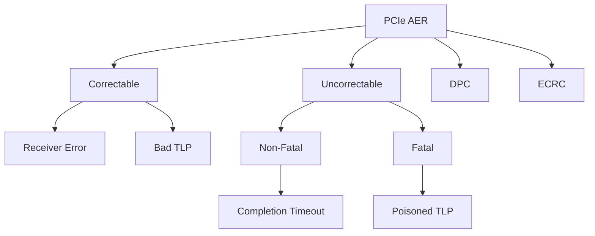

+++
title = "pcie aer"
date = "2026-03-14"
weight = 716
+++

# PCIe AER (Advanced Error Reporting)

#### 핵심 인사이트 (3줄 요약)
> 1. **본질**: PCIe 장치의 오류를 상세하게 보고하는 확장 메커니즘으로, Correctable/Uncorrectable/Fatal 오류를 계층별로 분류하여 보고
> 2. **가치**: 고가용성, 예지 보전, 장애 격리, RAS(Reliability Availability Serviceability) 향상
> 3. **융합**: PCIe AER, DPC(Downstream Port Containment), ECRC, RCEC와 통합된 PCIe 오류 관리 체계

---

### Ⅰ. 개요 (Context & Background)

**개념 정의**

PCIe AER (Advanced Error Reporting)는 PCIe 장치에서 발생하는 오류를 상세하게 보고하는 확장 메커니즘입니다. 기본 PCIe 오류 보고보다 더 많은 정보를 제공하여 장애 진단과 복구를 돕습니다.

```
┌─────────────────────────────────────────────────────────────────────┐
│                    PCIe AER 오류 계층 구조                           │
├─────────────────────────────────────────────────────────────────────┤
│                                                                     │
│   ┌──────────────────────────────────────────────────────────────┐ │
│   │                    PCIe 오류 계층                             │ │
│   │                                                              │ │
│   │   ┌─────────────────────────────────────────────────────┐    │ │
│   │   │              Uncorrectable Errors                    │    │ │
│   │   │                                                     │    │ │
│   │   │   ┌─────────────────────────────────────────────┐   │    │ │
│   │   │   │              Fatal Errors                    │   │    │ │
│   │   │   │   - 데이터 손상 복구 불가                    │   │    │ │
│   │   │   │   - 링크 재설정 필요                         │   │    │ │
│   │   │   │   - 시스템 중단 가능                         │   │    │ │
│   │   │   │   예: Poisoned TLP, MC Blocked TLP          │   │    │ │
│   │   │   └─────────────────────────────────────────────┘   │    │ │
│   │   │                                                     │    │ │
│   │   │   ┌─────────────────────────────────────────────┐   │    │ │
│   │   │   │          Non-Fatal Errors                    │   │    │ │
│   │   │   │   - 데이터 손상 있지만 복구 가능              │   │    │ │
│   │   │   │   - 링크 유지                                │   │    │ │
│   │   │   │   - 재시도 가능                              │   │    │ │
│   │   │   │   예: Completion Timeout, UR                │   │    │ │
│   │   │   └─────────────────────────────────────────────┘   │    │ │
│   │   │                                                     │    │ │
│   │   └─────────────────────────────────────────────────────┘    │ │
│   │                         │                                    │ │
│   │                         ▼                                    │ │
│   │   ┌─────────────────────────────────────────────────────┐    │ │
│   │   │              Correctable Errors                      │    │ │
│   │   │                                                     │    │ │
│   │   │   - 하드웨어가 자동 수정                            │    │ │
│   │   │   - 서비스 중단 없음                                │    │ │
│   │   │   - 성능 저하 가능                                  │    │ │
│   │   │   예: Bad TLP, Bad DLLP, Replay Number Rollover    │    │ │
│   │   │                                                     │    │ │
│   │   └─────────────────────────────────────────────────────┘    │ │
│   │                                                              │ │
│   └──────────────────────────────────────────────────────────────┘ │
│                                                                     │
│   ┌──────────────────────────────────────────────────────────────┐ │
│   │                    AER 레지스터                               │ │
│   │                                                              │ │
│   │   ┌─────────────────┐ ┌─────────────────┐                   │ │
│   │   │ Correctable     │ │ Uncorrectable   │                   │ │
│   │   │ Error Status    │ │ Error Status    │                   │ │
│   │   │ (CES)           │ │ (UES)           │                   │ │
│   │   └─────────────────┘ └─────────────────┘                   │ │
│   │   ┌─────────────────┐ ┌─────────────────┐                   │ │
│   │   │ Correctable     │ │ Uncorrectable   │                   │ │
│   │   │ Error Mask      │ │ Error Mask      │                   │ │
│   │   │ (CEM)           │ │ (UEM)           │                   │ │
│   │   └─────────────────┘ └─────────────────┘                   │ │
│   │   ┌─────────────────┐ ┌─────────────────┐                   │ │
│   │   │ Correctable     │ │ Uncorrectable   │                   │ │
│   │   │ Error Severity  │ │ Error Severity  │                   │ │
│   │   │ (CESV)          │ │ (UESV)          │                   │ │
│   │   └─────────────────┘ └─────────────────┘                   │ │
│   │                                                              │ │
│   └──────────────────────────────────────────────────────────────┘ │
│                                                                     │
└─────────────────────────────────────────────────────────────────────┘
```

> **해설**: AER는 Correctable(자동 수정), Non-Fatal Uncorrectable(복구 가능), Fatal(복구 불가)로 오류를 분류합니다. 각각 Status, Mask, Severity 레지스터가 있습니다.

**💡 비유**: AER는 자동차의 OBD-II(On-Board Diagnostics)와 같습니다. 경고등(Correctable), 심각한 경고(Non-Fatal), 엔진 정지(Fatal)로 문제를 분류하여 보고합니다.

**등장 배경**

① **기존 한계**: 기본 PCIe 오류 보고는 단순 → 상세 정보 부족
② **혁신적 패러다임**: AER로 상세 오류 정보, 계층별 분류
③ **비즈니스 요구**: 고가용성, RAS, 데이터센터 안정성

**📢 섹션 요약 비유**: AER는 자동차 OBD-II 진단 시스템과 같아요. 오류를 경고, 심각, 치명으로 나눠서 정확히 알려줘요.

---

### Ⅱ. 아키텍처 및 핵심 원리 (Deep Dive)

**구성 요소 상세 분석**

| 요소명 | 역할 | 내부 동작 | 레지스터 | 비유 |
|:---|:---|:---|:---|:---|
| **AER Capability** | AER 확장 기능 | 오류 보고 활성화 | PCI Express Extended Cap | 진단 시스템 |
| **CES** | Correctable Error Status | 수정 가능 오류 상태 | 0x14 | 경고등 |
| **CESV** | Correctable Error Severity | 수정 가능 오류 심각도 | 0x18 | 경고 수준 |
| **CEM** | Correctable Error Mask | 수정 가능 오류 마스크 | 0x1C | 무시 설정 |
| **UES** | Uncorrectable Error Status | 수정 불가 오류 상태 | 0x20 | 심각 경고 |
| **UESV** | Uncorrectable Error Severity | 수정 불가 오류 심각도 | 0x24 | 치명 수준 |
| **UEM** | Uncorrectable Error Mask | 수정 불가 오류 마스크 | 0x28 | 무시 설정 |

**AER 오류 유형 상세**

```
┌─────────────────────────────────────────────────────────────────────┐
│                    AER 오류 유형 상세                                │
├─────────────────────────────────────────────────────────────────────┤
│                                                                     │
│   1. Correctable Errors (자동 수정 가능)                            │
│   ┌──────────────────────────────────────────────────────────────┐ │
│   │   비트 | 오류명              | 설명                          │ │
│   │   ----|---------------------|-------------------------------│ │
│   │   0   | Receiver Error      | LCRC, framing error          │ │
│   │   6   | Bad TLP             | 잘못된 TLP 수신               │ │
│   │   7   | Bad DLLP            | 잘못된 DLLP 수신              │ │
│   │   8   | Replay Number Rollover | 재전송 카운터 오버플로우   │ │
│   │   9   | Replay Timer Timeout | 재전송 타임아웃              │ │
│   │   12  | Advisory Non-Fatal  | 권고적 비치명 오류            │ │
│   │   13  | Corrected Internal  | 내부 오류 자동 수정           │ │
│   │   14  | Header Log Overflow | 헤더 로그 오버플로우          │ │
│   └──────────────────────────────────────────────────────────────┘ │
│                                                                     │
│   2. Uncorrectable Errors (수정 불가)                               │
│   ┌──────────────────────────────────────────────────────────────┐ │
│   │   비트 | 오류명                  | 심각도 | 설명              │ │
│   │   ----|------------------------|--------|------------------  │ │
│   │   0   | Undefined              | -      | 정의되지 않음       │ │
│   │   4   | Data Link Protocol     | Fatal  | 데이터 링크 오류    │ │
│   │   5   | Surprise Down          | Fatal  | 예상치 못한 링크 다운│ │
│   │   12  | Poisoned TLP           | Fatal  | 손상된 TLP          │ │
│   │   13  | Flow Control Protocol  | Fatal  | 흐름 제어 오류      │ │
│   │   14  | Completion Timeout     | Non-Fatal | 완료 타임아웃     │ │
│   │   15  | Completer Abort        | Non-Fetal | 완료 중단         │ │
│   │   16  | Unexpected Completion  | Non-Fatal | 예상치 못한 완료  │ │
│   │   17  | Receiver Overflow      | Fatal  | 수신 버퍼 오버플로우│ │
│   │   18  | Malformed TLP          | Fatal  | 잘못된 형식 TLP    │ │
│   │   19  | ECRC Error             | Non-Fatal | ECRC 검증 실패    │ │
│   │   20  | Unsupported Request    | Non-Fatal | 지원되지 않는 요청│ │
│   │   21  | Acs Violation          | Non-Fatal | ACS 위반          │ │
│   │   22  | Uncorrectable Internal | Fatal  | 내부 오류 수정 불가 │ │
│   │   23  | MC Blocked TLP         | Fatal  | MC 차단 TLP        │ │
│   │   24  | AtomicOp Egress Blocked| Non-Fatal | AtomicOp 차단    │ │
│   │   25  | TLP Prefix Blocked     | Non-Fatal | TLP 접두사 차단   │ │
│   └──────────────────────────────────────────────────────────────┘ │
│                                                                     │
└─────────────────────────────────────────────────────────────────────┘
```

> **해설**: Correctable Error는 하드웨어가 자동으로 수정합니다. Uncorrectable Error는 Non-Fatal(재시도 가능)과 Fatal(복구 불가)로 나뉩니다.

**핵심 알고리즘: AER 오류 처리**

```c
// AER 오류 처리 (의사코드)
struct AER_Error {
    uint32_t status;        // 오류 상태 비트맵
    uint32_t severity;      // 심각도 비트맵
    uint32_t mask;          // 마스크 비트맵
    uint32_t source_id;     // 오류 발생 소스
    uint32_t tlp_header[4]; // 오류 TLP 헤더
};

// AER 인터럽트 핸들러
void AER_IRQHandler(uint8_t bus, uint8_t dev, uint8_t func) {
    AER_Error error;

    // 1. Correctable Error Status 읽기
    error.status = PCIe_ReadExtendedConfig(bus, dev, func, AER_CES);
    if (error.status != 0) {
        AER_HandleCorrectableError(bus, dev, func, error);
    }

    // 2. Uncorrectable Error Status 읽기
    error.status = PCIe_ReadExtendedConfig(bus, dev, func, AER_UES);
    if (error.status != 0) {
        // Severity 확인
        error.severity = PCIe_ReadExtendedConfig(bus, dev, func, AER_UESV);

        // Fatal vs Non-Fatal 구분
        uint32_t fatal_errors = error.status & error.severity;
        uint32_t nonfatal_errors = error.status & ~error.severity;

        if (fatal_errors != 0) {
            AER_HandleFatalError(bus, dev, func, fatal_errors);
        }

        if (nonfatal_errors != 0) {
            AER_HandleNonFatalError(bus, dev, func, nonfatal_errors);
        }
    }

    // 3. Root Error Status 확인 (Root Port)
    uint32_t root_status = PCIe_ReadConfig(bus, dev, func, AER_ROOT_ERR_STATUS);
    if (root_status & AER_ERR_COR) {
        // Correctable Error 수신
        printk(KERN_INFO "AER: Correctable error from %02x:%02x.%x\n",
               bus, dev, func);
    }
    if (root_status & AER_ERR_UNCOR) {
        // Uncorrectable Error 수신
        printk(KERN_ERR "AER: Uncorrectable error from %02x:%02x.%x\n",
               bus, dev, func);
    }
}

// Correctable Error 처리
void AER_HandleCorrectableError(uint8_t bus, uint8_t dev, uint8_t func,
                                 AER_Error error) {
    printk(KERN_WARNING "AER: Correctable error at %02x:%02x.%x\n",
           bus, dev, func);

    // 오류 유형별 로그
    if (error.status & AER_CE_RECEIVER_ERROR)
        printk("  - Receiver Error\n");
    if (error.status & AER_CE_BAD_TLP)
        printk("  - Bad TLP\n");
    if (error.status & AER_CE_BAD_DLLP)
        printk("  - Bad DLLP\n");
    if (error.status & AER_CE_REPLAY_TIMEOUT)
        printk("  - Replay Timeout\n");

    // 상태 클리어
    PCIe_WriteExtendedConfig(bus, dev, func, AER_CES, error.status);

    // 통계 업데이트
    aer_stats.correctable_errors++;
}

// Fatal Error 처리
void AER_HandleFatalError(uint8_t bus, uint8_t dev, uint8_t func,
                           uint32_t fatal_errors) {
    printk(KERN_EMERG "AER: Fatal error at %02x:%02x.%x\n",
           bus, dev, func);

    // 오류 유형별 로그
    if (fatal_errors & AER_UE_POISONED_TLP)
        printk("  - Poisoned TLP (Data Corruption)\n");
    if (fatal_errors & AER_UE_DATA_LINK_PROTOCOL)
        printk("  - Data Link Protocol Error\n");
    if (fatal_errors & AER_UE_SURPRISE_DOWN)
        printk("  - Surprise Down\n");

    // 장치 격리
    AER_IsolateDevice(bus, dev, func);

    // 링크 재설정
    PCIe_LinkReset(bus, dev, func);

    // 통계 업데이트
    aer_stats.fatal_errors++;
}

// Non-Fatal Error 처리
void AER_HandleNonFatalError(uint8_t bus, uint8_t dev, uint8_t func,
                              uint32_t nonfatal_errors) {
    printk(KERN_ERR "AER: Non-Fatal error at %02x:%02x.%x\n",
           bus, dev, func);

    // 재시도 가능한 오류인지 확인
    if (nonfatal_errors & AER_UE_COMPLETION_TIMEOUT) {
        printk("  - Completion Timeout, retrying...\n");
        // 드라이버에 재시도 요청
        device_retry_request(bus, dev, func);
    }

    if (nonfatal_errors & AER_UE_ECRC_ERROR) {
        printk("  - ECRC Error\n");
        // ECRC 재전송 요청
    }

    // 상태 클리어
    PCIe_WriteExtendedConfig(bus, dev, func, AER_UES, nonfatal_errors);

    // 통계 업데이트
    aer_stats.nonfatal_errors++;
}

// Linux 커널 AER 예시
// # cat /sys/kernel/debug/aer/dev_err_count
// Correctable: 10
// Non-Fatal: 2
// Fatal: 0
```

**📢 섹션 요약 비유**: AER 처리는 응급실 분류와 같습니다. 경상(Correctable)은 간단히 처치하고, 중상(Non-Fatal)은 재시도하며, 위중(Fatal)은 격리하고 링크를 재설정합니다.

---

### Ⅲ. 융합 비교 및 다각도 분석 (Comparison & Synergy)

**기술 비교: PCIe 오류 보고 메커니즘**

| 비교 항목 | 기본 PCIe | PCIe AER | DPC |
|:---|:---:|:---:|:---:|
| **상세 정보** | 제한 | 풍부 | 제한 |
| **오류 분류** | 단순 | 3단계 | 격리 |
| **자동 복구** | 없음 | 없음 | 있음 |
| **오염 전파 방지** | 없음 | 없음 | 있음 |
| **용도** | 기본 | 진단 | 격리 |

**과목 융합 관점: AER와 타 영역 시너지**

| 융합 영역 | 시너지 효과 | 구현 예시 |
|:---|:---|:---|
| **OS (운영체제)** | 커널 AER 드라이버 | Linux aer driver |
| **네트워크** | NIC 오류 보고 | AER + DPC |
| **스토리지** | NVMe 오류 복구 | AER + NVMe |
| **가상화** | VM 오류 전달 | SR-IOV AER |
| **RAS** | 신뢰성 향상 | AER + MCA |

**📢 섹션 요약 비유**: AER는 OBD-II 진단, DPC는 비상 정지 스위치와 같습니다. AER는 정보를 제공하고, DPC는 격리합니다.

---

### Ⅳ. 실무 적용 및 기술사적 판단 (Strategy & Decision)

**실무 시나리오별 적용**

**시나리오 1: NVMe SSD 오류**
- **문제**: NVMe에서 Poisoned TLP 발생
- **해결**: AER로 오류 감지, 드라이버 재시도
- **의사결정**: AER + NVMe Resiliency

**시나리오 2: NIC 링크 불안정**
- **문제**: NIC에서 Receiver Error 반복
- **해결**: AER 로그 분석, 케이블 교체
- **의사결정**: 예지 보전

**시나리오 3: GPU 충돌**
- **문제**: GPU에서 Surprise Down
- **해결**: AER + DPC로 격리, 링크 재설정
- **의사결정**: 자동 복구

**도입 체크리스트**

| 구분 | 항목 | 확인 포인트 |
|:---|:---|:---|
| **기술적** | AER 지원 | PCIe Extended Cap |
| | OS 드라이버 | Linux aer driver |
| | 로그 수집 | dmesg, aer-inject |
| **운영적** | 모니터링 | Prometheus |
| | 알림 | 장애 알림 |
| | 분석 | 정기 보고서 |

**안티패턴: AER 오용 사례**

| 안티패턴 | 문제점 | 올바른 접근 |
|:---|:---|:---|
| **AER 비활성화** | 오류 미감지 | 기본 활성화 |
| **마스크 과다** | 중요 오류 무시 | 필요시만 마스크 |
| **로그 미확인** | 장애 예방 실패 | 정기 확인 |
| **자동 복구 과신** | 근본 원인 미해결 | 원인 분석 |

**📢 섹션 요약 비유**: AER 활용은 정기 건강검진과 같습니다. 오류를 조기에 발견하고, 근본 원인을 파악해야 합니다.

---

### Ⅴ. 기대효과 및 결론 (Future & Standard)

**정량/정성 기대효과**

| 구분 | AER 미사용 | AER 사용 | 개선효과 |
|:---|:---:|:---:|:---:|
| **장애 진단** | 어려움 | 상세 | 개선 |
| **복구 시간** | 길다 | 단축 | 50% |
| **RAS** | 낮음 | 높음 | 향상 |
| **다운타임** | 길다 | 단축 | 30% |

**미래 전망**

1. **PCIe 6.0/7.0:** 더 높은 속도에서 오류 증가 → AER 중요
2. **AI 오류 분석:** AI 기반 오류 예측
3. **자동 치유:** AER + DPC + Hot-plug 자동화
4. **CXL 통합:** CXL 오류 보고 확장

**참고 표준**

| 표준 | 내용 | 적용 |
|:---|:---|:---|
| **PCIe 5.0** | AER 규격 | 2019년 |
| **PCIe 6.0** | AER 확장 | 2022년 |
| **DPC 1.1** | Downstream Port Containment | PCIe |
| **ECRC** | End-to-End CRC | 데이터 무결성 |

**📢 섹션 요약 비유**: AER의 미래는 AI 기반 자동 진단과 같습니다. 오류를 예측하고 자동으로 치료합니다.

---

### 📌 관련 개념 맵 (Knowledge Graph)



**연관 개념 링크**:
- EDAC - Error Detection and Correction
- MCA - Machine Check Architecture
- Hardware Health Monitoring - 하드웨어 헬스
- NVMe - NVMe 네임스페이스

---

### 👶 어린이를 위한 3줄 비유 설명

1. **자동차 경고등**: AER는 자동차 경고등 같아요! 오류가 생기면 "이상 있어요!"라고 알려줘요.

2. **3단계 경고**: 경고등은 3가지 색이 있어요. 노란색(수정 가능), 주황색(심각), 빨간색(치명)!

3. **빨간 불이면 정지**: 빨간 불(Fatal Error)이면 자동차를 멈추고 수리해야 해요. 데이터가 망가졌기 때문이에요!