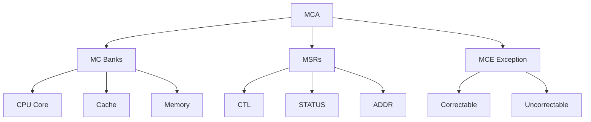

+++
title = "mca"
date = "2026-03-14"
weight = 717
+++

# 메모리 MCA (Machine Check Architecture)

#### 핵심 인사이트 (3줄 요약)
> 1. **본질**: x86/x64 CPU의 하드웨어 오류 감지 및 보고 메커니즘으로, CPU 내부 오류(Machine Check Exception)를 MSRs를 통해 상세 보고
> 2. **가치**: 데이터 무결성 보호, 예지 보전, RAS(Reliability Availability Serviceability), 장애 격리
> 3. **융합**: EDAC, CMCI(Corrected Machine Check Interrupt), LMCE(Local MCE), UEFI와 통합된 시스템 신뢰성 체계

---

### Ⅰ. 개요 (Context & Background)

**개념 정의**

MCA (Machine Check Architecture)는 x86/x64 프로세서의 하드웨어 오류 감지 및 보고 메커니즘입니다. CPU 내부의 캐시 오류, 메모리 오류, 버스 오류 등을 감지하고, MSR(Model Specific Register)을 통해 상세 정보를 제공합니다.

```
┌─────────────────────────────────────────────────────────────────────┐
│                    MCA 아키텍처 개요                                 │
├─────────────────────────────────────────────────────────────────────┤
│                                                                     │
│   ┌──────────────────────────────────────────────────────────────┐ │
│   │                    CPU 하드웨어 오류 소스                      │ │
│   │                                                              │ │
│   │   ┌─────────────┐ ┌─────────────┐ ┌─────────────┐           │ │
│   │   │ L1 Cache    │ │ L2/L3 Cache │ │ Memory      │           │ │
│   │   │ Error       │ │ Error       │ │ Controller  │           │ │
│   │   │ (ECC)       │ │ (ECC)       │ │ (ECC)       │           │ │
│   │   └─────────────┘ └─────────────┘ └─────────────┘           │ │
│   │         │               │               │                    │ │
│   │   ┌─────────────┐ ┌─────────────┐ ┌─────────────┐           │ │
│   │   │ TLB Error   │ │ Bus Error   │ │ Thermal     │           │ │
│   │   │             │ │             │ │ Error       │           │ │
│   │   └─────────────┘ └─────────────┘ └─────────────┘           │ │
│   │         │               │               │                    │ │
│   └─────────┼───────────────┼───────────────┼────────────────────┘ │
│             │               │               │                       │
│             └───────────────┼───────────────┘                       │
│                             ▼                                       │
│   ┌──────────────────────────────────────────────────────────────┐ │
│   │                    MCA (Machine Check Architecture)           │ │
│   │                                                              │ │
│   │   ┌─────────────────────────────────────────────────────┐    │ │
│   │   │              Machine Check Banks                     │    │ │
│   │   │                                                     │    │ │
│   │   │   Bank 0 (CPU)  → IA32_MC0_CTL/STATUS/ADDR          │    │ │
│   │   │   Bank 1 (L1)   → IA32_MC1_CTL/STATUS/ADDR          │    │ │
│   │   │   Bank 2 (L2)   → IA32_MC2_CTL/STATUS/ADDR          │    │ │
│   │   │   Bank 3 (L3)   → IA32_MC3_CTL/STATUS/ADDR          │    │ │
│   │   │   Bank 4 (IMC)  → IA32_MC4_CTL/STATUS/ADDR          │    │ │
│   │   │   Bank 5 (BUS)  → IA32_MC5_CTL/STATUS/ADDR          │    │ │
│   │   │   ...                                              │    │ │
│   │   │   Bank N       → IA32_MCN_CTL/STATUS/ADDR           │    │ │
│   │   │                                                     │    │ │
│   │   └─────────────────────────────────────────────────────┘    │ │
│   │                         │                                    │ │
│   │                         ▼                                    │ │
│   │   ┌─────────────────────────────────────────────────────┐    │ │
│   │   │              Global MSRs                             │    │ │
│   │   │                                                     │    │ │
│   │   │   IA32_MCG_CAP   - MCA 기능 캡뮬러티                │    │ │
│   │   │   IA32_MCG_STATUS - 전역 MCE 상태                   │    │ │
│   │   │   IA32_MCG_CTL    - 전역 MCE 활성화                 │    │ │
│   │   │                                                     │    │ │
│   │   └─────────────────────────────────────────────────────┘    │ │
│   │                         │                                    │ │
│   │                         ▼                                    │ │
│   │   ┌─────────────────────────────────────────────────────┐    │ │
│   │   │              Machine Check Exception (#MC)           │    │ │
│   │   │                                                     │    │ │
│   │   │   - 벡터 18 (0x12)                                  │    │ │
│   │   │   - Uncorrectable Error 발생 시 트리거              │    │ │
│   │   │   - OS로 제어권 전달 (MCE 핸들러)                    │    │ │
│   │   │                                                     │    │ │
│   │   └─────────────────────────────────────────────────────┘    │ │
│   │                                                              │ │
│   └──────────────────────────────────────────────────────────────┘ │
│                                                                     │
└─────────────────────────────────────────────────────────────────────┘
```

> **해설**: MCA는 다수의 Bank로 구성되며, 각 Bank는 CTL(Control), STATUS, ADDR(Address) MSR을 가집니다. Uncorrectable Error 시 #MC Exception이 발생합니다.

**💡 비유**: MCA는 건물의 화재 경보 시스템과 같습니다. 각 층(Bank)에 감지기가 있고, 화재 시 중앙 제어실(OS)로 알림을 보냅니다.

**등장 배경**

① **기존 한계**: 하드웨어 오류 감지 어려움 → 시스템 다운 후 원인 불명
② **혁신적 패러다임**: MCA로 오류 감지 및 상세 정보 제공
③ **비즈니스 요구**: 고가용성, RAS, 데이터 무결성

**📢 섹션 요약 비유**: MCA는 건물 화재 경보 시스템 같아요. 각 층(Bank)에 감지기가 있어서 어디서 불이 났는지 정확히 알 수 있어요.

---

### Ⅱ. 아키텍처 및 핵심 원리 (Deep Dive)

**구성 요소 상세 분석**

| 요소명 | 역할 | MSR 주소 | 비유 |
|:---|:---|:---|:---|
| **IA32_MCG_CAP** | MCA 기능 | 0x179 | 기능 목록 |
| **IA32_MCG_STATUS** | 전역 상태 | 0x17A | 전체 경보 |
| **IA32_MCG_CTL** | 전역 제어 | 0x17B | 마스터 스위치 |
| **MCi_CTL** | Bank 제어 | Bank별 | 층별 스위치 |
| **MCi_STATUS** | Bank 상태 | Bank별 | 층별 상태 |
| **MCi_ADDR** | 오류 주소 | Bank별 | 위치 정보 |

**MCA Bank 및 오류 유형**

```
┌─────────────────────────────────────────────────────────────────────┐
│                    MCA Bank 및 오류 유형                             │
├─────────────────────────────────────────────────────────────────────┤
│                                                                     │
│   ┌──────────────────────────────────────────────────────────────┐ │
│   │                    MCi_STATUS 레지스터 구조                    │ │
│   │                     (64-bit)                                  │ │
│   │                                                              │ │
│   │   ┌──────┬──────────────────────────────────────────────────┐│ │
│   │   │ 비트 │ 필드명                │ 설명                    ││ │
│   │   ├──────┼──────────────────────────────────────────────────┤│ │
│   │   │ 0    │ VAL (Valid)           │ 유효한 오류 상태         ││ │
│   │   │ 1    │ OVER (Overflow)       │ 오버플로우              ││ │
│   │   │ 2    │ UC (Uncorrected)      │ 수정되지 않은 오류      ││ │
│   │   │ 3    │ EN (Error Enabled)    │ 오류 감지 활성화        ││ │
│   │   │ 4    │ MISCV (Misc Valid)    │ MCi_MISC 유효           ││ │
│   │   │ 5    │ ADDRV (Addr Valid)    │ MCi_ADDR 유효           ││ │
│   │   │ 6    │ PCC (Proc Context Corrupt) │ 프로세서 상태 손상  ││ │
│   │   │ 7    │ S (Signaling)         │ 신호 가능               ││ │
│   │   │ 8    │ AR (Action Required)  │ 조치 필요               ││ │
│   │   │ 9    │ SERR (SERR 발생)      │ SERR# 생성              ││ │
│   │   │ 10-15│ CECC (Corrected ECC)  │ 수정된 ECC 오류         ││ │
│   │   │ 16-63│ Error Code             │ 오류 코드               ││ │
│   │   └──────┴──────────────────────────────────────────────────┘│ │
│   │                                                              │ │
│   └──────────────────────────────────────────────────────────────┘ │
│                                                                     │
│   ┌──────────────────────────────────────────────────────────────┐ │
│   │                    주요 MCA Bank 유형 (Intel 예시)             │ │
│   │                                                              │ │
│   │   Bank | 유형          | 오류 예시                          │ │
│   │   -----|---------------|-------------------------------------│ │
│   │   0    | CPU Core      | L0/L1 Cache, TLB, FPU 오류         │ │
│   │   1    | CPU Core      | L0/L1 Cache (다른 유닛)            │ │
│   │   2    | L2 Cache      | L2 ECC 오류                        │ │
│   │   3    | L3 Cache      | L3 ECC 오류                        │ │
│   │   4    | Integrated MC | 메모리 컨트롤러 ECC 오류           │ │
│   │   5    | QPI/UPI       | 인터커넥트 오류                    │ │
│   │   6    | PCIe          | PCIe 오류                          │ │
│   │   7    | IIO           | I/O 오류                           │ │
│   │                                                              │ │
│   └──────────────────────────────────────────────────────────────┘ │
│                                                                     │
└─────────────────────────────────────────────────────────────────────┘
```

> **해설**: MCi_STATUS 레지스터는 오류의 유효성, 수정 가능 여부, 주소 유효성, 프로세서 상태 손상 등을 나타냅니다. Bank는 오류 발생 위치를 식별합니다.

**핵심 알고리즘: MCE 핸들러**

```c
// MCE (Machine Check Exception) 핸들러 (의사코드)
struct MCE_Info {
    uint64_t status;        // MCi_STATUS
    uint64_t addr;          // MCi_ADDR
    uint64_t misc;          // MCi_MISC
    uint8_t  bank;          // Bank 번호
    uint8_t  cpu;           // CPU 번호
    uint64_t time;          // 타임스탬프
};

// MCE 인터럽트 핸들러
void MCE_Handler(struct pt_regs *regs) {
    MCE_Info mce;
    uint64_t mcg_status;
    int num_banks;

    // 1. 전역 상태 확인
    mcg_status = rdmsr(IA32_MCG_STATUS);

    // RIPV: Restart IP Valid
    // EIPV: Error IP Valid
    // MCIP: Machine Check In Progress

    if (mcg_status & MCG_STATUS_MCIP) {
        // MCE가 이미 진행 중 - 이중 오류
        panic("Machine Check: Double fault!");
    }

    // MCIP 설정
    wrmsr(IA32_MCG_STATUS, mcg_status | MCG_STATUS_MCIP);

    // 2. 모든 Bank 스캔
    num_banks = rdmsr(IA32_MCG_CAP) & MCG_CAP_COUNT_MASK;

    for (int bank = 0; bank < num_banks; bank++) {
        mce.status = rdmsr(IA32_MCx_STATUS(bank));

        if (!(mce.status & MCI_STATUS_VAL)) {
            continue;  // 유효하지 않은 오류
        }

        // 오류 정보 수집
        mce.bank = bank;
        mce.cpu = smp_processor_id();
        mce.time = get_cycles();

        if (mce.status & MCI_STATUS_ADDRV) {
            mce.addr = rdmsr(IA32_MCx_ADDR(bank));
        }

        if (mce.status & MCI_STATUS_MISCV) {
            mce.misc = rdmsr(IA32_MCx_MISC(bank));
        }

        // 3. 오류 유형별 처리
        if (mce.status & MCI_STATUS_UC) {
            // Uncorrectable Error
            if (mce.status & MCI_STATUS_PCC) {
                // Processor Context Corrupt - 치명적
                panic("Machine Check: Processor context corrupted!");
            } else if (mce.status & MCI_STATUS_AR) {
                // Action Required - 프로세스 종료
                MCE_KillCurrentProcess(&mce);
            } else {
                // Action Optional - 로그만 남김
                MCE_LogError(&mce);
            }
        } else {
            // Correctable Error - 로그만 남김
            MCE_LogCorrectable(&mce);
        }

        // Bank 클리어
        wrmsr(IA32_MCx_STATUS(bank), 0);
    }

    // MCIP 클리어
    wrmsr(IA32_MCG_STATUS, mcg_status & ~MCG_STATUS_MCIP);
}

// CMCI (Corrected Machine Check Interrupt) 핸들러
void CMCI_Handler(void) {
    // Corrected Error 발생 시 인터럽트
    // 임계값 초과 시 CMCI 발생

    MCE_Info mce;
    int threshold;

    for (int bank = 0; bank < num_banks; bank++) {
        if (!cmci_supported(bank))
            continue;

        mce.status = rdmsr(IA32_MCx_STATUS(bank));

        if (mce.status & MCI_STATUS_VAL) {
            // Corrected Error 로그
            MCE_LogCorrectable(&mce);

            // 임계값 확인
            threshold = get_cmci_threshold(bank);
            increment_cmci_count(bank);

            if (get_cmci_count(bank) > threshold) {
                // 임계값 초과 - 예지 보전 알림
                printk(KERN_WARNING
                    "CMCI: Bank %d threshold exceeded!\n", bank);
                trigger_predictive_maintenance(bank);
            }

            // Bank 클리어
            wrmsr(IA32_MCx_STATUS(bank), 0);
        }
    }
}

// Linux mcelog 출력 예시
// # mcelog
// CPU 0 BANK 4
//  STATUS 0x8c00004400010090
//  MCGSTATUS 0x3
//  ADDR 0x1234567890
//  TIME 1704067200
//  MISC 0x0
//  Corrected error
//  Error enabled
//  MCi_ADDR register valid
//  Internal unclassified error
//  Memory Controller: scrubber error
```

**📢 섹션 요약 비유**: MCE 핸들러는 소방관과 같습니다. 화재(MCE)가 발생하면 각 층(Bank)을 확인하고, 불이난 곳을 로그하고, 위험 시 대피시킵니다.

---

### Ⅲ. 융합 비교 및 다각도 분석 (Comparison & Synergy)

**기술 비교: MCA vs EDAC vs AER**

| 비교 항목 | MCA | EDAC | AER |
|:---|:---:|:---:|:---:|
| **대상** | CPU 내부 | 메모리 | PCIe |
| **계층** | CPU MSR | 메모리 컨트롤러 | PCIe |
| **예외** | #MC | NMI/IRQ | IRQ |
| **복구** | 제한적 | 제한적 | 없음 |
| **용도** | CPU 오류 | 메모리 ECC | PCIe 오류 |

**과목 융합 관점: MCA와 타 영역 시너지**

| 융합 영역 | 시너지 효과 | 구현 예시 |
|:---|:---|:---|
| **OS (운영체제)** | MCE 드라이버 | Linux mce driver |
| **메모리** | EDAC 통합 | Memory scrubbing |
| **가상화** | VM MCE 전달 | LMCE, Virtual MCE |
| **RAS** | 신뢰성 향상 | MCA + MCE Recovery |
| **UEFI** | MCA 초기화 | UEFI MCA 설정 |

**📢 섹션 요약 비유**: MCA는 CPU 화재 경보, EDAC은 메모리 화재 경보, AER는 PCIe 화재 경보와 같습니다. 각각 담당 영역이 다릅니다.

---

### Ⅳ. 실무 적용 및 기술사적 판단 (Strategy & Decision)

**실무 시나리오별 적용**

**시나리오 1: 메모리 ECC 오류**
- **문제**: 메모리에서 다수 Corrected ECC 오류
- **해결**: CMCI로 감지, DIMM 교체 예정
- **의사결정**: 예지 보전

**시나리오 2: L3 Cache 오류**
- **문제**: L3 Cache Uncorrectable Error
- **해결**: PCC 확인, 프로세스 종료
- **의사결정**: Cache line 격리

**시나리오 3: CPU 과열**
- **문제**: Thermal 오류로 MCE
- **해결**: CPU 스로틀링, 셧다운
- **의사결정**: 안전 모드

**도입 체크리스트**

| 구분 | 항목 | 확인 포인트 |
|:---|:---|:---|
| **기술적** | MCA 지원 | CPUID 확인 |
| | CMCI 활성화 | BIOS/OS 설정 |
| | 로그 수집 | mcelog, rasdaemon |
| **운영적** | 모니터링 | Prometheus |
| | 알림 | ECC 임계값 |
| | 교체 계획 | 예지 보전 |

**안티패턴: MCA 오용 사례**

| 안티패턴 | 문제점 | 올바른 접근 |
|:---|:---|:---|
| **MCE 무시** | 장애 누적 | 즉시 분석 |
| **로그 미확인** | 원인 불명 | 정기 확인 |
| **CMCI 비활성화** | 예지 보전 불가 | 활성화 |
| **Uncorrectable 무시** | 데이터 손상 | 즉시 조치 |

**📢 섹션 요약 비유**: MCA 활용은 건물 화재 경보 관리와 같습니다. 경보를 무시하면 큰 화재로 이어집니다.

---

### Ⅴ. 기대효과 및 결론 (Future & Standard)

**정량/정성 기대효과**

| 구분 | MCA 미사용 | MCA 사용 | 개선효과 |
|:---|:---:|:---:|:---:|
| **장애 진단** | 어려움 | 상세 | 개선 |
| **예지 보전** | 불가능 | 가능 | 신규 |
| **MTTR** | 길다 | 단축 | 50% |
| **데이터 무결성** | 낮음 | 높음 | 향상 |

**미래 전망**

1. **Intel MCA 확장:** 더 많은 Bank, 상세 정보
2. **AMD MCA:** MCA와 유사한 MCE
3. **ARM RAS:** ARM64 RAS 확장
4. **AI 예지 보전:** ML 기반 오류 예측

**참고 표준**

| 표준 | 내용 | 적용 |
|:---|:---|:---|
| **Intel SDM Vol 3B** | MCA 규격 | Intel CPU |
| **AMD APM Vol 2** | MCE 규격 | AMD CPU |
| **UEFI 2.10** | MCA 초기화 | 펌웨어 |
| **ACPI 6.5** | HEST, BERT | OS |

**📢 섹션 요약 비유**: MCA의 미래는 스마트 화재 경보와 같습니다. AI가 화재를 예측하고 자동으로 조치합니다.

---

### 📌 관련 개념 맵 (Knowledge Graph)



**연관 개념 링크**:
- EDAC - Error Detection and Correction
- PCIe AER - PCIe 오류 보고
- Hardware Health Monitoring - 하드웨어 헬스
- ACPI - 전원 관리 인터페이스

---

### 👶 어린이를 위한 3줄 비유 설명

1. **화재 경보**: MCA는 건물 화재 경보 같아요! 어디서 불이 났는지 정확히 알려줘요.

2. **층별 감지기**: 각 층(Bank)에 감지기가 있어요. L1, L2, L3 캐시, 메모리 등 각각 감지해요.

3. **대피 명령**: 큰 불(Uncorrectable Error)이면 "비상!"하고 외쳐요. 프로그램을 종료시켜요!