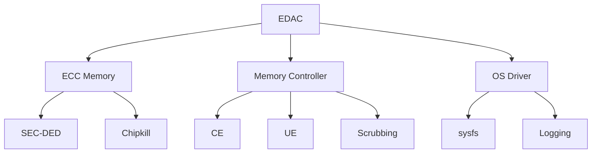

+++
title = "edac"
date = "2026-03-14"
weight = 718
+++

# EDAC (Error Detection and Correction)

#### 핵심 인사이트 (3줄 요약)
> 1. **본질**: 메모리 오류를 감지하고 수정하는 하드웨어/소프트웨어 하이브리드 시스템으로, ECC 메모리와 OS 드라이버가 협력하여 데이터 무결성 보장
> 2. **가치**: 메모리 데이터 무결성, 예지 보전, Silent Data Corruption 방지, RAS 향상
> 3. **융합**: ECC DIMM, MCA, Scrubbing, NMI, Linux EDAC 드라이버와 통합된 메모리 신뢰성 체계

---

### Ⅰ. 개요 (Context & Background)

**개념 정의**

EDAC (Error Detection and Correction)는 메모리 오류를 감지하고 수정하는 시스템입니다. ECC(Error Correcting Code) 메모리 하드웨어와 OS 드라이버가 협력하여 1비트 오류를 자동 수정하고, 다비트 오류를 감지합니다.

```
┌─────────────────────────────────────────────────────────────────────┐
│                    EDAC 시스템 아키텍처                              │
├─────────────────────────────────────────────────────────────────────┤
│                                                                     │
│   ┌──────────────────────────────────────────────────────────────┐ │
│   │                    ECC 메모리 (하드웨어)                       │ │
│   │                                                              │ │
│   │   ┌─────────────────────────────────────────────────────┐    │ │
│   │   │              DIMM (Dual Inline Memory Module)        │    │ │
│   │   │                                                     │    │ │
│   │   │   데이터 비트: 64-bit (x8 devices)                  │    │ │
│   │   │   ECC 비트:  8-bit (SEC-DED)                        │    │ │
│   │   │   총 비트:   72-bit                                 │    │ │
│   │   │                                                     │    │ │
│   │   │   ┌─────────────────────────────────────────────┐   │    │ │
│   │   │   │            ECC 체크 비트 생성                 │   │    │ │
│   │   │   │                                             │   │    │ │
│   │   │   │   Data[63:0] ──► Hamming Code ──► ECC[7:0] │   │    │ │
│   │   │   │                                             │   │    │ │
│   │   │   │   SEC (Single Error Correction): 1비트 수정  │   │    │ │
│   │   │   │   DED (Double Error Detection): 2비트 감지   │   │    │ │
│   │   │   │                                             │   │    │ │
│   │   │   └─────────────────────────────────────────────┘   │    │ │
│   │   │                                                     │    │ │
│   │   └─────────────────────────────────────────────────────┘    │ │
│   │                                                              │ │
│   └──────────────────────────────────────────────────────────────┘ │
│                                │                                    │
│                                │ 메모리 컨트롤러                    │
│                                ▼                                    │
│   ┌──────────────────────────────────────────────────────────────┐ │
│   │                    EDAC 로직 (하드웨어)                        │ │
│   │                                                              │ │
│   │   ┌─────────────────────────────────────────────────────┐    │ │
│   │   │              ECC 검증 및 수정                        │    │ │
│   │   │                                                     │    │ │
│   │   │   Read 시:                                          │    │ │
│   │   │   1. Data + ECC 읽기                                │    │ │
│   │   │   2. Syndrome 계산                                  │    │ │
│   │   │   3. Syndrome = 0 → 오류 없음                       │    │ │
│   │   │   4. Syndrome ≠ 0 → 오류 위치 계산                  │    │ │
│   │   │      - 1비트 오류 → 자동 수정, CE (Correctable)    │    │ │
│   │   │      - 2비트 오류 → 감지, UE (Uncorrectable)       │    │ │
│   │   │                                                     │    │ │
│   │   └─────────────────────────────────────────────────────┘    │ │
│   │                         │                                    │ │
│   │                         ▼                                    │ │
│   │   ┌─────────────────────────────────────────────────────┐    │ │
│   │   │              오류 상태 레지스터                      │    │ │
│   │   │                                                     │    │ │
│   │   │   ECC Status Register:                              │    │ │
│   │   │   - CE (Correctable Error) 카운터                   │    │ │
│   │   │   - UE (Uncorrectable Error) 카운터                 │    │ │
│   │   │   - 오류 발생 주소 (Physical Address)               │    │ │
│   │   │   - Syndrome (오류 패턴)                            │    │ │
│   │   │                                                     │    │ │
│   │   └─────────────────────────────────────────────────────┘    │ │
│   │                                                              │ │
│   └──────────────────────────────────────────────────────────────┘ │
│                                │                                    │
│                                │ 인터럽트 / 폴링                    │
│                                ▼                                    │
│   ┌──────────────────────────────────────────────────────────────┐ │
│   │                    EDAC 드라이버 (OS)                         │ │
│   │                                                              │ │
│   │   ┌─────────────────────────────────────────────────────┐    │ │
│   │   │              Linux EDAC Subsystem                    │    │ │
│   │   │                                                     │    │ │
│   │   │   /sys/devices/system/edac/mc/                      │    │ │
│   │   │   ├── mc0/                                          │    │ │
│   │   │   │   ├── ce_count          (Correctable Errors)    │    │ │
│   │   │   │   ├── ue_count          (Uncorrectable Errors)  │    │ │
│   │   │   │   ├── csrow0/                                   │    │ │
│   │   │   │   │   ├── ce_count                           │    │ │
│   │   │   │   │   ├── ue_count                           │    │ │
│   │   │   │   │   └── ch0_ce_count                       │    │ │
│   │   │   │   └── all_channel_counts/                    │    │ │
│   │   │   └── mc1/                                       │    │ │
│   │   │                                                     │    │ │
│   │   └─────────────────────────────────────────────────────┘    │ │
│   │                                                              │ │
│   └──────────────────────────────────────────────────────────────┘ │
│                                                                     │
└─────────────────────────────────────────────────────────────────────┘
```

> **해설**: ECC 메모리는 64비트 데이터 + 8비트 ECC로 구성됩니다. EDAC 로직은 1비트 오류를 자동 수정(CE)하고, 2비트 오류를 감지(UE)합니다. OS 드라이버는 이를 로그합니다.

**💡 비유**: EDAC는 은행의 위조지폐 감지기와 같습니다. 위조지폐(오류)를 감지하고, 약간의 훼손은 수정해서 통과시키며, 심각한 위조는 거부합니다.

**등장 배경**

① **기존 한계**: 비ECC 메모리는 오류 감지 불가 → Silent Data Corruption
② **혁신적 패러다임**: ECC + EDAC으로 메모리 무결성 보장
③ **비즈니스 요구**: 서버 신뢰성, 데이터 무결성, 규정 준수

**📢 섹션 요약 비유**: EDAC는 은행의 위조지폐 감지기 같아요. 약간의 오류는 수정하고, 심각한 오류는 감지해요.

---

### Ⅱ. 아키텍처 및 핵심 원리 (Deep Dive)

**구성 요소 상세 분석**

| 요소명 | 역할 | 내부 동작 | 비유 |
|:---|:---|:---|:---|
| **ECC DIMM** | ECC 메모리 모듈 | 72-bit (64+8) | 안전 금고 |
| **Memory Controller** | ECC 계산 | Syndrome 생성/검증 | 감사관 |
| **CE** | Correctable Error | 1비트 오류 자동 수정 | 경상 |
| **UE** | Uncorrectable Error | 2비트+ 오류 감지 | 중상 |
| **Scrubbing** | 선제적 수정 | 백그라운드 패턴 스캔 | 정기 점검 |
| **EDAC Driver** | OS 인터페이스 | 오류 로깅 | 보고서 |

**ECC 알고리즘: SEC-DED**

```
┌─────────────────────────────────────────────────────────────────────┐
│                    SEC-DED ECC 알고리즘                              │
├─────────────────────────────────────────────────────────────────────┤
│                                                                     │
│   SEC-DED (Single Error Correction, Double Error Detection)         │
│                                                                     │
│   ┌──────────────────────────────────────────────────────────────┐ │
│   │                    데이터 인코딩                              │ │
│   │                                                              │ │
│   │   64-bit Data:  D[63:0]                                      │ │
│   │                    │                                         │ │
│   │                    ▼                                         │ │
│   │   ┌─────────────────────────────────────────────────────┐    │ │
│   │   │            Hamming(72, 64) 인코더                    │    │ │
│   │   │                                                     │    │ │
│   │   │   Parity 비트 위치: 1, 2, 4, 8, 16, 32, 64          │    │ │
│   │   │   (2^n 위치)                                        │    │ │
│   │   │                                                     │    │ │
│   │   │   각 Parity 비트는 해당 위치의 XOR                  │    │ │
│   │   │                                                     │    │ │
│   │   └─────────────────────────────────────────────────────┘    │ │
│   │                    │                                         │ │
│   │                    ▼                                         │ │
│   │   72-bit Codeword: D[63:0] + P[7:0]                          │ │
│   │                                                              │ │
│   └──────────────────────────────────────────────────────────────┘ │
│                                                                     │
│   ┌──────────────────────────────────────────────────────────────┐ │
│   │                    데이터 검증 (Read)                         │ │
│   │                                                              │ │
│   │   72-bit Read: D'[63:0] + P'[7:0]                            │ │
│   │                    │                                         │ │
│   │                    ▼                                         │ │
│   │   ┌─────────────────────────────────────────────────────┐    │ │
│   │   │            Syndrome 계산                             │    │ │
│   │   │                                                     │    │ │
│   │   │   Syndrome = P' XOR Recomputed_Parity               │    │ │
│   │   │                                                     │    │ │
│   │   │   if (Syndrome == 0):                               │    │ │
│   │   │       오류 없음                                      │    │ │
│   │   │   elif (Syndrome == 1비트):                         │    │ │
│   │   │       CE - 1비트 오류, Syndrome이 위치 지정         │    │ │
│   │   │       해당 비트 반전으로 수정                       │    │ │
│   │   │   elif (Syndrome == 전체 Parity 오류):              │    │ │
│   │   │       CE - ECC 비트 자체 오류                       │    │ │
│   │   │   else:                                             │    │ │
│   │   │       UE - 2비트+ 오류, 수정 불가                   │    │ │
│   │   │                                                     │    │ │
│   │   └─────────────────────────────────────────────────────┘    │ │
│   │                                                              │ │
│   └──────────────────────────────────────────────────────────────┘ │
│                                                                     │
│   예시:                                                            │
│   - Data: 0x123456789ABCDEF0                                       │
│   - ECC:  0x5A (계산됨)                                            │
│   - Read Data: 0x123456789ABCDEF1 (Bit 0 오류)                     │
│   - Syndrome: 0x01 → Bit 0 오류 감지 → 0x123456789ABCDEF0로 수정  │
│                                                                     │
└─────────────────────────────────────────────────────────────────────┘
```

> **해설**: SEC-DED는 1비트 오류를 수정(CE)하고, 2비트 오류를 감지(UE)합니다. Syndrome으로 오류 위치를 계산합니다.

**핵심 알고리즘: EDAC 처리**

```c
// EDAC 드라이버 (의사코드)
struct EDAC_Error {
    uint64_t address;       // 오류 발생 주소
    uint32_t syndrome;      // ECC Syndrome
    uint8_t  error_type;    // CE or UE
    uint8_t  csrow;         // Chip Select Row
    uint8_t  channel;       // 메모리 채널
    uint8_t  dimm;          // DIMM 슬롯
    uint64_t timestamp;     // 발생 시간
};

// EDAC 인터럽트 핸들러
void EDAC_IRQHandler(struct mem_controller *mc) {
    EDAC_Error error;

    // 1. 오류 상태 레지스터 읽기
    uint32_t status = readl(mc->regs + ECC_STATUS);

    if (status & ECC_CE_ERROR) {
        // Correctable Error
        error.error_type = EDAC_CE;
        error.address = readl(mc->regs + ECC_CE_ADDR);
        error.syndrome = readl(mc->regs + ECC_CE_SYNDROME);

        // 물리적 주소에서 DIMM 위치 계산
        edac_decode_address(mc, error.address, &error.csrow,
                            &error.channel, &error.dimm);

        // CE 카운터 증가
        mc->ce_count++;
        mc->csrows[error.csrow].ce_count++;
        mc->csrows[error.csrow].channels[error.channel].ce_count++;

        // 로그
        edac_log_ce(&error);

        // 임계값 확인 (예지 보전)
        if (mc->ce_count_per_hour > CE_THRESHOLD) {
            edac_alert_predictive_failure(&error);
        }

        // CE 상태 클리어
        writel(ECC_CE_CLEAR, mc->regs + ECC_STATUS);
    }

    if (status & ECC_UE_ERROR) {
        // Uncorrectable Error
        error.error_type = EDAC_UE;
        error.address = readl(mc->regs + ECC_UE_ADDR);
        error.syndrome = readl(mc->regs + ECC_UE_SYNDROME);

        // UE 카운터 증가
        mc->ue_count++;

        // 로그
        edac_log_ue(&error);

        // NMI 또는 MCE 트리거
        if (mc->panic_on_ue) {
            panic("EDAC: Uncorrectable memory error at 0x%llx",
                  error.address);
        }

        // UE 상태 클리어
        writel(ECC_UE_CLEAR, mc->regs + ECC_STATUS);
    }
}

// 메모리 스크러빙 (Background)
void EDAC_MemoryScrubber(struct mem_controller *mc) {
    // 선제적 오류 수정
    // 1. 모든 메모리를 순차적으로 읽기
    // 2. CE 발생 시 자동 수정 (하드웨어)
    // 3. UE 발생 시 OS 알림

    uint64_t addr;
    for (addr = mc->start_addr; addr < mc->end_addr; addr += CACHE_LINE) {
        // 읽기만 해도 ECC 검증 수행
        uint64_t data = readq(addr);

        // 패턴 스캔 (선택적)
        if (mc->scrub_pattern) {
            if (data != mc->expected_pattern) {
                edac_log_scrub_error(addr, data, mc->expected_pattern);
            }
        }
    }
}

// Linux sysfs 인터페이스
// /sys/devices/system/edac/mc/mc0/ce_count
static ssize_t ce_count_show(struct device *dev,
                              struct device_attribute *attr, char *buf) {
    struct mem_ctl_info *mci = to_mci(dev);
    return sprintf(buf, "%llu\n", mci->ce_mc);
}

// /sys/devices/system/edac/mc/mc0/ue_count
static ssize_t ue_count_show(struct device *dev,
                              struct device_attribute *attr, char *buf) {
    struct mem_ctl_info *mci = to_mci(dev);
    return sprintf(buf, "%llu\n", mci->ue_mc);
}

// Linux EDAC 통계 확인
// # cat /sys/devices/system/edac/mc/mc0/ce_count
// 15
// # cat /sys/devices/system/edac/mc/mc0/ue_count
// 0
// # cat /sys/devices/system/edac/mc/mc0/csrow0/ce_count
// 12
// # cat /sys/devices/system/edac/mc/mc0/csrow0/ch0_ce_count
// 8
```

**📢 섹션 요약 비유**: EDAC 처리는 은행의 위조지폐 감지와 같습니다. CE(약간 훼손)는 수정하고, UE(심각 위조)는 경보를 울립니다.

---

### Ⅲ. 융합 비교 및 다각도 분석 (Comparison & Synergy)

**기술 비교: ECC 종류**

| 비교 항목 | No ECC | SEC-DED | Chipkill |
|:---|:---:|:---:|:---:|
| **오류 감지** | 없음 | 1/2비트 | 4비트+ |
| **오류 수정** | 없음 | 1비트 | 4비트 |
| **비용** | 낮음 | 중간 | 높음 |
| **비트 폭** | 64-bit | 72-bit | 80-bit+ |
| **용도** | 일반 | 서버 | 엔터프라이즈 |

**과목 융합 관점: EDAC와 타 영역 시너지**

| 융합 영역 | 시너지 효과 | 구현 예시 |
|:---|:---|:---|
| **OS (운영체제)** | EDAC 드라이버 | Linux edac_mc |
| **메모리** | ECC DIMM | DDR5 ECC |
| **가상화** | VM 메모리 보호 | Hypervisor ECC |
| **RAS** | 신뢰성 향상 | MCA + EDAC |
| **보안** | 데이터 무결성 | Rowhammer 방어 |

**📢 섹션 요약 비유**: SEC-DED는 일반 경비, Chipkill은 특수 경비와 같습니다. 보호 수준과 비용이 다릅니다.

---

### Ⅳ. 실무 적용 및 기술사적 판단 (Strategy & Decision)

**실무 시나리오별 적용**

**시나리오 1: DIMM 예지 보전**
- **문제**: 특정 DIMM에서 CE 증가
- **해결**: EDAC 로그 분석, DIMM 교체 예정
- **의사결정**: 24시간 내 100개 CE 시 교체

**시나리오 2: UE 발생**
- **문제**: Uncorrectable Error 발생
- **해결**: 영향 받은 프로세스 종료
- **의사결정**: MCE + 페이지 offline

**시나리오 3: Rowhammer 방어**
- **문제**: Rowhammer 공격 가능성
- **해결**: ECC + Scrubbing으로 감지
- **의사결정**: ECC 활성화 필수

**도입 체크리스트**

| 구분 | 항목 | 확인 포인트 |
|:---|:---|:---|
| **기술적** | ECC DIMM | 72-bit 지원 |
| | BIOS | ECC 활성화 |
| | OS 드라이버 | edac_mc 로드 |
| **운영적** | 모니터링 | sysfs/prometheus |
| | 알림 | CE/UE 임계값 |
| | 교체 | 예지 보전 |

**안티패턴: EDAC 오용 사례**

| 안티패턴 | 문제점 | 올바른 접근 |
|:---|:---|:---|
| **ECC 미사용** | SDC 위험 | ECC 필수 |
| **로그 미확인** | 장애 누적 | 정기 확인 |
| **Scrubbing 비활성화** | 선제 수정 불가 | 활성화 |
| **UE 무시** | 데이터 손상 | 즉시 조치 |

**📢 섹션 요약 비유**: EDAC 활용은 은행 보안 시스템과 같습니다. 위조지폐(ECC)를 감지하고, 정기 점검(Scrubbing)을 수행해야 합니다.

---

### Ⅴ. 기대효과 및 결론 (Future & Standard)

**정량/정성 기대효과**

| 구분 | No ECC | EDAC | 개선효과 |
|:---|:---:|:---:|:---:|
| **SDC** | 높음 | 낮음 | 99% 감소 |
| **MTBF** | 낮음 | 높음 | 10배 |
| **복구** | 불가능 | 가능 | 신규 |
| **예지 보전** | 불가능 | 가능 | 신규 |

**미래 전망**

1. **DDR5 ECC:** On-die ECC + Side-band ECC
2. **Intel MCA:** EDAC + MCA 통합
3. **Scrubbing 자동화:** 백그라운드 패턴 스캔
4. **AI 예지 보전:** ML 기반 DIMM 수명 예측

**참고 표준**

| 표준 | 내용 | 적용 |
|:---|:---|:---|
| **JEDEC DDR5** | On-die ECC | DDR5 |
| **Intel Xeon** | Integrated MC ECC | 서버 CPU |
| **Linux EDAC** | edac_mc 드라이버 | 커널 |
| **ACPI HEST** | Hardware Error Source | UEFI |

**📢 섹션 요약 비유**: EDAC의 미래는 AI 기반 은행 보안과 같습니다. ML이 위조를 예측하고 자동으로 방어합니다.

---

### 📌 관련 개념 맵 (Knowledge Graph)



**연관 개념 링크**:
- MCA - Machine Check Architecture
- PCIe AER - PCIe 오류 보고
- Hardware Health Monitoring - 하드웨어 헬스
- NVMe - NVMe 네임스페이스

---

### 👶 어린이를 위한 3줄 비유 설명

1. **위조지폐 감지기**: EDAC는 위조지폐 감지기 같아요! 메모리에 오류(위조)가 있는지 확인해요.

2. **수정 가능 vs 불가능**: 약간의 오차(CE)는 수정하고, 큰 오차(UE)는 "이상해요!"라고 알려줘요.

3. **정기 점검**: Scrubbing은 정기 점검 같아요. 모든 메모리를 읽어서 오류를 미리 찾아요!