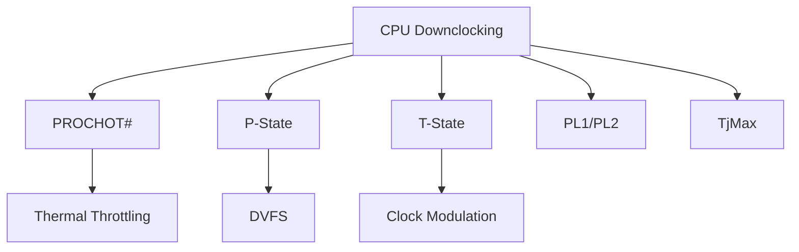

+++
title = "cpu downclocking"
date = "2026-03-14"
weight = 719
+++

# CPU 클럭 다운클럭킹 (안전 모드)

#### 핵심 인사이트 (3줄 요약)
> 1. **본질**: 과열, 전력 초과, 오류 발생 시 CPU 클럭을 낮춰서 안전하게 운영하는 열/전력 관리 메커니즘
> 2. **가치**: 과열 방지, 전력 한계 준수, 시스템 안정성, 하드웨어 보호, 서비스 연속성
> 3. **융합**: PROCHOT#, P-State, T-State, Thermal Throttling, DVFS와 통합된 전력/열 관리 체계

---

### Ⅰ. 개요 (Context & Background)

**개념 정의**

CPU 클럭 다운클럭킹(Downclocking)은 과열, 전력 한계 초과, 또는 오류 발생 시 CPU 동작 클럭을 낮추어 시스템을 안전하게 운영하는 기술입니다. Thermal Throttling, Power Limit, Safety Mode 등이 포함됩니다.

```
┌─────────────────────────────────────────────────────────────────────┐
│                    CPU 클럭 다운클럭킹 시나리오                       │
├─────────────────────────────────────────────────────────────────────┤
│                                                                     │
│   정상 운영                                                         │
│   ┌──────────────────────────────────────────────────────────────┐ │
│   │                                                              │ │
│   │   클럭: 4.0 GHz (Turbo) ─────────────────────────────────►  │ │
│   │   온도: 70°C                                                 │ │
│   │   전력: 200W                                                 │ │
│   │   상태: 정상                                                  │ │
│   │                                                              │ │
│   └──────────────────────────────────────────────────────────────┘ │
│                                │                                    │
│                                │ PROCHOT# (과열)                    │
│                                ▼                                    │
│   Thermal Throttling                                               │
│   ┌──────────────────────────────────────────────────────────────┐ │
│   │                                                              │ │
│   │   클럭: 2.0 GHz ──────────────────────────────────────────► │ │
│   │   온도: 95°C → 85°C (냉각 중)                                │ │
│   │   전력: 100W                                                 │ │
│   │   상태: Thermal Throttling (T-State)                         │ │
│   │                                                              │ │
│   └──────────────────────────────────────────────────────────────┘ │
│                                │                                    │
│                                │ PL2 초과 (전력 한계)               │
│                                ▼                                    │
│   Power Limit Throttling                                           │
│   ┌──────────────────────────────────────────────────────────────┐ │
│   │                                                              │ │
│   │   클럭: 3.0 GHz ──────────────────────────────────────────► │ │
│   │   온도: 75°C                                                 │ │
│   │   전력: 180W (PL1 한계)                                      │ │
│   │   상태: Power Limit (PL2 → PL1)                              │ │
│   │                                                              │ │
│   └──────────────────────────────────────────────────────────────┘ │
│                                │                                    │
│                                │ 심각한 과열 (TjMax 초과)           │
│                                ▼                                    │
│   Clock Modulation (T-State)                                       │
│   ┌──────────────────────────────────────────────────────────────┐ │
│   │                                                              │ │
│   │   클럭: 800 MHz + 50% Duty Cycle ─────────────────────────► │ │
│   │   온도: 100°C → 90°C                                         │ │
│   │   전력: 50W                                                  │ │
│   │   상태: Clock Modulation (T1-T7)                             │ │
│   │                                                              │ │
│   └──────────────────────────────────────────────────────────────┘ │
│                                │                                    │
│                                │ 극심한 과열                        │
│                                ▼                                    │
│   Thermal Shutdown                                                 │
│   ┌──────────────────────────────────────────────────────────────┐ │
│   │                                                              │ │
│   │   클럭: 0 Hz (정지) ───────────────────────────────────────► │ │
│   │   온도: 105°C                                                │ │
│   │   전력: 0W                                                   │ │
│   │   상태: Thermal Trip (Shutdown)                              │ │
│   │                                                              │ │
│   └──────────────────────────────────────────────────────────────┘ │
│                                                                     │
└─────────────────────────────────────────────────────────────────────┘
```

> **해설**: CPU는 정상 → Thermal Throttling → Power Limit → Clock Modulation → Shutdown 순서로 다운클럭킹됩니다. 각 단계는 온도/전력 조건에 따라 자동 전환됩니다.

**💡 비유**: CPU 다운클럭킹은 자동차의 엔진 보호 모드와 같습니다. 과열되면 속도를 줄이고, 심각하면 시동을 끕니다.

**등장 배경**

① **기존 한계**: 과열로 인한 CPU 손상 → 시스템 다운
② **혁신적 패러다임**: 다운클럭킹으로 안전 운영, 서비스 연속성
③ **비즈니스 요구**: 데이터센터 안정성, 하드웨어 보호, 에너지 효율

**📢 섹션 요약 비유**: CPU 다운클럭킹은 자동차 엔진 보호 모드 같아요. 엔진이 뜨거워지면 속도를 줄여서 식혀요.

---

### Ⅱ. 아키텍처 및 핵심 원리 (Deep Dive)

**구성 요소 상세 분석**

| 요소명 | 역할 | 내부 동작 | 비유 |
|:---|:---|:---|:---|
| **TjMax** | 최대 접합 온도 | 100~105°C | 붉은 선 |
| **PROCHOT#** | 프로세서 핫 신호 | 온도 센서 → 스로틀 | 경보 |
| **P-State** | 성능 상태 | P0(최고) ~ Pn(최저) | 기어 |
| **T-State** | 스로틀 상태 | T0(100%) ~ T7(12.5%) | 브레이크 |
| **PL1** | Power Limit 1 | 지속 전력 한계 | 속도 제한 |
| **PL2** | Power Limit 2 | 순간 전력 한계 | 가속 제한 |
| **Duty Cycle** | 클럭 듀티 | ON/OFF 비율 | 펄스 폭 |

**Thermal Throttling 메커니즘**

```
┌─────────────────────────────────────────────────────────────────────┐
│                    Thermal Throttling 메커니즘                       │
├─────────────────────────────────────────────────────────────────────┤
│                                                                     │
│   ┌──────────────────────────────────────────────────────────────┐ │
│   │                    온도 센서 & 제어                           │ │
│   │                                                              │ │
│   │   ┌─────────────────────────────────────────────────────┐    │ │
│   │   │              Digital Thermal Sensor (DTS)            │    │ │
│   │   │                                                     │    │ │
│   │   │   Core 0 Temp: 85°C ───┐                           │    │ │
│   │   │   Core 1 Temp: 87°C ───┼──► Max: 87°C              │    │ │
│   │   │   Core 2 Temp: 84°C ───┤                           │    │ │
│   │   │   Core 3 Temp: 86°C ───┘                           │    │ │
│   │   │                                                     │    │ │
│   │   │   TjMax: 100°C                                      │    │ │
│   │   │   Current Margin: 13°C                              │    │ │
│   │   │                                                     │    │ │
│   │   └─────────────────────────────────────────────────────┘    │ │
│   │                         │                                    │ │
│   │                         ▼                                    │ │
│   │   ┌─────────────────────────────────────────────────────┐    │ │
│   │   │              Throttling Decision                     │    │ │
│   │   │                                                     │    │ │
│   │   │   if (Temp >= TjMax - 5°C):                         │    │ │
│   │   │       // PROCHOT# 활성화                             │    │ │
│   │   │       Enable_Throttling();                          │    │ │
│   │   │       Reduce_PState();                              │    │ │
│   │   │                                                     │    │ │
│   │   │   if (Temp >= TjMax - 2°C):                         │    │ │
│   │   │       // Clock Modulation                           │    │ │
│   │   │       Enable_TState();                              │    │ │
│   │   │       Duty_Cycle = 50%;                             │    │ │
│   │   │                                                     │    │ │
│   │   │   if (Temp >= TjMax):                               │    │ │
│   │   │       // Thermal Trip                               │    │ │
│   │   │       Thermal_Shutdown();                           │    │ │
│   │   │                                                     │    │ │
│   │   └─────────────────────────────────────────────────────┘    │ │
│   │                                                              │ │
│   └──────────────────────────────────────────────────────────────┘ │
│                                                                     │
│   ┌──────────────────────────────────────────────────────────────┐ │
│   │                    T-State (Clock Modulation)                 │ │
│   │                                                              │ │
│   │   ┌─────────────────────────────────────────────────────┐    │ │
│   │   │              Duty Cycle 패턴                         │    │ │
│   │   │                                                     │    │ │
│   │   │   T0: ████████████████████████████████ 100%         │    │ │
│   │   │   T1: ████████████░░░░░░░░░░░░░░░░░░░░  50%         │    │ │
│   │   │   T2: ████████░░░░░░░░████████░░░░░░░░  25%         │    │ │
│   │   │   T3: ████░░░░░░░░░░░░████░░░░░░░░░░░░  12.5%       │    │ │
│   │   │   ...                                              │    │ │
│   │   │   T7: ██░░░░░░░░░░░░░░░░░░░░░░░░░░░░░░  6.25%       │    │ │
│   │   │                                                     │    │ │
│   │   │   █ = Clock ON, ░ = Clock OFF                       │    │ │
│   │   │                                                     │    │ │
│   │   └─────────────────────────────────────────────────────┘    │ │
│   │                                                              │ │
│   └──────────────────────────────────────────────────────────────┘ │
│                                                                     │
└─────────────────────────────────────────────────────────────────────┘
```

> **해설**: DTS(Digital Thermal Sensor)가 온도를 모니터링하고, 임계값 도달 시 P-State 하향, T-State 활성화, 최종적으로 Shutdown을 수행합니다.

**핵심 알고리즘: 다운클럭킹 제어**

```c
// CPU 다운클럭킹 제어 (의사코드)
struct CPU_ThermalControl {
    int32_t current_temp;       // 현재 온도
    int32_t tjmax;              // 최대 온도 (100°C)
    int32_t prochot_threshold;  // PROCHOT 임계값 (TjMax - 5°C)
    int32_t trip_threshold;     // Trip 임계값 (TjMax)
    uint8_t current_pstate;     // 현재 P-State
    uint8_t current_tstate;     // 현재 T-State
    bool    prochot_active;     // PROCHOT# 활성 여부
};

// 온도 모니터링 및 제어
void CPU_ThermalMonitor(struct CPU_ThermalControl *tc) {
    // 1. 모든 코어 온도 읽기
    int32_t max_temp = 0;
    for (int core = 0; core < num_cores; core++) {
        int32_t temp = ReadCoreTemp(core);
        if (temp > max_temp) {
            max_temp = temp;
        }
    }
    tc->current_temp = max_temp;

    // 2. PROCHOT# 확인
    if (max_temp >= tc->prochot_threshold && !tc->prochot_active) {
        tc->prochot_active = true;
        PROCHOT_Assert();  // PROCHOT# 신호 활성화

        // P-State 하향 (클럭 감소)
        if (tc->current_pstate < MAX_PSTATE) {
            tc->current_pstate++;
            SetPState(tc->current_pstate);
        }
    }

    // 3. Clock Modulation (T-State)
    if (max_temp >= tc->tjmax - 2) {
        // 심각한 과열 - Duty Cycle 감소
        uint8_t duty_cycle = CalculateDutyCycle(max_temp, tc->tjmax);

        if (duty_cycle < 100) {
            tc->current_tstate = DutyCycleToTState(duty_cycle);
            EnableClockModulation(tc->current_tstate);
        }
    } else if (tc->current_tstate != T0) {
        // 온도 회복 - T-State 비활성화
        DisableClockModulation();
        tc->current_tstate = T0;
    }

    // 4. Thermal Trip (Shutdown)
    if (max_temp >= tc->trip_threshold) {
        ThermalShutdown();
    }

    // 5. 온도 회복 시 복원
    if (max_temp < tc->prochot_threshold - 5 && tc->prochot_active) {
        tc->prochot_active = false;
        PROCHOT_Deassert();

        // P-State 상향 (클럭 증가)
        if (tc->current_pstate > 0) {
            tc->current_pstate--;
            SetPState(tc->current_pstate);
        }
    }
}

// Duty Cycle 계산
uint8_t CalculateDutyCycle(int32_t temp, int32_t tjmax) {
    int32_t margin = tjmax - temp;

    if (margin >= 5) return 100;    // 정상
    if (margin >= 3) return 75;     // 경미한 과열
    if (margin >= 2) return 50;     // 중간 과열
    if (margin >= 1) return 25;     // 심각한 과열
    return 12.5;                    // 매우 심각
}

// Linux 커널에서 확인
// # cat /sys/devices/system/cpu/cpu0/cpufreq/scaling_cur_freq
// 2000000  (2.0 GHz, 다운클럭됨)
// # cat /sys/class/thermal/thermal_zone0/temp
// 95000    (95°C)
// # cat /sys/class/hwmon/hwmon0/name
// coretemp
// # cat /sys/class/hwmon/hwmon0/temp1_crit
// 100000   (TjMax: 100°C)
```

**📢 섹션 요약 비유**: 다운클럭킹 제어는 자동차의 엔진 보호 컴퓨터와 같습니다. 온도를 감시하고, 뜨거워지면 속도를 줄이고, 심각하면 정지합니다.

---

### Ⅲ. 융합 비교 및 다각도 분석 (Comparison & Synergy)

**기술 비교: P-State vs T-State**

| 비교 항목 | P-State | T-State |
|:---|:---:|:---:|
| **제어 방식** | 주파수/전압 | Duty Cycle |
| **응답 속도** | 느림 (ms) | 빠름 (μs) |
| **성능 저하** | 선형 | 비선형 |
| **전력 절감** | 효과적 | 제한적 |
| **용도** | 일반 전력 관리 | 긴급 과열 대응 |

**과목 융합 관점: 다운클럭킹과 타 영역 시너지**

| 융합 영역 | 시너지 효과 | 구현 예시 |
|:---|:---|:---|
| **OS (운영체제)** | cpufreq 드라이버 | acpi-cpufreq |
| **전력** | DVFS 통합 | P-State 관리 |
| **냉각** | 팬 제어 연동 | 온도-팬 곡선 |
| **가상화** | VM 스로틀링 | cgroups |
| **클라우드** | 인스턴스 성능 조정 | T2/T3 Unlimited |

**📢 섹션 요약 비유**: P-State는 기어 변속, T-State는 브레이크 펌핑과 같습니다. P-State는 점진적이고, T-State는 긴급합니다.

---

### Ⅳ. 실무 적용 및 기술사적 판단 (Strategy & Decision)

**실무 시나리오별 적용**

**시나리오 1: 서버 과열**
- **문제**: 데이터센터 냉각 실패로 서버 과열
- **해결**: 다운클럭킹으로 온도 제어
- **의사결정**: 80°C 이상 시 성능 감소 허용

**시나리오 2: 노트북 배터리**
- **문제**: 배터리 부족 시 성능 유지
- **해결**: 다운클럭킹으로 전력 절약
- **의사결정**: 배터리 20% 이하 시 절전 모드

**시나리오 3: AI 워크로드**
- **문제**: AI 학습으로 지속 고부하
- **해결**: PL1/PL2 튜닝으로 안정화
- **의사결정**: Turbo 지속 시간 조정

**도입 체크리스트**

| 구분 | 항목 | 확인 포인트 |
|:---|:---|:---|
| **기술적** | TjMax | CPU 사양 확인 |
| | BIOS | Thermal 설정 |
| | OS | cpufreq/thermal |
| **운영적** | 모니터링 | 온도/클럭 |
| | 알림 | PROCHOT 알림 |
| | 냉각 | 팬/냉매 확인 |

**안티패턴: 다운클럭킹 오용 사례**

| 안티패턴 | 문제점 | 올바른 접근 |
|:---|:---|:---|
| **Throttling 무시** | 하드웨어 손상 | 즉시 원인 파악 |
| **BIOS Throttle 비활성화** | 과열 위험 | 기본 활성화 |
| **최대 클럭 고정** | 과열/전력 초과 | 동적 조정 |
| **냉각 부족** | 지속 스로틀 | 냉각 강화 |

**📢 섹션 요약 비유**: 다운클럭킹 관리는 자동차 정비와 같습니다. 경고등을 무시하면 엔진이 망가집니다.

---

### Ⅴ. 기대효과 및 결론 (Future & Standard)

**정량/정성 기대효과**

| 구분 | 다운클럭킹 없음 | 다운클럭킹 | 개선효과 |
|:---|:---:|:---:|:---:|
| **하드웨어 수명** | 짧음 | 긺 | 2배 |
| **다운타임** | 많음 | 적음 | 50% 감소 |
| **에너지 효율** | 낮음 | 높음 | 20% 향상 |
| **안정성** | 낮음 | 높음 | 개선 |

**미래 전망**

1. **AI 기반 스로틀링:** ML로 최적 클럭 예측
2. **3D V-Cache:** 열 분산 개선
3. **칩렛 설계:** 핫스팟 감소
4. **액체 냉각:** 더 높은 TDP 허용

**참고 표준**

| 표준 | 내용 | 적용 |
|:---|:---|:---|
| **Intel SDM** | P-State/T-State | Intel CPU |
| **AMD APM** | P-State | AMD CPU |
| **ACPI 6.5** | _PSS, _PPC | 펌웨어 |
| **cpufreq** | Linux 드라이버 | 커널 |

**📢 섹션 요약 비유**: 다운클럭킹의 미래는 AI 기반 엔진 관리와 같습니다. AI가 최적의 속도를 예측하고 자동으로 조정합니다.

---

### 📌 관련 개념 맵 (Knowledge Graph)



**연관 개념 링크**:
- PROCHOT# - 프로세서 핫 시그널
- P-States - 성능 상태
- T-States - 스로틀 상태
- Hardware Health Monitoring - 하드웨어 헬스

---

### 👶 어린이를 위한 3줄 비유 설명

1. **자동차 엔진 보호**: CPU 다운클럭킹은 자동차 엔진 보호 모드 같아요! 엔진이 뜨거워지면 속도를 줄여요.

2. **온도계 체크**: CPU 안에 온도계가 있어요. "너무 뜨거워!" 하면 속도를 줄여서 식혀요.

3. **긴급 정지**: 정말 뜨거우면 멈춰요! 컴퓨터를 꺼서 CPU가 망가지지 않게 보호해요!