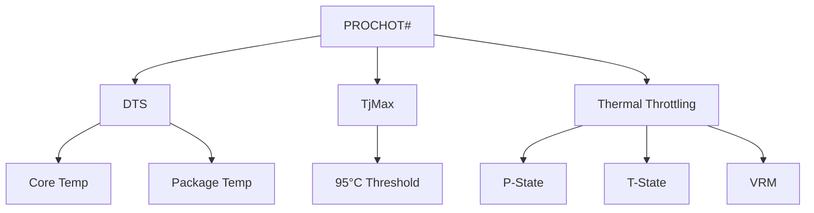

+++
title = "prochot"
date = "2026-03-14"
weight = 720
+++

# PROCHOT# 핀 (Processor Hot Signal)

#### 핵심 인사이트 (3줄 요약)
> 1. **본질**: CPU 온도가 임계값에 도달하면 활성화되는 하드웨어 인터럽트 신호로, 즉각적인 열 스로틀링과 전력 감소를 트리거
> 2. **가치**: CPU 과열 보호, 하드웨어 수명 연장, 시스템 안정성, 무결정성 장애 방지
> 3. **융합**: DTS(Digital Thermal Sensor), Thermal Throttling, P-State/T-State, VRM과 통합된 열 보호 체계

---

### Ⅰ. 개요 (Context & Background)

**개념 정의**

PROCHOT# (Processor Hot)는 Intel/AMD CPU의 물리적 핀으로, CPU 다이(Die) 온도가 설정된 임계값(일반적으로 TjMax - 5°C)에 도달하면 활성화되어 열 스로틀링을 트리거합니다.

```
┌─────────────────────────────────────────────────────────────────────┐
│                    PROCHOT# 신호 흐름                                │
├─────────────────────────────────────────────────────────────────────┤
│                                                                     │
│   ┌──────────────────────────────────────────────────────────────┐ │
│   │                    CPU 다이 (Die)                             │ │
│   │                                                              │ │
│   │   ┌─────────────────────────────────────────────────────┐    │ │
│   │   │              Digital Thermal Sensors (DTS)           │    │ │
│   │   │                                                     │    │ │
│   │   │   Core 0: 87°C  ──┐                               │    │ │
│   │   │   Core 1: 89°C  ──┼──► Maximum: 89°C              │    │ │
│   │   │   Core 2: 86°C  ──┤                               │    │ │
│   │   │   Core 3: 88°C  ──┘                               │    │ │
│   │   │                                                     │    │ │
│   │   │   TjMax: 100°C                                     │    │ │
│   │   │   PROCHOT# Threshold: 95°C                         │    │ │
│   │   │                                                     │    │ │
│   │   └─────────────────────────────────────────────────────┘    │ │
│   │                         │                                    │ │
│   │                         │ 89°C < 95°C (미도달)               │ │
│   │                         ▼                                    │ │
│   │   ┌─────────────────────────────────────────────────────┐    │ │
│   │   │              PROCHOT# Logic                          │    │ │
│   │   │                                                     │    │ │
│   │   │   if (Max_Temp >= PROCHOT_Threshold) {              │    │ │
│   │   │       PROCHOT# = ACTIVE (LOW);                      │    │ │
│   │   │       Trigger_Thermal_Throttling();                 │    │ │
│   │   │   } else {                                          │    │ │
│   │   │       PROCHOT# = INACTIVE (HIGH);                   │    │ │
│   │   │   }                                                 │    │ │
│   │   │                                                     │    │ │
│   │   └─────────────────────────────────────────────────────┘    │ │
│   │                         │                                    │ │
│   └─────────────────────────┼────────────────────────────────────┘ │
│                             │                                      │
│                             │ PROCHOT# 핀 (물리적 신호)            │
│                             ▼                                      │
│   ┌──────────────────────────────────────────────────────────────┐ │
│   │                    VRM (전압 조정 모듈)                        │ │
│   │                                                              │ │
│   │   PROCHOT# ACTIVE 시:                                        │ │
│   │   - Vcore 전압 감소                                          │ │
│   │   - 전류 제한                                                │ │
│   │   - 전력 감소                                                │ │
│   │                                                              │ │
│   └──────────────────────────────────────────────────────────────┘ │
│                             │                                      │
│                             │                                      │
│                             ▼                                      │
│   ┌──────────────────────────────────────────────────────────────┐ │
│   │                    Thermal Throttling                         │ │
│   │                                                              │ │
│   │   PROCHOT# ACTIVE 시 자동 수행:                               │ │
│   │                                                              │ │
│   │   ┌─────────────────────────────────────────────────────┐    │ │
│   │   │              1. P-State 하향                         │    │ │
│   │   │   4.0 GHz → 3.0 GHz → 2.0 GHz → 800 MHz             │    │ │
│   │   └─────────────────────────────────────────────────────┘    │ │
│   │                                                              │ │
│   │   ┌─────────────────────────────────────────────────────┐    │ │
│   │   │              2. T-State 활성화                       │    │ │
│   │   │   Duty Cycle: 100% → 50% → 25% → 12.5%              │    │ │
│   │   └─────────────────────────────────────────────────────┘    │ │
│   │                                                              │ │
│   │   ┌─────────────────────────────────────────────────────┐    │ │
│   │   │              3. 전압 감소                            │    │ │
│   │   │   Vcore: 1.3V → 1.2V → 1.0V → 0.8V                  │    │ │
│   │   └─────────────────────────────────────────────────────┘    │ │
│   │                                                              │ │
│   └──────────────────────────────────────────────────────────────┘ │
│                                                                     │
└─────────────────────────────────────────────────────────────────────┘
```

> **해설**: DTS가 최대 온도를 측정하고, 임계값 도달 시 PROCHOT# 핀이 Active(Low)가 됩니다. 이는 VRM 전압 감소와 Thermal Throttling을 트리거합니다.

**💡 비유**: PROCHOT#은 냄비의 안전 밸브와 같습니다. 압력이 높아지면(온도 상승) 밸브가 열려서(신호 활성화) 압력을 낮춥니다(스로틀링).

**등장 배경**

① **기존 한계**: 소프트웨어 기반 온도 관리 → 응답 지연, 과열 손상
② **혁신적 패러다임**: PROCHOT# 하드웨어 신호로 즉각적 보호
③ **비즈니스 요구**: CPU 수명 연장, 시스템 안정성, 무결정성 방지

**📢 섹션 요약 비유**: PROCHOT#은 압력밥솥의 안전 밸브 같아요! 압력이 높아지면 밸브가 열려서 폭발을 막아요.

---

### Ⅱ. 아키텍처 및 핵심 원리 (Deep Dive)

**구성 요소 상세 분석**

| 요소명 | 역할 | 내부 동작 | 레지스터/핀 | 비유 |
|:---|:---|:---|:---|:---|
| **DTS** | 온도 센서 | 디지털 온도 측정 | MSR 0x19C | 온도계 |
| **TjMax** | 최대 접합 온도 | 100~105°C | MSR | 붉은 선 |
| **PROCHOT#** | 핫 신호 핀 | Active Low | 물리적 핀 | 안전 밸브 |
| **PROCHOT Override** | BIOS 제어 | 임계값 조정 | MSR 0x1FC | 설정 |
| **VRM** | 전압 조정 | Vcore 감소 | VRM 레지스터 | 스위치 |

**PROCHOT# 관련 MSR 레지스터**

```
┌─────────────────────────────────────────────────────────────────────┐
│                    PROCHOT# 관련 MSR 레지스터                        │
├─────────────────────────────────────────────────────────────────────┤
│                                                                     │
│   1. IA32_THERM_STATUS (0x19C) - Thermal Status                    │
│   ┌──────────────────────────────────────────────────────────────┐ │
│   │   Bit 0: Thermal Status (RO)                                 │ │
│   │          0 = 온도 정상                                        │ │
│   │          1 = 온도 임계값 도달                                 │ │
│   │                                                              │ │
│   │   Bit 1: Thermal Status Log (R/WC)                           │ │
│   │          과열 이력                                            │ │
│   │                                                              │ │
│   │   Bit 2: PROCHOT or FORCEPR Event (RO)                       │ │
│   │          PROCHOT# 활성화 이력                                 │ │
│   │                                                              │ │
│   │   Bit 3: PROCHOT or FORCEPR Log (R/WC)                       │ │
│   │          PROCHOT# 로그                                        │ │
│   │                                                              │ │
│   │   Bit 4: Critical Temperature (RO)                           │ │
│   │          심각한 과열 상태                                      │ │
│   └──────────────────────────────────────────────────────────────┘ │
│                                                                     │
│   2. IA32_TEMPERATURE_TARGET (0x1A2) - TjMax 설정                  │
│   ┌──────────────────────────────────────────────────────────────┐ │
│   │   Bits 16-23: Temperature Target (TjMax)                     │ │
│   │               기본값: 100°C (CPU마다 다름)                    │ │
│   │                                                              │ │
│   │   Bits 24-29: Target Offset                                  │ │
│   │               PROCHOT# 임계값 오프셋                          │ │
│   │               예: TjMax - 5°C = 95°C                         │ │
│   └──────────────────────────────────────────────────────────────┘ │
│                                                                     │
│   3. IA32_PACKAGE_THERM_STATUS (0x1B1) - Package Thermal Status    │
│   ┌──────────────────────────────────────────────────────────────┐ │
│   │   Bit 0: Pkg Thermal Status                                  │ │
│   │   Bit 6: Pkg PROCHOT Event                                   │ │
│   └──────────────────────────────────────────────────────────────┘ │
│                                                                     │
│   4. MSR_IA32_THERM_INTERRUPT (0x19B) - Thermal Interrupt          │
│   ┌──────────────────────────────────────────────────────────────┐ │
│   │   Bit 0: High Temperature Interrupt Enable                   │ │
│   │   Bit 1: Low Temperature Interrupt Enable                    │ │
│   │   Bit 2: PROCHOT Interrupt Enable                            │ │
│   │   Bits 8-14: Threshold #1 Value                              │ │
│   │   Bits 16-22: Threshold #2 Value                             │ │
│   └──────────────────────────────────────────────────────────────┘ │
│                                                                     │
└─────────────────────────────────────────────────────────────────────┘
```

> **해설**: MSR 레지스터로 PROCHOT# 상태, TjMax 설정, 인터럽트 활성화를 제어합니다. BIOS와 OS가 협력하여 열 관리를 수행합니다.

**핵심 알고리즘: PROCHOT# 처리**

```c
// PROCHOT# 처리 (의사코드)
struct PROCHOT_Control {
    uint32_t tjmax;              // 최대 온도
    uint32_t prochot_threshold;  // PROCHOT 임계값
    bool     prochot_active;     // 현재 상태
    uint32_t prochot_count;      // 발생 횟수
};

// PROCHOT# 상태 확인
void PROCHOT_Monitor(struct PROCHOT_Control *ctrl) {
    uint64_t therm_status;
    uint64_t pkg_therm_status;

    // 1. 코어별 온도 읽기
    int32_t max_temp = 0;
    for (int core = 0; core < num_cores; core++) {
        uint64_t msr = rdmsr_on_cpu(MSR_IA32_THERM_STATUS, core);
        int32_t temp = ctrl->tjmax - ((msr >> 16) & 0x7F);
        if (temp > max_temp) {
            max_temp = temp;
        }
    }

    // 2. PROCHOT# 상태 확인
    therm_status = rdmsr(MSR_IA32_THERM_STATUS);
    pkg_therm_status = rdmsr(MSR_IA32_PACKAGE_THERM_STATUS);

    bool prochot_event = (therm_status & THERM_STATUS_PROCHOT) ||
                         (pkg_therm_status & PKG_THERM_STATUS_PROCHOT);

    if (prochot_event && !ctrl->prochot_active) {
        // PROCHOT# 활성화
        ctrl->prochot_active = true;
        ctrl->prochot_count++;

        // 로그
        printk(KERN_WARNING
            "PROCHOT#: CPU at %d°C, thermal throttling started\n",
            max_temp);

        // 즉각적 조치
        PROCHOT_HandleActive(ctrl);
    } else if (!prochot_event && ctrl->prochot_active) {
        // PROCHOT# 비활성화
        ctrl->prochot_active = false;

        printk(KERN_INFO
            "PROCHOT#: CPU at %d°C, thermal throttling stopped\n",
            max_temp);

        // 정상 복귀
        PROCHOT_HandleInactive(ctrl);
    }

    // 3. 로그 클리어 (Write 1 to clear)
    if (therm_status & THERM_STATUS_PROCHOT_LOG) {
        wrmsr(MSR_IA32_THERM_STATUS, therm_status | THERM_STATUS_PROCHOT_LOG);
    }
}

// PROCHOT# 활성 시 조치
void PROCHOT_HandleActive(struct PROCHOT_Control *ctrl) {
    // 1. P-State 하향
    cpufreq_driver_target(policy, min_freq, CPUFREQ_RELATION_L);

    // 2. 인텔 스피드스텝 활성화
    // (BIOS/OS가 자동으로 낮은 P-State 선택)

    // 3. T-State 활성화 (필요시)
    if (ctrl->prochot_count > 3) {
        // 반복 PROCHOT# 시 더 강력한 스로틀링
        EnableClockModulation(T1);  // 50% duty cycle
    }

    // 4. 팬 속도 최대
    SetFanSpeed(FAN_MAX);

    // 5. 알림
    SendThermalAlert(ctrl);
}

// Linux에서 확인
// # cat /sys/class/hwmon/hwmon0/temp1_input
// 95000    (95°C)
// # cat /sys/class/hwmon/hwmon0/temp1_crit
// 100000   (TjMax: 100°C)
// # rdmsr -p0 0x19C
// 0x80000000  (Bit 2: PROCHOT Event)

// Intel RAPL (Running Average Power Limit)
// # cat /sys/class/powercap/intel-rapl/intel-rapl:0/energy_uj
// 1234567890
```

**📢 섹션 요약 비유**: PROCHOT# 처리는 화재 경보 시스템과 같습니다. 경보가 울리면(활성화) 소방수(스로틀링)가 출동하고, 불이 꺼지면(비활성화) 복귀합니다.

---

### Ⅲ. 융합 비교 및 다각도 분석 (Comparison & Synergy)

**기술 비교: 열 관리 신호**

| 비교 항목 | PROCHOT# | FORCEPR# | THERMTRIP# |
|:---|:---:|:---:|:---:|
| **임계값** | TjMax - 5°C | 외부 설정 | TjMax |
| **응답** | 스로틀링 | 전력 제한 | Shutdown |
| **복구** | 자동 | 자동 | 수동 |
| **용도** | 일반 과열 | 플랫폼 제한 | 긴급 보호 |

**과목 융합 관점: PROCHOT#와 타 영역 시너지**

| 융합 영역 | 시너지 효과 | 구현 예시 |
|:---|:---|:---|
| **OS (운영체제)** | Thermal 드라이버 | Linux therm_throt |
| **전력** | VRM 연동 | Vcore 감소 |
| **냉각** | 팬 제어 | 온도-팬 곡선 |
| **가상화** | VM 성능 영향 | cgroups |
| **임베디드** | 저전력 모드 | ARM HotPlug |

**📢 섹션 요약 비유**: PROCHOT#은 1단계 경보, FORCEPR#은 2단계, THERMTRIP#은 비상 정지와 같습니다.

---

### Ⅳ. 실무 적용 및 기술사적 판단 (Strategy & Decision)

**실무 시나리오별 적용**

**시나리오 1: 데이터센터 과열**
- **문제**: 냉각 시스템 장애로 서버 과열
- **해결**: PROCHOT#으로 자동 스로틀링
- **의사결정**: 95°C에서 성능 50% 감소 허용

**시나리오 2: 오버클러킹**
- **문제**: 오버클러킹 시 PROCHOT# 빈번
- **해결**: 냉각 강화 또는 전압/클럭 조정
- **의사결정**: 수랭 냉각 또는 설정 완화

**시나리오 3: 노트북**
- **문제**: 노트북 팬 소음/발열
- **해결**: PROCHOT# 임계값 조정
- **의사결정**: 성능 vs 발열 트레이드오프

**도입 체크리스트**

| 구분 | 항목 | 확인 포인트 |
|:---|:---|:---|
| **기술적** | TjMax | CPU 사양 확인 |
| | PROCHOT# | BIOS 활성화 |
| | 로그 | MSR 읽기 |
| **운영적** | 모니터링 | 온도/PROCHOT# |
| | 냉각 | 팬/방열판 |
| | 알림 | 온도 임계값 |

**안티패턴: PROCHOT# 오용 사례**

| 안티패턴 | 문제점 | 올바른 접근 |
|:---|:---|:---|
| **PROCHOT# 비활성화** | 과열 손상 | 활성화 유지 |
| **임계값 상향** | 하드웨어 손상 | 권장값 유지 |
| **로그 무시** | 장애 누적 | 정기 확인 |
| **냉각 부족** | 지속 스로틀 | 냉각 강화 |

**📢 섹션 요약 비유**: PROCHOT# 관리는 화재 예방과 같습니다. 경보를 무시하면 건물이 불타듯, PROCHOT#을 무시하면 CPU가 망가집니다.

---

### Ⅴ. 기대효과 및 결론 (Future & Standard)

**정량/정성 기대효과**

| 구분 | PROCHOT# 미사용 | PROCHOT# 사용 | 개선효과 |
|:---|:---:|:---:|:---:|
| **CPU 수명** | 짧음 | 긺 | 2배 |
| **다운타임** | 많음 | 적음 | 80% 감소 |
| **성능 유지** | 낮음 | 높음 | 개선 |
| **안정성** | 낮음 | 높음 | 향상 |

**미래 전망**

1. **AI 기반 열 관리:** ML로 최적 스로틀링
2. **3D 적층:** 핫스팟 감소
3. **칩렛 설계:** 분산 열 발생
4. **액체 냉각:** 더 높은 TDP 허용

**참고 표준**

| 표준 | 내용 | 적용 |
|:---|:---|:---|
| **Intel SDM Vol 3B** | MSR 레지스터 | Intel CPU |
| **AMD APM** | PROCHOT# | AMD CPU |
| **ACPI 6.5** | _TMP, _CRT | 펌웨어 |
| **Linux thermal** | therm_throt | 커널 |

**📢 섹션 요약 비유**: PROCHOT#의 미래는 스마트 화재 경보와 같습니다. AI가 화재를 예측하고 미리 예방합니다.

---

### 📌 관련 개념 맵 (Knowledge Graph)



**연관 개념 링크**:
- CPU Downclocking - 클럭 다운클럭킹
- P-States - 성능 상태
- T-States - 스로틀 상태
- ACPI S-States - 절전 상태

---

### 👶 어린이를 위한 3줄 비유 설명

1. **압력밥솥 밸브**: PROCHOT#은 압력밥솥의 안전 밸브 같아요! 압력이 높으면 밸브가 열려요.

2. **온도 경보**: CPU 안에 온도계가 있어요. "너무 뜨거워!" 하면 PROCHOT# 신호를 보내요.

3. **속도 줄이기**: 신호를 받으면 CPU가 속도를 줄여요. 식으면서 다시 빨라질 수 있어요!