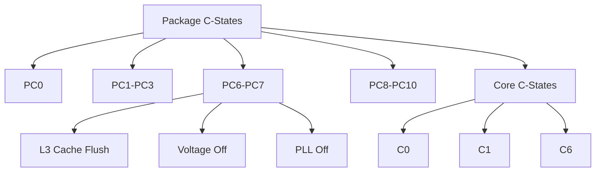

+++
title = "package cstates"
date = "2026-03-14"
weight = 721
+++

# 패키지 C-States (Package C-States)

#### 핵심 인사이트 (3줄 요약)
> 1. **본질**: CPU 패키지(소켓) 전체의 절전 상태로, 모든 코어가 유휴 시 패키지 레벨에서 전력/클럭을 단계적으로 차단
> 2. **가치**: 패키지 레벨 전력 절감, 열 발생 감소, 에너지 효율 향상, 대용량 서버 전력 최적화
> 3. **융합**: 코어 C-States, P-States, ACPI, Intel Speed Shift, AMD CoolCore와 통합된 계층적 전력 관리

---

### Ⅰ. 개요 (Context & Background)

**개념 정의**

패키지 C-States(Package C-States)는 CPU 패키지 전체의 절전 상태입니다. 모든 코어가 유휴 상태가 되면 코어 레벨을 넘어 패키지 레벨에서 전력, 클럭, 전압을 단계적으로 차단하여 더 깊은 절전을 달성합니다.

```
┌─────────────────────────────────────────────────────────────────────┐
│                    패키지 C-States 계층 구조                         │
├─────────────────────────────────────────────────────────────────────┤
│                                                                     │
│   ┌──────────────────────────────────────────────────────────────┐ │
│   │                    CPU 패키지 (Socket)                        │ │
│   │                                                              │ │
│   │   ┌─────────────────────────────────────────────────────┐    │ │
│   │   │              Package C-States                        │    │ │
│   │   │                                                     │    │ │
│   │   │   PC0: 활성 (Active)                                │    │ │
│   │   │        모든 코어 활성, 최대 전력                      │    │ │
│   │   │                                                     │    │ │
│   │   │   PC1 ~ PC3: 경량 절전                               │    │ │
│   │   │        클럭 게이팅, 일부 PLL 오프                    │    │ │
│   │   │                                                     │    │ │
│   │   │   PC6: 깊은 절전 (Deep)                              │    │ │
│   │   │        캐시 플러시, 전압 오프, 상태 저장              │    │ │
│   │   │                                                     │    │ │
│   │   │   PC7: 더 깊은 절전 (Deeper)                         │    │ │
│   │   │        모든 전압 오프, 상태 저장                      │    │ │
│   │   │                                                     │    │ │
│   │   │   PC8 ~ PC10: 최대 절전                              │    │ │
│   │   │        플랫폼 레벨 절전, 깨어남 지연                   │    │ │
│   │   │                                                     │    │ │
│   │   └─────────────────────────────────────────────────────┘    │ │
│   │                         │                                    │ │
│   │                         ▼                                    │ │
│   │   ┌─────────────────────────────────────────────────────┐    │ │
│   │   │              Core C-States (개별 코어)               │    │ │
│   │   │                                                     │    │ │
│   │   │   Core 0: C0 ──┐                                    │    │ │
│   │   │   Core 1: C6   │──► 모든 코어 C6 → Package C6       │    │ │
│   │   │   Core 2: C6   │                                    │    │ │
│   │   │   Core 3: C6 ──┘                                    │    │ │
│   │   │                                                     │    │ │
│   │   └─────────────────────────────────────────────────────┘    │ │
│   │                                                              │ │
│   └──────────────────────────────────────────────────────────────┘ │
│                                                                     │
└─────────────────────────────────────────────────────────────────────┘
```

> **해설**: 모든 코어가 깊은 C-State(C6 등)에 진입하면, 패키지도 해당 C-State(PC6 등)로 진입합니다. 패키지 레벨에서 더 많은 전력을 절감합니다.

**💡 비유**: 패키지 C-States는 건물 전체의 소등과 같습니다. 모든 방(코어)이 비면 건물 전체(패키지)의 전기를 끕니다.

**등장 배경**

① **기존 한계**: 코어 레벨 절전만으로 부족 → 패키지 전력 낭비
② **혁신적 패러다임**: 패키지 레벨 절전으로 전력 절감 극대화
③ **비즈니스 요구**: 데이터센터 전력 비용, 모바일 배터리 수명

**📢 섹션 요약 비유**: 패키지 C-States는 건물 전체 소등 같아요. 모든 방이 비면 건물 전체 전기를 꺼요.

---

### Ⅱ. 아키텍처 및 핵심 원리 (Deep Dive)

**구성 요소 상세 분석**

| C-State | 명칭 | 전력 차단 | 복귀 시간 | 비유 |
|:---|:---|:---|:---|:---|
| **PC0** | Active | 없음 | 0μs | 모든 불 켜짐 |
| **PC1** | Halt | Clock Gating | ~1μs | 복도 소등 |
| **PC2** | - | 일부 PLL | ~1μs | 일부 소등 |
| **PC3** | Sleep | PLL 오프 | ~10μs | 절반 소등 |
| **PC6** | Deep | 전압 오프, 캐시 저장 | ~100μs | 대부분 소등 |
| **PC7** | Deeper | 전압 오프, 상태 저장 | ~200μs | 거의 소등 |
| **PC8** | - | 플랫폼 절전 | ~1ms | 비상등만 |
| **PC9** | - | 더 깊은 플랫폼 | ~10ms | 최소 전력 |
| **PC10** | - | 최대 절전 | ~100ms | 휴면 |

**패키지 C-State 진입 조건**

```
┌─────────────────────────────────────────────────────────────────────┐
│                    패키지 C-State 진입 조건                          │
├─────────────────────────────────────────────────────────────────────┤
│                                                                     │
│   ┌──────────────────────────────────────────────────────────────┐ │
│   │              Package C-State 진입 로직                        │ │
│   │                                                              │ │
│   │   // 1. 모든 코어의 C-State 확인                             │ │
│   │   min_core_cstate = MIN(core[0].cstate,                      │ │
│   │                         core[1].cstate, ...);                │ │
│   │                                                              │ │
│   │   // 2. 패키지 C-State 결정                                  │ │
│   │   if (min_core_cstate >= C6) {                               │ │
│   │       package_cstate = PC6;                                  │ │
│   │   } else if (min_core_cstate >= C3) {                        │ │
│   │       package_cstate = PC3;                                  │ │
│   │   } else if (min_core_cstate >= C1) {                        │ │
│   │       package_cstate = PC1;                                  │ │
│   │   } else {                                                   │ │
│   │       package_cstate = PC0;  // 활성                         │ │
│   │   }                                                          │ │
│   │                                                              │ │
│   │   // 3. 패키지 C-State 진입                                  │ │
│   │   EnterPackageCState(package_cstate);                        │ │
│   │                                                              │ │
│   └──────────────────────────────────────────────────────────────┘ │
│                                                                     │
│   ┌──────────────────────────────────────────────────────────────┐ │
│   │              PC6 진입 시 하드웨어 동작                        │ │
│   │                                                              │ │
│   │   1. L3 캐시 플러시 (Dirty 라인 메모리 기록)                  │ │
│   │   2. 코어 전압 오프 (Vcc)                                     │ │
│   │   3. PLL 오프 (클럭 생성 중지)                                │ │
│   │   4. IMC(Integrated Memory Controller) 절전                  │ │
│   │   5. 상태 레지스터 저장                                       │ │
│   │                                                              │ │
│   │   PC6 복귀 시:                                               │ │
│   │   1. PLL 온 (클럭 복원)                                      │ │
│   │   2. 전압 온 (Vcc 복원)                                      │ │
│   │   3. L3 캐시 리로드                                          │ │
│   │   4. 상태 레지스터 복원                                       │ │
│   │   5. 실행 재개                                                │ │
│   │                                                              │ │
│   └──────────────────────────────────────────────────────────────┘ │
│                                                                     │
└─────────────────────────────────────────────────────────────────────┘
```

> **해설**: 패키지 C-State는 가장 깊은 코어 C-State에 의해 결정됩니다. PC6 진입 시 L3 캐시 플러시, 전압 오프, PLL 오프가 수행됩니다.

**핵심 알고리즘: 패키지 C-State 관리**

```c
// 패키지 C-State 관리 (의사코드)
struct PackageCState {
    uint8_t  current_state;     // 현재 패키지 C-State
    uint64_t residency[10];     // 각 상태별 체류 시간
    uint64_t entry_count[10];   // 각 상태별 진입 횟수
};

// 패키지 C-State 진입
void EnterPackageCState(uint8_t target_state) {
    switch (target_state) {
        case PC1:
            // Clock Gating만
            EnableClockGating();
            break;

        case PC3:
            // PLL 오프
            FlushL3Cache();
            DisablePLL();
            break;

        case PC6:
            // Deep Power Down
            FlushL3Cache();
            SaveCoreContext();
            DisableCoreVoltage();
            DisablePLL();
            EnablePowerGating();
            break;

        case PC7:
            // Deeper Power Down
            FlushL3Cache();
            SavePackageContext();
            DisablePackageVoltage();
            break;
    }

    // Package C-State 카운터 증가
    pkg_cstate.entry_count[target_state]++;
}

// Linux에서 패키지 C-State 확인
// # cat /sys/devices/system/cpu/cpu0/cpuidle/state*/name
// POLL
// C1
// C1E
// C3
// C6
// C7s
// C8
//
// # cat /sys/devices/system/cpu/cpuidle/low_latency
// 1
//
// # turbostat --debug
// ... PkgWatt  RAMWatt  PKG_%pc2  PKG_%pc3  PKG_%pc6  PKG_%pc7  ...
// ...  12.5     3.2      15.2      0.0       42.1      5.3       ...
```

**📢 섹션 요약 비유**: 패키지 C-State 관리는 건물 관리자가 전체 소등을 결정하는 것과 같습니다. 모든 방이 비면 건물 전체를 끕니다.

---

### Ⅲ. 융합 비교 및 다각도 분석 (Comparison & Synergy)

**기술 비교: 코어 C-State vs 패키지 C-State**

| 비교 항목 | 코어 C-State | 패키지 C-State |
|:---|:---:|:---:|
| **범위** | 개별 코어 | 전체 패키지 |
| **전력 절감** | 코어만 | 패키지 전체 |
| **진입 조건** | 단일 코어 유휴 | 모든 코어 유휴 |
| **복귀 시간** | 빠름 | 느림 |
| **의존성** | 독립 | 코어 C-State |

**과목 융합 관점: 패키지 C-State와 타 영역 시너지**

| 융합 영역 | 시너지 효과 | 구현 예시 |
|:---|:---|:---|
| **OS (운영체제)** | cpuidle 드라이버 | intel_idle |
| **전력** | 전력 예산 관리 | RAPL |
| **냉각** | 발열 감소 | 팬 속도 조절 |
| **가상화** | VM 스케줄링 | cgroups |
| **클라우드** | 인스턴스 절전 | AWS T3 |

**📢 섹션 요약 비유**: 코어 C-State는 방 소등, 패키지 C-State는 건물 전체 소등과 같습니다. 건물 전체를 끄면 더 많이 절약하지만 켜는 데 시간이 걸립니다.

---

### Ⅳ. 실무 적용 및 기술사적 판단 (Strategy & Decision)

**실무 시나리오별 적용**

**시나리오 1: 웹 서버**
- **문제**: 요청 간 유휴 시간 많음
- **해결**: PC6 적극 활용
- **의사결정**: 저지연 vs 절전 트레이드오프

**시나리오 2: HPC 워크로드**
- **문제**: PC6 진입으로 지연 발생
- **해결**: PC1까지만 허용
- **의사결정**: 성능 우선

**시나리오 3: 모바일**
- **문제**: 배터리 수명 중요
- **해결**: PC7+ 적극 활용
- **의사결정**: 절전 우선

**도입 체크리스트**

| 구분 | 항목 | 확인 포인트 |
|:---|:---|:---|
| **기술적** | BIOS | C-State 활성화 |
| | OS | intel_idle 로드 |
| | 레이턴시 | 워크로드 허용 범위 |
| **운영적** | 모니터링 | turbostat |
| | 튜닝 | C-State 제한 |
| | 전력 | PkgWatt 확인 |

**안티패턴: 패키지 C-State 오용 사례**

| 안티패턴 | 문제점 | 올바른 접근 |
|:---|:---|:---|
| **C-State 비활성화** | 전력 낭비 | 워크로드에 맞게 |
| **지나친 깊은 C-State** | 지연 증가 | 레이턴시 고려 |
| **균등 분배** | 비효율 | 코어 바인딩 |
| **모니터링 부재** | 튜닝 불가 | turbostat 사용 |

**📢 섹션 요약 비유**: 패키지 C-State 튜닝은 건물 에너지 관리와 같습니다. 용도에 따라 소등 수준을 조절해야 합니다.

---

### Ⅴ. 기대효과 및 결론 (Future & Standard)

**정량/정성 기대효과**

| 구분 | C-State 미사용 | 패키지 C-State | 개선효과 |
|:---|:---:|:---:|:---:|
| **대기 전력** | 100W | 30W | 70% 절감 |
| **발열** | 높음 | 낮음 | 감소 |
| **지연** | 없음 | 일부 | 트레이드오프 |
| **배터리** | 짧음 | 긺 | 2배 |

**미래 전망**

1. **Intel Speed Shift:** OS 대신 HW 제어
2. **AMD CoolCore:** 유사한 패키지 절전
3. **ARM DynamIQ:** 클러스터 절전
4. **AI 기반 관리:** ML로 최적 C-State 예측

**참고 표준**

| 표준 | 내용 | 적용 |
|:---|:---|:---|
| **Intel SDM** | Package C-State | Intel CPU |
| **ACPI 6.5** | _CST, _CWS | 펌웨어 |
| **Linux intel_idle** | 드라이버 | 커널 |
| **turbostat** | 모니터링 | 도구 |

**📢 섹션 요약 비유**: 패키지 C-State의 미래는 스마트 건물 에너지 관리와 같습니다. AI가 자동으로 최적의 소등 수준을 결정합니다.

---

### 📌 관련 개념 맵 (Knowledge Graph)



**연관 개념 링크**:
- Core C-States - 코어 절전 상태
- P-States - 성능 상태
- T-States - 스로틀 상태
- ACPI S-States - 시스템 절전

---

### 👶 어린이를 위한 3줄 비유 설명

1. **건물 소등**: 패키지 C-States는 건물 전체 소등 같아요. 모든 방이 비면 건물 전체 전기를 꺼요.

2. **깊은 잠**: PC6, PC7은 아주 깊은 잠이에요. 많이 절약하지만 깨우는 데 시간이 걸려요.

3. **깨어나기**: 중요한 일이 있으면 바로 깨어나요. PC1은 가볍게 졸고, PC6은 푹 자요!