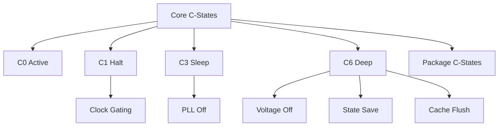

+++
title = "core cstates"
date = "2026-03-14"
weight = 722
+++

# 코어 C-States (Core C-States)

#### 핵심 인사이트 (3줄 요약)
> 1. **본질**: 개별 CPU 코어의 절전 상태로, 유휴 시 클럭 게이팅, 전압 차단, 상태 저장을 단계적으로 수행
> 2. **가치**: 코어 레벨 전력 절감, 발열 감소, 배터리 수명 연장, 워크로드별 세밀한 전력 제어
> 3. **융합**: 패키지 C-States, P-States, ACPI, Intel C6, AMD Core C6과 통합된 계층적 전력 관리

---

### Ⅰ. 개요 (Context & Background)

**개념 정의**

코어 C-States(Core C-States)는 개별 CPU 코어의 절전 상태입니다. 코어가 유휴 상태가 되면 단계적으로 클럭 게이팅, 전압 차단, 상태 저장을 수행하여 전력을 절감합니다.

```
┌─────────────────────────────────────────────────────────────────────┐
│                    코어 C-States 계층 구조                           │
├─────────────────────────────────────────────────────────────────────┤
│                                                                     │
│   ┌──────────────────────────────────────────────────────────────┐ │
│   │                    Core C-States                              │ │
│   │                                                              │ │
│   │   ┌─────────────────────────────────────────────────────┐    │ │
│   │   │   C0: 활성 (Active)                                 │    │ │
│   │   │       - 모든 기능 활성                              │    │ │
│   │   │       - 최대 전력 소비                               │    │ │
│   │   │       - 명령어 실행 중                               │    │ │
│   │   │              ▲                                       │    │ │
│   │   │              │ 깨어남                                │    │ │
│   │   │   ┌──────────┴────────────────────────────────────┐ │    │ │
│   │   │   │   C1: Halt (클럭 정지)                         │ │    │ │
│   │   │   │       - 클럭 게이팅                             │ │    │ │
│   │   │   │       - ~1μs 복귀                               │ │    │ │
│   │   │   │       - 전압 유지                               │ │    │ │
│   │   │   │              ▲                                  │ │    │ │
│   │   │   │              │                                  │ │    │ │
│   │   │   │   ┌──────────┴────────────────────────────┐   │ │    │ │
│   │   │   │   │   C1E: Enhanced Halt                   │   │ │    │ │
│   │   │   │   │       - 클럭 게이팅 + 전압 감소         │   │ │    │ │
│   │   │   │   │       - ~1μs 복귀                       │   │ │    │ │
│   │   │   │   │              ▲                          │   │ │    │ │
│   │   │   │   │              │                          │   │ │    │ │
│   │   │   │   │   ┌──────────┴────────────────────┐    │   │ │    │ │
│   │   │   │   │   │   C3: Sleep                    │    │   │ │    │ │
│   │   │   │   │   │       - PLL 오프               │    │   │ │    │ │
│   │   │   │   │   │       - ~10μs 복귀             │    │   │ │    │ │
│   │   │   │   │   │       - L1/L2 유지             │    │   │ │    │ │
│   │   │   │   │   │              ▲                 │    │   │ │    │ │
│   │   │   │   │   │              │                 │    │   │ │    │ │
│   │   │   │   │   │   ┌──────────┴────────────┐    │    │   │ │    │ │
│   │   │   │   │   │   │   C6: Deep Power Down │    │    │   │ │    │ │
│   │   │   │   │   │   │       - 전압 오프      │    │    │   │ │    │ │
│   │   │   │   │   │   │       - 상태 저장      │    │    │   │ │    │ │
│   │   │   │   │   │   │       - ~100μs 복귀    │    │    │   │ │    │ │
│   │   │   │   │   │   │       - L1/L2 플러시   │    │    │   │ │    │ │
│   │   │   │   │   │   │              ▲         │    │    │   │ │    │ │
│   │   │   │   │   │   │              │         │    │    │   │ │    │ │
│   │   │   │   │   │   │   ┌──────────┴─────┐    │    │    │   │ │    │ │
│   │   │   │   │   │   │   │   C7: Deeper   │    │    │    │   │ │    │ │
│   │   │   │   │   │   │   │   C8: SoC      │    │    │    │   │ │    │ │
│   │   │   │   │   │   │   │   C9/C10: 최대 │    │    │    │   │ │    │ │
│   │   │   │   │   │   │   └────────────────┘    │    │    │   │ │    │ │
│   │   │   │   │   │   └─────────────────────────┘    │    │   │ │    │ │
│   │   │   │   │   └──────────────────────────────────┘    │   │ │    │ │
│   │   │   │   └───────────────────────────────────────────┘   │ │    │ │
│   │   │   └────────────────────────────────────────────────────┘ │ │
│   │   │                                                          │ │
│   │   └──────────────────────────────────────────────────────────┘ │
│   │                                                              │ │
│   │   전력 소비: C0 > C1 > C1E > C3 > C6 > C7 > C10               │ │
│   │   복귀 시간: C0 < C1 < C1E < C3 < C6 < C7 < C10               │ │
│   │                                                              │ │
│   └──────────────────────────────────────────────────────────────┘ │
│                                                                     │
└─────────────────────────────────────────────────────────────────────┘
```

> **해설**: C0은 활성 상태, C1은 클럭 정지, C6은 전압 오프+상태 저장입니다. 깊은 C-State일수록 전력 절감은 크지만 복귀 시간도 깁니다.

**💡 비유**: 코어 C-States는 사람의 수면 단계와 같습니다. C0은 깨어있는 상태, C1은 낮잠, C6은 깊은 잠, C7+는 혼수 상태입니다.

**등장 배경**

① **기존 한계**: 유휴 코어도 전력 소비 → 전력 낭비
② **혁신적 패러다임**: 코어 레벨 절전으로 전력 절감
③ **비즈니스 요구**: 모바일 배터리, 데이터센터 전력 비용

**📢 섹션 요약 비유**: 코어 C-States는 사람의 수면 단계 같아요. C0은 깨어있고, C6은 깊은 잠이에요.

---

### Ⅱ. 아키텍처 및 핵심 원리 (Deep Dive)

**구성 요소 상세 분석**

| C-State | 명칭 | 전력 차단 | 복귀 시간 | 상태 저장 | 비유 |
|:---|:---|:---|:---|:---|:---|
| **C0** | Active | 없음 | 0μs | 없음 | 깨어있음 |
| **C1** | Halt | Clock Gating | ~1μs | 없음 | 눈 감음 |
| **C1E** | Enhanced Halt | Clock + Voltage | ~1μs | 없음 | 졸음 |
| **C3** | Sleep | PLL Off | ~10μs | L1 유지 | 낮잠 |
| **C6** | Deep Power Down | Voltage Off | ~100μs | L1/L2 저장 | 깊은 잠 |
| **C7** | Deeper | + Cache Flush | ~200μs | 전체 저장 | 혼수 |
| **C8** | SoC | + PLL Off | ~300μs | 전체 저장 | 깊은 혼수 |
| **C9** | - | + More | ~500μs | 전체 저장 | 매우 깊음 |
| **C10** | - | Maximum | ~1ms | 전체 저장 | 최대 절전 |

**C6 진입/복귀 시퀀스**

```
┌─────────────────────────────────────────────────────────────────────┐
│                    C6 진입 및 복귀 시퀀스                            │
├─────────────────────────────────────────────────────────────────────┤
│                                                                     │
│   C6 진입 (Enter C6)                                                │
│   ┌──────────────────────────────────────────────────────────────┐ │
│   │                                                              │ │
│   │   1. 유휴 감지 (Idle Detection)                               │ │
│   │      - OS: HLT 명령 실행                                     │ │
│   │      - 또는 MWAIT C6 힌트                                     │ │
│   │                                                              │ │
│   │   2. 파이프라인 드레인 (Pipeline Drain)                       │ │
│   │      - 실행 중인 명령 완료                                    │ │
│   │      - 인터럽트 확인                                          │ │
│   │                                                              │ │
│   │   3. L1/L2 캐시 플러시 (Cache Flush)                          │ │
│   │      - Dirty 라인 메모리 기록                                 │ │
│   │      - 캐시 무효화                                            │ │
│   │                                                              │ │
│   │   4. 코어 상태 저장 (State Save)                              │ │
│   │      - 레지스터 → SRAM 저장                                   │ │
│   │      - 아키텍처 상태 보존                                     │ │
│   │                                                              │ │
│   │   5. 전압 차단 (Power Gating)                                 │ │
│   │      - Vcc 오프                                              │ │
│   │      - PLL 오프                                              │ │
│   │                                                              │ │
│   │   소요 시간: ~1μs                                            │ │
│   │                                                              │ │
│   └──────────────────────────────────────────────────────────────┘ │
│                                │                                    │
│                                │ 인터럽트/이벤트                    │
│                                ▼                                    │
│   C6 복귀 (Exit C6)                                                 │
│   ┌──────────────────────────────────────────────────────────────┐ │
│   │                                                              │ │
│   │   1. 전압 복원 (Voltage Restore)                              │ │
│   │      - Vcc 온                                                │ │
│   │      - PLL 온 (클럭 복원)                                     │ │
│   │                                                              │ │
│   │   2. 클럭 안정화 (Clock Stabilization)                        │ │
│   │      - PLL 락 대기                                           │ │
│   │                                                              │ │
│   │   3. 코어 상태 복원 (State Restore)                           │ │
│   │      - SRAM → 레지스터 로드                                   │ │
│   │      - 아키텍처 상태 복원                                     │ │
│   │                                                              │ │
│   │   4. 캐시 리로드 (Cache Warm-up)                              │ │
│   │      - L1/L2 캐시 채우기                                      │ │
│   │      - Cold start penalty                                    │ │
│   │                                                              │ │
│   │   5. 실행 재개 (Resume)                                       │ │
│   │      - 인터럽트 핸들러 진입                                    │ │
│   │      - 정상 실행                                              │ │
│   │                                                              │ │
│   │   소요 시간: ~100μs                                          │ │
│   │                                                              │ │
│   └──────────────────────────────────────────────────────────────┘ │
│                                                                     │
└─────────────────────────────────────────────────────────────────────┘
```

> **해설**: C6 진입 시 캐시 플러시 → 상태 저장 → 전압 차단이 수행됩니다. 복귀 시 전압 복원 → 상태 복원 → 캐시 워밍업 → 실행 재개가 수행됩니다.

**핵심 알고리즘: C-State 관리**

```c
// 코어 C-State 관리 (의사코드)
struct CoreCState {
    uint8_t  current_state;     // 현재 C-State
    uint64_t residency[10];     // 각 상태별 체류 시간
    uint64_t entry_count[10];   // 각 상태별 진입 횟수
    uint32_t exit_latency[10];  // 각 상태별 복귀 지연
};

// C-State 결정 (Governor)
uint8_t SelectCState(struct CoreCState *cs, uint64_t predicted_idle) {
    // 예상 유휴 시간에 따라 C-State 선택
    if (predicted_idle < 10) {
        return C1;   // ~1μs 복귀, 매우 짧은 유휴
    } else if (predicted_idle < 100) {
        return C1E;  // ~1μs 복귀, 짧은 유휴
    } else if (predicted_idle < 500) {
        return C3;   // ~10μs 복귀, 중간 유휴
    } else if (predicted_idle < 2000) {
        return C6;   // ~100μs 복귀, 긴 유휴
    } else {
        return C7;   // ~200μs 복귀, 매우 긴 유휴
    }
}

// MWAIT 명령으로 C-State 진입
void EnterCState(uint8_t target_state) {
    uint32_t mwait_hints;

    switch (target_state) {
        case C1:
            mwait_hints = MWAIT_C1;
            break;
        case C1E:
            mwait_hints = MWAIT_C1E;
            break;
        case C3:
            mwait_hints = MWAIT_C3;
            break;
        case C6:
            mwait_hints = MWAIT_C6;
            break;
        case C7:
            mwait_hints = MWAIT_C7;
            break;
    }

    // MWAIT 명령 실행 (CLFLUSH 이후)
    asm volatile ("mfence\n\t"
                  "clflush %0\n\t"
                  "mfence\n\t"
                  "monitor\n\t"
                  "mwait"
                  :
                  : "m" (monitor_addr), "a" (mwait_hints), "c" (0)
                  : "memory");
}

// Linux에서 C-State 확인
// # cat /sys/devices/system/cpu/cpu0/cpuidle/state*/name
// POLL
// C1
// C1E
// C3
// C6
// C7s
// C8

// # cat /sys/devices/system/cpu/cpu0/cpuidle/state*/latency
// 0      (POLL)
// 1      (C1)
// 1      (C1E)
// 59     (C3)
// 87     (C6)
// 150    (C7s)
// 350    (C8)

// # cat /sys/devices/system/cpu/cpu0/cpuidle/state*/time
// 0      (POLL)
// 12345678  (C1 체류 시간 us)
// 9876543   (C1E)
// 123456    (C3)
// 98765     (C6)
// 12345     (C7s)
// 1234      (C8)

// # turbostat --debug
// CPUIDLE CORE WATTS: 12.5  (C-State 활용 전력)
// CPUIDLE CORE C1:   15.2%
// CPUIDLE CORE C3:    0.0%
// CPUIDLE CORE C6:   42.1%
// CPUIDLE CORE C7:    5.3%
```

**📢 섹션 요약 비유**: C-State 관리는 수면 관리와 같습니다. 예상 휴식 시간에 따라 낮잠(C1) 또는 깊은 잠(C6)을 선택합니다.

---

### Ⅲ. 융합 비교 및 다각도 분석 (Comparison & Synergy)

**기술 비교: Intel vs AMD 코어 C-States**

| 비교 항목 | Intel | AMD |
|:---|:---:|:---:|
| **최대 C-State** | C10 | CC6 |
| **C6** | Deep Power Down | Core C6 |
| **C1E** | 지원 | 지원 |
| **복귀 시간** | ~100μs (C6) | ~100μs (CC6) |

**과목 융합 관점: 코어 C-State와 타 영역 시너지**

| 융합 영역 | 시너지 효과 | 구현 예시 |
|:---|:---|:---|
| **OS (운영체제)** | cpuidle 드라이버 | intel_idle, processor |
| **전력** | DVFS 통합 | P-State + C-State |
| **가상화** | VM 스케줄링 | vCPU 유휴 전달 |
| **실시간** | 레이턴시 제한 | C-State 제한 |
| **모바일** | 배터리 수명 | 깊은 C-State 활용 |

**📢 섹션 요약 비유**: 코어 C-State는 개인의 수면, 패키지 C-State는 가족 전체의 수면과 같습니다.

---

### Ⅳ. 실무 적용 및 기술사적 판단 (Strategy & Decision)

**실무 시나리오별 적용**

**시나리오 1: 웹 서버**
- **문제**: 요청 간 유휴 시간 다양
- **해결**: C1E~C3 중심 활용
- **의사결정**: C6 제한 (지연 방지)

**시나리오 2: 데이터베이스**
- **문제**: 저지연 요구
- **해결**: C1까지만 허용
- **의사결정**: C3+ 비활성화

**시나리오 3: 미디어 인코딩**
- **문제**: 지속 고부하
- **해결**: C-State 거의 사용 안 함
- **의사결정**: C0 유지

**도입 체크리스트**

| 구분 | 항목 | 확인 포인트 |
|:---|:---|:---|
| **기술적** | BIOS | C-State 활성화 |
| | OS | cpuidle 드라이버 |
| | Governor | menu/ladder |
| **운영적** | 모니터링 | turbostat |
| | 튜닝 | C-State 제한 |
| | 레이턴시 | 워크로드 확인 |

**안티패턴: 코어 C-State 오용 사례**

| 안티패턴 | 문제점 | 올바른 접근 |
|:---|:---|:---|
| **모든 C-State 비활성화** | 전력 낭비 | 워크로드에 맞게 |
| **C6 강제** | 지연 증가 | Governor 사용 |
| **균등 분배** | 비효율 | CPU affinity |
| **모니터링 부재** | 튜닝 불가 | turbostat |

**📢 섹션 요약 비유**: 코어 C-State 튜닝은 수면 패턴 관리와 같습니다. 업무 성격에 따라 낮잠을 자거나 밤샘을 합니다.

---

### Ⅴ. 기대효과 및 결론 (Future & Standard)

**정량/정성 기대효과**

| 구분 | C-State 미사용 | 코어 C-State | 개선효과 |
|:---|:---:|:---:|:---:|
| **코어 전력** | 15W | 5W | 66% 절감 |
| **발열** | 높음 | 낮음 | 감소 |
| **배터리** | 짧음 | 긺 | 2배 |
| **지연** | 없음 | 일부 | 트레이드오프 |

**미래 전망**

1. **Intel Speed Shift:** HW 자체 C-State 제어
2. **AMD Core C6:** 더 깊은 절전
3. **ARM WFI/wfi:** 유사한 메커니즘
4. **AI 기반 관리:** ML로 최적 C-State 예측

**참고 표준**

| 표준 | 내용 | 적용 |
|:---|:---|:---|
| **Intel SDM** | Core C-State | Intel CPU |
| **ACPI 6.5** | _CST | 펌웨어 |
| **Linux cpuidle** | intel_idle | 커널 |
| **MWAIT** | 명령어 | x86 |

**📢 섹션 요약 비유**: 코어 C-State의 미래는 AI 기반 수면 관리와 같습니다. AI가 자동으로 최적의 수면 단계를 선택합니다.

---

### 📌 관련 개념 맵 (Knowledge Graph)



**연관 개념 링크**:
- Package C-States - 패키지 절전 상태
- P-States - 성능 상태
- T-States - 스로틀 상태
- ACPI S-States - 시스템 절전

---

### 👶 어린이를 위한 3줄 비유 설명

1. **수면 단계**: 코어 C-States는 사람의 수면 단계 같아요. C0은 깨어있고, C6은 푹 자요.

2. **낮잠 vs 밤잠**: C1은 가벼운 낮잠, C6은 푹 자는 밤잠이에요. 깊이 잘수록 더 절약해요.

3. **깨어나기**: 깊이 잘수록 깨우는 데 시간이 걸려요. 중요한 일이 있으면 가볍게 자요!