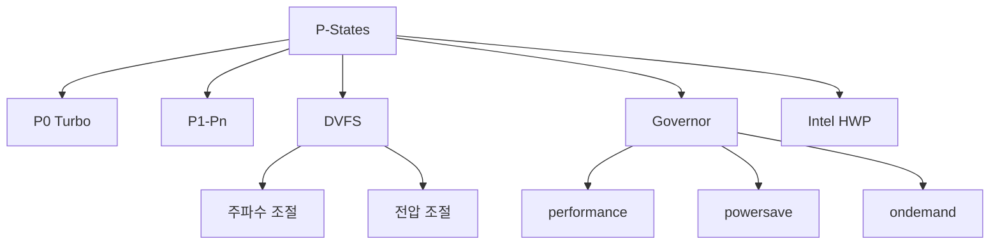

+++
title = "pstates"
date = "2026-03-14"
weight = 723
+++

# P-States (Performance States)

#### 핵심 인사이트 (3줄 요약)
> 1. **본질**: CPU의 동작 주파수와 전압을 조합하여 성능과 전력을 단계적으로 조절하는 DVFS(Dynamic Voltage and Frequency Scaling) 상태
> 2. **가치**: 워크로드별 최적 성능/전력 균형, 에너지 효율, 열 관리, 배터리 수명 연장
> 3. **융합**: C-States, ACPI, Intel SpeedStep/Speed Shift, AMD Cool'n'Quiet/P-State와 통합된 동적 전력 관리

---

### Ⅰ. 개요 (Context & Background)

**개념 정의**

P-States(Performance States)는 CPU의 동작 주파수와 전압 조합을 정의한 상태입니다. DVFS(Dynamic Voltage and Frequency Scaling)를 통해 성능과 전력 소비를 단계적으로 조절합니다.

```
┌─────────────────────────────────────────────────────────────────────┐
│                    P-States 계층 구조                                │
├─────────────────────────────────────────────────────────────────────┤
│                                                                     │
│   ┌──────────────────────────────────────────────────────────────┐ │
│   │                    Performance States                         │ │
│   │                                                              │ │
│   │   주파수 (GHz)  전압 (V)   전력 (W)   성능    전력효율        │ │
│   │   ─────────────────────────────────────────────────────────  │ │
│   │                                                              │ │
│   │   P0  ────► 5.0 GHz  │  1.4V  │  250W  │ 최고  │ 낮음       │ │
│   │              ▲         │        │        │       │            │ │
│   │              │         │        │        │       │            │ │
│   │   P1  ────► 4.5 GHz  │  1.3V  │  200W  │ 높음  │ 중간       │ │
│   │              ▲         │        │        │       │            │ │
│   │              │         │        │        │       │            │ │
│   │   P2  ────► 4.0 GHz  │  1.25V │  170W  │ 높음  │ 중간       │ │
│   │              ▲         │        │        │       │            │ │
│   │              │         │        │        │       │            │ │
│   │   P3  ────► 3.5 GHz  │  1.15V │  140W  │ 중간  │ 높음       │ │
│   │              ▲         │        │        │       │            │ │
│   │              │         │        │        │       │            │ │
│   │   P4  ────► 3.0 GHz  │  1.05V │  110W  │ 중간  │ 높음       │ │
│   │              ▲         │        │        │       │            │ │
│   │              │         │        │        │       │            │ │
│   │   ...         │        │        │        │       │            │ │
│   │              ▼         │        │        │       │            │ │
│   │   Pn  ────► 800 MHz  │  0.8V  │   15W  │ 낮음  │ 최고       │ │
│   │                                                              │ │
│   │   ────────────────────────────────────────────────────────   │ │
│   │                                                              │ │
│   │   P0 = 최고 성능 (Turbo Boost 포함)                          │ │
│   │   Pn = 최저 성능 (최대 절전)                                  │ │
│   │                                                              │ │
│   │   전압-주파수 관계: V ∝ f (DVFS)                             │ │
│   │   전력 관계: P ∝ V² × f                                      │ │
│   │                                                              │ │
│   └──────────────────────────────────────────────────────────────┘ │
│                                                                     │
│   ┌──────────────────────────────────────────────────────────────┐ │
│   │              DVFS 전력 절감 원리                               │ │
│   │                                                              │ │
│   │   P = C × V² × f                                             │ │
│   │   (C: 정전용량, V: 전압, f: 주파수)                           │ │
│   │                                                              │ │
│   │   예: 4.0GHz/1.25V → 3.0GHz/1.05V                           │ │
│   │                                                              │ │
│   │   P1/P0 = (1.05/1.25)² × (3.0/4.0)                          │ │
│   │         = 0.7056 × 0.75                                     │ │
│   │         = 0.53 (53% 전력)                                    │ │
│   │                                                              │ │
│   │   → 주파수 25% 감소로 전력 47% 절감                          │ │
│   │                                                              │ │
│   └──────────────────────────────────────────────────────────────┘ │
│                                                                     │
└─────────────────────────────────────────────────────────────────────┘
```

> **해설**: P0은 최고 주파수/전압, Pn은 최저 주파수/전압입니다. 전압은 주파수에 비례하므로, 주파수를 낮추면 전력은 제곱으로 감소합니다.

**💡 비유**: P-States는 자동차의 기어와 같습니다. P0은 고속 기어(빠르지만 연료 많이 소모), Pn은 저속 기어(느리지만 연료 절약)입니다.

**등장 배경**

① **기존 한계**: 고정 클럭 → 항상 최대 전력 소비
② **혁신적 패러다임**: DVFS로 워크로드에 맞는 클럭/전압 조절
③ **비즈니스 요구**: 에너지 효율, 열 관리, 배터리 수명

**📢 섹션 요약 비유**: P-States는 자동차 기어 같아요. P0은 고속 기어, Pn은 저속 기어예요.

---

### Ⅱ. 아키텍처 및 핵심 원리 (Deep Dive)

**구성 요소 상세 분석**

| 요소명 | 역할 | 내부 동작 | 비유 |
|:---|:---|:---|:---|
| **P-State** | 성능 상태 | f + V 조합 | 기어 |
| **PSS** | Performance Support States | P-State 테이블 | 기어 목록 |
| **PPC** | Performance Present Cap | 최대 P-State 제한 | 속도 제한 |
| **Turbo** | 터보 부스트 | P0+ 오버클럭 | 스포츠 모드 |
| **Governor** | 정책 결정 | 성능 vs 절전 | 운전자 |

**P-State 전환 메커니즘**

```
┌─────────────────────────────────────────────────────────────────────┐
│                    P-State 전환 메커니즘                             │
├─────────────────────────────────────────────────────────────────────┤
│                                                                     │
│   ┌──────────────────────────────────────────────────────────────┐ │
│   │              P-State Governor 결정                            │ │
│   │                                                              │ │
│   │   CPU 사용률 ────► Governor ────► 목표 P-State              │ │
│   │                                                              │ │
│   │   ┌─────────────────────────────────────────────────────┐    │ │
│   │   │              Governor 종류                           │    │ │
│   │   │                                                     │    │ │
│   │   │   performance: 항상 P0 (최고 성능)                   │    │ │
│   │   │   powersave:  항상 Pn (최대 절전)                    │    │ │
│   │   │   ondemand:  사용률에 따라 동적 전환                 │    │ │
│   │   │   conservative: ondemand + 완만한 전환               │    │ │
│   │   │   userspace: 사용자 지정                             │    │ │
│   │   │   schedutil: 스케줄러 기반 (최신)                    │    │ │
│   │   │                                                     │    │ │
│   │   └─────────────────────────────────────────────────────┘    │ │
│   │                                                              │ │
│   └──────────────────────────────────────────────────────────────┘ │
│                                │                                    │
│                                ▼                                    │
│   ┌──────────────────────────────────────────────────────────────┐ │
│   │              P-State 전환 (Hardware)                          │ │
│   │                                                              │ │
│   │   1. MSR WRMSR (IA32_PERF_CTL)                               │ │
│   │      - 목표 P-State 기록                                     │ │
│   │                                                              │ │
│   │   2. PLL 재설정 (Phase-Locked Loop)                          │ │
│   │      - 새로운 주파수 설정                                    │ │
│   │      - 클럭 안정화 대기                                      │ │
│   │                                                              │ │
│   │   3. VRM 전압 조정 (Voltage Regulator Module)                │ │
│   │      - 새로운 전압 설정                                      │ │
│   │      - 전압 안정화 대기                                      │ │
│   │                                                              │ │
│   │   4. 완료 확인                                               │ │
│   │      - IA32_PERF_STATUS 확인                                 │ │
│   │                                                              │ │
│   │   전환 시간: ~10-100μs                                       │ │
│   │                                                              │ │
│   └──────────────────────────────────────────────────────────────┘ │
│                                                                     │
│   ┌──────────────────────────────────────────────────────────────┐ │
│   │              Intel Speed Shift (HWP)                          │ │
│   │                                                              │ │
│   │   OS 대신 HW가 직접 P-State 선택                             │ │
│   │                                                              │ │
│   │   IA32_HWP_REQUEST:                                          │ │
│   │   - Minimum Performance: Pn                                  │ │
│   │   - Maximum Performance: P0                                  │ │
│   │   - Desired Performance: 목표                                │ │
│   │   - Energy Performance Preference: 절전 vs 성능              │ │
│   │                                                              │ │
│   │   장점: 더 빠른 전환 (~μs), 더 정확한 제어                    │ │
│   │                                                              │ │
│   └──────────────────────────────────────────────────────────────┘ │
│                                                                     │
└─────────────────────────────────────────────────────────────────────┘
```

> **해설**: Governor가 사용률에 따라 목표 P-State를 결정하고, 하드웨어가 PLL과 VRM을 조정합니다. Intel Speed Shift(HWP)는 OS 대신 HW가 직접 제어합니다.

**핵심 알고리즘: P-State Governor**

```c
// P-State Governor (의사코드)
struct PStateGovernor {
    uint8_t  current_pstate;
    uint8_t  min_pstate;
    uint8_t  max_pstate;
    uint32_t sampling_rate;    // ms
    uint32_t up_threshold;     // %
    uint32_t down_threshold;   // %
};

// ondemand Governor
uint8_t OndemandSelectPState(struct PStateGovernor *gov,
                              uint32_t cpu_usage) {
    // CPU 사용률에 따른 P-State 선택
    if (cpu_usage >= gov->up_threshold) {
        // 높은 사용률: P0으로 점프
        return gov->min_pstate;  // P0
    } else if (cpu_usage <= gov->down_threshold) {
        // 낮은 사용률: 한 단계 낮춤
        if (gov->current_pstate < gov->max_pstate) {
            return gov->current_pstate + 1;
        }
    }

    // 유지
    return gov->current_pstate;
}

// schedutil Governor (최신)
uint8_t SchedutilSelectPState(struct PStateGovernor *gov,
                               uint32_t cpu_capacity,
                               uint32_t max_capacity) {
    // 스케줄러에서 제공하는 용량 정보 사용
    uint32_t util = (cpu_capacity * 100) / max_capacity;

    // 선형 매핑
    uint8_t target = gov->min_pstate +
                     (gov->max_pstate - gov->min_pstate) * util / 100;

    return target;
}

// P-State 설정
void SetPState(uint8_t pstate) {
    // MSR에 P-State 기록
    wrmsr(MSR_IA32_PERF_CTL, pstate << 8);

    // 완료 대기
    while ((rdmsr(MSR_IA32_PERF_STATUS) >> 8) != pstate) {
        cpu_relax();
    }
}

// Linux에서 P-State 확인 및 설정
// # cat /sys/devices/system/cpu/cpu0/cpufreq/scaling_available_frequencies
// 5000000 4800000 4500000 4000000 3500000 3000000 2500000 2000000 1500000 800000

// # cat /sys/devices/system/cpu/cpu0/cpufreq/scaling_cur_freq
// 3500000

// # cat /sys/devices/system/cpu/cpu0/cpufreq/scaling_governor
// schedutil

// # echo performance > /sys/devices/system/cpu/cpu0/cpufreq/scaling_governor
// (P0으로 고정)

// # turbostat
// ... 5.0 GHz  1.35V  ...
```

**📢 섹션 요약 비유**: P-State Governor는 자동차의 자동 변속기와 같습니다. 엔진 회전수(사용률)에 따라 자동으로 기어(P-State)를 바꿉니다.

---

### Ⅲ. 융합 비교 및 다각도 분석 (Comparison & Synergy)

**기술 비교: Intel vs AMD P-States**

| 비교 항목 | Intel | AMD |
|:---|:---:|:---:|
| **구현** | Speed Shift (HWP) | P-State CPPC |
| **제어** | HW/OS | HW/OS |
| **전환 시간** | ~μs | ~μs |
| **Turbo** | Turbo Boost 3.0 | Precision Boost |

**과목 융합 관점: P-State와 타 영역 시너지**

| 융합 영역 | 시너지 효과 | 구현 예시 |
|:---|:---|:---|
| **OS (운영체제)** | cpufreq 드라이버 | acpi-cpufreq |
| **전력** | RAPL 통합 | 전력 예산 |
| **열** | Thermal 제어 | PROCHOT# |
| **가상화** | VM 성능 조절 | vCPU frequency |
| **클라우드** | 인스턴스 유형 | T2/T3 |

**📢 섹션 요약 비유**: P-State는 기어, C-State는 시동 on/off와 같습니다. 기어는 속도 조절, 시동은 완전 정지입니다.

---

### Ⅳ. 실무 적용 및 기술사적 판단 (Strategy & Decision)

**실무 시나리오별 적용**

**시나리오 1: 웹 서버**
- **문제**: 요청 변동성
- **해결**: ondemand/schedutil
- **의사결정**: 빠른 응답 vs 절전

**시나리오 2: HPC**
- **문제**: 최대 성능 필요
- **해결**: performance Governor
- **의사결정**: 항상 P0

**시나리오 3: 배치 작업**
- **문제**: 처리량 중요
- **해결**: conservative 또는 고정 P-State
- **의사결정**: 중간 성능 유지

**도입 체크리스트**

| 구분 | 항목 | 확인 포인트 |
|:---|:---|:---|
| **기술적** | BIOS | SpeedStep 활성화 |
| | OS | cpufreq 드라이버 |
| | Governor | 워크로드에 맞게 |
| **운영적** | 모니터링 | turbostat |
| | 튜닝 | Governor 선택 |
| | 전력 | PkgWatt 확인 |

**안티패턴: P-State 오용 사례**

| 안티패턴 | 문제점 | 올바른 접근 |
|:---|:---|:---|
| **항상 performance** | 전력 낭비 | 워크로드에 맞게 |
| **항상 powersave** | 성능 저하 | ondemand 사용 |
| **빈번한 전환** | 오버헤드 | hysteresis |
| **Turbo 과신** | 열 문제 | 열 관리 필수 |

**📢 섹션 요약 비유**: P-State 튜닝은 자동차 운전 스타일과 같습니다. 스포츠 드라이빙(performance) vs 에코 드라이빙(powersave)을 선택합니다.

---

### Ⅴ. 기대효과 및 결론 (Future & Standard)

**정량/정성 기대효과**

| 구분 | P-State 미사용 | P-State | 개선효과 |
|:---|:---:|:---:|:---:|
| **평균 전력** | 200W | 120W | 40% 절감 |
| **성능** | 100% | 90% | -10% |
| **발열** | 높음 | 낮음 | 감소 |
| **에너지 효율** | 낮음 | 높음 | 30% 향상 |

**미래 전망**

1. **Intel HWP:** HW 기반 완전 자동화
2. **AMD CPPC:** 협력적 성능 제어
3. **AI 기반:** ML로 최적 P-State 예측
4. **3D V-Cache:** 성능 유지하며 전력 감소

**참고 표준**

| 표준 | 내용 | 적용 |
|:---|:---|:---|
| **Intel SDM** | P-State MSR | Intel CPU |
| **ACPI 6.5** | _PSS, _PPC | 펌웨어 |
| **Linux cpufreq** | acpi-cpufreq | 커널 |
| **AMD P-State** | CPPC | AMD CPU |

**📢 섹션 요약 비유**: P-State의 미래는 AI 기반 자동 변속과 같습니다. AI가 도로 상황을 분석해 자동으로 최적 기어를 선택합니다.

---

### 📌 관련 개념 맵 (Knowledge Graph)



**연관 개념 링크**:
- Core C-States - 코어 절전 상태
- T-States - 스로틀 상태
- ACPI S-States - 시스템 절전
- CPU Downclocking - 다운클럭킹

---

### 👶 어린이를 위한 3줄 비유 설명

1. **자동차 기어**: P-States는 자동차 기어 같아요. P0은 고속 기어, Pn은 저속 기어예요.

2. **속도 vs 연료**: 고속 기어(P0)는 빠르지만 연료를 많이 써요. 저속 기어(Pn)는 느리지만 아껴요.

3. **자동 변속**: Governor는 자동 변속기 같아요. 상황에 맞게 알아서 기어를 바꿔요!