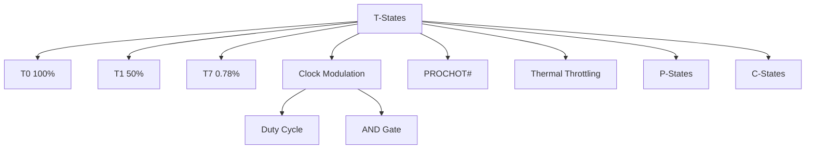

+++
title = "tstates"
date = "2026-03-14"
weight = 724
+++

# T-States (Throttling States)

#### 핵심 인사이트 (3줄 요약)
> 1. **본질**: CPU 클럭을 일정 비율로 끄고 켜는(듀티 사이클) 방식으로 평균 성능을 강제로 낮추는 긴급 열/전력 관리 메커니즘
> 2. **가치**: 과열 시 즉각적 응답, 하드웨어 보호, P-State보다 빠른 제어, 예비 스로틀링
> 3. **융합**: PROCHOT#, Thermal Throttling, P-State, Clock Modulation, VRM과 통합된 긴급 보호 체계

---

### Ⅰ. 개요 (Context & Background)

**개념 정의**

T-States(Throttling States)는 CPU 클럭을 일정 듀티 사이클로 온/오프하여 평균 성능을 강제로 낮추는 기술입니다. P-State가 주파수/전압을 조절하는 반면, T-State는 클럭 자체를 주기적으로 차단합니다.

```
┌─────────────────────────────────────────────────────────────────────┐
│                    T-States 동작 원리                                │
├─────────────────────────────────────────────────────────────────────┤
│                                                                     │
│   ┌──────────────────────────────────────────────────────────────┐ │
│   │              T-State Duty Cycle                               │ │
│   │                                                              │ │
│   │   T0 (100% Duty):  ████████████████████████████████████████ │ │
│   │                    ←────────────── ON ─────────────────────→ │ │
│   │                                                              │ │
│   │   T1 (50% Duty):   ████████████████░░░░░░░░░░░░░░░░░░░░░░░░ │ │
│   │                    ←──── ON ────→←──── OFF ────→             │ │
│   │                                                              │ │
│   │   T2 (25% Duty):   ████████░░░░░░░░░░░░████████░░░░░░░░░░░░ │ │
│   │                    ←ON→  ←OFF→    ←ON→    ←OFF→              │ │
│   │                                                              │ │
│   │   T3 (12.5% Duty): ████░░░░░░░░░░░░░░░░░░░░░░░░░░░░░░░░░░░░ │ │
│   │                    ON        OFF (길게)                      │ │
│   │                                                              │ │
│   │   T4-T7: 더 낮은 듀티 사이클                                  │ │
│   │                                                              │ │
│   │   █ = Clock ON (실행), ░ = Clock OFF (정지)                  │ │
│   │                                                              │ │
│   │   평균 성능 = Duty Cycle × 최대 성능                          │ │
│   │   예: T1 (50%) = 0.5 × 4.0 GHz = 2.0 GHz 평균               │ │
│   │                                                              │ │
│   └──────────────────────────────────────────────────────────────┘ │
│                                                                     │
│   ┌──────────────────────────────────────────────────────────────┐ │
│   │              T-States vs P-States                             │ │
│   │                                                              │ │
│   │   ┌─────────────────────┬─────────────────────────────────┐  │ │
│   │   │                     │     P-States    │   T-States    │  │ │
│   │   ├─────────────────────┼─────────────────┼───────────────┤  │ │
│   │   │ 제어 방식           │ 주파수/전압 조절│ 듀티 사이클   │  │ │
│   │   │ 응답 속도           │ ~100μs         │ ~1μs          │  │ │
│   │   │ 성능 저하           │ 선형           │ 계단형        │  │ │
│   │   │ 전력 절감           │ 효과적         │ 제한적        │  │ │
│   │   │ 용도                │ 일반 관리      │ 긴급 스로틀   │  │ │
│   │   │ 사용 시나리오       │ 워크로드 조절  │ 과열 대응     │  │ │
│   │   └─────────────────────┴─────────────────┴───────────────┘  │ │
│   │                                                              │ │
│   └──────────────────────────────────────────────────────────────┘ │
│                                                                     │
└─────────────────────────────────────────────────────────────────────┘
```

> **해설**: T-State는 클럭을 ON/OFF하여 평균 성능을 낮춥니다. P-State보다 빠르게(~1μs) 응답하지만 전력 절감 효과는 제한적입니다.

**💡 비유**: T-State는 전등의 빠른 깜빡임과 같습니다. 초당 수천 번 깜빡이면 눈에는 어두워 보입니다. P-State는 전압을 낮춰서 실제로 어둡게 하는 것입니다.

**등장 배경**

① **기존 한계**: P-State 전환 느림 → 과열 대응 부족
② **혁신적 패러다임**: T-State로 즉각적 성능 저하
③ **비즈니스 요구**: 하드웨어 보호, 과열 방지

**📢 섹션 요약 비유**: T-States는 전등 빠른 깜빡임 같아요. 아주 빨리 켰다 껐다 하면 어두워 보여요.

---

### Ⅱ. 아키텍처 및 핵심 원리 (Deep Dive)

**구성 요소 상세 분석**

| T-State | Duty Cycle | 평균 성능 | 전력 | 복귀 시간 | 비유 |
|:---|:---|:---|:---|:---|:---|
| **T0** | 100% | 100% | 100% | 0μs | 항상 켜짐 |
| **T1** | 50% | 50% | ~55% | ~1μs | 반반 |
| **T2** | 25% | 25% | ~30% | ~1μs | 1/4 |
| **T3** | 12.5% | 12.5% | ~18% | ~1μs | 1/8 |
| **T4** | 6.25% | 6.25% | ~12% | ~1μs | 1/16 |
| **T5** | 3.125% | 3.125% | ~10% | ~1μs | 1/32 |
| **T6** | 1.5625% | 1.5625% | ~9% | ~1μs | 1/64 |
| **T7** | 0.78125% | 0.78125% | ~8% | ~1μs | 1/128 |

**Clock Modulation 하드웨어**

```
┌─────────────────────────────────────────────────────────────────────┐
│                    Clock Modulation 하드웨어                         │
├─────────────────────────────────────────────────────────────────────┤
│                                                                     │
│   ┌──────────────────────────────────────────────────────────────┐ │
│   │              Clock Modulation Logic                           │ │
│   │                                                              │ │
│   │   PLL (Clock Generator)                                      │ │
│   │         │                                                    │ │
│   │         │ Core Clock (예: 4.0 GHz)                           │ │
│   │         ▼                                                    │ │
│   │   ┌─────────────────────────────────────────────────────┐    │ │
│   │   │              Clock Gate (AND 게이트)                 │    │ │
│   │   │                                                     │    │ │
│   │   │   Core Clock ──►├───► Gated Clock ──► Core         │    │ │
│   │   │                   │                                 │    │ │
│   │   │   Modulation ───►┘                                 │    │ │
│   │   │   Signal                                             │    │ │
│   │   │                                                     │    │ │
│   │   └─────────────────────────────────────────────────────┘    │ │
│   │                                                              │ │
│   │   Modulation Signal:                                        │ │
│   │   - T0: 항상 HIGH (100%)                                    │ │
│   │   - T1: 50% HIGH, 50% LOW                                  │ │
│   │   - T2: 25% HIGH, 75% LOW                                  │ │
│   │   - ...                                                     │ │
│   │                                                              │ │
│   │   제어 레지스터: IA32_CLOCK_MODULATION (MSR 0x19A)           │ │
│   │                                                              │ │
│   │   Bit 0: Enable                                             │ │
│   │   Bit 1-3: Duty Cycle (T0-T7)                               │ │
│   │   Bit 4: Extended Duty Cycle (확장 모드)                     │ │
│   │                                                              │ │
│   └──────────────────────────────────────────────────────────────┘ │
│                                                                     │
│   ┌──────────────────────────────────────────────────────────────┐ │
│   │              T-State 활성화 조건                              │ │
│   │                                                              │ │
│   │   1. PROCHOT# 활성화 (과열)                                   │ │
│   │      → 자동으로 T1 이상 활성화                                │ │
│   │                                                              │ │
│   │   2. BIOS/OS 강제 설정                                        │ │
│   │      → MSR IA32_CLOCK_MODULATION 설정                        │ │
│   │                                                              │ │
│   │   3. Thermal Monitoring 2 (TM2)                              │ │
│   │      → 과열 시 자동 T-State                                   │ │
│   │                                                              │ │
│   │   4. Power Limit 초과                                         │ │
│   │      → PL1/PL2 초과 시 T-State 활성화                        │ │
│   │                                                              │ │
│   └──────────────────────────────────────────────────────────────┘ │
│                                                                     │
└─────────────────────────────────────────────────────────────────────┘
```

> **해설**: Clock Modulation은 AND 게이트로 클럭을 차단합니다. MSR로 Duty Cycle을 설정하며, PROCHOT# 시 자동으로 활성화됩니다.

**핵심 알고리즘: T-State 제어**

```c
// T-State 제어 (의사코드)
struct TStateControl {
    uint8_t  current_tstate;
    bool     enabled;
    uint32_t modulation_period;  // ns
};

// T-State 활성화
void EnableTState(uint8_t tstate) {
    uint64_t msr;

    // Duty Cycle 계산 (T0-T7)
    uint8_t duty_cycle = TStateToDutyCycle(tstate);

    // MSR 읽기
    msr = rdmsr(MSR_IA32_CLOCK_MODULATION);

    // 설정
    msr &= ~(CLOCK_MOD_DUTY_MASK | CLOCK_MOD_ENABLE);
    msr |= (duty_cycle << 1) | CLOCK_MOD_ENABLE;

    // MSR 쓰기
    wrmsr(MSR_IA32_CLOCK_MODULATION, msr);

    current_tstate = tstate;
    tstate_enabled = true;
}

// T-State 비활성화
void DisableTState() {
    uint64_t msr = rdmsr(MSR_IA32_CLOCK_MODULATION);
    msr &= ~CLOCK_MOD_ENABLE;
    wrmsr(MSR_IA32_CLOCK_MODULATION, msr);

    current_tstate = T0;
    tstate_enabled = false;
}

// Duty Cycle 변환
uint8_t TStateToDutyCycle(uint8_t tstate) {
    switch (tstate) {
        case T0: return 0;     // 100% (0b000)
        case T1: return 1;     // 50%  (0b001)
        case T2: return 2;     // 25%  (0b010)
        case T3: return 3;     // 12.5% (0b011)
        case T4: return 4;     // 6.25% (0b100)
        case T5: return 5;     // 3.125% (0b101)
        case T6: return 6;     // 1.5625% (0b110)
        case T7: return 7;     // 0.78125% (0b111)
        default: return 0;
    }
}

// Thermal Throttling 핸들러
void ThermalThrottleHandler(int32_t temp, int32_t tjmax) {
    int32_t margin = tjmax - temp;

    if (margin < 2) {
        // 위급: T3-T5 활성화
        EnableTState(T3);
        printk(KERN_WARNING "Thermal: T3 throttling (temp=%d, margin=%d)\n",
               temp, margin);
    } else if (margin < 5) {
        // 심각: T1-T2 활성화
        EnableTState(T1);
        printk(KERN_WARNING "Thermal: T1 throttling (temp=%d, margin=%d)\n",
               temp, margin);
    } else if (margin < 10 && tstate_enabled) {
        // 회복 중: T-State 유지
        // (P-State로 이미 낮아졌을 것)
    } else if (margin >= 10 && tstate_enabled) {
        // 회복 완료: T-State 비활성화
        DisableTState();
        printk(KERN_INFO "Thermal: Throttling disabled (temp=%d)\n", temp);
    }
}

// Linux에서 T-State 확인
// # rdmsr -p0 0x19A
// 0x1  (Bit 0: Enable, Bits 1-3: Duty Cycle)
//
// # cat /sys/devices/system/cpu/cpu0/thermal_throttle/*
// (Thermal throttling 이벤트 확인)
```

**📢 섹션 요약 비유**: T-State 제어는 브레이크 펌핑과 같습니다. 브레이크를 밝았다 뗐다 하며 속도를 줄입니다.

---

### Ⅲ. 융합 비교 및 다각도 분석 (Comparison & Synergy)

**기술 비교: T-States vs P-States vs C-States**

| 비교 항목 | T-States | P-States | C-States |
|:---|:---:|:---:|:---:|
| **제어 대상** | 클럭 듀티 | 주파수/전압 | 전원 |
| **응답 속도** | ~1μs | ~100μs | ~1-100μs |
| **전력 절감** | 제한적 | 효과적 | 최대 |
| **성능 저하** | 계단형 | 선형 | 완전 정지 |
| **용도** | 긴급 스로틀 | 일반 관리 | 유휴 절전 |

**과목 융합 관점: T-State와 타 영역 시너지**

| 융합 영역 | 시너지 효과 | 구현 예시 |
|:---|:---|:---|
| **OS (운영체제)** | Thermal 드라이버 | intel_thermal |
| **열 관리** | PROCHOT# 연동 | 과열 대응 |
| **전력** | PL1/PL2 연동 | 전력 초과 대응 |
| **가상화** | VM 스로틀링 | cgroups |
| **실시간** | 레이턴시 영향 | T-State 제한 |

**📢 섹션 요약 비유**: T-State는 비상 브레이크, P-State는 가속 페달, C-State는 시동 끄기와 같습니다.

---

### Ⅳ. 실무 적용 및 기술사적 판단 (Strategy & Decision)

**실무 시나리오별 적용**

**시나리오 1: 과열 응급**
- **문제**: 냉각 시스템 장애, 온도 급상승
- **해결**: PROCHOT# → T-State 자동 활성화
- **의사결정**: T1-T3 허용

**시나리오 2: 전력 한계**
- **문제**: 전력 공급 한계 초과
- **해결**: BIOS에서 T-State 제한
- **의사결정**: T1까지만

**시나리오 3: 실시간 시스템**
- **문제**: T-State로 레이턴시 증가
- **해결**: T-State 비활성화
- **의사결정**: 다른 방법으로 열 관리

**도입 체크리스트**

| 구분 | 항목 | 확인 포인트 |
|:---|:---|:---|
| **기술적** | BIOS | TM1/TM2 활성화 |
| | OS | Thermal 드라이버 |
| | 레이턴시 | 워크로드 영향 |
| **운영적** | 모니터링 | 온도/T-State |
| | 냉각 | 팬/방열판 |
| | 알림 | 과열 경보 |

**안티패턴: T-State 오용 사례**

| 안티패턴 | 문제점 | 올바른 접근 |
|:---|:---|:---|
| **T-State 상시 사용** | 성능 저하 | 긴급 시만 |
| **T7 고정** | 거의 멈춤 | T1-T3 권장 |
| **냉각 무시** | 지속 스로틀 | 냉각 강화 |
| **실시간 시스템** | 레이턴시 증가 | T-State 비활성화 |

**📢 섹션 요약 비유**: T-State는 비상 브레이크와 같습니다. 평소에 쓰면 위험하고, 응급 상황에만 사용해야 합니다.

---

### Ⅴ. 기대효과 및 결론 (Future & Standard)

**정량/정성 기대효과**

| 구분 | T-State 미사용 | T-State | 개선효과 |
|:---|:---:|:---:|:---:|
| **응급 응답** | 느림 | 즉각 | 100배 |
| **하드웨어 보호** | 위험 | 안전 | 향상 |
| **성능 유지** | 100% | 50-12.5% | 저하 |
| **전력** | 100% | 55-18% | 절감 |

**미래 전망**

1. **AVX512 스로틀링:** AVX512 명령 시 자동 T-State
2. **플랫폼 스로틀링:** 시스템 레벨 T-State
3. **동적 Duty Cycle:** 연속적인 듀티 조절
4. **AI 기반:** ML로 최적 T-State 예측

**참고 표준**

| 표준 | 내용 | 적용 |
|:---|:---|:---|
| **Intel SDM** | TM1/TM2 | Intel CPU |
| **ACPI 6.5** | _TPC, _PTC | 펌웨어 |
| **Linux thermal** | intel_thermal | 커널 |
| **MSR 0x19A** | Clock Modulation | 레지스터 |

**📢 섹션 요약 비유**: T-State의 미래는 자동 긴급 제동 시스템과 같습니다. 위험을 감지하면 자동으로 작동합니다.

---

### 📌 관련 개념 맵 (Knowledge Graph)



**연관 개념 링크**:
- P-States - 성능 상태
- PROCHOT# - 프로세서 핫 신호
- CPU Downclocking - 다운클럭킹
- ACPI S-States - 시스템 절전

---

### 👶 어린이를 위한 3줄 비유 설명

1. **전등 깜빡임**: T-States는 전등을 아주 빨리 깜빡이는 것 같아요. 켰다 껐다 하면 어두워 보여요.

2. **비상 브레이크**: T-State는 비상 브레이크 같아요. 위험할 때만 써요. 평소에 쓰면 느려요.

3. **T1은 반반**: T1은 반은 켜고 반은 꺼요. T7은 거의 꺼요. 숫자가 클수록 어두워요!