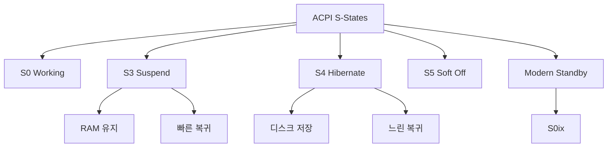

+++
title = "acpi sstates"
date = "2026-03-14"
weight = 725
+++

# ACPI S-States (S0 ~ S5)

#### 핵심 인사이트 (3줄 요약)
> 1. **본질**: 시스템 전체의 절전 상태(S0-S5)를 정의하는 ACPI 표준으로, S0(활성)에서 S5(전원 끄기)까지 점진적 전력 차단
> 2. **가격**: 전력 절감, 빠른 부팅(S3/S4), 배터리 수명, 데스크톱/노트북 절전, 엔터프라이즈 전력 관리
> 3. **융합**: UEFI, C-States, P-States, Windows/Linux 전원 관리, 모던 스탠바이와 통합된 시스템 절전 체계

---

### Ⅰ. 개요 (Context & Background)

**개념 정의**

ACPI S-States(System States)는 시스템 전체의 절전 상태를 정의하는 ACPI(Advanced Configuration and Power Interface) 표준입니다. S0(완전 활성)에서 S5(전원 끄기)까지 점진적으로 전력을 차단합니다.

```
┌─────────────────────────────────────────────────────────────────────┐
│                    ACPI S-States 계층 구조                           │
├─────────────────────────────────────────────────────────────────────┤
│                                                                     │
│   ┌──────────────────────────────────────────────────────────────┐ │
│   │              ACPI System States (S-States)                    │ │
│   │                                                              │ │
│   │   전력    상태명         설명                복귀시간          │ │
│   │   ────────────────────────────────────────────────────────── │ │
│   │                                                              │ │
│   │   100%   S0 Working      완전 활성            0ms             │ │
│   │           ▲                                                  │ │
│   │           │    ┌─────────────────────────────────────────┐   │ │
│   │           │    │  CPU: 활성 (C0/C1/C6 전환 가능)         │   │ │
│   │           │    │  RAM: 활성                             │   │ │
│   │           │    │  장치: 활성                            │   │ │
│   │           │    │  디스크: 활성                          │   │ │
│   │           │    └─────────────────────────────────────────┘   │ │
│   │           │                                                  │ │
│   │           │     S0ix (Modern Standby)                        │ │
│   │           │     ┌─────────────────────────────────────────┐  │ │
│   │           │     │  저전력 활성 (Low Power Idle)           │  │ │
│   │           │     │  CPU: 최저 C-State                     │  │ │
│   │           │     │  RAM: Self-Refresh                     │  │ │
│   │           │     │  장치: D3 상태                         │  │ │
│   │           │     │  복귀: ~100ms                          │  │ │
│   │           │     └─────────────────────────────────────────┘  │ │
│   │           │                                                  │ │
│   │    ~5W   S1 Sleeping      프로세서 정지        ~1s           │ │
│   │           ▲    ┌─────────────────────────────────────────┐   │ │
│   │           │    │  CPU: 정지 (Clock Gating)              │   │ │
│   │           │    │  RAM: 활성 (리프레시 유지)              │   │ │
│   │           │    │  장치: 일부 정지                       │   │ │
│   │           │    └─────────────────────────────────────────┘   │ │
│   │           │                                                  │ │
│   │    ~3W   S2 Sleeping      CPU 전원 차단        ~1s           │ │
│   │           ▲    ┌─────────────────────────────────────────┐   │ │
│   │           │    │  CPU: 전원 차단                        │   │ │
│   │           │    │  RAM: 활성                             │   │ │
│   │           │    │  Cache: 플러시                         │   │ │
│   │           │    └─────────────────────────────────────────┘   │ │
│   │           │                                                  │ │
│   │    ~2W   S3 Suspend       메모리 유지 절전     ~1s           │ │
│   │           ▲    ┌─────────────────────────────────────────┐   │ │
│   │           │    │  CPU: 전원 차단                        │   │ │
│   │           │    │  RAM: Self-Refresh (활성)              │   │ │
│   │           │    │  장치: D3 (대부분 정지)                 │   │ │
│   │           │    │  상태: RAM에 저장                      │   │ │
│   │           │    └─────────────────────────────────────────┘   │ │
│   │           │                                                  │ │
│   │    ~1W   S4 Hibernate     디스크 절전          ~10s          │
│   │           ▲    ┌─────────────────────────────────────────┐   │ │
│   │           │    │  CPU: 전원 차단                        │   │ │
│   │           │    │  RAM: 전원 차단                        │   │ │
│   │           │    │  장치: D3 (완전 정지)                   │   │ │
│   │           │    │  상태: 디스크에 저장 (hiberfil.sys)    │   │ │
│   │           │    └─────────────────────────────────────────┘   │ │
│   │           │                                                  │ │
│   │     0W   S5 Soft Off      소프트웨어 전원 끄기  부팅 필요     │
│   │           ▲    ┌─────────────────────────────────────────┐   │ │
│   │           │    │  CPU: 전원 차단                        │   │ │
│   │           │    │  RAM: 전원 차단                        │   │ │
│   │           │    │  장치: D3 (완전 정지)                   │   │ │
│   │           │    │  상태: 저장 안 됨                       │   │ │
│   │           │    │  부팅: 콜드 부팅 필요                   │   │ │
│   │           │    └─────────────────────────────────────────┘   │ │
│   │           │                                                  │ │
│   │     0W   G3 Mechanical Off 하드웨어 전원 끄기   전원 코드 필요 │ │
│   │                ┌─────────────────────────────────────────┐   │ │
│   │                │  완전 전원 차단                         │   │ │
│   │                │  RTC만 작동 (CMOS 배터리)               │   │ │
│   │                │  전원 코드 분리 필요                    │   │ │
│   │                └─────────────────────────────────────────┘   │ │
│   │                                                              │ │
│   └──────────────────────────────────────────────────────────────┘ │
│                                                                     │
│   전력 소비: S0 > S1 > S2 > S3 > S4 > S5 > G3                       │
│   복귀 속도: S0 < S1 < S2 < S3 < S4 < S5 < G3                       │
│                                                                     │
└─────────────────────────────────────────────────────────────────────┘
```

> **해설**: S0은 완전 활성, S3은 RAM만 유지(Suspend to RAM), S4는 디스크에 저장(Hibernate), S5는 전원 끄기입니다. 깊은 상태일수록 전력 절감은 크지만 복귀 시간이 깁니다.

**💡 비유**: S-States는 사람의 의식 상태와 같습니다. S0은 깨어있는 상태, S3은 낮잠, S4는 깊은 잠, S5는 혼수 상태, G3은 사망입니다.

**등장 배경**

① **기존 한계**: APM 전원 관리 → OS 독립적, 제한적 기능
② **혁신적 패러다임**: ACPI로 OS 기반 전원 관리, 표준화
③ **비즈니스 요구**: 노트북 배터리, 데스크톱 절전, 에너지 규정

**📢 섹션 요약 비유**: ACPI S-States는 사람의 의식 상태 같아요. S0은 깨어있고, S3은 낮잠, S4는 깊은 잠, S5는 혼수예요.

---

### Ⅱ. 아키텍처 및 핵심 원리 (Deep Dive)

**구성 요소 상세 분석**

| S-State | 명칭 | CPU | RAM | 장치 | 전력 | 복귀 |
|:---|:---|:---|:---|:---|:---:|:---:|
| **S0** | Working | 활성 | 활성 | 활성 | ~100W | 0ms |
| **S0ix** | Modern Standby | C10 | Self-Refresh | D3 | ~5W | ~100ms |
| **S1** | Sleep | 정지 | 활성 | 일부 | ~5W | ~1s |
| **S2** | Sleep | 전원 OFF | 활성 | 일부 | ~3W | ~1s |
| **S3** | Suspend to RAM | 전원 OFF | Self-Refresh | D3 | ~2W | ~1s |
| **S4** | Hibernate | 전원 OFF | 전원 OFF | D3 | ~1W | ~10s |
| **S5** | Soft Off | 전원 OFF | 전원 OFF | D3 | ~0W | 부팅 |
| **G3** | Mechanical Off | 전원 OFF | 전원 OFF | 전원 OFF | 0W | 콜드 부팅 |

**S3 진입 및 복귀 시퀀스**

```
┌─────────────────────────────────────────────────────────────────────┐
│                    S3 진입 및 복귀 시퀀스                            │
├─────────────────────────────────────────────────────────────────────┤
│                                                                     │
│   S3 진입 (Suspend)                                                 │
│   ┌──────────────────────────────────────────────────────────────┐ │
│   │                                                              │ │
│   │   1. 사용자 요청 또는 타이머                                  │ │
│   │      - 메뉴: "절전" 선택                                     │ │
│   │      - 노트북 덮개 닫기                                       │ │
│   │      - 배터리 부족                                            │ │
│   │                                                              │ │
│   │   2. OS 전원 관리                                             │ │
│   │      - 애플리케이션에 알림 (WM_POWERBROADCAST)                │ │
│   │      - 파일 시스템 플러시                                     │ │
│   │      - 장치 드라이버 S3 준비                                  │ │
│   │                                                              │ │
│   │   3. CPU 상태 저장                                            │ │
│   │      - 레지스터 → RAM                                         │ │
│   │      - 아키텍처 상태 저장                                      │ │
│   │                                                              │ │
│   │   4. 장치 전원 차단                                           │ │
│   │      - PCI 장치 D3 상태                                       │ │
│   │      - USB 정지                                               │ │
│   │      - 디스크 정지                                             │ │
│   │                                                              │ │
│   │   5. ACPI S3 요청                                             │ │
│   │      - \_S3 메서드 실행                                       │ │
│   │      - PM1a_CNT.SLP_TYP = 3                                   │ │
│   │      - PM1a_CNT.SLP_EN = 1                                    │ │
│   │                                                              │ │
│   │   6. 하드웨어 S3 진입                                         │ │
│   │      - CPU 전원 차단                                          │ │
│   │      - RAM Self-Refresh 모드                                  │ │
│   │      - 칩셋 저전력 모드                                        │ │
│   │                                                              │ │
│   │   소요 시간: ~1-2초                                           │ │
│   │                                                              │ │
│   └──────────────────────────────────────────────────────────────┘ │
│                                │                                    │
│                                │ 전원 버튼 / 덮개 열기 / Wake-on-LAN │
│                                ▼                                    │
│   S3 복귀 (Resume)                                                  │
│   ┌──────────────────────────────────────────────────────────────┐ │
│   │                                                              │ │
│   │   1. 웨이크 이벤트 감지                                       │ │
│   │      - 전원 버튼                                              │ │
│   │      - 노트북 덮개 열기                                        │ │
│   │      - 키보드/마우스                                          │ │
│   │      - Wake-on-LAN                                            │ │
│   │      - RTC 알람                                               │ │
│   │                                                              │ │
│   │   2. 하드웨어 복원                                            │ │
│   │      - CPU 전원 복원                                          │ │
│   │      - RAM Self-Refresh 해제                                  │ │
│   │      - 칩셋 활성화                                            │ │
│   │                                                              │ │
│   │   3. BIOS POST (간소화)                                       │ │
│   │      - 메모리 검사 생략                                        │ │
│   │      - ACPI wakeup 벡터 확인                                   │ │
│   │                                                              │ │
│   │   4. OS 커널 복원                                             │ │
│   │      - RAM에서 CPU 상태 복원                                   │ │
│   │      - 장치 드라이버 복원                                      │ │
│   │      - 애플리케이션 재개                                       │ │
│   │                                                              │ │
│   │   소요 시간: ~1-2초                                           │ │
│   │                                                              │ │
│   └──────────────────────────────────────────────────────────────┘ │
│                                                                     │
└─────────────────────────────────────────────────────────────────────┘
```

> **해설**: S3 진입 시 OS가 상태를 RAM에 저장하고 하드웨어를 저전력 모드로 전환합니다. 복귀 시 RAM에서 상태를 복원합니다.

**핵심 알고리즘: ACPI 전원 관리**

```c
// ACPI 전원 관리 (의사코드)
struct ACPIPowerManager {
    uint8_t  current_state;
    uint8_t  target_state;
    uint64_t wake_vector;
};

// S3 진입
ACPI_STATUS EnterS3() {
    // 1. 애플리케이션에 알림
    BroadcastPowerEvent(PBT_APMSUSPEND);

    // 2. 파일 시스템 플러시
    FlushAllFilesystems();

    // 3. 장치 드라이버 S3 준비
    for (device in all_devices) {
        device->Driver->Suspend(device, PowerDeviceD3);
    }

    // 4. CPU 상태 저장
    SaveCPUContext(&saved_context);

    // 5. 웨이크 벡터 설정
    acpi_set_waking_vector(ACPI_WAKE_VECTOR);

    // 6. ACPI \_S3 메서드 실행
    AcpiEvaluateObject(NULL, "\\_S3", NULL, NULL);

    // 7. PM1 레지스터 설정
    uint16_t pm1a_cnt = inw(PM1a_CNT);
    pm1a_cnt &= ~SLP_TYP_MASK;
    pm1a_cnt |= (SLP_TYP_S3 << 10) | SLP_EN;
    outw(PM1a_CNT, pm1a_cnt);

    // 8. 대기 (S3 진입)
    while (1) {
        // 하드웨어가 S3로 진입
        halt();
    }

    return AE_OK;  // 도달하지 않음
}

// S3 복귀
ACPI_STATUS ResumeFromS3() {
    // 1. CPU 상태 복원
    RestoreCPUContext(&saved_context);

    // 2. 장치 드라이버 복원
    for (device in all_devices) {
        device->Driver->Resume(device, PowerDeviceD0);
    }

    // 3. 애플리케이션에 알림
    BroadcastPowerEvent(PBT_APMRESUMEAUTOMATIC);

    return AE_OK;
}

// S4 Hibernate 진입
ACPI_STATUS EnterS4() {
    // 1. 메모리 내용을 디스크에 저장
    // hiberfil.sys에 RAM 덤프
    WriteHibernationFile();

    // 2. ACPI \_S4 메서드 실행
    AcpiEvaluateObject(NULL, "\\_S4", NULL, NULL);

    // 3. PM1 레지스터 설정
    uint16_t pm1a_cnt = inw(PM1a_CNT);
    pm1a_cnt &= ~SLP_TYP_MASK;
    pm1a_cnt |= (SLP_TYP_S4 << 10) | SLP_EN;
    outw(PM1a_CNT, pm1a_cnt);

    return AE_OK;
}

// Linux에서 S-State 제어
// # echo mem > /sys/power/state    (S3)
// # echo disk > /sys/power/state   (S4)
// # echo freeze > /sys/power/state (S0ix)

// # cat /sys/power/state
// freeze mem disk

// # cat /sys/power/mem_sleep
// s2idle [deep]
```

**📢 섹션 요약 비유**: S3 진입/복귀는 책갈피를 꽂고 책을 덮는 것과 같습니다. 책갈피(RAM)를 보고 다시 읽던 페이지를 찾습니다.

---

### Ⅲ. 융합 비교 및 다각도 분석 (Comparison & Synergy)

**기술 비교: S-State vs C-State vs P-State**

| 비교 항목 | S-State | C-State | P-State |
|:---|:---:|:---:|:---:|
| **범위** | 시스템 전체 | 코어 | 코어 |
| **제어** | OS/ACPI | HW | HW/OS |
| **RAM** | 상태 유지 (S3/S4) | 활성 | 활성 |
| **복귀** | ms~초 | μs | μs |
| **용도** | 장기 절전 | 단기 절전 | 성능 조절 |

**과목 융합 관점: S-State와 타 영역 시너지**

| 융합 영역 | 시너지 효과 | 구현 예시 |
|:---|:---|:---|
| **OS (운영체제)** | 전원 관리 드라이버 | acpi driver |
| **UEFI** | S-State 지원 | ACPI 테이블 |
| **장치** | D-State 연동 | PCI D3 |
| **가상화** | VM 절전 | Hyper-V 절전 |
| **클라우드** | 인스턴스 절전 | AWS Stop |

**📢 섹션 요약 비유**: S-State는 건물 전체 소등, C-State는 방 소등, P-State는 조명 밝기 조절과 같습니다.

---

### Ⅳ. 실무 적용 및 기술사적 판단 (Strategy & Decision)

**실무 시나리오별 적용**

**시나리오 1: 노트북**
- **문제**: 배터리 수명
- **해결**: 덮개 닫기 → S3
- **의사결정**: 30초 후 S3

**시나리오 2: 데스크톱**
- **문제**: 전력 비용
- **해결**: 30분 유휴 → S3
- **의사결정**: 빠른 복귀

**시나리오 3: 서버**
- **문제**: 24/7 운영
- **해결**: S-State 거의 사용 안 함
- **의사결정**: C-State만 활용

**도입 체크리스트**

| 구분 | 항목 | 확인 포인트 |
|:---|:---|:---|
| **기술적** | BIOS | S3/S4 지원 |
| | OS | 전원 관리 설정 |
| | 드라이버 | S3 호환성 |
| **운영적** | 타이머 | 절전 시간 |
| | 웨이크 | 복귀 방법 |
| | 테스트 | S3/S4 테스트 |

**안티패턴: S-State 오용 사례**

| 안티패턴 | 문제점 | 올바른 접근 |
|:---|:---|:---|
| **S3 미지원** | 전력 낭비 | S3 활성화 |
| **S3 불안정** | 복귀 실패 | 드라이버 확인 |
| **서버 S3** | 서비스 중단 | C-State만 |
| **실시간 S3** | 레이턴시 | S0 유지 |

**📢 섹션 요약 비유**: S-State 활용은 건물 관리와 같습니다. 업무 시간 외에는 건물 전체를 소등합니다.

---

### Ⅴ. 기대효과 및 결론 (Future & Standard)

**정량/정성 기대효과**

| 구분 | S-State 미사용 | S3 | S4 | 개선효과 |
|:---|:---:|:---:|:---:|:---:|
| **대기 전력** | ~100W | ~2W | ~1W | 98% |
| **복귀 시간** | 0ms | ~1s | ~10s | 트레이드오프 |
| **배터리** | 짧음 | 긺 | 매우 긺 | 10배 |
| **사용성** | 양호 | 양호 | 느림 | - |

**미래 전망**

1. **Modern Standby (S0ix):** S3 대체, 즉각 복귀
2. **실리콘 절전:** 더 깊은 C10
3. **AI 기반:** 사용 패턴 학습 절전
4. **클라우드:** 서버 절전 모드

**참고 표준**

| 표준 | 내용 | 적용 |
|:---|:---|:---|
| **ACPI 6.5** | S-State 정의 | 표준 |
| **UEFI 2.10** | ACPI 통합 | 펌웨어 |
| **Linux** | /sys/power/state | 커널 |
| **Windows** | 전원 옵션 | OS |

**📢 섹션 요약 비유**: S-State의 미래는 스마트 건물 에너지 관리와 같습니다. 사용 패턴을 학습하여 자동으로 절전합니다.

---

### 📌 관련 개념 맵 (Knowledge Graph)



**연관 개념 링크**:
- Package C-States - 패키지 절전
- Core C-States - 코어 절전
- P-States - 성능 상태
- UEFI - UEFI 펌웨어

---

### 👶 어린이를 위한 3줄 비유 설명

1. **의식 상태**: ACPI S-States는 사람의 의식 상태 같아요. S0은 깨어있고, S3은 낮잠, S4는 밤잠이에요.

2. **빨리 깨기**: S3(낮잠)은 금방 깨요. S4(밤잠)는 오래 걸려요. S5는 쓰러진 것 같아요.

3. **배터리 아끼기**: 노트북 덮개를 닫으면 S3으로 들어가요. 배터리를 아껴요!