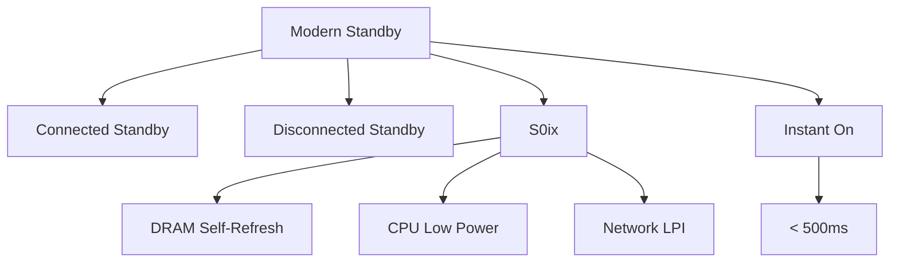

+++
title = "modern standby"
date = "2026-03-14"
weight = 726
+++

# 모던 스탠바이 (Modern Standby, S0ix)

#### 핵심 인사이트 (3줄 요약)
> 1. **본질**: Windows 10+의 저전력 대기 모드로, S3 수준 절전을 유지하면서 네트워크 연결과 백그라운드 작업 수행
> 2. **가치**: 즉시 켜짐(Instant On), 백그라운드 업데이트, 알림 수신, 배터리 수명 유지
> 3. **융합**: ACPI S0ix 상태, DRAM Self-Refresh, 네트워크 연결 대기(CS/DRS)와 통합된 연결형 절전

---

### Ⅰ. 개요 (Context & Background)

**개념 정의**

모던 스탠바이(Modern Standby, S0ix)는 Windows 10부터 도입된 저전력 대기 모드입니다. 기존 S3(Sleep)의 깊은 절전과 S0(Active)의 연결성을 결합하여, 네트워크 연결을 유지하면서도 배터리를 오래 지속합니다.

```
┌─────────────────────────────────────────────────────────────────────┐
│                    모던 스탠바이 vs 기존 S3 비교                      │
├─────────────────────────────────────────────────────────────────────┤
│                                                                     │
│   ┌──────────────────────────────────────────────────────────────┐ │
│   │              기존 S3 Sleep (Legacy)                          │ │
│   │                                                              │ │
│   │   활성(S0) ──────► S3 Sleep ──────► 활성(S0)               │ │
│   │                    │                   ▲                    │ │
│   │                    │                   │                    │ │
│   │                    ▼                   │                    │ │
│   │              모든 전원 차단          복귀 지연               │ │
│   │              네트워크 끊김          (~수 초)                 │ │
│   │              복귀 시 재연결 필요                             │ │
│   │                                                              │ │
│   └──────────────────────────────────────────────────────────────┘ │
│                                                                     │
│   ┌──────────────────────────────────────────────────────────────┐ │
│   │              모던 스탠바이 (Modern Standby, S0ix)            │ │
│   │                                                              │ │
│   │   활성(S0) ──────► S0ix 저전력 ──────► 활성(S0)            │ │
│   │                    │                     ▲                  │ │
│   │                    │                     │                  │ │
│   │                    ▼                     │                  │ │
│   │              DRAM Self-Refresh         즉시 복귀            │ │
│   │              네트워크 연결 유지        (~수 ms)              │ │
│   │              백그라운드 작업 가능                            │ │
│   │                                                              │ │
│   └──────────────────────────────────────────────────────────────┘ │
│                                                                     │
│   ┌──────────────────────────────────────────────────────────────┐ │
│   │              모던 스탠바이 상태 세분화                        │ │
│   │                                                              │ │
│   │   S0ix                                                       │ │
│   │    │                                                         │ │
│   │    ├── Connected Standby (CS)                                │ │
│   │    │   - 네트워크 연결 유지                                  │ │
│   │    │   - 이메일/알림 수신                                    │ │
│   │    │   - VoIP 수신                                           │ │
│   │    │   - 위치 서비스                                         │ │
│   │    │                                                         │ │
│   │    └── Disconnected Standby (DRS)                            │ │
│   │        - 네트워크 연결 차단                                  │ │
│   │        - 최대 절전                                          │ │
│   │        - 배터리 보존 우선                                   │ │
│   │                                                              │ │
│   └──────────────────────────────────────────────────────────────┘ │
│                                                                     │
└─────────────────────────────────────────────────────────────────────┘
```

> **해설**: 모던 스탠바이는 S3처럼 깊은 절전을 제공하면서도, 스마트폰처럼 네트워크 연결을 유지하고 백그라운드 작업을 수행합니다.

**💡 비유**: 모던 스탠바이는 스마트폰의 대기 모드와 같습니다. 화면은 꺼져 있지만 알림은 계속 받고, 켜면 바로 사용할 수 있습니다.

**등장 배경**

① **기존 한계**: S3 Sleep → 복귀 지연, 네트워크 끊김, 업데이트 불가
② **혁신적 패러다임**: 스마트폰 같은 Instant On + Connected Standby
③ **비즈니스 요구**: 모바일 사용자 경험, 보안 업데이트, 클라우드 동기화

**📢 섹션 요약 비유**: 모던 스탠바이는 스마트폰 대기 모드 같아요. 화면은 꺼져도 알림은 받아요.

---

### Ⅱ. 아키텍처 및 핵심 원리 (Deep Dive)

**구성 요소 상세 분석**

| 요소명 | 역할 | 내부 동작 | 비유 |
|:---|:---|:---|:---|
| **S0ix** | 저전력 유휴 상태 | CPU/SoC 저전력 | 잠자기 |
| **CS** | Connected Standby | 네트워크 유지 | 대기 모드 |
| **DRS** | Disconnected Standby | 네트워크 차단 | 비행기 모드 |
| **AoAC** | Always On Always Connected | 실시간 연결 | 상시 대기 |
| **DRIPS** | Deepest Runtime Idle | 최저 전력 상태 | 깊은 잠 |

**모던 스탠바이 진입 및 복귀 메커니즘**

```
┌─────────────────────────────────────────────────────────────────────┐
│                    모던 스탠바이 진입 메커니즘                       │
├─────────────────────────────────────────────────────────────────────┤
│                                                                     │
│   ┌──────────────────────────────────────────────────────────────┐ │
│   │              진입 조건 확인                                   │ │
│   │                                                              │ │
│   │   1. 화면 꺼짐                                               │ │
│   │   2. 실행 중인 앱 없음 (또는 허용된 백그라운드 앱만)          │ │
│   │   3. CPU/SoC 유휴 상태                                       │ │
│   │   4. 차단 요청 없음 (오디오, 전화 등)                        │ │
│   │                                                              │ │
│   └──────────────────────────────────────────────────────────────┘ │
│                                │                                    │
│                                ▼                                    │
│   ┌──────────────────────────────────────────────────────────────┐ │
│   │              S0ix 진입 단계                                   │ │
│   │                                                              │ │
│   │   Phase 1: 앱 준비 (Prepare)                                │ │
│   │   - 백그라운드 앱 일시정지                                   │ │
│   │   - 네트워크 요청 완료 대기                                  │ │
│   │   - 알림 대기 모드 전환                                      │ │
│   │                                                              │ │
│   │   Phase 2: 하드웨어 저전력 (Hardware Low Power)             │ │
│   │   - 디스플레이 오프                                          │ │
│   │   - CPU C7/C10 진입                                         │ │
│   │   - DRAM Self-Refresh                                        │ │
│   │   - 네트워크 컨트롤러 저전력                                 │ │
│   │                                                              │ │
│   │   Phase 3: DRIPS (Deepest Runtime Idle Power State)         │ │
│   │   - 최저 전력 상태                                           │ │
│   │   - 웨이크 이벤트 대기                                       │ │
│   │   - 배터리 방전 최소화                                       │ │
│   │                                                              │ │
│   └──────────────────────────────────────────────────────────────┘ │
│                                │                                    │
│                                ▼                                    │
│   ┌──────────────────────────────────────────────────────────────┐ │
│   │              복귀 이벤트                                      │ │
│   │                                                              │ │
│   │   - 전원 버튼                                                │ │
│   │   - 키보드/마우스 입력                                       │ │
│   │   - 네트워크 알림 (Wi-Fi, 이더넷)                           │ │
│   │   - 타이머 (알람, 예약 작업)                                 │ │
│   │   - 전화 수신 (VoIP)                                         │ │
│   │                                                              │ │
│   │   복귀 시간: ~100-500ms (즉시 켜짐)                          │ │
│   │                                                              │ │
│   └──────────────────────────────────────────────────────────────┘ │
│                                                                     │
└─────────────────────────────────────────────────────────────────────┘
```

> **해설**: 화면이 꺼지면 시스템은 단계적으로 저전력 상태로 진입합니다. DRIPS 상태에서는 최소 전력만 소비하며, 이벤트 발생 시 즉시 복귀합니다.

**핵심 알고리즘: 모던 스탠바이 관리**

```c
// 모던 스탠바이 관리 (의사코드)
struct ModernStandby {
    bool    connected;          // Connected Standby 여부
    bool    in_standby;
    uint32_t entry_count;
    uint64_t standby_duration;  // ms
};

// 모던 스탠바이 진입
void EnterModernStandby(struct ModernStandby *ms, bool connected) {
    ms->connected = connected;
    ms->in_standby = true;

    // Phase 1: 앱 준비
    SuspendBackgroundApps();

    // Phase 2: 하드웨어 저전력
    SetDisplayOff();
    SetCpuLowPower();

    if (connected) {
        // Connected Standby: 네트워크 유지
        SetNetworkLowPower(NET_LPI);  // Low Power Idle
        EnableWoL();  // Wake on LAN
    } else {
        // Disconnected Standby: 네트워크 차단
        DisableNetwork();
    }

    // DRAM Self-Refresh
    EnableDramSelfRefresh();

    // Phase 3: DRIPS 진입
    EnterDRIPS();

    ms->entry_count++;
}

// 모던 스탠바이 복귀
void ExitModernStandby(struct ModernStandby *ms) {
    // DRIPS 탈출
    ExitDRIPS();

    // 하드웨어 복원
    RestoreCpuPower();
    RestoreDisplay();

    if (ms->connected) {
        RestoreNetworkPower();
    }

    // 앱 재개
    ResumeBackgroundApps();

    ms->in_standby = false;
}

// Windows에서 모던 스탠바이 확인
// > powercfg /a
// 시스템에서 사용할 수 있는 절전 상태:
//     대기(S1 低 대기 시간)
//     대기(S2 低 대기 시간)
//     대기(S3 低 대기 시간)
//     최대 절전 모드
//     하이브리드 절전 모드
//     모던 스탠바이 (S0 저전력 유휴) 네트워크 연결 사용/사용 안 함

// > powercfg /sleepstudy /output sleepstudy.html
// (상세 슬립스터디 보고서 생성)
```

**📢 섹션 요약 비유**: 모던 스탠바이 진입은 잠들기 전 준비와 같습니다. 전등 끄고, 문 잠그고, 알람 설정하고 잡니다.

---

### Ⅲ. 융합 비교 및 다각도 분석 (Comparison & Synergy)

**기술 비교: S3 vs S0ix vs S4**

| 비교 항목 | S3 (Sleep) | S0ix (Modern Standby) | S4 (Hibernate) |
|:---|:---:|:---:|:---:|
| **전력 소비** | ~1-2W | ~0.5-1W | ~0W |
| **복귀 시간** | ~1-3초 | ~0.1-0.5초 | ~5-15초 |
| **네트워크** | 끊김 | 유지 (CS) | 끊김 |
| **백그라운드** | 불가 | 가능 | 불가 |
| **DRAM** | Self-Refresh | Self-Refresh | 디스크 저장 |

**과목 융합 관점: 모던 스탠바이와 타 영역 시너지**

| 융합 영역 | 시너지 효과 | 구현 예시 |
|:---|:---|:---|
| **OS (운영체제)** | Power Manager | Windows PoQ |
| **네트워크** | WoWLAN, ARP Offload | Wi-Fi LPI |
| **보안** | BitLocker 유지 | 암호화 상태 |
| **클라우드** | 동기화 업데이트 | OneDrive |
| **모바일** 배터리 | 수명 연장 | UltraBook |

**📢 섹션 요약 비유**: S3은 깊은 잠, S0ix는 낮잠, S4는 동면과 같습니다. 낮잠은 금방 깹니다.

---

### Ⅳ. 실무 적용 및 기술사적 판단 (Strategy & Decision)

**실무 시나리오별 적용**

**시나리오 1: Ultrabook**
- **문제**: 배터리 수명, 즉시 켜짐
- **해결**: Connected Standby
- **의사결정**: 네트워크 알림 필요

**시나리오 2: 데스크톱**
- **문제**: 전력 절감 필요성 낮음
- **해결**: S3 또는 모던 스탠바이 비활성화
- **의사결정**: 성능 우선

**시나리오 3: 태블릿**
- **문제**: 최대 배터리 수명
- **해결**: Disconnected Standby
- **의사결정**: 네트워크 차단 절전

**도입 체크리스트**

| 구분 | 항목 | 확인 포인트 |
|:---|:---|:---|
| **기술적** | 펌웨어 | ACPI S0ix 지원 |
| | OS | Windows 10+ |
| | 드라이버 | 모던 스탠바이 호환 |
| **운영적** | 모니터링 | SleepStudy |
| | 문제 해결 | powercfg /energy |
| | 배터리 | 소모율 확인 |

**안티패턴: 모던 스탠바이 오용 사례**

| 안티패턴 | 문제점 | 올바른 접근 |
|:---|:---|:---|
| **앱 차단 누락** | 배터리 소모 | 백그라운드 제한 |
| **드라이버 미호환** | 수면 불가 | 드라이버 업데이트 |
| **CS 과신** | 배터리 방전 | DRS 병용 |
| **모니터링 부재** | 원인 파악 불가 | SleepStudy 사용 |

**📢 섹션 요약 비유**: 모던 스탠바이 튜닝은 스마트폰 배터리 최적화와 같습니다. 백그라운드 앱을 관리해야 합니다.

---

### Ⅴ. 기대효과 및 결론 (Future & Standard)

**정량/정성 기대효과**

| 구분 | S3 Sleep | 모던 스탠바이 | 개선효과 |
|:---|:---:|:---:|:---:|
| **복귀 시간** | 2-3초 | 0.3초 | 90% 단축 |
| **대기 전력** | 1-2W | 0.5W | 50-75% 절감 |
| **사용자 경험** | 보통 | 우수 | 향상 |
| **백그라운드** | 불가 | 가능 | 추가 기능 |

**미래 전망**

1. **Intel Dynamic Tuning:** AI 기반 전력 최적화
2. **AMD SmartShift:** APU/GPU 전력 분배
3. **ARM big.LITTLE:** 효율 코어 활용
4. **Zero Power Standby:** 사실상 제로 전력

**참고 표준**

| 표준 | 내용 | 적용 |
|:---|:---|:---|
| **ACPI 6.5** | S0ix 상태 | 펌웨어 |
| **Windows HW** | Modern Standby | Windows 10+ |
| **Intel** | S0ix State | Intel CPU |
| **UEFI** | Low Power Idle | 펌웨어 |

**📢 섹션 요약 비유**: 모던 스탠바이의 미래는 제로 전력 대기와 같습니다. 배터리를 거의 안 쓰면서도 연결을 유지합니다.

---

### 📌 관련 개념 맵 (Knowledge Graph)



**연관 개념 링크**:
- ACPI S-States - 시스템 절전 상태
- Package C-States - 패키지 절전
- P-States - 성능 상태
- S0ix 저전력 유휴 상태 - S0ix 상세

---

### 👶 어린이를 위한 3줄 비유 설명

1. **스마트폰 대기**: 모던 스탠바이는 스마트폰 대기 모드 같아요. 화면은 꺼져도 메시지는 받아요.

2. **즉시 켜짐**: 뚜껑을 열면 바로 켜져요. 1초도 안 걸려요!

3. **알림 받기**: 친구가 메시지 보내면 바로 알려줘요. 잠자면서도 귀는 기울여요!