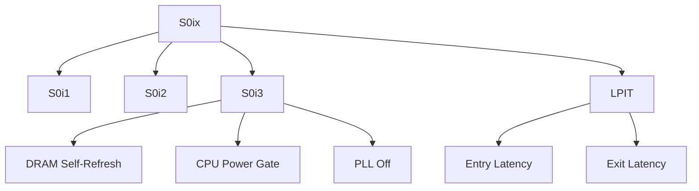

+++
title = "s0ix idle"
date = "2026-03-14"
weight = 727
+++

# S0ix 저전력 유휴 상태 (S0ix Low Power Idle)

#### 핵심 인사이트 (3줄 요약)
> 1. **본질**: ACPI S0 상태 내에서 CPU/SoC가 진입하는 세분화된 저전력 유휴 상태 (S0i1-S0i3)
> 2. **가치**: DRAM Self-Refresh 유지하면서도 마이크로와트급 전력 소비, 모던 스탠바이의 핵심 기술
> 3. **융합**: Intel LPIT, AMD Platform Power Management, DRAM SR, 네트워크 LPI와 통합된 SoC 전력 관리

---

### Ⅰ. 개요 (Context & Background)

**개념 정의**

S0ix 저전력 유휴 상태(S0ix Low Power Idle)는 ACPI S0(활성) 상태 내에서 CPU/SoC가 진입하는 세분화된 저전력 상태입니다. S0i1부터 S0i3까지 깊이가 다르며, 가장 깊은 상태에서는 마이크로와트(μW)급 전력만 소비합니다.

```
┌─────────────────────────────────────────────────────────────────────┐
│                    S0ix 저전력 유휴 상태 계층                         │
├─────────────────────────────────────────────────────────────────────┤
│                                                                     │
│   ┌──────────────────────────────────────────────────────────────┐ │
│   │              ACPI S0 (Active) 내의 S0ix 상태                  │ │
│   │                                                              │ │
│   │   전력 소비                                                   │ │
│   │      ▲                                                       │ │
│   │      │                                                       │ │
│   │   S0 ─────────────────────────────────── 10-100W            │ │
│   │      │   (완전 활성)                                         │ │
│   │      │                                                       │ │
│   │      ▼                                                       │ │
│   │   S0i1 ───────────────────────────────── 수백 mW             │ │
│   │      │   - CPU Clock Gating                                  │ │
│   │      │   - 일부 전압 유지                                    │ │
│   │      │                                                       │ │
│   │      ▼                                                       │ │
│   │   S0i2 ───────────────────────────────── 수십 mW             │ │
│   │      │   - CPU Power Gating                                  │ │
│   │      │   - PLL 오프                                          │ │
│   │      │                                                       │ │
│   │      ▼                                                       │ │
│   │   S0i3 ───────────────────────────────── 수 mW (μW)          │ │
│   │      │   - Deep Power Down                                   │ │
│   │      │   - DRAM Self-Refresh                                 │ │
│   │      │   - 최저 전력                                         │ │
│   │      │                                                       │ │
│   │   ───┴─────────────────────────────────────────────────      │ │
│   │                                                              │ │
│   │   특징: S3처럼 깊은 절전 + S0처럼 빠른 복귀                  │ │
│   │                                                              │ │
│   └──────────────────────────────────────────────────────────────┘ │
│                                                                     │
│   ┌──────────────────────────────────────────────────────────────┐ │
│   │              S0ix vs 전통적 S3 비교                           │ │
│   │                                                              │ │
│   │   S3 (Sleep):                                                │ │
│   │   S0 ───► S3 ───► S0                                        │ │
│   │        (모든 컨텍스트 메모리 유지, 복귀 지연)                 │ │
│   │                                                              │ │
│   │   S0ix:                                                      │ │
│   │   S0 ───► S0i3 ───► S0                                      │ │
│   │        (컨텍스트 유지, 복귀 즉시, 전력 S3 수준)               │ │
│   │                                                              │ │
│   └──────────────────────────────────────────────────────────────┘ │
│                                                                     │
└─────────────────────────────────────────────────────────────────────┘
```

> **해설**: S0ix는 S0 상태를 벗어나지 않으면서도 S3 수준의 절전을 달성합니다. 복귀는 훨씬 빠릅니다.

**💡 비유**: S0ix는 "얕은 잠"과 같습니다. 깊은 잠(S3)보다 쉽게 깨지만, 거의 같은 에너지를 절약합니다.

**등장 배경**

① **기존 한계**: S0↔S3 전환 오버헤드, 복귀 지연
② **혁신적 패러다임**: S0 내에서 저전력 상태 구현
③ **비즈니스 요구**: 스마트폰 같은 Instant On, Always Connected

**📢 섹션 요약 비유**: S0ix는 얕은 잠 같아요. 쉽게 깨지만 에너지는 많이 아껴요.

---

### Ⅱ. 아키텍처 및 핵심 원리 (Deep Dive)

**구성 요소 상세 분석**

| 상태 | 명칭 | 전력 | 복귀 시간 | 차단 항목 |
|:---|:---|:---|:---|:---|
| **S0i1** | Light Idle | ~수백mW | ~10μs | CPU Clock |
| **S0i2** | Medium Idle | ~수십mW | ~100μs | CPU Power, PLL |
| **S0i3** | Deep Idle | ~수mW | ~1ms | DRAM SR, 대부분 |

**S0ix 진입 메커니즘**

```
┌─────────────────────────────────────────────────────────────────────┐
│                    S0ix 진입 메커니즘                                │
├─────────────────────────────────────────────────────────────────────┤
│                                                                     │
│   ┌──────────────────────────────────────────────────────────────┐ │
│   │              S0ix 진입 조건 확인                              │ │
│   │                                                              │ │
│   │   1. 모든 코어 C-State ≥ C7                                 │ │
│   │   2. PCIe Device Power Management (D3cold)                  │ │
│   │   3. 네트워크 LPI (Low Power Idle)                          │ │
│   │   4. 디스플레이 오프                                         │ │
│   │   5. 오디오/비디오 미사용                                    │ │
│   │   6. 인터럽트 차단 가능                                      │ │
│   │                                                              │ │
│   └──────────────────────────────────────────────────────────────┘ │
│                                │                                    │
│                                ▼                                    │
│   ┌──────────────────────────────────────────────────────────────┐ │
│   │              S0ix 상태 전이                                   │ │
│   │                                                              │ │
│   │   S0 (Active)                                                │ │
│   │      │                                                       │ │
│   │      │ 코어 C7 진입                                          │ │
│   │      ▼                                                       │ │
│   │   S0i1: Clock Gating                                        │ │
│   │      │ - CPU 클럭 정지                                       │ │
│   │      │ - L2/L3 캐시 유지                                     │ │
│   │      │                                                       │ │
│   │      │ PLL 오프                                              │ │
│   │      ▼                                                       │ │
│   │   S0i2: Power Gating                                        │ │
│   │      │ - CPU 전압 오프                                       │ │
│   │      │ - PLL 오프                                            │ │
│   │      │ - 일부 전원 레일 오프                                  │ │
│   │      │                                                       │ │
│   │      │ DRAM Self-Refresh                                     │ │
│   │      ▼                                                       │ │
│   │   S0i3: Deep Power Down                                     │ │
│   │        - DRAM Self-Refresh 모드                              │ │
│   │        - 대부분 전원 레일 오프                                │ │
│   │        - 메모리 컨트롤러 최저 전력                           │ │
│   │        - 웨이크 이벤트 대기                                   │ │
│   │                                                              │ │
│   └──────────────────────────────────────────────────────────────┘ │
│                                                                     │
│   ┌──────────────────────────────────────────────────────────────┐ │
│   │              Intel LPIT (Low Power Idle Table)               │ │
│   │                                                              │ │
│   │   ACPI 테이블로 S0ix 상태 정보 제공                          │ │
│   │                                                              │ │
│   │   LPIT Entry:                                                │ │
│   │   - Type: S0i1/S0i2/S0i3                                    │ │
│   │   - Entry Latency: 진입 시간                                 │ │
│   │   - Exit Latency: 복귀 시간                                  │ │
│   │   - Minimum Residency: 최소 체류 시간                        │ │
│   │   - Counter Address: 상태 카운터                             │ │
│   │                                                              │ │
│   └──────────────────────────────────────────────────────────────┘ │
│                                                                     │
└─────────────────────────────────────────────────────────────────────┘
```

> **해설**: S0ix 진입은 코어 C-State, 디바이스 D-State, 네트워크 LPI가 모두 준비되어야 합니다. LPIT 테이블이 상태 정보를 제공합니다.

**핵심 알고리즘: S0ix 관리**

```c
// S0ix 저전력 유휴 상태 관리 (의사코드)
struct S0ixState {
    uint8_t  current_state;     // S0i0, S0i1, S0i2, S0i3
    uint64_t residency[4];      // 각 상태별 체류 시간
    uint64_t entry_count[4];    // 각 상태별 진입 횟수
};

// S0ix 진입 가능 확인
bool CanEnterS0ix(uint8_t target_state) {
    // 1. 모든 코어 C-State 확인
    for (int i = 0; i < num_cores; i++) {
        if (core[i].cstate < C7) return false;
    }

    // 2. PCIe 디바이스 확인
    for (int i = 0; i < num_devices; i++) {
        if (device[i].dstate < D3cold) return false;
    }

    // 3. 네트워크 LPI 확인
    if (!IsNetworkLPI()) return false;

    // 4. 디스플레이 확인
    if (display.on) return false;

    return true;
}

// S0ix 진입
void EnterS0ix(struct S0ixState *s0ix, uint8_t target) {
    if (!CanEnterS0ix(target)) return;

    switch (target) {
        case S0i1:
            EnableCPUClockGating();
            break;

        case S0i2:
            EnableCPUClockGating();
            DisablePLL();
            PowerGateCPU();
            break;

        case S0i3:
            EnableCPUClockGating();
            DisablePLL();
            PowerGateCPU();
            EnableDRAMSelfRefresh();
            PowerGateMemoryController();
            break;
    }

    s0ix->current_state = target;
    s0ix->entry_count[target]++;
}

// Linux에서 S0ix 상태 확인
// # cat /sys/firmware/acpi/platform_profile
// low-power

// # cat /sys/devices/system/cpu/cpuidle/low_latency
// 0

// # turbostat --debug
// ... CPU% S0ix% ...
// ... 0.1  95.2  ...

// Intel LPIT 테이블 확인
// # cat /sys/firmware/acpi/tables/LPIT > lpit.bin
// # iasl -d lpit.bin
```

**📢 섹션 요약 비유**: S0ix 진입은 단계적 가스 절약과 같습니다. 시동 끄고, 전기 끄고, 최소한만 켭니다.

---

### Ⅲ. 융합 비교 및 다각도 분석 (Comparison & Synergy)

**기술 비교: Intel vs AMD S0ix**

| 비교 항목 | Intel | AMD |
|:---|:---:|:---:|
| **구현** | LPIT | Platform PM |
| **상태** | S0i1-S0i3 | S0i1-S0i3 |
| **진입 시간** | ~수 ms | ~수 ms |
| **복귀 시간** | ~1ms | ~1ms |

**과목 융합 관점: S0ix와 타 영역 시너지**

| 융합 영역 | 시너지 효과 | 구현 예시 |
|:---|:---|:---|
| **OS (운영체제)** | Intel Idle Driver | intel_idle |
| **네트워크** | LPI, EEE | Energy Efficient |
| **DRAM** | Self-Refresh | DDR4 SR |
| **디스플레이** | Panel Self-Refresh | eDP PSR |
| **클라우드** | 절전 인스턴스 | AWS T3 |

**📢 섹션 요약 비유**: S0ix는 여러 시스템이 함께 잠드는 것과 같습니다. CPU, 네트워크, 디스플레이가 함께 절전합니다.

---

### Ⅳ. 실무 적용 및 기술사적 판단 (Strategy & Decision)

**실무 시나리오별 적용**

**시나리오 1: 노트북**
- **문제**: 배터리 수명
- **해결**: S0i3 적극 활용
- **의사결정**: 모던 스탠바이 활성화

**시나리오 2: 서버**
- **문제**: C-State 지연
- **해결**: S0i1까지만
- **의사결정**: 성능 우선

**시나리오 3: IoT**
- **문제**: 극한 절전
- **해결**: S0i3 + Wake on RTC
- **의사결정**: 주기적 깨움

**도입 체크리스트**

| 구분 | 항목 | 확인 포인트 |
|:---|:---|:---|
| **기술적** | 펌웨어 | LPIT 테이블 |
| | OS | intel_idle |
| | 드라이버 | S0ix 호환 |
| **운영적** | 모니터링 | turbostat |
| | 문제 해결 | S0ix 실패 원인 |
| | 전력 | mW 단위 측정 |

**안티패턴: S0ix 오용 사례**

| 안티패턴 | 문제점 | 올바른 접근 |
|:---|:---|:---|
| **드라이버 미호환** | S0ix 진입 실패 | 드라이버 업데이트 |
| **S0i3 강제** | 복귀 지연 | 워크로드 고려 |
| **모니터링 부재** | 원인 파악 불가 | turbostat 사용 |
| **레이턴시 무시** | 성능 저하 | 적절한 상태 선택 |

**📢 섹션 요약 비유**: S0ix 튜닝은 잠자는 깊이 조절과 같습니다. 너무 깊으면 깨는 데 오래 걸립니다.

---

### Ⅴ. 기대효과 및 결론 (Future & Standard)

**정량/정성 기대효과**

| 구분 | S0 대기 | S0ix | 개선효과 |
|:---|:---:|:---:|:---:|
| **대기 전력** | 10-50W | 0.5-5mW | 99% 절감 |
| **복귀 시간** | 0 | 0.1-1ms | 즉시 |
| **DRAM** | 활성 | SR | 유지 |
| **컨텍스트** | 유지 | 유지 | 무손실 |

**미래 전망**

1. **Intel Meteor Lake:** 더 깊은 S0ix 상태
2. **AMD Zen 4+:** 향상된 Platform PM
3. **ARM DynamIQ:** 클러스터 S0ix
4. **Zero Power Idle:** 사실상 제로 전력

**참고 표준**

| 표준 | 내용 | 적용 |
|:---|:---|:---|
| **ACPI 6.5** | S0ix 상태 | 펌웨어 |
| **Intel LPIT** | Low Power Idle Table | Intel |
| **AMD PM** | Platform Power Management | AMD |
| **Linux** | intel_idle driver | 커널 |

**📢 섹션 요약 비유**: S0ix의 미래는 완전한 제로 전력 대기와 같습니다. 전기를 거의 안 쓰면서도 즉시 깹니다.

---

### 📌 관련 개념 맵 (Knowledge Graph)



**연관 개념 링크**:
- 모던 스탠바이 - Modern Standby
- Package C-States - 패키지 절전
- Core C-States - 코어 절전
- ACPI S-States - 시스템 절전

---

### 👶 어린이를 위한 3줄 비유 설명

1. **얕은 잠**: S0ix는 얕은 잠 같아요. 깊이 자는 것처럼 에너지를 아껴요.

2. **빨리 깨기**: S0i3은 제일 깊이 자요. 하지만 1ms면 깨요!

3. **단계적 잠**: S0i1은 졸기, S0i2은 낮잠, S0i3은 푹 자기예요!