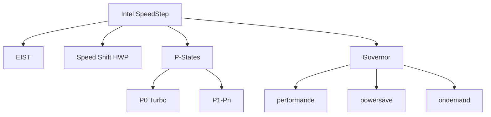

+++
title = "intel speedstep"
date = "2026-03-14"
weight = 728
+++

# 인텔 스피드스텝 (Intel SpeedStep)

#### 핵심 인사이트 (3줄 요약)
> 1. **본질**: CPU 부하에 따라 동적으로 주파수와 전압을 조절하는 Intel의 DVFS(Dynamic Voltage and Frequency Scaling) 기술
> 2. **가치**: 성능 유지하면서 전력 소비 최소화, 배터리 수명 연장, 열 발생 감소
> 3. **융합**: ACPI _PSS, OS Governor, EIST(Enhanced Intel SpeedStep), P-State 관리와 통합된 전력 관리

---

### Ⅰ. 개요 (Context & Background)

**개념 정의**

인텔 스피드스텝(Intel SpeedStep)은 Intel의 DVFS 기술입니다. CPU 부하에 따라 동적으로 주파수와 전압을 조절하여 성능과 전력 사이의 균형을 최적화합니다.

```
┌─────────────────────────────────────────────────────────────────────┐
│                    인텔 스피드스텝 기본 원리                          │
├─────────────────────────────────────────────────────────────────────┤
│                                                                     │
│   ┌──────────────────────────────────────────────────────────────┐ │
│   │              SpeedStep 동작 개념                              │ │
│   │                                                              │ │
│   │   CPU 부하                                                    │ │
│   │      ▲                                                       │ │
│   │   높음 ────────────────────────────────► 고주파수/고전압    │ │
│   │      │                          (P0: 최고 성능)              │ │
│   │      │                                                       │ │
│   │      │                                                       │ │
│   │   중간 ────────────────────────────────► 중주파수/중전압    │ │
│   │      │                          (P2: 중간 성능)              │ │
│   │      │                                                       │ │
│   │      │                                                       │ │
│   │   낮음 ────────────────────────────────► 저주파수/저전압    │ │
│   │                                          (Pn: 최저 성능)      │ │
│   │      │                                                       │ │
│   │   ───┴──────────────────────────────────────────────────     │ │
│   │                                                              │ │
│   │   SpeedStep = P-State 전환 (DVFS)                           │ │
│   │                                                              │ │
│   └──────────────────────────────────────────────────────────────┘ │
│                                                                     │
│   ┌──────────────────────────────────────────────────────────────┐ │
│   │              SpeedStep 발전 단계                              │ │
│   │                                                              │ │
│   │   1세대 (2000): SpeedStep                                    │ │
│   │   - 2개 전압/주파수만 지원                                    │ │
│   │   - OS 기반 전환                                              │ │
│   │   - 수백 ms 전환 시간                                         │ │
│   │                                                              │ │
│   │   2세대 (2002): Enhanced Intel SpeedStep (EIST)             │ │
│   │   - 다중 전압/주파수 지원                                     │ │
│   │   - 더 빠른 전환                                              │ │
│   │   - 전력 관리 통합                                            │ │
│   │                                                              │ │
│   │   3세대 (2008+): Intel Speed Shift (HWP)                    │ │
│   │   - HW 기반 자동 전환                                         │ │
│   │   - 마이크로초 단위 전환                                      │ │
│   │   - OS 개입 최소화                                            │ │
│   │                                                              │ │
│   └──────────────────────────────────────────────────────────────┘ │
│                                                                     │
└─────────────────────────────────────────────────────────────────────┘
```

> **해설**: SpeedStep은 부하가 높으면 고성능(P0), 부하가 낮으면 저전력(Pn)으로 전환합니다. EIST는 개선된 버전입니다.

**💡 비유**: 인텔 스피드스텝은 자동차의 자동 변속기와 같습니다. 오르막에서는 고기어로, 내리막에서는 저기어로 자동 전환합니다.

**등장 배경**

① **기존 한계**: 고정 클럭 → 항상 최대 전력 소비
② **혁신적 패러다임**: DVFS로 워크로드별 최적 전력 관리
③ **비즈니스 요구**: 노트북 배터리 수명, 데이터센터 전력 비용

**📢 섹션 요약 비유**: 스피드스텝은 자동 변속기 같아요. 언덕에서는 고기어, 평지에서는 저기어예요.

---

### Ⅱ. 아키텍처 및 핵심 원리 (Deep Dive)

**구성 요소 상세 분석**

| 요소명 | 역할 | 내부 동작 | 비유 |
|:---|:---|:---|:---|
| **EIST** | Enhanced SpeedStep | P-State 전환 | 변속기 |
| **IA32_PERF_CTL** | 성능 제어 MSR | 목표 P-State | 가속 페달 |
| **IA32_PERF_STATUS** | 성능 상태 MSR | 현재 P-State | 속도계 |
| **P-State Table** | 주파수/전압 테이블 | BIOS 제공 | 기어표 |
| **Governor** | 정책 결정 | OS 커널 | 운전자 |

**SpeedStep 전환 메커니즘**

```
┌─────────────────────────────────────────────────────────────────────┐
│                    SpeedStep P-State 전환 메커니즘                   │
├─────────────────────────────────────────────────────────────────────┤
│                                                                     │
│   ┌──────────────────────────────────────────────────────────────┐ │
│   │              EIST P-State 전환 과정                           │ │
│   │                                                              │ │
│   │   1. Governor 결정 (OS)                                     │ │
│   │      - CPU 사용률 모니터링                                   │ │
│   │      - 정책(performance/powersave/ondemand) 적용             │ │
│   │      - 목표 P-State 결정                                     │ │
│   │                                                              │ │
│   │   2. MSR 기록                                                │ │
│   │      - WRMSR IA32_PERF_CTL (0x199)                          │ │
│   │      - 목표 P-State 설정                                     │ │
│   │                                                              │ │
│   │   3. 하드웨어 전환                                           │ │
│   │      - PLL 재설정 (새 주파수)                                │ │
│   │      - VRM 전압 조정                                         │ │
│   │      - 안정화 대기                                           │ │
│   │                                                              │ │
│   │   4. 완료 확인                                               │ │
│   │      - RDMSR IA32_PERF_STATUS (0x198)                       │ │
│   │      - 현재 P-State 확인                                     │ │
│   │                                                              │ │
│   │   전환 시간: ~10-100μs (EIST)                                │ │
│   │                                                              │ │
│   └──────────────────────────────────────────────────────────────┘ │
│                                                                     │
│   ┌──────────────────────────────────────────────────────────────┐ │
│   │              Speed Shift (HWP) vs EIST                       │ │
│   │                                                              │ │
│   │   EIST (OS 제어):                                            │ │
│   │   OS ───► MSR ───► HW                                        │ │
│   │   (전환: ~10-100μs)                                          │ │
│   │                                                              │ │
│   │   Speed Shift (HW 제어):                                     │ │
│   │   OS ───► HWP Request ───► HW 자동                           │ │
│   │   (전환: ~μs, 더 빠름)                                       │ │
│   │                                                              │ │
│   │   HWP 장점:                                                  │ │
│   │   - OS 개입 없이 HW가 직접 P-State 선택                      │ │
│   │   - 더 빠른 응답                                             │ │
│   │   - 더 정확한 전력 관리                                       │ │
│   │                                                              │ │
│   └──────────────────────────────────────────────────────────────┘ │
│                                                                     │
└─────────────────────────────────────────────────────────────────────┘
```

> **해설**: EIST는 OS가 MSR을 통해 P-State를 제어합니다. Speed Shift(HWP)는 HW가 직접 제어하여 더 빠릅니다.

**핵심 알고리즘: EIST Governor**

```c
// Intel SpeedStep Governor (의사코드)
struct SpeedStepGovernor {
    uint8_t  current_pstate;
    uint8_t  min_pstate;      // P0 (최고 성능)
    uint8_t  max_pstate;      // Pn (최저 성능)
    uint32_t sampling_rate;   // ms
};

// ondemand Governor
void OndemandGovernor(struct SpeedStepGovernor *gov) {
    while (1) {
        uint32_t usage = GetCPUUsage();

        if (usage > 80) {
            // 높은 부하: P0으로 점프
            SetPState(gov, gov->min_pstate);
        } else if (usage < 20) {
            // 낮은 부하: 한 단계 낮춤
            if (gov->current_pstate < gov->max_pstate) {
                SetPState(gov, gov->current_pstate + 1);
            }
        }

        msleep(gov->sampling_rate);
    }
}

// P-State 설정
void SetPState(struct SpeedStepGovernor *gov, uint8_t pstate) {
    // IA32_PERF_CTL MSR에 P-State 기록
    uint64_t value = (uint64_t)pstate << 8;
    wrmsr(IA32_PERF_CTL, value);

    // 완료 대기
    while ((rdmsr(IA32_PERF_STATUS) >> 8) != pstate) {
        cpu_relax();
    }

    gov->current_pstate = pstate;
}

// Linux에서 SpeedStep 확인
// # cat /sys/devices/system/cpu/cpu0/cpufreq/scaling_driver
// intel_pstate  (또는 acpi-cpufreq)

// # cat /sys/devices/system/cpu/cpu0/cpufreq/scaling_available_governors
// performance powersave

// # cat /sys/devices/system/cpu/cpu0/cpufreq/scaling_cur_freq
// 3500000

// # cat /proc/cpuinfo | grep -i speedstep
// flags: ... est (Enhanced SpeedStep Technology)

// MSR 직접 확인
// # rdmsr 0x199
// 0x1a00  (P-State 0x1a = 26)
```

**📢 섹션 요약 비유**: SpeedStep Governor는 자동 변속기 컴퓨터와 같습니다. 엔진 회전수를 보고 자동으로 기어를 바꿉니다.

---

### Ⅲ. 융합 비교 및 다각도 분석 (Comparison & Synergy)

**기술 비교: EIST vs Speed Shift vs Turbo Boost**

| 비교 항목 | EIST | Speed Shift | Turbo Boost |
|:---|:---:|:---:|:---:|
| **제어 주체** | OS | HW | HW |
| **전환 시간** | ~10-100μs | ~μs | ~μs |
| **범위** | P0-Pn | P0-Pn | P0+ (오버) |
| **목적** | 절전 | 절전+성능 | 최고 성능 |

**과목 융합 관점: SpeedStep과 타 영역 시너지**

| 융합 영역 | 시너지 효과 | 구현 예시 |
|:---|:---|:---|
| **OS (운영체제)** | cpufreq 드라이버 | acpi-cpufreq |
| **ACPI** | _PSS 테이블 | P-State 정보 |
| **전력** | RAPL 통합 | 전력 예산 |
| **열** | Thermal 제어 | PROCHOT# |
| **가상화** | vCPU P-State | VM 성능 |

**📢 섹션 요약 비유**: EIST는 기어, Speed Shift는 자동 변속기, Turbo Boost는 스포츠 모드와 같습니다.

---

### Ⅳ. 실무 적용 및 기술사적 판단 (Strategy & Decision)

**실무 시나리오별 적용**

**시나리오 1: 노트북**
- **문제**: 배터리 수명
- **해결**: powersave Governor
- **의사결정**: 절전 우선

**시나리오 2: 웹 서버**
- **문제**: 트래픽 변동
- **해결**: ondemand/schedutil
- **의사결정**: 동적 전환

**시나리오 3: HPC**
- **문제**: 최대 성능
- **해결**: performance Governor
- **의사결정**: 항상 P0

**도입 체크리스트**

| 구분 | 항목 | 확인 포인트 |
|:---|:---|:---|
| **기술적** | BIOS | EIST 활성화 |
| | OS | cpufreq 드라이버 |
| | Governor | 워크로드 적합 |
| **운영적** | 모니터링 | turbostat |
| | 튜닝 | Governor 선택 |
| | 전력 | PkgWatt 확인 |

**안티패턴: SpeedStep 오용 사례**

| 안티패턴 | 문제점 | 올바른 접근 |
|:---|:---|:---|
| **항상 performance** | 전력 낭비 | 워크로드별 선택 |
| **항상 powersave** | 성능 저하 | ondemand 사용 |
| **빈번한 전환** | 오버헤드 | hysteresis 적용 |
| **모니터링 부재** | 문제 파악 불가 | turbostat 사용 |

**📢 섹션 요약 비유**: SpeedStep 설정은 운전 스타일과 같습니다. 에코 드라이빙(powersave) vs 스포츠 드라이빙(performance)을 선택합니다.

---

### Ⅴ. 기대효과 및 결론 (Future & Standard)

**정량/정성 기대효과**

| 구분 | SpeedStep 미사용 | SpeedStep | 개선효과 |
|:---|:---:|:---:|:---:|
| **평균 전력** | 200W | 120W | 40% 절감 |
| **유휴 전력** | 100W | 20W | 80% 절감 |
| **성능** | 100% | 95% | -5% |
| **배터리** | 2시간 | 4시간 | 2배 |

**미래 전망**

1. **Intel Speed Shift:** HW 기반 완전 자동화
2. **AI 기반:** ML로 최적 P-State 예측
3. **3D V-Cache:** 성능 유지하며 전력 감소
4. **Hybrid Core:** P-Core/E-Core 분할 관리

**참고 표준**

| 표준 | 내용 | 적용 |
|:---|:---|:---|
| **Intel SDM** | EIST MSR | Intel CPU |
| **ACPI 6.5** | _PSS, _PPC | 펌웨어 |
| **Linux** | acpi-cpufreq | 커널 |
| **Windows** | Power Policy | OS |

**📢 섹션 요약 비유**: SpeedStep의 미래는 AI 기반 자동 변속과 같습니다. AI가 도로 상황을 분석해 최적 기어를 선택합니다.

---

### 📌 관련 개념 맵 (Knowledge Graph)



**연관 개념 링크**:
- P-States - 성능 상태
- AMD Cool'n'Quiet - AMD 대응 기술
- 인텔 터보부스트 - 오버클럭 기술
- CPU Downclocking - 다운클럭킹

---

### 👶 어린이를 위한 3줄 비유 설명

1. **자동 변속**: 스피드스텝은 자동차 자동 변속 같아요. 언덕에서는 고기어로 바꿔요.

2. **연료 절약**: 천천히 갈 때는 저기어로 가요. 연료를 아껴요!

3. **빠른 전환**: 기어를 바꾸는 건 1/1000초밖에 안 걸려요. 엄청 빨라요!