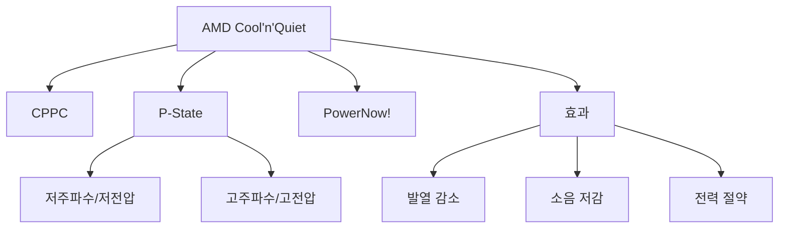

+++
title = "amd coolnquiet"
date = "2026-03-14"
weight = 729
+++

# AMD Cool'n'Quiet (AMD 쿨앤콰이어트)

#### 핵심 인사이트 (3줄 요약)
> 1. **본질**: AMD CPU의 DVFS 기술로, 부하에 따라 동적으로 주파수와 전압을 조절하여 발열과 소음을 줄이는 전력 관리 기술
> 2. **가치**: 발열 감소, 팬 소음 저감, 전력 절약, 배터리 수명 연장
> 3. **융합**: ACPI _PSS, AMD P-State CPPC, PowerNow!, AMD Ryzen P-State와 통합된 전력 관리

---

### Ⅰ. 개요 (Context & Background)

**개념 정의**

AMD Cool'n'Quiet은 AMD CPU의 DVFS 기술입니다. CPU 부하에 따라 동적으로 주파수와 전압을 조절하여 발열을 줄이고 팬 소음을 낮춥니다. Intel SpeedStep의 AMD 대응 기술입니다.

```
┌─────────────────────────────────────────────────────────────────────┐
│                    AMD Cool'n'Quiet 기본 원리                        │
├─────────────────────────────────────────────────────────────────────┤
│                                                                     │
│   ┌──────────────────────────────────────────────────────────────┐ │
│   │              Cool'n'Quiet 동작 개념                           │ │
│   │                                                              │ │
│   │   CPU 부하                                                    │ │
│   │      ▲                                                       │ │
│   │   높음 ────────────────────────────────► 고주파수/고전압    │ │
│   │      │                          (최고 성능)                  │ │
│   │      │                          팬 고속 회전                 │ │
│   │      │                                                       │ │
│   │      │                                                       │ │
│   │   낮음 ────────────────────────────────► 저주파수/저전압    │ │
│   │                                          (최저 성능)          │ │
│   │      │                                   발열 감소            │ │
│   │      │                                   팬 저속/정지         │ │
│   │      │                                                       │ │
│   │   ───┴──────────────────────────────────────────────────     │ │
│   │                                                              │ │
│   │   Cool'n'Quiet = Cool (발열 감소) + Quiet (소음 저감)       │ │
│   │                                                              │ │
│   └──────────────────────────────────────────────────────────────┘ │
│                                                                     │
│   ┌──────────────────────────────────────────────────────────────┐ │
│   │              AMD 전력 관리 기술 발전                          │ │
│   │                                                              │ │
│   │   PowerNow! (2000):                                          │ │
│   │   - 모바일 CPU 전력 관리                                      │ │
│   │   - 노트북용                                                  │ │
│   │                                                              │ │
│   │   Cool'n'Quiet (2002):                                       │ │
│   │   - 데스크톱/서버용 전력 관리                                  │ │
│   │   - 발열/소음 감소 중심                                        │ │
│   │                                                              │ │
│   │   Cool'n'Quiet 2.0 (2007):                                   │ │
│   │   - 다중 P-State 지원                                         │ │
│   │   - 더 세밀한 전압/주파수 제어                                │ │
│   │                                                              │ │
│   │   AMD P-State CPPC (2017+):                                  │ │
│   │   - Ryzen 시리즈                                              │ │
│   │   - HW 기반 자동 전환                                         │ │
│   │   - Collaborative Power Performance Control                   │ │
│   │                                                              │ │
│   └──────────────────────────────────────────────────────────────┘ │
│                                                                     │
└─────────────────────────────────────────────────────────────────────┘
```

> **해설**: Cool'n'Quiet은 부하가 낮을 때 주파수/전압을 낮춰 발열을 줄이고, 팬 소음도 줄입니다.

**💡 비유**: AMD Cool'n'Quiet은 자동차의 에코 모드와 같습니다. 천천히 갈 때는 엔진 회전을 낮춰 연료를 아끼고 소음도 줄입니다.

**등장 배경**

① **기존 한계**: 고정 클럭 → 항상 높은 발열/소음
② **혁신적 패러다임**: DVFS로 발열/소음 감소 + 전력 절약
③ **비즈니스 요구**: 조용한 PC, 저전력 서버, 배터리 수명

**📢 섹션 요약 비유**: Cool'n'Quiet은 에코 모드 같아요. 천천히 갈 때 조용하고 시원해요.

---

### Ⅱ. 아키텍처 및 핵심 원리 (Deep Dive)

**구성 요소 상세 분석**

| 요소명 | 역할 | 내부 동작 | 비유 |
|:---|:---|:---|:---|
| **Cool'n'Quiet** | DVFS | P-State 전환 | 에코 모드 |
| **MSR** | P-State 제어 | MSR_PSTATE_CTL | 가속 페달 |
| **CPPC** | Collaborative Control | HW/OS 협력 | 자동 변속 |
| **P-State Table** | 주파수/전압 테이블 | BIOS 제공 | 기어표 |
| **Governor** | 정책 결정 | OS 커널 | 운전자 |

**Cool'n'Quiet 전환 메커니즘**

```
┌─────────────────────────────────────────────────────────────────────┐
│                    Cool'n'Quiet P-State 전환 메커니즘                │
├─────────────────────────────────────────────────────────────────────┤
│                                                                     │
│   ┌──────────────────────────────────────────────────────────────┐ │
│   │              AMD P-State 전환 과정                            │ │
│   │                                                              │ │
│   │   1. Governor 결정 (OS)                                     │ │
│   │      - CPU 사용률 모니터링                                   │ │
│   │      - 정책(performance/powersave/ondemand) 적용             │ │
│   │      - 목표 P-State 결정                                     │ │
│   │                                                              │ │
│   │   2. MSR/ACPI 요청                                          │ │
│   │      - AMD MSR P-State 제어                                  │ │
│   │      - 또는 ACPI _PSS 채널                                   │ │
│   │                                                              │ │
│   │   3. 하드웨어 전환                                           │ │
│   │      - PLL 재설정 (새 주파수)                                │ │
│   │      - VRM 전압 조정                                         │ │
│   │      - 안정화 대기                                           │ │
│   │                                                              │ │
│   │   4. 팬 속도 조절                                            │ │
│   │      - 온도 하락 감지                                         │ │
│   │      - 팬 RPM 감소 또는 정지                                  │ │
│   │                                                              │ │
│   │   전환 시간: ~10-100μs                                       │ │
│   │                                                              │ │
│   └──────────────────────────────────────────────────────────────┘ │
│                                                                     │
│   ┌──────────────────────────────────────────────────────────────┐ │
│   │              AMD P-State CPPC (최신)                          │ │
│   │                                                              │ │
│   │   Collaborative Power Performance Control:                   │ │
│   │                                                              │ │
│   │   OS ───► HWP Request ───► HW 자동 선택                      │ │
│   │                                                              │ │
│   │   CPPC 레지스터:                                             │ │
│   │   - Highest Performance (P0)                                 │ │
│   │   - Nominal Performance                                      │ │
│   │   - Lowest Nonlinear Performance                             │ │
│   │   - Lowest Performance (Pn)                                  │ │
│   │   - Guaranteed Performance                                   │ │
│   │                                                              │ │
│   │   장점:                                                      │ │
│   │   - OS와 HW가 협력하여 최적 성능/전력 선택                   │ │
│   │   - 더 정확한 워크로드 대응                                   │ │
│   │   - Ryzen 시리즈 기본                                         │ │
│   │                                                              │ │
│   └──────────────────────────────────────────────────────────────┘ │
│                                                                     │
└─────────────────────────────────────────────────────────────────────┘
```

> **해설**: AMD P-State는 OS가 목표를 설정하고 HW가 최적 P-State를 선택합니다. CPPC는 협력적 제어입니다.

**핵심 알고리즘: AMD P-State Governor**

```c
// AMD Cool'n'Quiet Governor (의사코드)
struct AMDPStateGovernor {
    uint8_t  current_pstate;
    uint8_t  min_perf;      // 최고 성능
    uint8_t  max_perf;      // 최저 성능
    uint32_t sampling_rate;
};

// AMD P-State 설정
void SetAMDPState(struct AMDPStateGovernor *gov, uint8_t perf) {
    // CPPC Desired Performance 레지스터 설정
    // 또는 MSR P-State 제어

    // MSR 방식 (레거시)
    wrmsr(AMD_PSTATE_CTL, perf);

    // 완료 대기
    while (rdmsr(AMD_PSTATE_STATUS) != perf) {
        cpu_relax();
    }

    gov->current_pstate = perf;
}

// CPPC 방식 (Ryzen+)
void SetCPPCPerformance(uint8_t min, uint8_t max, uint8_t desired) {
    // ACPI CPPC 레지스터
    WriteCPPCRegister(CPPC_MIN_PERF, min);
    WriteCPPCRegister(CPPC_MAX_PERF, max);
    WriteCPPCRegister(CPPC_DESIRED_PERF, desired);

    // HW가 자동으로 최적 P-State 선택
}

// Linux에서 AMD P-State 확인
// # cat /sys/devices/system/cpu/cpu0/cpufreq/scaling_driver
// amd-pstate  (또는 acpi-cpufreq)

// # cat /sys/devices/system/cpu/cpu0/cpufreq/scaling_available_governors
// performance powersave schedutil

// # cat /sys/devices/system/cpu/cpu0/cpufreq/scaling_cur_freq
// 3200000

// AMD P-State EPP 확인
// # cat /sys/devices/system/cpu/cpu0/cpufreq/energy_performance_preference
// balance_performance

// Ryzen 전압/주파수 모니터링
// # sensors
// k10temp-pci-00c3
// Adapter: PCI adapter
// Tctl:         +45.0°C
// Tdie:         +42.0°C
```

**📢 섹션 요약 비유**: AMD P-State는 운전자와 자동차가 협력하는 것과 같습니다. 운전자가 목적지를 말하면 차가 최적 경로를 선택합니다.

---

### Ⅲ. 융합 비교 및 다각도 분석 (Comparison & Synergy)

**기술 비교: AMD Cool'n'Quiet vs Intel SpeedStep**

| 비교 항목 | Cool'n'Quiet | SpeedStep |
|:---|:---:|:---:|
| **제조사** | AMD | Intel |
| **구현** | CPPC | HWP |
| **전환 시간** | ~μs | ~μs |
| **목적** | 발열/소음 감소 | 전력 절약 |
| **팬 제어** | 통합 | 별도 |

**과목 융합 관점: Cool'n'Quiet과 타 영역 시너지**

| 융합 영역 | 시너지 효과 | 구현 예시 |
|:---|:---|:---|
| **OS (운영체제)** | amd-pstate 드라이버 | Linux |
| **ACPI** | _PSS, CPPC | 펌웨어 |
| **열** | 발열 감소 | Tctl 모니터링 |
| **냉각** | 팬 소음 저감 | Quiet 모드 |
| **가상화** | vCPU P-State | VM 성능 |

**📢 섹션 요약 비유**: Cool'n'Quiet은 SpeedStep과 같은 목표지만, 발열과 소음에 더 집중합니다. 시원하고 조용한 방 같아요.

---

### Ⅳ. 실무 적용 및 기술사적 판단 (Strategy & Decision)

**실무 시나리오별 적용**

**시나리오 1: 홈 시어터 PC**
- **문제**: 팬 소음
- **해결**: Cool'n'Quiet + 저소음 팬
- **의사결정**: 절전/저소음 우선

**시나리오 2: 워크스테이션**
- **문제**: 렌더링 성능
- **해결**: performance Governor
- **의사결정**: 성능 우선

**시나리오 3: 서버**
- **문제**: 전력 비용
- **해결**: powersave/schedutil
- **의사결정**: 전력 절약

**도입 체크리스트**

| 구분 | 항목 | 확인 포인트 |
|:---|:---|:---|
| **기술적** | BIOS | Cool'n'Quiet 활성화 |
| | OS | amd-pstate 드라이버 |
| | Governor | 워크로드 적합 |
| **운영적** | 모니터링 | sensors, turbostat |
| | 온도 | Tctl/Tdie 확인 |
| | 팬 | RPM 모니터링 |

**안티패턴: Cool'n'Quiet 오용 사례**

| 안티패턴 | 문제점 | 올바른 접근 |
|:---|:---|:---|
| **비활성화** | 발열/소음 증가 | 활성화 권장 |
| **과신** | 한계 존재 | 열 설계 병행 |
| **잘못된 Governor** | 성능/전력 불균형 | 워크로드 고려 |
| **모니터링 부재** | 문제 파악 불가 | sensors 사용 |

**📢 섹션 요약 비유**: Cool'n'Quiet 설정은 에어컨 설정과 같습니다. 온도를 맞추면 시원하고 조용해집니다.

---

### Ⅴ. 기대효과 및 결론 (Future & Standard)

**정량/정성 기대효과**

| 구분 | CnQ 미사용 | Cool'n'Quiet | 개선효과 |
|:---|:---:|:---:|:---:|
| **유휴 온도** | 60°C | 35°C | 25°C 감소 |
| **팬 소음** | 35dB | 20dB | 15dB 감소 |
| **유휴 전력** | 100W | 30W | 70% 절감 |
| **성능** | 100% | 95% | -5% |

**미래 전망**

1. **AMD P-State EPP:** 에너지 성능 선호도
2. **SmartShift:** APU/GPU 전력 분배
3. **Hybrid Core:** Zen 4c 효율 코어
4. **AI 기반:** ML로 최적 P-State 예측

**참고 표준**

| 표준 | 내용 | 적용 |
|:---|:---|:---|
| **AMD BKDG** | P-State MSR | AMD CPU |
| **ACPI 6.5** | _PSS, CPPC | 펌웨어 |
| **Linux** | amd-pstate | 커널 |
| **Windows** | Power Policy | OS |

**📢 섹션 요약 비유**: Cool'n'Quiet의 미래는 스마트 에어컨과 같습니다. AI가 온도를 감지해 자동으로 시원하고 조용하게 합니다.

---

### 📌 관련 개념 맵 (Knowledge Graph)



**연관 개념 링크**:
- 인텔 스피드스텝 - Intel 대응 기술
- AMD 프리시전 부스트 - AMD 터보 기술
- P-States - 성능 상태
- 스마트 시프트 - AMD 전력 분배

---

### 👶 어린이를 위한 3줄 비유 설명

1. **시원하고 조용**: Cool'n'Quiet은 시원하고 조용한 방 같아요. 에어컨이 알아서 온도를 맞춰요.

2. **에너지 절약**: 할 일이 없으면 조용히 쉬어요. 전기를 아껴요!

3. **필요하면 빠르게**: 일이 생기면 바로 달려요. 느리지 않아요!