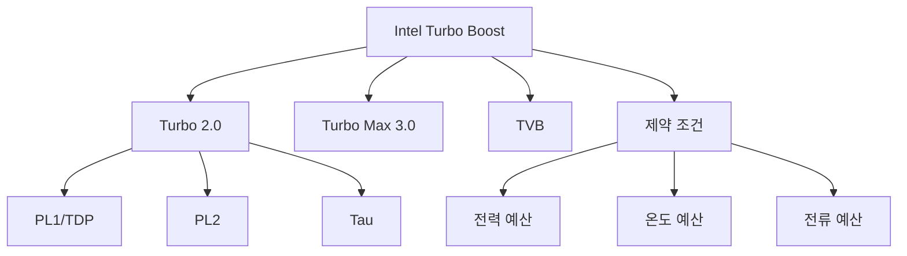

+++
title = "intel turbo boost"
date = "2026-03-14"
weight = 730
+++

# 인텔 터보부스트 (Intel Turbo Boost)

#### 핵심 인사이트 (3줄 요약)
> 1. **본질**: TDP(Thermal Design Power) 내에서 코어 수에 따라 자동으로 오버클럭하는 Intel의 가속 기술
> 2. **가치**: 싱글/멀티스레드 성능 향상, TDP 예산 활용 최적화, 전력/열 헤드룩 활용
> 3. **융합**: P-State, Intel Speed Shift, Thermal Velocity Boost, Power Limit(PL1/PL2)과 통합된 동적 가속

---

### Ⅰ. 개요 (Context & Background)

**개념 정의**

인텔 터보부스트(Intel Turbo Boost)는 Intel CPU의 자동 오버클럭 기술입니다. TDP(열 설계 전력) 범위 내에서 활성 코어 수에 따라 자동으로 클럭을 높여 성능을 가속합니다.

```
┌─────────────────────────────────────────────────────────────────────┐
│                    인텔 터보부스트 기본 원리                          │
├─────────────────────────────────────────────────────────────────────┤
│                                                                     │
│   ┌──────────────────────────────────────────────────────────────┐ │
│   │              Turbo Boost 동작 개념                            │ │
│   │                                                              │ │
│   │   주파수 (GHz)                                                │ │
│   │      ▲                                                       │ │
│   │      │                                                       │ │
│   │   5.5 ────┬── Turbo Boost Max 3.0 (1코어)                   │ │
│   │      │    │                                                  │ │
│   │   5.0 ────┼── Turbo Boost 2.0 (1-2코어)                     │ │
│   │      │    │                                                  │ │
│   │   4.5 ────┼── Turbo Boost (4코어)                           │ │
│   │      │    │                                                  │ │
│   │   3.8 ────┼── 기본 클럭 (Base, 모든 코어)                    │ │
│   │      │    │                                                  │ │
│   │   ───┴────┴─────────────────────────────────────────────     │ │
│   │        1    2    4    8   활성 코어 수                       │ │
│   │                                                              │ │
│   │   핵심: 활성 코어가 적을수록 더 높은 클럭 가능                │ │
│   │                                                              │ │
│   └──────────────────────────────────────────────────────────────┘ │
│                                                                     │
│   ┌──────────────────────────────────────────────────────────────┐ │
│   │              Turbo Boost 발전 단계                            │ │
│   │                                                              │ │
│   │   Turbo Boost 1.0 (2008):                                    │ │
│   │   - 기본 오버클럭                                             │ │
│   │   - TDP 내에서만 작동                                         │ │
│   │                                                              │ │
│   │   Turbo Boost 2.0 (2011):                                    │ │
│   │   - PL2 (Short Duration) 지원                                │ │
│   │   - 일시적 TDP 초과 허용                                      │ │
│   │   - Tau 시간 제한                                             │ │
│   │                                                              │ │
│   │   Turbo Boost Max 3.0 (2016):                                │ │
│   │   - 최고 성능 코어 식별                                       │ │
│   │   - 코어별 다른 최대 클럭                                     │ │
│   │   - 선호 코어(P-cores) 우선                                   │ │
│   │                                                              │ │
│   │   Thermal Velocity Boost (TVB, 2018):                        │ │
│   │   - 온도 기반 추가 가속                                       │ │
│   │   - 낮은 온도에서 더 높은 클럭                                │ │
│   │                                                              │ │
│   └──────────────────────────────────────────────────────────────┘ │
│                                                                     │
└─────────────────────────────────────────────────────────────────────┘
```

> **해설**: 터보부스트는 활성 코어가 적을수록 더 높은 클럭을 제공합니다. TDP 예산을 효율적으로 활용합니다.

**💡 비유**: 인텔 터보부스트는 자동차의 스포츠 모드와 같습니다. 필요할 때 일시적으로 더 빠르게 달릴 수 있습니다.

**등장 배경**

① **기존 한계**: 고정 TDP → 모든 코어 활성 시 성능 제한
② **혁신적 패러다임**: TDP 예산 재분배로 싱글스레드 성능 향상
③ **비즈니스 요구**: 게임, 앱 실행, 순간적 고부하 처리

**📢 섹션 요약 비유**: 터보부스트는 스포츠 모드 같아요. 필요할 때 잠깐 더 빠르게 달려요!

---

### Ⅱ. 아키텍처 및 핵심 원리 (Deep Dive)

**구성 요소 상세 분석**

| 요소명 | 역할 | 내부 동작 | 비유 |
|:---|:---|:---|:---|
| **Turbo Boost** | 자동 오버클럭 | P0+ 상태 | 스포츠 모드 |
| **PL1** | Long Duration Power | TDP 기준 | 평균 속도 |
| **PL2** | Short Duration Power | 일시적 초과 | 스프린트 |
| **Tau** | PL2 시간 제한 | ~수 초 | 타임아웃 |
| **TVB** | Thermal Velocity Boost | 온도 기반 가속 | 쿨다운 |

**Turbo Boost 전환 메커니즘**

```
┌─────────────────────────────────────────────────────────────────────┐
│                    Turbo Boost 전환 메커니즘                         │
├─────────────────────────────────────────────────────────────────────┤
│                                                                     │
│   ┌──────────────────────────────────────────────────────────────┐ │
│   │              Turbo Boost 작동 조건                            │ │
│   │                                                              │ │
│   │   1. 전력 예산 (Power Budget)                                │ │
│   │      - 현재 전력 < TDP (PL1)                                 │ │
│   │      - 또는 PL2 시간 (Tau) 내                                │ │
│   │                                                              │ │
│   │   2. 온도 예산 (Thermal Budget)                              │ │
│   │      - 현재 온도 < TjMax                                     │ │
│   │      - 충분한 열 헤드룩 존재                                 │ │
│   │                                                              │ │
│   │   3. 전류 예산 (Current Budget)                              │ │
│   │      - VRM 전류 용량 여유                                     │ │
│   │      - IccMax 이하                                           │ │
│   │                                                              │ │
│   │   4. 활성 코어 수                                            │ │
│   │      - 코어 수에 따른 최대 클럭 테이블 참조                   │ │
│   │                                                              │ │
│   └──────────────────────────────────────────────────────────────┘ │
│                                                                     │
│   ┌──────────────────────────────────────────────────────────────┐ │
│   │              PL1/PL2/Tau 관계                                 │ │
│   │                                                              │ │
│   │   전력 (W)                                                    │ │
│   │      ▲                                                       │ │
│   │      │                                                       │ │
│   │   PL2 ─────┬─────────────────────┐                           │ │
│   │      │     │                     │                           │ │
│   │      │     │   Turbo Boost      │                           │ │
│   │   PL1 ─────┼─────────────────────┼──────────────────────     │ │
│   │      │     │                     │                           │ │
│   │      │     │                     │                           │ │
│   │   ───┴─────┴─────────────────────┴──────────────────────     │ │
│   │            │← Tau →│                                         │ │
│   │            (수 초)  │                                         │ │
│   │        시간 ──────────────────────────────────────────►      │ │
│   │                                                              │ │
│   │   PL1 = TDP (지속 가능)                                      │ │
│   │   PL2 = TDP × 1.25~2.0 (일시적)                              │ │
│   │   Tau = PL2 유지 시간 (~56초 기본)                           │ │
│   │                                                              │ │
│   └──────────────────────────────────────────────────────────────┘ │
│                                                                     │
└─────────────────────────────────────────────────────────────────────┘
```

> **해설**: 터보부스트는 전력/온도/전류 예산이 여유 있을 때 작동합니다. PL2는 일시적 초과를 허용합니다.

**핵심 알고리즘: Turbo Boost 관리**

```c
// Intel Turbo Boost 관리 (의사코드)
struct TurboBoostState {
    uint32_t current_power;      // 현재 전력
    uint32_t pl1;                // Long Duration Power (TDP)
    uint32_t pl2;                // Short Duration Power
    uint32_t tau;                // PL2 시간 (초)
    uint32_t turbo_time;         // Turbo 유지 시간
    uint8_t  active_cores;       // 활성 코어 수
    float    current_temp;       // 현재 온도
    float    tjmax;              // 최대 온도
};

// Turbo Boost 클럭 결정
uint32_t GetTurboFrequency(struct TurboBoostState *tb) {
    // 1. 활성 코어 수에 따른 최대 클럭 테이블 조회
    uint32_t max_turbo = turbo_table[tb->active_cores];

    // 2. 전력 예산 확인
    if (tb->current_power > tb->pl2) {
        // PL2 초과: 기본 클럭으로 복귀
        return base_frequency;
    }

    // 3. 온도 예산 확인
    if (tb->current_temp > tb->tjmax - 5) {
        // 온도 근접: 클럭 제한
        return max_turbo - 200;  // 200MHz 감소
    }

    // 4. PL2 시간 확인
    if (tb->turbo_time > tb->tau && tb->current_power > tb->pl1) {
        // Tau 초과: PL1로 제한
        return base_frequency;
    }

    return max_turbo;
}

// Linux에서 Turbo Boost 확인
// # cat /sys/devices/system/cpu/intel_pstate/no_turbo
// 0  (0=Turbo 활성화, 1=Turbo 비활성화)

// # cat /sys/devices/system/cpu/cpu0/cpufreq/scaling_max_freq
// 5000000  (5.0 GHz)

// Turbo 활성화/비활성화
// # echo 1 > /sys/devices/system/cpu/intel_pstate/no_turbo  (비활성화)
// # echo 0 > /sys/devices/system/cpu/intel_pstate/no_turbo  (활성화)

// 실시간 주파수 모니터링
// # turbostat
// ... 5.2 GHz  1.35V  45°C  125W ...

// MSR로 Turbo 확인
// # rdmsr 0x1a0
// 0x850089  (bit 38: Turbo Disable)
```

**📢 섹션 요약 비유**: Turbo Boost 관리는 레이서의 페이스 관리와 같습니다. 체력(전력)과 타이어(온도)를 보면서 스프린트합니다.

---

### Ⅲ. 융합 비교 및 다각도 분석 (Comparison & Synergy)

**기술 비교: Turbo Boost 2.0 vs Max 3.0 vs TVB**

| 비교 항목 | Turbo 2.0 | Max 3.0 | TVB |
|:---|:---:|:---:|:---:|
| **대상 코어** | 모든 코어 | 선호 코어 | 모든 코어 |
| **최대 가속** | +수백MHz | +수백MHz | 온도 비례 |
| **제약** | PL2/Tau | 코어별 | 온도 |
| **용도** | 범용 | 싱글스레드 | 저온 가속 |

**과목 융합 관점: Turbo Boost와 타 영역 시너지**

| 융합 영역 | 시너지 효과 | 구현 예시 |
|:---|:---|:---|
| **OS (운영체제)** | intel_pstate | Linux |
| **열** | Thermal 제어 | PROCHOT# |
| **전력** | RAPL | 전력 예산 |
| **가상화** | vCPU Turbo | VM 성능 |
| **게임** | 싱글스레드 가속 | FPS 향상 |

**📢 섹션 요약 비유**: Turbo Boost 2.0은 스프린트, Max 3.0은 베스트 선수 기용, TVB는 날씨 좋을 때 더 빨리 달리기와 같습니다.

---

### Ⅳ. 실무 적용 및 기술사적 판단 (Strategy & Decision)

**실무 시나리오별 적용**

**시나리오 1: 게이밍 PC**
- **문제**: 싱글스레드 성능
- **해결**: Turbo Boost Max 3.0
- **의사결정**: PL2/Tau 증가

**시나리오 2: 서버**
- **문제**: 지속적 고부하
- **해결**: Turbo Boost 제한
- **의사결정**: PL1 중심 운영

**시나리오 3: 노트북**
- **문제**: 배터리/발열
- **해결**: Turbo 제한
- **의사결정**: 절전 우선

**도입 체크리스트**

| 구분 | 항목 | 확인 포인트 |
|:---|:---|:---|
| **기술적** | BIOS | Turbo 활성화 |
| | OS | intel_pstate |
| | 쿨링 | 충분한 해소능 |
| **운영적** | 모니터링 | turbostat |
| | 온도 | TjMax 근접 여부 |
| | 전력 | PL1/PL2 확인 |

**안티패턴: Turbo Boost 오용 사례**

| 안티패턴 | 문제점 | 올바른 접근 |
|:---|:---|:---|
| **Turbo 과신** | 열 문제 | 쿨링 설계 병행 |
| **항상 PL2** | 전력 과소비 | Tau 준수 |
| **쿨링 부족** | Thermal Throttling | 쿨러 업그레이드 |
| **모니터링 부재** | 성능 저하 원인 불명 | turbostat 사용 |

**📢 섹션 요약 비유**: Turbo Boost 사용은 스프린터의 페이스 배분과 같습니다. 너무 오래 스프린트하면 지칩니다.

---

### Ⅴ. 기대효과 및 결론 (Future & Standard)

**정량/정성 기대효과**

| 구분 | 기본 클럭 | Turbo Boost | 개선효과 |
|:---|:---:|:---:|:---:|
| **싱글스레드** | 3.8 GHz | 5.3 GHz | +40% |
| **멀티스레드** | 3.8 GHz | 4.5 GHz | +18% |
| **전력(순간)** | 125W | 250W | +100% |
| **지속 시간** | 무제한 | Tau (~56초) | 제한 |

**미래 전망**

1. **Intel TVB 2.0:** 더 정교한 온도 기반 가속
2. **Hybrid Turbo:** P-Core/E-Core 독립 가속
3. **AI 기반:** 워크로드 예측 Turbo
4. **5nm+:** 더 높은 클럭 달성

**참고 표준**

| 표준 | 내용 | 적용 |
|:---|:---|:---|
| **Intel SDM** | Turbo MSR | Intel CPU |
| **ACPI 6.5** | _PSS Turbo | 펌웨어 |
| **Linux** | intel_pstate | 커널 |
| **turbostat** | 모니터링 | 도구 |

**📢 섹션 요약 비유**: Turbo Boost의 미래는 AI 코치가 있는 레이싱과 같습니다. AI가 최적의 스프린트 타이밍을 알려줍니다.

---

### 📌 관련 개념 맵 (Knowledge Graph)



**연관 개념 링크**:
- AMD 프리시전 부스트 - AMD 대응 기술
- PL1, PL2 - 전력 제한
- TjMax - 최대 온도
- 인텔 스피드스텝 - P-State 기술

---

### 👶 어린이를 위한 3줄 비유 설명

1. **스포츠 모드**: 터보부스트는 자동차 스포츠 모드 같아요. 잠깐 더 빠르게 달려요!

2. **체력 관리**: 너무 오래 빨리 달리면 지쳐요. 잠깐만 스프린트해요.

3. **날씨 영향**: 날이 시원하면 더 빨리 달려요. TVB는 쿨다운 같아요!