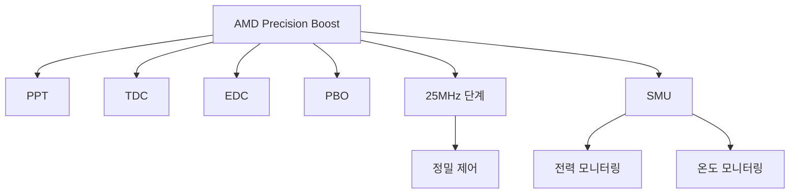

+++
title = "amd precision boost"
date = "2026-03-14"
weight = 731
+++

# AMD 프리시전 부스트 (AMD Precision Boost)

#### 핵심 인사이트 (3줄 요약)
> 1. **본질**: AMD Ryzen/EPYC의 자동 오버클럭 기술로, 전력/온도/부하에 따라 25MHz 단위로 정밀하게 클럭을 조절
> 2. **가치**: 싱글/멀티스레드 성능 향상, 25MHz 단위 세밀 제어, PPT/TDC/EDC 제약 내 최대 성능
> 3. **융합**: AMD P-State CPPC, Infinity Fabric, SmartShift, Precision Boost Overdrive와 통합된 동적 가속

---

### Ⅰ. 개요 (Context & Background)

**개념 정의**

AMD 프리시전 부스트(AMD Precision Boost)는 AMD Ryzen/EPYC의 자동 오버클럭 기술입니다. 전력/온도/부하에 따라 25MHz 단위로 정밀하게 클럭을 조절하여 최적 성능을 제공합니다.

```
┌─────────────────────────────────────────────────────────────────────┐
│                    AMD 프리시전 부스트 기본 원리                      │
├─────────────────────────────────────────────────────────────────────┤
│                                                                     │
│   ┌──────────────────────────────────────────────────────────────┐ │
│   │              Precision Boost 동작 개념                        │ │
│   │                                                              │ │
│   │   주파수 (GHz)                                                │ │
│   │      ▲                                                       │ │
│   │      │                                                       │ │
│   │   5.7 ────┬── Precision Boost Overdrive (PBO)               │ │
│   │      │    │                                                  │ │
│   │   5.2 ────┼── Precision Boost (1-2코어)                     │ │
│   │      │    │                                                  │ │
│   │   4.9 ────┼── Precision Boost (4코어)                       │ │
│   │      │    │                                                  │ │
│   │   4.5 ────┼── Precision Boost (8코어)                       │ │
│   │      │    │                                                  │ │
│   │   3.8 ────┼── 기본 클럭 (Base, 모든 코어)                    │ │
│   │      │    │                                                  │ │
│   │   ───┴────┴─────────────────────────────────────────────     │ │
│   │        1    2    4    8   활성 코어 수                       │ │
│   │                                                              │ │
│   │   특징: 25MHz 단계로 정밀 조절 (Intel은 100MHz)              │ │
│   │                                                              │ │
│   └──────────────────────────────────────────────────────────────┘ │
│                                                                     │
│   ┌──────────────────────────────────────────────────────────────┐ │
│   │              Precision Boost 제약 조건                        │ │
│   │                                                              │ │
│   │   PPT (Package Power Tracking):                              │ │
│   │   - 패키지 전력 제한                                          │ │
│   │   - 기본: TDP (예: 105W)                                     │ │
│   │   - PBO: 최대 200W+                                          │ │
│   │                                                              │ │
│   │   TDC (Thermal Design Current):                              │ │
│   │   - 열 설계 전류 (VRM 한계)                                   │ │
│   │   - 지속 가능한 최대 전류                                     │ │
│   │                                                              │ │
│   │   EDC (Electrical Design Current):                           │ │
│   │   - 전기 설계 전류 (피크)                                     │ │
│   │   - 순간 최대 전류                                            │ │
│   │                                                              │ │
│   │   ──────────────────────────────────────────────────────     │ │
│   │   전력/전류/온도 모두 여유 있어야 Boost 작동                  │ │
│   │   ──────────────────────────────────────────────────────     │ │
│   │                                                              │ │
│   └──────────────────────────────────────────────────────────────┘ │
│                                                                     │
└─────────────────────────────────────────────────────────────────────┘
```

> **해설**: 프리시전 부스트는 25MHz 단위로 정밀하게 클럭을 조절합니다. PPT/TDC/EDC 제약 내에서 최대 성능을 냅니다.

**💡 비유**: AMD 프리시전 부스트는 정밀한 오르간 연주와 같습니다. 25MHz 단위로 미세하게 조절하여 완벽한 음을 만듭니다.

**등장 배경**

① **기존 한계**: Intel 대비 낮은 기본 클럭
② **혁신적 패러다임**: 25MHz 단계 정밀 제어로 최적 성능
③ **비즈니스 요구**: 게임, 콘텐츠 제작, HPC 워크로드

**📢 섹션 요약 비유**: 프리시전 부스트는 정밀한 볼륨 조절 같아요. 아주 작은 단위로 조절해요!

---

### Ⅱ. 아키텍처 및 핵심 원리 (Deep Dive)

**구성 요소 상세 분석**

| 요소명 | 역할 | 내부 동작 | 비유 |
|:---|:---|:---|:---|
| **Precision Boost** | 자동 오버클럭 | 25MHz 단계 | 볼륨 조절 |
| **PPT** | Package Power | 전력 제한 | 전력 예산 |
| **TDC** | Thermal Current | 지속 전류 | 평균 속도 |
| **EDC** | Electrical Current | 피크 전류 | 스프린트 |
| **PBO** | Overdrive | 제한 완화 | 오버드라이브 |

**Precision Boost 전환 메커니즘**

```
┌─────────────────────────────────────────────────────────────────────┐
│                    Precision Boost 전환 메커니즘                     │
├─────────────────────────────────────────────────────────────────────┤
│                                                                     │
│   ┌──────────────────────────────────────────────────────────────┐ │
│   │              Precision Boost 알고리즘                         │ │
│   │                                                              │ │
│   │   1. 부하 감지                                                │ │
│   │      - OS 스케줄러 워크로드 요청                              │ │
│   │      - 활성 코어 수 확인                                      │ │
│   │                                                              │ │
│   │   2. 제약 확인                                                │ │
│   │      - PPT < PPT_Limit?                                      │ │
│   │      - TDC < TDC_Limit?                                      │ │
│   │      - EDC < EDC_Limit?                                      │ │
│   │      - 온도 < Tctl_max?                                       │ │
│   │                                                              │ │
│   │   3. 목표 클럭 계산                                           │ │
│   │      - 활성 코어 수별 최대 클럭 테이블                        │ │
│   │      - 제약에 따른 25MHz 단계 조정                            │ │
│   │                                                              │ │
│   │   4. 클럭 적용                                                │ │
│   │      - SMU (System Management Unit) 제어                     │ │
│   │      - PLL 조정                                               │ │
│   │      - 전압 조정 (V/f 곡선)                                   │ │
│   │                                                              │ │
│   │   전환 시간: ~1-10ms                                          │ │
│   │                                                              │ │
│   └──────────────────────────────────────────────────────────────┘ │
│                                                                     │
│   ┌──────────────────────────────────────────────────────────────┐ │
│   │              Precision Boost Overdrive (PBO)                  │ │
│   │                                                              │ │
│   │   PPT/TDC/EDC 제한을 완화하여 더 높은 부스트 가능             │ │
│   │                                                              │ │
│   │   기본:         PBO 활성화:                                  │ │
│   │   PPT: 105W  →  PPT: 200W+                                   │ │
│   │   TDC: 142A  →  TDC: 200A+                                   │ │
│   │   EDC: 170A  →  EDC: 250A+                                   │ │
│   │                                                              │ │
│   │   주의: 쿨링과 VRM이 충분해야 함                              │ │
│   │                                                              │ │
│   └──────────────────────────────────────────────────────────────┘ │
│                                                                     │
└─────────────────────────────────────────────────────────────────────┘
```

> **해설**: SMU가 PPT/TDC/EDC/온도를 모니터링하고 25MHz 단위로 클럭을 조정합니다. PBO는 제한을 완화합니다.

**핵심 알고리즘: Precision Boost 관리**

```c
// AMD Precision Boost 관리 (의사코드)
struct PrecisionBoostState {
    uint32_t current_freq;       // 현재 주파수 (MHz)
    uint32_t base_freq;          // 기본 주파수
    uint32_t max_boost;          // 최대 부스트
    uint32_t ppt_current;        // 현재 패키지 전력
    uint32_t ppt_limit;          // PPT 제한
    uint32_t tdc_current;        // 현재 TDC
    uint32_t tdc_limit;          // TDC 제한
    uint32_t edc_current;        // 현재 EDC
    uint32_t edc_limit;          // EDC 제한
    float    temp_current;       // 현재 온도
    float    temp_limit;         // 온도 제한
    uint8_t  active_cores;       // 활성 코어 수
};

// 목표 주파수 결정
uint32_t CalculateTargetFreq(struct PrecisionBoostState *pb) {
    // 1. 활성 코어 수에 따른 기본 목표
    uint32_t target = GetMaxBoostForCores(pb->active_cores);

    // 2. PPT 제약 확인
    if (pb->ppt_current >= pb->ppt_limit * 0.95) {
        target -= 100;  // 100MHz 감소
    }

    // 3. TDC 제약 확인
    if (pb->tdc_current >= pb->tdc_limit * 0.95) {
        target -= 75;   // 75MHz 감소
    }

    // 4. EDC 제약 확인
    if (pb->edc_current >= pb->edc_limit * 0.95) {
        target -= 50;   // 50MHz 감소
    }

    // 5. 온도 제약 확인
    if (pb->temp_current >= pb->temp_limit - 5) {
        target -= 50;   // 50MHz 감소
    }

    // 25MHz 단위로 정렬
    target = (target / 25) * 25;

    // 최소 기본 클럭 보장
    if (target < pb->base_freq) {
        target = pb->base_freq;
    }

    return target;
}

// Linux에서 Precision Boost 확인
// # cat /sys/devices/system/cpu/cpu0/cpufreq/scaling_driver
// amd-pstate

// # cat /sys/devices/system/cpu/cpu0/cpufreq/scaling_cur_freq
// 4850000  (4.85 GHz)

// Ryzen 모니터링 도구
// # sudo apt install ryzen-smi
// # ryzen_smu info
// PPT Limit: 142W
// TDC Limit: 95A
// EDC Limit: 140A

// PBO 설정 (BIOS 또는 Ryzen Master)
// PBO: Enabled
// PPT: 200W
// TDC: 180A
// EDC: 230A
```

**📢 섹션 요약 비유**: Precision Boost는 오르간 연주자와 같습니다. 음량(클럭)을 25단계씩 정밀하게 조절합니다.

---

### Ⅲ. 융합 비교 및 다각도 분석 (Comparison & Synergy)

**기술 비교: AMD Precision Boost vs Intel Turbo Boost**

| 비교 항목 | Precision Boost | Turbo Boost |
|:---|:---:|:---:|
| **제조사** | AMD | Intel |
| **단계** | 25MHz | 100MHz |
| **제약** | PPT/TDC/EDC | PL1/PL2/Tau |
| **Overdrive** | PBO | Unlimited |
| **제어** | SMU | HW/OS |

**과목 융합 관점: Precision Boost와 타 영역 시너지**

| 융합 영역 | 시너지 효과 | 구현 예시 |
|:---|:---|:---|
| **OS (운영체제)** | amd-pstate | Linux |
| **열** | Tctl 모니터링 | k10temp |
| **전력** | PPT 제어 | Ryzen Master |
| **가상화** | vCPU Boost | VM 성능 |
| **게임** | 싱글스레드 가속 | FPS 향상 |

**📢 섹션 요약 비유**: Precision Boost는 25MHz 단계로 Intel의 100MHz보다 4배 정밀합니다. 오르간 vs 피아노 같아요.

---

### Ⅳ. 실무 적용 및 기술사적 판단 (Strategy & Decision)

**실무 시나리오별 적용**

**시나리오 1: 게이밍**
- **문제**: 싱글스레드 성능
- **해결**: PBO 활성화
- **의사결정**: 쿨링 강화

**시나리오 2: 콘텐츠 제작**
- **문제**: 멀티스레드 지속
- **해결**: PPT 제한 조정
- **의사결정**: 전력/발열 균형

**시나리오 3: 서버**
- **문제**: 안정성 우선
- **해결**: Precision Boost 기본값
- **의사결정**: PBO 비활성화

**도입 체크리스트**

| 구분 | 항목 | 확인 포인트 |
|:---|:---|:---|
| **기술적** | BIOS | PB/PBO 설정 |
| | OS | amd-pstate |
| | 쿨링 | 충분한 해소능 |
| **운영적** | 모니터링 | ryzen_smu |
| | 온도 | Tctl 확인 |
| | 전력 | PPT 확인 |

**안티패턴: Precision Boost 오용 사례**

| 안티패턴 | 문제점 | 올바른 접근 |
|:---|:---|:---|
| **PBO 과신** | 열 문제 | 쿨링 강화 |
| **PPT 과다** | VRM 한계 | VRM 확인 |
| **쿨링 부족** | Thermal Throttling | 쿨러 업그레이드 |
| **모니터링 부재** | 성능 저하 원인 불명 | ryzen_smu 사용 |

**📢 섹션 요약 비유**: PBO 사용은 오디오 오버드라이브와 같습니다. 볼륨을 키우되 스피커가 버텨야 합니다.

---

### Ⅴ. 기대효과 및 결론 (Future & Standard)

**정량/정성 기대효과**

| 구분 | 기본 클럭 | Precision Boost | PBO | 개선효과 |
|:---|:---:|:---:|:---:|:---:|
| **싱글스레드** | 3.8 GHz | 5.1 GHz | 5.3 GHz | +39% |
| **멀티스레드** | 3.8 GHz | 4.6 GHz | 4.8 GHz | +26% |
| **전력** | 105W | 142W | 200W+ | +90% |
| **온도** | 65°C | 85°C | 95°C | +30°C |

**미래 전망**

1. **Zen 5:** 더 높은 부스트 클럭
2. **3D V-Cache:** 성능 유지하며 전력 감소
3. **AI 기반:** 워크로드 예측 부스트
4. **Hybrid Core:** Zen 4c 효율 코어

**참고 표준**

| 표준 | 내용 | 적용 |
|:---|:---|:---|
| **AMD BKDG** | P-State, SMU | AMD CPU |
| **ACPI 6.5** | CPPC | 펌웨어 |
| **Linux** | amd-pstate | 커널 |
| **Ryzen Master** | 오버클럭 도구 | 유틸리티 |

**📢 섹션 요약 비유**: Precision Boost의 미래는 AI 지휘자와 같습니다. AI가 최적의 연주(클럭)를 실시간으로 지휘합니다.

---

### 📌 관련 개념 맵 (Knowledge Graph)



**연관 개념 링크**:
- 인텔 터보부스트 - Intel 대응 기술
- 스마트 시프트 - AMD 전력 분배
- AMD Cool'n'Quiet - AMD 절전 기술
- PL1, PL2 - 전력 제한

---

### 👶 어린이를 위한 3줄 비유 설명

1. **정밀 조절**: 프리시전 부스트는 오르간 같아요. 아주 작은 단계로 음을 조절해요!

2. **에너지 예산**: PPT는 용돈 같아요. 용돈 내에서만 더 빨리 달려요.

3. **오버드라이브**: PBO는 부스터 같아요. 더 빠르지만 더 뜨거워요!