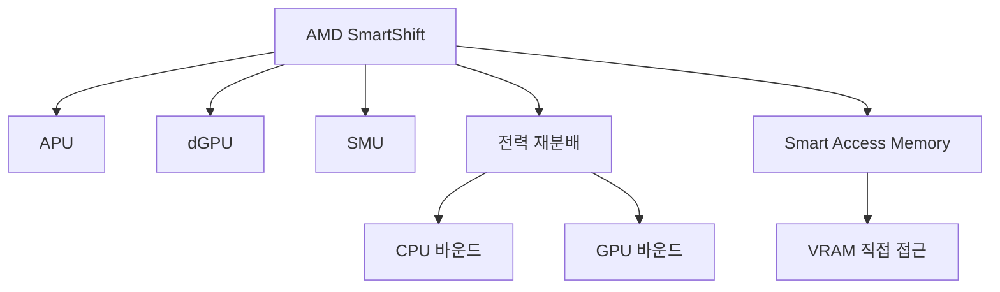

+++
title = "smartshift"
date = "2026-03-14"
weight = 732
+++

# 스마트 시프트 (AMD SmartShift)

#### 핵심 인사이트 (3줄 요약)
> 1. **본질**: AMD APU와 dGPU 간 전력 예산을 동적으로 재분배하는 기술로, 워크로드에 따라 CPU/GPU 전력을 유연하게 조절
> 2. **가치**: 게임/콘텐츠 제작 시 성능 향상, 전력 효율 최적화, 배터리 수명 연장
> 3. **융합**: AMD Infinity Fabric, Smart Access Memory, P-State CPPC, Precision Boost와 통합된 전력 관리

---

### Ⅰ. 개요 (Context & Background)

**개념 정의**

AMD 스마트 시프트(AMD SmartShift)는 APU(통합 CPU+GPU)와 외장 GPU(dGPU) 간 전력 예산을 동적으로 재분배하는 기술입니다. 워크로드에 따라 CPU와 GPU에 전력을 유연하게 할당합니다.

```
┌─────────────────────────────────────────────────────────────────────┐
│                    AMD SmartShift 기본 원리                          │
├─────────────────────────────────────────────────────────────────────┤
│                                                                     │
│   ┌──────────────────────────────────────────────────────────────┐ │
│   │              SmartShift 전력 분배 개념                        │ │
│   │                                                              │ │
│   │   전력 예산 (예: 100W)                                        │ │
│   │      ┌───────────────────────────────────────────────────┐   │ │
│   │      │                                                   │   │ │
│   │      │  ┌─────────┐         ┌─────────┐                 │   │ │
│   │      │  │   CPU   │         │   GPU   │                 │   │ │
│   │      │  │         │         │         │                 │   │ │
│   │      │  │  45W    │         │  55W    │   기본 분배      │   │ │
│   │      │  │         │         │         │                 │   │ │
│   │      │  └─────────┘         └─────────┘                 │   │ │
│   │      │                                                   │   │ │
│   │      └───────────────────────────────────────────────────┘   │ │
│   │                                                              │ │
│   │   CPU 집약 워크로드:          GPU 집약 워크로드:              │ │
│   │      ┌─────────┐                ┌─────────┐                 │ │
│   │      │   CPU   │                │   CPU   │                 │ │
│   │      │  70W    │                │  25W    │                 │ │
│   │      │         │                │         │                 │ │
│   │      └─────────┘                └─────────┘                 │ │
│   │      ┌─────────┐                ┌─────────┐                 │ │
│   │      │   GPU   │                │   GPU   │                 │ │
│   │      │  30W    │                │  75W    │                 │ │
│   │      │         │                │         │                 │ │
│   │      └─────────┘                └─────────┘                 │ │
│   │      (CPU에 전력 이동)          (GPU에 전력 이동)            │ │
│   │                                                              │ │
│   └──────────────────────────────────────────────────────────────┘ │
│                                                                     │
│   ┌──────────────────────────────────────────────────────────────┐ │
│   │              SmartShift vs 비SmartShift                       │ │
│   │                                                              │ │
│   │   비SmartShift:                                              │ │
│   │   CPU: 45W 고정 (사용 30W → 15W 낭비)                        │ │
│   │   GPU: 55W 고정 (사용 70W → 15W 부족)                        │ │
│   │                                                              │ │
│   │   SmartShift:                                                │ │
│   │   CPU: 25W (15W 절약)                                        │ │
│   │   GPU: 75W (20W 추가)                                        │ │
│   │   → GPU 성능 향상!                                           │ │
│   │                                                              │ │
│   └──────────────────────────────────────────────────────────────┘ │
│                                                                     │
└─────────────────────────────────────────────────────────────────────┘
```

> **해설**: SmartShift는 총 전력 예산 내에서 CPU와 GPU 간 전력을 동적으로 재분배합니다. 필요한 쪽에 더 많은 전력을 줍니다.

**💡 비유**: 스마트 시프트는 가족 간 용돈 분배와 같습니다. 누가 더 필요한지 보고 용돈을 다시 나눕니다.

**등장 배경**

① **기존 한계**: 고정 전력 분배 → 낭비 발생
② **혁신적 패러다임**: 동적 전력 재분배로 효율 극대화
③ **비즈니스 요구**: 게이밍 노트북 성능, 배터리 수명

**📢 섹션 요약 비유**: SmartShift는 용돈 분배 같아요. 형이 필요하면 형에게, 동생이 필요하면 동생에게 줘요!

---

### Ⅱ. 아키텍처 및 핵심 원리 (Deep Dive)

**구성 요소 상세 분석**

| 요소명 | 역할 | 내부 동작 | 비유 |
|:---|:---|:---|:---|
| **SmartShift** | 전력 재분배 | 동적 할당 | 용돈 분배 |
| **APU** | 통합 칩 | CPU+iGPU | 형 |
| **dGPU** | 외장 GPU | Radeon | 동생 |
| **SMU** | 전력 관리 | 전력 모니터링 | 부모님 |
| **Infinity Fabric** | 칩 간 통신 | 데이터 전송 | 대화 |

**SmartShift 작동 메커니즘**

```
┌─────────────────────────────────────────────────────────────────────┐
│                    SmartShift 작동 메커니즘                          │
├─────────────────────────────────────────────────────────────────────┤
│                                                                     │
│   ┌──────────────────────────────────────────────────────────────┐ │
│   │              SmartShift 전력 재분배 과정                      │ │
│   │                                                              │ │
│   │   1. 워크로드 감지                                            │ │
│   │      - CPU 사용률 모니터링                                   │ │
│   │      - GPU 사용률 모니터링                                   │ │
│   │      - 프레임 타임 분석                                       │ │
│   │                                                              │ │
│   │   2. 전력 예산 계산                                           │ │
│   │      - 총 전력 예산 (TDP)                                     │ │
│   │      - 현재 CPU 전력                                          │ │
│   │      - 현재 GPU 전력                                          │ │
│   │      - 여유 전력                                              │ │
│   │                                                              │ │
│   │   3. 전력 재분배                                              │ │
│   │      - CPU 과부하 → CPU에 전력 추가                          │ │
│   │      - GPU 과부하 → GPU에 전력 추가                          │ │
│   │      - CPU 유휴 → CPU 전력을 GPU로 이동                       │ │
│   │      - GPU 유휴 → GPU 전력을 CPU로 이동                       │ │
│   │                                                              │ │
│   │   4. 전력 적용                                                │ │
│   │      - SMU가 APU/dGPU에 전력 할당                            │ │
│   │      - 주파수/전압 조정                                       │ │
│   │                                                              │ │
│   │   전환 시간: ~수 ms                                           │ │
│   │                                                              │ │
│   └──────────────────────────────────────────────────────────────┘ │
│                                                                     │
│   ┌──────────────────────────────────────────────────────────────┐ │
│   │              SmartShift와 Smart Access Memory                 │ │
│   │                                                              │ │
│   │   Smart Access Memory (SAM):                                 │ │
│   │   - CPU가 GPU VRAM 전체에 직접 접근                          │ │
│   │   - PCIe BAR 크기 확장 (4GB→전체)                            │ │
│   │   - CPU ↔ GPU 데이터 전송 최적화                              │ │
│   │                                                              │ │
│   │   SmartShift + SAM:                                          │ │
│   │   - 전력 분배 + 메모리 접근 최적화                            │ │
│   │   - 게임 성능 추가 향상                                       │ │
│   │                                                              │ │
│   └──────────────────────────────────────────────────────────────┘ │
│                                                                     │
└─────────────────────────────────────────────────────────────────────┘
```

> **해설**: SMU가 CPU/GPU 부하를 모니터링하고 동적으로 전력을 재분배합니다. Smart Access Memory와 결합하면 더 큰 효과를 냅니다.

**핵심 알고리즘: SmartShift 관리**

```c
// AMD SmartShift 관리 (의사코드)
struct SmartShiftState {
    uint32_t total_power;        // 총 전력 예산
    uint32_t cpu_power;          // 현재 CPU 전력
    uint32_t gpu_power;          // 현재 GPU 전력
    uint32_t cpu_usage;          // CPU 사용률 (%)
    uint32_t gpu_usage;          // GPU 사용률 (%)
    uint32_t cpu_budget;         // CPU 전력 예산
    uint32_t gpu_budget;         // GPU 전력 예산
};

// SmartShift 전력 재분배
void SmartShiftRebalance(struct SmartShiftState *ss) {
    // 1. 워크로드 패턴 분석
    if (ss->cpu_usage > 80 && ss->gpu_usage < 50) {
        // CPU 바운드: CPU에 전력 추가
        ss->cpu_budget = ss->total_power * 0.70;
        ss->gpu_budget = ss->total_power * 0.30;
    } else if (ss->gpu_usage > 80 && ss->cpu_usage < 50) {
        // GPU 바운드: GPU에 전력 추가
        ss->cpu_budget = ss->total_power * 0.25;
        ss->gpu_budget = ss->total_power * 0.75;
    } else {
        // 균형: 기본 분배
        ss->cpu_budget = ss->total_power * 0.45;
        ss->gpu_budget = ss->total_power * 0.55;
    }

    // 2. SMU에 전력 예산 설정
    SMU_SetCPUPowerBudget(ss->cpu_budget);
    SMU_SetGPUPowerBudget(ss->gpu_budget);
}

// Linux에서 SmartShift 확인
// # cat /sys/class/drm/card0/device/power_dpm_state
// performance

// Radeon GPU 전력 모니터링
// # cat /sys/class/drm/card0/device/hwmon/hwmon*/power1_input
// 55000000  (55W)

// AMD GPU 설정
// # rocm-smi
// GPU 0: GPU_0 (_BUSY)
//     GPU%: 85%
//     PWRENG: 75W
//     TEMPERATURE: 72°C
```

**📢 섹션 요약 비유**: SmartShift는 가계부 관리와 같습니다. 식비가 많으면 식비에, 교통비가 많으면 교통비에 더 씁니다.

---

### Ⅲ. 융합 비교 및 다각도 분석 (Comparison & Synergy)

**기술 비교: SmartShift vs NVIDIA Dynamic Boost**

| 비교 항목 | SmartShift | Dynamic Boost |
|:---|:---:|:---:|
| **제조사** | AMD | NVIDIA |
| **대상** | AMD APU+dGPU | Intel+NV GPU |
| **통합** | 완전 통합 | 부분 통합 |
| **지연** | ~수 ms | ~수 ms |
| **SAM** | 지원 | N/A |

**과목 융합 관점: SmartShift와 타 영역 시너지**

| 융합 영역 | 시너지 효과 | 구현 예시 |
|:---|:---|:---|
| **GPU** | dGPU 성능 향상 | Radeon 6000 |
| **메모리** | SAM 통합 | VRAM 직접 접근 |
| **열** | 발열 분산 | 효율적 냉각 |
| **배터리** | 수명 연장 | 노트북 |
| **게임** | FPS 향상 | Cyberpunk |

**📢 섹션 요약 비유**: SmartShift는 AMD APU+dGPU 간 전력 재분배, NVIDIA Dynamic Boost는 Intel+NV GPU 간 재분배입니다.

---

### Ⅳ. 실무 적용 및 기술사적 판단 (Strategy & Decision)

**실무 시나리오별 적용**

**시나리오 1: 게이밍 노트북**
- **문제**: GPU 병목
- **해결**: SmartShift 활성화
- **의사결정**: GPU에 전력 집중

**시나리오 2: 콘텐츠 제작**
- **문제**: CPU+GPU 혼합
- **해결**: 동적 전환
- **의사결정**: 워크로드별 자동

**시나리오 3: 배터리 모드**
- **문제**: 배터리 절약
- **해결**: 절전 분배
- **의사결정**: CPU 우선

**도입 체크리스트**

| 구분 | 항목 | 확인 포인트 |
|:---|:---|:---|
| **기술적** | 하드웨어 | AMD APU+dGPU |
| | BIOS | SmartShift 활성화 |
| | 드라이버 | AMD 최신 드라이버 |
| **운영적** | 모니터링 | rocm-smi |
| | 온도 | 발열 분산 |
| | 배터리 | 절약 모드 |

**안티패턴: SmartShift 오용 사례**

| 안티패턴 | 문제점 | 올바른 접근 |
|:---|:---|:---|
| **비활성화** | 성능 손실 | 활성화 권장 |
| **고정 분배** | 유연성 상실 | 동적 허용 |
| **냉각 부족** | Thermal Throttling | 쿨링 강화 |
| **구형 게임** | 효과 미미 | 워크로드 확인 |

**📢 섹션 요약 비유**: SmartShift 활용은 예산 배정과 같습니다. 상황에 맞게 유연하게 조정해야 합니다.

---

### Ⅴ. 기대효과 및 결론 (Future & Standard)

**정량/정성 기대효과**

| 구분 | SmartShift 미사용 | SmartShift | 개선효과 |
|:---|:---:|:---:|:---:|
| **게임 FPS** | 60fps | 72fps | +20% |
| **CPU 전력** | 45W | 30W | -33% |
| **GPU 전력** | 55W | 70W | +27% |
| **배터리** | 2시간 | 2.5시간 | +25% |

**미래 전망**

1. **SmartShift 2.0:** 더 정밀한 전력 분배
2. **RDNA 3+:** 더 효율적인 GPU
3. **AI 기반:** 워크로드 예측 분배
4. **eGPU:** 외장 GPU 확장

**참고 표준**

| 표준 | 내용 | 적용 |
|:---|:---|:---|
| **AMD** | SmartShift | AMD 플랫폼 |
| **PCIe** | BAR 확장 | SAM |
| **Linux** | amdgpu | 드라이버 |
| **Windows** | AMD 드라이버 | OS |

**📢 섹션 요약 비유**: SmartShift의 미래는 AI 예산가와 같습니다. AI가 미래 지출을 예측해 미리 예산을 배정합니다.

---

### 📌 관련 개념 맵 (Knowledge Graph)



**연관 개념 링크**:
- AMD 프리시전 부스트 - AMD 부스트 기술
- 인텔 터보부스트 - Intel 부스트
- PL1, PL2 - 전력 제한
- AMD Cool'n'Quiet - AMD 절전

---

### 👶 어린이를 위한 3줄 비유 설명

1. **용돈 분배**: SmartShift는 용돈 분배 같아요. 형이 더 필요하면 형에게 줘요!

2. **게임할 때**: 게임할 땐 그래픽카드가 더 필요해요. 그래픽카드에게 전기를 더 줘요!

3. **배터리 절약**: 배터리가 부족하면 아껴요. 둘 다 조금씩만 줘요!