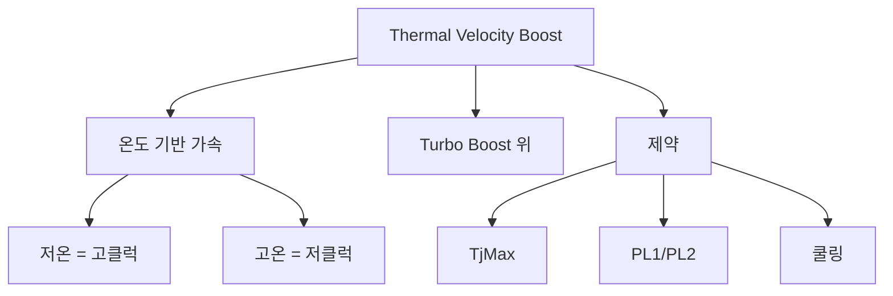

+++
title = "thermal velocity boost"
date = "2026-03-14"
weight = 733
+++

# 동적 주파수 한계 (Thermal Velocity Boost, TVB)

#### 핵심 인사이트 (3줄 요약)
> 1. **본질**: CPU 온도에 따라 추가로 클럭을 가속하는 Intel 기술로, 낮은 온도에서 더 높은 Turbo Boost 클럭을 제공
> 2. **가치**: 저온 환경에서 최대 성능 활용, 온도 기반 정밀 제어, 발열 관리와 성능 균형
> 3. **융합**: Intel Turbo Boost, P-State, TjMax, Thermal Throttling과 통합된 온도 기반 가속

---

### Ⅰ. 개요 (Context & Background)

**개념 정의**

동적 주파수 한계(Thermal Velocity Boost, TVB)는 Intel CPU의 온도 기반 가속 기술입니다. CPU 온도가 충분히 낮을 때 Turbo Boost 클럭을 추가로 높여 성능을 향상시킵니다.

```
┌─────────────────────────────────────────────────────────────────────┐
│                    Thermal Velocity Boost 기본 원리                  │
├─────────────────────────────────────────────────────────────────────┤
│                                                                     │
│   ┌──────────────────────────────────────────────────────────────┐ │
│   │              TVB 온도-클럭 관계                               │ │
│   │                                                              │ │
│   │   주파수 (GHz)                                                │ │
│   │      ▲                                                       │ │
│   │      │                                                       │ │
│   │   5.5 ────┬── TVB 최대 (45°C 이하)                          │ │
│   │      │    │                                                  │ │
│   │   5.3 ────┼── TVB (50°C)                                    │ │
│   │      │    │                                                  │ │
│   │   5.1 ────┼── TVB (55°C)                                    │ │
│   │      │    │                                                  │ │
│   │   4.9 ────┼── Turbo Boost 기본                              │ │
│   │      │    │  (온도 무관)                                     │ │
│   │   3.8 ────┼── 기본 클럭                                      │ │
│   │      │    │                                                  │ │
│   │   ───┴────┴─────────────────────────────────────────────     │ │
│   │        45   50   55   60   65   70   75   80   온도 (°C)      │ │
│   │                      ↑                                       │ │
│   │                 TVB 작동 구간                                 │ │
│   │              (낮은 온도에서 추가 가속)                        │ │
│   │                                                              │ │
│   └──────────────────────────────────────────────────────────────┘ │
│                                                                     │
│   ┌──────────────────────────────────────────────────────────────┐ │
│   │              TVB 작동 조건                                    │ │
│   │                                                              │ │
│   │   ┌─────────────────────────────────────────────────────┐    │ │
│   │   │  온도 < TVB 임계값 (예: 70°C)                       │    │ │
│   │   │                                                     │    │ │
│   │   │  ────────────────────────────────────────────────   │    │ │
│   │   │                                                     │    │ │
│   │   │  45°C ────► TVB 최대 (+200MHz)                     │    │ │
│   │   │  50°C ────► TVB 중간 (+150MHz)                     │    │ │
│   │   │  55°C ────► TVB 낮음 (+100MHz)                     │    │ │
│   │   │  60°C ────► TVB 최소 (+50MHz)                      │    │ │
│   │   │  65°C ────► TVB 끝 (+0MHz)                         │    │ │
│   │   │  70°C+ ───► Turbo Boost만                         │    │ │
│   │   │                                                     │    │ │
│   │   │  ────────────────────────────────────────────────   │    │ │
│   │   │                                                     │    │ │
│   │   │  더 시원할수록 더 빠름!                              │    │ │
│   │   │                                                     │    │ │
│   │   └─────────────────────────────────────────────────────┘    │ │
│   │                                                              │ │
│   └──────────────────────────────────────────────────────────────┘ │
│                                                                     │
└─────────────────────────────────────────────────────────────────────┘
```

> **해설**: TVB는 온도가 낮을수록 더 높은 클럭을 제공합니다. 쿨링이 좋으면 성능이 더 좋아집니다.

**💡 비유**: Thermal Velocity Boost는 날씨 좋은 날 달리기와 같습니다. 날이 시원하면 더 빨리 달릴 수 있습니다.

**등장 배경**

① **기존 한계**: Turbo Boost는 온도와 무관하게 고정된 최대 클럭
② **혁신적 패러다임**: 온도 기반 추가 가속으로 쿨링 활용
③ **비즈니스 요구**: 고성능 쿨링 시스템의 가치 증명

**📢 섹션 요약 비유**: TVB는 시원한 날 더 빨리 달리기 같아요. 날이 좋으면 더 빨라요!

---

### Ⅱ. 아키텍처 및 핵심 원리 (Deep Dive)

**구성 요소 상세 분석**

| 요소명 | 역할 | 내부 동작 | 비유 |
|:---|:---|:---|:---|
| **TVB** | 온도 기반 가속 | 온도별 클럭 | 날씨별 속도 |
| **TjMax** | 최대 온도 | TVB 임계값 | 한계 온도 |
| **Turbo Boost** | 기본 가속 | TVB 베이스 | 기본 속도 |
| **SMU/PCU** | 전력 관리 | 온도 모니터링 | 관리자 |
| **Cooling** | 열 해소 | TVB 활성화 조건 | 에어컨 |

**TVB 작동 메커니즘**

```
┌─────────────────────────────────────────────────────────────────────┐
│                    TVB 작동 메커니즘                                 │
├─────────────────────────────────────────────────────────────────────┤
│                                                                     │
│   ┌──────────────────────────────────────────────────────────────┐ │
│   │              TVB 알고리즘                                     │ │
│   │                                                              │ │
│   │   1. 온도 측정                                                │ │
│   │      - CPU 코어 온도 (Tctl)                                  │ │
│   │      - 패키지 온도                                            │ │
│   │      - 히트스프레더 온도                                      │ │
│   │                                                              │ │
│   │   2. TVB 오프셋 계산                                          │ │
│   │      TVB_ratio = (TjMax - current_temp) / TVB_slope         │ │
│   │                                                              │ │
│   │   3. 최종 클럭 계산                                           │ │
│   │      final_freq = Turbo_Base + TVB_offset                   │ │
│   │                                                              │ │
│   │   4. 전력/전류 제약 확인                                      │ │
│   │      - PPT 제한                                               │ │
│   │      - TDC 제한                                               │ │
│   │      - PL1/PL2 제한                                           │ │
│   │                                                              │ │
│   │   5. 클럭 적용                                                │ │
│   │      - PLL 조정                                               │ │
│   │      - 전압 조정                                              │ │
│   │                                                              │ │
│   └──────────────────────────────────────────────────────────────┘ │
│                                                                     │
│   ┌──────────────────────────────────────────────────────────────┐ │
│   │              TVB vs Turbo Boost vs 기본 클럭                  │ │
│   │                                                              │ │
│   │   ┌─────────────────────────────────────────────────────┐    │ │
│   │   │                                                     │    │ │
│   │   │  기본 클럭 (Base):    3.8 GHz                      │    │ │
│   │   │         ↓                                           │    │ │
│   │   │  Turbo Boost:        4.9 GHz (+1.1 GHz)            │    │ │
│   │   │         ↓ (온도 < 70°C)                             │    │ │
│   │   │  TVB:                5.3 GHz (+0.4 GHz)            │    │ │
│   │   │         ↓ (온도 < 50°C)                             │    │ │
│   │   │  TVB Max:            5.5 GHz (+0.2 GHz)            │    │ │
│   │   │                                                     │    │ │
│   │   │  총 가속: +1.7 GHz (기본 대비 +45%)                 │    │ │
│   │   │                                                     │    │ │
│   │   └─────────────────────────────────────────────────────┘    │ │
│   │                                                              │ │
│   └──────────────────────────────────────────────────────────────┘ │
│                                                                     │
└─────────────────────────────────────────────────────────────────────┘
```

> **해설**: TVB는 Turbo Boost 위에 온도 기반 추가 가속을 제공합니다. 온도가 낮을수록 더 높은 클럭이 가능합니다.

**핵심 알고리즘: TVB 관리**

```c
// Thermal Velocity Boost 관리 (의사코드)
struct TVBState {
    uint32_t base_freq;          // 기본 주파수
    uint32_t turbo_freq;         // Turbo Boost 주파수
    uint32_t tvb_max_freq;       // TVB 최대 주파수
    float    current_temp;       // 현재 온도
    float    tvb_threshold;      // TVB 임계 온도 (예: 70°C)
    float    tjmax;              // 최대 온도
};

// TVB 오프셋 계산
uint32_t CalculateTVBFreq(struct TVBState *tvb) {
    // 1. Turbo Boost 기본 클럭
    uint32_t freq = tvb->turbo_freq;

    // 2. TVB 활성화 조건 확인
    if (tvb->current_temp >= tvb->tvb_threshold) {
        // 온도가 높으면 TVB 없이 Turbo Boost만
        return freq;
    }

    // 3. 온도 기반 추가 클럭 계산
    float headroom = tvb->tvb_threshold - tvb->current_temp;
    uint32_t tvb_offset = (uint32_t)(headroom * 10);  // 10MHz/°C

    // 4. 최대 TVB 클럭 제한
    if (freq + tvb_offset > tvb->tvb_max_freq) {
        tvb_offset = tvb->tvb_max_freq - freq;
    }

    return freq + tvb_offset;
}

// Linux에서 TVB 확인
// # cat /sys/devices/system/cpu/intel_pstate/no_turbo
// 0  (Turbo 활성화)

// # turbostat --debug
// ... 5.3 GHz  1.35V  52°C  ...

// TVB 지원 확인 (CPUID)
// CPUID.06H:EAX[6] = 1 (TVB 지원)

// Intel Speed Select (Xeon)
// # intel-speed-select -c 0 turbo-freq info
// speed-select-turbo-freq:disabled
```

**📢 섹션 요약 비유**: TVB는 날씨에 따른 달리기 속도와 같습니다. 시원하면 더 빨리, 더우면 천천히 달립니다.

---

### Ⅲ. 융합 비교 및 다각도 분석 (Comparison & Synergy)

**기술 비교: TVB vs Turbo Boost vs P-State**

| 비교 항목 | TVB | Turbo Boost | P-State |
|:---|:---:|:---:|:---:|
| **제어 기준** | 온도 | 코어 수/전력 | 사용률 |
| **범위** | Turbo 위 | 기본 위 | 전체 |
| **방향** | 가속만 | 가속만 | 가속/감속 |
| **목적** | 쿨링 활용 | 순간 성능 | 전력 효율 |

**과목 융합 관점: TVB와 타 영역 시너지**

| 융합 영역 | 시너지 효과 | 구현 예시 |
|:---|:---|:---|
| **열** | 쿨링 가치 증명 | 수냉/AIO |
| **전력** | PL 제한 내 작동 | RAPL |
| **케이스** | 통풍 중요 | 에어플로우 |
| **서버** | 랙 냉각 | CRAH |
| **게임** | 저온에서 FPS 향상 | 수냉 쿨러 |

**📢 섹션 요약 비유**: TVB는 Turbo Boost 위에 온도 기반 보너스를 더합니다. 쿨링이 좋으면 보너스가 더 커요.

---

### Ⅳ. 실무 적용 및 기술사적 판단 (Strategy & Decision)

**실무 시나리오별 적용**

**시나리오 1: 오버클럭**
- **문제**: 최대 성능
- **해결**: 수냉 + TVB
- **의사결정**: 저온 유지

**시나리오 2: 노트북**
- **문제**: 제한적 쿨링
- **해결**: TVB 자동
- **의사결정**: 발열 관리

**시나리오 3: 서버**
- **문제**: 지속적 부하
- **해결**: TVB 제한
- **의사결정**: 안정성 우선

**도입 체크리스트**

| 구분 | 항목 | 확인 포인트 |
|:---|:---|:---|
| **기술적** | CPU | TVB 지원 |
| | BIOS | TVB 활성화 |
| | 쿨링 | 충분한 해소능 |
| **운영적** | 모니터링 | turbostat |
| | 온도 | 저온 유지 |
| | 케이스 | 통풍 |

**안티패턴: TVB 오용 사례**

| 안티패턴 | 문제점 | 올바른 접근 |
|:---|:---|:---|
| **과신** | 한계 존재 | PL 제약 확인 |
| **쿨링 부족** | TVB 미작동 | 쿨러 업그레이드 |
| **고온 환경** | 효과 미미 | 환경 온도 관리 |
| **모니터링 부재** | 효과 불명 | turbostat 사용 |

**📢 섹션 요약 비유**: TVB 활용은 날씨 맞춤 운동과 같습니다. 좋은 날에는 더 열심히, 더운 날에는 적당히 합니다.

---

### Ⅴ. 기대효과 및 결론 (Future & Standard)

**정량/정성 기대효과**

| 구분 | Turbo Only | TVB | 개선효과 |
|:---|:---:|:---:|:---:|
| **최대 클럭** | 4.9 GHz | 5.5 GHz | +12% |
| **저온 FPS** | 60fps | 72fps | +20% |
| **고온 FPS** | 55fps | 55fps | 0% |
| **전력** | 125W | 145W | +16% |

**미래 전망**

1. **TVB 2.0:** 더 정밀한 온도-클럭 매핑
2. **AI 기반:** 워크로드 예측 온도 관리
3. **Hybrid TVB:** P-Core/E-Core 독립 TVB
4. **Server TVB:** 데이터센터 냉각 연동

**참고 표준**

| 표준 | 내용 | 적용 |
|:---|:---|:---|
| **Intel SDM** | TVB MSR | Intel CPU |
| **CPUID** | 06H:EAX[6] | CPU 기능 |
| **Linux** | intel_pstate | 커널 |
| **turbostat** | 모니터링 | 도구 |

**📢 섹션 요약 비유**: TVB의 미래는 스마트 온도 조절과 같습니다. AI가 최적 온도를 유지하며 성능을 극대화합니다.

---

### 📌 관련 개념 맵 (Knowledge Graph)



**연관 개념 링크**:
- 인텔 터보부스트 - 기본 가속
- PL1, PL2 - 전력 제한
- TjMax - 최대 온도
- PROCHOT# - 과열 보호

---

### 👶 어린이를 위한 3줄 비유 설명

1. **날씨 맞춤**: TVB는 날씨 맞춤 달리기 같아요. 시원하면 더 빨리 달려요!

2. **에어컨**: 컴퓨터도 에어컨이 필요해요. 에어컨이 좋으면 더 빨라요!

3. **온도계**: 온도를 보고 속도를 정해요. 50도면 빠르게, 70도면 보통으로!