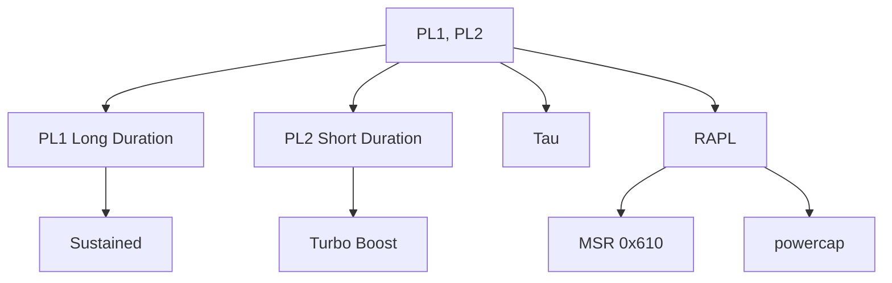

+++
title = "pl1 pl2"
date = "2026-03-14"
weight = 734
+++

# PL1, PL2 (Power Limit 1, 2)

#### 핵심 인사이트 (3줄 요약)
> 1. **본질**: Intel CPU의 전력 제한 정책으로, PL1은 지속 가능한 전력(TDP), PL2는 일시적 버스트 전력(Turbo)
> 2. **가치**: 전력 예산 관리, Turbo Boost 지속 시간 제어, 시스템 안정성 보장
> 3. **융합**: Intel RAPL, Turbo Boost, Tau 시간 제한, VRM 전류 제한과 통합된 전력 관리

---

### Ⅰ. 개요 (Context & Background)

**개념 정의**

PL1, PL2(Power Limit 1, 2)는 Intel CPU의 전력 제한 정책입니다. PL1은 지속 가능한 전력(TDP와 동일), PL2는 일시적 버스트를 위한 전력으로 Turbo Boost 작동 시 사용됩니다.

```
┌─────────────────────────────────────────────────────────────────────┐
│                    PL1, PL2 기본 개념                                │
├─────────────────────────────────────────────────────────────────────┤
│                                                                     │
│   ┌──────────────────────────────────────────────────────────────┐ │
│   │              PL1/PL2 전력 제한                                │ │
│   │                                                              │ │
│   │   전력 (W)                                                    │ │
│   │      ▲                                                       │ │
│   │      │                                                       │ │
│   │   PL2 ─────┬─────────────────────┐                           │ │
│   │      │     │                     │                           │ │
│   │   250W     │   Turbo Boost      │                           │ │
│   │      │     │   (PL2 구간)        │                           │ │
│   │      │     │                     │                           │ │
│   │   PL1 ─────┼─────────────────────┼──────────────────────     │ │
│   │      │     │                     │                           │ │
│   │   125W     │                     │   Sustained               │ │
│   │      │     │                     │   (PL1 구간)              │ │
│   │      │     │                     │                           │ │
│   │   ───┴─────┴─────────────────────┴──────────────────────     │ │
│   │            │← Tau →│                                         │ │
│   │            (~56초)  │                                         │ │
│   │        시간 ──────────────────────────────────────────►      │ │
│   │                                                              │ │
│   └──────────────────────────────────────────────────────────────┘ │
│                                                                     │
│   ┌──────────────────────────────────────────────────────────────┐ │
│   │              PL1/PL2 정의                                      │ │
│   │                                                              │ │
│   │   PL1 (Power Limit 1):                                       │ │
│   │   - Long Duration Power Limit                                │ │
│   │   - TDP (Thermal Design Power)와 동일                        │ │
│   │   - 무제한 지속 가능                                          │ │
│   │   - 예: 125W                                                 │ │
│   │                                                              │ │
│   │   PL2 (Power Limit 2):                                       │ │
│   │   - Short Duration Power Limit                               │ │
│   │   - Turbo Boost를 위한 버스트 전력                           │ │
│   │   - Tau 시간 동안만 지속                                      │ │
│   │   - 예: 250W (PL1 × 2)                                       │ │
│   │                                                              │ │
│   │   Tau:                                                       │ │
│   │   - PL2 유지 시간                                             │ │
│   │   - 기본 ~56초 (설정 가능)                                   │ │
│   │   - Tau 후 PL1으로 복귀                                      │ │
│   │                                                              │ │
│   └──────────────────────────────────────────────────────────────┘ │
│                                                                     │
└─────────────────────────────────────────────────────────────────────┘
```

> **해설**: PL1은 무제한 지속 가능한 전력, PL2는 Tau 시간 동안만 허용되는 버스트 전력입니다.

**💡 비유**: PL1은 마라톤 페이스, PL2는 스프린트와 같습니다. 스프린트는 잠깐만 할 수 있습니다.

**등장 배경**

① **기존 한계**: 고정 TDP → 순간적 고성능 불가
② **혁신적 패러다임**: PL2 버스트로 순간 성능 향상
③ **비즈니스 요구**: 게임, 앱 실행, 순간적 고부하 처리

**📢 섹션 요약 비유**: PL1은 마라톤, PL2는 스프린트 같아요. 스프린트는 잠깐만!

---

### Ⅱ. 아키텍처 및 핵심 원리 (Deep Dive)

**구성 요소 상세 분석**

| 요소명 | 역할 | 내부 동작 | 비유 |
|:---|:---|:---|:---|
| **PL1** | Long Duration | 지속 전력 | 마라톤 페이스 |
| **PL2** | Short Duration | 버스트 전력 | 스프린트 |
| **Tau** | PL2 시간 | 제한 시간 | 스톱워치 |
| **RAPL** | 전력 제어 | MSR 기반 | 계량기 |
| **VRM** | 전력 공급 | 전류 제한 | 급수관 |

**PL1/PL2 제어 메커니즘**

```
┌─────────────────────────────────────────────────────────────────────┐
│                    PL1/PL2 제어 메커니즘                             │
├─────────────────────────────────────────────────────────────────────┤
│                                                                     │
│   ┌──────────────────────────────────────────────────────────────┐ │
│   │              RAPL (Running Average Power Limit)               │ │
│   │                                                              │ │
│   │   MSR 레지스터:                                               │ │
│   │                                                              │ │
│   │   MSR_PKG_POWER_LIMIT (0x610):                               │ │
│   │   ┌─────────────────────────────────────────────────────┐    │ │
│   │   │ Bit 0-14:  PL1 Power Limit (W)                      │    │ │
│   │   │ Bit 15:    PL1 Enable                               │    │ │
│   │   │ Bit 16-23: PL1 Time Window (Tau)                    │    │ │
│   │   │ Bit 24:    PL1 Clamp                                │    │ │
│   │   │ Bit 32-46: PL2 Power Limit (W)                      │    │ │
│   │   │ Bit 47:    PL2 Enable                               │    │ │
│   │   │ Bit 48-55: PL2 Time Window (Tau)                    │    │ │
│   │   │ Bit 56:    PL2 Clamp                                │    │ │
│   │   └─────────────────────────────────────────────────────┘    │ │
│   │                                                              │ │
│   │   MSR_PKG_POWER_INFO (0x614):                                │ │
│   │   - Thermal Spec Power (TDP)                                 │ │
│   │   - Minimum Power                                            │ │
│   │   - Maximum Power                                            │ │
│   │   - Maximum Time Window                                      │ │
│   │                                                              │ │
│   └──────────────────────────────────────────────────────────────┘ │
│                                                                     │
│   ┌──────────────────────────────────────────────────────────────┐ │
│   │              PL1/PL2 동작 알고리즘                            │ │
│   │                                                              │ │
│   │   1. 전력 측정                                                │ │
│   │      - 패키지 전력 모니터링                                   │ │
│   │      - 이동 평균 계산                                         │ │
│   │                                                              │ │
│   │   2. 제한 확인                                                │ │
│   │      - 현재 전력 > PL2?                                       │ │
│   │      - PL2 시간 > Tau?                                        │ │
│   │      - 현재 전력 > PL1?                                       │ │
│   │                                                              │ │
│   │   3. 조치                                                     │ │
│   │      - PL2 초과 + Tau 초과 → PL1으로 제한                    │ │
│   │      - PL1 초과 → 클럭/전압 감소                              │ │
│   │                                                              │ │
│   │   4. 복구                                                     │ │
│   │      - 전력 여유 발생 → 클럭/전압 복구                        │ │
│   │                                                              │ │
│   └──────────────────────────────────────────────────────────────┘ │
│                                                                     │
└─────────────────────────────────────────────────────────────────────┘
```

> **해설**: RAPL MSR로 PL1/PL2를 제어합니다. Tau 시간 후 PL2에서 PL1으로 자동 전환됩니다.

**핵심 알고리즘: PL1/PL2 관리**

```c
// PL1/PL2 관리 (의사코드)
struct PowerLimitState {
    uint32_t pl1;                // PL1 (W)
    uint32_t pl2;                // PL2 (W)
    uint32_t tau;                // PL2 시간 (초)
    uint32_t current_power;      // 현재 전력
    uint32_t pl2_time;           // PL2 유지 시간
    bool     in_pl2;             // PL2 상태 여부
};

// 전력 제한 확인 및 조치
void CheckPowerLimit(struct PowerLimitState *pl) {
    if (pl->current_power > pl->pl2) {
        // PL2 초과: 즉시 제한
        ThrottleCPU();
        return;
    }

    if (pl->in_pl2) {
        // PL2 상태
        if (pl->pl2_time >= pl->tau) {
            // Tau 초과: PL1으로 전환
            pl->in_pl2 = false;
            SetPowerLimit(pl->pl1);
        } else {
            pl->pl2_time++;
        }
    } else {
        // PL1 상태
        if (pl->current_power <= pl->pl1) {
            // PL1 이하: 정상
            return;
        } else {
            // PL1 초과: PL2 진입 가능 확인
            if (CanEnterPL2()) {
                pl->in_pl2 = true;
                pl->pl2_time = 0;
                SetPowerLimit(pl->pl2);
            } else {
                ThrottleCPU();
            }
        }
    }
}

// Linux에서 PL1/PL2 확인
// # cat /sys/class/powercap/intel-rapl/intel-rapl:0/constraint_0_max_power_uw
// 125000000  (125W = PL1)

// # cat /sys/class/powercap/intel-rapl/intel-rapl:0/constraint_1_max_power_uw
// 250000000  (250W = PL2)

// # cat /sys/class/powercap/intel-rapl/intel-rapl:0/constraint_1_time_window_us
// 56000000  (56초 = Tau)

// MSR 직접 읽기
// # rdmsr 0x610
// 0x7d00fa007d00fa

// PL1/PL2 설정 (throttlestop, XTU)
// PL1: 125W
// PL2: 250W
// Tau: 56s
```

**📢 섹션 요약 비유**: PL1/PL2 관리는 러닝 페이스 메이커와 같습니다. 스프린트하다가 다시 마라톤 페이스로 돌아갑니다.

---

### Ⅲ. 융합 비교 및 다각도 분석 (Comparison & Synergy)

**기술 비교: Intel PL1/PL2 vs AMD PPT/TDC**

| 비교 항목 | PL1/PL2 (Intel) | PPT (AMD) |
|:---|:---:|:---:|
| **지속 전력** | PL1 (TDP) | PPT |
| **버스트 전력** | PL2 | PPT (PBO 시) |
| **시간 제한** | Tau | 없음 |
| **전류 제한** | VRM | TDC/EDC |

**과목 융합 관점: PL1/PL2와 타 영역 시너지**

| 융합 영역 | 시너지 효과 | 구현 예시 |
|:---|:---|:---|
| **열** | 발열 관리 | Thermal Throttling |
| **VRM** | 전류 공급 | 전원부 설계 |
| **OS** | RAPL 인터페이스 | powercap |
| **가상화** | VM 전력 제한 | cgroups |
| **노트북** | 배터리 보호 | PL 제한 |

**📢 섹션 요약 비유**: Intel은 PL1/PL2/Tau로 시간 제한, AMD는 PPT/TDC/EDC로 전류 제한합니다. 다른 접근입니다.

---

### Ⅳ. 실무 적용 및 기술사적 판단 (Strategy & Decision)

**실무 시나리오별 적용**

**시나리오 1: 오버클럭**
- **문제**: PL2 부족
- **해결**: PL2/Tau 증가
- **의사결정**: VRM 확인 필수

**시나리오 2: 노트북**
- **문제**: 배터리/발열
- **해결**: PL1/PL2 감소
- **의사결정**: 절전 우선

**시나리오 3: 서버**
- **문제**: 전력 비용
- **해결**: PL1 중심
- **의사결정**: 안정성 우선

**도입 체크리스트**

| 구분 | 항목 | 확인 포인트 |
|:---|:---|:---|
| **기술적** | BIOS | PL1/PL2 설정 |
| | VRM | 충분한 용량 |
| | OS | RAPL 지원 |
| **운영적** | 모니터링 | turbostat |
| | 전력 | 실제 소비 |
| | 온도 | 쿨링 |

**안티패턴: PL1/PL2 오용 사례**

| 안티패턴 | 문제점 | 올바른 접근 |
|:---|:---|:---|
| **PL2 과다** | VRM 손상 | VRM 용량 확인 |
| **Tau 무한** | 과열 | Tau 제한 |
| **PL1 < TDP** | 성능 저하 | TDP 준수 |
| **모니터링 부재** | 문제 파악 불가 | RAPL 사용 |

**📢 섹션 요약 비유**: PL1/PL2 설정은 운동 강도 조절과 같습니다. 너무 높으면 다치고, 너무 낮으면 효과가 없습니다.

---

### Ⅴ. 기대효과 및 결론 (Future & Standard)

**정량/정성 기대효과**

| 구분 | PL1만 | PL1+PL2 | 개선효과 |
|:---|:---:|:---:|:---:|
| **버스트 성능** | 100% | 130% | +30% |
| **지속 성능** | 100% | 100% | 동일 |
| **전력 (순간)** | 125W | 250W | +100% |
| **발열** | 낮음 | 높음 | 트레이드오프 |

**미래 전망**

1. **Intel PL4:** PCIe/메모리 전력 분리
2. **AI 기반:** 워크로드 예측 전력 할당
3. **Dynamic PL:** 실시간 PL 조정
4. **Server PL:** 랙 레벨 전력 예산

**참고 표준**

| 표준 | 내용 | 적용 |
|:---|:---|:---|
| **Intel SDM** | RAPL MSR | Intel CPU |
| **ACPI 6.5** | Power Limit | 펌웨어 |
| **Linux** | powercap | 커널 |
| **RAPL** | 전력 측정/제어 | 인터페이스 |

**📢 섹션 요약 비유**: PL1/PL2의 미래는 AI 코치와 같습니다. AI가 최적의 페이스를 실시간으로 조언합니다.

---

### 📌 관련 개념 맵 (Knowledge Graph)



**연관 개념 링크**:
- 인텔 터보부스트 - Turbo 기술
- TjMax - 최대 온도
- Thermal Velocity Boost - 온도 기반 가속
- VRM - 전압 조정기

---

### 👶 어린이를 위한 3줄 비유 설명

1. **마라톤/스프린트**: PL1은 마라톤, PL2는 스프린트예요. 스프린트는 잠깐만!

2. **타이머**: Tau는 스톱워치예요. 56초가 지나면 마라톤으로 돌아가요.

3. **전력 용돈**: PL1은 월 용돈, PL2는 세뱃돈이에요. 세뱃돈은 명절에만!