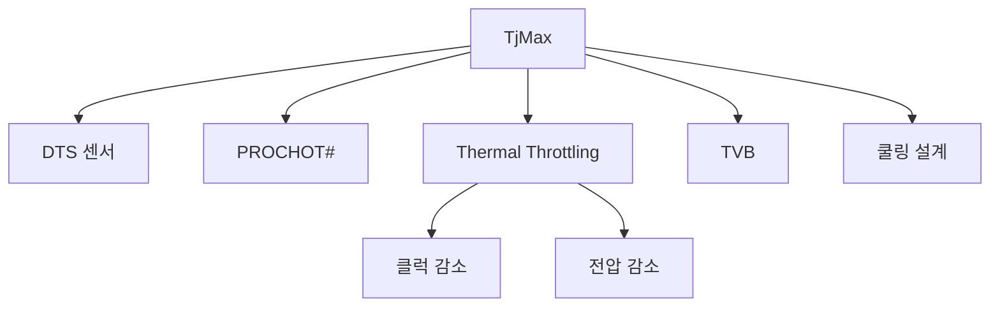

+++
title = "tjmax"
date = "2026-03-14"
weight = 735
+++

# TjMax (Tjunction Max Temperature)

#### 핵심 인사이트 (3줄 요약)
> 1. **본질**: CPU 코어의 최대 허용 온도로, 이 온도에 도달하면 Thermal Throttling이 작동하여 클럭을 낮춤
> 2. **가치**: CPU 보호, 열 관리 기준점, Thermal Throttling 트리거, 수명 보장
> 3. **융합**: PROCHOT#, Thermal Throttling, TVB, 쿨링 시스템 설계와 통합된 열 보호

---

### Ⅰ. 개요 (Context & Background)

**개념 정의**

TjMax(Tjunction Max Temperature)는 CPU 코어의 최대 허용 온도입니다. 코어 온도가 TjMax에 도달하면 Thermal Throttling이 작동하여 클럭을 낮추고 발열을 줄입니다.

```
┌─────────────────────────────────────────────────────────────────────┐
│                    TjMax 기본 개념                                   │
├─────────────────────────────────────────────────────────────────────┤
│                                                                     │
│   ┌──────────────────────────────────────────────────────────────┐ │
│   │              온도 구간별 CPU 동작                              │ │
│   │                                                              │ │
│   │   온도 (°C)                                                   │ │
│   │      ▲                                                       │ │
│   │      │                                                       │ │
│   │   105 ─────┬── Throttle 심화                                 │ │
│   │      │     │  (클럭 대폭 감소)                                │ │
│   │      │     │                                                  │ │
│   │   100 ─────┼── TjMax (최대 허용)                             │ │
│   │      │     │  Thermal Throttling 시작                        │ │
│   │      │     │                                                  │ │
│   │    95 ─────┼── 위험 구간                                      │ │
│   │      │     │  (Throttling 진행)                               │ │
│   │      │     │                                                  │ │
│   │    85 ─────┼── TVB 임계값 (CPU별 상이)                       │ │
│   │      │     │  (TVB 비활성화)                                  │ │
│   │      │     │                                                  │ │
│   │    70 ─────┼── TVB 작동 구간                                  │ │
│   │      │     │                                                  │ │
│   │    50 ─────┼── 정상 구간                                      │ │
│   │      │     │  최대 성능 가능                                  │ │
│   │      │     │                                                  │ │
│   │   ───┴─────┴─────────────────────────────────────────────    │ │
│   │                                                              │ │
│   └──────────────────────────────────────────────────────────────┘ │
│                                                                     │
│   ┌──────────────────────────────────────────────────────────────┐ │
│   │              TjMax 예시 (CPU별 상이)                          │ │
│   │                                                              │ │
│   │   ┌─────────────────────────────────────────────────────┐    │ │
│   │   │ CPU 모델              │ TjMax   │ 비고               │    │ │
│   │   │ ──────────────────────────────────────────────────  │    │ │
│   │   │ Intel Core i9-13900K  │ 100°C   │ 고성능 데스크톱    │    │ │
│   │   │ Intel Core i7-12700K  │ 100°C   │                    │    │ │
│   │   │ Intel Core i5-12400   │ 100°C   │                    │    │ │
│   │   │ AMD Ryzen 9 7950X     │ 95°C    │ Tctl_max           │    │ │
│   │   │ AMD Ryzen 7 7700X     │ 95°C    │                    │    │ │
│   │   │ Intel Xeon W-3400     │ 105°C   │ 워크스테이션       │    │ │
│   │   │ Intel Laptop CPU      │ 100°C   │ 모바일             │    │ │
│   │   │ ──────────────────────────────────────────────────  │    │ │
│   │   │ 일반적으로 95-105°C 범위                              │    │ │
│   │   └─────────────────────────────────────────────────────┘    │ │
│   │                                                              │ │
│   └──────────────────────────────────────────────────────────────┘ │
│                                                                     │
└─────────────────────────────────────────────────────────────────────┘
```

> **해설**: TjMax는 CPU가 견딜 수 있는 최대 온도입니다. 도달하면 Thermal Throttling이 작동합니다.

**💡 비유**: TjMax는 자동차 엔진의 적신호와 같습니다. 온도가 너무 높으면 엔진을 보호하기 위해 속도를 줄입니다.

**등장 배경**

① **기존 한계**: 과열 시 CPU 손상 위험
② **혁신적 패러다임**: TjMax 기준 자동 보호
③ **비즈니스 요구**: CPU 수명 보장, 안정성 확보

**📢 섹션 요약 비유**: TjMax는 엔진 적신호 같아요. 너무 뜨거우면 알아서 식혀요!

---

### Ⅱ. 아키텍처 및 핵심 원리 (Deep Dive)

**구성 요소 상세 분석**

| 요소명 | 역할 | 내부 동작 | 비유 |
|:---|:---|:---|:---|
| **TjMax** | 최대 온도 | Throttling 트리거 | 적신호 |
| **Tctl** | 제어 온도 | 실제 센서 값 | 온도계 |
| **Tdie** | 다이 온도 | 실제 코어 온도 | 실온 |
| **PROCHOT#** | 과열 신호 | 인터럽트 | 경고등 |
| **Thermal Trip** | 비상 차단 | 시스템 다운 | 비상 정지 |

**TjMax 감지 및 Throttling 메커니즘**

```
┌─────────────────────────────────────────────────────────────────────┐
│                    TjMax 감지 및 Throttling                          │
├─────────────────────────────────────────────────────────────────────┤
│                                                                     │
│   ┌──────────────────────────────────────────────────────────────┐ │
│   │              온도 센서 및 Throttling                          │ │
│   │                                                              │ │
│   │   CPU Die                                                    │ │
│   │   ┌─────────────────────────────────────────────────────┐    │ │
│   │   │                                                     │    │ │
│   │   │   Core 0 ──┐                                        │    │ │
│   │   │   Core 1 ──┼──► DTS (Digital Thermal Sensor)       │    │ │
│   │   │   Core 2 ──┤     각 코어별 온도 측정                 │    │ │
│   │   │   Core 3 ──┘                                        │    │ │
│   │   │         │                                           │    │ │
│   │   │         ▼                                           │    │ │
│   │   │   ┌─────────────────────────────────────────┐       │    │ │
│   │   │   │  온도 비교:                             │       │    │ │
│   │   │   │  if (Tctl >= TjMax - offset) {         │       │    │ │
│   │   │   │      PROCHOT# = ACTIVE;                │       │    │ │
│   │   │   │      StartThrottling();                │       │    │ │
│   │   │   │  }                                      │       │    │ │
│   │   │   └─────────────────────────────────────────┘       │    │ │
│   │   │                                                     │    │ │
│   │   └─────────────────────────────────────────────────────┘    │ │
│   │                                                              │ │
│   └──────────────────────────────────────────────────────────────┘ │
│                                                                     │
│   ┌──────────────────────────────────────────────────────────────┐ │
│   │              Thermal Throttling 단계                          │ │
│   │                                                              │ │
│   │   ┌─────────────────────────────────────────────────────┐    │ │
│   │   │                                                     │    │ │
│   │   │   온도               조치                            │    │ │
│   │   │   ───────────────────────────────────────────────   │    │ │
│   │   │   TjMax - 5°C      Turbo Boost 비활성화             │    │ │
│   │   │   TjMax            Thermal Throttling 시작          │    │ │
│   │   │   TjMax + 5°C      클럭 대폭 감소 (-50%)            │    │ │
│   │   │   TjMax + 15°C     Thermal Trip (시스템 다운)       │    │ │
│   │   │                                                     │    │ │
│   │   └─────────────────────────────────────────────────────┘    │ │
│   │                                                              │ │
│   └──────────────────────────────────────────────────────────────┘ │
│                                                                     │
└─────────────────────────────────────────────────────────────────────┘
```

> **해설**: DTS가 각 코어 온도를 측정하고, TjMax 근접 시 PROCHOT# 신호로 Throttling을 시작합니다.

**핵심 알고리즘: TjMax 관리**

```c
// TjMax 관리 (의사코드)
struct ThermalState {
    float    tjmax;             // 최대 허용 온도
    float    current_temp;      // 현재 온도
    float    throttle_temp;     // Throttling 시작 온도
    uint32_t current_freq;      // 현재 주파수
    uint32_t base_freq;         // 기본 주파수
    bool     throttling;        // Throttling 상태
};

// Thermal Throttling 제어
void CheckThermalThrottling(struct ThermalState *ts) {
    if (ts->current_temp >= ts->tjmax) {
        // TjMax 도달: 급격한 Throttling
        ts->throttling = true;
        ts->current_freq = ts->base_freq * 0.5;  // 50% 감소
        SetPROCHOT(true);
    } else if (ts->current_temp >= ts->tjmax - 5) {
        // TjMax 근접: 점진적 Throttling
        ts->throttling = true;
        float ratio = (ts->tjmax - ts->current_temp) / 5.0;
        ts->current_freq = ts->base_freq * (0.7 + 0.3 * ratio);
    } else {
        // 정상 온도
        ts->throttling = false;
        ts->current_freq = ts->base_freq;
        SetPROCHOT(false);
    }

    SetCPUFrequency(ts->current_freq);
}

// Linux에서 TjMax 확인
// # cat /sys/devices/platform/coretemp.0/hwmon/hwmon*/temp1_max
// 100000  (100°C = 100000 millidegrees)

// # sensors
// coretemp-isa-0000
// Adapter: ISA adapter
// Package id 0:  +45.0°C  (high = +100.0°C, crit = +100.0°C)
// Core 0:        +43.0°C  (high = +100.0°C, crit = +100.0°C)
// Core 1:        +42.0°C  (high = +100.0°C, crit = +100.0°C)

// MSR로 TjMax 확인 (Intel)
// # rdmsr 0x1a2
// 0x6464  (TjMax = 100°C, bits 16-23)

// Thermal Throttling 이벤트 확인
// # cat /sys/devices/system/cpu/cpu0/thermal_throttle/*
```

**📢 섹션 요약 비유**: TjMax 관리는 냉각수 온도계와 같습니다. 너무 뜨거우면 엔진을 보호합니다.

---

### Ⅲ. 융합 비교 및 다각도 분석 (Comparison & Synergy)

**기술 비교: Intel TjMax vs AMD Tctl_max**

| 비교 항목 | Intel TjMax | AMD Tctl_max |
|:---|:---:|:---:|
| **일반 값** | 100°C | 95°C |
| **센서** | DTS | Tctl |
| **Throttling** | TjMax 시 | Tctl_max 시 |
| **Trip** | 105-115°C | 95-105°C |

**과목 융합 관점: TjMax와 타 영역 시너지**

| 융합 영역 | 시너지 효과 | 구현 예시 |
|:---|:---|:---|
| **열** | 쿨링 설계 기준 | 쿨러 용량 |
| **전력** | 전력-발열 연동 | PL1/PL2 |
| **케이스** | 통풍 설계 | 에어플로우 |
| **서버** | 랙 냉각 | CRAH |
| **모바일** | 배터리/발열 | 팬리스 |

**📢 섹션 요약 비유**: TjMax는 모든 열 관리의 기준점입니다. 쿨링, 전력, 케이스 설계가 모두 TjMax를 기준으로 합니다.

---

### Ⅳ. 실무 적용 및 기술사적 판단 (Strategy & Decision)

**실무 시나리오별 적용**

**시나리오 1: 오버클럭**
- **문제**: TjMax 근접
- **해결**: 쿨링 강화
- **의사결정**: 수냉/액냉

**시나리오 2: 노트북**
- **문제**: 팬 소음 vs 온도
- **해결**: 온도 허용 범위 조절
- **의사결정**: 소음 우선

**시나리오 3: 서버**
- **문제**: 안정성
- **해결**: TjMax 여유 확보
- **의사결정**: 80°C 이하 유지

**도입 체크리스트**

| 구분 | 항목 | 확인 포인트 |
|:---|:---|:---|
| **기술적** | 센서 | DTS 작동 |
| | 모니터링 | sensors |
| | Throttling | 동작 확인 |
| **운영적** | 쿨링 | 충분한 용량 |
| | 온도 | 실시간 확인 |
| | 환경 | 실내 온도 |

**안티패턴: TjMax 관리 오용 사례**

| 안티패턴 | 문제점 | 올바른 접근 |
|:---|:---|:---|
| **TjMax 무시** | CPU 손상 | 모니터링 필수 |
| **쿨링 부족** | Throttling 빈번 | 쿨러 업그레이드 |
| **팬리스 과신** | Thermal Trip | 쿨링 필요 |
| **모니터링 부재** | 문제 파악 불가 | sensors 사용 |

**📢 섹션 요약 비유**: TjMax 관리는 건강 관리와 같습니다. 체온이 너무 높으면 쉬어야 합니다.

---

### Ⅴ. 기대효과 및 결론 (Future & Standard)

**정량/정성 기대효과**

| 구분 | TjMax 미달성 | TjMax 도달 | 차이 |
|:---|:---:|:---:|:---:|
| **클럭** | 최대 | 50-70% | -30-50% |
| **성능** | 100% | 60% | -40% |
| **수명** | 정상 | 단축 가능 | 위험 |
| **안정성** | 높음 | 낮음 | 위험 |

**미래 전망**

1. **Higher TjMax:** 110°C+ 허용 (신소재)
2. **AI 기반:** 예측적 Throttling
3. **3D 적층:** 핫스팟 관리
4. **Chiplet:** 영역별 TjMax

**참고 표준**

| 표준 | 내용 | 적용 |
|:---|:---|:---|
| **Intel SDM** | TjMax MSR | Intel CPU |
| **AMD BKDG** | Tctl_max | AMD CPU |
| **Linux** | coretemp | 드라이버 |
| **lm_sensors** | 모니터링 | 도구 |

**📢 섹션 요약 비유**: TjMax의 미래는 스마트 체온계와 같습니다. AI가 체온을 예측해 미리 조언합니다.

---

### 📌 관련 개념 맵 (Knowledge Graph)



**연관 개념 링크**:
- PROCHOT# - 과열 신호
- PL1, PL2 - 전력 제한
- Thermal Velocity Boost - 온도 기반 가속
- 히트스프레더 - 열 분산

---

### 👶 어린이를 위한 3줄 비유 설명

1. **적신호**: TjMax는 엔진 적신호 같아요. 너무 뜨거우면 알아서 멈춰요!

2. **체온계**: CPU도 체온이 있어요. 100도가 너무 뜨거워요!

3. **냉각수**: 뜨거우면 냉각수가 필요해요. 팬이 시원하게 해줘요!