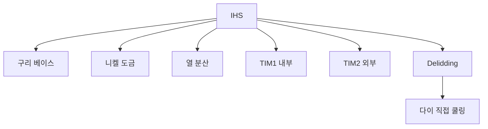

+++
title = "ihs"
date = "2026-03-14"
weight = 736
+++

# 히트스프레더 (IHS, Integrated Heat Spreader)

#### 핵심 인사이트 (3줄 요약)
> 1. **본질**: CPU 다이 위에 부착된 금속 캡으로, 작은 다이에서 발생한 열을 넓은 면적으로 분산시키는 열 확산기
> 2. **가치**: 다이 보호, 열 분산, 쿨러 접촉면적 증대, 설치 편의성
> 3. **융합**: TIM, 쿨러, 서멀 페이스트, delidding, 직접 다이 쿨링과 통합된 열 관리

---

### Ⅰ. 개요 (Context & Background)

**개념 정의**

히트스프레더(IHS, Integrated Heat Spreader)는 CPU 다이 위에 부착된 금속 캡입니다. 작은 다이에서 발생한 열을 넓은 면적으로 분산시켜 쿨러로 효과적으로 전달합니다.

```
┌─────────────────────────────────────────────────────────────────────┐
│                    IHS 구조 및 열 분산 원리                          │
├─────────────────────────────────────────────────────────────────────┤
│                                                                     │
│   ┌──────────────────────────────────────────────────────────────┐ │
│   │              CPU 패키지 단면도                                │ │
│   │                                                              │ │
│   │                ┌─────────────────────────────┐               │ │
│   │                │         쿨러 (Cooler)        │               │ │
│   │                │      (Heat Sink Base)       │               │ │
│   │                └──────────────┬──────────────┘               │ │
│   │                               │                              │ │
│   │          서멀 페이스트 (TIM2) │                              │ │
│   │                ┌──────────────┴──────────────┐               │ │
│   │                │                             │               │ │
│   │                │      IHS (금속 캡)           │               │ │
│   │                │   (구리/니켈 도금)           │               │ │
│   │                │      열 확산                 │               │ │
│   │                │                             │               │ │
│   │                └──────────────┬──────────────┘               │ │
│   │                               │                              │ │
│   │          내부 TIM (TIM1)      │                              │ │
│   │                ┌──────────────┴──────────────┐               │ │
│   │                │         ┌─────┐             │               │ │
│   │                │         │ CPU │  CPU 다이   │               │ │
│   │                │         │ Die │  (작은 면적) │               │ │
│   │                │         └─────┘             │               │ │
│   │                │        기판 (Substrate)     │               │ │
│   │                └─────────────────────────────┘               │ │
│   │                               │                              │ │
│   │                         소켓/패드                            │ │
│   │                                                              │ │
│   └──────────────────────────────────────────────────────────────┘ │
│                                                                     │
│   ┌──────────────────────────────────────────────────────────────┐ │
│   │              IHS 열 분산 효과                                 │ │
│   │                                                              │ │
│   │   다이 표면적: ~200mm² (10×20mm)                             │ │
│   │   IHS 표면적: ~800mm² (40×40mm)                              │ │
│   │   확산 비율: 4배                                             │ │
│   │                                                              │ │
│   │   열 밀도: 200W / 200mm² = 1W/mm² (다이)                     │ │
│   │            200W / 800mm² = 0.25W/mm² (IHS)                   │ │
│   │            → 열 밀도 75% 감소!                               │ │
│   │                                                              │ │
│   └──────────────────────────────────────────────────────────────┘ │
│                                                                     │
└─────────────────────────────────────────────────────────────────────┘
```

> **해설**: IHS는 작은 다이의 열을 넓은 면적으로 분산시켜 쿨러가 효과적으로 열을 흡수할 수 있게 합니다.

**💡 비유**: IHS는 프라이팬의 바닥과 같습니다. 작은 열원(버너)의 열을 넓은 표면으로 골고루 분산시킵니다.

**등장 배경**

① **기존 한계**: 다이 직접 쿨링 → 손상 위험, 설치 어려움
② **혁신적 패러다임**: IHS로 다이 보호 + 열 분산
③ **비즈니스 요구**: 대량 생산, 사용자 친화적 설치

**📢 섹션 요약 비유**: IHS는 프라이팬 바닥 같아요. 열을 넓게 퍼뜨려요!

---

### Ⅱ. 아키텍처 및 핵심 원리 (Deep Dive)

**구성 요소 상세 분석**

| 요소명 | 역할 | 내부 동작 | 비유 |
|:---|:---|:---|:---|
| **IHS** | 열 확산 | 구리 베이스 | 프라이팬 바닥 |
| **TIM1** | 다이-IHS 열전도 | 인더/솔더 | 접착제 |
| **TIM2** | IHS-쿨러 열전도 | 서멀 페이스트 | 윤활유 |
| **다이** | 열원 | 실리콘 칩 | 버너 |
| **서브스트레이트** | 기판 | 유리섬유 | 그릇 |

**IHS 재질 및 특성**

```
┌─────────────────────────────────────────────────────────────────────┐
│                    IHS 재질 및 열전도도                              │
├─────────────────────────────────────────────────────────────────────┤
│                                                                     │
│   ┌──────────────────────────────────────────────────────────────┐ │
│   │              IHS 재질 비교                                    │ │
│   │                                                              │ │
│   │   ┌─────────────────────────────────────────────────────┐    │ │
│   │   │ 재질       │ 열전도도 (W/mK) │ 특징                  │    │ │
│   │   │ ─────────────────────────────────────────────────── │    │ │
│   │   │ 구리 (Cu)  │ 400            │ 높은 열전도, 연함      │    │ │
│   │   │ 알루미늄   │ 237            │ 가벼움, 산화           │    │ │
│   │   │ 니켈 도금  │ 90             │ 내식성, 경도           │    │ │
│   │   │ ─────────────────────────────────────────────────── │    │ │
│   │   │ 일반적 IHS: 구리 + 니켈 도금                          │    │ │
│   │   │ (구리: 열전도, 니켈: 보호/마모 방지)                  │    │ │
│   │   └─────────────────────────────────────────────────────┘    │ │
│   │                                                              │ │
│   └──────────────────────────────────────────────────────────────┘ │
│                                                                     │
│   ┌──────────────────────────────────────────────────────────────┐ │
│   │              IHS 두께와 열저항                                │ │
│   │                                                              │ │
│   │   열저항 (K/W) = 두께 / (면적 × 열전도도)                    │ │
│   │                                                              │ │
│   │   얇은 IHS: 낮은 열저항, 빠른 열전달                         │ │
│   │   두꺼운 IHS: 높은 열용량, 완만한 온도 변화                  │ │
│   │                                                              │ │
│   │   일반적 두께: 1-2mm                                         │ │
│   │                                                              │ │
│   └──────────────────────────────────────────────────────────────┘ │
│                                                                     │
└─────────────────────────────────────────────────────────────────────┘
```

> **해설**: IHS는 일반적으로 구리(열전도)에 니켈 도금(보호)을 합니다. 두께는 1-2mm가 일반적입니다.

**핵심 알고리즘: IHS 열전달 계산**

```c
// IHS 열전달 계산 (의사코드)
struct IHSProperties {
    float    area;           // m²
    float    thickness;      // m
    float    conductivity;   // W/mK
    float    heat_flux;      // W
};

// IHS 열저항 계산
float CalculateIHSResistance(struct IHSProperties *ihs) {
    // R = L / (k × A)
    return ihs->thickness / (ihs->conductivity * ihs->area);
}

// IHS 온도 상승 계산
float CalculateIHSTempRise(struct IHSProperties *ihs, float heat_flux) {
    float resistance = CalculateIHSResistance(ihs);
    // ΔT = Q × R
    return heat_flux * resistance;
}

// 예시 계산
// IHS: 40mm × 40mm × 1.5mm, 구리 (400 W/mK)
// area = 0.04 × 0.04 = 0.0016 m²
// thickness = 0.0015 m
// R = 0.0015 / (400 × 0.0016) = 0.00234 K/W
// Q = 200W
// ΔT = 200 × 0.00234 = 0.47°C

// 실제 측정 명령
// # sensors
// coretemp-isa-0000
// Package id 0:  +65.0°C  (IHS 온도)
//
// # cat /sys/devices/platform/coretemp.0/hwmon/hwmon*/temp1_input
// 65000  (65°C)
```

**📢 섹션 요약 비유**: IHS 두께는 얇을수록 좋지만, 너무 얇으면 구조적으로 약해집니다. 균형이 필요합니다.

---

### Ⅲ. 융합 비교 및 다각도 분석 (Comparison & Synergy)

**기술 비교: IHS vs 다이 직접 쿨링**

| 비교 항목 | IHS | 다이 직접 쿨링 |
|:---|:---:|:---:|
| **다이 보호** | 보호 | 노출 |
| **설치** | 쉬움 | 어려움 |
| **열전달** | 간접 | 직접 |
| **온도** | 높음 | 낮음 |
| **위험** | 낮음 | 높음 |

**과목 융합 관점: IHS와 타 영역 시너지**

| 융합 영역 | 시너지 효과 | 구현 예시 |
|:---|:---|:---|
| **열** | 열 분산 기준 | 쿨러 설계 |
| **쿨러** | 접촉면적 | 쿨러 베이스 |
| **서멀 페이스트** | 열전달 매체 | TIM |
| **Delidding** | IHS 제거 | 온도 감소 |
| **서버** | 표준화 | 1U/2U 쿨러 |

**📢 섹션 요약 비유**: IHS는 쿨러와 다이 사이의 중개인입니다. 열을 효과적으로 전달하고 다이를 보호합니다.

---

### Ⅳ. 실무 적용 및 기술사적 판단 (Strategy & Decision)

**실무 시나리오별 적용**

**시나리오 1: 게이밍**
- **문제**: 온도 관리
- **해결**: 양질의 IHS + 서멀 페이스트
- **의사결정**: 고품질 TIM

**시나리오 2: 오버클러킹**
- **문제**: 온도 한계
- **해결**: Delidding (IHS 제거)
- **의사결정**: 위험 감수

**시나리오 3: 서버**
- **문제**: 표준화
- **해결**: IHS 유지
- **의사결정**: 안정성 우선

**도입 체크리스트**

| 구분 | 항목 | 확인 포인트 |
|:---|:---|:---|
| **기술적** | 재질 | 구리+니켈 |
| | 두께 | 1-2mm |
| | 평탄도 | IHS 컨케이브 |
| **운영적** | 모니터링 | sensors |
| | 서멀 페이스트 | 주기적 교체 |
| | 쿨러 | 적절한 체력 |

**안티패턴: IHS 관리 오용 사례**

| 안티패턴 | 문제점 | 올바른 접근 |
|:---|:---|:---|
| **과도한 체력** | IHS 손상 | 적정 체력 |
| **서멀 페이스트 과다** | 단열 효과 | 적정량 |
| **Delidding 무모** | 다이 손상 | 숙련 필수 |
| **평탄도 무시** | 접촉 불량 | 랩핑 고려 |

**📢 섹션 요약 비유**: IHS 관리는 요리 도구 관리와 같습니다. 바닥이 평평하고 깨끗해야 요리가 잘 됩니다.

---

### Ⅴ. 기대효과 및 결론 (Future & Standard)

**정량/정성 기대효과**

| 구분 | 다이 직접 | IHS | 차이 |
|:---|:---:|:---:|:---:|
| **다이 온도** | 70°C | 80°C | +10°C |
| **다이 보호** | 취약 | 보호 | 안전 |
| **설치 난이도** | 높음 | 낮음 | 편리 |
| **균일성** | 불균일 | 균일 | 안정 |

**미래 전망**

1. **얇은 IHS:** 열전달 개선
2. **신소재:** 다이아몬드 IHS
3. **Chiplet IHS:** 영역별 IHS
4. **Liquid Metal IHS:** 통합 LM TIM

**참고 표준**

| 표준 | 내용 | 적용 |
|:---|:---|:---|
| **Intel** | IHS 설계 | Intel CPU |
| **AMD** | IHS 설계 | AMD CPU |
| **JEDEC** | 패키지 표준 | 산업 표준 |
| **Thermal** | 열 설계 | 쿨러 |

**📢 섹션 요약 비유**: IHS의 미래는 더 얇고 더 효율적인 프라이팬과 같습니다. 열을 더 빨리 퍼뜨립니다.

---

### 📌 관련 개념 맵 (Knowledge Graph)



**연관 개념 링크**:
- 서멀 페이스트 - TIM
- TjMax - 최대 온도
- 베이퍼 체임버 - 쿨링 기술
- 히트파이프 - 열전달

---

### 👶 어린이를 위한 3줄 비유 설명

1. **금속 캡**: IHS는 CPU의 금속 모자예요. CPU를 보호해요!

2. **열 확산**: 작은 점에서 나온 열을 넓게 퍼뜨려요. 프라이팬 같아요!

3. **쿨러 친구**: 쿨러랑 IHS가 붙어서 열을 식혀요. 열린 친구예요!