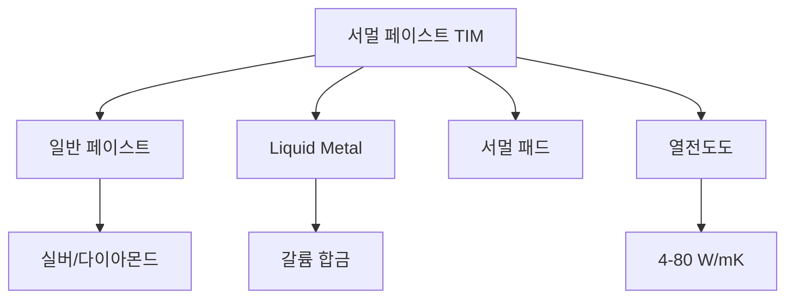

+++
title = "thermal paste"
date = "2026-03-14"
weight = 737
+++

# 서멀 페이스트 (TIM, Thermal Interface Material)

#### 핵심 인사이트 (3줄 요약)
> 1. **본질**: CPU/GPU와 쿨러 사이의 미세한 공극을 채워 열전달을 개선하는 열전도성 물질
> 2. **가치**: 접촉 열저항 감소, 열전달 효율 향상, 온도 5-15°C 감소, 쿨러 성능 극대화
> 3. **융합**: IHS, 쿨러, Liquid Metal, 서멀 패드, 그래파이트 시트와 통합된 열 인터페이스

---

### Ⅰ. 개요 (Context & Background)

**개념 정의**

서멀 페이스트(TIM, Thermal Interface Material)는 CPU/GPU와 쿨러 사이의 미세한 공극을 채우는 열전도성 물질입니다. 접촉 열저항을 감소시켜 열전달 효율을 크게 향상시킵니다.

```
┌─────────────────────────────────────────────────────────────────────┐
│                    서멀 페이스트 기본 원리                            │
├─────────────────────────────────────────────────────────────────────┤
│                                                                     │
│   ┌──────────────────────────────────────────────────────────────┐ │
│   │              서멀 페이스트 없이 (공극 존재)                    │ │
│   │                                                              │ │
│   │   쿨러                                                       │ │
│   │   ─────────────────────────────────────────                 │ │
│   │              ▼      ▼      ▼      ▼      ▼                  │ │
│   │   IHS      ┌──┐  ┌──┐  ┌──┐  ┌──┐  ┌──┐                   │ │
│   │   ─────────│공│  │극│  │ │  │공│  │극│────────────────    │ │
│   │            │기│  │ │  │ │  │기│  │ │                      │ │
│   │            └──┘  └──┘  │ │  └──┘  └──┘                   │ │
│   │                          ▼                                  │ │
│   │              열전달 방해! (공기 = 단열재)                    │ │
│   │              공기 열전도도: 0.026 W/mK                      │ │
│   │                                                              │ │
│   └──────────────────────────────────────────────────────────────┘ │
│                                                                     │
│   ┌──────────────────────────────────────────────────────────────┐ │
│   │              서멀 페이스트 적용 (공극 충전)                    │ │
│   │                                                              │ │
│   │   쿨러                                                       │ │
│   │   ─────────────────────────────────────────                 │ │
│   │              │▓▓▓▓▓▓▓▓▓▓▓▓▓▓▓▓▓▓▓▓│                        │ │
│   │   IHS      │▓▓▓▓ 서멀 페이스트 ▓▓▓▓│                       │ │
│   │   ─────────│▓▓▓▓▓▓▓▓▓▓▓▓▓▓▓▓▓▓▓▓│────────────────        │ │
│   │              │▓▓▓▓▓▓▓▓▓▓▓▓▓▓▓▓▓▓▓▓│                        │ │
│   │                          ▼                                  │ │
│   │              열전달 개선!                                    │ │
│   │              서멀 페이스트 열전도도: 4-15 W/mK              │ │
│   │              → 150-500배 향상!                              │ │
│   │                                                              │ │
│   └──────────────────────────────────────────────────────────────┘ │
│                                                                     │
└─────────────────────────────────────────────────────────────────────┘
```

> **해설**: 공기는 단열재(0.026 W/mK)입니다. 서멀 페이스트는 150-500배 높은 열전도도로 공극을 채웁니다.

**💡 비유**: 서멀 페이스트는 도로의 아스팔트와 같습니다. 울퉁불퉁한 표면을 매끄럽게 만들어 차가(열이) 잘 지나가게 합니다.

**등장 배경**

① **기존 한계**: 금속-금속 접촉 → 미세 공극 → 단열
② **혁신적 패러다임**: TIM으로 공극 충전 → 열전달 개선
③ **비즈니스 요구**: CPU/GPU 고발열 관리, 쿨러 성능 극대화

**📢 섹션 요약 비유**: 서멀 페이스트는 도로 아스팔트 같아요. 울퉁불퉁을 매끄럽게 해요!

---

### Ⅱ. 아키텍처 및 핵심 원리 (Deep Dive)

**구성 요소 상세 분석**

| 요소명 | 역할 | 내부 동작 | 비유 |
|:---|:---|:---|:---|
| **베이스** | 담체 | 실리콘/에폭시 | 접착제 |
| **필러** | 열전도 입자 | 산화아연/알루미나/은 | 골재 |
| ** Liquid Metal** | 고성능 TIM | 갈륨/인듐/주석 | 액체 금속 |
| **서멀 패드** | 고체 TIM | 실리콘+필러 | 시트 |
| **그래파이트** | 카본 TIM | 피로리틱 그래파이트 | 시트 |

**서멀 페이스트 종류 및 열전도도**

```
┌─────────────────────────────────────────────────────────────────────┐
│                    서멀 페이스트 종류 및 열전도도                     │
├─────────────────────────────────────────────────────────────────────┤
│                                                                     │
│   ┌──────────────────────────────────────────────────────────────┐ │
│   │              서멀 페이스트 분류                                │ │
│   │                                                              │ │
│   │   ┌─────────────────────────────────────────────────────┐    │ │
│   │   │ 종류          │ 열전도도    │ 특징        │ 용도     │    │ │
│   │   │               │ (W/mK)     │             │          │    │ │
│   │   │ ─────────────────────────────────────────────────── │    │ │
│   │   │ 기본형        │ 1-3        │ 저렴, 쉬움   │ 일반     │    │ │
│   │   │ 산화아연      │ 2-4        │ 무난함       │ 일반     │    │ │
│   │   │ 알루미나      │ 3-6        │ 중간         │ 게이밍   │    │ │
│   │   │ 실버          │ 4-8        │ 고품질       │ 오버클럭 │    │ │
│   │   │ 다이아몬드    │ 4-10       │ 높음, 비쌈   │ 극한     │    │ │
│   │   │ Liquid Metal  │ 15-80      │ 최고, 위험   │ 오버클럭 │    │ │
│   │   │ ─────────────────────────────────────────────────── │    │ │
│   │   │ 공기 (참고)   │ 0.026      │ 단열재       │ -        │    │ │
│   │   │ 구리 (참고)   │ 400        │ 금속         │ -        │    │ │
│   │   └─────────────────────────────────────────────────────┘    │ │
│   │                                                              │ │
│   └──────────────────────────────────────────────────────────────┘ │
│                                                                     │
│   ┌──────────────────────────────────────────────────────────────┐ │
│   │              Liquid Metal TIM                                 │ │
│   │                                                              │ │
│   │   구성: 갈륨(Ga), 인듐(In), 주석(Sn) 합금                    │ │
│   │   열전도도: 15-80 W/mK (일반 페이스트 대비 5-20배)           │ │
│   │   온도 감소: 5-15°C                                          │ │
│   │                                                              │ │
│   │   주의사항:                                                  │ │
│   │   - 전도성: 회로 단락 위험                                   │ │
│   │   - 부식성: 알루미늄 부식                                     │ │
│   │   - 독성: 취급 주의                                          │ │
│   │   - 도포 난이도: 높음                                        │ │
│   │                                                              │ │
│   └──────────────────────────────────────────────────────────────┘ │
│                                                                     │
└─────────────────────────────────────────────────────────────────────┘
```

> **해설**: 일반 서멀 페이스트는 4-8 W/mK, Liquid Metal은 15-80 W/mK로 훨씬 높습니다. 하지만 위험도 있습니다.

**핵심 알고리즘: TIM 열저항 계산**

```c
// TIM 열저항 계산 (의사코드)
struct TIMProperties {
    float    thickness;       // m (일반적: 0.05-0.1mm)
    float    area;            // m²
    float    conductivity;    // W/mK
    float    contact_resistance;  // K/W (표면 접촉)
};

// TIM 열저항 계산
float CalculateTIMResistance(struct TIMProperties *tim) {
    // 재료 열저항
    float material_R = tim->thickness / (tim->conductivity * tim->area);

    // 접촉 열저항 (양면)
    float contact_R = tim->contact_resistance * 2;

    return material_R + contact_R;
}

// TIM 온도 상승 계산
float CalculateTIMTempRise(struct TIMProperties *tim, float heat_flux) {
    float resistance = CalculateTIMResistance(tim);
    return heat_flux * resistance;
}

// 예시 계산
// TIM: Arctic MX-6, 5.2 W/mK
// 두께: 0.05mm = 0.00005m
// 면적: 40mm × 40mm = 0.0016 m²
// 열유속: 200W
//
// R = 0.00005 / (5.2 × 0.0016) = 0.006 K/W
// ΔT = 200 × 0.006 = 1.2°C

// Liquid Metal로 교체 시 (80 W/mK):
// R = 0.00005 / (80 × 0.0016) = 0.00039 K/W
// ΔT = 200 × 0.00039 = 0.078°C
// → 1.1°C 개선

// Linux에서 온도 확인
// # sensors
// coretemp-isa-0000
// Package id 0:  +65.0°C  (TIM 적용 후)
```

**📢 섹션 요약 비유**: TIM 선택은 도로 포장 선택과 같습니다. 좋은 아스팔트(TIM)를 적절한 두께로 깔아야 합니다.

---

### Ⅲ. 융합 비교 및 다각도 분석 (Comparison & Synergy)

**기술 비교: 서멀 페이스트 vs Liquid Metal vs 서멀 패드**

| 비교 항목 | 서멀 페이스트 | Liquid Metal | 서멀 패드 |
|:---|:---:|:---:|:---:|
| **열전도도** | 4-8 W/mK | 15-80 W/mK | 1-6 W/mK |
| **온도 감소** | 기준 | -5~15°C | +2~5°C |
| **전도성** | 비전도 | 전도성 | 비전도 |
| **도포 난이도** | 중간 | 높음 | 낮음 |
| **수명** | 2-5년 | 1-3년 | 5년+ |

**과목 융합 관점: TIM과 타 영역 시너지**

| 융합 영역 | 시너지 효과 | 구현 예시 |
|:---|:---|:---|
| **쿨러** | 쿨러 성능 극대화 | 적정 체력 |
| **IHS** | IHS-Cooler 인터페이스 | TIM2 |
| **다이** | Die-IHS 인터페이스 | TIM1 |
| **서버** | 대량 적용 | 자동 도포 |
| **모바일** | 박형 패드 | 서멀 패드 |

**📢 섹션 요약 비유**: TIM은 쿨러와 CPU/GPU의 접착제입니다. 좋은 TIM은 열을 더 잘 전달합니다.

---

### Ⅳ. 실무 적용 및 기술사적 판단 (Strategy & Decision)

**실무 시나리오별 적용**

**시나리오 1: 게이밍**
- **문제**: 온도 관리
- **해결**: 중급 서멀 페이스트
- **의사결정**: Arctic MX-6

**시나리오 2: 오버클러킹**
- **문제**: 최대 온도 감소
- **해결**: Liquid Metal
- **의사결정**: 위험 감수

**시나리오 3: 서버**
- **문제**: 안정성
- **해결**: 신뢰성 높은 TIM
- **의사결정**: OEM TIM

**도입 체크리스트**

| 구분 | 항목 | 확인 포인트 |
|:---|:---|:---|
| **기술적** | 종류 | 용도에 맞게 |
| | 도포량 | 완두콩 크기 |
| | 수명 | 2-5년 교체 |
| **운영적** | 모니터링 | sensors |
| | 교체 주기 | 2년 권장 |
| | 청소 | 알코올 |

**안티패턴: TIM 오용 사례**

| 안티패턴 | 문제점 | 올바른 접근 |
|:---|:---|:---|
| **과량 도포** | 단열 효과 | 적정량 |
| **무교체** | 건조/성능 저하 | 2년마다 교체 |
| **Liquid Metal 오용** | 단락/부식 | 구리에만 |
| **저품질 TIM** | 효과 미미 | 중급 이상 |

**📢 섹션 요약 비유**: TIM 도포는 요리의 기름칠과 같습니다. 너무 많으면 안 좋고, 적당히 발라야 합니다.

---

### Ⅴ. 기대효과 및 결론 (Future & Standard)

**정량/정성 기대효과**

| 구분 | TIM 없음 | 일반 TIM | Liquid Metal |
|:---|:---:|:---:|:---:|
| **온도** | 90°C+ | 75°C | 65°C |
| **성능** | Throttling | 정상 | 최적 |
| **수명** | CPU 손상 | 정상 | 주의 |
| **비용** | - | $10 | $30 |

**미래 전망**

1. **나노 입자:** 고성능 TIM
2. **그래핀:** 초고열전도
3. **자가 치유:** 장기 안정성
4. **스프레이:** 균일 도포

**참고 표준**

| 표준 | 내용 | 적용 |
|:---|:---|:---|
| **ASTM D5470** | 열전도도 측정 | TIM 표준 |
| **JEDEC** | TIM 사양 | 산업 표준 |
| **OEM** | 출고 TIM | CPU/GPU |
| **Arctic** | MX 시리즈 | 소비자 |

**📢 섹션 요약 비유**: TIM의 미래는 스마트 도로와 같습니다. 자동으로 보수되고 더 잘 달리게 합니다.

---

### 📌 관련 개념 맵 (Knowledge Graph)



**연관 개념 링크**:
- 히트스프레더 - IHS
- 베이퍼 체임버 - 쿨링
- 히트파이프 - 열전달
- TjMax - 최대 온도

---

### 👶 어린이를 위한 3줄 비유 설명

1. **열 전달**: 서멀 페이스트는 열 전달사 같아요. CPU와 쿨러 사이에서 열을 전해요!

2. **공극 채우기**: 틈새를 메워요. 공기가 들어가면 안 좋아요!

3. **적당량**: 완두콩만큼만 발라요. 너무 많으면 안 좋아요!