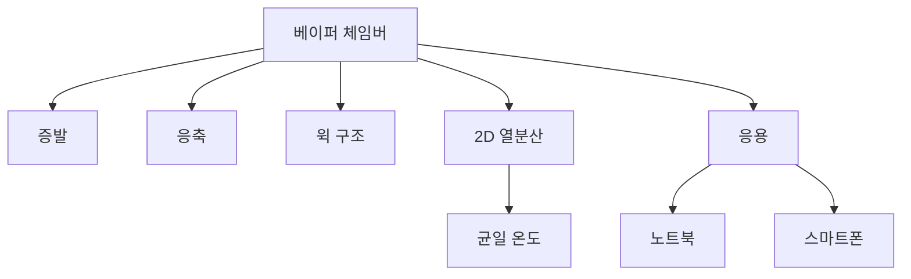

+++
title = "vapor chamber"
date = "2026-03-14"
weight = 738
+++

# 베이퍼 체임버 (Vapor Chamber)

#### 핵심 인사이트 (3줄 요약)
> 1. **본질**: 밀폐된 금속 챔버 내부에서 작동유체의 증발-응축 순환으로 열을 전달하는 2차원 열전달 소자
> 2. **가치**: 2D 열 분산, 높은 등가 열전도도(>10,000 W/mK), 얇은 두께, 균일한 온도 분포
> 3. **융합**: 히트파이프, 서멀 페이스트, 쿨러, 노트북/스마트폰 쿨링과 통합된 2D 열관리

---

### Ⅰ. 개요 (Context & Background)

**개념 정의**

베이퍼 체임버(Vapor Chamber)는 밀폐된 금속 챔버 내부에서 작동유체의 증발-응축 순환으로 열을 전달하는 2차원 열전달 소자입니다. 히트파이프의 2D 확장 버전입니다.

```
┌─────────────────────────────────────────────────────────────────────┐
│                    베이퍼 체임버 구조 및 원리                         │
├─────────────────────────────────────────────────────────────────────┤
│                                                                     │
│   ┌──────────────────────────────────────────────────────────────┐ │
│   │              베이퍼 체임버 단면도                              │ │
│   │                                                              │ │
│   │               상부 금속 쉘 (구리)                            │ │
│   │   ┌─────────────────────────────────────────────────────┐   │ │
│   │   │▓▓▓▓▓▓▓▓▓▓▓▓▓▓▓▓▓ 증기 영역 ▓▓▓▓▓▓▓▓▓▓▓▓▓▓▓▓▓▓│   │ │
│   │   │    ↑ 증발                              응축 ↓      │   │ │
│   │   │ ┌──┴──┐                              ┌──┴──┐       │   │ │
│   │   │ │ CPU │  열원                        │ 핀 │  방열   │   │ │
│   │   │ └──┬──┘                              └──┬──┘       │   │ │
│   │   │    │                                    │          │   │ │
│   │   │▓▓▓▓▓▓▓▓▓▓▓▓▓▓▓▓▓ 윅 구조 ▓▓▓▓▓▓▓▓▓▓▓▓▓▓▓▓▓│   │ │
│   │   │    │   ────► 모세관 현상으로 액체 복귀 ◄────       │   │ │
│   │   │    ▼                                    ▼          │   │ │
│   │   └─────────────────────────────────────────────────────┘   │ │
│   │               하부 금속 쉘 (구리)                            │ │
│   │                                                              │ │
│   └──────────────────────────────────────────────────────────────┘ │
│                                                                     │
│   ┌──────────────────────────────────────────────────────────────┐ │
│   │              작동 원리 (2상 열전달)                           │ │
│   │                                                              │ │
│   │   1. 증발 (Evaporation):                                     │ │
│   │      - CPU 열원에서 작동유체가 증발                          │ │
│   │      - 기화열 흡수 (물: 2260 kJ/kg)                         │ │
│   │                                                              │ │
│   │   2. 증기 확산 (Vapor Diffusion):                            │ │
│   │      - 증기가 압력 차이로 저온부로 이동                      │ │
│   │      - 매우 빠른 열전달 (음속 수준)                          │ │
│   │                                                              │ │
│   │   3. 응축 (Condensation):                                    │ │
│   │      - 저온부에서 증기가 액체로 응축                         │ │
│   │      - 응축열 방출                                           │ │
│   │                                                              │ │
│   │   4. 액체 복귀 (Liquid Return):                              │ │
│   │      - 윅 구조가 모세관 현상으로 액체 복귀                   │ │
│   │                                                              │ │
│   │   → 사이클 반복으로 연속 열전달                              │ │
│   │                                                              │ │
│   └──────────────────────────────────────────────────────────────┘ │
│                                                                     │
└─────────────────────────────────────────────────────────────────────┘
```

> **해설**: 베이퍼 체임버는 증발-응축 사이클로 열을 전달합니다. 등가 열전도도가 10,000 W/mK 이상입니다.

**💡 비유**: 베이퍼 체임버는 스팀 보트와 같습니다. 물을 끓여 증기로 움직이듯, 증기로 열을 전달합니다.

**등장 배경**

① **기존 한계**: 금속 베이스 → 낮은 열전도도, 국소 과열
② **혁신적 패러다임**: 2상 열전달로 초고열전도 실현
③ **비즈니스 요구**: 고성능 노트북, 스마트폰, 게이밍 기기 쿨링

**📢 섹션 요약 비유**: 베이퍼 체임버는 스팀 보트 같아요. 증기로 열을 빨리 전해요!

---

### Ⅱ. 아키텍처 및 핵심 원리 (Deep Dive)

**구성 요소 상세 분석**

| 요소명 | 역할 | 내부 동작 | 비유 |
|:---|:---|:---|:---|
| **쉘** | 밀폐 용기 | 구리/알루미늄 | 보트 선체 |
| **작동유체** | 열 매체 | 물/암모니아 | 연료 |
| **윅** | 액체 복귀 | 스크린/소결 | 펌프 |
| **증기 공간** | 증기 이동 | 저항 없음 | 증기 파이프 |
| **진공** | 낮은 비등점 | 내부 감압 | 고산지대 |

**베이퍼 체임버 성능 특성**

```
┌─────────────────────────────────────────────────────────────────────┐
│                    베이퍼 체임버 성능 특성                            │
├─────────────────────────────────────────────────────────────────────┤
│                                                                     │
│   ┌──────────────────────────────────────────────────────────────┐ │
│   │              등가 열전도도 비교                               │ │
│   │                                                              │ │
│   │   ┌─────────────────────────────────────────────────────┐    │ │
│   │   │ 재질            │ 열전도도 (W/mK) │ 비고             │    │ │
│   │   │ ─────────────────────────────────────────────────── │    │ │
│   │   │ 공기            │ 0.026          │ 단열재           │    │ │
│   │   │ 알루미늄        │ 237            │ 금속             │    │ │
│   │   │ 구리            │ 400            │ 금속             │    │ │
│   │   │ 다이아몬드      │ 2000           │ 최고 금속        │    │ │
│   │   │ ─────────────────────────────────────────────────── │    │ │
│   │   │ 히트파이프      │ 4,000-10,000   │ 1D 열전달        │    │ │
│   │   │ 베이퍼 체임버   │ 10,000-20,000  │ 2D 열전달        │    │ │
│   │   │ ─────────────────────────────────────────────────── │    │ │
│   │   │ → 베이퍼 체임버는 구리 대비 25-50배!                 │    │ │
│   │   └─────────────────────────────────────────────────────┘    │ │
│   │                                                              │ │
│   └──────────────────────────────────────────────────────────────┘ │
│                                                                     │
│   ┌──────────────────────────────────────────────────────────────┐ │
│   │              베이퍼 체임버 vs 히트파이프                       │ │
│   │                                                              │ │
│   │   ┌─────────────────────────────────────────────────────┐    │ │
│   │   │ 항목          │ 베이퍼 체임버     │ 히트파이프       │    │ │
│   │   │ ─────────────────────────────────────────────────── │    │ │
│   │   │ 열전달 차원   │ 2D (면적)        │ 1D (선형)        │    │ │
│   │   │ 두께          │ 0.3-3mm          │ 3-8mm (직경)     │    │ │
│   │   │ 열원 분산     │ 우수             │ 중간             │    │ │
│   │   │ 온도 균일성   │ 높음             │ 중간             │    │ │
│   │   │ 비용          │ 높음             │ 중간             │    │ │
│   │   │ 응용          │ 노트북/폰/서버   │ 데스크톱/서버    │    │ │
│   │   └─────────────────────────────────────────────────────┘    │ │
│   │                                                              │ │
│   └──────────────────────────────────────────────────────────────┘ │
│                                                                     │
└─────────────────────────────────────────────────────────────────────┘
```

> **해설**: 베이퍼 체임버는 2D 열전달로 면적 전체에 열을 균일하게 분산합니다. 히트파이프보다 얇습니다.

**핵심 알고리즘: 베이퍼 체임버 열전달**

```c
// 베이퍼 체임버 열전달 계산 (의사코드)
struct VaporChamber {
    float    area;              // m²
    float    thickness;         // m
    float    equivalent_k;      // 등가 열전도도 (W/mK)
    float    q_max;             // 최대 열유속 (W)
};

// 등가 열전도도
float CalculateEquivalentK(struct VaporChamber *vc) {
    // 실제로는 복잡한 2상 열전달 계산 필요
    // 간소화된 모델:
    // k_eq ≈ L / (ΔT / Q × A)

    // 일반적 범위: 10,000-20,000 W/mK
    return vc->equivalent_k;
}

// 열저항
float CalculateThermalResistance(struct VaporChamber *vc) {
    return vc->thickness / (vc->equivalent_k * vc->area);
}

// 예시 계산
// VC: 40mm × 40mm × 1mm, k_eq = 15,000 W/mK
// area = 0.0016 m²
// thickness = 0.001 m
// R = 0.001 / (15000 × 0.0016) = 0.000042 K/W
// Q = 200W
// ΔT = 200 × 0.000042 = 0.008°C
// → 거의 온도 차이 없음!

// 구리 베이스 비교 (k = 400 W/mK):
// R = 0.001 / (400 × 0.0016) = 0.00156 K/W
// ΔT = 200 × 0.00156 = 0.31°C
// → VC가 40배 더 효율적

// Linux에서 온도 확인
// # sensors
// coretemp-isa-0000
// Package id 0:  +65.0°C  (VC 쿨러 적용)
```

**📢 섹션 요약 비유**: 베이퍼 체임버는 구리보다 25-50배 열을 잘 전달합니다. 거의 온도 차이가 없습니다.

---

### Ⅲ. 융합 비교 및 다각도 분석 (Comparison & Synergy)

**기술 비교: 베이퍼 체임버 vs 구리 베이스 vs 히트파이프**

| 비교 항목 | 베이퍼 체임버 | 구리 베이스 | 히트파이프 |
|:---|:---:|:---:|:---:|
| **열전도도** | 15,000+ W/mK | 400 W/mK | 8,000 W/mK |
| **두께** | 0.3-3mm | 3-5mm | 6-8mm Ø |
| **2D 분산** | 우수 | 보통 | 불가 |
| **비용** | 높음 | 낮음 | 중간 |
| **응용** | 노트북/폰 | 저가 쿨러 | 데스크톱 |

**과목 융합 관점: 베이퍼 체임버와 타 영역 시너지**

| 융합 영역 | 시너지 효과 | 구현 예시 |
|:---|:---|:---|
| **노트북** | 박형 쿨링 | 게이밍 노트북 |
| **스마트폰** | 폰 쿨링 | 게이밍 폰 |
| **서버** | 1U 쿨링 | 랙 서버 |
| **GPU** | 고밀도 쿨링 | RTX 4090 |
| **전기차** | 배터리 쿨링 | EV BTMS |

**📢 섹션 요약 비유**: 베이퍼 체임버는 노트북과 스마트폰에 최적입니다. 얇고 효율적입니다.

---

### Ⅳ. 실무 적용 및 기술사적 판단 (Strategy & Decision)

**실무 시나리오별 적용**

**시나리오 1: 게이밍 노트북**
- **문제**: 얇은 두께 + 고발열
- **해결**: VC + 팬
- **의사결정**: VC 필수

**시나리오 2: 스마트폰**
- **문제**: 초박형 + 고성능
- **해결**: 초박형 VC
- **의사결정**: 0.3mm VC

**시나리오 3: 데스크톱**
- **문제**: 비용
- **해결**: 히트파이프
- **의사결정**: 비용 우선

**도입 체크리스트**

| 구분 | 항목 | 확인 포인트 |
|:---|:---|:---|
| **기술적** | 두께 | 0.3-3mm |
| | 열용량 | TDP 대응 |
| | 수명 | 5년+ |
| **운영적** | 모니터링 | sensors |
| | 온도 | 균일 분포 |
| | 비용 | 예산 |

**안티패턴: 베이퍼 체임버 오용 사례**

| 안티패턴 | 문제점 | 올바른 접근 |
|:---|:---|:---|
| **과신** | 한계 존재 | 열용량 확인 |
| **손상** | 누액 위험 | 취급 주의 |
| **과도한 굽힘** | 파손 | 평면 유지 |
| **저가 모방** | 성능 미달 | 정품 사용 |

**📢 섹션 요약 비유**: 베이퍼 체임버는 얇고 효율적이지만 비쌉니다. 용도에 맞게 선택합니다.

---

### Ⅴ. 기대효과 및 결론 (Future & Standard)

**정량/정성 기대효과**

| 구분 | 구리 베이스 | 베이퍼 체임버 | 개선효과 |
|:---|:---:|:---:|:---:|
| **온도** | 80°C | 70°C | -10°C |
| **두께** | 5mm | 1mm | -80% |
| **온도 균일성** | ±5°C | ±1°C | 향상 |
| **비용** | $5 | $20 | +300% |

**미래 전망**

1. **초박형:** 0.2mm 이하
2. **대면적:** 전체 백플레이트
3. **하이브리드:** VC+히트파이프
4. **전기차:** 배터리 쿨링

**참고 표준**

| 표준 | 내용 | 적용 |
|:---|:---|:---|
| **ASHRAE** | 열전달 | 이론 |
| **JEDEC** | 쿨링 표준 | 산업 |
| **OEM** | VC 사양 | 제조사 |
| **Celsia** | VC 제조 | 납품 |

**📢 섹션 요약 비유**: 베이퍼 체임버의 미래는 더 얇고 더 넓어집니다. 종이처럼 얇아질 수 있어요!

---

### 📌 관련 개념 맵 (Knowledge Graph)



**연관 개념 링크**:
- 히트파이프 - 1D 열전달
- 서멀 페이스트 - TIM
- 히트스프레더 - IHS
- 서버 섀시 팬 핫스왑 - 쿨링

---

### 👶 어린이를 위한 3줄 비유 설명

1. **스팀 보트**: 베이퍼 체임버는 스팀 보트 같아요. 물을 끓여 증기로 움직여요!

2. **2D 열전달**: 히트파이프는 파이프, 베이퍼 체임버는 납작한 판이에요!

3. **초고효율**: 구리보다 50배 열을 잘 전해요. 마법 같아요!