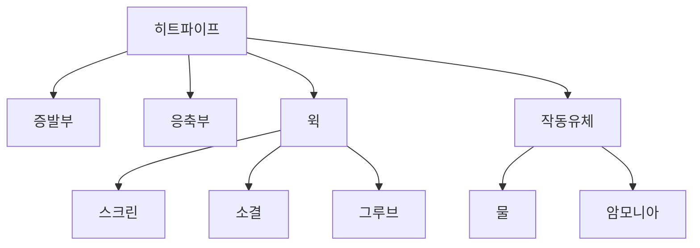

+++
title = "heatpipe"
date = "2026-03-14"
weight = 739
+++

# 히트파이프 (Heatpipe)

#### 핵심 인사이트 (3줄 요약)
> 1. **본질**: 밀폐된 파이프 내부에서 작동유체의 증발-응축 순환으로 열을 전달하는 1차원 열전달 소자
> 2. **가치**: 높은 등가 열전도도(>5,000 W/mK), 수동 작동(전력 불필요), 신뢰성, 저렴한 비용
> 3. **융합**: 베이퍼 체임버, 서멀 페이스트, 쿨러, 서버/데스크톱 쿨링과 통합된 열전달

---

### Ⅰ. 개요 (Context & Background)

**개념 정의**

히트파이프(Heatpipe)는 밀폐된 파이프 내부에서 작동유체의 증발-응축 순환으로 열을 전달하는 1차원 열전달 소자입니다. 전력 없이 수동으로 작동하며 매우 높은 열전달 성능을 제공합니다.

```
┌─────────────────────────────────────────────────────────────────────┐
│                    히트파이프 구조 및 원리                            │
├─────────────────────────────────────────────────────────────────────┤
│                                                                     │
│   ┌──────────────────────────────────────────────────────────────┐ │
│   │              히트파이프 구조 (단면도)                          │ │
│   │                                                              │ │
│   │   ┌───────────────────────────────────────────────────────┐ │ │
│   │   │                                                       │ │ │
│   │   │            증기 흐름 (중앙)                            │ │ │
│   │   │    ─────────────────────────────────────────►         │ │ │
│   │   │                                                       │ │ │
│   │   │   ┌─────────────────────────────────────────────┐     │ │ │
│   │   │   │                                             │     │ │ │
│   │   │   │    윅 (Wick) - 모세관 구조                   │     │ │ │
│   │   │   │    ◄────── 액체 복귀 ──────                 │     │ │ │
│   │   │   │                                             │     │ │ │
│   │   │   └─────────────────────────────────────────────┘     │ │ │
│   │   │                                                       │ │ │
│   │   │   ════════════════ 금속 벽 ════════════════          │ │ │
│   │   │                                                       │ │ │
│   │   └───────────────────────────────────────────────────────┘ │ │
│   │                                                              │ │
│   └──────────────────────────────────────────────────────────────┘ │
│                                                                     │
│   ┌──────────────────────────────────────────────────────────────┐ │
│   │              히트파이프 작동 원리                             │ │
│   │                                                              │ │
│   │   증발부 (Evaporator)         응축부 (Condenser)             │ │
│   │   ┌─────────┐                 ┌─────────┐                   │ │
│   │   │  CPU    │                 │  핀     │                   │ │
│   │   │  열원   │                 │  방열   │                   │ │
│   │   └────┬────┘                 └────┬────┘                   │ │
│   │        │                           │                        │ │
│   │        ▼                           ▼                        │ │
│   │   ┌─────────┐    증기 흐름    ┌─────────┐                   │ │
│   │   │  증발   │ ──────────────► │  응축   │                   │ │
│   │   │         │                 │         │                   │ │
│   │   └────┬────┘                 └────┬────┘                   │ │
│   │        │                           │                        │ │
│   │        │     액체 복귀 (윅)         │                        │ │
│   │        ◄──────────────────────────                        │ │
│   │                                                              │ │
│   │   → 2상 열전달 사이클로 연속 열전달                          │ │
│   │                                                              │ │
│   └──────────────────────────────────────────────────────────────┘ │
│                                                                     │
└─────────────────────────────────────────────────────────────────────┘
```

> **해설**: 히트파이프는 증발부에서 증기가 발생하고, 응축부에서 액체로 돌아와 윅을 통해 복귀합니다.

**💡 비유**: 히트파이프는 자동 온도 조절 라디에이터와 같습니다. 열이 많으면 자동으로 더 많이 식혀줍니다.

**등장 배경**

① **기존 한계**: 금속 전도 → 낮은 열전도도, 긴 거리 비효율
② **혁신적 패러다임**: 2상 열전달로 초고열전도 실현
③ **비즈니스 요구**: 우주선 전자기기 냉각, CPU/GPU 쿨링

**📢 섹션 요약 비유**: 히트파이프는 자동 라디에이터 같아요. 열이 많으면 자동으로 식혀요!

---

### Ⅱ. 아키텍처 및 핵심 원리 (Deep Dive)

**구성 요소 상세 분석**

| 요소명 | 역할 | 내부 동작 | 비유 |
|:---|:---|:---|:---|
| **파이프** | 밀폐 용기 | 구리/알루미늄 | 관 |
| **작동유체** | 열 매체 | 물/암모니아 | 혈액 |
| **윅** | 액체 복귀 | 스크린/소결/그루브 | 정맥 |
| **진공** | 낮은 비등점 | 내부 감압 | 고산지대 |
| **핀** | 방열 | 알루미늄 핀 | 라디에이터 |

**히트파이프 종류 및 특성**

```
┌─────────────────────────────────────────────────────────────────────┐
│                    히트파이프 종류 및 특성                            │
├─────────────────────────────────────────────────────────────────────┤
│                                                                     │
│   ┌──────────────────────────────────────────────────────────────┐ │
│   │              윅(Wick) 구조 종류                               │ │
│   │                                                              │ │
│   │   1. 스크린 메쉬 (Screen Mesh):                              │ │
│   │      - 금속망을 감은 구조                                     │ │
│   │      - 저렴, 일반적                                          │ │
│   │      - 모세관력 중간                                         │ │
│   │                                                              │ │
│   │   2. 소결 (Sintered):                                        │ │
│   │      - 금속 분말을 소결                                       │ │
│   │      - 높은 모세관력                                         │ │
│   │      - 중간 비용                                             │ │
│   │                                                              │ │
│   │   3. 그루브 (Grooved):                                       │ │
│   │      - 내벽에 홈을 판 구조                                    │ │
│   │      - 낮은 유동 저항                                        │ │
│   │      - 중력 의존적                                           │ │
│   │                                                              │ │
│   └──────────────────────────────────────────────────────────────┘ │
│                                                                     │
│   ┌──────────────────────────────────────────────────────────────┐ │
│   │              작동유체 선택                                    │ │
│   │                                                              │ │
│   │   ┌─────────────────────────────────────────────────────┐    │ │
│   │   │ 작동유체   │ 작동온도    │ 비등점   │ 용도           │    │ │
│   │   │ ─────────────────────────────────────────────────── │    │ │
│   │   │ 암모니아   │ -60~100°C  │ -33°C   │ 우주/극저온    │    │ │
│   │   │ 물        │ 30~200°C   │ 100°C   │ 일반/전자기기  │    │ │
│   │   │ 에탄올    │ -30~150°C  │ 78°C    │ 저온           │    │ │
│   │   │ 메탄올    │ -40~120°C  │ 65°C    │ 저온           │    │ │
│   │   │ 나트륨    │ 500~1200°C │ 883°C   │ 고온/원자력    │    │ │
│   │   └─────────────────────────────────────────────────────┘    │ │
│   │                                                              │ │
│   │   CPU 쿨러: 물이 가장 일반적                                 │ │
│   │                                                              │ │
│   └──────────────────────────────────────────────────────────────┘ │
│                                                                     │
└─────────────────────────────────────────────────────────────────────┘
```

> **해설**: CPU 쿨러는 주로 물을 작동유체로 사용합니다. 윅 구조는 소결이 성능이 좋습니다.

**핵심 알고리즘: 히트파이프 열전달 한계**

```c
// 히트파이프 열전달 한계 (의사코드)
struct HeatPipeLimits {
    float    capillary_limit;    // 모세관 한계 (W)
    float    sonic_limit;        // 음속 한계 (W)
    float    entrainment_limit;  // 동반 한계 (W)
    float    boiling_limit;      // 비등 한계 (W)
};

// 실제 열전달 한계
float GetHeatTransferLimit(struct HeatPipeLimits *hp) {
    // 가장 낮은 한계가 실제 한계
    return MIN(
        hp->capillary_limit,
        hp->sonic_limit,
        hp->entrainment_limit,
        hp->boiling_limit
    );
}

// 일반적 히트파이프 성능
// 직경 6mm: ~30W
// 직경 8mm: ~50W
// 직경 10mm: ~80W

// Linux에서 쿨러 온도 확인
// # sensors
// coretemp-isa-0000
// Package id 0:  +65.0°C  (히트파이프 쿨러)

// # cat /sys/class/hwmon/hwmon*/name
// coretemp
// it8620  (팬 속도 등)

// 팬 속도 확인
// # cat /sys/class/hwmon/hwmon*/fan1_input
// 1200  (RPM)
```

**📢 섹션 요약 비유**: 히트파이프는 여러 한계가 있습니다. 모세관력, 음속, 동반, 비등 한계 중 가장 낮은 것이 실제 한계입니다.

---

### Ⅲ. 융합 비교 및 다각도 분석 (Comparison & Synergy)

**기술 비교: 히트파이프 vs 베이퍼 체임버 vs 구리 베이스**

| 비교 항목 | 히트파이프 | 베이퍼 체임버 | 구리 베이스 |
|:---|:---:|:---:|:---:|
| **차원** | 1D | 2D | 3D (덩어리) |
| **열전도도** | 8,000 W/mK | 15,000 W/mK | 400 W/mK |
| **직경/두께** | 6-8mm | 1-3mm | 3-5mm |
| **비용** | 중간 | 높음 | 낮음 |
| **방향성** | 있음 | 없음 | 없음 |

**과목 융합 관점: 히트파이프와 타 영역 시너지**

| 융합 영역 | 시너지 효과 | 구현 예시 |
|:---|:---|:---|
| **데스크톱** | CPU 쿨러 | 타워 쿨러 |
| **서버** | 2U 랙 쿨링 | 서버 쿨러 |
| **GPU** | 그래픽카드 쿨링 | RTX 4090 |
| **노트북** | 하이브리드 | VC+HP |
| **우주** | 방열판 | 위성 |

**📢 섹션 요약 비유**: 히트파이프는 1D(선형) 열전달, 베이퍼 체임버는 2D(면적) 열전달입니다. 용도가 다릅니다.

---

### Ⅳ. 실무 적용 및 기술사적 파단 (Strategy & Decision)

**실무 시나리오별 적용**

**시나리오 1: 데스크톱**
- **문제**: CPU 쿨링
- **해결**: 6-8mm 히트파이프 × 4-6개
- **의사결정**: 타워 쿨러

**시나리오 2: 서버**
- **문제**: 랙 공간
- **해결**: 저형상 히트파이프
- **의사결정**: 2U 쿨러

**시나리오 3: 노트북**
- **문제**: 박형
- **해결**: 히트파이프 + VC 하이브리드
- **의사결정**: 하이브리드

**도입 체크리스트**

| 구분 | 항목 | 확인 포인트 |
|:---|:---|:---|
| **기술적** | 직경 | 6-8mm |
| | 개수 | TDP 대응 |
| | 방향 | 수평/수직 |
| **운영적** | 모니터링 | sensors |
| | 온도 | 목표 온도 |
| | 팬 | RPM 조절 |

**안티패턴: 히트파이프 오용 사례**

| 안티패턴 | 문제점 | 올바른 접근 |
|:---|:---|:---|
| **과신** | 한계 존재 | 열용량 확인 |
| **구부림** | 성능 저하 | 최소 굽힘 |
| **수직 설치** | 중력 영향 | 윅 타입 선택 |
| **저가품** | 성능 미달 | 정품 사용 |

**📢 섹션 요약 비유**: 히트파이프는 구부리면 성능이 떨어집니다. 직선이 가장 좋습니다.

---

### Ⅴ. 기대효과 및 결론 (Future & Standard)

**정량/정성 기대효과**

| 구분 | 구리 베이스 | 히트파이프 | 개선효과 |
|:---|:---:|:---:|:---:|
| **온도** | 85°C | 70°C | -15°C |
| **소음** | 높음 | 낮음 | 팬 RPM 감소 |
| **수명** | 무제한 | 5-10년 | 양호 |
| **비용** | $10 | $30 | +200% |

**미래 전망**

1. **초고성능:** 10,000+ W/mK
2. **유연형:** 구부림 가능
3. **하이브리드:** VC+HP 통합
4. **냉각수 통합:** AIO 수냉 연동

**참고 표준**

| 표준 | 내용 | 적용 |
|:---|:---|:---|
| **ASHRAE** | 열전달 | 이론 |
| **JEDEC** | 쿨링 표준 | 산업 |
| **Furukawa** | 히트파이프 제조 | 납품 |
| **Aavid** | 쿨러 설계 | OEM |

**📢 섹션 요약 비유**: 히트파이프의 미래는 더 유연하고 더 강력해집니다. 구부려도 성능이 유지됩니다.

---

### 📌 관련 개념 맵 (Knowledge Graph)



**연관 개념 링크**:
- 베이퍼 체임버 - 2D 열전달
- 서멀 페이스트 - TIM
- 서버 섀시 팬 핫스왑 - 쿨링
- 히트스프레더 - IHS

---

### 👶 어린이를 위한 3줄 비유 설명

1. **열 파이프**: 히트파이프는 열 전용 파이프예요. 열을 한쪽에서 다른 쪽으로 보내요!

2. **증기 열차**: 증기가 열을 싣고 가요. 물이 증기가 됐다가 다시 물이 돼요!

3. **구리보다 20배**: 구리보다 20배 열을 잘 전해요. 놀라워요!