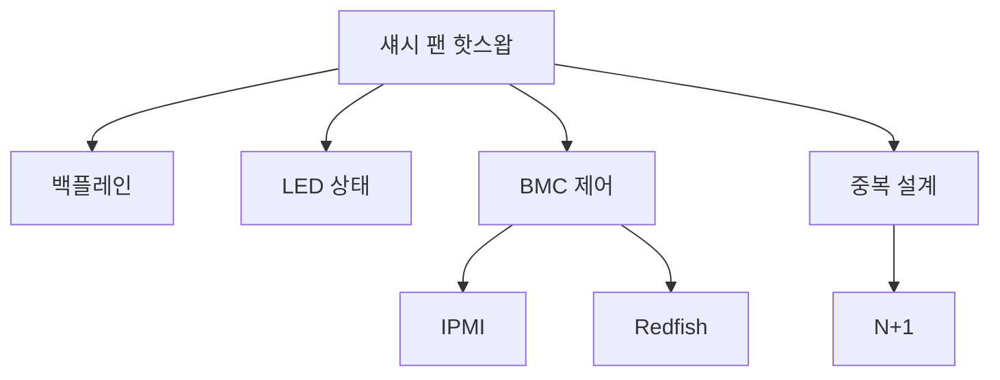

+++
title = "chassis fan hotswap"
date = "2026-03-14"
weight = 740
+++

# 서버 섀시 팬 핫스왑 (Chassis Fan Hot-Swap)

#### 핵심 인사이트 (3줄 요약)
> 1. **본질**: 서버 가동 중지 없이 섀시 팬을 교체할 수 있는 기술로, 프론트 패널/백플레인 핫스왑 베이와 LED 상태 표시 지원
> 2. **가치**: 서버 가용성 극대화, 팬 고장 시 즉시 교체, 다운타임 제로, 유지보수 편의성
> 3. **융합**: BMC, IPMI, Redfish, Fan RPM 모니터링, 중복 팬 설계와 통합된 장애 관리

---

### Ⅰ. 개요 (Context & Background)

**개념 정의**

서버 섀시 팬 핫스왑(Chassis Fan Hot-Swap)은 서버 가동 중지 없이 섀시 팬을 교체할 수 있는 기술입니다. 프론트 패널이나 백플레인의 핫스왑 베이를 통해 팬을 즉시 교체할 수 있습니다.

```
┌─────────────────────────────────────────────────────────────────────┐
│                    섀시 팬 핫스왑 구조                               │
├─────────────────────────────────────────────────────────────────────┤
│                                                                     │
│   ┌──────────────────────────────────────────────────────────────┐ │
│   │              서버 섀시 팬 핫스왑 구성                          │ │
│   │                                                              │ │
│   │   ┌─────────────────────────────────────────────────────┐    │ │
│   │   │                  서버 섀시                           │    │ │
│   │   │                                                     │    │ │
│   │   │   ┌─────┐ ┌─────┐ ┌─────┐ ┌─────┐ ┌─────┐          │    │ │
│   │   │   │ FAN │ │ FAN │ │ FAN │ │ FAN │ │ FAN │  팬 트레이 │    │ │
│   │   │   │  1  │ │  2  │ │  3  │ │  4  │ │  5  │          │    │ │
│   │   │   │ ●   │ │ ●   │ │ ●   │ │ ○   │ │ ●   │          │    │ │
│   │   │   │ Green│ │Green│ │Green│ │ Amber│ │Green│          │    │ │
│   │   │   └─────┘ └─────┘ └─────┘ └──┬──┘ └─────┘          │    │ │
│   │   │                               │                    │    │ │
│   │   │                          ▼ 핫스왑                   │    │ │
│   │   │         ┌──────────────────────────────────┐       │    │ │
│   │   │         │      백플레인 (Backplane)         │       │    │ │
│   │   │         │   ┌──┬──┬──┬──┬──┬──┬──┬──┐     │       │    │ │
│   │   │         │   │01│02│03│04│05│06│07│08│     │       │    │ │
│   │   │         │   └──┴──┴──┴──┴──┴──┴──┴──┘     │       │    │ │
│   │   │         │        커넥터 + 센서              │       │    │ │
│   │   │         └──────────────────────────────────┘       │    │ │
│   │   │                               │                    │    │ │
│   │   │                               ▼                    │    │ │
│   │   │         ┌──────────────────────────────────┐       │    │ │
│   │   │         │           BMC (Fan Controller)   │       │    │ │
│   │   │         │   ┌─────────────────────────┐    │       │    │ │
│   │   │         │   │ - RPM 모니터링           │    │       │    │ │
│   │   │         │   │ - 고장 감지              │    │       │    │ │
│   │   │         │   │ - LED 제어               │    │       │    │ │
│   │   │         │   │ - 속도 제어              │    │       │    │ │
│   │   │         │   └─────────────────────────┘    │       │    │ │
│   │   │         └──────────────────────────────────┘       │    │ │
│   │   │                                                     │    │ │
│   │   └─────────────────────────────────────────────────────┘    │ │
│   │                                                              │ │
│   └──────────────────────────────────────────────────────────────┘ │
│                                                                     │
└─────────────────────────────────────────────────────────────────────┘
```

> **해설**: 핫스왑 팬은 백플레인에 연결되어 있어 서버 가동 중 교체 가능합니다. LED로 상태를 표시합니다.

**💡 비유**: 섀시 팬 핫스왑은 달리는 자동차의 타이어 교체와 같습니다. 멈추지 않고 교체합니다.

**등장 배경**

① **기존 한계**: 팬 고장 → 서버 다운 → 교체 → 재부팅
② **혁신적 패러다임**: 핫스왑으로 서버 중단 없이 교체
③ **비즈니스 요구**: 99.999% 가용성, 다운타임 제로

**📢 섹션 요약 비유**: 핫스왑 팬은 달리는 차 타이어 교체 같아요. 멈추지 않고 바꿔요!

---

### Ⅱ. 아키텍처 및 핵심 원리 (Deep Dive)

**구성 요소 상세 분석**

| 요소명 | 역할 | 내부 동작 | 비유 |
|:---|:---|:---|:---|
| **핫스왑 베이** | 팬 슬롯 | 커넥터+가이드 | 타이어 교체 |
| **백플레인** | 전기 연결 | 커넥터+센서 | 허브 |
| **LED** | 상태 표시 | 녹색/황색/적색 | 신호등 |
| **BMC** | 팬 제어 | IPMI/Redfish | ECU |
| **중복 팬** | 고장 허용 | N+1 이중화 | 예비 타이어 |

**핫스왑 팬 LED 상태 표시**

```
┌─────────────────────────────────────────────────────────────────────┐
│                    핫스왑 팬 LED 상태                                │
├─────────────────────────────────────────────────────────────────────┤
│                                                                     │
│   ┌──────────────────────────────────────────────────────────────┐ │
│   │              LED 상태 코드                                    │ │
│   │                                                              │ │
│   │   ┌─────────────────────────────────────────────────────┐    │ │
│   │   │ LED 색상    │ 상태           │ 의미                │    │ │
│   │   │ ─────────────────────────────────────────────────── │    │ │
│   │   │ 녹색 (Green)│ 정상 회전      │ RPM 정상, 온도 정상  │    │ │
│   │   │ 녹색 점멸   │ 식별 중        │ BMC 식별 모드        │    │ │
│   │   │ 황색 (Amber)│ 경고           │ RPM 저하, 온도 상승  │    │ │
│   │   │ 적색 (Red)  │ 고장           │ 정지, RPM = 0        │    │ │
│   │   │ 소등 (Off)  │ 슬롯 비어있음  │ 팬 미장착           │    │ │
│   │   └─────────────────────────────────────────────────────┘    │ │
│   │                                                              │ │
│   └──────────────────────────────────────────────────────────────┘ │
│                                                                     │
│   ┌──────────────────────────────────────────────────────────────┐ │
│   │              핫스왑 절차                                       │ │
│   │                                                              │ │
│   │   1. 고장 감지                                                │ │
│   │      - BMC가 RPM 이상 감지                                    │ │
│   │      - LED 황색/적색 점등                                     │ │
│   │      - IPMI/SNMP 알림 발송                                    │ │
│   │                                                              │ │
│   │   2. 팬 식별                                                  │ │
│   │      - BMC에서 식별 LED 점멸                                  │ │
│   │      - 물리적 위치 확인                                       │ │
│   │                                                              │ │
│   │   3. 핫스왑 교체                                              │ │
│   │      - 랫치 해제 → 팬 제거                                    │ │
│   │      - 새 팬 삽입 → 랫치 고정                                 │ │
│   │      - BMC가 자동 인식                                        │ │
│   │                                                              │ │
│   │   4. 복구 확인                                                │ │
│   │      - LED 녹색 점등                                          │ │
│   │      - RPM 정상 확인                                          │ │
│   │      - 알림 해제                                               │ │
│   │                                                              │ │
│   │   전체 과정: ~30초, 서버 무중단                               │ │
│   │                                                              │ │
│   └──────────────────────────────────────────────────────────────┘ │
│                                                                     │
└─────────────────────────────────────────────────────────────────────┘
```

> **해설**: BMC가 팬 상태를 모니터링하고 LED로 표시합니다. 핫스왑 교체는 30초 내에 완료됩니다.

**핵심 알고리즘: 핫스왑 팬 관리**

```c
// 핫스왑 팬 관리 (의사코드)
struct HotSwapFan {
    uint8_t  slot_id;
    uint16_t rpm_current;
    uint16_t rpm_target;
    uint8_t  led_state;       // 0=Off, 1=Green, 2=Amber, 3=Red
    bool     present;
    bool     fault;
};

// 팬 상태 확인
void CheckFanStatus(struct HotSwapFan *fan) {
    if (!fan->present) {
        // 팬 미장착
        fan->led_state = LED_OFF;
        fan->fault = false;
        return;
    }

    // RPM 확인
    fan->rpm_current = ReadFanRPM(fan->slot_id);

    if (fan->rpm_current == 0) {
        // 팬 정지
        fan->led_state = LED_RED;
        fan->fault = true;
        SendAlert(FAN_FAILURE, fan->slot_id);
    } else if (fan->rpm_current < fan->rpm_target * 0.8) {
        // RPM 저하
        fan->led_state = LED_AMBER;
        fan->fault = false;
        SendAlert(FAN_WARNING, fan->slot_id);
    } else {
        // 정상
        fan->led_state = LED_GREEN;
        fan->fault = false;
    }

    // LED 설정
    SetFanLED(fan->slot_id, fan->led_state);
}

// IPMI로 팬 상태 확인
// # ipmitool sensor list | grep -i fan
// Fan1 RPM        | 3200.000   | RPM        | ok    | 400.000  | 300.000  | 200.000  | 200.000  | 300.000
// Fan2 RPM        | 0.000      | RPM        | nr    | na       | na       | na       | na       | na

// Redfish API로 팬 상태
// GET /redfish/v1/Chassis/1/Thermal
// {
//   "Fans": [
//     {
//       "MemberId": "0",
//       "Name": "Fan 1",
//       "Status": { "Health": "OK", "State": "Enabled" },
//       "Reading": 3200,
//       "ReadingUnits": "RPM"
//     }
//   ]
// }

// 팬 LED 식별
// # ipmitool raw 0x30 0x45 0x01 0x01  // Fan 1 Identify On
```

**📢 섹션 요약 비유**: BMC는 팬의 의사입니다. 건강 상태를 모니터링하고 이상 시 알림을 보냅니다.

---

### Ⅲ. 융합 비교 및 다각도 분석 (Comparison & Synergy)

**기술 비교: 핫스왑 vs 비핫스왑 팬**

| 비교 항목 | 핫스왑 팬 | 비핫스왑 팬 |
|:---|:---:|:---:|
| **교체** | 온라인 | 오프라인 |
| **다운타임** | 0 | 수 분~시간 |
| **비용** | 높음 | 낮음 |
| **복잡도** | 높음 | 낮음 |
| **가용성** | 높음 | 낮음 |

**과목 융합 관점: 핫스왑 팬과 타 영역 시너지**

| 융합 영역 | 시너지 효과 | 구현 예시 |
|:---|:---|:---|
| **BMC** | 팬 관리 | IPMI/Redfish |
| **IPMI** | 원격 모니터링 | SNMP 트랩 |
| **Redfish** | REST API | 웹 UI |
| **중복성** | N+1 설계 | 고장 허용 |
| **서버** | 랙 서버 | 1U/2U |

**📢 섹션 요약 비유**: 핫스왑 팬은 비핫스왑보다 비싸지만 가용성이 훨씬 높습니다. 데이터센터 필수입니다.

---

### Ⅳ. 실무 적용 및 기술사적 판단 (Strategy & Decision)

**실무 시나리오별 적용**

**시나리오 1: 데이터센터**
- **문제**: 24/7 가동
- **해결**: 핫스왑 팬 + N+1
- **의사결정**: 핫스왑 필수

**시나리오 2: SMB 서버**
- **문제**: 비용 제약
- **해결**: 비핫스왑 + 예비
- **의사결정**: 비용 우선

**시나리오 3: 고성능 컴퓨팅**
- **문제**: 고발열
- **해결**: 고용량 핫스왑
- **의사결정**: 성능 우선

**도입 체크리스트**

| 구분 | 항목 | 확인 포인트 |
|:---|:---|:---|
| **기술적** | BMC | IPMI 지원 |
| | LED | 상태 표시 |
| | 중복성 | N+1 설계 |
| **운영적** | 모니터링 | IPMI/Redfish |
| | 예비 팬 | 상비 |
| | 교체 절차 | SOP |

**안티패턴: 핫스왑 팬 오용 사례**

| 안티패턴 | 문제점 | 올바른 접근 |
|:---|:---|:---|
| **예비 없음** | 즉시 교체 불가 | 상비 필수 |
| **모니터링 무시** | 고장 미감지 | IPMI 알림 |
| **잘못된 팬** | 호환性问题 | OEM 팬 |
| **무리한 교체** | 정전 위험 | 절차 준수 |

**📢 섹션 요약 비유**: 핫스왑 팬은 예비 타이어와 같습니다. 미리 준비해야 합니다.

---

### Ⅴ. 기대효과 및 결론 (Future & Standard)

**정량/정성 기대효과**

| 구분 | 비핫스왑 | 핫스왑 | 개선효과 |
|:---|:---:|:---:|:---:|
| **다운타임** | 30분+ | 0 | -100% |
| **가용성** | 99.9% | 99.999% | +0.1% |
| **유지보수** | 복잡 | 간단 | 편의성 |
| **비용** | $50 | $150 | +200% |

**미래 전망**

1. **AI 예지:** 팬 고장 예측
2. **자동 교체:** 로봇 팔 교체
3. **무선 팬:** 배터리 구동
4. **액체 냉각:** 팬 감소

**참고 표준**

| 표준 | 내용 | 적용 |
|:---|:---|:---|
| **IPMI 2.0** | 팬 관리 | BMC |
| **Redfish** | REST API | DMTF |
| **SNMP** | 모니터링 | IETF |
| **OEM** | 섀시 사양 | Dell/HP |

**📢 섹션 요약 비유**: 핫스왑 팬의 미래는 자율주행 자동차와 같습니다. AI가 스스로 고장을 예측합니다.

---

### 📌 관련 개념 맵 (Knowledge Graph)



**연관 개념 링크**:
- BMC - 베이스보드 관리 컨트롤러
- IPMI - 지능형 플랫폼 관리 인터페이스
- Redfish - RESTful 관리 API
- 하드웨어 건전성 모니터링 - 상태 모니터링

---

### 👶 어린이를 위한 3줄 비유 설명

1. **달리며 교체**: 핫스왑 팬은 달리는 차 타이어 교체 같아요. 멈추지 않고 바꿔요!

2. **불빛 신호**: 녹색은 좋아요, 빨간색은 나빠요. 불빛으로 알아봐요!

3. **예비 타이어**: 예비 팬을 가지고 있어요. 고장 나면 바로 바꿔요!