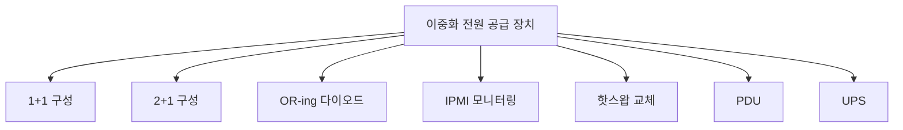

+++
title = "redundant power supply"
date = "2026-03-14"
weight = 741
+++

# 이중화 전원 공급 장치 (Redundant Power Supply)

#### 핵심 인사이트 (3줄 요약)
> 1. **본질**: 두 개 이상의 전원 공급 장치(PSU)를 병렬로 연결하여 하나가 고장 나도 나머지로 전원을 공급하는 고가용성 설계
> 2. **가치**: 서버 무중단 운영, PSU 고장 허용, 핫스왑 교체, 99.999% 가용성
> 3. **융합**: BMC, IPMI, PDU, UPS, 전원 관리 소프트웨어와 통합된 전원 인프라

---

### Ⅰ. 개요 (Context & Background)

**개념 정의**

이중화 전원 공급 장치(Redundant Power Supply)는 두 개 이상의 전원 공급 장치(PSU)를 병렬로 연결하여 하나가 고장 나도 나머지 PSU로 전원을 계속 공급하는 고가용성 설계입니다.

```
┌─────────────────────────────────────────────────────────────────────┐
│                    이중화 전원 공급 장치 구조                         │
├─────────────────────────────────────────────────────────────────────┤
│                                                                     │
│   ┌──────────────────────────────────────────────────────────────┐ │
│   │              1+1 이중화 PSU 구성                              │ │
│   │                                                              │ │
│   │   AC 입력 A        AC 입력 B                                 │ │
│   │       │               │                                      │ │
│   │       ▼               ▼                                      │ │
│   │   ┌───────┐       ┌───────┐                                 │ │
│   │   │ PSU 1 │       │ PSU 2 │                                 │ │
│   │   │       │       │       │                                 │ │
│   │   │ 800W  │       │ 800W  │                                 │ │
│   │   │       │       │       │                                 │ │
│   │   │  OK ● │       │  OK ● │  LED 상태                       │ │
│   │   └───┬───┘       └───┬───┘                                 │ │
│   │       │               │                                      │ │
│   │       │   전원 버스    │                                      │ │
│   │       └───────┬───────┘                                      │ │
│   │               │                                              │ │
│   │               ▼                                              │ │
│   │       ┌───────────────┐                                      │ │
│   │       │   서버/장비    │                                      │ │
│   │       │   (Load)      │                                      │ │
│   │       │   600W 부하   │                                      │ │
│   │       └───────────────┘                                      │ │
│   │                                                              │ │
│   │   정상: PSU 1 + PSU 2가 부하 분담 (각 300W)                  │ │
│   │   고장: PSU 1 고장 → PSU 2가 전체 부하 (600W)                │ │
│   │                                                              │ │
│   └──────────────────────────────────────────────────────────────┘ │
│                                                                     │
│   ┌──────────────────────────────────────────────────────────────┐ │
│   │              이중화 구성 방식                                  │ │
│   │                                                              │ │
│   │   1+1 (N+1): PSU 2개, 1개 고장 허용                          │ │
│   │   2+1 (N+1): PSU 3개, 1개 고장 허용                          │ │
│   │   2+2 (N+N): PSU 4개, 2개 고장 허용                          │ │
│   │   3+1: PSU 4개, 1개 고장 허용 (대용량)                        │ │
│   │                                                              │ │
│   │   예시:                                                      │ │
│   │   - 부하 1200W, PSU 800W × 2 = 1+1 (800W 여유)              │ │
│   │   - 부하 2000W, PSU 800W × 3 = 2+1 (800W 여유)              │ │
│   │                                                              │ │
│   └──────────────────────────────────────────────────────────────┘ │
│                                                                     │
└─────────────────────────────────────────────────────────────────────┘
```

> **해설**: 이중화 PSU는 여러 PSU가 부하를 분담하다가 하나가 고장 나면 나머지가 전체 부하를 담당합니다.

**💡 비유**: 이중화 전원 공급 장치는 예비 엔진이 있는 비행기와 같습니다. 한 엔진이 고장 나도 나머지로 비행합니다.

**등장 배경**

① **기존 한계**: 단일 PSU 고장 → 서버 다운
② **혁신적 패러다임**: 이중화로 PSU 고장 허용
③ **비즈니스 요구**: 99.999% 가용성, 데이터센터 필수

**📢 섹션 요약 비유**: 이중화 PSU는 예비 엔진 같아요. 하나 고장 나도 나머지로 가요!

---

### Ⅱ. 아키텍처 및 핵심 원리 (Deep Dive)

**구성 요소 상세 분석**

| 요소명 | 역할 | 내부 동작 | 비유 |
|:---|:---|:---|:---|
| **PSU** | 전원 공급 | AC→DC 변환 | 엔진 |
| **전원 버스** | 전원 병합 | OR-ing 다이오드 | 드라이브샤프트 |
| **PDU** | 전원 분배 | 랙 전원 분배 | 연료 펌프 |
| **UPS** | 무정전 전원 | 배터리 백업 | 예비 연료탱크 |
| **BMC** | 상태 모니터링 | IPMI/Redfish | 계기판 |

**이중화 PSU 작동 메커니즘**

```
┌─────────────────────────────────────────────────────────────────────┐
│                    이중화 PSU 작동 메커니즘                          │
├─────────────────────────────────────────────────────────────────────┤
│                                                                     │
│   ┌──────────────────────────────────────────────────────────────┐ │
│   │              OR-ing 다이오드 동작                             │ │
│   │                                                              │ │
│   │   PSU 1 출력 ─────┬─────┬─────► 부하                        │ │
│   │                   │     │                                    │ │
│   │              ┌────┴─────┴────┐                               │ │
│   │              │  OR-ing Diode │                               │ │
│   │              │  (쇼트키)      │                               │ │
│   │              └────┬─────┬────┘                               │ │
│   │                   │     │                                    │ │
│   │   PSU 2 출력 ─────┘     │                                    │ │
│   │                          │                                    │ │
│   │   ───────────────────────────────────────────────────────   │ │
│   │                                                          │   │
│   │   작동 원리:                                              │   │
│   │   - 높은 전압 PSU가 우선 공급                             │   │
│   │   - PSU 1 고장 시 PSU 2가 자동 인수                       │   │
│   │   - 전환 시간: < 1ms (무순단)                              │   │
│   │   - 역전류 방지 (다이오드)                                 │   │
│   │                                                          │   │
│   └──────────────────────────────────────────────────────────────┘ │
│                                                                     │
│   ┌──────────────────────────────────────────────────────────────┐ │
│   │              부하 분담 (Load Sharing)                         │ │
│   │                                                              │ │
│   │   정상 상태:                                                  │ │
│   │   ┌─────────────────────────────────────────────────────┐    │ │
│   │   │ 부하: 600W                                           │    │ │
│   │   │ PSU 1: 300W (50%)  ──┐                              │    │ │
│   │   │                      ├──► 총 600W                   │    │ │
│   │   │ PSU 2: 300W (50%)  ──┘                              │    │ │
│   │   └─────────────────────────────────────────────────────┘    │ │
│   │                                                              │ │
│   │   PSU 1 고장 시:                                              │ │
│   │   ┌─────────────────────────────────────────────────────┐    │ │
│   │   │ 부하: 600W                                           │    │ │
│   │   │ PSU 1: 0W (고장)   ──┐                              │    │ │
│   │   │                      ├──► 총 600W (PSU 2만)         │    │ │
│   │   │ PSU 2: 600W (100%) ──┘                              │    │ │
│   │   └─────────────────────────────────────────────────────┘    │ │
│   │                                                              │ │
│   │   핫스왑 교체 후:                                             │ │
│   │   ┌─────────────────────────────────────────────────────┐    │ │
│   │   │ 부하: 600W                                           │    │ │
│   │   │ PSU 1: 300W (50%)  ──┐                              │    │ │
│   │   │                      ├──► 총 600W (복구)            │    │ │
│   │   │ PSU 2: 300W (50%)  ──┘                              │    │ │
│   │   └─────────────────────────────────────────────────────┘    │ │
│   │                                                              │ │
│   └──────────────────────────────────────────────────────────────┘ │
│                                                                     │
└─────────────────────────────────────────────────────────────────────┘
```

> **해설**: OR-ing 다이오드가 높은 전압 PSU를 자동 선택하고, 부하 분담으로 효율을 높입니다.

**핵심 알고리즘: 이중화 PSU 관리**

```c
// 이중화 PSU 관리 (의사코드)
struct RedundantPSU {
    uint8_t  psu_count;
    uint16_t total_load;       // W
    uint16_t psu_capacity[4];  // 각 PSU 용량
    uint16_t psu_load[4];      // 각 PSU 부하
    bool     psu_status[4];    // 각 PSU 상태
};

// 부하 분담 계산
void CalculateLoadSharing(struct RedundantPSU *rp) {
    uint8_t active_psus = 0;
    uint16_t active_capacity = 0;

    // 활성 PSU 카운트
    for (int i = 0; i < rp->psu_count; i++) {
        if (rp->psu_status[i]) {
            active_psus++;
            active_capacity += rp->psu_capacity[i];
        }
    }

    // 부하 분담 (비례 분배)
    for (int i = 0; i < rp->psu_count; i++) {
        if (rp->psu_status[i]) {
            rp->psu_load[i] = (rp->total_load * rp->psu_capacity[i]) / active_capacity;
        } else {
            rp->psu_load[i] = 0;
        }
    }

    // 여유 용량 확인 (이중화)
    if (active_capacity < rp->total_load * 1.5) {
        SendAlert(PSU_REDUNDANCY_LOST);
    }
}

// IPMI로 PSU 상태 확인
// # ipmitool sensor list | grep -i psu
// PSU1 Status     | 0x0        | discrete   | 0x0200| ok    | State Disabled = Enabled
// PSU2 Status     | 0x1        | discrete   | 0x0200| nc    | State Disabled = Enabled

// # ipmitool sdr type 'Power Supply'
// PSU1            | 40h | ok  | 10.1 | 180 Watts
// PSU2            | 41h | ok  | 10.2 | 175 Watts

// Redfish API
// GET /redfish/v1/Chassis/1/Power
// {
//   "PowerSupplies": [
//     {
//       "MemberId": "0",
//       "Status": { "Health": "OK", "State": "Enabled" },
//       "PowerCapacityWatts": 800,
//       "LastPowerOutputWatts": 300
//     }
//   ],
//   "PowerControl": [{
//     "PowerConsumedWatts": 600
//   }]
// }
```

**📢 섹션 요약 비유**: 이중화 PSU는 여러 엔진이 분담하다가 하나가 고장 나면 나머지가 인수합니다.

---

### Ⅲ. 융합 비교 및 다각도 분석 (Comparison & Synergy)

**기술 비교: 1+1 vs 2+1 vs 2+2 이중화**

| 비교 항목 | 1+1 (N+1) | 2+1 (N+1) | 2+2 (N+N) |
|:---|:---:|:---:|:---:|
| **PSU 수** | 2개 | 3개 | 4개 |
| **고장 허용** | 1개 | 1개 | 2개 |
| **용량 활용** | 50% | 67% | 50% |
| **비용** | 낮음 | 중간 | 높음 |
| **가용성** | 높음 | 높음 | 매우 높음 |

**과목 융합 관점: 이중화 PSU와 타 영역 시너지**

| 융합 영역 | 시너지 효과 | 구현 예시 |
|:---|:---|:---|
| **BMC** | PSU 모니터링 | IPMI/Redfish |
| **UPS** | 무정전 전원 | 이중화+UPS |
| **PDU** | 전원 분배 | 랙 PDU |
| **발전기** | 정전 대비 | 백업 전원 |
| **전원 관리** | 효율 최적화 | 전원 정책 |

**📢 섹션 요약 비유**: 1+1은 기본, 2+2는 더 안전합니다. 비용과 가용성의 균형입니다.

---

### Ⅳ. 실무 적용 및 기술사적 판단 (Strategy & Decision)

**실무 시나리오별 적용**

**시나리오 1: 엔터프라이즈 서버**
- **문제**: 무중단
- **해결**: 1+1 이중화 PSU
- **의사결정**: 800W × 2

**시나리오 2: 블레이드 섀시**
- **문제**: 고밀도
- **해결**: 4+1 이중화
- **의사결정**: 2500W × 5

**시나리오 3: SMB**
- **문제**: 비용
- **해결**: 비이중화 + UPS
- **의사결정**: 비용 우선

**도입 체크리스트**

| 구분 | 항목 | 확인 포인트 |
|:---|:---|:---|
| **기술적** | 용량 | 부하 + 여유 |
| | 이중화 | N+1 이상 |
| | PDU | 별도 회로 |
| **운영적** | 모니터링 | IPMI/Redfish |
| | 예비 PSU | 상비 |
| | 교체 절차 | 핫스왑 |

**안티패턴: 이중화 PSU 오용 사례**

| 안티패턴 | 문제점 | 올바른 접근 |
|:---|:---|:---|
| **용량 부족** | 이중화 상실 | 여유 확보 |
| **동일 회로** | 정전 시 둘 다 | 별도 회로 |
| **예비 없음** | 즉시 교체 불가 | 상비 필수 |
| **모니터링 무시** | 고장 미감지 | IPMI 알림 |

**📢 섹션 요약 비유**: 이중화 PSU는 두 전원을 별도 회로에 연결해야 합니다. 한 회로 고장에도 버텨야 합니다.

---

### Ⅴ. 기대효과 및 결론 (Future & Standard)

**정량/정성 기대효과**

| 구분 | 단일 PSU | 이중화 PSU | 개선효과 |
|:---|:---:|:---:|:---:|
| **가용성** | 99.9% | 99.999% | +0.1% |
| **MTTR** | 4시간 | 0 (핫스왑) | 즉시 |
| **다운타임** | 8.76시간/년 | 5분/년 | -99% |
| **비용** | $200 | $500 | +150% |

**미래 전망**

1. **디지털 PSU:** 소프트웨어 정의 전원
2. **AI 예지:** PSU 고장 예측
3. **고효율:** 80+ Titanium
4. **DC 전원:** 데이터센터 DC 배전

**참고 표준**

| 표준 | 내용 | 적용 |
|:---|:---|:---|
| **80 PLUS** | 효율 등급 | Platinum/Titanium |
| **IPMI 2.0** | PSU 모니터링 | BMC |
| **Redfish** | REST API | DMTF |
| **UL/CE** | 안전 인증 | 규정 |

**📢 섹션 요약 비유**: 이중화 PSU의 미래는 AI가 고장을 예측합니다. 미리 교체 알림을 보냅니다.

---

### 📌 관련 개념 맵 (Knowledge Graph)



**연관 개념 링크**:
- 전압 조정기 모듈 VRM - 전압 변환
- BMC - 관리 컨트롤러
- IPMI - 관리 인터페이스
- 과전압 보호 OVP - 보호 회로

---

### 👶 어린이를 위한 3줄 비유 설명

1. **예비 엔진**: 이중화 PSU는 예비 엔진 같아요. 하나 고장 나도 나머지가 가요!

2. **두 개 연결**: 전원을 두 개 연결해요. 하나가 고장 나도 계속 켜져요!

3. **바로 교체**: 고장 나면 바로 바꿔요. 끄지 않고 교체해요!