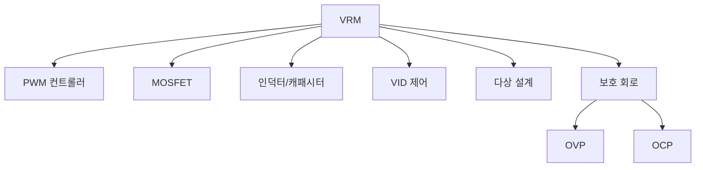

+++
title = "vrm"
date = "2026-03-14"
weight = 742
+++

# 전압 조정기 모듈 (VRM, Voltage Regulator Module)

#### 핵심 인사이트 (3줄 요약)
> 1. **본질**: 메인보드/CPU에 전압을 정밀하게 변환/조절하는 DC-DC 컨버터 모듈로, 12V 입력을 CPU/GPU 코어 전압(0.8-1.5V)으로 변환
> 2. **가치**: 안정적 전압 공급, 빠른 과도 응답, 오버클러킹 지원, 전력 효율
> 3. **융합**: 다상 PWM, LLC, OVP/OCP, 전압 모니터링, P-State 제어와 통합된 전원 관리

---

### Ⅰ. 개요 (Context & Background)

**개념 정의**

전압 조정기 모듈(VRM, Voltage Regulator Module)은 메인보드/CPU에 전압을 정밀하게 변환/조절하는 DC-DC 컨버터입니다. 12V 입력을 CPU/GPU 코어 전압(0.8-1.5V)으로 변환합니다.

```
┌─────────────────────────────────────────────────────────────────────┐
│                    VRM 기본 구조                                     │
├─────────────────────────────────────────────────────────────────────┤
│                                                                     │
│   ┌──────────────────────────────────────────────────────────────┐ │
│   │              VRM 블록 다이어그램                              │ │
│   │                                                              │ │
│   │   12V 입력                                                    │ │
│   │      │                                                       │ │
│   │      ▼                                                       │ │
│   │   ┌───────────────────────────────────────────────────────┐ │ │
│   │   │                    VRM                                 │ │ │
│   │   │                                                       │ │ │
│   │   │   ┌─────────┐   ┌─────────┐   ┌─────────┐            │ │ │
│   │   │   │   PWM   │   │  MOSFET │   │   L-C   │            │ │ │
│   │   │   │ 컨트롤러│──►│  드라이버│──►│  필터   │            │ │ │
│   │   │   │         │   │         │   │         │            │ │ │
│   │   │   └────┬────┘   └────┬────┘   └────┬────┘            │ │ │
│   │   │        │             │             │                  │ │ │
│   │   │        │   ┌─────────┴─────────┐   │                  │ │ │
│   │   │        │   │   피드백 루프      │   │                  │ │ │
│   │   │        └───│   (전압 센서)      │───┘                  │ │ │
│   │   │            └───────────────────┘                      │ │ │
│   │   │                                                       │ │ │
│   │   └───────────────────────────────────────────────────────┘ │ │
│   │      │                                                       │ │
│   │      ▼                                                       │ │
│   │   Vcore 출력 (0.8-1.5V)                                      │ │
│   │      │                                                       │ │
│   │      ▼                                                       │ │
│   │   ┌─────────┐                                                │ │
│   │   │   CPU   │                                                │ │
│   │   │  Core   │                                                │ │
│   │   └─────────┘                                                │ │
│   │                                                              │ │
│   └──────────────────────────────────────────────────────────────┘ │
│                                                                     │
│   ┌──────────────────────────────────────────────────────────────┐ │
│   │              VRM 주요 기능                                    │ │
│   │                                                              │ │
│   │   1. 전압 변환: 12V → Vcore (0.8-1.5V)                      │ │
│   │   2. 전압 안정화: 리픴/노이즈 제거                           │ │
│   │   3. 과도 응답: 부하 급변 시 빠른 전압 유지                  │ │
│   │   4. VID 제어: CPU 요청 전압 설정                            │ │
│   │   5. 보호 기능: OVP, OCP, OTP                                │ │
│   │                                                              │ │
│   └──────────────────────────────────────────────────────────────┘ │
│                                                                     │
└─────────────────────────────────────────────────────────────────────┘
```

> **해설**: VRM은 PWM 컨트롤러가 MOSFET를 제어하고, L-C 필터로 리플을 제거하여 안정적인 Vcore를 생성합니다.

**💡 비유**: VRM은 수도관의 압력 조절기와 같습니다. 높은 압력(12V)을 낮은 압력(Vcore)으로 안정적으로 변환합니다.

**등장 배경**

① **기존 한계**: 선형 레귤레이터 → 낮은 효율, 발열
② **혁신적 패러다임**: 스위칭 레귤레이터로 고효율 변환
③ **비즈니스 요구**: CPU 고전력화, 정밀 전압 제어

**📢 섹션 요약 비유**: VRM은 수도 압력 조절기 같아요. 높은 압력을 낮게 안정적으로 바꿔요!

---

### Ⅱ. 아키텍처 및 핵심 원리 (Deep Dive)

**구성 요소 상세 분석**

| 요소명 | 역할 | 내부 동작 | 비유 |
|:---|:---|:---|:---|
| **PWM 컨트롤러** | 스위칭 제어 | 펄스 폭 변조 | 두뇌 |
| **MOSFET** | 전력 스위치 | High/Low Side | 밸브 |
| **인덕터** | 전류 평탄화 | 에너지 저장 | 탱크 |
| **캐패시터** | 전압 평탄화 | 리플 제거 | 댐퍼 |
| **VID** | 전압 요청 | CPU-SMBus 통신 | 요청서 |

**VRM 동작 원리**

```
┌─────────────────────────────────────────────────────────────────────┐
│                    VRM 스위칭 동작 원리                              │
├─────────────────────────────────────────────────────────────────────┤
│                                                                     │
│   ┌──────────────────────────────────────────────────────────────┐ │
│   │              Buck 컨버터 기본 동작                            │ │
│   │                                                              │ │
│   │   V_in (12V)                                                  │ │
│   │      │                                                       │ │
│   │      ├──[ Q1 (High-Side MOSFET) ]──┐                        │ │
│   │      │                             │                        │ │
│   │      │                             ▼                        │ │
│   │      │                       ┌─────────┐                    │ │
│   │      │                       │ 인덕터  │                    │ │
│   │      │                       │   L     │                    │ │
│   │      │                       └────┬────┘                    │ │
│   │      │                            │                         │ │
│   │      ├──[ Q2 (Low-Side MOSFET) ]──┤                        │ │
│   │      │                            │                         │ │
│   │      ▼                            ▼                         │ │
│   │     GND                    ┌──────────┐                     │ │
│   │                            │ 캐패시터 │──► V_out (Vcore)   │ │
│   │                            │    C     │                     │ │
│   │                            └──────────┘                     │ │
│   │                                                              │ │
│   │   동작:                                                      │ │
│   │   - Q1 ON: V_in이 인덕터에 전류 공급 (에너지 저장)           │ │
│   │   - Q1 OFF: 인덕터가 저장 에너지로 전류 유지 (Q2 경로)       │ │
│   │   - PWM 듀티 사이클로 V_out 제어                             │ │
│   │                                                              │ │
│   │   V_out = V_in × Duty_Cycle                                  │ │
│   │   예: 1.2V = 12V × 0.1 (10% 듀티)                           │ │
│   │                                                              │ │
│   └──────────────────────────────────────────────────────────────┘ │
│                                                                     │
│   ┌──────────────────────────────────────────────────────────────┐ │
│   │              VID (Voltage ID) 제어                            │ │
│   │                                                              │ │
│   │   CPU ────► VRM                                              │ │
│   │   "Vcore = 1.25V 요청"                                       │ │
│   │                                                              │ │
│   │   VID 코드 (8-bit):                                          │ │
│   │   VID = (V_target - 0.245) / 0.005                          │ │
│   │   1.25V → VID = (1.25 - 0.245) / 0.005 = 201 = 0xC9        │ │
│   │                                                              │ │
│   │   전송: SMBus/I2C 또는 병렬 VID                               │ │
│   │                                                              │ │
│   └──────────────────────────────────────────────────────────────┘ │
│                                                                     │
└─────────────────────────────────────────────────────────────────────┘
```

> **해설**: Buck 컨버터가 12V를 Vcore로 변환합니다. PWM 듀티 사이클로 전압을 제어합니다.

**핵심 알고리즘: VRM 제어**

```c
// VRM 제어 (의사코드)
struct VRMState {
    float    v_in;           // 입력 전압 (12V)
    float    v_out_target;   // 목표 출력 전압
    float    v_out_actual;   // 실제 출력 전압
    float    pwm_duty;       // PWM 듀티 사이클 (0-1)
    float    i_out;          // 출력 전류
    uint8_t  vid_code;       // VID 코드
};

// VID 코드로 전압 설정
void SetVoltageVID(struct VRMState *vrm, uint8_t vid) {
    // VID → 전압 변환
    vrm->v_out_target = 0.245 + (vid * 0.005);
    vrm->vid_code = vid;

    // PWM 듀티 계산
    vrm->pwm_duty = vrm->v_out_target / vrm->v_in;

    SetPWMDuty(vrm->pwm_duty);
}

// 피드백 제어 (PID)
void VRMFeedbackControl(struct VRMState *vrm) {
    float error = vrm->v_out_target - vrm->v_out_actual;

    // 간소화된 PI 제어
    float adjustment = error * 0.1;  // P 게인

    vrm->pwm_duty += adjustment;

    // 듀티 사이클 제한
    if (vrm->pwm_duty > 0.95) vrm->pwm_duty = 0.95;
    if (vrm->pwm_duty < 0.05) vrm->pwm_duty = 0.05;

    SetPWMDuty(vrm->pwm_duty);
}

// Linux에서 VRM 전압 확인
// # sensors
// coretemp-isa-0000
// in0:          +1.21 V  (Vcore)
// in1:          +12.05 V (12V 레일)

// # cat /sys/class/hwmon/hwmon*/in0_input
// 1210  (1.21V)

// VID MSR 확인 (Intel)
// # rdmsr 0x198
// 0x0000c90000c9  (VID = 0xC9 = 1.25V)
```

**📢 섹션 요약 비유**: VRM은 CPU가 요청한 전압을 정밀하게 맞춥니다. 피드백 루프로 오차를 보정합니다.

---

### Ⅲ. 융합 비교 및 다각도 분석 (Comparison & Synergy)

**기술 비교: 단상 vs 다상 VRM**

| 비교 항목 | 단상 VRM | 다상 VRM (8상) |
|:---|:---:|:---:|
| **리플** | 높음 | 낮음 |
| **과도 응답** | 느림 | 빠름 |
| **발열 분산** | 집중 | 분산 |
| **비용** | 낮음 | 높음 |
| **용도** | 저전력 | 고전력 CPU |

**과목 융합 관점: VRM과 타 영역 시너지**

| 융합 영역 | 시너지 효과 | 구현 예시 |
|:---|:---|:---|
| **CPU** | P-State 전압 제어 | VID 통신 |
| **오버클럭** | 전압 조절 | LLC |
| **전력** | 효율 최적화 | 90%+ |
| **보호** | OVP/OCP | 안전 장치 |
| **메인보드** | 전원부 설계 | 다상 VRM |

**📢 섹션 요약 비유**: 다상 VRM은 여러 엔진이 분담하는 것과 같습니다. 리플이 줄고 발열이 분산됩니다.

---

### Ⅳ. 실무 적용 및 기술사적 판단 (Strategy & Decision)

**실무 시나리오별 적용**

**시나리오 1: 게이밍 PC**
- **문제**: 오버클럭
- **해결**: 다상 VRM + LLC
- **의사결정**: 10상 이상

**시나리오 2: 서버**
- **문제**: 안정성
- **해결**: 고효율 VRM
- **의사결정**: 80+ 효율

**시나리오 3: 모바일**
- **문제**: 배터리
- **해결**: 저전력 VRM
- **의사결정**: 단상 + 절전

**도입 체크리스트**

| 구분 | 항목 | 확인 포인트 |
|:---|:---|:---|
| **기술적** | 상수 | 8상 이상 권장 |
| | 효율 | 85% 이상 |
| | 쿨링 | 히트싱크 |
| **운영적** | 모니터링 | sensors |
| | 온도 | VRM 온도 |
| | 전압 | Vcore 안정 |

**안티패턴: VRM 오용 사례**

| 안티패턴 | 문제점 | 올바른 접근 |
|:---|:---|:---|
| **과전압** | VRM 과부하 | 단계적 증가 |
| **쿨링 부족** | VRM 과열 | 히트싱크 |
| **부족한 상수** | 리플/발열 | 충분한 상수 |
| **모니터링 무시** | 고장 미감지 | 센서 확인 |

**📢 섹션 요약 비유**: VRM은 전원부의 심장입니다. 충분한 용량과 쿨링이 필요합니다.

---

### Ⅴ. 기대효과 및 결론 (Future & Standard)

**정량/정성 기대효과**

| 구분 | 선형 레귤레이터 | 스위칭 VRM | 개선효과 |
|:---|:---:|:---:|:---:|
| **효율** | 30-50% | 85-95% | +40% |
| **발열** | 높음 | 낮음 | 감소 |
| **크기** | 큼 | 작음 | 축소 |
| **응답** | 빠름 | 중간 | 트레이드오프 |

**미래 전망**

1. **디지털 VRM:** 소프트웨어 제어
2. **GaN MOSFET:** 고효율/소형화
3. **48V 입력:** 서버 고전압
4. **AI 제어:** 적응적 PWM

**참고 표준**

| 표준 | 내용 | 적용 |
|:---|:---|:---|
| **Intel VRD/VRM** | 전압 규격 | Intel CPU |
| **AMD SVI2/SVI3** | 전압 규격 | AMD CPU |
| **PWM** | 스위칭 제어 | 일반 |
| **80 PLUS** | 효율 등급 | PSU/VRM |

**📢 섹션 요약 비유**: VRM의 미래는 디지털 제어입니다. 소프트웨어가 실시간으로 최적화합니다.

---

### 📌 관련 개념 맵 (Knowledge Graph)



**연관 개념 링크**:
- 다상 전원부 - 다상 VRM
- LLC - Load Line Calibration
- 과전압 보호 OVP - 보호 회로
- P-States - 전압 제어

---

### 👶 어린이를 위한 3줄 비유 설명

1. **압력 조절기**: VRM은 수도 압력 조절기 같아요. 높은 압력을 낮게 바꿔요!

2. **CPU 밥**: CPU가 먹는 전기가 달라요. VRM이 맞춰서 줘요!

3. **다상 분담**: 여러 명이 나눠서 일해요. 효율이 좋아요!