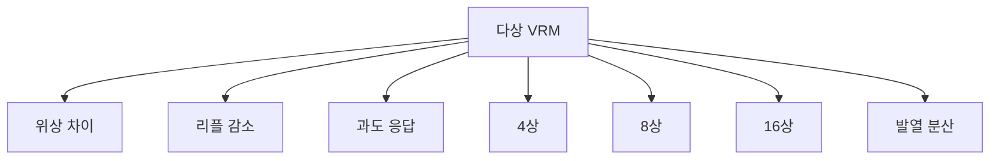

+++
title = "multiphase vrm"
date = "2026-03-14"
weight = 743
+++

# 다상 전원부 (Multi-phase VRM)

#### 핵심 인사이트 (3줄 요약)
> 1. **본질**: 여러 개의 VRM 상(Phase)을 병렬로 연결하여 위상을 서로 다르게 스위칭하는 고효율 전원 설계
> 2. **가치**: 리플 전압 감소, 과도 응답 개선, 전류 분담, 발열 분산, 고효율
> 3. **융합**: PWM 컨트롤러, 게이트 드라이버, MOSFET, 인덕터, VRM과 통합된 전원 아키텍처

---

### Ⅰ. 개요 (Context & Background)

**개념 정의**

다상 전원부(Multi-phase VRM)는 여러 개의 VRM 상(Phase)을 병렬로 연결하여 위상을 서로 다르게 스위칭하는 고효율 전원 설계입니다. 리플 전압을 감소시키고 과도 응답을 개선합니다.

```
┌─────────────────────────────────────────────────────────────────────┐
│                    다상 전원부 구조                                  │
├─────────────────────────────────────────────────────────────────────┤
│                                                                     │
│   ┌──────────────────────────────────────────────────────────────┐ │
│   │              4상 VRM 구조 (4-Phase VRM)                       │ │
│   │                                                              │ │
│   │   12V 입력                                                    │ │
│   │      │                                                       │ │
│   │      ▼                                                       │ │
│   │   ┌─────────────────────────────────────────────────────┐   │ │
│   │   │              PWM 컨트롤러                            │   │ │
│   │   │   ┌─────┐ ┌─────┐ ┌─────┐ ┌─────┐                 │   │ │
│   │   │   │Phase│ │Phase│ │Phase│ │Phase│                 │   │ │
│   │   │   │  1  │ │  2  │ │  3  │ │  4  │                 │   │ │
│   │   │   │ 0°  │ │ 90° │ │180° │ │270° │  위상 차이       │   │ │
│   │   │   └──┬──┘ └──┬──┘ └──┬──┘ └──┬──┘                 │   │ │
│   │   └──────┼───────┼───────┼───────┼─────────────────────┘   │ │
│   │          │       │       │       │                          │ │
│   │          ▼       ▼       ▼       ▼                          │ │
│   │   ┌────────┐ ┌────────┐ ┌────────┐ ┌────────┐              │ │
│   │   │ MOSFET │ │ MOSFET │ │ MOSFET │ │ MOSFET │              │ │
│   │   │ + 인덕터│ │ + 인덕터│ │ + 인덕터│ │ + 인덕터│              │ │
│   │   └────┬───┘ └────┬───┘ └────┬───┘ └────┬───┘              │ │
│   │        │          │          │          │                   │ │
│   │        └──────────┴──────────┴──────────┘                   │ │
│   │                        │                                    │ │
│   │                        ▼                                    │ │
│   │               ┌───────────────┐                             │ │
│   │               │ 출력 캐패시터 │                             │ │
│   │               └───────┬───────┘                             │ │
│   │                       │                                     │ │
│   │                       ▼                                     │ │
│   │                    Vcore (1.2V)                             │ │
│   │                       │                                     │ │
│   │                       ▼                                     │ │
│   │                    ┌─────┐                                  │ │
│   │                    │ CPU │                                  │ │
│   │                    └─────┘                                  │ │
│   │                                                              │ │
│   └──────────────────────────────────────────────────────────────┘ │
│                                                                     │
└─────────────────────────────────────────────────────────────────────┘
```

> **해설**: 각 상(Phase)은 360°/N의 위상 차이로 스위칭합니다. 4상이면 90°씩 차이납니다.

**💡 비유**: 다상 VRM은 여러 명이 돌아가며 일하는 것과 같습니다. 서로 번갈아 가며 쉬면서도 전체 일은 계속됩니다.

**등장 배경**

① **기존 한계**: 단상 VRM → 높은 리플, 느린 응답, 높은 발열
② **혁신적 패러다임**: 다상으로 위상 분산 → 리플 상쇄, 빠른 응답
③ **비즈니스 요구**: 고성능 CPU/GPU, 오버클러킹, 저전력

**📢 섹션 요약 비유**: 다상 VRM은 로테이션 근무 같아요. 여러 명이 돌아가며 일해요!

---

### Ⅱ. 아키텍처 및 핵심 원리 (Deep Dive)

**구성 요소 상세 분석**

| 요소명 | 역할 | 내부 동작 | 비유 |
|:---|:---|:---|:---|
| **PWM 컨트롤러** | 위상 제어 | N상 위상 생성 | 지휘자 |
| **게이트 드라이버** | MOSFET 구동 | 게이트 전압 인가 | 통역사 |
| **MOSFET** | 스위칭 | High/Low 사이드 | 스위치 |
| **인덕터** | 전류 평탄화 | 에너지 저장 | 댐 |
| **캐패시터** | 전압 평탄화 | 리플 감소 | 저수지 |

**다상 VRM의 이점**

```
┌─────────────────────────────────────────────────────────────────────┐
│                    다상 VRM의 이점                                   │
├─────────────────────────────────────────────────────────────────────┤
│                                                                     │
│   ┌──────────────────────────────────────────────────────────────┐ │
│   │              리플 전압 감소                                   │ │
│   │                                                              │ │
│   │   단상 (1-Phase):                                            │ │
│   │   ┌─────────────────────────────────────────────────────┐   │ │
│   │   │ ▲   ▲   ▲   ▲   ▲   ▲   ▲   ▲                     │   │ │
│   │   │ │   │   │   │   │   │   │   │  큰 리플            │   │ │
│   │   │ ▼   ▼   ▼   ▼   ▼   ▼   ▼   ▼                     │   │ │
│   │   └─────────────────────────────────────────────────────┘   │ │
│   │   리플 = Vin × (1-D) × (ESR + ESL)                          │ │
│   │   리플 주파수 = f_sw                                        │ │
│   │                                                              │ │
│   │   4상 (4-Phase):                                             │ │
│   │   ┌─────────────────────────────────────────────────────┐   │ │
│   │   │  ▲ ▲ ▲ ▲ ▲ ▲ ▲ ▲ ▲ ▲ ▲ ▲ ▲ ▲ ▲                   │   │ │
│   │   │  └─┘ └─┘ └─┘ └─┘ └─┘ └─┘ └─┘  작은 리플           │   │ │
│   │   └─────────────────────────────────────────────────────┘   │ │
│   │   리플 감소 비율 ≈ 1/N                                      │ │
│   │   리플 주파수 = N × f_sw (4배 증가)                        │ │
│   │                                                              │ │
│   └──────────────────────────────────────────────────────────────┘ │
│                                                                     │
│   ┌──────────────────────────────────────────────────────────────┐ │
│   │              과도 응답 개선                                   │ │
│   │                                                              │ │
│   │   부하 급증 시:                                              │ │
│   │   - 모든 상이 동시에 대응                                    │ │
│   │   - 전류 공급 능력 N배                                       │ │
│   │   - 전압 강하 최소화                                          │ │
│   │                                                              │ │
│   │   응답 시간:                                                 │ │
│   │   단상: ~수 μs                                               │ │
│   │   N상: ~수 μs / N                                            │ │
│   │                                                              │ │
│   └──────────────────────────────────────────────────────────────┘ │
│                                                                     │
│   ┌──────────────────────────────────────────────────────────────┐ │
│   │              발열 분산                                        │ │
│   │                                                              │ │
│   │   단상: 한 곳에 집중 → 높은 온도                             │ │
│   │   다상: 여러 곳에 분산 → 낮은 온도                           │ │
│   │                                                              │ │
│   │   각 상의 발열 = 전체 발열 / N                               │ │
│   │   → 쿨링 용이                                                 │ │
│   │                                                              │ │
│   └──────────────────────────────────────────────────────────────┘ │
│                                                                     │
└─────────────────────────────────────────────────────────────────────┘
```

> **해설**: 다상 VRM은 리플이 1/N로 감소하고, 과도 응답이 N배 빠르며, 발열이 분산됩니다.

**핵심 알고리즘: 다상 PWM 제어**

```c
// 다상 PWM 제어 (의사코드)
struct MultiPhaseVRM {
    uint8_t  num_phases;       // 상 수 (N)
    float    switching_freq;   // Hz (f_sw)
    float    duty_cycle;       // 0-1
    float    phase_shift[16];  // 각 상의 위상
};

// 위상 설정
void InitializePhaseShifts(struct MultiPhaseVRM *vrm) {
    for (int i = 0; i < vrm->num_phases; i++) {
        vrm->phase_shift[i] = (360.0 / vrm->num_phases) * i;
    }
}

// 4상 예시:
// Phase 1: 0°
// Phase 2: 90°
// Phase 3: 180°
// Phase 4: 270°

// 8상 예시:
// Phase 1: 0°, Phase 2: 45°, Phase 3: 90°, Phase 4: 135°
// Phase 5: 180°, Phase 6: 225°, Phase 7: 270°, Phase 8: 315°

// PWM 출력
void GenerateMultiPhasePWM(struct MultiPhaseVRM *vrm) {
    for (int i = 0; i < vrm->num_phases; i++) {
        float phase_time = vrm->phase_shift[i] / 360.0 / vrm->switching_freq;
        float on_time = phase_time + vrm->duty_cycle / vrm->switching_freq;

        SetPWMOutput(i, on_time);
    }
}

// Linux에서 VRM 상태 확인
// # sensors
// ucsi_source_psy_USBC000:002-isa-0000
// Adapter: ISA adapter
// in0:          12.00 V
// in1:           1.21 V  (Vcore)

// VRM 온도 (메인보드 센서)
// # cat /sys/class/hwmon/hwmon*/temp2_input
// 45000  (45°C = VRM 온도)
```

**📢 섹션 요약 비유**: 다상 PWM은 오케스트라 지휘와 같습니다. 여러 악기(Phase)가 서로 다른 타이밍에 연주합니다.

---

### Ⅲ. 융합 비교 및 다각도 분석 (Comparison & Synergy)

**기술 비교: 상 수에 따른 특성**

| 비교 항목 | 1상 | 4상 | 8상 | 16상 |
|:---|:---:|:---:|:---:|:---:|
| **리플** | 100% | 25% | 12.5% | 6.25% |
| **응답** | 기준 | 4배 | 8배 | 16배 |
| **발열 분산** | 집중 | 4곳 | 8곳 | 16곳 |
| **비용** | 낮음 | 중간 | 높음 | 매우 높음 |
| **용도** | 저가 | 일반 | 고성능 | 오버클럭 |

**과목 융합 관점: 다상 VRM과 타 영역 시너지**

| 융합 영역 | 시너지 효과 | 구현 예시 |
|:---|:---|:---|
| **CPU** | 안정적 전압 | Vcore 공급 |
| **GPU** | 고전류 공급 | 8상 이상 |
| **오버클럭** | 전압 안정성 | 16상+ |
| **서버** | 신뢰성 | 이중화 VRM |
| **모바일** | 저전력 | 적응적 상수 |

**📢 섹션 요약 비유**: 상 수는 인력 수와 같습니다. 많을수록 일이 잘 되지만 비용이 늘어납니다.

---

### Ⅳ. 실무 적용 및 기술사적 판단 (Strategy & Decision)

**실무 시나리오별 적용**

**시나리오 1: 게이밍 메인보드**
- **문제**: 오버클럭 전압 안정성
- **해결**: 16상+ VRM
- **의사결정**: 고품질 VRM

**시나리오 2: 서버**
- **문제**: 안정성
- **해결**: 8상 이중화
- **의사결정**: 이중화 설계

**시나리오 3: 모바일**
- **문제**: 배터리
- **해결**: 적응적 다상
- **의사결정**: 부하별 상수 조절

**도입 체크리스트**

| 구분 | 항목 | 확인 포인트 |
|:---|:---|:---|
| **기술적** | 상수 | 8상 이상 권장 |
| | PWM | 고품질 컨트롤러 |
| | 인덕터 | 합금 인덕터 |
| **운영적** | 모니터링 | VRM 온도 |
| | 쿨링 | 히트싱크 |
| | 전압 | 리플 확인 |

**안티패턴: 다상 VRM 오용 사례**

| 안티패턴 | 문제점 | 올바른 접근 |
|:---|:---|:---|
| **가짜 다상** | 병렬이 아님 | 독립 위상 확인 |
| **부족한 인덕터** | 리플 증가 | 고품질 인덕터 |
| **쿨링 부족** | VRM 과열 | 히트싱크 필수 |
| **모니터링 무시** | 고장 미감지 | 온도 센서 |

**📢 섹션 요약 비유**: 다상 VRM은 단순히 상수만 많다고 좋은 것이 아닙니다. 품질이 중요합니다.

---

### Ⅴ. 기대효과 및 결론 (Future & Standard)

**정량/정성 기대효과**

| 구분 | 1상 | 4상 | 8상 | 개선효과 |
|:---|:---:|:---:|:---:|:---:|
| **리플** | 100mV | 25mV | 12.5mV | -88% |
| **응답** | 10μs | 2.5μs | 1.25μs | 8배 |
| **효율** | 85% | 90% | 92% | +7% |
| **비용** | $5 | $20 | $50 | +900% |

**미래 전망**

1. **디지털 제어:** 실시간 최적화
2. **적응적 상수:** 부하별 상수 변경
3. **GaN MOSFET:** 고효율/고주파
4. **AI 튜닝:** 자동 최적화

**참고 표준**

| 표준 | 내용 | 적용 |
|:---|:---|:---|
| **Intel VRD** | 전압 규격 | Intel CPU |
| **AMD SVI** | 전압 규격 | AMD CPU |
| **PWM IC** | 컨트롤러 | 일반 |
| **TI/Infineon** | MOSFET | 부품 |

**📢 섹션 요약 비유**: 다상 VRM의 미래는 AI가 제어합니다. 실시간으로 최적 상수를 선택합니다.

---

### 📌 관련 개념 맵 (Knowledge Graph)



**연관 개념 링크**:
- VRM - 전압 조정기 모듈
- LLC - Load Line Calibration
- 과전압 보호 OVP - 보호 회로
- P-States - 전압 제어

---

### 👶 어린이를 위한 3줄 비유 설명

1. **로테이션 근무**: 다상 VRM은 로테이션 근무 같아요. 여러 명이 돌아가며 일해요!

2. **위상 차이**: 한 명씩 순서대로 일해요. 서로 안 겹쳐요!

3. **물 분담**: 큰 물을 여러 명이 나눠서 나르면 쉬워요!